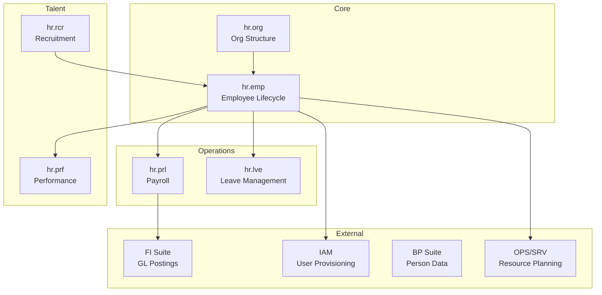
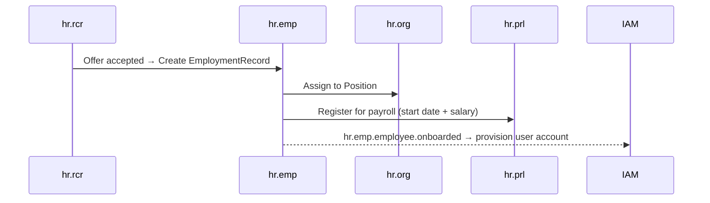
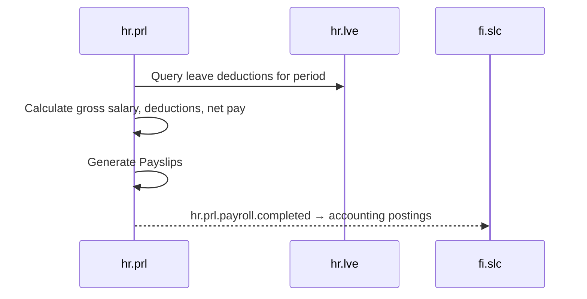

# Human Resources (HR) Suite Specification

> **Conceptual Stack Layer:** Suite
> **Space:** Platform
> **Owner:** HR Domain Engineering Team
> **Schema alignment:** `suite-layer.schema.json`
> **Companion files:** `hr.catalog.uvl` (referenced in SS6)
> **Contains:** Domain/Service Specs, Platform-Feature Specs, Feature Catalog

> **Meta Information**
> - **Version:** 2026-04-04
> - **Template:** `suite-spec.md` v1.0.0
> - **Template Compliance:** ~96% — fully compliant
> - **Author(s):** OpenLeap Architecture Team
> - **Status:** DRAFT
> - **Suite ID:** `hr`
> - **Suite Name:** Human Resources
> - **Description:** End-to-end human resources management suite covering employee lifecycle, payroll processing, leave management, recruitment, performance evaluation, and organizational structure.
> - **Semantic Version:** `1.0.0`
> - **Team:**
>   - Name: `team-hr`
>   - Email: `hr-team@openleap.io`
>   - Slack: `#hr-team`
> - **Bounded Contexts:** `bc:employee-lifecycle`, `bc:payroll`, `bc:leave-management`, `bc:recruitment`, `bc:performance`, `bc:org-structure`

---

## Specification Guidelines

> **This specification MUST comply with the OpenLeap specification guidelines.**
>
> ### Non-Negotiables
> - Never invent facts. If required info is missing, add an **OPEN QUESTION** entry.
> - Preserve intent and decisions. Only change meaning when explicitly requested.
> - Keep the spec **self-contained**: no "see chat", no implicit context.

---

## 0. Suite Identity & Purpose

### 0.1 Suite Identity

| Field | Value |
|-------|-------|
| id | `hr` |
| name | Human Resources |
| description | End-to-end human resources management suite covering employee lifecycle, payroll processing, leave management, recruitment, performance evaluation, and organizational structure. |
| version | `1.0.0` |
| status | `draft` |
| owner.team | `team-hr` |
| owner.email | `hr-team@openleap.io` |
| owner.slack | `#hr-team` |
| boundedContexts | `bc:employee-lifecycle`, `bc:payroll`, `bc:leave-management`, `bc:recruitment`, `bc:performance`, `bc:org-structure` |

### 0.2 Business Purpose

The Human Resources (HR) Suite provides **comprehensive workforce management capabilities** for the OpenLeap ERP platform. It manages the full employee lifecycle from recruitment through onboarding, employment, performance management, and offboarding. It handles payroll calculation and processing, leave entitlements and requests, organizational hierarchy management, and recruits talent through structured hiring pipelines.

HR is the **system of record for employment relationships** in OpenLeap. It integrates with:
- **FI suite** for payroll accounting (salary postings to GL)
- **BP suite** for individual employee data reuse where applicable
- **OPS/SRV suites** for workforce planning and resource allocation
- **IAM** for user provisioning triggered by onboarding/offboarding

### 0.3 In Scope

- **Employee Lifecycle:** Employment record creation, status management (active, on leave, terminated), position assignments, contract management
- **Payroll Processing:** Salary calculation, deduction management, payroll runs, payslip generation, statutory compliance (tax, social security)
- **Leave Management:** Leave type configuration, leave request/approval workflows, leave balance tracking, public holiday calendars
- **Recruitment:** Job posting management, application tracking, interview scheduling, offer management, onboarding initiation
- **Performance Management:** Goal setting, performance review cycles, competency assessments, feedback collection, rating calibration
- **Organizational Structure:** Org chart management, department/team hierarchy, position catalog, reporting relationships
- **Time & Attendance** (Phase 2): Timesheet recording, attendance tracking, overtime calculation

### 0.4 Out of Scope

- Financial accounting for payroll postings (→ FI suite, fi.gl / fi.slc)
- Customer or vendor master data (→ BP suite)
- Service delivery execution (→ OPS/SRV suites)
- IT access/permission management beyond IAM provisioning triggers (→ IAM)
- Benefits administration platforms (→ external specialized systems; HR stores policy refs)
- Legal employment contracts document storage (→ DMS; HR stores references)
- Travel expense management (→ separate expense module or external)

### 0.5 Target Users

| Role | Interest |
|------|----------|
| HR Manager | Employee lifecycle management, payroll oversight, compliance |
| HR Business Partner | Performance reviews, organizational changes, talent management |
| Payroll Specialist | Payroll runs, deduction management, tax compliance |
| Recruiter | Job postings, candidate management, interview coordination |
| Line Manager | Team structure, leave approvals, performance reviews for direct reports |
| Employee (Self-Service) | Leave requests, payslip access, performance goals, personal data |
| Finance Controller | Payroll accounting integration, cost center allocation |

### 0.6 Business Value

- **Compliance:** Statutory payroll compliance (tax, social security) reduces regulatory risk
- **Efficiency:** Automated leave tracking and approval workflows eliminate manual HR administration
- **Talent Attraction:** Structured recruitment pipeline with ATS capabilities improves hiring speed
- **Performance Culture:** Systematic review cycles and goal tracking build accountability
- **Org Transparency:** Clear org structure and position catalog supports workforce planning
- **Data Integrity:** Single employee record of truth prevents fragmented HR data across systems

---

## 1. Ubiquitous Language

### 1.1 Glossary

| ID | Term | Aliases | Definition |
|----|------|---------|------------|
| hr:glossary:employee | Employee | Staff Member | A person in an active employment relationship with the organization. The Employee aggregate is HR's central entity. |
| hr:glossary:employment-record | EmploymentRecord | Employment Contract | The formal record of an employee's employment relationship including start date, position, salary, contract type, and status. |
| hr:glossary:position | Position | Job Position | A defined role in the organization with a job title, grade, department assignment, and FTE capacity. One position may be held by one employee. |
| hr:glossary:department | Department | Org Unit | An organizational unit in the company hierarchy. Departments form a tree (org chart). |
| hr:glossary:payroll-run | PayrollRun | Payroll Period | A monthly (or periodic) calculation of all salaries, deductions, and net pay for all eligible employees. |
| hr:glossary:payslip | Payslip | Pay Statement | A document generated per employee per PayrollRun showing gross pay, deductions, and net pay. |
| hr:glossary:leave-request | LeaveRequest | Absence Request | An employee's request for time off against a LeaveType (vacation, sick, parental, etc.) requiring manager approval. |
| hr:glossary:leave-balance | LeaveBalance | Leave Entitlement | The remaining leave days available to an employee for a specific LeaveType in a given year. |
| hr:glossary:leave-type | LeaveType | Absence Type | A configured category of leave (vacation, sick, parental, unpaid, public holiday) with entitlement rules. |
| hr:glossary:job-opening | JobOpening | Vacancy | An open position in the org for which recruitment is active. |
| hr:glossary:candidate | Candidate | Applicant | An external person applying for a JobOpening or a talent pipeline entry. |
| hr:glossary:performance-review | PerformanceReview | Review Cycle | A structured evaluation of an employee's performance over a period, typically annual or semi-annual. |
| hr:glossary:goal | Goal | OKR | A measurable objective assigned to an employee or team within a performance period. |
| hr:glossary:org-chart | OrgChart | Organization Chart | The visual and data representation of the department and reporting hierarchy. |
| hr:glossary:fte | FTE | Full-Time Equivalent | A unit representing one full-time position; part-time positions are expressed as FTE fractions (e.g., 0.5 FTE). |

### 1.2 UBL Boundary Test

**HR vs. FI (Finance):**
In HR, a `PayrollRun` calculates net salaries, deductions, and employer contributions — it is the HR calculation source. In FI, the same payroll produces `JournalEntries` in the GL (salary expense, liability accounts). HR owns the calculation; FI owns the accounting. HR publishes payroll events that fi.slc converts to GL postings.

**HR vs. OPS/SRV:**
In HR, an `Employee` is a workforce record with employment status, leave balances, and salary. In OPS/SRV, the same person appears as a `Resource` (with skills, availability, and assignment capacity). HR is the authoritative identity and employment data source; OPS/SRV consume HR employee IDs as foreign keys.

---

## 2. HR Domain Architecture

### 2.1 Domain Overview

### 2.2 Domain Responsibility Matrix

| Domain | Service ID | Core Responsibility |
|--------|-----------|---------------------|
| hr.emp | `hr-emp-svc` | Employee lifecycle, employment records, contracts |
| hr.org | `hr-org-svc` | Org chart, departments, positions, reporting lines |
| hr.prl | `hr-prl-svc` | Payroll calculation, deductions, payslips, GL events |
| hr.lve | `hr-lve-svc` | Leave types, balances, requests, approvals |
| hr.rcr | `hr-rcr-svc` | Job openings, applications, candidates, hiring pipeline |
| hr.prf | `hr-prf-svc` | Performance reviews, goals, feedback, ratings |

---

## 3. HR Domain Catalog

### 3.1 Core Domains

| # | Domain | Service ID | Status | Spec |
|---|--------|-----------|--------|------|
| 1 | **hr.emp** | `hr-emp-svc` | P1 Core | `domain-specs/hr_emp-spec.md` |
| 2 | **hr.org** | `hr-org-svc` | P1 Core | `domain-specs/hr_org-spec.md` |
| 3 | **hr.prl** | `hr-prl-svc` | P1 Core | `domain-specs/hr_prl-spec.md` |
| 4 | **hr.lve** | `hr-lve-svc` | P1 Core | `domain-specs/hr_lve-spec.md` |
| 5 | **hr.rcr** | `hr-rcr-svc` | P2 | `domain-specs/hr_rcr-spec.md` |
| 6 | **hr.prf** | `hr-prf-svc` | P2 | `domain-specs/hr_prf-spec.md` |

### 3.2 API Base Paths

| Domain | Base Path | Port |
|--------|-----------|------|
| hr.emp | `/api/hr/emp/v1` | 8301 |
| hr.org | `/api/hr/org/v1` | 8302 |
| hr.prl | `/api/hr/prl/v1` | 8303 |
| hr.lve | `/api/hr/lve/v1` | 8304 |
| hr.rcr | `/api/hr/rcr/v1` | 8305 |
| hr.prf | `/api/hr/prf/v1` | 8306 |

---

## 4. Cross-Domain Integration Patterns

### 4.1 Key Event Flows

#### Employee Onboarding (Hiring → Active Employee)

#### Monthly Payroll Run

### 4.2 Inbound Events from External Suites

| Source | Event | Consumer | Purpose |
|--------|-------|----------|---------|
| IAM | `iam.user.deactivated` | hr.emp | Cross-check with termination status |
| OPS/SRV | `ops.resource.assignment` | hr.emp | Cross-validate availability |

### 4.3 Outbound Events to External Suites

| Consumer | Event | Purpose |
|----------|-------|---------|
| FI | `hr.prl.payroll.completed` | GL salary postings |
| IAM | `hr.emp.employee.onboarded` | User provisioning |
| IAM | `hr.emp.employee.terminated` | User deactivation |
| OPS/SRV | `hr.emp.employee.updated` | Resource record sync |

---

## 5. Event Conventions

### 5.1 Routing Key Pattern

`hr.{domain}.{aggregate}.{event}`

### 5.2 Key Events

| Domain | Key Events |
|--------|-----------|
| hr.emp | `employee.onboarded`, `employee.transferred`, `employee.terminated` |
| hr.org | `department.created`, `position.filled`, `org.restructured` |
| hr.prl | `payroll.run.started`, `payroll.completed`, `payslip.generated` |
| hr.lve | `leave.request.submitted`, `leave.request.approved`, `leave.request.rejected` |
| hr.rcr | `job-opening.published`, `candidate.hired`, `offer.accepted` |
| hr.prf | `review.started`, `review.completed`, `goal.set` |

---

## 6. Feature Catalog

Full catalog in `hr.catalog.uvl`. Feature compositions in `features/compositions/`.

| Feature ID | Name | Type | Domain Coverage |
|------------|------|------|-----------------|
| F-HR-001 | Employee Management | COMPOSITION | hr.emp, hr.org |
| F-HR-002 | Payroll & Leave | COMPOSITION | hr.prl, hr.lve |
| F-HR-003 | Talent Management | COMPOSITION | hr.rcr, hr.prf |

---

## 7. Cross-Cutting Concerns

### 7.1 Privacy & GDPR

Employee data is among the most sensitive PII. HR MUST:
- Apply field-level access control on salary data (visible only to HR roles + direct manager + employee themselves)
- Implement right-to-erasure workflow for terminated employees after retention period
- Log all access to salary and performance data in audit trail
- Comply with local data retention regulations (varies by country)

### 7.2 Multi-Country Payroll

Payroll rules (tax bands, social security rates, minimum wage) vary per country. HR MUST:
- Support country-specific payroll calculation modules
- Manage statutory deduction tables per country/year
- Generate country-specific payslip formats

### 7.3 Org Hierarchy Depth

Org chart MUST support unlimited depth (flat to deeply hierarchical orgs). Position and department queries MUST return full ancestor path for breadcrumb navigation.

---

## 8. External Interfaces

### 8.1 Inbound Integrations

| Source | Protocol | Purpose |
|--------|----------|---------|
| IAM | Event | User deactivation for offboarding sync |
| External Job Boards | Webhook | Inbound candidate applications to hr.rcr |
| External Payroll Providers | REST (Phase 2) | Payroll calculation handoff for complex country rules |

### 8.2 Outbound Integrations

| Target | Protocol | Purpose |
|--------|----------|---------|
| FI (fi.slc) | Event | Payroll accounting events |
| IAM | Event | User provisioning/deactivation |
| DMS | REST | Employment document storage references |
| Notification Service | Event | Leave approval notifications, review reminders |
| External Job Boards | REST | Job opening publication |

---

## 9. Architecture Decisions

### ADR-HR-001: Employee is the central aggregate; org structure is a separate domain

**Status:** Accepted  
**Decision:** hr.emp owns the employment relationship. hr.org owns the organizational hierarchy. Employee references Position by ID; org structure changes do not modify Employee records directly.  
**Consequences:** Org restructuring does not cascade-update employee records; only position assignments change.

### ADR-HR-002: Payroll generates accounting events for fi.slc — HR does not post GL directly

**Status:** Accepted  
**Decision:** hr.prl publishes `payroll.completed` event consumed by fi.slc for GL posting. HR never writes to GL directly.  
**Consequences:** FI owns all accounting; HR owns calculation. Clean separation.

### ADR-HR-003: Leave balances are managed per calendar year, not rolling

**Status:** Accepted (OPEN QUESTION: regional exceptions?)  
**Decision:** Leave balances reset at calendar year start. Carry-over limits are configurable per LeaveType.  
**Consequences:** Simpler calculation; carry-over rules must be configured.

### ADR-HR-004: Recruitment produces an employee onboarding trigger, not a direct employee record

**Status:** Accepted  
**Decision:** When a candidate accepts an offer in hr.rcr, an `offer.accepted` event triggers hr.emp to create the EmploymentRecord. hr.rcr does not own Employee data.  
**Consequences:** Clean separation between talent acquisition and employment.

---

## 10. Implementation Roadmap

### Phase 1 (Weeks 1–16): Core HR
- hr.org: Org chart, departments, positions
- hr.emp: Employee lifecycle, employment records, onboarding/offboarding
- hr.lve: Leave types, balances, requests/approvals
- IAM integration for user provisioning

### Phase 2 (Weeks 17–28): Payroll & Talent
- hr.prl: Payroll calculation, deductions, payslips, FI integration
- hr.rcr: Job openings, candidate management, hiring pipeline
- hr.prf: Performance reviews, goals, feedback

### Phase 3 (Weeks 29+): Advanced
- Time & attendance (hr.tms)
- Multi-country payroll compliance modules
- External job board integrations
- Manager self-service reporting

---

## 11. Open Questions

| ID | Question | Priority |
|----|----------|----------|
| OQ-HR-001 | Which countries are in scope for payroll compliance in v1? | CRITICAL |
| OQ-HR-002 | Is a single multi-tenant HR instance used or per-company deployment? | HIGH |
| OQ-HR-003 | How is manager self-service scoped — can managers see team salary data? | HIGH |
| OQ-HR-004 | Leave carry-over policy — global or per-country per-LeaveType? | MEDIUM |
| OQ-HR-005 | ATS integration with external job boards — which providers in scope? | MEDIUM |
| OQ-HR-006 | Performance review calibration process — single calibrator or committee? | LOW |
