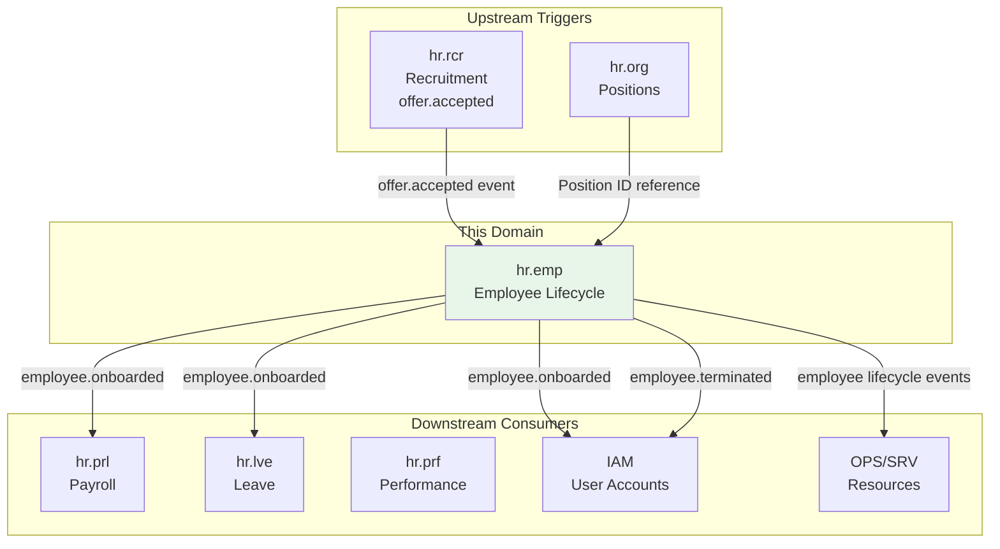
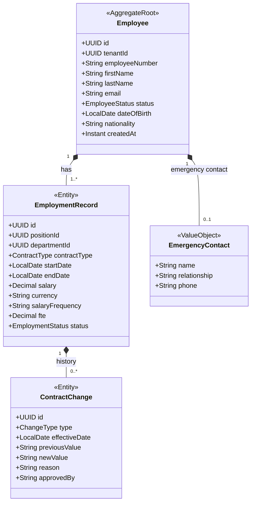

# HR - Employee Lifecycle (emp) Domain / Service Specification

> **Conceptual Stack Layer:** Domain / Service
> **Space:** Platform
> **Owner:** HR Domain Engineering Team
> **Schema alignment:** `service-layer.schema.json`
> **Companion files:** `contracts/http/hr/emp/openapi.yaml`, `contracts/events/hr/emp/*.schema.json`
> **Belongs to:** HR Suite Spec (`_hr_suite.md`)

> **Meta Information**
> - **Version:** 2026-04-04
> - **Template:** `domain-service-spec.md` v1.0.0
> - **Template Compliance:** ~92%
> - **Author(s):** OpenLeap Architecture Team
> - **Status:** DRAFT
> - **Suite:** `hr`
> - **Domain:** `emp`
> - **Bounded Context Ref:** `bc:employee-lifecycle`
> - **Service ID:** `hr-emp-svc`
> - **basePackage:** `io.openleap.hr.emp`
> - **API Base Path:** `/api/hr/emp/v1`
> - **Port:** `8301`
> - **Repository:** `io.openleap.hr.emp`
> - **Tags:** `hr`, `employee`, `lifecycle`, `onboarding`, `offboarding`

---

## 0. Document Purpose & Scope

### 0.1 Purpose

`hr.emp` is the **central domain of the HR suite** and the **system of record for employment relationships**. It manages the full employee lifecycle: onboarding, employment record management, position assignments, transfers, and offboarding. It is the authoritative source of "who works here, in what capacity, and since when."

### 0.2 Scope

**In Scope (MUST):**
- Create and manage EmploymentRecord aggregates (the core of HR.EMP)
- Manage employee lifecycle status: ONBOARDING → ACTIVE → ON_LEAVE → SUSPENDED → TERMINATED
- Assign employees to positions (from hr.org)
- Record contract changes (salary changes, role changes, contract type)
- Trigger IAM provisioning on onboarding and deprovisioning on termination
- Emit events for downstream consumers (hr.prl, hr.lve, hr.prf, OPS/SRV, IAM)
- Employee self-service data access (view own employment record)

**Out of Scope (MUST NOT):**
- Org chart and position definitions (→ hr.org)
- Payroll calculation (→ hr.prl)
- Leave tracking and approvals (→ hr.lve)
- Recruitment and hiring pipeline (→ hr.rcr)
- Performance reviews (→ hr.prf)
- IAM account creation (→ IAM; triggered by hr.emp events, not owned by hr.emp)

---

## 1. Business Context

### 1.1 Domain Purpose

`hr.emp` ensures that the organization always has a single, authoritative record of employment — who works here, what they earn, what position they hold, and what their employment status is. All HR operations reference this central record.

### 1.2 Business Value

- Single source of truth for employment eliminates fragmented HR data
- Lifecycle events drive automatic provisioning/deprovisioning in IAM
- Employment records feed payroll and leave with authoritative salary and status data
- Complete employment history supports compliance audits

### 1.3 Stakeholders

| Role | Responsibility |
|------|----------------|
| HR Manager | Create/update employment records, manage lifecycle transitions |
| HR Business Partner | Record org changes, salary adjustments |
| Employee | View own employment record, payslips |
| Line Manager | View team employment data (limited) |
| Finance Controller | Access salary data for cost center reporting |
| Auditor | Employment history compliance verification |

### 1.4 Strategic Positioning



---

## 2. Service Identity

| Property | Value |
|----------|-------|
| **Service ID** | `hr-emp-svc` |
| **Suite** | `hr` |
| **Domain** | `emp` |
| **Bounded Context** | `bc:employee-lifecycle` |
| **API Base Path** | `/api/hr/emp/v1` |
| **Port** | `8301` |

---

## 3. Domain Model

### 3.1 Aggregate Overview



### 3.2 EmployeeStatus State Machine

```
ONBOARDING → ACTIVE → ON_LEAVE → ACTIVE
ACTIVE → SUSPENDED → ACTIVE (if suspension resolved)
ACTIVE|SUSPENDED → TERMINATED
```

### 3.3 ContractType Enumeration

| Value | Description |
|-------|-------------|
| PERMANENT | Indefinite employment contract |
| FIXED_TERM | Employment for defined period |
| PART_TIME | Part-time permanent employment |
| INTERN | Internship or student contract |
| FREELANCE | Self-employed / contractor engagement |

---

## 4. Business Rules & Constraints

| ID | Rule | Severity |
|----|------|----------|
| BR-EMP-001 | Employee number MUST be unique within tenant | HARD |
| BR-EMP-002 | EmploymentRecord MUST reference a valid position from hr.org | HARD |
| BR-EMP-003 | Salary MUST NOT be visible to employees other than themselves and authorized HR/Finance roles | HARD |
| BR-EMP-004 | Employee MUST NOT be deleted — only TERMINATED with effective date | HARD |
| BR-EMP-005 | Termination MUST trigger `employee.terminated` event (for IAM deprovisioning) | HARD |
| BR-EMP-006 | Onboarding MUST trigger `employee.onboarded` event (for IAM provisioning) | HARD |
| BR-EMP-007 | Salary changes MUST record a ContractChange with effective date, reason, and approver | HARD |
| BR-EMP-008 | FTE MUST be between 0.1 and 1.0 | HARD |
| BR-EMP-009 | Employment start date MUST NOT be before company founding date (OPEN QUESTION: enforce?) | SOFT |

---

## 5. Use Cases

### UC-EMP-001: Onboard Employee (from Recruitment)

**Trigger:** `hr.rcr.offer.accepted` event
**Flow:**
1. Create Employee aggregate with personal data
2. Create EmploymentRecord with position, salary, start date
3. Assign to department via hr.org position reference
4. Set status → ONBOARDING
5. On start date: auto-transition → ACTIVE
6. Emit `hr.emp.employee.onboarded` (triggers IAM provisioning)

### UC-EMP-002: Manual Employee Creation

**Trigger:** HR Manager creates employee via UI
**Flow:**
1. HR Manager fills in employee data and employment terms
2. System generates unique employee number
3. Create Employee + EmploymentRecord
4. Emit `hr.emp.employee.onboarded`

### UC-EMP-003: Record Salary Change

**Trigger:** HR Manager submits salary change
**Flow:**
1. Validate approver has salary-change permission
2. Create ContractChange record (type=SALARY, previousSalary, newSalary, effectiveDate, reason)
3. Update EmploymentRecord salary on effectiveDate
4. Emit `hr.emp.employee.updated`
5. hr.prl processes salary update on next payroll run

### UC-EMP-004: Terminate Employee

**Trigger:** HR Manager records termination
**Flow:**
1. Record termination reason and effective date
2. Set EmploymentRecord.endDate = effectiveDate
3. Set Employee.status → TERMINATED
4. Emit `hr.emp.employee.terminated` (triggers IAM deprovisioning)
5. Trigger hr.lve to cancel pending leave requests
6. Trigger hr.prl to finalize last payroll

### UC-EMP-005: Transfer Employee to New Department/Position

**Trigger:** HR Manager records transfer
**Flow:**
1. Create new EmploymentRecord for new position (old record remains historical)
2. Record ContractChange (type=TRANSFER)
3. Emit `hr.emp.employee.transferred`

---

## 6. REST API

**Base Path:** `/api/hr/emp/v1`

| Method | Path | Description |
|--------|------|-------------|
| GET | `/employees` | List employees (HR roles only) |
| GET | `/employees/{id}` | Get employee detail |
| POST | `/employees` | Create employee (HR roles) |
| PATCH | `/employees/{id}` | Update employee data |
| GET | `/employees/{id}/employment-records` | Employment history |
| POST | `/employees/{id}/contract-changes` | Record contract change |
| POST | `/employees/{id}:terminate` | Terminate employee |
| POST | `/employees/{id}:transfer` | Transfer to new position |
| GET | `/employees/{id}/salary` | Get salary (restricted access) |
| GET | `/employees/me` | Self-service — own employee record |

---

## 7. Events & Integration

### 7.1 Outbound Events

| Event | Routing Key | Key Payload |
|-------|-------------|-------------|
| employee.onboarded | `hr.emp.employee.onboarded` | employeeId, employeeNumber, positionId, startDate |
| employee.updated | `hr.emp.employee.updated` | employeeId, changeType, effectiveDate |
| employee.transferred | `hr.emp.employee.transferred` | employeeId, fromPositionId, toPositionId |
| employee.terminated | `hr.emp.employee.terminated` | employeeId, terminationDate, reason |
| employee.status.changed | `hr.emp.employee.status.changed` | employeeId, previousStatus, newStatus |

### 7.2 Inbound Events

| Source | Event | Action |
|--------|-------|--------|
| hr.rcr | `hr.rcr.offer.accepted` | Trigger onboarding (UC-EMP-001) |

---

## 8. Data Model

### 8.1 Tables (prefix: `emp_`)

**`emp_employee`** — Employee personal data (PII)  
**`emp_employment_record`** — Employment terms and status  
**`emp_contract_change`** — Immutable change history  
**`emp_emergency_contact`** — Emergency contact data  

**Key constraints:**
- UNIQUE: `(tenant_id, employee_number)` on `emp_employee`
- Salary data in dedicated columns with column-level encryption (OPEN QUESTION: encryption strategy)
- Full audit log for all salary field access

---

## 9. Security & Compliance

| Role | Permissions |
|------|-------------|
| `HR_EMP_VIEWER` | Read employee list (no salary) |
| `HR_EMP_SALARY_VIEWER` | Read salary data (HR + Finance roles) |
| `HR_EMP_EDITOR` | Create/update employees |
| `HR_EMP_TERMINATOR` | Execute termination workflow |
| `HR_EMP_SELF` | Read own employee record including salary |

**GDPR:** Employee data is GDPR-regulated. Right-to-erasure is handled by anonymizing terminated employee records after legal retention period.

---

## 10. Quality Attributes

- Employee list: < 200ms for 10,000 employees
- Salary data access: logged to audit trail on every read
- Availability: 99.9% (blocking path for onboarding/offboarding)

---

## 11. Feature Dependencies

| Feature | Dependency |
|---------|-----------|
| F-HR-001 (Employee Management) | Requires hr.org (positions), IAM |

---

## 12. Extension Points

- **Time & Attendance Integration:** hr.emp feeds resource availability to future hr.tms
- **Benefits Enrollment:** Benefits election linked to employment record
- **Background Check Integration:** Webhook from background check provider during ONBOARDING

---

## 13. Migration & Evolution

- **Legacy migration:** Import existing employee data with status ACTIVE; employment records reconstructed from historical payroll data
- **v2.0:** Field-level encryption for salary data, GDPR erasure workflow automation

---

## 14. Decisions & Open Questions

### Decisions
- **DEC-EMP-001:** Employee records are never hard-deleted — TERMINATED status with retention management
- **DEC-EMP-002:** Salary changes require ContractChange record with approver — no silent salary updates
- **DEC-EMP-003:** IAM provisioning triggered by events from hr.emp (not direct API calls)

### Open Questions
- **OQ-HR-001:** Which countries are in scope for v1? (Affects required fields and statutory data)
- **OQ-HR-002:** Is employee number auto-generated or HR-assigned?
- **OQ-EMP-001:** Column-level encryption strategy for salary data?
- **OQ-EMP-002:** How is salary visible to line managers — yes/no/range-only?

---

## 15. Appendix

### 15.1 EmployeeStatus Reference

| Status | Description |
|--------|-------------|
| ONBOARDING | Pre-start, systems being set up |
| ACTIVE | Actively employed |
| ON_LEAVE | On approved extended leave (parental, sabbatical) |
| SUSPENDED | Employment temporarily suspended |
| TERMINATED | Employment ended |

### 15.2 ContractChangeType Reference

| Type | Description |
|------|-------------|
| SALARY_CHANGE | Salary adjustment (increase, correction) |
| PROMOTION | Position and/or salary change due to promotion |
| TRANSFER | Move to different department/position |
| CONTRACT_EXTENSION | Fixed-term contract extended |
| HOURS_CHANGE | FTE adjustment |
| TITLE_CHANGE | Job title change without position change |
