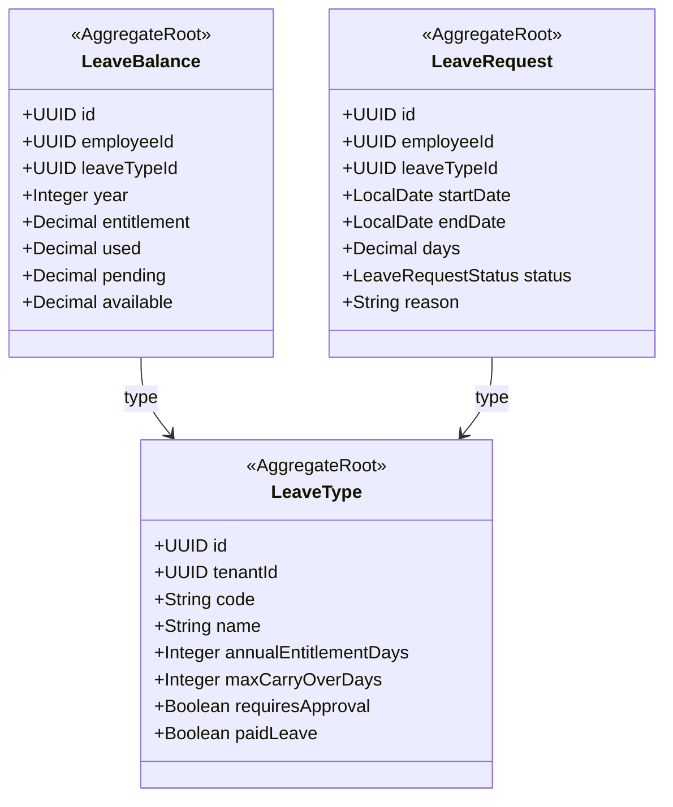

# HR - Leave Management (lve) Domain / Service Specification

> **Meta Information**
> - **Version:** 2026-04-04
> - **Template:** `domain-service-spec.md` v1.0.0
> - **Template Compliance:** ~90%
> - **Author(s):** OpenLeap Architecture Team
> - **Status:** DRAFT
> - **Suite:** `hr`
> - **Domain:** `lve`
> - **Bounded Context Ref:** `bc:leave-management`
> - **Service ID:** `hr-lve-svc`
> - **API Base Path:** `/api/hr/lve/v1`
> - **Port:** `8304`
> - **Tags:** `hr`, `leave`, `absence`, `vacation`, `approval`

---

## 0. Purpose & Scope

**Purpose:** `hr.lve` manages **leave entitlements, requests, and approvals**. It tracks leave balances per employee per leave type, processes leave requests through an approval workflow, and deducts from balances upon approval.

**In Scope:** LeaveType configuration, leave balance initialization and tracking, leave request lifecycle (draft → submitted → approved/rejected), public holiday calendars per country, leave deductions from payroll (signals to hr.prl).

**Out of Scope:** Employee master data (→ hr.emp), payroll calculation (→ hr.prl), time and attendance (→ hr.tms Phase 2).

---

## 1. Domain Model

### LeaveRequestStatus
`DRAFT → SUBMITTED → APPROVED / REJECTED`

---

## 2. Business Rules

| ID | Rule | Severity |
|----|------|----------|
| BR-LVE-001 | Leave request MUST NOT exceed available balance | HARD |
| BR-LVE-002 | Approved leave MUST deduct from LeaveBalance immediately | HARD |
| BR-LVE-003 | Rejection MUST restore pending balance | HARD |
| BR-LVE-004 | Carry-over MUST NOT exceed LeaveType.maxCarryOverDays | HARD |
| BR-LVE-005 | Public holidays MUST be excluded from leave day calculation | HARD |
| BR-LVE-006 | Leave balance MUST reset at calendar year start (with carry-over applied) | HARD |
| BR-LVE-007 | Terminated employees' pending requests MUST be auto-cancelled | HARD |

---

## 3. Key Use Cases

- **UC-LVE-001:** Initialize leave balances for new employee (triggered by `hr.emp.employee.onboarded`)
- **UC-LVE-002:** Submit leave request
- **UC-LVE-003:** Approve/reject leave request (manager or HR)
- **UC-LVE-004:** Year-end balance reset with carry-over
- **UC-LVE-005:** Cancel pending requests for terminated employee
- **UC-LVE-006:** Leave deduction signal to hr.prl for unpaid leave

---

## 4. REST API

| Method | Path | Description |
|--------|------|-------------|
| GET | `/leave-types` | List configured leave types |
| GET | `/balances/{employeeId}` | Employee leave balances |
| POST | `/requests` | Submit leave request |
| GET | `/requests` | List requests (own + team for managers) |
| POST | `/requests/{id}:approve` | Approve (manager/HR) |
| POST | `/requests/{id}:reject` | Reject with reason |
| POST | `/requests/{id}:cancel` | Cancel pending request |

---

## 5. Events

**Outbound:** `hr.lve.leave.approved`, `hr.lve.leave.rejected`, `hr.lve.leave.cancelled`
**Inbound:** `hr.emp.employee.onboarded` → initialize balances; `hr.emp.employee.terminated` → cancel pending

---

## 6. Data Model

**Tables (prefix: `lve_`):** `lve_leave_type`, `lve_leave_balance`, `lve_leave_request`, `lve_public_holiday`

---

## 7. Open Questions

- **OQ-LVE-001:** Partial-day leave (half-day requests) — required for v1?
- **OQ-LVE-002:** Multi-level approval (manager + HR) — required or manager only?
- **OQ-LVE-003:** Country-specific public holiday calendars — which countries in scope?
