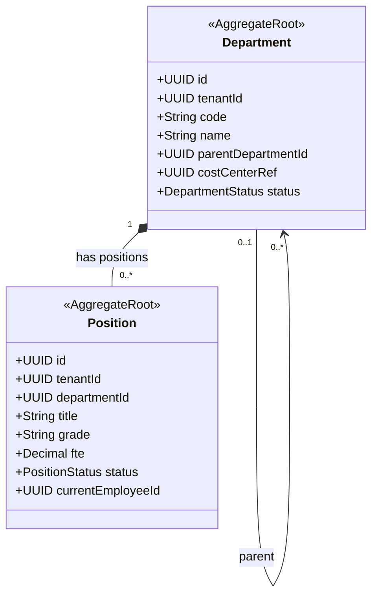

# HR - Organizational Structure (org) Domain / Service Specification

> **Meta Information**
> - **Version:** 2026-04-04
> - **Template:** `domain-service-spec.md` v1.0.0
> - **Template Compliance:** ~90%
> - **Author(s):** OpenLeap Architecture Team
> - **Status:** DRAFT
> - **Suite:** `hr`
> - **Domain:** `org`
> - **Bounded Context Ref:** `bc:org-structure`
> - **Service ID:** `hr-org-svc`
> - **basePackage:** `io.openleap.hr.org`
> - **API Base Path:** `/api/hr/org/v1`
> - **Port:** `8302`
> - **Tags:** `hr`, `org-chart`, `departments`, `positions`

---

## 0. Purpose & Scope

**Purpose:** `hr.org` owns the **organizational hierarchy** — departments, teams, positions, and reporting relationships. It is the structural backbone that hr.emp references for position assignments.

**In Scope:** Department/team tree management, position catalog (job titles, grades, FTE capacity), reporting line configuration, org chart queries, position vacancy tracking.

**Out of Scope:** Employee personal data (→ hr.emp), payroll (→ hr.prl), leave (→ hr.lve).

---

## 1. Domain Model

### Position Status
- `OPEN` — Vacant, available for hiring
- `FILLED` — Has an active employee assigned
- `ON_HOLD` — Not actively recruiting

---

## 2. Service Identity

| Property | Value |
|----------|-------|
| **Service ID** | `hr-org-svc` |
| **API Base Path** | `/api/hr/org/v1` |
| **Port** | `8302` |

---

## 3. Business Rules

| ID | Rule | Severity |
|----|------|----------|
| BR-ORG-001 | Department code MUST be unique within tenant | HARD |
| BR-ORG-002 | Department tree MUST NOT have circular references | HARD |
| BR-ORG-003 | Position MUST belong to exactly one Department | HARD |
| BR-ORG-004 | Position FTE MUST be 0.1–1.0 | HARD |
| BR-ORG-005 | Position MUST NOT have more employees than FTE capacity allows | HARD |

---

## 4. Key Use Cases

- **UC-ORG-001:** Create/update department tree
- **UC-ORG-002:** Create/update position catalog
- **UC-ORG-003:** Mark position as FILLED when employee assigned (event from hr.emp)
- **UC-ORG-004:** Get org chart (subtree from given department)
- **UC-ORG-005:** Query vacancy report (open positions)

---

## 5. REST API

| Method | Path | Description |
|--------|------|-------------|
| GET | `/departments` | List departments |
| GET | `/departments/{id}/tree` | Org chart subtree |
| POST | `/departments` | Create department |
| GET | `/positions` | List positions (filter by dept, status) |
| POST | `/positions` | Create position |
| PATCH | `/positions/{id}` | Update position |
| GET | `/positions/vacancies` | Vacancy report |

---

## 6. Events

**Outbound:** `hr.org.department.created`, `hr.org.position.filled`, `hr.org.position.vacated`, `hr.org.restructured`

**Inbound:** `hr.emp.employee.onboarded` → mark position FILLED; `hr.emp.employee.terminated` → mark position OPEN

---

## 7. Data Model

**Tables (prefix: `org_`):** `org_department`, `org_position`  
UNIQUE: `(tenant_id, code)` on `org_department`

---

## 8. Security

| Role | Permissions |
|------|-------------|
| `HR_ORG_VIEWER` | Read org chart, positions |
| `HR_ORG_EDITOR` | Create/update departments and positions |
| `HR_ORG_ADMIN` | All + delete archived structures |
