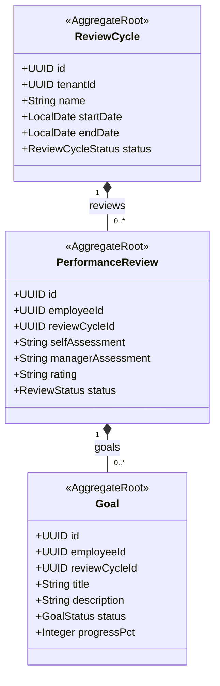

# HR - Performance Management (prf) Domain / Service Specification

> **Meta Information**
> - **Version:** 2026-04-04
> - **Template:** `domain-service-spec.md` v1.0.0
> - **Template Compliance:** ~90%
> - **Status:** DRAFT
> - **Suite:** `hr` | **Domain:** `prf`
> - **Service ID:** `hr-prf-svc`
> - **API Base Path:** `/api/hr/prf/v1`
> - **Port:** `8306`

---

## 0. Purpose & Scope

**Purpose:** `hr.prf` manages **performance review cycles, goals, and feedback** for employees. It supports structured semi-annual or annual reviews with self-assessment, manager assessment, and calibrated ratings.

**In Scope:** Review cycle configuration, goal setting (per employee, per period), self-assessment and manager assessment collection, peer feedback (360°, optional), rating calibration, performance history.

**Out of Scope:** Salary changes triggered by performance outcomes (→ hr.emp), training management (→ external LMS), promotion decisions (recorded in hr.emp as ContractChange).

---

## 1. Domain Model

---

## 2. Business Rules

| ID | Rule | Severity |
|----|------|----------|
| BR-PRF-001 | Review MUST have both self-assessment and manager assessment before COMPLETE | HARD |
| BR-PRF-002 | Rating MUST be from configured rating scale (e.g., 1-5 or Exceeds/Meets/Below) | HARD |
| BR-PRF-003 | Goals MUST be set before review cycle ASSESSMENT phase starts | SOFT |

---

## 3. REST API

| Method | Path | Description |
|--------|------|-------------|
| GET | `/review-cycles` | List review cycles |
| POST | `/review-cycles` | Create cycle |
| GET | `/reviews/{employeeId}` | Employee review history |
| POST | `/reviews/{id}/self-assessment` | Submit self-assessment |
| POST | `/reviews/{id}/manager-assessment` | Submit manager assessment |
| POST | `/reviews/{id}:complete` | Finalize review |
| GET | `/goals/{employeeId}` | Employee goals |
| POST | `/goals` | Create goal |
| PATCH | `/goals/{id}` | Update goal progress |

---

## 4. Events

**Outbound:** `hr.prf.review.completed`, `hr.prf.goal.set`
**Inbound:** `hr.emp.employee.terminated` → archive open reviews

---

## 5. Open Questions

- **OQ-PRF-001:** Is 360° peer feedback in scope for v1 or v2?
- **OQ-PRF-002:** Rating calibration — single calibrator (HR) or calibration committee?
