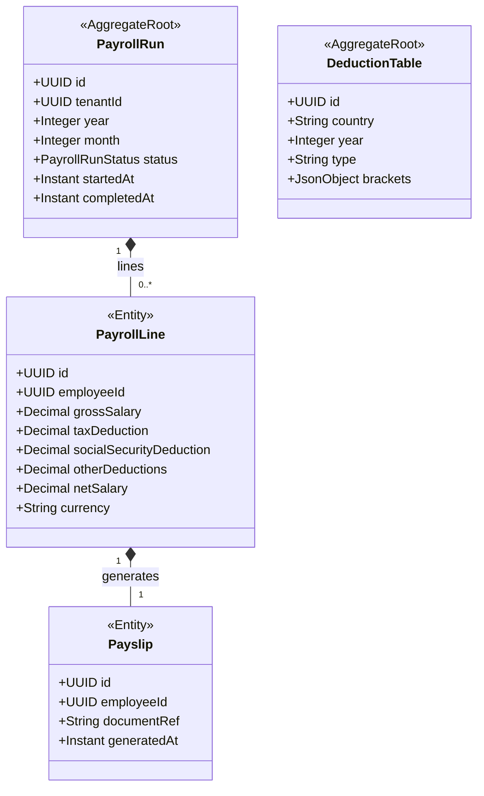

# HR - Payroll Processing (prl) Domain / Service Specification

> **Meta Information**
> - **Version:** 2026-04-04
> - **Template:** `domain-service-spec.md` v1.0.0
> - **Template Compliance:** ~90%
> - **Author(s):** OpenLeap Architecture Team
> - **Status:** DRAFT
> - **Suite:** `hr`
> - **Domain:** `prl`
> - **Bounded Context Ref:** `bc:payroll`
> - **Service ID:** `hr-prl-svc`
> - **API Base Path:** `/api/hr/prl/v1`
> - **Port:** `8303`
> - **Tags:** `hr`, `payroll`, `salary`, `payslip`, `deductions`

---

## 0. Purpose & Scope

**Purpose:** `hr.prl` calculates and processes **monthly payroll** — gross salary, statutory deductions (income tax, social security), voluntary deductions (pension, benefits), net pay, and payslip generation. It publishes accounting events for fi.slc to post to GL.

**In Scope:** Payroll run lifecycle, gross-to-net calculation, deduction management, payslip generation, GL accounting event publishing, SEPA payment file generation for banking, country-specific statutory deduction tables.

**Out of Scope:** GL posting directly (→ fi.slc), bank payment execution (→ fi.bnk), leave deduction values (queried from hr.lve), employee master (→ hr.emp).

---

## 1. Domain Model

### PayrollRunStatus
`DRAFT → CALCULATING → REVIEW → APPROVED → COMPLETED`

---

## 2. Business Rules

| ID | Rule | Severity |
|----|------|----------|
| BR-PRL-001 | PayrollRun MUST include all ACTIVE employees as of last day of pay period | HARD |
| BR-PRL-002 | Statutory deductions MUST use the applicable country's DeductionTable for the run year | HARD |
| BR-PRL-003 | PayrollRun MUST NOT be APPROVED without HR Manager sign-off | HARD |
| BR-PRL-004 | PayrollRun MUST publish `payroll.completed` event after APPROVED → triggers fi.slc posting | HARD |
| BR-PRL-005 | Payslips MUST be generated and stored in DMS; only DMS references stored in hr.prl | HARD |
| BR-PRL-006 | Unpaid leave days (from hr.lve) MUST be deducted from gross salary | HARD |
| BR-PRL-007 | Only one DRAFT/CALCULATING/REVIEW run MAY exist per (tenant, year, month) | HARD |

---

## 3. Key Use Cases

- **UC-PRL-001:** Start payroll run (HR Manager or scheduled trigger)
- **UC-PRL-002:** Calculate all payroll lines
- **UC-PRL-003:** Review and correct payroll lines
- **UC-PRL-004:** Approve payroll run (HR Manager sign-off)
- **UC-PRL-005:** Generate and distribute payslips
- **UC-PRL-006:** Publish `payroll.completed` event for fi.slc
- **UC-PRL-007:** Generate SEPA payment file for fi.bnk

---

## 4. REST API

| Method | Path | Description |
|--------|------|-------------|
| GET | `/runs` | List payroll runs |
| POST | `/runs` | Start new payroll run |
| GET | `/runs/{id}` | Run detail |
| POST | `/runs/{id}:calculate` | Trigger calculation |
| GET | `/runs/{id}/lines` | Payroll lines |
| PATCH | `/runs/{id}/lines/{eid}` | Manual correction |
| POST | `/runs/{id}:approve` | Approve run |
| GET | `/employees/{id}/payslips` | Payslip history (self-service) |
| GET | `/deduction-tables` | Statutory deduction tables |

---

## 5. Events

**Outbound:** `hr.prl.payroll.run.started`, `hr.prl.payroll.completed` (triggers fi.slc), `hr.prl.payslip.generated`  
**Inbound:** `hr.emp.employee.onboarded` → add to payroll registry; `hr.emp.employee.terminated` → process final payroll

---

## 6. Data Model

**Tables (prefix: `prl_`):** `prl_payroll_run`, `prl_payroll_line`, `prl_payslip`, `prl_deduction_table`, `prl_employee_registry`

---

## 7. Security

| Role | Permissions |
|------|-------------|
| `HR_PRL_VIEWER` | View payroll runs (no individual salary details) |
| `HR_PRL_SPECIALIST` | Calculate, review, correct lines |
| `HR_PRL_APPROVER` | Approve payroll runs |
| `HR_EMP_SELF` | View own payslips only |

---

## 8. Open Questions

- **OQ-HR-001:** Which countries' statutory deduction tables are in scope for v1?
- **OQ-PRL-001:** SEPA file generation — which ISO 20022 pain version?
- **OQ-PRL-002:** How is payroll integration with external payroll providers handled (if applicable)?
