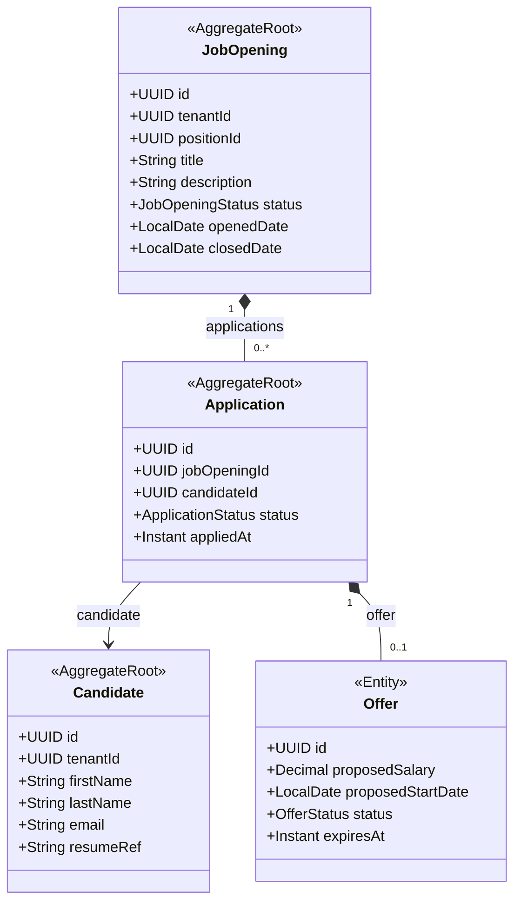

# HR - Recruitment (rcr) Domain / Service Specification

> **Meta Information**
> - **Version:** 2026-04-04
> - **Template:** `domain-service-spec.md` v1.0.0
> - **Template Compliance:** ~90%
> - **Status:** DRAFT
> - **Suite:** `hr` | **Domain:** `rcr`
> - **Service ID:** `hr-rcr-svc`
> - **API Base Path:** `/api/hr/rcr/v1`
> - **Port:** `8305`

---

## 0. Purpose & Scope

**Purpose:** `hr.rcr` manages the **recruitment pipeline** from job opening through offer acceptance. It tracks candidates, manages interview stages, and triggers employee onboarding upon hire.

**In Scope:** Job opening management, candidate tracking, application pipeline stages (APPLIED → SCREENING → INTERVIEW → OFFER → HIRED / REJECTED), interview scheduling, offer letter management, job board publication.

**Out of Scope:** Employee record creation (triggered via event → hr.emp), background checks (external), video interview platforms (external integration).

---

## 1. Domain Model

---

## 2. Business Rules

| ID | Rule | Severity |
|----|------|----------|
| BR-RCR-001 | Job opening MUST reference a valid OPEN position from hr.org | HARD |
| BR-RCR-002 | Accepted offer MUST trigger `hr.rcr.offer.accepted` event to hr.emp | HARD |
| BR-RCR-003 | Offer MUST expire if not accepted within configurable period (default: 7 days) | HARD |
| BR-RCR-004 | Candidate email MUST be unique per tenant | HARD |

---

## 3. REST API

| Method | Path | Description |
|--------|------|-------------|
| GET | `/job-openings` | List openings |
| POST | `/job-openings` | Create opening |
| POST | `/job-openings/{id}:publish` | Publish to job boards |
| GET | `/applications` | List applications |
| POST | `/applications` | Submit application |
| PATCH | `/applications/{id}/stage` | Advance stage |
| POST | `/applications/{id}/offers` | Create offer |
| POST | `/applications/{id}/offers/{oid}:accept` | Accept offer (triggers onboarding) |

---

## 4. Events

**Outbound:** `hr.rcr.job-opening.published`, `hr.rcr.offer.accepted` (→ hr.emp creates EmploymentRecord)
**Inbound:** `hr.org.position.vacated` → auto-create job opening if configured

---

## 5. Open Questions

- **OQ-RCR-001:** Which job boards are integrated (LinkedIn, Indeed, XING)?
- **OQ-RCR-002:** Interview scheduling — internal calendar integration or external (Calendly-like)?
