<!-- TEMPLATE COMPLIANCE: ~97%
Template: suite-spec.md v1.0.0
Present sections: §0 (Suite Identity & Purpose — full identity table, business purpose, scope), §1 (Ubiquitous Language — 18 terms), §2 (domain architecture, domain catalog with aggregates/lifecycle/events), §3 (service landscape — domain catalog), §4 (cross-domain integration patterns — extensive event flows, sagas), §5 (event conventions — detailed event catalog), §6 (Feature Catalog — composition index, leaf index, UVL reference), §7 (cross-cutting — data architecture, technical principles), §8 (external interfaces — deployment architecture), §9 (governance/standards), §10 (roadmap — implementation phases), §11 (appendix — open questions, glossary)
Missing sections: none
Naming issues: none — follows _ops_suite.md convention
Duplicates: none
Priority: COMPLETE
-->
# Operational Services (OPS) Suite - Architecture Specification

> **Conceptual Stack Layer:** Suite
> **Space:** Business Domain
> **Owner:** Operations Engineering Team
> **Schema alignment:** `suite-layer.schema.json`
> **Companion files:** `ops.catalog.uvl` (referenced in §6)
> **Contains:** Domain/Service Specs, Feature Specs, Feature Catalog

> **Meta Information**
> - **Version:** 2026-04-04
> - **Template:** `suite-spec.md` v1.0.0
> - **Template Compliance:** ~97%
> - **Author(s):** OpenLeap Architecture Team
> - **Status:** DRAFT
> - **Suite ID:** `ops` (pattern: `^[a-z]{2,4}$`)
> - **Suite Name:** Operational Services
> - **Description:** Provides all capabilities required for executing, tracking, and delivering services and operational activities: work order management, resource scheduling, time tracking, project management, and operational documentation.
> - **Semantic Version:** `1.0.0`
> - **Team:**
>   - Name: `team-ops`
>   - Email: `ops-engineering@openleap.io`
>   - Slack: `#ops-engineering`
> - **Bounded Contexts:** `bc:work-order-management`, `bc:resource-scheduling`, `bc:time-tracking`, `bc:project-management`, `bc:operational-documentation`

---

## 0. Document Purpose

### 0.1 Purpose
This document defines the complete architecture of the Operational Services (OPS) Suite within the OpenLeap platform. It specifies all OPS domains, their responsibilities, integration patterns, and boundaries with other suites.

**Scope:**
- Operational work order management and execution
- Service delivery capture and billable item generation
- Resource planning and scheduling
- Time tracking and attendance management
- Project structure and milestone tracking
- Operational documentation and reporting

**Out of Scope:**
- Sales order management (SD Suite - separate specification)
- Financial accounting and invoicing (FI Suite - separate specification)
- Payroll processing (HR Suite - separate specification)
- Strategic analytics and BI dashboards (T4 Analytics Tier - separate specification)

### 0.2 Target Audience
- Product Owners & Business Stakeholders
- System Architects & Domain Architects
- Technical Leads & Integration Engineers
- Operations Managers & Service Dispatchers
- Service Providers (Consultants, Technicians, Teachers)
- Finance & Billing Teams

### 0.3 Related Documents
- [system-topology.md](https://github.com/openleap-io/io.openleap.dev.hub/blob/main/architecture/system-topology.md) - Overall platform architecture
- `orchestration.md` - Orchestration patterns and saga guidelines
- `COM_Suite_Overview.md` - Commerce Suite (sales orders, contracts)
- `FI_Suite_Specification.md` - Financial Accounting Suite (billing, AR)
- `BP_business_partner.md` - Business Partner management
- `REF_reference_data.md` - Reference data catalogs
- `HR_core.md` - Human Resources Core
- `T4_Analytics_Overview.md` - Analytics Tier

---

## 1. OPS Suite Overview

### 1.1 What is Operational Services (OPS)?

The **Operational Services Suite** encompasses all capabilities required for **executing, tracking, and delivering** services and operational activities in a service-oriented enterprise.

**Core Purpose:**
- Manage operational work orders derived from sales contracts and service agreements
- Capture actual service delivery (time-based, quantity-based, milestone-based)
- Schedule resources (people, equipment, facilities) to service activities
- Track working times and attendance for billing and payroll
- Structure work into projects with milestones and deliverables
- Generate billable items for financial processing (FI)
- Maintain operational documentation and service reports

**Key Characteristics:**
- **Execution Focus:** Bridges the gap between "what was sold" (COM) and "what should be paid" (FI)
- **Service-Oriented:** Designed for service industries (consulting, education, field service, professional services)
- **Resource-Centric:** Manages who does what, when, and where
- **Billability-Driven:** Every delivery can be traced to invoicing
- **Event-Driven:** Integrates via events with COM, FI, HR, and Analytics
- **Real-Time Operations:** Supports mobile field workers and real-time status updates

### 1.2 OPS vs. Related Suites

**OPS vs. Commerce (COM):**
| Aspect | OPS (Operational Services) | COM (Commerce) |
|--------|----------------------------|----------------|
| Purpose | Execute and deliver services | Sell products and services |
| Audience | Service providers, dispatchers | Sales teams, customers |
| Focus | What was delivered (actual) | What was ordered (commitment) |
| Transactions | Deliveries, time entries | Sales orders, contracts |
| Time Perspective | Historical (actual work done) | Future (commitments made) |
| Core Entity | Service Delivery, Work Order | Sales Order, Contract |

**OPS vs. Financial Accounting (FI):**
| Aspect | OPS | FI |
|--------|-----|-----|
| Purpose | Execute services | Invoice and account |
| Data Type | Operational (deliveries, times) | Financial (invoices, payments) |
| Granularity | Individual service deliveries | Aggregated invoices |
| Billability | Produces billable items | Consumes billable items → invoices |
| Status | Delivered vs. Not Delivered | Invoiced vs. Paid |

**OPS vs. Human Resources (HR):**
- **HR:** Owns employee master data, contracts, payroll rules
- **OPS:** Records working times and attendance → HR uses for payroll

**OPS vs. Analytics (T4):**
- **OPS:** Transactional system, captures operational reality
- **T4:** Read-only analytics, analyzes productivity, utilization, margins

### 1.3 OPS Suite Boundaries

**IN SCOPE:**
- ✅ Operational work order management (derived from sales/service orders)
- ✅ Service delivery capture (time-based, quantity-based, milestone-based)
- ✅ Resource management (people, equipment, facilities, external providers)
- ✅ Scheduling and calendar management (appointments, slots, assignments)
- ✅ Task management (operational tasks, checklists, dependencies)
- ✅ Time tracking and attendance (working times, breaks, absences)
- ✅ Project management (project structure, milestones, work packages)
- ✅ Operational documentation (service reports, delivery confirmations, attachments)
- ✅ Billable item generation for FI
- ✅ Real-time status tracking and progress monitoring

**OUT OF SCOPE (Other Suites):**
- ❌ Sales order management, pricing, contracts → COM Suite
- ❌ Invoicing, accounts receivable, payments → FI Suite
- ❌ Payroll processing, salary calculation → HR Suite
- ❌ Production planning, manufacturing → MES/PPS Suite
- ❌ Inventory management, goods movements → WM Suite
- ❌ Strategic analytics, BI dashboards → T4 Analytics Tier
- ❌ Marketing campaigns, lead management → CRM (if separate)

---

## 1. Ubiquitous Language

The following terms are used with precise meaning throughout all OPS domain specifications.

| Term | Definition |
|------|-----------|
| **Work Order** | The primary execution unit in OPS. A work order captures all information needed to fulfill an operational task: who, what, when, where, and at what rate. |
| **Service Order** | A work order specifically for service delivery against a customer contract (OPS → COM integration). |
| **Resource** | Any capacity-consuming entity that can be assigned to a work order: employee, vehicle, machine, or facility. |
| **Resource Pool** | A named grouping of interchangeable resources that can be collectively planned against demand. |
| **Schedule** | The assignment of one or more resources to a work order within a defined time window. |
| **Time Entry** | A record of actual time spent by a resource on a work order or project task, used for billing and cost capture. |
| **Project** | A structured, bounded initiative with tasks, milestones, and budget. Projects may contain work orders. |
| **Task** | The atomic unit of project work. A task has an assignee, due date, and status. |
| **Document** | A structured output artifact associated with a work order or project (report, certificate, photo, checklist). |
| **Billable Flag** | Attribute on a time entry indicating whether it may be invoiced to a customer or charged to an internal cost center. |
| **Utilization Rate** | The ratio of productive (billable + assigned) time to total available capacity for a resource in a period. |
| **Skill** | A named capability (e.g., `HVAC-certified`, `forklift-license`) that can be required by a work order and possessed by a resource. |
| **Dispatch** | The act of assigning a scheduled resource to a work order and notifying them to proceed. |
| **SLA** | Service Level Agreement — a contractual time window within which a service order must be started or completed. |
| **Escalation** | Automatic promotion of a work order's priority when an SLA deadline is at risk. |
| **Completion Code** | A mandatory classification attached to a completed work order (e.g., `RESOLVED`, `CANCELLED`, `DEFERRED`). |
| **Operational Report** | A structured summary document generated from completed work orders and time entries (ops.doc). |
| **Cost Object** | The entity (project, work order, cost center) to which time entries and expenses are charged for accounting purposes. |

---

## 2. OPS Domain Architecture

### 2.1 Three-Layer Architecture

The OPS Suite follows a three-layer architecture pattern focused on operational execution:

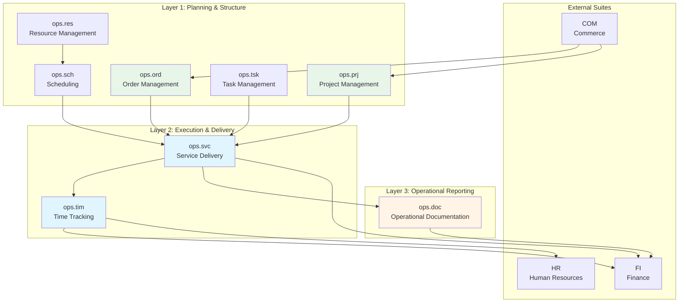

### 2.2 Layer Responsibilities

#### Layer 1: Planning & Structure
**Purpose:** Define what work needs to be done, by whom, and when

**Domains:**
- **ops.ord** - Order Management: Transform sales orders into executable work orders
- **ops.prj** - Project Management: Group work into projects with structure and milestones
- **ops.tsk** - Task Management: Break down work into individual tasks and checklists
- **ops.res** - Resource Management: Maintain resource master data and availability
- **ops.sch** - Scheduling: Assign resources to work in time slots

**Responsibilities:**
- Receive orders/contracts from COM
- Structure work into executable units
- Define resource requirements
- Plan schedules and assignments
- Track planning vs. actual

**Integration Pattern:**
- Consume events from COM (order.created, contract.signed)
- Publish events to Layer 2 (order.released, task.assigned, slot.confirmed)
- Synchronous APIs for resource availability queries

#### Layer 2: Execution & Delivery
**Purpose:** Capture what was actually delivered and measure effort

**Domains:**
- **ops.svc** - Service Delivery: Record delivered services and generate billable items
- **ops.tim** - Time Tracking: Capture working times and attendance

**Responsibilities:**
- Record service delivery (what, when, who, how much)
- Validate and approve deliveries
- Track working times against orders/projects
- Generate billable items for FI
- Apply pricing and calculation rules
- Handle corrections and adjustments

**Key Principles:**
- Deliveries are append-only (corrections via reversal + new entry)
- All deliveries traceable to source order/contract
- Approval workflow before billing
- Idempotency (duplicate submissions rejected)

#### Layer 3: Operational Reporting
**Purpose:** Document and report operational activities

**Domain:**
- **ops.doc** - Operational Documentation: Link documents to deliveries

**Responsibilities:**
- Attach service reports to deliveries
- Store signed confirmations (DMS integration)
- Provide delivery evidence for billing disputes
- Generate operational reports
- Publish documentation events for audit trail

**Integration Pattern:**
- Consume delivery events from ops.svc
- Integrate with DMS for document storage
- Publish documentation events for FI and analytics

---

## 3. OPS Domain Catalog

### 3.1 Complete Domain List

The OPS Suite consists of **8 domains** organized in two tiers:

#### Tier 1: Core OPS (Mandatory)

| # | Domain | Purpose | Key Entities |
|---|--------|---------|--------------|
| 1 | **ops.ord** | Order Management - Operational work orders | WorkOrder, OrderLine, Assignment |
| 2 | **ops.svc** | Service Delivery - Capture delivered services | Delivery, BillableItem, ServiceReport |
| 3 | **ops.res** | Resource Management - People, equipment, facilities | Resource, Availability, Allocation |
| 4 | **ops.sch** | Scheduling - Calendar-based planning | Schedule, Slot, Appointment |
| 5 | **ops.tim** | Time Tracking - Working times and attendance | TimeEntry, Attendance, Approval |

**Priority:** P1 (Phase 1) - Required for basic service operations

**Implementation Timeline:** 16-20 weeks

**Service Names:**
- `ops-ord-service`
- `ops-svc-service`
- `ops-res-service`
- `ops-sch-service`
- `ops-tim-service`

#### Tier 2: Extended OPS (Optional)

| # | Domain | Purpose | Key Entities |
|---|--------|---------|--------------|
| 6 | **ops.prj** | Project Management - Group work into projects | Project, Milestone, WorkPackage |
| 7 | **ops.tsk** | Task Management - Individual tasks and checklists | Task, Checklist, Dependency |
| 8 | **ops.doc** | Operational Documentation - Reports and attachments | Document, Attachment, Report |

**Priority:** P2 (Phase 2) - Needed for project-based businesses

**Implementation Timeline:** 8-12 weeks

**Service Names:**
- `ops-prj-service`
- `ops-tsk-service`
- `ops-doc-service`

### 3.2 Domain Details

#### 3.2.1 ops.ord - Order Management

**Business Purpose:**
Transforms sales orders and service contracts from COM into executable operational work orders. Defines what work should be performed, tracks assignment to resources, and monitors completion status. Acts as the entry point for all operational execution.

**Core Entities:**
- **WorkOrder:** Operational order derived from sales order, with status, priority, and timeline
- **OrderLine:** Individual service/product line within work order, with quantities and delivery tracking
- **Assignment:** Links work order to resources and schedule slots

**Key Workflows:**
1. Create Work Order: Transform COM sales order into OPS work order
2. Assign Resources: Match work order to available resources and create assignments
3. Track Progress: Monitor order line fulfillment and overall work order status
4. Complete Order: Mark as complete when all lines fulfilled

**Integration Points:**
- **Upstream:** Receives events from com.order (order.created, order.changed)
- **Downstream:** Publishes events to ops.svc (order.released), ops.sch (order.assigned)
- **Synchronous:** Queries ops.res for resource availability

**Reference to Full Spec:** `ops_ord-spec.md`

**Status:** [x] Completed

#### 3.2.2 ops.svc - Service Delivery

**Business Purpose:**
Captures actual service deliveries and generates billable items for FI. Records what services were delivered, when, by whom, and for whom. Validates deliveries against orders/contracts and applies pricing rules. Primary source of truth for "what happened" in operations.

**Core Entities:**
- **Delivery:** Record of service performed (time-based, quantity-based, or milestone-based)
- **BillableItem:** Priced delivery ready for invoicing (sent to FI)
- **ServiceReport:** Attached documentation and evidence of delivery

**Key Workflows:**
1. Capture Delivery: Service provider records service performed
2. Validate Delivery: Check against order/contract, validate quantity/time
3. Price Delivery: Apply pricing rules, calculate amounts
4. Approve Delivery: Approval workflow before billing
5. Generate Billable Item: Create billable item and send to FI

**Integration Points:**
- **Upstream:** Receives events from ops.ord, ops.tim, ops.sch
- **Downstream:** Publishes events to fi.bil (billable.item.ready), ops.doc
- **Synchronous:** Calls pricing services, queries order status

**Reference to Full Spec:** `ops_svc-spec.md`

**Status:** [x] Completed

#### 3.2.3 ops.res - Resource Management

**Business Purpose:**
Manages all operational resources including employees, external consultants, equipment, vehicles, rooms, and facilities. Maintains resource master data, tracks availability and capacity, and supports resource allocation decisions.

**Core Entities:**
- **Resource:** Person, equipment, or facility with capabilities and attributes
- **Availability:** Time-based availability patterns (working hours, holidays, maintenance)
- **Allocation:** Assignment of resource to work order or project

**Key Workflows:**
1. Maintain Resources: Create and update resource master data
2. Define Availability: Set working hours, holidays, maintenance windows
3. Query Availability: Check if resource available for specific time slot
4. Allocate Resource: Reserve resource for work order/project

**Integration Points:**
- **Upstream:** Receives events from hr.employee (employee.hired, employee.terminated)
- **Downstream:** Publishes events to ops.sch (resource.available), analytics
- **Synchronous:** Provides availability query APIs

**Reference to Full Spec:** `ops_res-spec.md`

**Status:** [x] Completed

#### 3.2.4 ops.sch - Scheduling

**Business Purpose:**
Calendar-based scheduling of resources to work orders and appointments. Manages time slots, handles booking conflicts, and optimizes resource utilization. Supports recurring schedules and multi-resource assignments.

**Core Entities:**
- **Schedule:** Calendar for resource or work order
- **Slot:** Time slot within schedule (booked or available)
- **Appointment:** Confirmed booking of resource to work order

**Key Workflows:**
1. Create Schedule: Define calendar for resource or work order
2. Book Slot: Reserve time slot for work order
3. Confirm Appointment: Finalize booking with all parties
4. Reschedule: Move appointment to different slot
5. Cancel Booking: Release slot and notify parties

**Integration Points:**
- **Upstream:** Receives events from ops.ord, ops.res
- **Downstream:** Publishes events to ops.svc (slot.confirmed), notifications
- **Synchronous:** Provides slot availability queries

**Reference to Full Spec:** `ops_sch-spec.md`

**Status:** [x] Completed

#### 3.2.5 ops.tim - Time Tracking

**Business Purpose:**
Captures and validates working times, service times, and attendance. Supports both manual time entry and automated tracking (biometric, GPS). Used for both billing (to FI) and payroll (to HR). Ensures accurate time records with approval workflows.

**Core Entities:**
- **TimeEntry:** Record of time spent on work order, project, or task
- **Attendance:** Daily attendance record (clock in/out, breaks, absences)
- **Approval:** Workflow for validating and approving time entries

**Key Workflows:**
1. Record Time: Capture time spent on work order/project
2. Validate Time: Check against schedule, work order, resource capacity
3. Approve Time: Manager approval workflow
4. Submit for Billing: Approved time becomes billable item
5. Submit for Payroll: Approved time sent to HR for salary calculation

**Integration Points:**
- **Upstream:** Receives events from ops.svc, ops.ord
- **Downstream:** Publishes events to fi.bil (time.approved), hr.payroll
- **Synchronous:** Queries work order and resource data

**Reference to Full Spec:** `ops_tim-spec.md`

**Status:** [x] Completed

#### 3.2.6 ops.prj - Project Management

**Business Purpose:**
Groups related work orders and tasks into projects with hierarchical structure, milestones, and deliverables. Provides project-level reporting and tracking. Supports multi-phase projects and program management.

**Core Entities:**
- **Project:** Container for related work with structure and timeline
- **Milestone:** Key deliverable or checkpoint in project
- **WorkPackage:** Grouping of work orders and tasks within project

**Key Workflows:**
1. Create Project: Define project structure, milestones, budget
2. Add Work: Link work orders and tasks to project
3. Track Progress: Monitor milestones and overall project health
4. Report Status: Generate project status reports
5. Close Project: Complete project and archive

**Integration Points:**
- **Upstream:** Receives events from com.contract, ops.ord
- **Downstream:** Publishes events to ops.svc, analytics, reporting
- **Synchronous:** Queries financial data for project profitability

**Reference to Full Spec:** `ops_prj-spec.md`

**Status:** [x] Completed

#### 3.2.7 ops.tsk - Task Management

**Business Purpose:**
Manages individual operational tasks, checklists, and dependencies. Supports task assignment, progress tracking, and completion logging. Enables fine-grained operational control and quality assurance.

**Core Entities:**
- **Task:** Individual work item with assignee and due date
- **Checklist:** Template of tasks for recurring work
- **Dependency:** Task relationship (predecessor, successor)

**Key Workflows:**
1. Create Task: Define task from template or manual entry
2. Assign Task: Assign to resource with due date
3. Track Progress: Update task status and completion percentage
4. Complete Task: Mark done with completion notes
5. Report Tasks: Generate task reports and analytics

**Integration Points:**
- **Upstream:** Receives events from ops.ord, ops.prj
- **Downstream:** Publishes events to ops.svc (task.completed), notifications
- **Synchronous:** Queries resource availability

**Reference to Full Spec:** `ops_tsk-spec.md`

**Status:** [x] Completed

#### 3.2.8 ops.doc - Operational Documentation

**Business Purpose:**
Links operational data to documents stored in DMS. Handles service reports, delivery confirmations, signed documents, photos, and other evidence. Provides audit trail for billing disputes and quality issues.

**Core Entities:**
- **Document:** Metadata for DMS-stored file
- **Attachment:** Link between operational entity and document
- **Report:** Generated report (service report, delivery note)

**Key Workflows:**
1. Attach Document: Link document to delivery, order, or project
2. Generate Report: Create service report from delivery data
3. Request Signature: Workflow for customer signature
4. Archive Document: Move to long-term storage after period
5. Retrieve Document: Query and display for user

**Integration Points:**
- **Upstream:** Receives events from ops.svc, ops.ord
- **Downstream:** Publishes events to dms, fi.bil (proof of delivery)
- **Synchronous:** Calls DMS APIs for upload/download

**Reference to Full Spec:** `ops_doc-spec.md`

**Status:** [x] Completed

---

## 4. Cross-Domain Integration Patterns

### 4.1 Event-Driven Communication

**Primary Pattern:** Event-Driven Architecture (Choreography)

**Event Exchange:**
```
ops.events (topic exchange)
├── ops.ord.workorder.{created|released|completed}
├── ops.svc.delivery.{created|approved|rejected}
├── ops.svc.billable.ready
├── ops.tim.timeentry.{created|approved}
├── ops.sch.slot.{booked|confirmed|cancelled}
├── ops.res.resource.{created|updated}
├── ops.prj.project.{created|milestone.reached}
└── ops.doc.document.attached
```

**Event Envelope Standard:**
```json
{
  "aggregateType": "ops.svc.delivery",
  "changeType": "approved",
  "entityIds": ["delivery-uuid"],
  "version": 1,
  "occurredAt": "2025-12-05T10:30:00Z",
  "tenantId": "tenant-uuid",
  "userId": "user-uuid",
  "traceId": "trace-uuid",
  "correlationId": "correlation-uuid",
  "causationId": "causation-uuid",
  "payload": {
    "deliveryId": "del-123",
    "workOrderId": "wo-456",
    "customerId": "cust-789",
    "providerId": "prov-012",
    "quantity": 2.5,
    "uom": "HOUR",
    "serviceDate": "2025-12-05"
  }
}
```

### 4.2 Key Integration Flows

#### Flow 1: Service Order to Cash (End-to-End)

**Business Scenario:**
Customer purchases consulting service, consultant delivers service, customer is invoiced, and payment is received.

**Integration Pattern:** ☑ Choreography (Event-Driven)

**Pattern Rationale:**
Services react independently to domain events. No central coordinator needed as each step naturally follows from the previous one. Eventual consistency is acceptable as billing happens days after delivery.

**Participating Domains:**
- **com.order:** Initiator (Sales order created)
- **ops.ord:** Participant (Creates work order)
- **ops.svc:** Participant (Captures delivery)
- **fi.bil:** Participant (Creates invoice)
- **fi.ar:** Observer (Tracks payment)

**Event Sequence:**
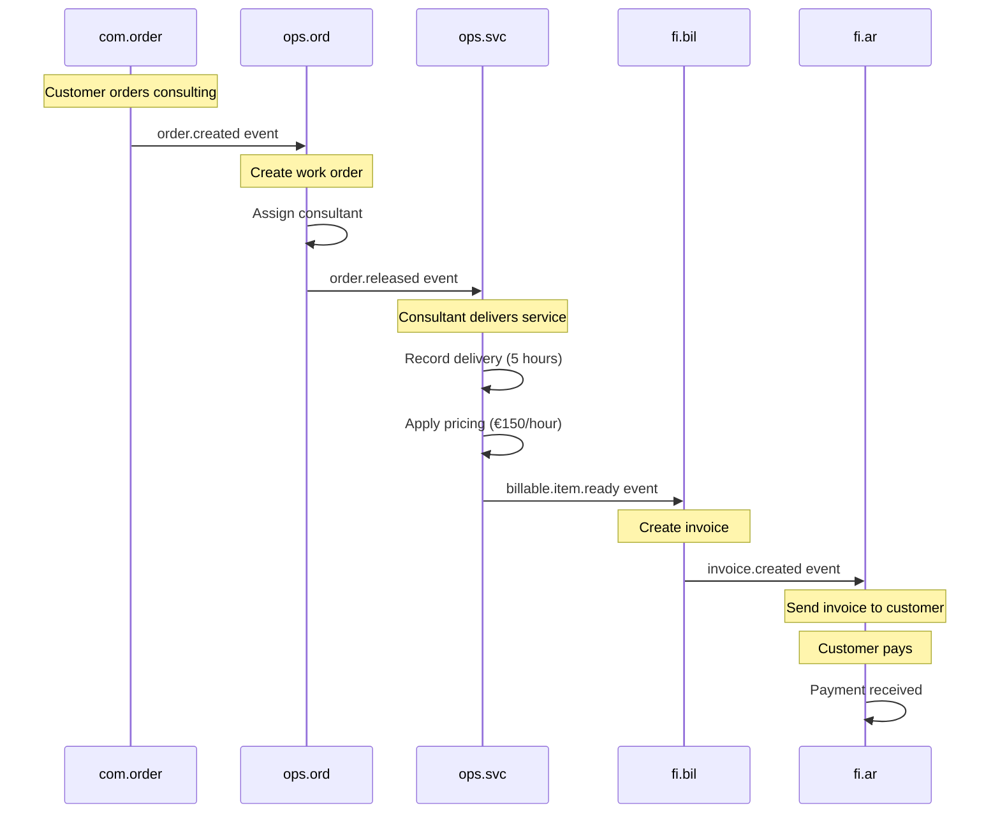

**Business Rules:**
- Work order cannot be released without assigned resource
- Delivery cannot exceed work order line quantity
- Billable item requires approved delivery

**Failure Handling:**
- **Failure Scenario:** Delivery approval rejected by manager
- **Compensation Strategy:** Delivery marked as rejected, no billable item created, consultant notified
- **Idempotency:** Delivery ID prevents duplicate submissions

#### Flow 2: Recurring Service Scheduling

**Business Scenario:**
Weekly lesson booking for student with fixed teacher and time slot.

**Integration Pattern:** ☑ Choreography (Event-Driven)

**Participating Domains:**
- **ops.sch:** Orchestrator (Creates recurring slots)
- **ops.res:** Participant (Reserves teacher)
- **ops.svc:** Participant (Records lesson delivery)

**Event Sequence:**
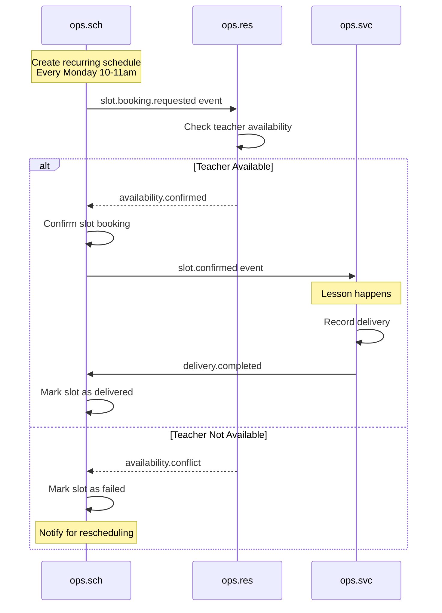

**Business Rules:**
- Teacher can only be in one slot at a time
- Slot must be at least 24 hours in future for initial booking
- Lesson delivery must reference confirmed slot

**Failure Handling:**
- **Failure Scenario:** Teacher calls in sick
- **Compensation Strategy:** Cancel slot, notify student, offer rescheduling or substitute teacher
- **Idempotency:** Slot ID ensures no duplicate bookings

### 4.3 External Suite Integration

**Integration with Commerce (COM):**

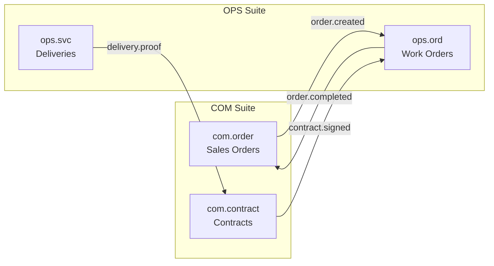

**Event Flows:**
| Source | Event | Target | Purpose |
|--------|-------|--------|---------|
| com.order | order.created | ops.ord | Create work order from sales order |
| com.order | order.changed | ops.ord | Update work order details |
| com.contract | contract.signed | ops.ord | Create recurring work orders |
| ops.ord | order.completed | com.order | Notify sales of completion |
| ops.svc | delivery.proof | com.contract | Update contract utilization |

**Integration with Finance (FI):**

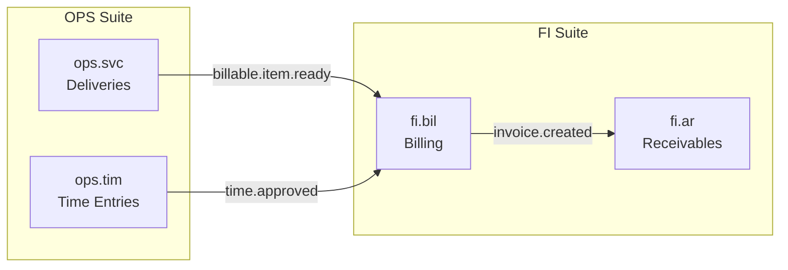

**Event Flows:**
| Source | Event | Target | Purpose |
|--------|-------|--------|---------|
| ops.svc | billable.item.ready | fi.bil | Send delivery for invoicing |
| ops.tim | time.approved | fi.bil | Send approved times for billing |
| fi.bil | invoice.created | ops.svc | Link invoice to delivery |
| fi.ar | payment.received | ops.svc | Mark delivery as paid |

**Synchronous API Calls:**
| Caller | API | Purpose | SLA |
|--------|-----|---------|-----|
| ops.svc | com.pricing.calculatePrice | Get current price for delivery | < 200ms |
| ops.ord | ops.res.queryAvailability | Check resource availability | < 100ms |
| ops.sch | cap.calendar.getHolidays | Get calendar holidays | < 100ms |

### 4.4 Orchestration & Distributed Transactions

#### 4.4.1 Orchestration Strategy

The OPS Suite primarily uses **choreographed sagas** for cross-domain workflows, as operational processes are naturally event-driven and benefit from loose coupling. Orchestration is used only for complex multi-step workflows requiring strict ordering and compensation.

**Pattern Selection Guidelines:**

| Pattern | When to Use in OPS | Examples |
|---------|-------------------|----------|
| **Choreography** | Most operational flows, external integration | Order → Delivery → Billing, Scheduling workflows |
| **Orchestration** | Complex resource allocation, multi-party scheduling | Conference room booking with equipment + catering |

**Decision Criteria:**
```
Use Choreography when:
✓ Services react to operational facts (delivery happened, time recorded)
✓ No complex compensation needed (cancellation is simple)
✓ External systems involved (COM, FI)
✓ Eventual consistency acceptable (hours to days)

Use Orchestration when:
✓ Multi-resource coordination needed (room + projector + catering)
✓ Strict ordering required (setup → event → cleanup)
✓ Complex rollback needed (cancel all related bookings)
✓ Real-time coordination required (same-day scheduling)
```

#### 4.4.2 Intra-Suite Sagas

**Sagas Within OPS Suite:**

##### SAG-OPS-001: Service Delivery to Billing

**Business Transaction:**
Service is delivered, validated, priced, approved, and sent to FI for invoicing.

**Pattern:** ☑ Choreographed Saga

**Participating Domains:**
| Domain | Step | Action | Compensation Action |
|--------|------|--------|---------------------|
| ops.svc | 1 | Service provider records delivery | Delete delivery (if within grace period) |
| ops.svc | 2 | System validates delivery against order | N/A (validation only) |
| ops.svc | 3 | System applies pricing rules | Recalculate price |
| ops.svc | 4 | Manager approves delivery | Reject delivery, notify provider |
| ops.svc | 5 | System generates billable item | Cancel billable item |
| fi.bil | 6 | Billing creates invoice | Cancel invoice (within period) |

**Saga Flow Diagram:**
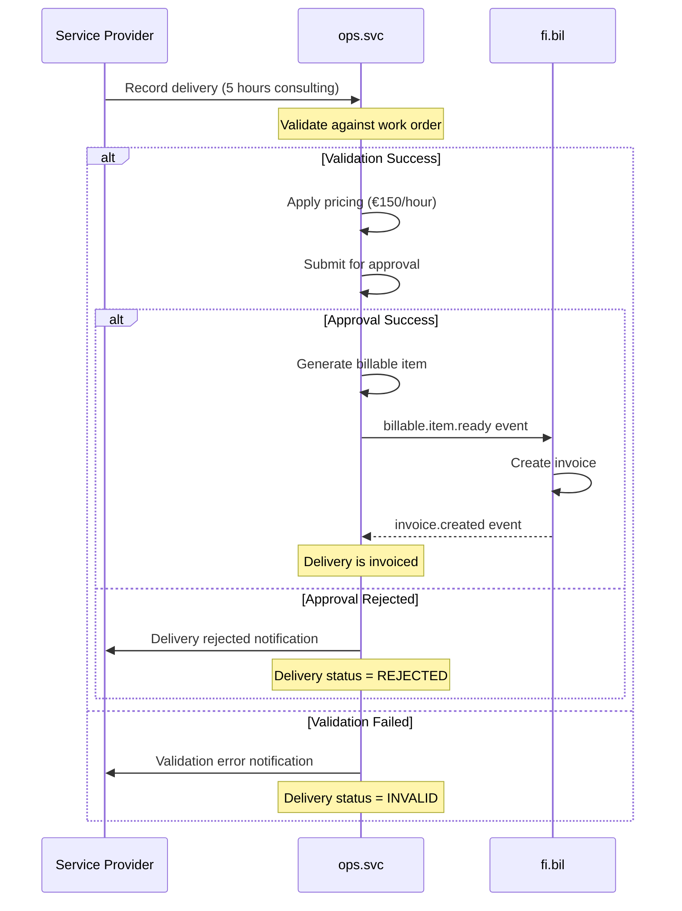

**State Management:**
- State stored in: ops.svc delivery table (status field)
- States: DRAFT → SUBMITTED → VALIDATED → APPROVED → BILLED
- Retention: Permanent (financial audit requirement)

**Failure & Compensation:**
- **Timeout:** 48 hours for manager approval
- **Retry Policy:** None (manual approval required)
- **Compensation:** Delivery can be deleted before approval, reversed after approval
- **Partial Failure:** If billing fails, billable item remains in READY state for retry

**Idempotency:**
- Delivery ID prevents duplicate submissions
- Billable item ID ensures one invoice per delivery

##### SAG-OPS-002: Resource Scheduling

**Business Transaction:**
Resource is scheduled for work order, availability confirmed, slot booked, and work order updated.

**Pattern:** ☑ Choreographed Saga

**Participating Domains:**
| Domain | Step | Action | Compensation Action |
|--------|------|--------|---------------------|
| ops.sch | 1 | Request slot booking | Cancel booking request |
| ops.res | 2 | Check resource availability | N/A |
| ops.res | 3 | Reserve resource capacity | Release reservation |
| ops.sch | 4 | Confirm slot booking | Cancel slot, release resource |
| ops.ord | 5 | Update work order with schedule | Remove schedule from order |

**Saga Flow Diagram:**
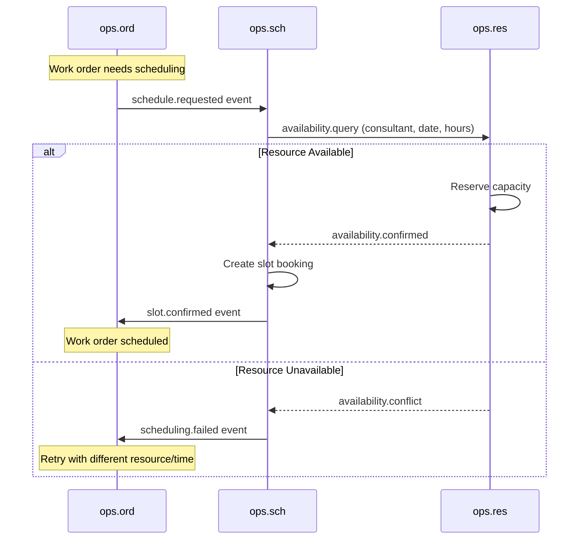

**Failure & Compensation:**
- **Timeout:** 5 minutes for availability check
- **Retry Policy:** Automatic retry with alternative resources
- **Compensation:** Release resource reservation if slot booking fails
- **Overbooking Protection:** Pessimistic locking on resource capacity

##### SAG-OPS-003: Time Approval to Billing

**Business Transaction:**
Time entries are captured, validated, approved by manager, and sent to both FI (billing) and HR (payroll).

**Pattern:** ☑ Choreographed Saga

**Participating Domains:**
| Domain | Step | Action | Compensation Action |
|--------|------|--------|---------------------|
| ops.tim | 1 | Employee records time entry | Delete time entry (grace period) |
| ops.tim | 2 | Validate against work order/schedule | N/A |
| ops.tim | 3 | Manager approval workflow | Reject time entry |
| ops.tim | 4 | Split: Send to billing (if billable) | Reverse billing submission |
| ops.tim | 5 | Split: Send to payroll (always) | Reverse payroll submission |
| fi.bil | 6 | Create billable item from time | Cancel billable item |
| hr.payroll | 7 | Include in salary calculation | Adjust salary |

**Saga Flow Diagram:**
```mermaid
sequenceDiagram
    participant EMP as Employee
    participant TIM as ops.tim
    participant BIL as fi.bil
    participant PAY as hr.payroll
    
    EMP->>TIM: Record time (8 hours on project X)
    Note over TIM: Validate against schedule
    TIM->>TIM: Submit for approval
    
    alt Manager Approves
        TIM->>TIM: Mark as approved
        
        par Billing Path (if billable)
            TIM->>BIL: time.approved event (billable=true)
            BIL->>BIL: Create billable item
        and Payroll Path (always)
            TIM->>PAY: time.approved event
            PAY->>PAY: Include in salary calculation
        end
        
        Note over TIM: Time processed for billing & payroll
    else Manager Rejects
        TIM->>EMP: Time entry rejected notification
        Note over TIM: Time status = REJECTED
    end
```

**Dual-Purpose Nature:**
- Time entries serve both billing (customer) and payroll (employee)
- Same time entry can be billable (→ FI) and payable (→ HR)
- Approval required for both purposes

#### 4.4.3 Inter-Suite Sagas

**Sagas Spanning Suite Boundaries:**

##### SAG-OPS-101: Sales Order to Service Delivery (COM → OPS → FI)

**Business Transaction:**
Customer places service order in COM, work is executed in OPS, and invoice is generated in FI.

**Involved Suites:**
- **COM (Commerce):** Creates and manages sales order
- **OPS (Operations):** Executes work and captures delivery
- **FI (Finance):** Invoices customer

**Pattern:** ☑ Choreographed Saga

**Participating Domains Across Suites:**
| Suite | Domain | Step | Action | Compensation |
|-------|--------|------|--------|--------------|
| COM | com.order | 1 | Customer places order | Cancel order |
| OPS | ops.ord | 2 | Create work order from sales order | Cancel work order |
| OPS | ops.sch | 3 | Schedule resources | Cancel schedule |
| OPS | ops.svc | 4 | Deliver service | Reverse delivery |
| FI | fi.bil | 5 | Create invoice | Cancel invoice |
| FI | fi.ar | 6 | Post receivable | Reverse receivable |

**Cross-Suite Saga Flow:**
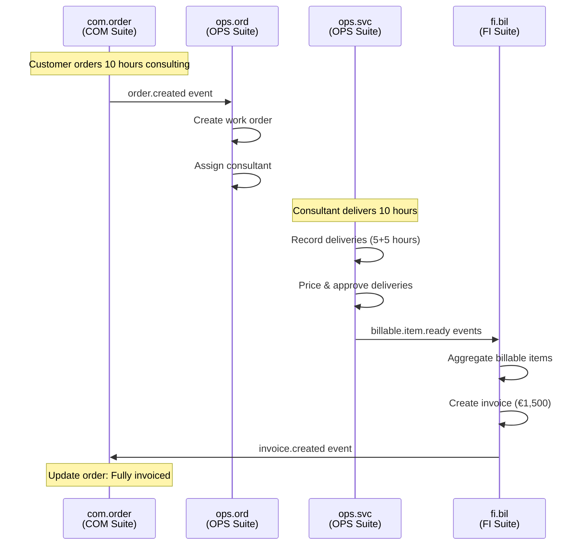

**Coordination Challenges:**
- **Suite Boundaries:** COM order IDs must be traceable in OPS
- **Authorization:** OPS must validate it has permission to act on COM order
- **Network Latency:** Events may take seconds to propagate
- **Partial Failures:** Order created in COM but OPS unavailable

**Governance:**
- **Owner:** COM Suite owns the overall Order-to-Cash process
- **SLA:** Work order created within 5 minutes of order placement
- **Change Management:** Event schema changes require COM and OPS coordination

##### SAG-OPS-102: Time Tracking to Payroll (OPS → HR)

**Business Transaction:**
Employee working times are captured in OPS, approved, and sent to HR for payroll calculation.

**Involved Suites:**
- **OPS (Operations):** Captures and approves working times
- **HR (Human Resources):** Calculates salary based on times

**Pattern:** ☑ Choreographed Saga

**Participating Domains:**
| Suite | Domain | Step | Action | Compensation |
|-------|--------|------|--------|--------------|
| OPS | ops.tim | 1 | Employee clocks in/out | Adjust time entry |
| OPS | ops.tim | 2 | Manager approves time | Reject time |
| HR | hr.payroll | 3 | Include time in salary calculation | Reverse salary adjustment |
| HR | hr.payroll | 4 | Generate payroll | Regenerate payroll |

**Cross-Suite Flow:**
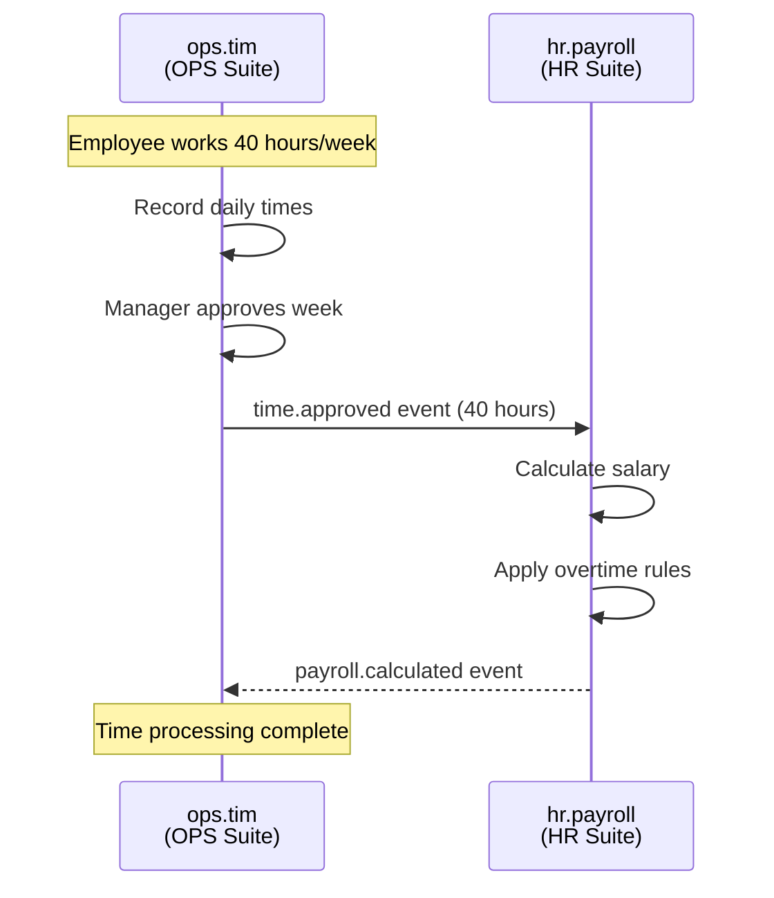

**Integration Key:** Employee ID links OPS time entries to HR payroll

##### SAG-OPS-103: Service Delivery Proof to Factoring (OPS → FI → FAC)

**Business Transaction:**
Service delivery with signed confirmation is used as proof for factoring advance.

**Involved Suites:**
- **OPS (Operations):** Captures delivery with signed report
- **FI (Finance):** Creates invoice
- **FAC (Factoring):** Provides advance based on proof

**Pattern:** ☑ Choreographed Saga

**Participating Domains:**
| Suite | Domain | Step | Action | Compensation |
|-------|--------|------|--------|--------------|
| OPS | ops.svc | 1 | Capture delivery with customer signature | Delete delivery |
| OPS | ops.doc | 2 | Attach signed service report | Remove attachment |
| FI | fi.bil | 3 | Create invoice with proof reference | Cancel invoice |
| FI | fi.ar | 4 | Post receivable | Reverse receivable |
| FAC | fac.rcv | 5 | Ingest receivable with proof | N/A |
| FAC | fac.fnd | 6 | Provide advance (80% of invoice) | Reverse advance |

**Service Delivery as Proof:**
OPS provides evidence that service was delivered and accepted by customer, which reduces factoring risk and enables higher advance rates.

#### 4.4.4 Saga Implementation Patterns

**Technology Stack:**
- **State Store:** PostgreSQL (status fields in domain tables)
- **Event Bus:** RabbitMQ with durable queues
- **Monitoring:** Prometheus + Grafana

**Choreographed Saga Pattern (OPS Standard):**
```
No Central Orchestrator:
  - Each domain subscribes to relevant events
  - Performs local transaction when event received
  - Publishes success/failure event
  - Other domains react independently
  - Compensation triggered by failure events

Example: Delivery → Approval → Billing
Each service listens, acts, publishes next event.
No single service knows the complete flow.
```

**Compensation Pattern:**
```
Reversal-Based Compensation:
  - Original: Create delivery (status=APPROVED)
  - Reversal: Create reversal delivery (status=REVERSED)
  - Net effect: Two records, net zero quantity
  - Preserves audit trail
```

#### 4.4.5 Transaction Boundaries

**ACID vs. BASE in OPS Suite:**

| Scope | Consistency | Transaction | Example |
|-------|-------------|-------------|---------|
| **Within Domain** | ACID | Database TX | Record delivery (single write) |
| **Within OPS** | BASE (Eventual) | Choreographed Saga | Order → Schedule → Delivery (3 services) |
| **Across Suites** | BASE (Eventual) | Choreographed Saga | COM → OPS → FI (3 suites, minutes) |

**Transaction Scope Guidelines:**
```
Single Domain (ops.svc, ops.tim):
✓ Use PostgreSQL database transactions (ACID)
✓ Immediate consistency within domain
✓ Example: Create delivery with all lines in one TX

Multiple Domains (OPS Suite):
✓ Use Choreographed Saga pattern
✓ Eventual consistency (seconds to minutes)
✓ Event-driven compensation
✓ Example: Schedule → Deliver → Bill

Multiple Suites (COM → OPS → FI):
✓ Use Choreographed Saga pattern
✓ Eventual consistency (minutes to hours)
✓ No central coordinator
✓ Clear ownership (COM owns order, OPS owns delivery, FI owns invoice)
```

**Operational Tolerance:**
OPS Suite can tolerate eventual consistency as operational processes naturally have time gaps (schedule today, deliver tomorrow, bill next week).

#### 4.4.6 Failure Modes & Recovery

**Common Failure Scenarios in OPS Suite:**

| Failure Type | Detection | Recovery Strategy | Prevention |
|--------------|-----------|-------------------|------------|
| **Duplicate Delivery** | Delivery ID already exists | Reject with error, return existing | Idempotency key (delivery ID) |
| **Order Not Found** | Work order validation fails | Reject delivery, notify provider | Validate order before allowing delivery |
| **Resource Overbooking** | Schedule conflict detected | Reject booking, suggest alternatives | Pessimistic locking on capacity |
| **Approval Timeout** | 48 hours with no response | Auto-escalate to senior manager | Reminder notifications at 24h, 36h |
| **Billing Integration Down** | FI event bus unavailable | Queue billable items, retry when up | Durable message queues |
| **Price Not Found** | Pricing service error | Use fallback price, flag for review | Cache pricing rules locally |

**Recovery Procedures:**

1. **Detection:**
   - Saga state monitoring (delivery stuck in SUBMITTED for > 24h)
   - Alert sent to #ops-operations Slack channel
   - Dashboard shows pending items

2. **Alerting:**
   - Operations team notified immediately
   - Severity: P2 (normal operations) vs P1 (billing blocked)

3. **Automatic Recovery:**
   - Retry failed events (3 attempts with backoff)
   - Escalate approvals after timeout
   - Use fallback pricing when service down

4. **Manual Intervention:**
   - Operations team reviews stuck deliveries
   - Manual approval if manager unavailable
   - Manual price override if pricing service down

5. **Post-Mortem:**
   - Weekly review of failures
   - Identify patterns (e.g., specific customer always late approval)
   - Improve validation to prevent similar failures

#### 4.4.7 Saga Catalog

**Complete List of Sagas in OPS Suite:**

**Intra-Suite Sagas:**

| Saga ID | Name | Pattern | Domains | Status |
|---------|------|---------|---------|--------|
| SAG-OPS-001 | Service Delivery to Billing | Choreographed | ops.svc, fi.bil | ✅ Active |
| SAG-OPS-002 | Resource Scheduling | Choreographed | ops.sch, ops.res, ops.ord | ✅ Active |
| SAG-OPS-003 | Time Approval to Billing | Choreographed | ops.tim, fi.bil, hr.payroll | ✅ Active |

**Inter-Suite Sagas:**

| Saga ID | Name | Pattern | Suites | Owner | Status |
|---------|------|---------|--------|-------|--------|
| SAG-OPS-101 | Sales Order to Service Delivery | Choreographed | COM, OPS, FI | COM | ✅ Active |
| SAG-OPS-102 | Time Tracking to Payroll | Choreographed | OPS, HR | OPS | ✅ Active |
| SAG-OPS-103 | Service Delivery Proof to Factoring | Choreographed | OPS, FI, FAC | OPS | ✅ Active |

**Saga Metrics (Last 30 Days):**
- Total saga executions: 478,234
- Success rate: 98.9%
- Average duration: 3.2 hours (delivery to billing)
- Compensation rate: 0.8%
- Manual interventions: 67

**Reference Documents:**
- Orchestration guidelines: `orchestration.md`
- Event standards: `EVENT_STANDARDS.md`
- OPS-FI integration spec: `ops_fi_integration_spec.md`

---

## 5. Data Architecture

### 5.1 Master Data Dependencies

**External Master Data:**
| Master Data | Source Service | Usage in OPS |
|-------------|----------------|--------------|
| Customer | bp.party | Customer reference in work orders and deliveries |
| Employee | hr.employee | Resource master data, provider reference |
| Product/Service | cat.product | Service type reference in deliveries |
| Contract | com.contract | Source of work orders for recurring services |
| Price List | com.pricing | Pricing reference for billable items |
| Unit of Measure | ref.uom | Quantity units (hours, pieces, kilometers) |
| Currency | ref.currency | Billing currency for deliveries |
| Calendar | cap.calendar | Holidays and working days for scheduling |

**Suite-Specific Master Data:**
| Master Data | Owning Domain | Description |
|-------------|---------------|-------------|
| Resource | ops.res | People, equipment, facilities available for work |
| WorkOrder | ops.ord | Operational orders to be executed |
| Project | ops.prj | Project structures and hierarchies |
| Schedule | ops.sch | Calendar and slot definitions |

### 5.2 Reference Data

**Required Catalogs:**
| Catalog | Source | Fields Referencing | Validation |
|---------|--------|-------------------|------------|
| uom | ref-data-service | delivery.uom, timeentry.uom | Must be valid UCUM code |
| currency | ref-data-service | billableitem.currency | Must be active currency |
| country | ref-data-service | resource.location_country | Must exist and be active |
| resource_type | ops-res-service | resource.type | Valid resource type code |
| delivery_status | ops-svc-service | delivery.status | Lifecycle state |
| workorder_status | ops-ord-service | workorder.status | Lifecycle state |

**Suite-Specific Code Lists:**
| Catalog | Managed By | Usage | Extensible |
|---------|-----------|-------|------------|
| ops_resource_type | ops.res | Classify resources (CONSULTANT, EQUIPMENT, ROOM) | ☑ Yes |
| ops_delivery_type | ops.svc | Classify deliveries (TIME_BASED, QUANTITY_BASED, MILESTONE) | ☑ Yes |
| ops_workorder_priority | ops.ord | Order priority (LOW, MEDIUM, HIGH, CRITICAL) | ☐ No |
| ops_approval_status | ops.svc, ops.tim | Approval workflow states | ☐ No |

### 5.3 Data Models Overview

**Core Entities per Domain:**

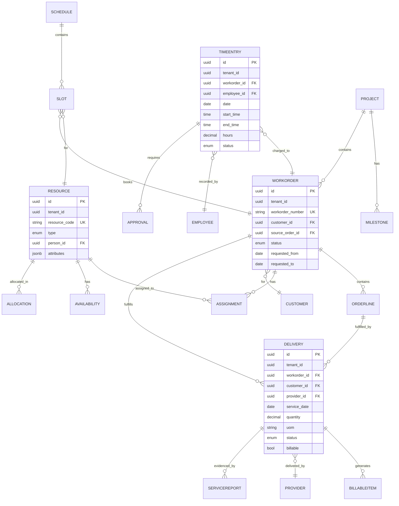

**Database Schemas:**
- `ops_ord` - Contains WorkOrder, OrderLine, Assignment
- `ops_svc` - Contains Delivery, BillableItem, ServiceReport
- `ops_res` - Contains Resource, Availability, Allocation
- `ops_sch` - Contains Schedule, Slot, Appointment
- `ops_tim` - Contains TimeEntry, Attendance, Approval
- `ops_prj` - Contains Project, Milestone, WorkPackage
- `ops_tsk` - Contains Task, Checklist, Dependency
- `ops_doc` - Contains Document, Attachment

---

## 6. Business Rules & Constraints

### 6.1 Suite-Level Business Rules

**BR-OPS-001: Work Order Validation**
- **Description:** Work order must reference valid customer and optionally a sales order
- **Applies To:** ops.ord
- **Enforcement:** On create and update
- **Rationale:** Ensure traceability to source order and customer context

**BR-OPS-002: Delivery Quantity Constraint**
- **Description:** Delivery quantity cannot exceed order line remaining quantity
- **Applies To:** ops.svc
- **Enforcement:** On delivery create
- **Rationale:** Prevent over-delivery and billing disputes

**BR-OPS-003: Resource Uniqueness**
- **Description:** Resource can only be assigned to one slot at a time (no double-booking)
- **Applies To:** ops.sch, ops.res
- **Enforcement:** On slot booking
- **Rationale:** Prevent resource conflicts and overbooking

**BR-OPS-004: Billable Item Prerequisites**
- **Description:** Billable item can only be created from approved delivery
- **Applies To:** ops.svc
- **Enforcement:** On billable item generation
- **Rationale:** Ensure billing accuracy and prevent premature invoicing

**BR-OPS-005: Time Entry Validation**
- **Description:** Time entry must reference valid work order or project
- **Applies To:** ops.tim
- **Enforcement:** On time entry create
- **Rationale:** Ensure time can be billed or allocated correctly

### 6.2 Data Quality Rules

**DQ-001: Delivery Date**
- **Field:** delivery.service_date
- **Constraint:** Must be between work order start and end date
- **Validation:** service_date >= workorder.requested_from AND service_date <= workorder.requested_to
- **Error Handling:** Reject with error message, suggest valid date range

**DQ-002: Time Entry Duration**
- **Field:** timeentry.hours
- **Constraint:** Must be between 0.25 and 24 hours per entry
- **Validation:** hours >= 0.25 AND hours <= 24
- **Error Handling:** Reject with error, suggest splitting into multiple entries

**DQ-003: Resource Availability**
- **Field:** resource.availability
- **Constraint:** Availability periods must not overlap
- **Validation:** No overlapping date ranges for same resource
- **Error Handling:** Reject with conflict details

### 6.3 Workflow Rules

**WF-001: Delivery Approval Workflow**
- **Trigger:** Delivery submitted (status changed to SUBMITTED)
- **Preconditions:** Delivery validated, work order exists
- **Steps:**
  1. Assign to manager based on work order assignment
  2. Send approval request notification
  3. Manager approves or rejects
  4. If approved: Generate billable item
  5. If rejected: Notify provider, delivery status = REJECTED
- **Postconditions:** Delivery either APPROVED or REJECTED
- **Exceptions:** Timeout (48h) → Escalate to senior manager

**WF-002: Resource Scheduling Workflow**
- **Trigger:** Work order released (status = RELEASED)
- **Preconditions:** Work order has resource requirements defined
- **Steps:**
  1. Query resource availability (ops.res)
  2. Find matching resources with required skills
  3. Propose time slots
  4. Reserve resource capacity (pessimistic lock)
  5. Create slot booking (ops.sch)
  6. Confirm booking if accepted
- **Postconditions:** Work order scheduled or scheduling failed
- **Exceptions:** No available resources → Notify dispatcher for manual scheduling

---

## 6. Feature Catalog

This section maps OPS suite features to their specifications. All features follow the `F-OPS-NNN` naming scheme.

### 6.1 Feature Composition Index

| Composition ID | Name | Node Type | Primary Domain | Priority |
|---|---|---|---|---|
| F-OPS-001 | Work Order Management | COMPOSITION | ops.ord, ops.svc | P1 |
| F-OPS-002 | Resource & Scheduling | COMPOSITION | ops.res, ops.sch | P1 |
| F-OPS-003 | Time & Project Tracking | COMPOSITION | ops.tim, ops.prj, ops.tsk | P1 |

### 6.2 Leaf Feature Index

| Feature ID | Name | Parent Composition | Node Type | Mandatory? |
|---|---|---|---|---|
| F-OPS-001-01 | Create Work Order | F-OPS-001 | LEAF | Yes |
| F-OPS-001-02 | Work Order Execution | F-OPS-001 | LEAF | Yes |
| F-OPS-001-03 | Work Order Close & Report | F-OPS-001 | LEAF | Optional |
| F-OPS-002-01 | Resource Availability | F-OPS-002 | LEAF | Yes |
| F-OPS-002-02 | Schedule Assignment | F-OPS-002 | LEAF | Yes |
| F-OPS-002-03 | Utilization Report | F-OPS-002 | LEAF | Optional |
| F-OPS-003-01 | Time Entry | F-OPS-003 | LEAF | Yes |
| F-OPS-003-02 | Project Status Board | F-OPS-003 | LEAF | Yes |
| F-OPS-003-03 | Task Management | F-OPS-003 | LEAF | Optional |

### 6.3 UVL Catalog
See companion file `ops.catalog.uvl`.

---

## 7. Technical Architecture Principles

### 7.1 Multi-Tenancy

**Approach:** Row-Level Security (RLS)

**Implementation:**
- Every entity has `tenant_id` column
- PostgreSQL RLS policies enforce isolation
- Users can only access their tenant's operational data
- Service-to-service calls include tenant context

**Example:**
```sql
CREATE POLICY tenant_isolation ON ops_delivery
    FOR ALL
    TO ops_user
    USING (tenant_id = current_setting('app.current_tenant')::uuid);
```

### 7.2 Multi-Currency

**Approach:** Store currency with every amount field

**Implementation:**
- BillableItem has both amount and currency fields
- Exchange rates queried from REF service at pricing time
- Deliveries stored in service currency (might differ from billing currency)
- FI handles currency conversion for invoicing

**Example:**
```
Delivery in USD: $500 (consultant rate in dollars)
Customer currency: EUR
Exchange rate at billing: 1.10
→ Billable item: amount=$500, currency=USD
→ FI converts to EUR for invoice: €454.55
```

### 7.3 Multi-Language

**Approach:** Translatable text fields with fallback to English

**Implementation:**
- Resource descriptions stored in tenant default language
- UI translations for statuses, types, etc.
- Service reports can be generated in customer's language
- Event messages in English (technical)

**Translation Tables:**
| Entity | Translatable Fields | Languages Supported |
|--------|-------------------|-------------------|
| Resource | description, notes | tenant.default_language + EN |
| WorkOrder | description, notes | customer.preferred_language + EN |
| ServiceReport | report_text, customer_notes | customer.preferred_language |

### 7.4 Versioning & History

**Approach:** Immutable deliveries with reversal pattern

**Implementation:**
- Deliveries are append-only (no updates to approved deliveries)
- Corrections done via reversal entry + new entry
- Audit log tracks all status changes
- Time entries also immutable after approval

**Reversal Pattern:**
```
Original Delivery:
  id: del-001
  quantity: 5.0 hours
  status: APPROVED
  
Reversal (if error found):
  id: del-002
  reversal_of: del-001
  quantity: -5.0 hours
  status: REVERSED
  
Corrected Delivery:
  id: del-003
  replaces: del-001
  quantity: 4.5 hours
  status: APPROVED
  
Net Effect: 4.5 hours delivered
History: Complete audit trail preserved
```

### 7.5 Audit Trail

**Approach:** Event sourcing for critical operations

**Audit Events Logged:**
- All delivery create/approve/reject operations
- All time entry create/approve operations
- All resource scheduling operations
- All work order status changes
- All billable item generation events

**Audit Schema:**
```json
{
  "eventType": "delivery.approved",
  "aggregateType": "ops.svc.delivery",
  "entityId": "del-123",
  "userId": "usr-456",
  "timestamp": "2025-12-05T14:30:00Z",
  "changes": {
    "status": {
      "old": "SUBMITTED",
      "new": "APPROVED"
    },
    "approved_by": "mgr-789",
    "approved_at": "2025-12-05T14:30:00Z"
  },
  "ipAddress": "192.168.1.100",
  "userAgent": "Mobile App v2.1"
}
```

---

## 8. Deployment Architecture

### 8.1 Service Topology

**Microservices Structure:**

```
OPS Suite Services:
├── ops-ord-service (Order Management)
├── ops-svc-service (Service Delivery)
├── ops-res-service (Resource Management)
├── ops-sch-service (Scheduling)
├── ops-tim-service (Time Tracking)
├── ops-prj-service (Project Management)
├── ops-tsk-service (Task Management)
└── ops-doc-service (Operational Documentation)

Shared Infrastructure:
├── postgresql (transactional data)
├── rabbitmq (event bus)
├── redis (caching)
└── s3/minio (document storage)
```

### 8.2 Data Storage

**Transactional Databases (PostgreSQL):**
- ops.ord: WorkOrder, OrderLine, Assignment
- ops.svc: Delivery, BillableItem, ServiceReport
- ops.res: Resource, Availability, Allocation
- ops.sch: Schedule, Slot, Appointment
- ops.tim: TimeEntry, Attendance, Approval
- ops.prj: Project, Milestone, WorkPackage
- ops.tsk: Task, Checklist, Dependency
- ops.doc: Document metadata (files in S3)
- Each service: Own database schema
- Cross-service: Foreign key by ID only (no DB joins)

**Document Storage (S3/MinIO):**
- Service reports (PDF)
- Signed delivery confirmations
- Photo evidence of work performed
- Equipment maintenance logs
- Customer signatures

**Analytical Storage (Read Models):**
- ops.rpt: Delivery summary (materialized view)
- ops.rpt: Resource utilization (pre-computed)
- ops.rpt: Time tracking reports (refreshed daily)

**Caching Layer (Redis):**
- Resource availability (TTL: 5 minutes)
- Active work orders (TTL: 1 hour)
- Pricing rules (TTL: 24 hours)
- Session data (TTL: 30 minutes)

### 8.3 Event Bus Architecture

**Exchange Structure:**
```
ops.events (topic exchange)
├── ops.ord.workorder.{created|released|completed|cancelled}
├── ops.ord.orderline.{fulfilled}
├── ops.ord.assignment.{created|confirmed}
├── ops.svc.delivery.{created|submitted|approved|rejected}
├── ops.svc.billable.ready
├── ops.res.resource.{created|updated}
├── ops.res.availability.changed
├── ops.sch.slot.{booked|confirmed|cancelled}
├── ops.tim.timeentry.{created|approved|rejected}
├── ops.prj.project.{created|milestone.reached}
├── ops.tsk.task.{created|completed}
└── ops.doc.document.attached
```

**Queue Strategy:**
- Durable queues for critical events (billing, payroll)
- Auto-delete queues for notifications
- Dead Letter Queue (DLQ) for failed messages
- Message TTL: 24 hours

**Consumer Groups:**
| Queue | Consumers | Purpose |
|-------|-----------|---------|
| fi.bil.in.ops | fi-bil-service | Consume billable items |
| hr.payroll.in.ops | hr-payroll-service | Consume approved times |
| analytics.in.ops | analytics-service | Consume all OPS events |

### 8.4 API Gateway & Routing

**API Structure:**
```
/api/ops/{domain}/v1/{resource}
/api/ops/{domain}/v1/{resource}/{id}
/api/ops/{domain}/v1/{resource}/{id}/{sub-resource}
```

**Examples:**
```
GET /api/ops/ord/v1/workorders
POST /api/ops/svc/v1/deliveries
PUT /api/ops/tim/v1/timeentries/{id}/approve
GET /api/ops/res/v1/resources/{id}/availability?from=2025-12-06&to=2025-12-10
```

**Authentication:**
- OAuth 2.0 / JWT tokens
- Service-to-service: mTLS
- Mobile app: JWT with refresh tokens

**Rate Limiting:**
- Per tenant: 1000 requests/minute
- Per user: 100 requests/minute
- Burst limit: 200 requests

---

## 9. Governance & Standards

### 9.1 Operational Standards Support

**Supported Standards:**
- **ISO 8601:** Date/time formats
- **UCUM:** Units of measure (hours, pieces, kilometers)
- **ISO 4217:** Currency codes

**OPS-Specific Standards:**
| Standard | Purpose | Implementation |
|----------|---------|----------------|
| Time Rounding | Standardize time entry precision | 15-minute increments (0.25h) |
| Delivery Validation | Quality assurance | Mandatory fields, approval workflow |
| Resource Capacity | Prevent overbooking | Pessimistic locking on slot booking |

### 9.2 Change Management

**Master Data Changes:**
- Resource types: Can be added, cannot be deleted (deprecate instead)
- Work order templates: Versioned, effective-dated
- Approval workflows: Configuration-driven, can be customized per tenant

**Operational Rule Changes:**
- Pricing rules: Effective-dated, historical prices preserved
- Validation rules: Can be tightened (stricter) but not loosened without data cleanup
- Approval thresholds: Can be changed, applies to new deliveries only

**Service Interruptions:**
- Planned maintenance: Announced 7 days in advance
- Mobile app must support offline mode (queue changes locally)
- Critical operations (time tracking) must have fallback (paper timesheets)

### 9.3 Quality Attributes

**Performance Targets:**
- API response time (p95): < 200ms
- Event processing latency: < 500ms
- Mobile sync: < 5 seconds for typical day's data
- Bulk operations: 1000 records/minute

**Availability Target:** 99.5% (excludes planned maintenance)

**Scalability:**
- Horizontal scaling: 5+ instances per service
- Concurrent users: 10,000 active users
- Daily transactions: 100,000 deliveries/day

**Disaster Recovery:**
- RTO (Recovery Time Objective): < 30 minutes
- RPO (Recovery Point Objective): < 15 minutes
- Backup frequency: Every 6 hours
- Backup retention: 90 days

---

## 10. Security & Compliance

### 10.1 Data Classification

**Sensitivity Levels:**
| Data Element | Classification | Rationale | Protection Measures |
|--------------|----------------|-----------|---------------------|
| WorkOrder ID | Public | Technical identifier | None required |
| Customer Name | Internal | Business data | Multi-tenancy isolation |
| Provider Name | Confidential | Employee/contractor data | Encryption, RBAC, audit trail |
| Service Details | Confidential | Customer service data | Encryption, audit trail |
| Time Records | Confidential | Employee working times | Encryption, RBAC, audit, payroll data |
| Billing Amounts | Restricted | Financial data | Encryption, RBAC, audit, limited access |

### 10.2 Access Control

**Roles & Permissions:**
| Role | Read | Create | Update | Delete | Admin Operations |
|------|------|--------|--------|--------|------------------|
| OPS_VIEWER | ✓ | ✗ | ✗ | ✗ | ✗ |
| OPS_PROVIDER | ✓ | ✓ | ✓ (own) | ✗ | ✗ |
| OPS_DISPATCHER | ✓ | ✓ | ✓ | ✗ | ✗ |
| OPS_MANAGER | ✓ | ✓ | ✓ | ✓ | ✗ |
| OPS_ADMIN | ✓ | ✓ | ✓ | ✓ | ✓ |

**Data Isolation:**
- Multi-tenancy: Row-Level Security (RLS) via `tenant_id`
- Providers can only see their own deliveries and assignments
- Managers can see all deliveries in their team
- Admin operations restricted to system administrators

### 10.3 Compliance Requirements

**Regulations:**
- ☑ GDPR (EU) - Personal data protection (employee working times)
- ☑ Labor Law - Working time regulations (max hours, breaks, rest periods)
- ☐ SOX (Financial) - Financial data integrity (if public company)
- ☐ Industry-Specific - Depends on industry (healthcare, financial services)

**Compliance Controls:**
1. **Data Retention:**
   - Delivery records: 10 years (tax/audit requirement)
   - Time records: 3 years minimum (labor law)
   - Service reports: 7 years (contract law)

2. **Right to Erasure (GDPR Article 17):**
   - Endpoint: `DELETE /api/ops/gdpr/erase/{userId}`
   - Anonymizes employee/provider personal data
   - Retains aggregate statistics for reporting

3. **Data Portability (GDPR Article 20):**
   - Endpoint: `GET /api/ops/gdpr/export/{userId}`
   - Returns employee's time entries and deliveries in JSON format

4. **Audit Trail:**
   - All access to time records logged
   - Logs retained for 7 years
   - Includes: who, what, when, from where (IP address)

5. **Labor Law Compliance:**
   - Working time validation (max 10 hours/day, 48 hours/week)
   - Mandatory break tracking (after 6 hours)
   - Rest period enforcement (11 hours between shifts)

---

## 11. Migration & Evolution

### 11.1 Migration Strategy

**From Legacy System:**
| Source | Target | Mapping | Data Quality Issues |
|--------|--------|---------|---------------------|
| Legacy Orders | ops.ord.WorkOrder | Map order fields, derive status | Missing customer references |
| Legacy Timesheets | ops.tim.TimeEntry | Convert to decimal hours | Inconsistent date formats |
| Legacy Deliveries | ops.svc.Delivery | Map service types | Missing approval status |

**Migration Phases:**
1. **Phase 1:** Migrate historical data (read-only, last 2 years)
2. **Phase 2:** Parallel run (new transactions in both systems)
3. **Phase 3:** Cutover (legacy system read-only)
4. **Phase 4:** Decommission legacy system

**Rollback Plan:**
- Keep legacy system available for 6 months post-cutover
- Ability to revert to legacy if critical issues found
- Data sync scripts for emergency rollback

### 11.2 Versioning Strategy

**API Versioning:**
- URL-based: `/v1`, `/v2`
- Backward compatibility: Maintained for 12 months
- Deprecation notice: 6 months before removal

**Event Versioning:**
- Version field in envelope (version: 1, 2, 3, ...)
- Schema evolution rules:
  - Adding optional fields: OK (backward compatible)
  - Renaming fields: Requires new version
  - Removing fields: Requires new version
- Consumers must handle multiple versions during transition

### 11.3 Deprecation & Sunset

**Deprecated Features:**
| Feature | Deprecated Date | Removal Date | Alternative |
|---------|----------------|--------------|-------------|
| v1 time entry API | 2026-Q1 | 2026-Q3 | v2 API with approval workflow |
| Manual price entry | 2026-Q2 | 2026-Q4 | Automated pricing from COM |

**Communication Plan:**
- 12 months notice to API consumers
- Quarterly reminders via email and dashboard
- Migration guide with code examples
- Deprecation warnings in API responses

---

## 12. Implementation Roadmap

### 12.1 Phase 1: Core OPS (P1)

**Scope:**
- ops.ord - Order Management
- ops.svc - Service Delivery
- ops.res - Resource Management
- ops.sch - Scheduling
- ops.tim - Time Tracking

**Timeline:** 16-20 weeks

**Deliverables:**
- [ ] 5 microservices deployed
- [ ] Core event flows operational (Order → Delivery → Billing)
- [ ] Basic mobile app for time tracking and delivery capture
- [ ] Integration with COM (orders) and FI (billing)
- [ ] Admin portal for resource and schedule management

**Dependencies:**
- COM Suite operational (sales orders)
- FI Suite operational (billing)
- BP Suite operational (customers, employees)
- REF data available (UoM, currencies)

### 12.2 Phase 2: Extended OPS (P2)

**Scope:**
- ops.prj - Project Management
- ops.tsk - Task Management
- ops.doc - Operational Documentation

**Timeline:** 8-12 weeks

**Deliverables:**
- [ ] 3 additional microservices deployed
- [ ] Project hierarchy and milestone tracking
- [ ] Task assignment and checklist functionality
- [ ] Document attachment and service report generation
- [ ] Enhanced mobile app with offline support

**Dependencies:**
- Phase 1 completion
- DMS integration available
- Analytics infrastructure ready

### 12.3 Phase 3: Advanced Features (P3)

**Scope:**
- AI-based scheduling optimization
- IoT/telemetry integration for usage-based billing
- Advanced resource capacity planning
- Mobile app enhancements (GPS tracking, photo capture)
- Customer self-service portal

**Timeline:** 12-16 weeks

**Deliverables:**
- [ ] AI scheduling engine operational
- [ ] IoT device integration framework
- [ ] Capacity planning dashboards
- [ ] Customer portal for delivery confirmation
- [ ] Advanced analytics and predictive maintenance

---

## 13. Open Questions & Decisions

### 13.1 Open Questions

| ID | Question | Impact | Decision Needed By | Owner |
|----|----------|--------|-------------------|-------|
| Q-001 | Should ops.tim track breaks separately or just work time? | Medium - Affects labor law compliance | 2026-Q1 | Compliance Team |
| Q-002 | How to handle multi-resource deliveries (team work)? | Medium - Affects billing and payroll | 2026-Q1 | Product Owner |
| Q-003 | Support for equipment maintenance scheduling? | Low - Can be Phase 3 | 2026-Q2 | Operations Manager |

### 13.2 Architectural Decision Records (ADRs)

#### ADR-001: Choreographed Sagas for OPS

**Status:** Accepted

**Context:**
OPS workflows are naturally asynchronous (order today, deliver tomorrow, bill next week). Operational processes tolerate eventual consistency. Multiple external systems involved (COM, FI, HR).

**Decision:**
Use choreographed sagas (event-driven) as default pattern for OPS workflows. Each domain reacts to events independently. No central orchestrator.

**Consequences:**
- **Positive:** Loose coupling, resilient to partial failures, scales well
- **Negative:** No single view of workflow state, harder to debug, eventual consistency only
- **Risks:** Event ordering issues, duplicate event handling

**Alternatives Considered:**
1. Orchestrated sagas - Rejected because requires central coordinator, tight coupling
2. Synchronous APIs - Rejected because too brittle for long-running processes

#### ADR-002: Immutable Deliveries with Reversal Pattern

**Status:** Accepted

**Context:**
Deliveries are used for billing and must have audit trail. Corrections are common (wrong time recorded, wrong quantity). Need to preserve history for compliance.

**Decision:**
Make approved deliveries immutable. Corrections done via reversal entry (negative quantity) plus new corrected entry. Complete audit trail preserved.

**Consequences:**
- **Positive:** Complete audit trail, no data loss, supports billing disputes
- **Negative:** More complex queries (must sum reversals), storage overhead
- **Risks:** Users might not understand reversal concept

**Alternatives Considered:**
1. Allow updates to deliveries - Rejected because loses audit trail
2. Soft delete + recreate - Rejected because ambiguous for reporting

#### ADR-003: Pessimistic Locking for Resource Scheduling

**Status:** Accepted

**Context:**
Resource overbooking is unacceptable (double-booking consultant, room, equipment). Optimistic locking can lead to conflicts in high-concurrency scenarios.

**Decision:**
Use pessimistic locking (database row locks) when booking resource slots. Lock resource capacity row during availability check and booking. Accept slightly lower throughput for data consistency.

**Consequences:**
- **Positive:** No overbooking, data consistency guaranteed
- **Negative:** Lower throughput (waiting for locks), potential deadlocks
- **Risks:** Deadlock detection and resolution needed

**Alternatives Considered:**
1. Optimistic locking - Rejected because too many conflicts in concurrent booking scenarios
2. Event sourcing - Rejected as over-engineered for this use case

---

## 14. Appendix

### 14.1 Glossary

| Term | Definition | Aliases |
|------|------------|---------|
| **Work Order** | Operational order to execute work, derived from sales order | Service Order, Job Order |
| **Delivery** | Record of service actually delivered | Service Delivery, Performance Record |
| **Billable Item** | Priced delivery ready for invoicing | Billing Item, Invoice Item |
| **Provider** | Person or entity delivering the service | Service Provider, Consultant, Technician |
| **Resource** | Person, equipment, or facility available for work | Asset, Capacity |
| **Slot** | Time period in schedule | Time Slot, Appointment Slot |
| **Time Entry** | Record of time spent on work | Timesheet Entry, Time Log |
| **Approval** | Manager confirmation that delivery or time is valid | Authorization, Sign-off |
| **Service Report** | Documented evidence of service delivery | Delivery Note, Service Confirmation |
| **Reversal** | Negative entry to correct previous entry | Correction, Void |

### 14.2 Acronyms

| Acronym | Full Name | Description |
|---------|-----------|-------------|
| OPS | Operational Services | The operations suite |
| COM | Commerce | Sales and contracts suite |
| FI | Finance | Financial accounting suite |
| HR | Human Resources | Employee management suite |
| BP | Business Partner | Customer/vendor master data |
| REF | Reference Data | Codes and catalogs |
| DMS | Document Management | File storage system |
| UoM | Unit of Measure | Quantity units (hours, pieces) |
| SLA | Service Level Agreement | Performance commitment |
| RLS | Row-Level Security | Multi-tenancy data isolation |

### 14.3 OPS vs. Related Suites - Quick Reference

| Question | OPS Answer | COM Answer | FI Answer |
|----------|------------|------------|-----------|
| What is tracked? | Actual deliveries | Commitments (orders) | Financial transactions |
| Who is the user? | Service providers, dispatchers | Sales teams | Accountants, controllers |
| Can data be changed? | No (reversals only) | Yes (before fulfillment) | No (reversals only) |
| Time perspective? | Historical (what happened) | Future (what's planned) | Historical (recorded) |
| Integration direction? | Receives from COM, sends to FI | Sends to OPS | Receives from OPS |
| Granularity? | Individual deliveries | Order lines | Aggregated invoices |

### 14.4 References

**Business Documents:**
- Service Management Best Practices (ITIL)
- Professional Services Automation (PSA) Standards
- Field Service Management Guidelines

**Technical Standards:**
- [system-topology.md](https://github.com/openleap-io/io.openleap.dev.hub/blob/main/architecture/system-topology.md) - Platform architecture overview
- `orchestration.md` - Orchestration patterns, saga guidelines
- `TECHNICAL_STANDARDS.md` - Cross-cutting technical conventions
- `EVENT_STANDARDS.md` - Event structure and routing
- `DOMAIN_SPEC_TEMPLATE.md` - Domain specification template

**External Standards:**
- ISO 8601 - Date and time format
- UCUM - Units of Measure
- ISO 4217 - Currency codes
- RFC 3339 - Internet timestamps

**Architecture Patterns:**
- Microservices Architecture (Martin Fowler)
- Event-Driven Architecture (Gregor Hohpe)
- Domain-Driven Design (Eric Evans)
- Saga Pattern for Distributed Transactions

### 14.5 Domain Specification References

**Complete Domain Specifications:**
- `domain-specs/ops_ord-spec.md` - Order Management
- `domain-specs/ops_svc-spec.md` - Service Delivery
- `domain-specs/ops_res-spec.md` - Resource Management
- `domain-specs/ops_sch-spec.md` - Scheduling
- `domain-specs/ops_tim-spec.md` - Time Tracking
- `domain-specs/ops_prj-spec.md` - Project Management
- `domain-specs/ops_tsk-spec.md` - Task Management
- `domain-specs/ops_doc-spec.md` - Operational Documentation

**Related Suite Specifications:**
- `COM_Suite_Specification.md` - Commerce Suite
- `FI_Suite_Specification.md` - Financial Accounting Suite
- `HR_Suite_Overview.md` - Human Resources Suite

### 14.6 Version History

| Version | Date | Author | Changes |
|---------|------|--------|---------|
| 1.0 | 2025-12-05 | Architecture Team | Initial specification based on template |

---

## Document Review & Approval

**Status:** DRAFT

**Review Schedule:** Bi-weekly during Phase 1, quarterly after go-live

**Reviewers:**
- Product Owner: {Name} - {Date} - [ ] Approved
- System Architect: {Name} - {Date} - [ ] Approved
- Technical Lead (OPS): {Name} - {Date} - [ ] Approved
- Domain Architect (Operations): {Name} - {Date} - [ ] Approved

**Approval:**
- Product Owner: {Name} - {Date} - [ ] Approved
- CTO/VP Engineering: {Name} - {Date} - [ ] Approved

---

**Document Status:** DRAFT - Ready for Review

**Next Steps:**
1. Review with operations stakeholders
2. Validate against existing ops_*.md domain specs
3. Identify gaps and inconsistencies
4. Create individual domain specification updates
5. Begin Phase 1 implementation planning
6. Establish saga implementation patterns
7. Define integration contracts with COM and FI

**Total Estimated Effort:** 24-32 weeks (all phases)
