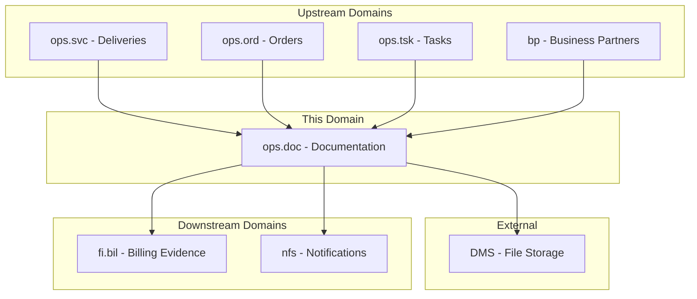
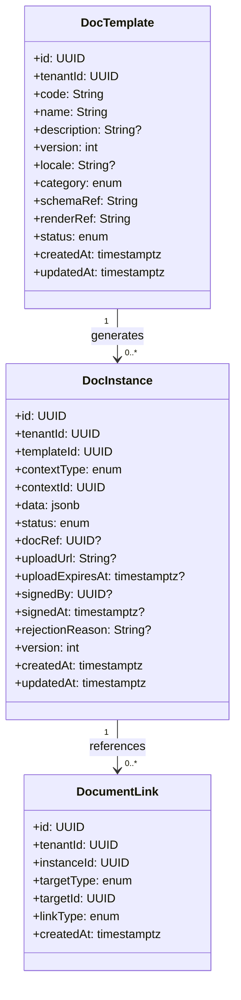
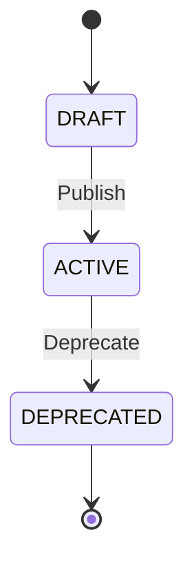
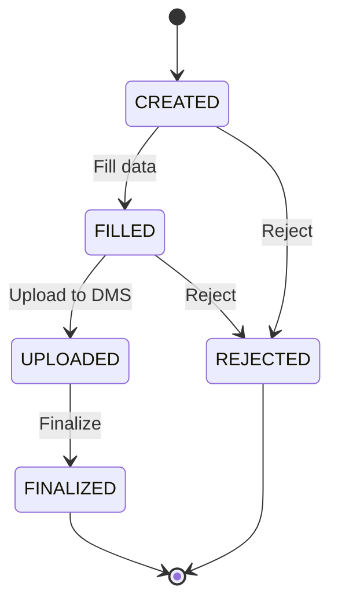
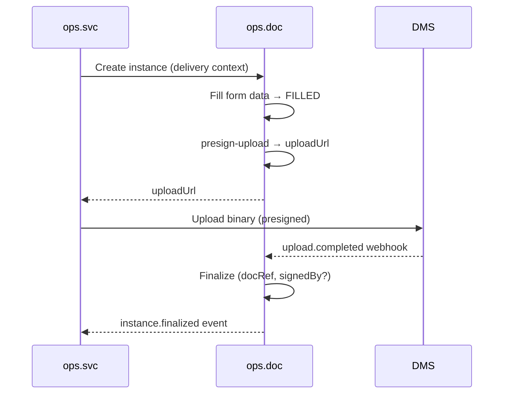
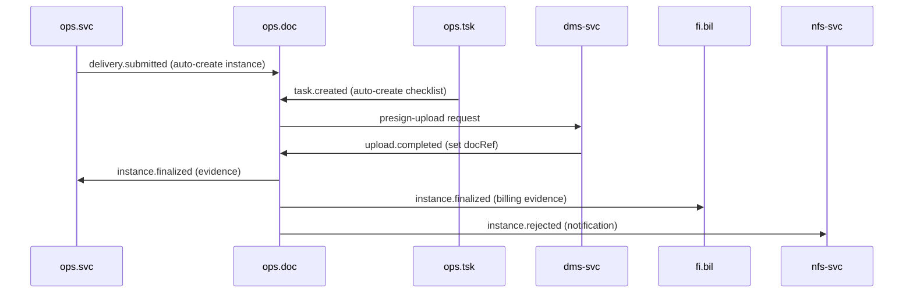
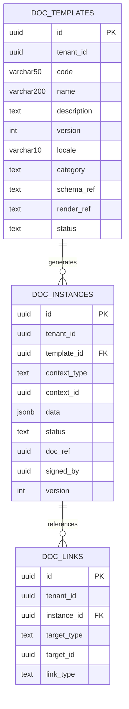

<!-- TEMPLATE COMPLIANCE: ~95%
Template: domain-service-spec.md v1.0.0
Present sections: §0-§15 (all sections present)
Missing sections: none
Naming issues: none — follows ops_doc-spec.md convention
Duplicates: none
Priority: N/A — fully compliant
-->
# OPS.DOC - Operational Documentation Domain / Service Specification

> **Conceptual Stack Layer:** Domain / Service
> **Space:** Platform
> **Owner:** Domain Engineering Team
> **Schema alignment:** `service-layer.schema.json`
> **Companion files:** `openapi.yaml`, `*.schema.json` (event contracts)
> **Referenced by:** Platform-Feature Spec SS5 (backend dependencies), BFF Contract
> **Belongs to:** OPS Suite Spec (`_ops_suite.md`)

> **Meta Information**
> - **Version:** 2026-04-03
> - **Template:** `domain-service-spec.md` v1.0.0
> - **Template Compliance:** ~95%
> - **Author(s):** OpenLeap Architecture Team
> - **Status:** DRAFT
> - **Suite:** `ops`
> - **Domain:** `doc`
> - **Bounded Context Ref:** `bc:operational-documentation`
> - **Service ID:** `ops-doc-svc`
> - **basePackage:** `io.openleap.ops.doc`
> - **API Base Path:** `/api/ops/doc/v1`
> - **OpenLeap Starter Version:** `v1`
> - **Port:** OPEN QUESTION
> - **Repository:** OPEN QUESTION
> - **Tags:** `ops`, `documentation`, `templates`, `checklists`, `dms-integration`
> - **Team:**
>   - Name: `team-ops`
>   - Email: `ops-team@openleap.io`
>   - Slack: `#ops-team`

---

## Specification Guidelines Compliance

>
> ### Non-Negotiables
> - Never invent facts. If required info is missing, add an **OPEN QUESTION** entry.
> - Preserve intent and decisions. Only change meaning when explicitly requested.
> - Do not remove normative constraints unless they are explicitly replaced.
> - Keep the spec **self-contained**: no "see chat", no implicit context.
>
> ### Source of Truth Priority
> When sources conflict:
> 1. Spec (explicit) wins
> 2. Starter specs (implementation constraints) next
> 3. Guidelines (best practices) last
>
> ### Style Guide
> - Prefer short sentences and lists.
> - Use MUST/SHOULD/MAY for normative statements.
> - Keep terminology consistent (Aggregate, Domain Service, Application Service, Command, Event).
> - Avoid ambiguous words ("often", "maybe") unless explicitly noting uncertainty.

---

## 0. Document Purpose & Scope

### 0.1 Purpose
This specification defines the Operational Documentation domain within the OPS Suite. `ops.doc` manages operational documents and structured checklists/forms used during service delivery: visit protocols, service reports, safety checklists, templates with versioning and localization, and DMS integration via presigned upload/finalize protocol.

### 0.2 Target Audience
- Product Owners & Business Stakeholders
- System Architects & Technical Leads
- Integration Engineers

### 0.3 Scope
**In Scope:**
- Document template management (form schemas, render templates, versioning, locales)
- Document instance lifecycle (create, fill, upload, finalize, reject)
- DMS integration via presigned URL upload and finalize callback
- Linking documents to operational contexts (deliveries, orders, tasks, projects)
- Document register maintaining a cross-referenced index of all operational documents
- Signature capture (optional)

**Out of Scope:**
- DMS storage internals (delegated to DMS service)
- Legal e-sign with KYC (external providers)
- Invoice or billing document generation (-> FI Suite)
- Contract document management (-> COM Suite)

### 0.4 Related Documents
- `_ops_suite.md` - OPS Suite overview
- `ops_svc-spec.md` - Service Delivery
- `ops_ord-spec.md` - Order Management
- `DMS_Spec_MinIO.md` - Document Management System

---

## 1. Business Context

### 1.1 Domain Purpose
`ops.doc` ensures operational activities are properly documented. Service reports, delivery confirmations, inspection checklists, and signed attestations provide evidence for billing disputes, quality audits, and regulatory compliance. Templates enable standardized, multilingual document generation that is consistent across all operational contexts.

### 1.2 Business Value
- Standardized templates for consistent documentation across the organization
- Presigned upload protecting the service from large payloads
- Full audit trail from document creation to finalization
- Evidence of delivery for billing, factoring, and dispute resolution
- Multilingual support for international service operations
- Cross-referencing documents to work orders, deliveries, and tasks via DocumentLink

### 1.3 Key Stakeholders

| Role | Responsibility | Primary Use Cases |
|------|----------------|-------------------|
| Service Provider | Fill and upload documents during field visits | UC-DOC-002, UC-DOC-004 |
| Operations Manager | Define and manage templates, review documents | UC-DOC-001, UC-DOC-006 |
| Customer | Sign service reports and inspection forms | UC-DOC-005 |
| Billing Clerk | Use finalized documents as billing evidence | UC-DOC-006 |
| Quality Manager | Review checklists and inspection forms | UC-DOC-006 |

### 1.4 Strategic Positioning



### 1.5 Service Context

| Field | Value |
|-------|-------|
| Suite | `ops` (Operational Services) |
| Domain | `doc` (Operational Documentation) |
| Bounded Context | `bc:operational-documentation` |
| Service ID | `ops-doc-svc` |
| Base Package | `io.openleap.ops.doc` |
| Authoritative Sources | OPS Suite Spec (`_ops_suite.md`), Document Management best practices |

---

## 2. Service Identity

| Field | Value |
|-------|-------|
| **Service ID** | `ops-doc-svc` |
| **Display Name** | Operational Documentation Service |
| **Suite** | `ops` |
| **Domain** | `doc` |
| **Bounded Context Ref** | `bc:operational-documentation` |
| **Version** | 2026-04-03 |
| **Status** | DRAFT |
| **API Base Path** | `/api/ops/doc/v1` |
| **Repository** | OPEN QUESTION |
| **Tags** | `ops`, `documentation`, `templates`, `checklists`, `dms-integration` |
| **Team Name** | `team-ops` |
| **Team Email** | `ops-team@openleap.io` |
| **Team Slack** | `#ops-team` |

---

## 3. Domain Model

### 3.1 Conceptual Overview

The domain centers on three aggregates: **DocTemplate** defines reusable document schemas and rendering templates with versioning and localization. **DocInstance** represents a generated document filled from a template, linked to an operational context. **DocumentLink** cross-references documents to work orders, deliveries, tasks, and projects, maintaining a document register. The DMS integration uses the presigned upload pattern for binary storage.



### 3.2 Core Concepts

| Concept | Owner | Description | Glossary Ref |
|---------|-------|-------------|--------------|
| DocTemplate | ops-doc-svc | Reusable schema and rendering template for operational documents | Document Template |
| DocInstance | ops-doc-svc | Filled document instance linked to an operational context with DMS storage | Document Instance |
| DocumentLink | ops-doc-svc | Cross-reference between a document and an operational artifact (order, delivery, task) | Document Link |
| Presigned Upload | ops-doc-svc (via DMS) | Temporary URL allowing direct binary upload to DMS without proxying through the service | Presigned URL |

### 3.3 Aggregate Definitions

#### 3.3.1 Aggregate: DocTemplate

**Aggregate ID:** `agg:doc-template`
**Business Purpose:** Reusable schema and rendering template for operational documents. Defines form structure, validation rules, and output format for checklists, service reports, and inspection forms.

**Aggregate Root Attributes:**

| Attribute | Type | Format | Required | Description | Example | Constraints |
|-----------|------|--------|----------|-------------|---------|-------------|
| id | UUID | uuid | Yes | Unique identifier | `a1b2c3d4-...` | Immutable after create |
| tenantId | UUID | uuid | Yes | Tenant ownership | `t1-uuid` | Immutable, RLS-enforced |
| code | String | varchar(50) | Yes | Machine-readable template code | `SVC_REPORT_V1` | Unique within (tenantId, version, locale) |
| name | String | varchar(200) | Yes | Human-readable name | `"Service Report"` | — |
| description | String | text | No | Template purpose description | `"Standard service visit report"` | Max 2000 chars |
| version | Integer | — | Yes | Template version number | `1` | Monotonically increasing per code |
| locale | String | varchar(10) | No | BCP 47 locale tag | `de-DE` | Valid BCP 47 code; null = default |
| category | Enum | — | Yes | Template category | `CHECKLIST` | CHECKLIST, SERVICE_REPORT, INSPECTION_FORM, DELIVERY_NOTE, CUSTOM |
| schemaRef | String | text | Yes | JSON Schema URI for form validation | `s3://schemas/svc-report-v1.json` | Valid URI |
| renderRef | String | text | Yes | Render template URI (Mustache/Handlebars) | `s3://templates/svc-report-v1.hbs` | Valid URI |
| status | Enum | — | Yes | Lifecycle state | `ACTIVE` | DRAFT, ACTIVE, DEPRECATED |
| createdAt | Timestamptz | ISO 8601 | Yes | Creation timestamp | `2026-03-01T10:00:00Z` | System-managed |
| updatedAt | Timestamptz | ISO 8601 | Yes | Last update timestamp | `2026-03-01T10:00:00Z` | System-managed |

**Lifecycle States:**



**State Transitions:**

| From | To | Trigger | Guard / Precondition | Side Effects |
|------|----|---------|---------------------|--------------|
| — | DRAFT | Create | Valid schemaRef + renderRef (BR-001) | — |
| DRAFT | ACTIVE | Publish | Schema validates successfully (BR-002) | Emits `template.published` |
| ACTIVE | DEPRECATED | Deprecate | — | Emits `template.deprecated`; existing instances unaffected |

**Invariants:**
- INV-T-001: `(tenantId, code, version, locale)` MUST be unique (BR-001)
- INV-T-002: Only ACTIVE templates MAY be used to create new instances (BR-002)
- INV-T-003: DEPRECATED templates MUST NOT be used for new instance creation (BR-003)
- INV-T-004: `version` MUST be monotonically increasing per `(tenantId, code, locale)` tuple

**Domain Events Emitted:**

| Event | Routing Key | When | Key Payload |
|-------|-------------|------|-------------|
| TemplatePublished | `ops.doc.template.published` | DRAFT → ACTIVE | templateId, code, version, locale, category |
| TemplateDeprecated | `ops.doc.template.deprecated` | ACTIVE → DEPRECATED | templateId, code, version |

#### 3.3.2 Aggregate: DocInstance

**Aggregate ID:** `agg:doc-instance`
**Business Purpose:** Filled document instance linked to an operational context (delivery, order, task, project). Manages the full document lifecycle from creation through DMS upload to finalization with optional signature.

**Aggregate Root Attributes:**

| Attribute | Type | Format | Required | Description | Example | Constraints |
|-----------|------|--------|----------|-------------|---------|-------------|
| id | UUID | uuid | Yes | Unique identifier | `inst-uuid` | Immutable after create |
| tenantId | UUID | uuid | Yes | Tenant ownership | `t1-uuid` | Immutable, RLS-enforced |
| templateId | UUID | uuid | Yes | Source template reference | `tpl-uuid` | FK to DocTemplate; must be ACTIVE at creation |
| contextType | Enum | — | Yes | Type of operational context | `DELIVERY` | DELIVERY, ORDER, TASK, PROJECT, CUSTOM |
| contextId | UUID | uuid | Yes | Reference to operational artifact | `del-uuid` | Must reference valid artifact |
| data | JSONB | — | No | Filled form data | `{"hours": 5, ...}` | Validated against template schema |
| status | Enum | — | Yes | Lifecycle state | `CREATED` | CREATED, FILLED, UPLOADED, FINALIZED, REJECTED |
| docRef | UUID | uuid | No | DMS document reference | `dms-uuid` | Set after successful upload; required for FINALIZED |
| uploadUrl | String | text | No | Presigned upload URL | `https://dms/...` | Temporary; cleared after upload |
| uploadExpiresAt | Timestamptz | ISO 8601 | No | Upload URL expiration | `2026-03-15T10:30:00Z` | — |
| signedBy | UUID | uuid | No | Signer principal reference | `signer-uuid` | FK to iam.principal |
| signedAt | Timestamptz | ISO 8601 | No | Signature timestamp | `2026-03-15T14:00:00Z` | Set when signed |
| rejectionReason | String | text | No | Reason for rejection | `"Incomplete checklist"` | Required when REJECTED |
| version | Integer | — | Yes | Optimistic locking version | `1` | Auto-incremented |
| createdAt | Timestamptz | ISO 8601 | Yes | Creation timestamp | `2026-03-15T08:30:00Z` | System-managed |
| updatedAt | Timestamptz | ISO 8601 | Yes | Last update timestamp | `2026-03-15T10:00:00Z` | System-managed |

**Lifecycle States:**



**State Transitions:**

| From | To | Trigger | Guard / Precondition | Side Effects |
|------|----|---------|---------------------|--------------|
| — | CREATED | Create | Template ACTIVE (BR-002), contextId valid (BR-004) | — |
| CREATED | FILLED | Fill | Data validates against template schema (BR-005) | Emits `instance.filled` |
| FILLED | UPLOADED | PresignUpload + DMS callback | Upload completed successfully | Sets docRef; emits `instance.uploaded` |
| UPLOADED | FINALIZED | Finalize | docRef set (BR-006), optional signature | Emits `instance.finalized` |
| CREATED | REJECTED | Reject | Reason required (BR-007) | Emits `instance.rejected` |
| FILLED | REJECTED | Reject | Reason required (BR-007) | Emits `instance.rejected` |

**Invariants:**
- INV-I-001: `contextId` MUST reference a valid artifact of the specified `contextType` (BR-004)
- INV-I-002: `data` MUST validate against the template's JSON Schema (BR-005)
- INV-I-003: FINALIZED requires `docRef` to be set (BR-006)
- INV-I-004: FINALIZED instances are immutable — no field changes allowed (BR-008)
- INV-I-005: Signature fields (`signedBy`, `signedAt`) MUST both be set or both be null

**Domain Events Emitted:**

| Event | Routing Key | When | Key Payload |
|-------|-------------|------|-------------|
| InstanceFilled | `ops.doc.instance.filled` | CREATED → FILLED | instanceId, templateId, contextType, contextId |
| InstanceUploaded | `ops.doc.instance.uploaded` | FILLED → UPLOADED | instanceId, docRef |
| InstanceFinalized | `ops.doc.instance.finalized` | UPLOADED → FINALIZED | instanceId, templateId, contextType, contextId, docRef, signedBy? |
| InstanceRejected | `ops.doc.instance.rejected` | → REJECTED | instanceId, contextType, contextId, reason |

#### 3.3.3 Aggregate: DocumentLink

**Aggregate ID:** `agg:document-link`
**Business Purpose:** Cross-references documents to operational artifacts, maintaining a document register. Enables querying all documents for a given work order, delivery, or task.

**Aggregate Root Attributes:**

| Attribute | Type | Format | Required | Description | Example | Constraints |
|-----------|------|--------|----------|-------------|---------|-------------|
| id | UUID | uuid | Yes | Unique identifier | `link-uuid` | Immutable after create |
| tenantId | UUID | uuid | Yes | Tenant ownership | `t1-uuid` | Immutable, RLS-enforced |
| instanceId | UUID | uuid | Yes | Document instance reference | `inst-uuid` | FK to DocInstance |
| targetType | Enum | — | Yes | Target artifact type | `DELIVERY` | DELIVERY, ORDER, TASK, PROJECT |
| targetId | UUID | uuid | Yes | Target artifact reference | `del-uuid` | Must reference valid artifact |
| linkType | Enum | — | Yes | Relationship type | `PRIMARY` | PRIMARY, SUPPORTING, REFERENCE |
| createdAt | Timestamptz | ISO 8601 | Yes | Creation timestamp | `2026-03-15T08:30:00Z` | System-managed |

**Invariants:**
- INV-L-001: `(instanceId, targetType, targetId)` MUST be unique per tenant — no duplicate links (BR-009)
- INV-L-002: Each DocInstance MUST have at least one PRIMARY link (BR-010)

**Domain Events Emitted:**

| Event | Routing Key | When | Key Payload |
|-------|-------------|------|-------------|
| DocumentLinked | `ops.doc.link.created` | Link created | linkId, instanceId, targetType, targetId, linkType |

### 3.4 Enumerations

| Enum | Values | Description |
|------|--------|-------------|
| TemplateStatus | DRAFT, ACTIVE, DEPRECATED | Template lifecycle |
| TemplateCategory | CHECKLIST, SERVICE_REPORT, INSPECTION_FORM, DELIVERY_NOTE, CUSTOM | Template categorization |
| InstanceStatus | CREATED, FILLED, UPLOADED, FINALIZED, REJECTED | Document instance lifecycle |
| ContextType | DELIVERY, ORDER, TASK, PROJECT, CUSTOM | Operational context for document creation |
| TargetType | DELIVERY, ORDER, TASK, PROJECT | Link target artifact type |
| LinkType | PRIMARY, SUPPORTING, REFERENCE | Relationship classification |

---

## 4. Business Rules & Constraints

### 4.1 Business Rules Catalog

| ID | Rule Name | Description | Scope | Enforcement | Error Code |
|----|-----------|-------------|-------|-------------|------------|
| BR-001 | Version Uniqueness | `(tenantId, code, version, locale)` must be unique | DocTemplate | Create | `DOC-VAL-001` |
| BR-002 | Active Templates Only | Only ACTIVE templates may be used for new instances | DocTemplate | Instance create | `DOC-BIZ-002` |
| BR-003 | Deprecated No Create | DEPRECATED templates MUST NOT generate new instances | DocTemplate | Instance create | `DOC-BIZ-003` |
| BR-004 | Context References Valid | contextId MUST reference a valid operational artifact | DocInstance | Create | `DOC-VAL-004` |
| BR-005 | Schema Validation | Instance data MUST validate against template JSON Schema | DocInstance | Fill | `DOC-VAL-005` |
| BR-006 | Finalize Requires DocRef | FINALIZED status requires docRef to be set | DocInstance | Finalize | `DOC-BIZ-006` |
| BR-007 | Rejection Reason Required | Rejecting an instance requires a reason | DocInstance | Reject | `DOC-VAL-007` |
| BR-008 | Finalized Immutable | FINALIZED instances MUST NOT be modified | DocInstance | Update | `DOC-BIZ-008` |
| BR-009 | Unique Link | `(instanceId, targetType, targetId)` unique per tenant | DocumentLink | Create | `DOC-VAL-009` |
| BR-010 | Primary Link Required | Every DocInstance MUST have at least one PRIMARY link | DocumentLink | Finalize | `DOC-BIZ-010` |

### 4.2 Detailed Rule Definitions

#### BR-005: Schema Validation
**Context:** Operational documents must contain complete, valid data before they can be uploaded and finalized. Templates define JSON Schemas describing required fields.
**Rule Statement:** When filling a DocInstance, the `data` payload MUST validate against the JSON Schema referenced by the associated DocTemplate's `schemaRef`.
**Applies To:** DocInstance aggregate, Fill transition
**Enforcement:** Application Service loads the template schema and validates the data payload.
**Validation Logic:** `if (!jsonSchemaValidator.validate(template.schemaRef, instance.data)) throw SchemaValidationException`
**Error Handling:**
- Code: `DOC-VAL-005`
- Message: `"Instance data does not conform to template schema: {validationErrors}"`
- HTTP: 422 Unprocessable Entity

#### BR-006: Finalize Requires DocRef
**Context:** A finalized document MUST have a DMS reference proving that the binary was successfully stored. Without `docRef`, the document has no retrievable content.
**Rule Statement:** The `docRef` field MUST be set (non-null) before transitioning to FINALIZED.
**Applies To:** DocInstance aggregate, Finalize transition
**Enforcement:** Domain service checks `docRef != null` before allowing finalization.
**Validation Logic:** `if (instance.docRef == null) throw MissingDocRefException`
**Error Handling:**
- Code: `DOC-BIZ-006`
- Message: `"Cannot finalize instance {id}: docRef is required. Upload must complete first."`
- HTTP: 409 Conflict

#### BR-008: Finalized Immutable
**Context:** Once finalized, documents serve as legal evidence for billing, compliance, and audit. Modifications would undermine their evidentiary value.
**Rule Statement:** Once a DocInstance reaches FINALIZED status, no attribute may be changed.
**Applies To:** DocInstance aggregate
**Enforcement:** Domain service rejects any update command targeting a FINALIZED instance.
**Validation Logic:** `if (instance.status == FINALIZED) throw ImmutableInstanceException`
**Error Handling:**
- Code: `DOC-BIZ-008`
- Message: `"Instance {id} is finalized and cannot be modified."`
- HTTP: 409 Conflict

### 4.3 Data Validation Rules

| Field | Validation Rule | Error Code | Error Message |
|-------|----------------|------------|---------------|
| code | Required, varchar(50), alphanumeric + underscores | `DOC-VAL-001` | `"Template code is required (max 50 chars, alphanumeric)"` |
| name | Required, varchar(200) | `DOC-VAL-011` | `"Template name is required (max 200 chars)"` |
| schemaRef | Required, valid URI | `DOC-VAL-012` | `"Valid schema reference URI is required"` |
| renderRef | Required, valid URI | `DOC-VAL-013` | `"Valid render reference URI is required"` |
| templateId | Required, valid UUID, references ACTIVE template | `DOC-VAL-014` | `"Valid active template ID is required"` |
| contextType | Required, valid enum value | `DOC-VAL-015` | `"Valid context type required (DELIVERY, ORDER, TASK, PROJECT, CUSTOM)"` |
| contextId | Required, valid UUID | `DOC-VAL-004` | `"Valid context ID is required"` |
| data | Must validate against template schema | `DOC-VAL-005` | `"Data does not conform to template schema"` |
| locale | Optional, valid BCP 47 code | `DOC-VAL-016` | `"Locale must be a valid BCP 47 tag"` |
| category | Required, valid enum value | `DOC-VAL-017` | `"Valid template category required"` |

### 4.4 Reference Data Dependencies

| Catalog | Usage | Provider Service | Validation |
|---------|-------|-----------------|------------|
| Business Partners | Signature authority (signedBy) | bp-party-svc (T2) | Active status check |
| Operational artifacts | contextId references | ops-svc-svc, ops-ord-svc, ops-tsk-svc (T3) | Artifact existence check |
| DMS storage | docRef, presigned URLs | dms-svc (T1) | Document existence check |
| Locales (BCP 47) | `locale` field | i18n-svc (T1) | Code existence check |

---

## 5. Use Cases

### 5.1 Business Logic Placement

| Layer | Responsibilities |
|-------|-----------------|
| Application Service | Command validation, aggregate loading, event publishing, DMS presigned URL orchestration |
| Domain Service | Schema validation (cross-aggregate: template schema vs. instance data), context artifact validation |
| Aggregate | State transitions, invariant enforcement, attribute validation |

### 5.2 Use Cases

#### UC-DOC-001: Create Document Template

| Field | Value |
|-------|-------|
| **ID** | UC-DOC-001 |
| **Type** | WRITE |
| **Trigger** | REST |
| **Aggregate** | DocTemplate |
| **Domain Operation** | `DocTemplate.create()` |
| **Inputs** | code, name, description?, version, locale?, category, schemaRef, renderRef |
| **Outputs** | Created DocTemplate in DRAFT state |
| **Events** | — (no event on DRAFT creation) |
| **REST** | `POST /api/ops/doc/v1/templates` → 201 Created |
| **Idempotency** | Client-generated `Idempotency-Key` header |
| **Errors** | 400 (validation), 409 (BR-001 version uniqueness) |

#### UC-DOC-002: Publish Template

| Field | Value |
|-------|-------|
| **ID** | UC-DOC-002 |
| **Type** | WRITE |
| **Trigger** | REST |
| **Aggregate** | DocTemplate |
| **Domain Operation** | `DocTemplate.publish()` |
| **Inputs** | templateId |
| **Outputs** | DocTemplate in ACTIVE state |
| **Events** | `TemplatePublished` → `ops.doc.template.published` |
| **REST** | `POST /api/ops/doc/v1/templates/{id}:publish` → 200 OK |
| **Idempotency** | Idempotent (re-publish of ACTIVE is no-op) |
| **Errors** | 404 (not found), 409 (not in DRAFT), 422 (BR-002 schema validation failure) |

#### UC-DOC-003: Deprecate Template

| Field | Value |
|-------|-------|
| **ID** | UC-DOC-003 |
| **Type** | WRITE |
| **Trigger** | REST |
| **Aggregate** | DocTemplate |
| **Domain Operation** | `DocTemplate.deprecate()` |
| **Inputs** | templateId |
| **Outputs** | DocTemplate in DEPRECATED state |
| **Events** | `TemplateDeprecated` → `ops.doc.template.deprecated` |
| **REST** | `POST /api/ops/doc/v1/templates/{id}:deprecate` → 200 OK |
| **Idempotency** | Idempotent (re-deprecate of DEPRECATED is no-op) |
| **Errors** | 404 (not found), 409 (not in ACTIVE) |

#### UC-DOC-004: Create Document Instance

| Field | Value |
|-------|-------|
| **ID** | UC-DOC-004 |
| **Type** | WRITE |
| **Trigger** | REST or Event |
| **Aggregate** | DocInstance |
| **Domain Operation** | `DocInstance.create(templateId, contextType, contextId)` |
| **Inputs** | templateId, contextType, contextId, data? |
| **Outputs** | Created DocInstance in CREATED state |
| **Events** | — (no event on CREATED) |
| **REST** | `POST /api/ops/doc/v1/instances` → 201 Created |
| **Idempotency** | Client-generated `Idempotency-Key` header |
| **Errors** | 400 (validation), 422 (BR-002 template not ACTIVE, BR-004 invalid context) |

#### UC-DOC-005: Fill Document Instance

| Field | Value |
|-------|-------|
| **ID** | UC-DOC-005 |
| **Type** | WRITE |
| **Trigger** | REST |
| **Aggregate** | DocInstance |
| **Domain Operation** | `DocInstance.fill(data)` |
| **Inputs** | instanceId, data (form payload) |
| **Outputs** | DocInstance in FILLED state |
| **Events** | `InstanceFilled` → `ops.doc.instance.filled` |
| **REST** | `PATCH /api/ops/doc/v1/instances/{id}` → 200 OK |
| **Idempotency** | Optimistic locking via `If-Match` header |
| **Errors** | 404 (not found), 409 (not in CREATED), 412 (version mismatch), 422 (BR-005 schema validation) |

#### UC-DOC-006: Request Presigned Upload URL

| Field | Value |
|-------|-------|
| **ID** | UC-DOC-006 |
| **Type** | WRITE |
| **Trigger** | REST |
| **Aggregate** | DocInstance |
| **Domain Operation** | `DocInstance.presignUpload()` |
| **Inputs** | instanceId |
| **Outputs** | `{ uploadUrl, expiresAt }` |
| **Events** | — |
| **REST** | `POST /api/ops/doc/v1/instances/{id}:presign-upload` → 200 OK |
| **Idempotency** | Idempotent (re-request returns new URL) |
| **Errors** | 404 (not found), 409 (not in FILLED) |

#### UC-DOC-007: Finalize Document Instance

| Field | Value |
|-------|-------|
| **ID** | UC-DOC-007 |
| **Type** | WRITE |
| **Trigger** | REST |
| **Aggregate** | DocInstance |
| **Domain Operation** | `DocInstance.finalize(docRef, signedBy?, signedAt?)` |
| **Inputs** | instanceId, docRef, signedBy?, signedAt? |
| **Outputs** | DocInstance in FINALIZED state |
| **Events** | `InstanceFinalized` → `ops.doc.instance.finalized` |
| **REST** | `POST /api/ops/doc/v1/instances/{id}:finalize` → 200 OK |
| **Idempotency** | Idempotent (re-finalize of FINALIZED is no-op) |
| **Errors** | 404 (not found), 409 (not in UPLOADED, BR-006 missing docRef), 422 (BR-010 no primary link) |

#### UC-DOC-008: Reject Document Instance

| Field | Value |
|-------|-------|
| **ID** | UC-DOC-008 |
| **Type** | WRITE |
| **Trigger** | REST |
| **Aggregate** | DocInstance |
| **Domain Operation** | `DocInstance.reject(reason)` |
| **Inputs** | instanceId, reason |
| **Outputs** | DocInstance in REJECTED state |
| **Events** | `InstanceRejected` → `ops.doc.instance.rejected` |
| **REST** | `POST /api/ops/doc/v1/instances/{id}:reject` → 200 OK |
| **Idempotency** | Idempotent (re-reject of REJECTED is no-op) |
| **Errors** | 404 (not found), 409 (not in CREATED or FILLED), 422 (BR-007 reason required) |

#### UC-DOC-009: Link Document to Artifact

| Field | Value |
|-------|-------|
| **ID** | UC-DOC-009 |
| **Type** | WRITE |
| **Trigger** | REST |
| **Aggregate** | DocumentLink |
| **Domain Operation** | `DocumentLink.create(instanceId, targetType, targetId, linkType)` |
| **Inputs** | instanceId, targetType, targetId, linkType |
| **Outputs** | Created DocumentLink |
| **Events** | `DocumentLinked` → `ops.doc.link.created` |
| **REST** | `POST /api/ops/doc/v1/links` → 201 Created |
| **Idempotency** | Client-generated `Idempotency-Key` header |
| **Errors** | 400 (validation), 409 (BR-009 duplicate link) |

#### UC-DOC-010: List / Search Templates (READ)

| Field | Value |
|-------|-------|
| **ID** | UC-DOC-010 |
| **Type** | READ |
| **Trigger** | REST |
| **Aggregate** | DocTemplate |
| **Domain Operation** | Query projection |
| **Inputs** | code?, locale?, status?, category?, page, size |
| **Outputs** | Paginated template list |
| **Events** | — |
| **REST** | `GET /api/ops/doc/v1/templates?...` → 200 OK |
| **Idempotency** | Inherently idempotent (GET) |
| **Errors** | 400 (invalid filter params) |

#### UC-DOC-011: List / Search Instances (READ)

| Field | Value |
|-------|-------|
| **ID** | UC-DOC-011 |
| **Type** | READ |
| **Trigger** | REST |
| **Aggregate** | DocInstance |
| **Domain Operation** | Query projection |
| **Inputs** | contextType?, contextId?, status?, templateId?, page, size |
| **Outputs** | Paginated instance list |
| **Events** | — |
| **REST** | `GET /api/ops/doc/v1/instances?...` → 200 OK |
| **Idempotency** | Inherently idempotent (GET) |
| **Errors** | 400 (invalid filter params) |

#### UC-DOC-012: List Document Links for Artifact (READ)

| Field | Value |
|-------|-------|
| **ID** | UC-DOC-012 |
| **Type** | READ |
| **Trigger** | REST |
| **Aggregate** | DocumentLink |
| **Domain Operation** | Query projection |
| **Inputs** | targetType, targetId, linkType?, page, size |
| **Outputs** | Paginated document link list with instance summaries |
| **Events** | — |
| **REST** | `GET /api/ops/doc/v1/links?targetType=&targetId=` → 200 OK |
| **Idempotency** | Inherently idempotent (GET) |
| **Errors** | 400 (invalid filter params) |

### 5.3 Process Flow Diagrams

#### DMS Integration Pattern (Primary Flow)



### 5.4 Cross-Domain Workflows

**Does this domain participate in multi-service workflows?** Yes

#### Workflow: Delivery Documentation (Choreography)
**Orchestration Pattern:** Choreography (EDA)
**Pattern Rationale:** Sequential flow triggered by upstream events. Each step is independently processable. At-least-once delivery with idempotent consumers.

1. `ops.svc` publishes `delivery.submitted` → `ops.doc` auto-creates instance from configured template
2. Service provider fills checklist/report data
3. Presigned upload to DMS for binary (PDF, scanned image)
4. DMS callback triggers finalization
5. `ops.doc` publishes `instance.finalized` → `ops.svc` and `fi.bil` consume as evidence

---

## 6. REST API

### 6.1 API Overview

| Field | Value |
|-------|-------|
| Base Path | `/api/ops/doc/v1` |
| Authentication | OAuth2/JWT (Bearer token) |
| Authorization | Scopes: `ops.doc:read`, `ops.doc:write`, `ops.doc:admin` |
| Content Type | `application/json` |
| Versioning | URL path (`v1`) |

### 6.2 Resource Operations

#### Template Resource

| Endpoint | Method | Path | Summary | Role Required | Events Published |
|----------|--------|------|---------|---------------|-----------------|
| Create Template | POST | `/templates` | Create new document template | `ops.doc:admin` | — |
| Get Template | GET | `/templates/{id}` | Retrieve template by ID | `ops.doc:read` | — |
| List Templates | GET | `/templates` | Search/filter templates | `ops.doc:read` | — |
| Update Template | PATCH | `/templates/{id}` | Update DRAFT template | `ops.doc:admin` | — |

**Create Template — Request:**
```json
{
  "code": "SVC_REPORT_V1",
  "name": "Service Report",
  "description": "Standard service visit report with customer sign-off",
  "version": 1,
  "locale": "de-DE",
  "category": "SERVICE_REPORT",
  "schemaRef": "s3://schemas/svc-report-v1.json",
  "renderRef": "s3://templates/svc-report-v1.hbs"
}
```

**Create Template — Response (201 Created):**
```json
{
  "id": "tpl-uuid",
  "status": "DRAFT",
  "createdAt": "2026-03-01T10:00:00Z"
}
```

#### Instance Resource

| Endpoint | Method | Path | Summary | Role Required | Events Published |
|----------|--------|------|---------|---------------|-----------------|
| Create Instance | POST | `/instances` | Create document from template | `ops.doc:write` | — |
| Get Instance | GET | `/instances/{id}` | Retrieve instance by ID | `ops.doc:read` | — |
| List Instances | GET | `/instances` | Search/filter instances | `ops.doc:read` | — |
| Update Instance | PATCH | `/instances/{id}` | Fill data into CREATED instance | `ops.doc:write` | `InstanceFilled` |

**Create Instance — Request:**
```json
{
  "templateId": "tpl-uuid",
  "contextType": "DELIVERY",
  "contextId": "del-uuid",
  "data": { "visitDate": "2026-03-15", "technician": "John Doe" }
}
```

**Create Instance — Response (201 Created):**
```json
{
  "id": "inst-uuid",
  "status": "CREATED",
  "version": 1,
  "createdAt": "2026-03-15T08:30:00Z"
}
```

**Update Instance — Headers:** `If-Match: "{version}"` (optimistic locking, 412 on conflict)

### 6.3 Business Operations

| Endpoint | Method | Path | Summary | Role Required | Events Published |
|----------|--------|------|---------|---------------|-----------------|
| Publish Template | POST | `/templates/{id}:publish` | Activate a DRAFT template | `ops.doc:admin` | `TemplatePublished` |
| Deprecate Template | POST | `/templates/{id}:deprecate` | Deprecate an ACTIVE template | `ops.doc:admin` | `TemplateDeprecated` |
| Presign Upload | POST | `/instances/{id}:presign-upload` | Get presigned DMS upload URL | `ops.doc:write` | — |
| Finalize | POST | `/instances/{id}:finalize` | Complete with DMS ref + signature | `ops.doc:write` | `InstanceFinalized` |
| Reject | POST | `/instances/{id}:reject` | Reject instance with reason | `ops.doc:write` | `InstanceRejected` |

**Presign Upload — Response (200 OK):**
```json
{
  "uploadUrl": "https://dms.example.com/upload/presigned?token=...",
  "expiresAt": "2026-03-15T10:30:00Z"
}
```

**Finalize — Request Body:**
```json
{
  "docRef": "dms-uuid",
  "signedBy": "signer-uuid",
  "signedAt": "2026-03-15T14:00:00Z"
}
```

**Reject — Request Body:**
```json
{ "reason": "Incomplete checklist — missing safety section" }
```

#### Document Link Resource

| Endpoint | Method | Path | Summary | Role Required | Events Published |
|----------|--------|------|---------|---------------|-----------------|
| Create Link | POST | `/links` | Link document to artifact | `ops.doc:write` | `DocumentLinked` |
| List Links | GET | `/links` | Search links by target | `ops.doc:read` | — |

### 6.4 Error Responses

| HTTP Status | Error Code | Description |
|-------------|------------|-------------|
| 400 | `DOC-VAL-*` | Validation error (field-level) |
| 401 | — | Authentication required |
| 403 | — | Forbidden (insufficient role) |
| 404 | — | Resource not found |
| 409 | `DOC-BIZ-*` | Conflict (invalid state transition, immutable instance, duplicate) |
| 412 | — | Precondition failed (optimistic lock version mismatch) |
| 422 | `DOC-BIZ-*` / `DOC-VAL-*` | Business rule or schema validation violation |

### 6.5 OpenAPI Specification
**Location:** `contracts/http/ops/doc/openapi.yaml`
**OpenAPI Version:** 3.1.0

---

## 7. Events & Integration

### 7.1 Event-Driven Architecture Pattern
**Pattern Decision:** Choreography (EDA)
**Rationale:** Document lifecycle follows a sequential flow triggered by upstream operational events. Each step is independently processable. At-least-once delivery with idempotent consumers. No distributed transaction coordination needed.

### 7.2 Published Events

**Exchange:** `ops.doc.events` (topic)

#### TemplatePublished
- **Routing Key:** `ops.doc.template.published`
- **Business Meaning:** A document template has been activated and is available for instance creation
- **When Published:** DRAFT → ACTIVE transition
- **Payload Schema:**
```json
{
  "templateId": "uuid",
  "tenantId": "uuid",
  "code": "SVC_REPORT_V1",
  "version": 1,
  "locale": "de-DE",
  "category": "SERVICE_REPORT"
}
```
- **Consumers:** — (informational)

#### TemplateDeprecated
- **Routing Key:** `ops.doc.template.deprecated`
- **Business Meaning:** A document template has been deprecated and will not be used for new instances
- **When Published:** ACTIVE → DEPRECATED transition
- **Payload Schema:** `{ "templateId": "uuid", "tenantId": "uuid", "code": "string", "version": 1 }`
- **Consumers:** — (informational)

#### InstanceFilled
- **Routing Key:** `ops.doc.instance.filled`
- **Business Meaning:** A document instance has been filled with data and is ready for upload
- **When Published:** CREATED → FILLED transition
- **Payload Schema:**
```json
{
  "instanceId": "uuid",
  "tenantId": "uuid",
  "templateId": "uuid",
  "contextType": "DELIVERY",
  "contextId": "uuid"
}
```
- **Consumers:** — (informational)

#### InstanceUploaded
- **Routing Key:** `ops.doc.instance.uploaded`
- **Business Meaning:** A document binary has been successfully uploaded to DMS
- **When Published:** FILLED → UPLOADED transition
- **Payload Schema:** `{ "instanceId": "uuid", "tenantId": "uuid", "docRef": "uuid" }`
- **Consumers:** — (informational)

#### InstanceFinalized
- **Routing Key:** `ops.doc.instance.finalized`
- **Business Meaning:** A document instance has been finalized — serves as official evidence
- **When Published:** UPLOADED → FINALIZED transition
- **Payload Schema:**
```json
{
  "instanceId": "uuid",
  "tenantId": "uuid",
  "templateId": "uuid",
  "contextType": "DELIVERY",
  "contextId": "uuid",
  "docRef": "uuid",
  "signedBy": "uuid | null",
  "signedAt": "2026-03-15T14:00:00Z | null"
}
```
- **Consumers:** ops.svc (delivery evidence), fi.bil (billing evidence)

#### InstanceRejected
- **Routing Key:** `ops.doc.instance.rejected`
- **Business Meaning:** A document instance has been rejected
- **When Published:** → REJECTED transition
- **Payload Schema:**
```json
{
  "instanceId": "uuid",
  "tenantId": "uuid",
  "contextType": "DELIVERY",
  "contextId": "uuid",
  "reason": "Incomplete checklist"
}
```
- **Consumers:** Notification service

#### DocumentLinked
- **Routing Key:** `ops.doc.link.created`
- **Business Meaning:** A document has been cross-referenced to an operational artifact
- **When Published:** Link created
- **Payload Schema:** `{ "linkId": "uuid", "instanceId": "uuid", "targetType": "DELIVERY", "targetId": "uuid", "linkType": "PRIMARY" }`
- **Consumers:** — (informational)

### 7.3 Consumed Events

| Source Event | Source Service | Handler | Purpose | Queue |
|-------------|---------------|---------|---------|-------|
| `ops.svc.delivery.submitted` | ops-svc-svc | DeliverySubmittedHandler | Auto-generate document instance from configured template | `ops.doc.in.ops.svc.delivery` |
| `ops.tsk.task.created` | ops-tsk-svc | TaskCreatedHandler | Auto-create checklist instance for task | `ops.doc.in.ops.tsk.task` |
| `dms.upload.completed` | dms-svc (T1) | UploadCompletedHandler | Set docRef, transition to UPLOADED | `ops.doc.in.dms.upload` |
| `bp.party.updated` | bp-party-svc (T2) | PartyUpdatedHandler | Update signature authority cache | `ops.doc.in.bp.party` |

### 7.4 Event Flow Diagrams



### 7.5 Integration Points Summary

**Upstream Dependencies:**

| Service | Tier | Purpose | Type | Criticality | Fallback |
|---------|------|---------|------|-------------|----------|
| ops-svc-svc | T3 | Delivery context validation | REST + Event | Medium | Reject if unavailable |
| ops-ord-svc | T3 | Order context validation | REST API | Medium | Reject if unavailable |
| ops-tsk-svc | T3 | Task context validation | REST + Event | Medium | Reject if unavailable |
| bp-party-svc | T2 | Signature authority validation | REST + Cache | Low | Use cached data |
| dms-svc | T1 | Presigned URL generation, upload callback | REST + Webhook | High | Queue upload for retry |
| i18n-svc | T1 | Locale validation | REST + Cache | Low | Use cached data |

**Downstream Consumers:**

| Service | Tier | Purpose | Type | SLA |
|---------|------|---------|------|-----|
| ops.svc | T3 | Delivery evidence (instance.finalized) | Event | < 5s processing |
| fi.bil | T3 | Billing evidence (instance.finalized) | Event | < 5s processing |
| nfs-svc | T1 | Rejection notifications | Event | < 10s processing |

---

## 8. Data Model

### 8.1 Storage Technology

| Aspect | Choice |
|--------|--------|
| Database | PostgreSQL 16+ |
| Multi-tenancy | `tenant_id` column + PostgreSQL RLS |
| Soft Delete | No — FINALIZED documents are immutable evidence; REJECTED is a terminal state |
| Audit Trail | All status transitions logged via iam.audit events |
| Outbox | `doc_outbox_events` table for reliable event publishing |

### 8.2 Conceptual Data Model



### 8.3 Table Definitions

#### Table: `doc_templates`

| Column | Type | Nullable | Default | Description | Constraints |
|--------|------|----------|---------|-------------|-------------|
| id | uuid | NOT NULL | `OlUuid.create()` | Primary key | PK |
| tenant_id | uuid | NOT NULL | — | Tenant discriminator | RLS policy |
| code | varchar(50) | NOT NULL | — | Machine-readable template code | — |
| name | varchar(200) | NOT NULL | — | Human-readable name | — |
| description | text | NULL | — | Template purpose | MAX 2000 |
| version | integer | NOT NULL | — | Template version number | CHECK(version > 0) |
| locale | varchar(10) | NULL | — | BCP 47 locale tag | — |
| category | text | NOT NULL | — | Template category | CHECK(category IN ('CHECKLIST','SERVICE_REPORT','INSPECTION_FORM','DELIVERY_NOTE','CUSTOM')) |
| schema_ref | text | NOT NULL | — | JSON Schema URI | — |
| render_ref | text | NOT NULL | — | Render template URI | — |
| status | text | NOT NULL | `'DRAFT'` | Lifecycle state | CHECK(status IN ('DRAFT','ACTIVE','DEPRECATED')) |
| created_at | timestamptz | NOT NULL | `now()` | Creation timestamp | — |
| updated_at | timestamptz | NOT NULL | `now()` | Last update | — |

**Indexes:**
| Index Name | Columns | Type | Condition |
|------------|---------|------|-----------|
| uq_doc_tpl_tenant_code_ver_loc | (tenant_id, code, version, locale) | btree unique | — |
| idx_doc_tpl_tenant_status | (tenant_id, status) | btree | — |
| idx_doc_tpl_tenant_category | (tenant_id, category) | btree | — |

#### Table: `doc_instances`

| Column | Type | Nullable | Default | Description | Constraints |
|--------|------|----------|---------|-------------|-------------|
| id | uuid | NOT NULL | `OlUuid.create()` | Primary key | PK |
| tenant_id | uuid | NOT NULL | — | Tenant discriminator | RLS policy |
| template_id | uuid | NOT NULL | — | Source template | FK to doc_templates |
| context_type | text | NOT NULL | — | Operational context type | CHECK(context_type IN ('DELIVERY','ORDER','TASK','PROJECT','CUSTOM')) |
| context_id | uuid | NOT NULL | — | Reference to operational artifact | — |
| data | jsonb | NULL | — | Filled form data | — |
| status | text | NOT NULL | `'CREATED'` | Lifecycle state | CHECK(status IN ('CREATED','FILLED','UPLOADED','FINALIZED','REJECTED')) |
| doc_ref | uuid | NULL | — | DMS document reference | — |
| upload_url | text | NULL | — | Temporary presigned URL | Cleared after upload |
| upload_expires_at | timestamptz | NULL | — | Upload URL expiration | — |
| signed_by | uuid | NULL | — | Signer principal | — |
| signed_at | timestamptz | NULL | — | Signature timestamp | — |
| rejection_reason | text | NULL | — | Reason for rejection | — |
| version | integer | NOT NULL | 1 | Optimistic lock | — |
| created_at | timestamptz | NOT NULL | `now()` | Creation timestamp | — |
| updated_at | timestamptz | NOT NULL | `now()` | Last update | — |

**Indexes:**
| Index Name | Columns | Type | Condition |
|------------|---------|------|-----------|
| idx_doc_inst_tenant_ctx | (tenant_id, context_type, context_id) | btree | — |
| idx_doc_inst_tenant_tpl | (tenant_id, template_id) | btree | — |
| idx_doc_inst_tenant_status | (tenant_id, status) | btree | — |

#### Table: `doc_links`

| Column | Type | Nullable | Default | Description | Constraints |
|--------|------|----------|---------|-------------|-------------|
| id | uuid | NOT NULL | `OlUuid.create()` | Primary key | PK |
| tenant_id | uuid | NOT NULL | — | Tenant discriminator | RLS policy |
| instance_id | uuid | NOT NULL | — | Document instance | FK to doc_instances |
| target_type | text | NOT NULL | — | Target artifact type | CHECK(target_type IN ('DELIVERY','ORDER','TASK','PROJECT')) |
| target_id | uuid | NOT NULL | — | Target artifact reference | — |
| link_type | text | NOT NULL | — | Relationship type | CHECK(link_type IN ('PRIMARY','SUPPORTING','REFERENCE')) |
| created_at | timestamptz | NOT NULL | `now()` | Creation timestamp | — |

**Indexes:**
| Index Name | Columns | Type | Condition |
|------------|---------|------|-----------|
| uq_doc_link_inst_target | (tenant_id, instance_id, target_type, target_id) | btree unique | — |
| idx_doc_link_target | (tenant_id, target_type, target_id) | btree | — |

#### Table: `doc_outbox_events`

Standard outbox pattern per platform guidelines (ADR-013).

**RLS by tenant_id.**

### 8.4 Reference Data Dependencies

| Reference Data | Source | Usage |
|----------------|--------|-------|
| BCP 47 locale codes | i18n-svc (T1) | `locale` validation |
| Business Partner parties | bp-party-svc (T2) | `signed_by` validation |
| Operational artifacts | ops-svc-svc, ops-ord-svc, ops-tsk-svc (T3) | `context_id`, `target_id` validation |

### 8.5 Data Retention

| Entity | Retention Period | Legal Basis | Action After Expiry |
|--------|-----------------|-------------|---------------------|
| DocTemplates | Indefinite (while active or referenced) | Operational | Archive when no instances reference |
| DocInstances (FINALIZED) | 10 years | Financial audit, service evidence | Archive then delete |
| DocInstances (REJECTED) | 1 year | Operational review | Delete |
| DocumentLinks | Same as linked instance | Referential integrity | Delete with instance |
| Outbox Events | 30 days after publish | Operational | Delete |

---

## 9. Security & Compliance

### 9.1 Data Classification

| Data Element | Classification | Protection |
|--------------|----------------|------------|
| Template ID, code, status | Public | None |
| Instance ID, status, contextType | Internal | RLS, access control |
| Form data (data JSONB) | Restricted | Encryption at rest, RBAC, audit |
| Signature data (signedBy, signedAt) | Restricted | RBAC, audit |
| DMS references (docRef) | Confidential | DMS encryption, access control |

### 9.2 Access Control

**Roles & Permissions Matrix:**

| Role | Read | Templates (CRUD) | Instances (Fill) | Finalize | Reject | Links | Admin |
|------|------|------------------|------------------|----------|--------|-------|-------|
| DOC_EDITOR | Own | ✗ | ✓ | ✗ | ✗ | ✓ | ✗ |
| DOC_OPERATOR | Team | ✗ | ✓ | ✓ | ✓ | ✓ | ✗ |
| DOC_MANAGER | All | ✓ | ✓ | ✓ | ✓ | ✓ | ✗ |
| DOC_ADMIN | All | ✓ | ✓ | ✓ | ✓ | ✓ | ✓ |

### 9.3 Compliance Requirements

| Regulation | Requirement | Implementation |
|------------|-------------|----------------|
| GDPR | Signature data and form contents may contain personal data | Tenant-scoped RLS, GDPR export via IAM suite |
| SOX | Finalized documents as financial evidence | Immutable after finalization, audit trail |
| Tax | Document retention for tax-relevant service evidence | 10-year retention for FINALIZED instances |
| Quality | ISO 9001 documentation control | Template versioning, approval workflow |

### 9.4 Audit Trail

| Aspect | Implementation |
|--------|----------------|
| Who | `currentPrincipal` from JWT token |
| What | Status transition (from → to) + changed fields |
| When | Timestamped event |
| Old/New Value | Captured in domain event payload |
| Retention | 10 years (aligned with instance retention) |
| Legal Basis | Financial audit requirements, quality management |

---

## 10. Quality Attributes

### 10.1 Performance Requirements

| Operation | Target (p95) | Notes |
|-----------|-------------|-------|
| Read (GET single) | < 100ms | — |
| List (GET with filters) | < 300ms | Paginated, max 100 per page |
| Write (create/update) | < 200ms | — |
| Presign Upload | < 300ms | Includes DMS presign call |
| Finalize | < 200ms | — |
| Schema validation | < 500ms | Depends on schema complexity |

### 10.2 Throughput

| Metric | Target |
|--------|--------|
| Peak instances/day | 100,000 |
| Peak events/second | 200 |
| Concurrent users | 5,000 |

### 10.3 Availability

| Metric | Target |
|--------|--------|
| Uptime SLA | 99.9% |
| Planned maintenance window | Sunday 02:00-04:00 UTC |

### 10.4 Recovery Objectives

| Metric | Target |
|--------|--------|
| RTO (Recovery Time Objective) | < 15 minutes |
| RPO (Recovery Point Objective) | < 5 minutes |
| Failure mode | Idempotent events + reliable outbox pattern |

### 10.5 Scalability

| Aspect | Strategy |
|--------|----------|
| Horizontal scaling | Stateless application instances behind load balancer |
| Database scaling | Read replicas for query load, partitioning by tenant_id for large tenants |
| Event throughput | Partitioned topic by tenant_id |
| DMS integration | Presigned URLs offload binary traffic from the service |

### 10.6 Maintainability

| Aspect | Implementation |
|--------|----------------|
| API versioning | URL path versioning (`/v1`), backward-compatible changes within version |
| Schema evolution | Event schema versioning with backward compatibility |
| Monitoring | Trace: instanceId → templateId → contextId |
| Key metrics | Instance creation rate, finalization rate, rejection rate, upload latency |
| Alerts | Upload failure > 1%, DLQ depth > 0, schema validation failure spike |

---

## 11. Feature Dependencies

### 11.1 Purpose
This section answers: "Which features depend on this service?" It is the inverse of Platform-Feature Spec SS5 and helps the domain team assess the blast radius of API changes.

### 11.2 Feature Dependency Register

> **OPEN QUESTION:** Feature dependencies will be populated when feature specs (Phase 3) are authored for the OPS suite. The following is a preliminary mapping based on expected feature compositions.

| Feature ID | Feature Name | Suite | Tier | Dependency Type | Status |
|------------|-------------|-------|------|-----------------|--------|
| F-OPS-TBD | Document Template Management | ops | core | sync_api | planned |
| F-OPS-TBD | Document Fill & Upload | ops | core | sync_api | planned |
| F-OPS-TBD | Document Finalization | ops | core | sync_api + async_event | planned |
| F-OPS-TBD | Document Register (Links) | ops | supporting | sync_api | planned |
| F-OPS-TBD | Auto-Generate from Delivery | ops | supporting | async_event | planned |

---

## 12. Extension Points

### 12.1 Purpose
Extension points follow the Open-Closed Principle: the service is open for extension via events and hooks but closed for direct modification.

### 12.2 Extension Events

| Event ID | Routing Key | Trigger | Payload | Purpose |
|----------|-------------|---------|---------|---------|
| EXT-DOC-001 | `ops.doc.instance.finalized` | Instance finalized | Full instance snapshot | External systems can react to finalized documents (e.g., client portal, archiving) |
| EXT-DOC-002 | `ops.doc.template.published` | Template published | Template details | External systems can synchronize template catalogs |

### 12.3 Aggregate Hooks

| Hook ID | Aggregate | Lifecycle Point | Hook Type | Description |
|---------|-----------|-----------------|-----------|-------------|
| HOOK-DOC-001 | DocInstance | Pre-Fill | validation | Custom validation rules per tenant (e.g., mandatory fields beyond schema) |
| HOOK-DOC-002 | DocInstance | Post-Finalize | notification | Custom notification channels (SMS, email, webhook) |
| HOOK-DOC-003 | DocTemplate | Pre-Publish | validation | Custom template approval workflow per tenant |

**Design Rules:**
- Hooks are fire-and-forget (notification) or bounded-timeout (validation: 2s)
- Validation hooks fail-closed (block on timeout)
- Notification hooks fail-open (log and continue)
- Hooks do not modify aggregate state directly

### 12.4 Extension Points Summary

| ID | Type | Aggregate | Lifecycle Point | Fail Mode | Timeout |
|----|------|-----------|-----------------|-----------|---------|
| EXT-DOC-001 | event | DocInstance | finalized | n/a | n/a |
| EXT-DOC-002 | event | DocTemplate | published | n/a | n/a |
| HOOK-DOC-001 | validation | DocInstance | pre-fill | fail-closed | 2s |
| HOOK-DOC-002 | notification | DocInstance | post-finalize | fail-open | 5s |
| HOOK-DOC-003 | validation | DocTemplate | pre-publish | fail-closed | 2s |

---

## 13. Migration & Evolution

### 13.1 Data Migration

**Legacy Source:** No direct legacy migration. New greenfield service.

### 13.2 Deprecation & Sunset

| Deprecated Feature | Replacement | Removal Timeline | Communication Plan |
|-------------------|-------------|------------------|-------------------|
| — | — | — | — |

### 13.3 Future Extensions

- PDF generation from templates (server-side rendering)
- Digital signature integration (qualified electronic signatures)
- OCR for scanned documents (extract structured data from uploads)
- Template marketplace (shared templates across tenants)
- Bulk document generation (generate instances for all deliveries in a period)
- Document comparison (diff between template versions)
- Offline mobile support (fill forms offline, sync on reconnect)

---

## 14. Decisions & Open Questions

### 14.1 Consistency Checks

| Check | Status | Notes |
|-------|--------|-------|
| Every WRITE endpoint maps to exactly one use case | ✓ | UC-DOC-001 through UC-DOC-009 |
| Events in use cases appear in §7 with schema refs | ✓ | All events documented |
| Business rules referenced in aggregate invariants | ✓ | BR-001 through BR-010 |
| All aggregates have lifecycle states + transitions | ✓ | DocTemplate, DocInstance, DocumentLink |

### 14.2 Decisions & Conflicts

| ID | Conflict Description | Resolution | Rationale |
|----|---------------------|------------|-----------|
| D-001 | Presigned upload vs. proxy upload | Presigned upload | Avoids large payload through the service; DMS handles binary directly |
| D-002 | Inline schema storage vs. external ref | External ref (schemaRef URI) | Schemas can be large; separation of concerns; enables schema reuse |
| D-003 | Single aggregate vs. separate DocumentLink | Separate DocumentLink aggregate | Enables many-to-many linking; independent lifecycle from instance |

### 14.3 Open Questions

| ID | Question | Why It Matters | Suggested Options | Owner |
|----|----------|----------------|-------------------|-------|
| OQ-001 | E-signature provider integration? | Legal compliance for signed documents | 1) Digital only, 2) Both digital + scanned, 3) Configurable per customer | Product Owner |
| OQ-002 | Port assignment for ops-doc-svc | Deployment configuration | Follow platform port registry | Architecture Team |
| OQ-003 | Should templates support inheritance (base template + overrides)? | Template reuse, multi-locale management | 1) Flat templates only, 2) Single-level inheritance | Architecture Team |
| OQ-004 | Maximum upload file size for presigned URLs? | DMS configuration, UX | 1) 10 MB, 2) 50 MB, 3) Configurable per tenant | Operations Team |

### 14.4 Architecture Decision Records

#### ADR-OPS-DOC-001: Presigned Upload for DMS Integration

**Status:** Accepted

**Context:** Operational documents (service reports, signed PDFs, scanned checklists) can be large binary files. Routing them through the application service would create a bottleneck and increase memory pressure.

**Decision:** Use the DMS presigned URL pattern. The service generates a temporary upload URL; the client uploads directly to DMS. DMS notifies the service via webhook when the upload completes.

**Rationale:**
- Eliminates large payloads through the application layer
- Scales binary upload independently of the API
- Follows the established DMS integration pattern (ADR in DMS spec)

**Consequences:**
- Positive: No binary data flows through ops-doc-svc; linear scalability
- Negative: Two-step upload process (presign → upload → callback); upload URL expiration handling needed

#### ADR-OPS-DOC-002: Separate DocumentLink Aggregate

**Status:** Accepted

**Context:** Documents may relate to multiple operational artifacts (e.g., a service report linked to both a delivery and a work order). The relationship between documents and artifacts is many-to-many.

**Decision:** Model DocumentLink as a separate aggregate rather than embedding links in DocInstance.

**Rationale:**
- Supports many-to-many relationships cleanly
- Independent lifecycle (links can be added after instance creation)
- Enables efficient "find all documents for work order X" queries

**Consequences:**
- Positive: Flexible linking, clean separation, efficient queries
- Negative: Additional aggregate and table; eventual consistency between instance and links

---

## 15. Appendix

### 15.1 Glossary

| Term | Definition | Aliases |
|------|------------|---------|
| DocTemplate | Reusable document schema and rendering template | Document Template, Form Template |
| DocInstance | Filled document instance linked to an operational context | Document Instance, Generated Document |
| DocumentLink | Cross-reference between a document and an operational artifact | Document Link, Document Reference |
| Presigned URL | Temporary URL allowing direct binary upload to DMS | Presign, Upload URL |
| Finalize | Complete a document instance with DMS reference | — |
| Document Register | Index of all documents cross-referenced to operational artifacts | — |
| Schema Validation | Validating form data against the template's JSON Schema | — |

### 15.2 References

| Type | Reference |
|------|-----------|
| Business | OPS Suite Spec (`_ops_suite.md`) |
| Technical | OpenLeap Starter (ADR-002 CQRS, ADR-013 Outbox, ADR-014 At-least-once) |
| External | JSON Schema (form validation), BCP 47 (locale tags), DMS presigned URL pattern |
| Schema | `contracts/http/ops/doc/openapi.yaml`, `contracts/events/ops/doc/*.schema.json` |

### 15.3 Change Log

| Date | Version | Author | Changes |
|------|---------|--------|---------|
| 2026-04-03 | 3.0 | Architecture Team | Full template compliance restructure — added §2 Service Identity, canonical UC format, §11 Feature Dependencies, §12 Extension Points, §3 DocumentLink aggregate, formal table definitions in §8, error codes, ADRs |
| 2026-02-23 | 2.0 | Architecture Team | Rewritten to DOMAIN_SPEC_TEMPLATE |
| 2025-12-05 | 1.0 | Architecture Team | Initial specification |

### 15.4 Document Review & Approval

**Status:** DRAFT

| Role | Reviewer | Date | Status |
|------|----------|------|--------|
| Product Owner | — | — | Pending |
| Architecture Lead | — | — | Pending |
| CTO/VP Engineering | — | — | Pending |

**Approval:**
- [ ] Product Owner approved
- [ ] Architecture Lead approved
