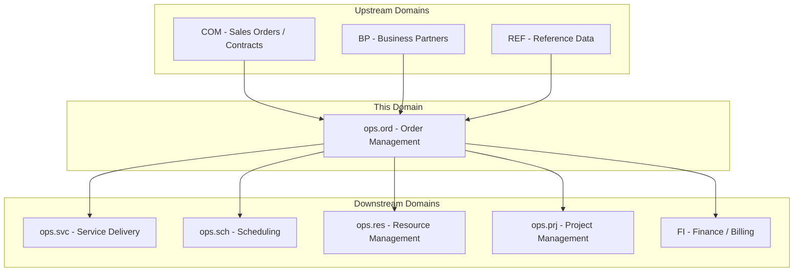
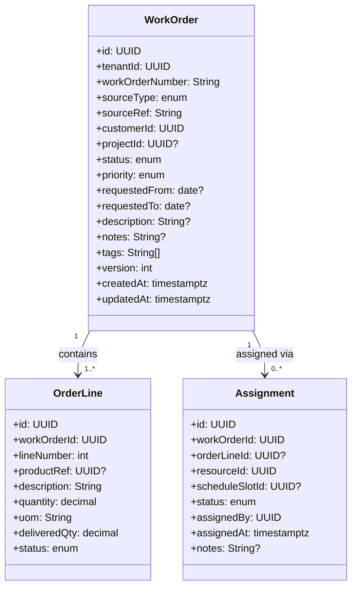
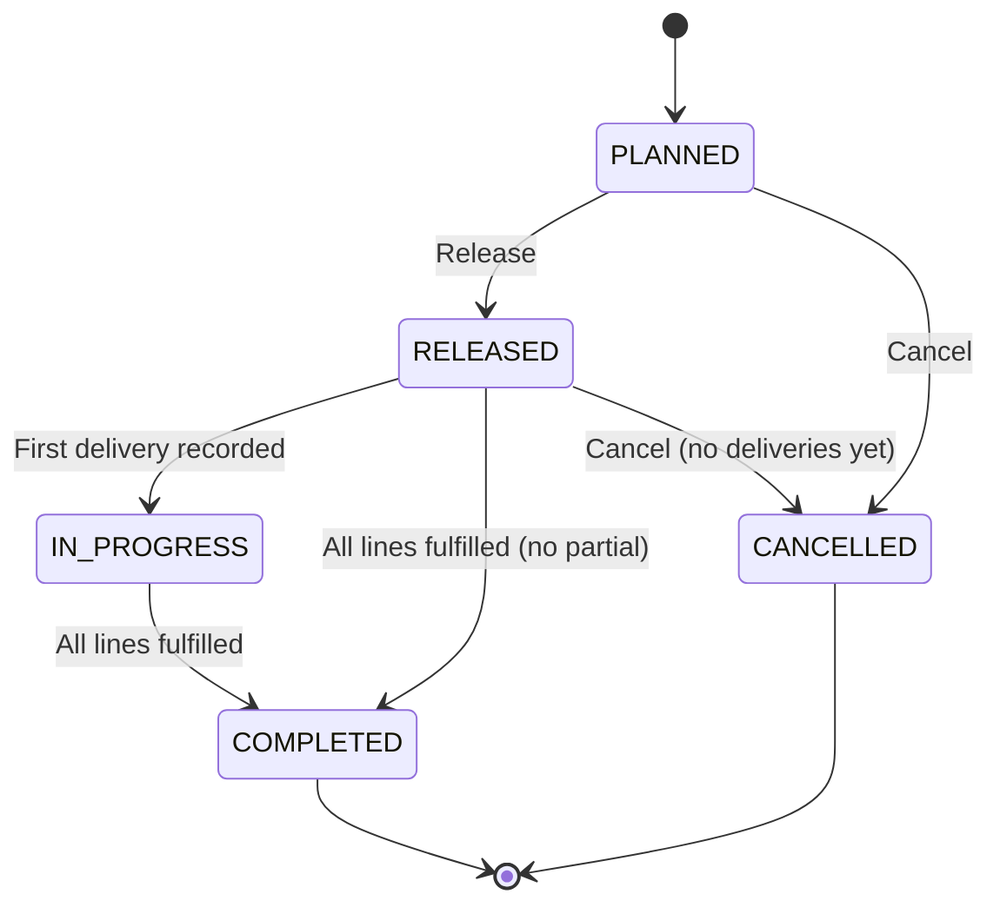
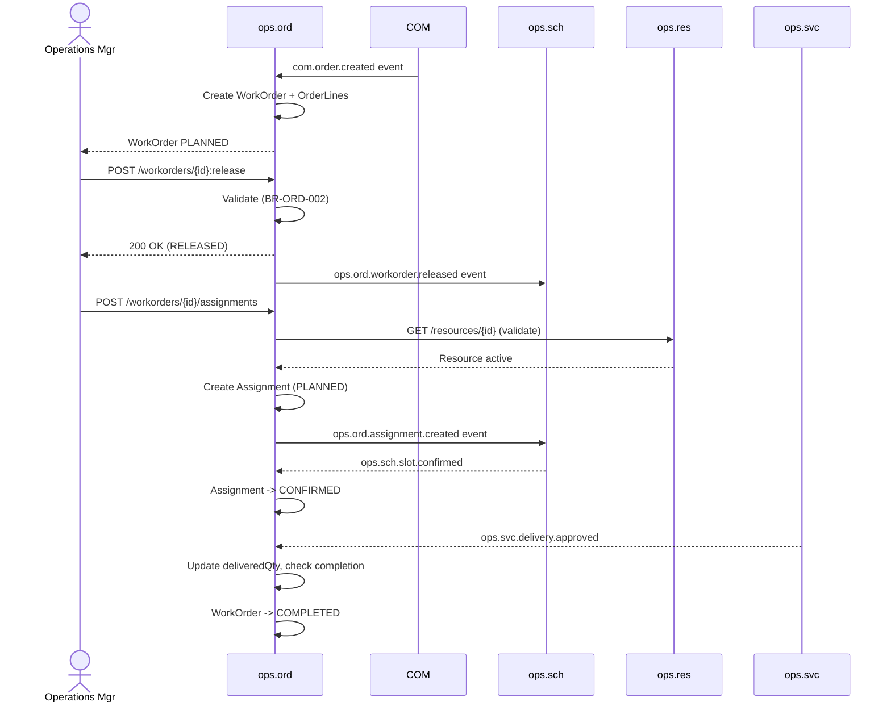
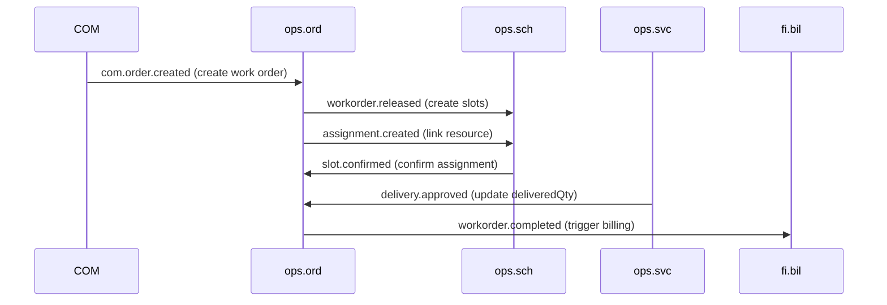
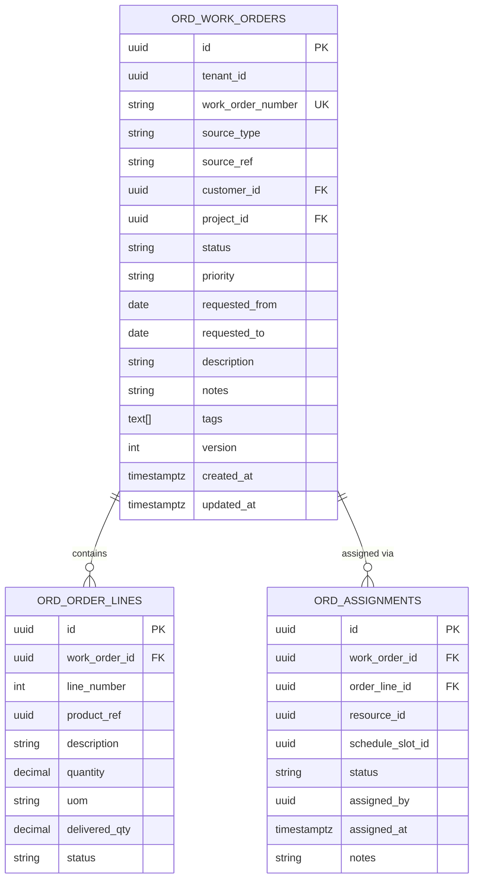

# OPS.ORD - Order Management Domain / Service Specification

> **Conceptual Stack Layer:** Domain / Service
> **Space:** Platform
> **Owner:** Domain Engineering Team
> **Schema alignment:** `service-layer.schema.json`
> **Companion files:** `openapi.yaml`, `*.schema.json` (event contracts)
> **Referenced by:** Platform-Feature Spec SS5 (backend dependencies), BFF Contract
> **Belongs to:** OPS Suite Spec (`_ops_suite.md`)

> **Meta Information**
> - **Version:** 2026-04-03
> - **Template:** `domain-service-spec.md` v1.0.0
> - **Template Compliance:** ~95%
> - **Author(s):** OpenLeap Architecture Team
> - **Status:** DRAFT
> - **Suite:** `ops`
> - **Domain:** `ord`
> - **Bounded Context Ref:** `bc:order-management`
> - **Service ID:** `ops-ord-svc`
> - **basePackage:** `io.openleap.ops.ord`
> - **API Base Path:** `/api/ops/ord/v1`
> - **OpenLeap Starter Version:** `v1`
> - **Port:** OPEN QUESTION
> - **Repository:** OPEN QUESTION
> - **Tags:** `ops`, `order-management`, `work-order`, `fulfillment`, `assignment`
> - **Team:**
>   - Name: `team-ops`
>   - Email: `ops-team@openleap.io`
>   - Slack: `#ops-team`

---

## Specification Guidelines Compliance

>
> ### Non-Negotiables
> - Never invent facts. If required info is missing, add an **OPEN QUESTION** entry.
> - Preserve intent and decisions. Only change meaning when explicitly requested.
> - Do not remove normative constraints unless they are explicitly replaced.
> - Keep the spec **self-contained**: no "see chat", no implicit context.
>
> ### Source of Truth Priority
> When sources conflict:
> 1. Spec (explicit) wins
> 2. Starter specs (implementation constraints) next
> 3. Guidelines (best practices) last
>
> ### Style Guide
> - Prefer short sentences and lists.
> - Use MUST/SHOULD/MAY for normative statements.
> - Keep terminology consistent (Aggregate, Domain Service, Application Service, Command, Event).
> - Avoid ambiguous words ("often", "maybe") unless explicitly noting uncertainty.

---

## 0. Document Purpose & Scope

### 0.1 Purpose
This specification defines the Order Management domain within the Operational Services (OPS) suite. `ops.ord` transforms sales orders and service contracts from the Commerce (COM) suite into executable operational work orders, assigns resources, and tracks fulfillment progress until completion. It is the primary entry point into the OPS suite.

### 0.2 Target Audience
- Product Owners & Business Stakeholders
- System Architects & Technical Leads
- Integration Engineers

### 0.3 Scope
**In Scope:**
- Work order lifecycle management (create, release, progress, complete, cancel)
- Order line tracking with quantities, UoM, and delivery progress
- Resource assignment and schedule slot linkage
- Fulfillment tracking against deliveries from `ops.svc`
- Event-driven integration with COM (upstream) and SVC/SCH/FI (downstream)

**Out of Scope:**
- Pricing and invoicing (FI Suite)
- Resource master data and capacity (ops.res)
- Scheduling engine (ops.sch)
- Sales order management (COM / SD Suite)
- Project structure (ops.prj)

### 0.4 Related Documents
- `_ops_suite.md` - OPS Suite overview
- `ops_svc-spec.md` - Service Delivery domain
- `ops_sch-spec.md` - Scheduling domain
- `ops_res-spec.md` - Resource Management domain
- `ops_prj-spec.md` - Project Management domain
- `BP_business_partner.md` - Business Partner
- `COM_Overview.md` - Commerce Suite
- `SYSTEM_OVERVIEW.md` - Platform architecture overview

---

## 1. Business Context

### 1.1 Domain Purpose
`ops.ord` bridges the gap between **what was sold** (COM) and **what must be executed** (OPS). It receives sales orders, contracts, and service agreements from commerce and transforms them into structured, assignable work orders that drive operational execution. It is the primary entry point into the OPS suite.

### 1.2 Business Value
- Single source of truth for operational execution commitments
- Full traceability from sales commitment to operational delivery
- Resource assignment tracking with schedule integration
- Real-time fulfillment progress monitoring
- Foundation for billable item generation downstream

### 1.3 Key Stakeholders

| Role | Responsibility | Primary Use Cases |
|------|----------------|-------------------|
| Operations Manager | Oversee work order queue and priorities | UC-ORD-001, UC-ORD-003 |
| Dispatcher | Assign resources to work orders | UC-ORD-002 |
| Service Provider | View assigned work orders | UC-ORD-007 |
| FI Billing Clerk | Consume completion signals | UC-ORD-005 |
| Sales Team (COM) | View operational status of sold orders | UC-ORD-007 |

### 1.4 Strategic Positioning



### 1.5 Service Context

| Field | Value |
|-------|-------|
| Suite | `ops` (Operational Services) |
| Domain | `ord` (Order Management) |
| Bounded Context | `bc:order-management` |
| Service ID | `ops-ord-svc` |
| Base Package | `io.openleap.ops.ord` |
| Authoritative Sources | OPS Suite Spec (`_ops_suite.md`), Order-to-Cash best practices (SAP SD / Oracle Order Management) |

---

## 2. Service Identity

| Field | Value |
|-------|-------|
| **Service ID** | `ops-ord-svc` |
| **Display Name** | Order Management Service |
| **Suite** | `ops` |
| **Domain** | `ord` |
| **Bounded Context Ref** | `bc:order-management` |
| **Version** | 2026-04-03 |
| **Status** | DRAFT |
| **API Base Path** | `/api/ops/ord/v1` |
| **Repository** | OPEN QUESTION |
| **Tags** | `ops`, `order-management`, `work-order`, `fulfillment`, `assignment` |
| **Team Name** | `team-ops` |
| **Team Email** | `ops-team@openleap.io` |
| **Team Slack** | `#ops-team` |

---

## 3. Domain Model

### 3.1 Conceptual Overview

The domain centers on the **WorkOrder** aggregate — an executable unit of operational work derived from a sales/service order. Each work order contains one or more **OrderLines** defining what must be delivered (service type, quantity, UoM). **Assignments** link work orders to specific resources and schedule slots, enabling dispatch and tracking.



### 3.2 Core Concepts

| Concept | Owner | Description | Glossary Ref |
|---------|-------|-------------|--------------|
| WorkOrder | ops-ord-svc | Operational execution commitment derived from a sales order, contract, or manual creation | Work Order |
| OrderLine | ops-ord-svc | Individual deliverable within a work order with planned quantity and UoM | Order Line |
| Assignment | ops-ord-svc | Link between a work order and a specific resource (person/equipment) with optional schedule slot | Assignment |

### 3.3 Aggregate Definitions

#### 3.3.1 Aggregate: WorkOrder

**Aggregate ID:** `agg:work-order`
**Business Purpose:** Represents an operational execution commitment, derived from a sales order, contract release, or manual creation. Defines what work must be performed for a customer within a given time window.

**Aggregate Root Attributes:**

| Attribute | Type | Format | Required | Description | Example | Constraints |
|-----------|------|--------|----------|-------------|---------|-------------|
| id | UUID | uuid | Yes | Unique identifier | `a1b2c3d4-...` | Immutable after create, `OlUuid.create()` |
| tenantId | UUID | uuid | Yes | Tenant ownership | `t1-uuid` | Immutable, RLS-enforced |
| workOrderNumber | String | `WO-YYYY-NNNNNN` | Yes | Business reference number | `WO-2026-001234` | Unique per tenant, auto-generated |
| sourceType | Enum | — | Yes | Origin of work order | `SALES_ORDER` | SALES_ORDER, CONTRACT, SERVICE_AGREEMENT, MANUAL |
| sourceRef | String | — | Cond. | External reference to source | `SO-2026-000457` | Required if sourceType != MANUAL |
| customerId | UUID | uuid | Yes | Customer party reference | `cust-uuid` | FK to bp.party, must be active (BR-ORD-001) |
| projectId | UUID | uuid | No | Project reference | `prj-uuid` | FK to ops.prj |
| status | Enum | — | Yes | Lifecycle state | `PLANNED` | PLANNED, RELEASED, IN_PROGRESS, COMPLETED, CANCELLED |
| priority | Enum | — | Yes | Execution priority | `MEDIUM` | LOW, MEDIUM, HIGH, CRITICAL |
| requestedFrom | Date | ISO 8601 | No | Earliest execution date | `2026-03-01` | — |
| requestedTo | Date | ISO 8601 | No | Latest execution date | `2026-03-15` | >= requestedFrom if both set |
| description | String | — | No | Work order description | `"IT consulting engagement"` | Max 4000 chars |
| notes | String | — | No | Internal notes | `"Priority customer"` | Max 4000 chars |
| tags | String[] | — | No | Classification tags | `["consulting","audit"]` | — |
| version | Integer | — | Yes | Optimistic locking version | `1` | Auto-incremented |
| createdAt | Timestamptz | ISO 8601 | Yes | Creation timestamp | `2026-03-01T10:00:00Z` | System-managed |
| updatedAt | Timestamptz | ISO 8601 | Yes | Last update timestamp | `2026-03-01T10:00:00Z` | System-managed |

**Lifecycle States:**



**State Transitions:**

| From | To | Trigger | Guard / Precondition | Side Effects |
|------|----|---------|---------------------|--------------|
| — | PLANNED | Create | Valid customerId (BR-ORD-001), at least one line (inline creation) or added later | — |
| PLANNED | RELEASED | Release | At least one OrderLine exists (BR-ORD-002) | Emits `workorder.released` |
| RELEASED | IN_PROGRESS | `ops.svc.delivery.approved` | Delivery linked to this work order | Emits `workorder.progressed` |
| IN_PROGRESS | COMPLETED | All lines fulfilled | `deliveredQty >= quantity` for all non-cancelled lines (BR-ORD-003) | Emits `workorder.completed` |
| RELEASED | COMPLETED | All lines fulfilled (direct) | Same as above, no partial deliveries | Emits `workorder.completed` |
| PLANNED | CANCELLED | Cancel | No approved deliveries exist (BR-ORD-005) | Emits `workorder.cancelled`, cancels child lines and assignments |
| RELEASED | CANCELLED | Cancel | No approved deliveries exist (BR-ORD-005) | Emits `workorder.cancelled`, cancels child lines and assignments |

**Invariants:**
- INV-WO-001: `customerId` MUST reference an active party in BP (BR-ORD-001)
- INV-WO-002: A WorkOrder MUST have at least one OrderLine before transitioning to RELEASED (BR-ORD-002)
- INV-WO-003: COMPLETED and CANCELLED work orders are immutable — no field changes allowed (BR-ORD-004)
- INV-WO-004: Cannot cancel a work order with approved deliveries (BR-ORD-005)
- INV-WO-005: `workOrderNumber` MUST be unique per tenant (BR-ORD-006)
- INV-WO-006: `requestedTo >= requestedFrom` when both are set

**Domain Events Emitted:**

| Event | Routing Key | When | Key Payload |
|-------|-------------|------|-------------|
| WorkOrderCreated | `ops.ord.workorder.created` | New work order created | workOrderId, customerId, sourceRef, lines[] |
| WorkOrderReleased | `ops.ord.workorder.released` | PLANNED -> RELEASED | workOrderId, customerId, priority |
| WorkOrderProgressed | `ops.ord.workorder.progressed` | RELEASED -> IN_PROGRESS | workOrderId, deliveryId |
| WorkOrderCompleted | `ops.ord.workorder.completed` | All lines fulfilled | workOrderId, customerId |
| WorkOrderCancelled | `ops.ord.workorder.cancelled` | Cancellation | workOrderId, reason |

#### 3.3.2 Entity: OrderLine (child of WorkOrder)

**Business Purpose:** Individual deliverable within a work order. Tracks planned quantity vs. delivered quantity for fulfillment monitoring.

| Attribute | Type | Format | Required | Description | Example | Constraints |
|-----------|------|--------|----------|-------------|---------|-------------|
| id | UUID | uuid | Yes | Unique identifier | `line-uuid` | Immutable, `OlUuid.create()` |
| workOrderId | UUID | uuid | Yes | Parent work order | `wo-uuid` | FK to WorkOrder |
| lineNumber | Integer | — | Yes | Line sequence number | `10` | Unique within work order (BR-ORD-007), auto-generated (10, 20, 30...) |
| productRef | UUID | uuid | No | Product/service reference | `prod-uuid` | FK to COM product catalog |
| description | String | — | Yes | Line description | `"Senior Consultant - Audit"` | Max 2000 chars |
| quantity | Decimal | (18,4) | Yes | Planned quantity | `40.0000` | > 0 (BR-ORD-008) |
| uom | String | UCUM | Yes | Unit of measure | `HUR` (hours) | Valid UCUM code (BR-ORD-009) |
| deliveredQty | Decimal | (18,4) | Yes | Cumulative delivered quantity | `15.0000` | >= 0, <= quantity (BR-ORD-003) |
| status | Enum | — | Yes | Line lifecycle state | `OPEN` | OPEN, PARTIAL, FULFILLED, CANCELLED |

**Lifecycle States:**

| From | To | Trigger | Guard |
|------|----|---------|-------|
| — | OPEN | Line created | — |
| OPEN | PARTIAL | deliveredQty > 0 and < quantity | Delivery approved event |
| PARTIAL | FULFILLED | deliveredQty >= quantity | Delivery approved event |
| OPEN | FULFILLED | deliveredQty >= quantity (single delivery) | Delivery approved event |
| OPEN/PARTIAL | CANCELLED | Work order cancelled or line removed | No approved deliveries on this line |

**Domain Events Emitted:**

| Event | Routing Key | When | Key Payload |
|-------|-------------|------|-------------|
| OrderLineFulfilled | `ops.ord.orderline.fulfilled` | deliveredQty >= quantity | workOrderId, lineId, productRef |

#### 3.3.3 Entity: Assignment (child of WorkOrder)

**Business Purpose:** Link between a work order and a specific resource (person or equipment), optionally tied to a schedule slot for dispatch.

| Attribute | Type | Format | Required | Description | Example | Constraints |
|-----------|------|--------|----------|-------------|---------|-------------|
| id | UUID | uuid | Yes | Unique identifier | `asgn-uuid` | Immutable, `OlUuid.create()` |
| workOrderId | UUID | uuid | Yes | Parent work order | `wo-uuid` | FK to WorkOrder |
| orderLineId | UUID | uuid | No | Specific order line | `line-uuid` | FK to OrderLine |
| resourceId | UUID | uuid | Yes | Assigned resource | `res-uuid` | FK to ops.res, must be active (BR-ORD-010) |
| scheduleSlotId | UUID | uuid | No | Schedule slot reference | `slot-uuid` | FK to ops.sch |
| status | Enum | — | Yes | Assignment state | `PLANNED` | PLANNED, CONFIRMED, DONE, CANCELLED |
| assignedBy | UUID | uuid | Yes | Principal who created assignment | `user-uuid` | FK to iam.principal |
| assignedAt | Timestamptz | ISO 8601 | Yes | Assignment creation time | `2026-03-01T10:00:00Z` | System-managed |
| notes | String | — | No | Assignment notes | `"Preferred for this customer"` | Max 2000 chars |

**Lifecycle States:**

| From | To | Trigger | Guard |
|------|----|---------|-------|
| — | PLANNED | Assignment created | Resource active (BR-ORD-010) |
| PLANNED | CONFIRMED | `ops.sch.slot.confirmed` | Schedule slot confirmed |
| CONFIRMED | DONE | Work completed | — |
| PLANNED/CONFIRMED | CANCELLED | Manual or cascade from work order cancellation | — |

**Domain Events Emitted:**

| Event | Routing Key | When | Key Payload |
|-------|-------------|------|-------------|
| AssignmentCreated | `ops.ord.assignment.created` | Resource assigned | workOrderId, resourceId, assignmentId |
| AssignmentConfirmed | `ops.ord.assignment.confirmed` | Slot confirmed | workOrderId, resourceId, slotId |
| AssignmentCancelled | `ops.ord.assignment.cancelled` | Assignment cancelled | workOrderId, resourceId |

### 3.4 Enumerations

| Enum | Values | Description |
|------|--------|-------------|
| SourceType | SALES_ORDER, CONTRACT, SERVICE_AGREEMENT, MANUAL | Origin of work order |
| WorkOrderStatus | PLANNED, RELEASED, IN_PROGRESS, COMPLETED, CANCELLED | Work order lifecycle |
| OrderLinePriority | LOW, MEDIUM, HIGH, CRITICAL | Execution priority |
| OrderLineStatus | OPEN, PARTIAL, FULFILLED, CANCELLED | Order line fulfillment state |
| AssignmentStatus | PLANNED, CONFIRMED, DONE, CANCELLED | Assignment lifecycle |

---

## 4. Business Rules & Constraints

### 4.1 Business Rules Catalog

| ID | Rule Name | Description | Scope | Enforcement | Error Code |
|----|-----------|-------------|-------|-------------|------------|
| BR-ORD-001 | Customer Required | customerId mandatory and must reference active BP party | WorkOrder | Create | `ORD-VAL-001` |
| BR-ORD-002 | At Least One Line | Min 1 OrderLine required to release | WorkOrder | Release | `ORD-BIZ-002` |
| BR-ORD-003 | Delivery Qty Constraint | deliveredQty must not exceed quantity on order line | OrderLine | Event update | `ORD-BIZ-003` |
| BR-ORD-004 | Immutable After Close | No changes to COMPLETED/CANCELLED work orders | WorkOrder | Update | `ORD-BIZ-004` |
| BR-ORD-005 | Cancellation Guard | Cannot cancel work order with approved deliveries | WorkOrder | Cancel | `ORD-BIZ-005` |
| BR-ORD-006 | WO Number Unique | workOrderNumber unique per tenant | WorkOrder | Create | `ORD-VAL-006` |
| BR-ORD-007 | Line Number Unique | lineNumber unique within work order | OrderLine | Create | `ORD-VAL-007` |
| BR-ORD-008 | Positive Quantity | OrderLine.quantity > 0 | OrderLine | Create/Update | `ORD-VAL-008` |
| BR-ORD-009 | Valid UoM | uom must be valid UCUM code via si-unit-svc | OrderLine | Create/Update | `ORD-VAL-009` |
| BR-ORD-010 | Assignment Resource Valid | resourceId must reference active resource in ops.res | Assignment | Create | `ORD-VAL-010` |

### 4.2 Detailed Rule Definitions

#### BR-ORD-004: Immutable After Close
**Context:** Completed work orders feed billing and audit. Cancelled work orders represent a business decision that must be traceable.
**Rule Statement:** Once a WorkOrder reaches COMPLETED or CANCELLED status, no attribute may be changed.
**Applies To:** WorkOrder aggregate
**Enforcement:** Domain service rejects any update command targeting a COMPLETED or CANCELLED work order.
**Validation Logic:** `if (workOrder.status IN [COMPLETED, CANCELLED]) throw ImmutableWorkOrderException`
**Error Handling:**
- Code: `ORD-BIZ-004`
- Message: `"Work order {id} is {status} and cannot be modified."`
- HTTP: 409 Conflict

#### BR-ORD-005: Cancellation Guard
**Context:** Delivered work must be billed. Cancelling a work order with approved deliveries would create orphaned financial records.
**Rule Statement:** A work order MUST NOT be cancelled if any delivery has been approved against it in ops.svc.
**Applies To:** WorkOrder aggregate, Cancel transition
**Enforcement:** Application Service checks for approved deliveries before cancellation.
**Validation Logic:** `if (hasApprovedDeliveries(workOrder.id)) throw CancellationDeniedException`
**Error Handling:**
- Code: `ORD-BIZ-005`
- Message: `"Work order {id} has approved deliveries and cannot be cancelled. Use partial completion instead."`
- HTTP: 409 Conflict

#### BR-ORD-003: Delivery Quantity Constraint
**Context:** Prevent over-delivery against a commitment to maintain accuracy of fulfillment tracking and downstream billing.
**Rule Statement:** `OrderLine.deliveredQty` MUST NOT exceed `OrderLine.quantity`.
**Applies To:** OrderLine entity
**Enforcement:** Event handler validates cumulative delivery does not exceed planned quantity.
**Validation Logic:** `if (orderLine.deliveredQty + delivery.quantity > orderLine.quantity) throw OverDeliveryException` (configurable tolerance per Q-ORD-003)
**Error Handling:**
- Code: `ORD-BIZ-003`
- Message: `"Delivery would exceed planned quantity on order line {lineId}. Planned: {quantity}, already delivered: {deliveredQty}, attempted: {deliveryQty}."`
- HTTP: 422 Unprocessable Entity (on sync validation) or DLQ + alert (on async event)

### 4.3 Data Validation Rules

| Field | Validation Rule | Error Code | Error Message |
|-------|----------------|------------|---------------|
| customerId | Required, valid UUID, active in BP | `ORD-VAL-001` | `"Valid active customer ID is required"` |
| sourceType | Required, valid enum value | `ORD-VAL-011` | `"Valid source type required (SALES_ORDER, CONTRACT, SERVICE_AGREEMENT, MANUAL)"` |
| sourceRef | Required if sourceType != MANUAL | `ORD-VAL-012` | `"Source reference required for non-manual work orders"` |
| priority | Required, valid enum value | `ORD-VAL-013` | `"Valid priority required (LOW, MEDIUM, HIGH, CRITICAL)"` |
| requestedTo | >= requestedFrom if both present | `ORD-VAL-014` | `"Requested end date must be on or after requested start date"` |
| quantity (line) | Required, > 0 | `ORD-VAL-008` | `"Order line quantity must be greater than zero"` |
| uom (line) | Required, valid UCUM code | `ORD-VAL-009` | `"Valid UCUM unit of measure code required"` |
| description (line) | Required, max 2000 chars | `ORD-VAL-015` | `"Order line description is required"` |
| resourceId (assignment) | Required, valid UUID, active in ops.res | `ORD-VAL-010` | `"Valid active resource ID is required"` |

### 4.4 Reference Data Dependencies

| Catalog | Usage | Provider Service | Validation |
|---------|-------|-----------------|------------|
| Units of Measure (UCUM) | `uom` field on OrderLine | si-unit-svc (T1) | Code existence check |
| Countries (ISO 3166) | Address fields in context | ref-data-svc (T1) | Code existence check |
| Currencies (ISO 4217) | Pricing context | ref-data-svc (T1) | Code existence check |
| Business Partners | `customerId` | bp-party-svc (T2) | Active status check |
| Resources | `resourceId` on Assignment | ops-res-svc (T3) | Active status check |

---

## 5. Use Cases

### 5.1 Business Logic Placement

| Layer | Responsibilities |
|-------|-----------------|
| Application Service | Command validation, aggregate loading, event publishing, orchestration (creation from COM events) |
| Domain Service | Order line cap validation (cross-aggregate with ops.svc), resource availability check (cross-service) |
| Aggregate | State transitions, invariant enforcement, attribute validation |

### 5.2 Use Cases

#### UC-ORD-001: Create Work Order from Sales Order

| Field | Value |
|-------|-------|
| **ID** | UC-ORD-001 |
| **Type** | WRITE |
| **Trigger** | Event (`com.order.created`) or REST (manual) |
| **Aggregate** | WorkOrder |
| **Domain Operation** | `WorkOrder.create(sourceType, sourceRef, customerId, lines[])` |
| **Inputs** | sourceType, sourceRef, customerId, projectId?, priority, requestedFrom?, requestedTo?, description?, lines[] (productRef?, description, quantity, uom) |
| **Outputs** | Created WorkOrder in PLANNED state with OrderLines |
| **Events** | `WorkOrderCreated` -> `ops.ord.workorder.created` |
| **REST** | `POST /api/ops/ord/v1/workorders` -> 201 Created |
| **Idempotency** | Client-generated `Idempotency-Key` header; deduplication on sourceRef per tenant |
| **Errors** | 400 (validation), 422 (BR-ORD-001 invalid customer, BR-ORD-008 invalid quantity, BR-ORD-009 invalid UoM) |

#### UC-ORD-002: Assign Resource to Work Order

| Field | Value |
|-------|-------|
| **ID** | UC-ORD-002 |
| **Type** | WRITE |
| **Trigger** | REST |
| **Aggregate** | WorkOrder (Assignment child) |
| **Domain Operation** | `WorkOrder.assignResource(resourceId, orderLineId?, scheduleSlotId?)` |
| **Inputs** | workOrderId, resourceId, orderLineId?, scheduleSlotId?, notes? |
| **Outputs** | Created Assignment in PLANNED state |
| **Events** | `AssignmentCreated` -> `ops.ord.assignment.created` |
| **REST** | `POST /api/ops/ord/v1/workorders/{id}/assignments` -> 201 Created |
| **Idempotency** | Idempotency-Key header |
| **Errors** | 404 (work order not found), 409 (BR-ORD-004 immutable), 422 (BR-ORD-010 invalid resource) |

#### UC-ORD-003: Release Work Order

| Field | Value |
|-------|-------|
| **ID** | UC-ORD-003 |
| **Type** | WRITE |
| **Trigger** | REST |
| **Aggregate** | WorkOrder |
| **Domain Operation** | `WorkOrder.release()` |
| **Inputs** | workOrderId |
| **Outputs** | WorkOrder in RELEASED state |
| **Events** | `WorkOrderReleased` -> `ops.ord.workorder.released` |
| **REST** | `POST /api/ops/ord/v1/workorders/{id}:release` -> 200 OK |
| **Idempotency** | Idempotent (re-release of RELEASED is no-op) |
| **Errors** | 404 (not found), 409 (not in PLANNED state), 422 (BR-ORD-002 no order lines) |

#### UC-ORD-004: Track Fulfillment Progress

| Field | Value |
|-------|-------|
| **ID** | UC-ORD-004 |
| **Type** | WRITE |
| **Trigger** | Event (`ops.svc.delivery.approved`) |
| **Aggregate** | WorkOrder (OrderLine child) |
| **Domain Operation** | `WorkOrder.recordDelivery(orderLineId, deliveredQuantity)` |
| **Inputs** | workOrderId, orderLineId, deliveredQuantity |
| **Outputs** | Updated OrderLine (deliveredQty incremented, status updated); WorkOrder may transition to IN_PROGRESS or COMPLETED |
| **Events** | `OrderLineFulfilled` (if line completed), `WorkOrderProgressed` (first delivery), `WorkOrderCompleted` (all lines fulfilled) |
| **REST** | N/A (event-driven only) |
| **Idempotency** | Deduplicated by deliveryId (tracked in processed events) |
| **Errors** | 422 (BR-ORD-003 over-delivery) -> DLQ + alert |

#### UC-ORD-005: Cancel Work Order

| Field | Value |
|-------|-------|
| **ID** | UC-ORD-005 |
| **Type** | WRITE |
| **Trigger** | REST |
| **Aggregate** | WorkOrder |
| **Domain Operation** | `WorkOrder.cancel(reason)` |
| **Inputs** | workOrderId, reason |
| **Outputs** | WorkOrder in CANCELLED state; all OPEN/PARTIAL lines -> CANCELLED; all PLANNED/CONFIRMED assignments -> CANCELLED |
| **Events** | `WorkOrderCancelled` -> `ops.ord.workorder.cancelled` |
| **REST** | `POST /api/ops/ord/v1/workorders/{id}:cancel` -> 200 OK |
| **Idempotency** | Idempotent (re-cancel of CANCELLED is no-op) |
| **Errors** | 404 (not found), 409 (BR-ORD-005 approved deliveries exist, BR-ORD-004 already completed) |

#### UC-ORD-006: Update Work Order

| Field | Value |
|-------|-------|
| **ID** | UC-ORD-006 |
| **Type** | WRITE |
| **Trigger** | REST |
| **Aggregate** | WorkOrder |
| **Domain Operation** | `WorkOrder.update(fields)` |
| **Inputs** | workOrderId, priority?, requestedFrom?, requestedTo?, description?, notes?, tags? |
| **Outputs** | Updated WorkOrder |
| **Events** | — |
| **REST** | `PATCH /api/ops/ord/v1/workorders/{id}` -> 200 OK |
| **Idempotency** | ETag / If-Match header for optimistic locking |
| **Errors** | 404, 409 (BR-ORD-004 immutable), 412 (version mismatch) |

#### UC-ORD-007: List / Search Work Orders (READ)

| Field | Value |
|-------|-------|
| **ID** | UC-ORD-007 |
| **Type** | READ |
| **Trigger** | REST |
| **Aggregate** | WorkOrder |
| **Domain Operation** | Query projection |
| **Inputs** | customerId?, status?, priority?, projectId?, from?, to?, page, size, sort |
| **Outputs** | Paginated work order list with lines and assignments |
| **Events** | — |
| **REST** | `GET /api/ops/ord/v1/workorders?...` -> 200 OK |
| **Idempotency** | Inherently idempotent (GET) |
| **Errors** | 400 (invalid filter params) |

#### UC-ORD-008: Add Order Line

| Field | Value |
|-------|-------|
| **ID** | UC-ORD-008 |
| **Type** | WRITE |
| **Trigger** | REST |
| **Aggregate** | WorkOrder (OrderLine child) |
| **Domain Operation** | `WorkOrder.addLine(productRef?, description, quantity, uom)` |
| **Inputs** | workOrderId, productRef?, description, quantity, uom |
| **Outputs** | Created OrderLine in OPEN state |
| **Events** | — |
| **REST** | `POST /api/ops/ord/v1/workorders/{id}/lines` -> 201 Created |
| **Idempotency** | Idempotency-Key header |
| **Errors** | 404, 409 (BR-ORD-004 immutable), 422 (BR-ORD-008 invalid quantity, BR-ORD-009 invalid UoM) |

#### UC-ORD-009: Complete Work Order (Manual)

| Field | Value |
|-------|-------|
| **ID** | UC-ORD-009 |
| **Type** | WRITE |
| **Trigger** | REST |
| **Aggregate** | WorkOrder |
| **Domain Operation** | `WorkOrder.complete()` |
| **Inputs** | workOrderId |
| **Outputs** | WorkOrder in COMPLETED state |
| **Events** | `WorkOrderCompleted` -> `ops.ord.workorder.completed` |
| **REST** | `POST /api/ops/ord/v1/workorders/{id}:complete` -> 200 OK |
| **Idempotency** | Idempotent (re-complete of COMPLETED is no-op) |
| **Errors** | 404, 409 (not in RELEASED/IN_PROGRESS state), 422 (not all lines FULFILLED) |

### 5.3 Process Flow Diagrams



### 5.4 Cross-Domain Workflows

**Does this domain participate in multi-service workflows?** Yes

#### Workflow: COM -> OPS -> FI (Order-to-Cash for Services)

**Orchestration Pattern:** Choreography (EDA)

**Pattern Rationale:**
Operational processes are naturally asynchronous (order today, deliver over days/weeks, bill at period end). Each domain reacts independently to events. No central orchestrator needed.

**Participating Services:**

| Service | Role | Responsibilities |
|---------|------|------------------|
| COM | Initiator | Publishes order.created |
| ops.ord | Reactor | Creates work order, tracks fulfillment |
| ops.sch | Reactor | Creates schedule slots |
| ops.svc | Reactor | Records deliveries |
| fi.bil | Consumer | Receives billable items from SVC |

---

## 6. REST API

### 6.1 API Overview

| Field | Value |
|-------|-------|
| Base Path | `/api/ops/ord/v1` |
| Authentication | OAuth2/JWT (Bearer token) |
| Authorization | Scopes: `ops.ord:read`, `ops.ord:write`, `ops.ord:admin` |
| Content Type | `application/json` |
| Versioning | URL path (`v1`) |

### 6.2 Resource Operations

#### Work Order Resource

| Endpoint | Method | Path | Summary | Role Required | Events Published |
|----------|--------|------|---------|---------------|-----------------|
| Create Work Order | POST | `/workorders` | Create work order with lines | `ops.ord:write` | `WorkOrderCreated` |
| Get Work Order | GET | `/workorders/{id}` | Retrieve with lines and assignments | `ops.ord:read` | — |
| List Work Orders | GET | `/workorders` | Search/filter work orders | `ops.ord:read` | — |
| Update Work Order | PATCH | `/workorders/{id}` | Update mutable fields (PLANNED/RELEASED only) | `ops.ord:write` | — |

**Create Work Order — Request:**
```json
{
  "sourceType": "SALES_ORDER",
  "sourceRef": "SO-2026-000457",
  "customerId": "b6f7c1c3-1c42-4b9a-9f21-a2e39f6a5b33",
  "projectId": null,
  "priority": "MEDIUM",
  "requestedFrom": "2026-03-01",
  "requestedTo": "2026-03-15",
  "description": "IT consulting engagement - system audit",
  "lines": [
    {
      "productRef": "a1b2c3d4-e5f6-7890-abcd-ef1234567890",
      "description": "Senior Consultant - System Audit",
      "quantity": 40,
      "uom": "HUR"
    },
    {
      "productRef": "f9e8d7c6-b5a4-3210-fedc-ba9876543210",
      "description": "Travel Expenses - Lump Sum",
      "quantity": 1,
      "uom": "EA"
    }
  ]
}
```

**Create Work Order — Response (201 Created):**
```json
{
  "id": "e1a2b3c4-d5e6-7890-1234-567890abcdef",
  "workOrderNumber": "WO-2026-001234",
  "sourceType": "SALES_ORDER",
  "sourceRef": "SO-2026-000457",
  "customerId": "b6f7c1c3-1c42-4b9a-9f21-a2e39f6a5b33",
  "status": "PLANNED",
  "priority": "MEDIUM",
  "lines": [
    { "id": "...", "lineNumber": 10, "description": "Senior Consultant - System Audit", "quantity": 40, "uom": "HUR", "deliveredQty": 0, "status": "OPEN" },
    { "id": "...", "lineNumber": 20, "description": "Travel Expenses - Lump Sum", "quantity": 1, "uom": "EA", "deliveredQty": 0, "status": "OPEN" }
  ],
  "assignments": [],
  "version": 1,
  "createdAt": "2026-02-23T10:00:00Z",
  "_links": {
    "self": { "href": "/api/ops/ord/v1/workorders/e1a2b3c4-..." }
  }
}
```

**Update Work Order — Headers:** `If-Match: "{version}"` (optimistic locking, 412 on conflict)

#### Order Line Resource

| Endpoint | Method | Path | Summary | Role Required | Events Published |
|----------|--------|------|---------|---------------|-----------------|
| Add Order Line | POST | `/workorders/{id}/lines` | Add line to work order | `ops.ord:write` | — |
| Update Order Line | PATCH | `/workorders/{id}/lines/{lineId}` | Update line (before release only) | `ops.ord:write` | — |
| Remove Order Line | DELETE | `/workorders/{id}/lines/{lineId}` | Remove line (before release only) | `ops.ord:write` | — |

#### Assignment Resource

| Endpoint | Method | Path | Summary | Role Required | Events Published |
|----------|--------|------|---------|---------------|-----------------|
| Create Assignment | POST | `/workorders/{id}/assignments` | Assign resource | `ops.ord:write` | `AssignmentCreated` |
| Update Assignment | PATCH | `/assignments/{id}` | Update status | `ops.ord:write` | — |
| List Assignments | GET | `/assignments` | Search assignments by filters | `ops.ord:read` | — |

### 6.3 Business Operations

| Endpoint | Method | Path | Summary | Role Required | Events Published |
|----------|--------|------|---------|---------------|-----------------|
| Release | POST | `/workorders/{id}:release` | PLANNED -> RELEASED | `ops.ord:write` | `WorkOrderReleased` |
| Complete | POST | `/workorders/{id}:complete` | Manual completion (all lines must be FULFILLED) | `ops.ord:admin` | `WorkOrderCompleted` |
| Cancel | POST | `/workorders/{id}:cancel` | Cancel work order (validates BR-ORD-005) | `ops.ord:admin` | `WorkOrderCancelled` |

**Cancel — Request Body:**
```json
{ "reason": "Customer cancelled contract before execution" }
```

### 6.4 Error Responses

| HTTP Status | Error Code | Description |
|-------------|------------|-------------|
| 400 | `ORD-VAL-*` | Validation error (field-level) |
| 401 | — | Authentication required |
| 403 | — | Forbidden (insufficient role) |
| 404 | — | Resource not found |
| 409 | `ORD-BIZ-004`, `ORD-BIZ-005` | Conflict (invalid state transition, immutable work order) |
| 412 | — | Precondition failed (optimistic lock version mismatch) |
| 422 | `ORD-BIZ-*` | Business rule violation |

### 6.5 OpenAPI Specification
**Location:** `contracts/http/ops/ord/openapi.yaml`
**OpenAPI Version:** 3.1.0

---

## 7. Events & Integration

### 7.1 Event-Driven Architecture Pattern
**Pattern Decision:** Choreography (EDA)
**Rationale:** OPS workflows are naturally asynchronous (order today, deliver over days/weeks, bill at period end). Each domain reacts independently to events. Eventual consistency is acceptable. No distributed transaction coordination needed. At-least-once delivery with idempotent consumers.

### 7.2 Published Events

**Exchange:** `ops.ord.events` (topic)

#### WorkOrderCreated
- **Routing Key:** `ops.ord.workorder.created`
- **Business Meaning:** A new work order has been created from a sales order, contract, or manual entry
- **When Published:** Work order created (UC-ORD-001)
- **Payload Schema:**
```json
{
  "workOrderId": "uuid",
  "tenantId": "uuid",
  "workOrderNumber": "WO-2026-001234",
  "sourceType": "SALES_ORDER",
  "sourceRef": "SO-2026-000457",
  "customerId": "uuid",
  "projectId": "uuid | null",
  "priority": "MEDIUM",
  "lines": [
    {
      "lineId": "uuid",
      "lineNumber": 10,
      "productRef": "uuid | null",
      "description": "string",
      "quantity": 40.0,
      "uom": "HUR"
    }
  ]
}
```
- **Consumers:** ops.prj (project linking), ops.sch (planning)

#### WorkOrderReleased
- **Routing Key:** `ops.ord.workorder.released`
- **Business Meaning:** A work order is released for operational execution
- **When Published:** PLANNED -> RELEASED transition (UC-ORD-003)
- **Payload Schema:**
```json
{
  "workOrderId": "uuid",
  "tenantId": "uuid",
  "workOrderNumber": "WO-2026-001234",
  "customerId": "uuid",
  "priority": "MEDIUM",
  "requestedFrom": "2026-03-01",
  "requestedTo": "2026-03-15"
}
```
- **Consumers:** ops.sch (create schedule slots), ops.tsk (create tasks), ops.svc (enable delivery recording)

#### WorkOrderCompleted
- **Routing Key:** `ops.ord.workorder.completed`
- **Business Meaning:** All order lines have been fulfilled — work is done
- **When Published:** All lines FULFILLED (UC-ORD-004, UC-ORD-009)
- **Payload Schema:**
```json
{
  "workOrderId": "uuid",
  "tenantId": "uuid",
  "workOrderNumber": "WO-2026-001234",
  "customerId": "uuid"
}
```
- **Consumers:** fi.bil (trigger billing readiness), ops.prj (project progress)

#### WorkOrderCancelled
- **Routing Key:** `ops.ord.workorder.cancelled`
- **Business Meaning:** Work order has been cancelled — no further execution expected
- **When Published:** Cancellation (UC-ORD-005)
- **Payload Schema:**
```json
{
  "workOrderId": "uuid",
  "tenantId": "uuid",
  "reason": "string"
}
```
- **Consumers:** ops.sch (release schedule slots), ops.res (release resource reservations)

#### OrderLineFulfilled
- **Routing Key:** `ops.ord.orderline.fulfilled`
- **Business Meaning:** An order line has been fully delivered
- **When Published:** OrderLine deliveredQty >= quantity
- **Payload Schema:** `{ "workOrderId": "uuid", "tenantId": "uuid", "lineId": "uuid", "productRef": "uuid | null" }`
- **Consumers:** Analytics, progress dashboards

#### AssignmentCreated
- **Routing Key:** `ops.ord.assignment.created`
- **Business Meaning:** A resource has been assigned to a work order
- **When Published:** Assignment created (UC-ORD-002)
- **Payload Schema:** `{ "workOrderId": "uuid", "tenantId": "uuid", "assignmentId": "uuid", "resourceId": "uuid", "scheduleSlotId": "uuid | null" }`
- **Consumers:** ops.sch (schedule slot creation/linking)

#### AssignmentConfirmed
- **Routing Key:** `ops.ord.assignment.confirmed`
- **Business Meaning:** A schedule slot has been confirmed for the assignment
- **When Published:** `ops.sch.slot.confirmed` received
- **Payload Schema:** `{ "workOrderId": "uuid", "tenantId": "uuid", "assignmentId": "uuid", "resourceId": "uuid", "slotId": "uuid" }`
- **Consumers:** Notification service

#### AssignmentCancelled
- **Routing Key:** `ops.ord.assignment.cancelled`
- **Business Meaning:** A resource assignment has been cancelled
- **When Published:** Manual or cascade cancellation
- **Payload Schema:** `{ "workOrderId": "uuid", "tenantId": "uuid", "assignmentId": "uuid", "resourceId": "uuid" }`
- **Consumers:** ops.sch (release slot), ops.res (release resource)

### 7.3 Consumed Events

| Source Event | Source Service | Handler | Purpose | Queue |
|-------------|---------------|---------|---------|-------|
| `com.order.created` | COM | SalesOrderHandler | Auto-create work order from sales order | `ops.ord.in.com.order` |
| `com.order.updated` | COM | SalesOrderUpdateHandler | Sync changes to source order | `ops.ord.in.com.order` |
| `ops.sch.slot.confirmed` | ops.sch | SlotConfirmedHandler | Confirm assignment | `ops.ord.in.sch.slot` |
| `ops.svc.delivery.approved` | ops.svc | DeliveryApprovedHandler | Progress order lines (deliveredQty) | `ops.ord.in.svc.delivery` |
| `ops.res.resource.inactivated` | ops.res | ResourceInactivatedHandler | Flag affected assignments | `ops.ord.in.res.resource` |

### 7.4 Event Flow Diagrams



### 7.5 Integration Points Summary

**Upstream Dependencies:**

| Service | Tier | Purpose | Type | Criticality | Fallback |
|---------|------|---------|------|-------------|----------|
| bp-party-svc | T2 | Customer validation | REST + Cache | High | Use cached data |
| ref-data-svc | T1 | UoM validation | REST + Cache | Low | Use cached data |
| ops-res-svc | T3 | Resource validation on assignment | REST | Medium | Fail assignment |

**Downstream Consumers:**

| Service | Tier | Purpose | Type | SLA |
|---------|------|---------|------|-----|
| ops.sch | T3 | Schedule slot creation | Event | < 5s processing |
| ops.tsk | T3 | Auto-create operational tasks | Event | < 5s processing |
| ops.svc | T3 | Enable delivery recording | Event | < 5s processing |
| ops.prj | T3 | Link to project | Event | < 10s processing |
| fi.bil | T3 | Trigger billing readiness | Event | < 10s processing |

---

## 8. Data Model

### 8.1 Storage Technology

| Aspect | Choice |
|--------|--------|
| Database | PostgreSQL 16+ |
| Multi-tenancy | `tenant_id` column + PostgreSQL RLS |
| Soft Delete | No — COMPLETED/CANCELLED are terminal states; no silent deletion |
| Audit Trail | All status transitions logged via iam.audit events |
| Outbox | `ord_outbox_events` table for reliable event publishing (ADR-013) |

### 8.2 Conceptual Data Model



### 8.3 Table Definitions

#### Table: `ord_work_orders`

| Column | Type | Nullable | Default | Description | Constraints |
|--------|------|----------|---------|-------------|-------------|
| id | uuid | NOT NULL | `OlUuid.create()` | Primary key | PK |
| tenant_id | uuid | NOT NULL | — | Tenant discriminator | RLS policy |
| work_order_number | text | NOT NULL | — | Business reference (auto-generated) | UNIQUE per tenant |
| source_type | text | NOT NULL | — | Origin type | CHECK(source_type IN ('SALES_ORDER','CONTRACT','SERVICE_AGREEMENT','MANUAL')) |
| source_ref | text | NULL | — | External source reference | Required if source_type != 'MANUAL' |
| customer_id | uuid | NOT NULL | — | Customer party reference | FK logical to bp.party |
| project_id | uuid | NULL | — | Project reference | FK logical to ops.prj |
| status | text | NOT NULL | `'PLANNED'` | Lifecycle state | CHECK(status IN ('PLANNED','RELEASED','IN_PROGRESS','COMPLETED','CANCELLED')) |
| priority | text | NOT NULL | `'MEDIUM'` | Execution priority | CHECK(priority IN ('LOW','MEDIUM','HIGH','CRITICAL')) |
| requested_from | date | NULL | — | Earliest execution date | — |
| requested_to | date | NULL | — | Latest execution date | CHECK(requested_to >= requested_from) |
| description | text | NULL | — | Work order description | MAX 4000 |
| notes | text | NULL | — | Internal notes | MAX 4000 |
| tags | text[] | NULL | — | Classification tags | — |
| version | integer | NOT NULL | 1 | Optimistic lock | — |
| created_at | timestamptz | NOT NULL | `now()` | Creation timestamp | — |
| updated_at | timestamptz | NOT NULL | `now()` | Last update | — |

**Indexes:**

| Index Name | Columns | Type | Condition |
|------------|---------|------|-----------|
| uq_ord_wo_tenant_number | (tenant_id, work_order_number) | btree unique | — |
| idx_ord_wo_tenant_status | (tenant_id, status) | btree | — |
| idx_ord_wo_tenant_cust_created | (tenant_id, customer_id, created_at DESC) | btree | — |
| idx_ord_wo_tenant_project | (tenant_id, project_id) | btree | WHERE project_id IS NOT NULL |

#### Table: `ord_order_lines`

| Column | Type | Nullable | Default | Description | Constraints |
|--------|------|----------|---------|-------------|-------------|
| id | uuid | NOT NULL | `OlUuid.create()` | Primary key | PK |
| work_order_id | uuid | NOT NULL | — | Parent work order | FK to ord_work_orders |
| line_number | integer | NOT NULL | — | Line sequence number | UNIQUE within work order |
| product_ref | uuid | NULL | — | Product/service reference | FK logical to COM product |
| description | text | NOT NULL | — | Line description | MAX 2000 |
| quantity | numeric(18,4) | NOT NULL | — | Planned quantity | CHECK(quantity > 0) |
| uom | text | NOT NULL | — | UCUM unit code | — |
| delivered_qty | numeric(18,4) | NOT NULL | `0` | Cumulative delivered quantity | CHECK(delivered_qty >= 0) |
| status | text | NOT NULL | `'OPEN'` | Line lifecycle state | CHECK(status IN ('OPEN','PARTIAL','FULFILLED','CANCELLED')) |

**Indexes:**

| Index Name | Columns | Type | Condition |
|------------|---------|------|-----------|
| uq_ord_line_wo_linenum | (work_order_id, line_number) | btree unique | — |

#### Table: `ord_assignments`

| Column | Type | Nullable | Default | Description | Constraints |
|--------|------|----------|---------|-------------|-------------|
| id | uuid | NOT NULL | `OlUuid.create()` | Primary key | PK |
| work_order_id | uuid | NOT NULL | — | Parent work order | FK to ord_work_orders |
| order_line_id | uuid | NULL | — | Specific order line | FK to ord_order_lines |
| resource_id | uuid | NOT NULL | — | Assigned resource | FK logical to ops.res |
| schedule_slot_id | uuid | NULL | — | Schedule slot reference | FK logical to ops.sch |
| status | text | NOT NULL | `'PLANNED'` | Assignment state | CHECK(status IN ('PLANNED','CONFIRMED','DONE','CANCELLED')) |
| assigned_by | uuid | NOT NULL | — | Principal who created assignment | FK logical to iam.principal |
| assigned_at | timestamptz | NOT NULL | `now()` | Assignment creation time | — |
| notes | text | NULL | — | Assignment notes | MAX 2000 |

**Indexes:**

| Index Name | Columns | Type | Condition |
|------------|---------|------|-----------|
| idx_ord_asgn_wo | (work_order_id) | btree | — |
| idx_ord_asgn_resource_status | (resource_id, status) | btree | — |

#### Table: `ord_outbox_events`

Standard outbox pattern per platform guidelines (ADR-013).

### 8.4 Reference Data Dependencies

| Reference Data | Source | Usage |
|----------------|--------|-------|
| UCUM unit codes | si-unit-svc (T1) | `uom` validation |
| ISO 3166 countries | ref-data-svc (T1) | Address context validation |
| ISO 4217 currencies | ref-data-svc (T1) | Pricing context validation |
| Business Partner parties | bp-party-svc (T2) | `customer_id` validation |
| Resources | ops-res-svc (T3) | `resource_id` validation |

### 8.5 Data Retention

| Entity | Retention Period | Legal Basis | Action After Expiry |
|--------|-----------------|-------------|---------------------|
| Work Orders (active) | Retained indefinitely | Operational | — |
| Work Orders (completed/cancelled) | 7 years (configurable per tenant) | Financial audit, tax regulations | Archive then delete |
| Order Lines | Same as parent work order | — | Cascade with work order |
| Assignments | Same as parent work order | — | Cascade with work order |
| Outbox Events | 30 days after publish | Operational | Delete |
| Audit Trail | Retained indefinitely | Compliance | — |

---

## 9. Security & Compliance

### 9.1 Data Classification

| Data Element | Classification | Protection |
|--------------|----------------|------------|
| Work Order ID/Number | Internal | Multi-tenancy isolation |
| Customer ID | Confidential | RLS, audit trail |
| Resource ID | Internal | RLS |
| Source Reference | Internal | Multi-tenancy isolation |
| Description/Notes | Internal | RLS |

### 9.2 Access Control

**Roles & Permissions Matrix:**

| Role | Read | Create | Update | Release | Cancel | Admin |
|------|------|--------|--------|---------|--------|-------|
| ORD_VIEWER | All | — | — | — | — | — |
| ORD_EDITOR | All | Yes | Own PLANNED/RELEASED | — | — | — |
| ORD_DISPATCHER | All | Yes | Yes | Yes | — | — |
| ORD_MANAGER | All | Yes | Yes | Yes | Yes | — |
| ORD_ADMIN | All | Yes | Yes | Yes | Yes | Yes |

### 9.3 Compliance Requirements

| Regulation | Requirement | Implementation |
|------------|-------------|----------------|
| GDPR | Customer data referenced via customerId (BP handles PII) | Tenant-scoped RLS, GDPR export via IAM suite; anonymization via BP cascade |
| SOX | Immutable completed work orders; full audit trail | BR-ORD-004 immutability, event-based audit trail |
| Tax | Work orders as supporting documents for billing | 7-year retention, immutability after completion |
| Data Isolation | Tenant data must never leak | PostgreSQL RLS enforced on `tenant_id` |

### 9.4 Audit Trail

| Aspect | Implementation |
|--------|----------------|
| Who | `currentPrincipal` from JWT token |
| What | Status transition (from -> to) + changed fields |
| When | Timestamped event |
| Old/New Value | Captured in domain event payload |
| Retention | Indefinite (aligned with compliance requirements) |
| Legal Basis | Financial audit requirements, SOX compliance |

---

## 10. Quality Attributes

### 10.1 Performance Requirements

| Operation | Target (p95) | Notes |
|-----------|-------------|-------|
| Read (GET single) | < 100ms | Includes lines and assignments |
| List (GET with filters) | < 300ms | Paginated, max 50 per page |
| Write (create work order) | < 300ms | Includes inline line creation |
| Release work order | < 200ms | — |
| Fulfillment progress (event) | < 500ms | Includes line + work order status update |

### 10.2 Throughput

| Metric | Target |
|--------|--------|
| Peak work orders/day | 100,000 |
| Peak events/second | 200 |
| Concurrent users | 5,000 |

### 10.3 Availability

| Metric | Target |
|--------|--------|
| Uptime SLA | 99.9% |
| Planned maintenance window | Sunday 02:00-04:00 UTC |

### 10.4 Recovery Objectives

| Metric | Target |
|--------|--------|
| RTO (Recovery Time Objective) | < 15 minutes |
| RPO (Recovery Point Objective) | < 5 minutes |
| Failure mode | Idempotent events + reliable outbox pattern (ADR-013) |

### 10.5 Scalability

| Aspect | Strategy |
|--------|----------|
| Horizontal scaling | Stateless application instances behind load balancer |
| Database scaling | Read replicas for query load, partitioning by tenant_id for large tenants |
| Event throughput | Partitioned topic by tenant_id |

### 10.6 Maintainability

| Aspect | Implementation |
|--------|----------------|
| API versioning | URL path versioning (`/v1`), backward-compatible changes within version |
| Schema evolution | Event schema versioning with backward compatibility |
| Monitoring | Trace: workOrderId -> deliveryId -> billableItemId -> invoiceId |
| Key metrics | work order creation rate, release-to-completion duration, fulfillment rate, cancellation rate |
| Alerts | Release queue > 500, completion backlog > 1000, DLQ depth > 0 |

---

## 11. Feature Dependencies

### 11.1 Purpose
This section answers: "Which features depend on this service?" It is the inverse of Platform-Feature Spec SS5 and helps the domain team assess the blast radius of API changes.

### 11.2 Feature Dependency Register

> **OPEN QUESTION:** Feature dependencies will be populated when feature specs (Phase 3) are authored for the OPS suite. The following is a preliminary mapping based on expected feature compositions.

| Feature ID | Feature Name | Suite | Tier | Dependency Type | Status |
|------------|-------------|-------|------|-----------------|--------|
| F-OPS-TBD | Create Work Order | ops | core | sync_api | planned |
| F-OPS-TBD | Release Work Order | ops | core | sync_api | planned |
| F-OPS-TBD | Assign Resources | ops | core | sync_api | planned |
| F-OPS-TBD | Track Fulfillment | ops | core | sync_api + async_event | planned |
| F-OPS-TBD | Cancel Work Order | ops | supporting | sync_api | planned |

---

## 12. Extension Points

### 12.1 Purpose
Extension points follow the Open-Closed Principle: the service is open for extension via events and hooks but closed for direct modification.

### 12.2 Extension Events

| Event ID | Routing Key | Trigger | Payload | Purpose |
|----------|-------------|---------|---------|---------|
| EXT-ORD-001 | `ops.ord.workorder.released` | Work order released | Full work order snapshot | External systems can react to releases (e.g., contractor portal notification, ERP sync) |
| EXT-ORD-002 | `ops.ord.workorder.completed` | Work order completed | Work order summary | External billing, analytics, or client portal status update |
| EXT-ORD-003 | `ops.ord.assignment.created` | Resource assigned | Assignment details | External resource management systems, mobile dispatch |

### 12.3 Aggregate Hooks

| Hook ID | Aggregate | Lifecycle Point | Hook Type | Description |
|---------|-----------|-----------------|-----------|-------------|
| HOOK-ORD-001 | WorkOrder | Pre-Release | validation | Custom validation rules per tenant (e.g., mandatory assignments, project linking) |
| HOOK-ORD-002 | WorkOrder | Post-Release | notification | Custom notification channels (SMS, email, webhook to contractor systems) |
| HOOK-ORD-003 | WorkOrder | Post-Complete | enrichment | Custom completion processing (e.g., trigger report generation, KPI update) |
| HOOK-ORD-004 | Assignment | Post-Create | notification | Notify assigned resource via preferred channel |

**Design Rules:**
- Hooks are fire-and-forget (notification) or bounded-timeout (validation: 2s, enrichment: 5s)
- Validation hooks fail-closed (block on timeout)
- Notification hooks fail-open (log and continue)
- Hooks do not modify aggregate state directly

### 12.4 Extension Points Summary

| ID | Type | Aggregate | Lifecycle Point | Fail Mode | Timeout |
|----|------|-----------|-----------------|-----------|---------|
| EXT-ORD-001 | event | WorkOrder | released | n/a | n/a |
| EXT-ORD-002 | event | WorkOrder | completed | n/a | n/a |
| EXT-ORD-003 | event | Assignment | created | n/a | n/a |
| HOOK-ORD-001 | validation | WorkOrder | pre-release | fail-closed | 2s |
| HOOK-ORD-002 | notification | WorkOrder | post-release | fail-open | 5s |
| HOOK-ORD-003 | enrichment | WorkOrder | post-complete | fail-open | 5s |
| HOOK-ORD-004 | notification | Assignment | post-create | fail-open | 5s |

---

## 13. Migration & Evolution

### 13.1 Data Migration

**Legacy Source:** No direct legacy migration. New greenfield service.

### 13.2 Deprecation & Sunset

| Deprecated Feature | Replacement | Removal Timeline | Communication Plan |
|-------------------|-------------|------------------|-------------------|
| — | — | — | — |

### 13.3 Future Extensions
- SLA windows with promised-time penalties
- Automatic decomposition of large orders into sub-work-orders
- Template-based work order creation for recurring services
- Multi-site work order support
- Batch import from external systems (EDI/CSV)
- Hierarchical work order decomposition (parent/child)

---

## 14. Decisions & Open Questions

### 14.1 Consistency Checks

| Check | Status | Notes |
|-------|--------|-------|
| Every WRITE endpoint maps to exactly one use case | Yes | UC-ORD-001 through UC-ORD-009 |
| Events in use cases appear in section 7 with schema refs | Yes | All events documented |
| Business rules referenced in aggregate invariants | Yes | BR-ORD-001 through BR-ORD-010 |
| All aggregates have lifecycle states + transitions | Yes | WorkOrder, OrderLine, Assignment |

### 14.2 Decisions & Conflicts

| ID | Conflict Description | Resolution | Rationale |
|----|---------------------|------------|-----------|
| D-ORD-001 | Auto-release vs. manual release | Configurable per tenant | Some tenants want immediate release; others need review |
| D-ORD-002 | Sync vs. async for fulfillment tracking | Async (event-driven) | Eventual consistency acceptable; decouples ops.svc |
| D-ORD-003 | Over-delivery handling | Configurable tolerance percentage | Some industries accept slight over-delivery |

### 14.3 Open Questions

| ID | Question | Why It Matters | Suggested Options | Owner |
|----|----------|----------------|-------------------|-------|
| Q-ORD-001 | Should work orders support hierarchical decomposition (parent/child)? | Large projects may need sub-work-orders | 1) Flat only, 2) One level, 3) Recursive | Architecture Team |
| Q-ORD-002 | Auto-release vs. manual release default? | UX and onboarding | 1) Manual default, 2) Auto default | Product Owner |
| Q-ORD-003 | Over-delivery tolerance percentage? | Business flexibility | 1) 0% strict, 2) 5% default, 3) Tenant-configurable | Finance team |
| Q-ORD-004 | Port assignment for ops-ord-svc | Deployment | Follow platform port registry | Architecture Team |

### 14.4 Architecture Decision Records

#### ADR-OPS-ORD-001: Event-Driven Fulfillment Tracking

**Status:** Accepted

**Context:** Work order fulfillment progress depends on deliveries approved in ops.svc. The delivery approval and fulfillment tracking happen across two bounded contexts.

**Decision:** Use event-driven communication via `ops.svc.delivery.approved` events to update order line `deliveredQty`. No synchronous callback from ops.svc to ops.ord.

**Rationale:**
- Decouples service delivery recording from order management
- Eventual consistency acceptable (fulfillment status is informational, not transactional)
- Supports at-least-once delivery with idempotent consumers (deduplicate by deliveryId)

**Consequences:**
- Positive: Loose coupling, independent deployability, resilience
- Negative: Slight delay in fulfillment status visibility, requires idempotency handling

---

## 15. Appendix

### 15.1 Glossary

| Term | Definition | Aliases |
|------|------------|---------|
| Work Order | Operational execution commitment derived from a sales order, defining work to be performed | WO, Arbeitsauftrag |
| Order Line | Individual deliverable within a work order with planned quantity and UoM | WO Line |
| Assignment | Link between a work order and a specific resource (person/equipment) | Resource Assignment, Zuordnung |
| Fulfillment | Process of recording deliveries against order line quantities | Delivery Tracking |
| Release | Transition making a work order available for operational execution | Freigabe |
| Source Reference | External identifier linking back to the originating sales order or contract | — |

### 15.2 References

| Type | Reference |
|------|-----------|
| Business | OPS Suite Spec (`_ops_suite.md`) |
| Technical | OpenLeap Starter (ADR-002 CQRS, ADR-013 Outbox, ADR-014 At-least-once, ADR-020 Dual-key, ADR-021 OlUuid) |
| External | UCUM (units of measure), ISO 4217 (currencies), SAP SD module (order management patterns) |
| Schema | `contracts/http/ops/ord/openapi.yaml`, `contracts/events/ops/ord/*.schema.json` |

### 15.3 Change Log

| Date | Version | Author | Changes |
|------|---------|--------|---------|
| 2026-04-03 | 2.0 | Architecture Team | Full template compliance restructure -- added section 2 Service Identity, canonical UC format, section 11 Feature Dependencies, section 12 Extension Points, formal table definitions in section 8, error codes, detailed rule definitions |
| 2026-02-23 | 1.0 | Architecture Team | Initial version (template-conforming) |

### 15.4 Document Review & Approval

**Status:** DRAFT

| Role | Reviewer | Date | Status |
|------|----------|------|--------|
| Product Owner | — | — | Pending |
| Architecture Lead | — | — | Pending |
| CTO/VP Engineering | — | — | Pending |

**Approval:**
- [ ] Product Owner approved
- [ ] Architecture Lead approved
