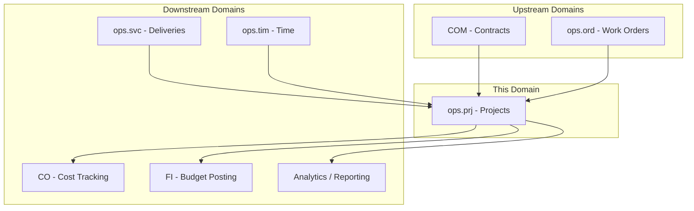
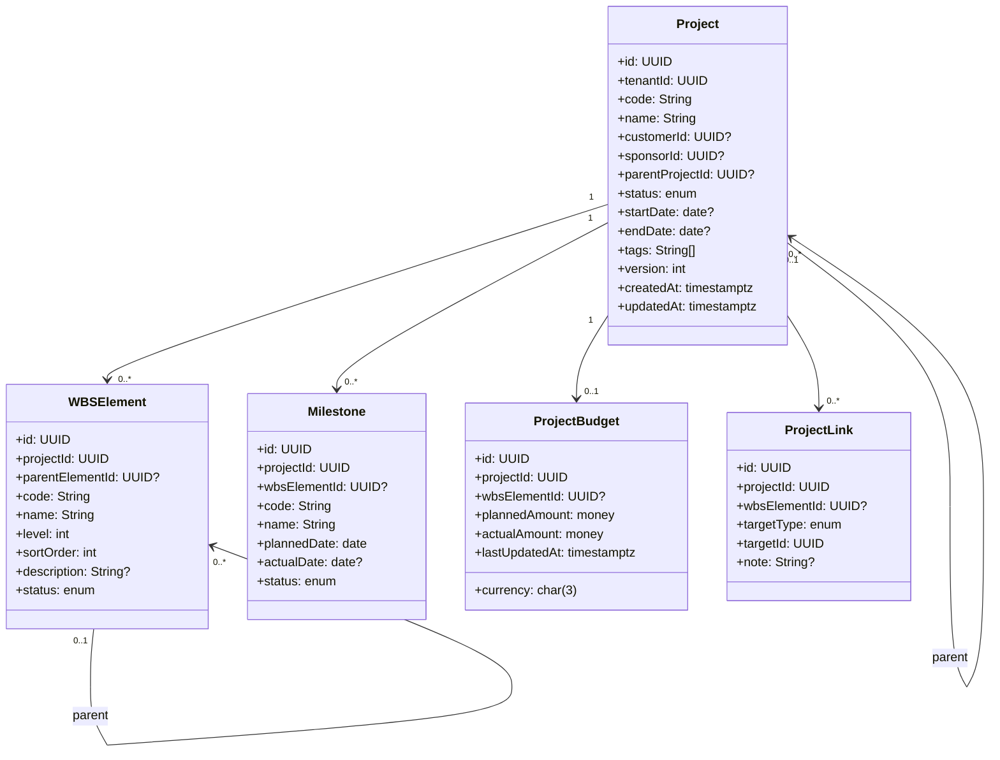
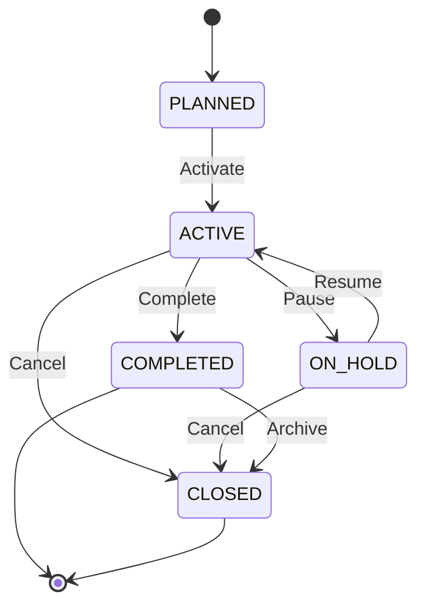
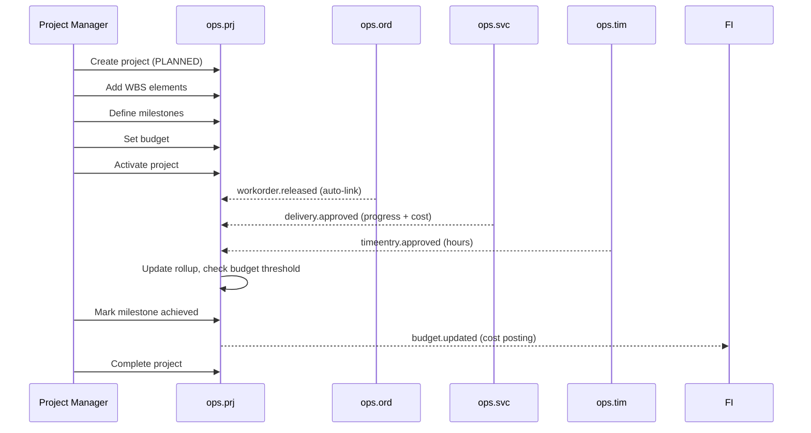
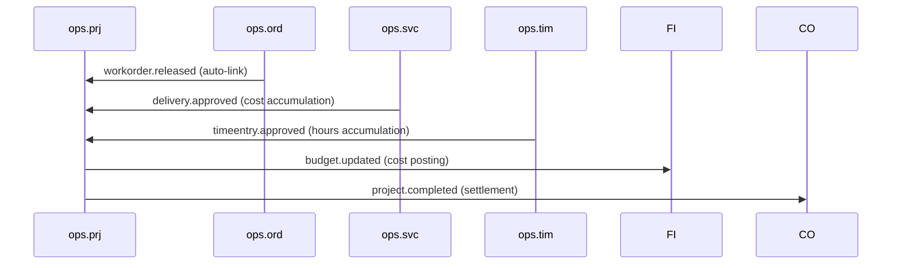
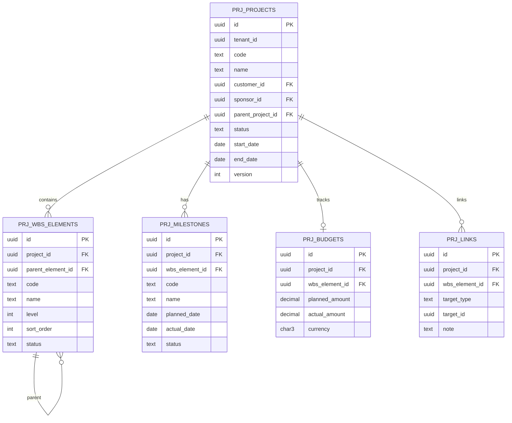

# OPS.PRJ - Project Management Domain / Service Specification

> **Conceptual Stack Layer:** Domain / Service
> **Space:** Platform
> **Owner:** Domain Engineering Team
> **Schema alignment:** `service-layer.schema.json`
> **Companion files:** `openapi.yaml`, `*.schema.json` (event contracts)
> **Referenced by:** Platform-Feature Spec SS5 (backend dependencies), BFF Contract
> **Belongs to:** OPS Suite Spec (`_ops_suite.md`)

> **Meta Information**
> - **Version:** 2026-04-03
> - **Template:** `domain-service-spec.md` v1.0.0
> - **Template Compliance:** ~95%
> - **Author(s):** OpenLeap Architecture Team
> - **Status:** DRAFT
> - **Suite:** `ops`
> - **Domain:** `prj`
> - **Bounded Context Ref:** `bc:project-management`
> - **Service ID:** `ops-prj-svc`
> - **basePackage:** `io.openleap.ops.prj`
> - **API Base Path:** `/api/ops/prj/v1`
> - **OpenLeap Starter Version:** `v1`
> - **Port:** OPEN QUESTION
> - **Repository:** OPEN QUESTION
> - **Tags:** `ops`, `project-management`, `wbs`, `milestone`, `budget`
> - **Team:**
>   - Name: `team-ops`
>   - Email: `ops-team@openleap.io`
>   - Slack: `#ops-team`

---

## Specification Guidelines Compliance

>
> ### Non-Negotiables
> - Never invent facts. If required info is missing, add an **OPEN QUESTION** entry.
> - Preserve intent and decisions. Only change meaning when explicitly requested.
> - Do not remove normative constraints unless they are explicitly replaced.
> - Keep the spec **self-contained**: no "see chat", no implicit context.
>
> ### Source of Truth Priority
> When sources conflict:
> 1. Spec (explicit) wins
> 2. Starter specs (implementation constraints) next
> 3. Guidelines (best practices) last
>
> ### Style Guide
> - Prefer short sentences and lists.
> - Use MUST/SHOULD/MAY for normative statements.
> - Keep terminology consistent (Aggregate, Domain Service, Application Service, Command, Event).
> - Avoid ambiguous words ("often", "maybe") unless explicitly noting uncertainty.

---

## 0. Document Purpose & Scope

### 0.1 Purpose
This specification defines the Project Management domain within the OPS Suite. `ops.prj` groups related operational work (orders, tasks, schedules, deliveries) into projects with hierarchical structure (WBS), milestones, and budget tracking. It provides project-level aggregation for reporting and links operational execution to strategic initiatives.

### 0.2 Target Audience
- Product Owners & Business Stakeholders
- System Architects & Technical Leads
- Integration Engineers

### 0.3 Scope
**In Scope:**
- Project lifecycle management (PLANNED → ACTIVE → ON_HOLD → COMPLETED → CLOSED)
- Work Breakdown Structure (WBS) with hierarchical elements
- Milestone tracking with planned vs. actual dates and completion status
- Project linking to work orders, tasks, deliveries, schedules, and documents
- Budget and cost accumulation (planned vs. actual, operational view)
- Portfolio/program hierarchy (parent-child projects)
- Rollup views (total deliveries, hours, costs per project)
- Progress monitoring dashboards

**Out of Scope:**
- Finance project accounting (FI/ACC)
- Resource HR contracts (HR Suite)
- Work order management (ops.ord)
- Full-featured PMO tooling (Gantt, critical path analysis)
- Time tracking (ops.tim)

### 0.4 Related Documents
- `_ops_suite.md` - OPS Suite overview
- `ops_ord-spec.md` - Order Management
- `ops_svc-spec.md` - Service Delivery
- `ops_tim-spec.md` - Time Tracking
- `ops_tsk-spec.md` - Task Management
- `BP_business_partner.md` - Business Partner

---

## 1. Business Context

### 1.1 Domain Purpose
`ops.prj` provides the **organizational umbrella** for related operational work. It enables project managers to track milestones, monitor budgets, and view aggregated progress across all linked work orders and deliveries. It bridges the gap between individual operational transactions and strategic project goals.

### 1.2 Business Value
- Unified project view aggregating work orders, time, and deliveries
- Milestone tracking for customer-facing commitments
- Budget monitoring (planned vs. actual) at project level
- WBS for structured decomposition of project scope
- Portfolio management for multi-project programs
- Foundation for project profitability analysis (with FI integration)

### 1.3 Key Stakeholders

| Role | Responsibility | Primary Use Cases |
|------|----------------|-------------------|
| Project Manager | Manage project lifecycle, WBS, and milestones | UC-PRJ-001, UC-PRJ-003, UC-PRJ-004 |
| Operations Manager | Monitor project portfolio health | UC-PRJ-007 |
| Customer / Sponsor | Track milestone achievement | UC-PRJ-004 |
| Finance Controller | View project cost accumulation and budget variance | UC-PRJ-006 |
| Service Provider | View project assignments | (consumer) |

### 1.4 Strategic Positioning



### 1.5 Service Context

| Field | Value |
|-------|-------|
| Suite | `ops` (Operational Services) |
| Domain | `prj` (Project Management) |
| Bounded Context | `bc:project-management` |
| Service ID | `ops-prj-svc` |
| Base Package | `io.openleap.ops.prj` |
| Authoritative Sources | OPS Suite Spec (`_ops_suite.md`), Project Management best practices (SAP PS / PMI PMBOK) |

---

## 2. Service Identity

| Field | Value |
|-------|-------|
| **Service ID** | `ops-prj-svc` |
| **Display Name** | Project Management Service |
| **Suite** | `ops` |
| **Domain** | `prj` |
| **Bounded Context Ref** | `bc:project-management` |
| **Version** | 2026-04-03 |
| **Status** | DRAFT |
| **API Base Path** | `/api/ops/prj/v1` |
| **Repository** | OPEN QUESTION |
| **Tags** | `ops`, `project-management`, `wbs`, `milestone`, `budget` |
| **Team Name** | `team-ops` |
| **Team Email** | `ops-team@openleap.io` |
| **Team Slack** | `#ops-team` |

---

## 3. Domain Model

### 3.1 Conceptual Overview

The domain centers on the **Project** aggregate — a container for related operational work with lifecycle, budget, and timeline management. Projects contain **WBSElement** entities for hierarchical scope decomposition, **Milestone** entities for key deliverable checkpoints, and **ProjectLink** entities to associate operational artifacts (work orders, tasks, deliveries). A **ProjectBudget** value object tracks planned vs. actual costs. Progress is monitored via rollup views aggregating data from linked operational entities.



### 3.2 Core Concepts

| Concept | Owner | Description | Glossary Ref |
|---------|-------|-------------|--------------|
| Project | ops-prj-svc | Container for related work with lifecycle, timeline, and budget | Project (Projekt) |
| WBSElement | ops-prj-svc | Hierarchical breakdown of project scope into manageable elements | Work Breakdown Structure Element |
| Milestone | ops-prj-svc | Key deliverable checkpoint in the project timeline | Milestone (Meilenstein) |
| ProjectBudget | ops-prj-svc | Planned vs. actual cost tracking at project or WBS level | Budget (Budget) |
| ProjectLink | ops-prj-svc | Association of project/WBS to operational artifacts (orders, tasks, deliveries) | Reference |

### 3.3 Aggregate Definitions

#### 3.3.1 Aggregate: Project

**Aggregate ID:** `agg:project`
**Business Purpose:** Container for related operational work with lifecycle, timeline, hierarchical structure (WBS), milestones, and budget. Represents: "Project X for Customer A running from D1 to D2 with budget B."

**Aggregate Root Attributes:**

| Attribute | Type | Format | Required | Description | Example | Constraints |
|-----------|------|--------|----------|-------------|---------|-------------|
| id | UUID | uuid | Yes | Unique identifier | `a1b2c3d4-...` | Immutable after create, `OlUuid.create()` |
| tenantId | UUID | uuid | Yes | Tenant ownership | `t1-uuid` | Immutable, RLS-enforced |
| code | String | varchar(50) | Yes | Project code | `PRJ-2026-001` | Unique per tenant, max 50 |
| name | String | varchar(200) | Yes | Display name | `Customer Portal Redesign` | Max 200 |
| description | String | text | No | Detailed project description | `"Redesign of..."` | Max 4000 chars |
| customerId | UUID | uuid | No | Customer (BP party) | `cust-uuid` | FK logical to bp.party |
| sponsorId | UUID | uuid | No | Sponsor / Project Manager | `pm-uuid` | FK logical to bp.party or iam.principal |
| parentProjectId | UUID | uuid | No | Parent project (portfolio hierarchy) | `parent-uuid` | FK to prj_projects, self-referential |
| status | Enum | — | Yes | Lifecycle state | `PLANNED` | PLANNED, ACTIVE, ON_HOLD, COMPLETED, CLOSED |
| startDate | Date | ISO 8601 | No | Planned start date | `2026-04-01` | — |
| endDate | Date | ISO 8601 | No | Planned end date | `2026-12-31` | >= startDate (BR-003) |
| tags | String[] | text[] | No | Categorization tags | `["strategic","internal"]` | — |
| version | Integer | — | Yes | Optimistic locking version | `1` | Auto-incremented |
| createdAt | Timestamptz | ISO 8601 | Yes | Creation timestamp | `2026-04-01T08:00:00Z` | System-managed |
| updatedAt | Timestamptz | ISO 8601 | Yes | Last update timestamp | `2026-04-01T10:00:00Z` | System-managed |

**Lifecycle States:**



**State Transitions:**

| From | To | Trigger | Guard / Precondition | Side Effects |
|------|----|---------|---------------------|--------------|
| — | PLANNED | Create | Valid code uniqueness (BR-001), valid dates (BR-003) | — |
| PLANNED | ACTIVE | Activate | At least one WBS element exists (BR-008) | Emits `project.activated` |
| ACTIVE | ON_HOLD | Pause | Reason required | Emits `project.onhold` |
| ON_HOLD | ACTIVE | Resume | — | Emits `project.activated` |
| ACTIVE | COMPLETED | Complete | All milestones ACHIEVED or CANCELLED (BR-005, warning if PLANNED) | Emits `project.completed` |
| ACTIVE | CLOSED | Cancel | Reason required | Emits `project.cancelled` |
| ON_HOLD | CLOSED | Cancel | Reason required | Emits `project.cancelled` |
| COMPLETED | CLOSED | Archive | — | Emits `project.closed` |

**Invariants:**
- INV-P-001: `(tenantId, code)` MUST be unique (BR-001)
- INV-P-002: If `budgetAmount` is set on ProjectBudget, currency MUST be set (BR-002)
- INV-P-003: `endDate >= startDate` when both are set (BR-003)
- INV-P-004: `(projectId, targetType, targetId)` MUST be unique on ProjectLink — no duplicate links (BR-004)
- INV-P-005: Cannot complete if milestones are still PLANNED without acknowledgment (BR-005)
- INV-P-006: `parentProjectId` MUST NOT create circular references (BR-006)
- INV-P-007: CLOSED projects are immutable — no field changes allowed (BR-007)
- INV-P-008: Activation requires at least one WBS element (BR-008)

**Domain Events Emitted:**

| Event | Routing Key | When | Key Payload |
|-------|-------------|------|-------------|
| ProjectCreated | `ops.prj.project.created` | Project created | projectId, tenantId, code, name |
| ProjectActivated | `ops.prj.project.activated` | PLANNED → ACTIVE or ON_HOLD → ACTIVE | projectId, tenantId |
| ProjectOnHold | `ops.prj.project.onhold` | ACTIVE → ON_HOLD | projectId, tenantId, reason |
| ProjectCompleted | `ops.prj.project.completed` | ACTIVE → COMPLETED | projectId, tenantId, actualEndDate |
| ProjectCancelled | `ops.prj.project.cancelled` | → CLOSED (cancel) | projectId, tenantId, reason |
| ProjectClosed | `ops.prj.project.closed` | COMPLETED → CLOSED | projectId, tenantId |

#### 3.3.2 Entity: WBSElement (child of Project)

**Business Purpose:** Hierarchical breakdown of project scope. Each WBS element represents a deliverable or work package within the project.

| Attribute | Type | Format | Required | Description | Constraints |
|-----------|------|--------|----------|-------------|-------------|
| id | UUID | uuid | Yes | Unique identifier | Immutable, `OlUuid.create()` |
| projectId | UUID | uuid | Yes | Parent project | FK to prj_projects |
| parentElementId | UUID | uuid | No | Parent WBS element (hierarchy) | FK to prj_wbs_elements, self-referential |
| code | String | varchar(50) | Yes | WBS code | Unique within project, e.g. `1.2.3` |
| name | String | varchar(200) | Yes | Display name | Max 200 |
| level | Integer | — | Yes | Hierarchy depth (0 = root) | Computed from parent chain |
| sortOrder | Integer | — | Yes | Display ordering | — |
| description | String | text | No | Element description | Max 4000 |
| status | Enum | — | Yes | OPEN, IN_PROGRESS, COMPLETED, CANCELLED | — |

**Relationship:** Project `1` → `0..*` WBSElement (hierarchical, self-referencing)

**Business Rules:**
1. `(projectId, code)` MUST be unique — no duplicate WBS codes within a project
2. `parentElementId` MUST NOT create circular references
3. Deleting a WBS element with children is prohibited — remove children first

#### 3.3.3 Entity: Milestone (child of Project)

**Business Purpose:** Key deliverable or checkpoint in the project timeline. Milestones track planned vs. actual achievement dates and enable customer-facing commitment tracking.

| Attribute | Type | Format | Required | Description | Constraints |
|-----------|------|--------|----------|-------------|-------------|
| id | UUID | uuid | Yes | Unique identifier | Immutable, `OlUuid.create()` |
| projectId | UUID | uuid | Yes | Parent project | FK to prj_projects |
| wbsElementId | UUID | uuid | No | Associated WBS element | FK to prj_wbs_elements |
| code | String | varchar(50) | Yes | Milestone code | Unique within project |
| name | String | varchar(200) | Yes | Display name | Max 200 |
| plannedDate | Date | ISO 8601 | Yes | Target date | — |
| actualDate | Date | ISO 8601 | No | Actual achievement date | — |
| status | Enum | — | Yes | PLANNED, ACHIEVED, LATE, CANCELLED | — |

**Relationship:** Project `1` → `0..*` Milestone

**Business Rules:**
1. `plannedDate` is required
2. ACHIEVED status requires `actualDate` to be set
3. If `actualDate > plannedDate`, status transitions to LATE (may be auto-detected)
4. `(projectId, code)` MUST be unique

**Domain Events Emitted:**

| Event | Routing Key | When | Key Payload |
|-------|-------------|------|-------------|
| MilestoneAchieved | `ops.prj.milestone.achieved` | → ACHIEVED | milestoneId, projectId, actualDate |
| MilestoneLate | `ops.prj.milestone.late` | → LATE | milestoneId, projectId, plannedDate, actualDate |

#### 3.3.4 Entity: ProjectBudget (child of Project)

**Business Purpose:** Tracks planned vs. actual cost at project or WBS element level. Provides budget variance monitoring and alerts.

| Attribute | Type | Format | Required | Description | Constraints |
|-----------|------|--------|----------|-------------|-------------|
| id | UUID | uuid | Yes | Unique identifier | Immutable, `OlUuid.create()` |
| projectId | UUID | uuid | Yes | Parent project | FK to prj_projects |
| wbsElementId | UUID | uuid | No | WBS element (for element-level budgets) | FK to prj_wbs_elements |
| plannedAmount | Money | numeric(18,2) | Yes | Planned budget | >= 0 (BR-002) |
| actualAmount | Money | numeric(18,2) | Yes | Accumulated actual cost | >= 0, updated via events |
| currency | Char(3) | ISO 4217 | Yes | Currency code | Required (BR-002) |
| lastUpdatedAt | Timestamptz | ISO 8601 | Yes | Last cost update | System-managed |

**Relationship:** Project `1` → `0..1` ProjectBudget (one per project; optionally per WBS element)

**Business Rules:**
1. `plannedAmount` >= 0, `actualAmount` >= 0
2. Currency MUST be a valid ISO 4217 code
3. Budget variance alerts when `actualAmount > plannedAmount * threshold` (configurable, default 90%)

**Domain Events Emitted:**

| Event | Routing Key | When | Key Payload |
|-------|-------------|------|-------------|
| BudgetUpdated | `ops.prj.budget.updated` | Actual amount changes | projectId, plannedAmount, actualAmount, currency |
| BudgetThresholdExceeded | `ops.prj.budget.threshold-exceeded` | Actual exceeds threshold | projectId, plannedAmount, actualAmount, threshold% |

#### 3.3.5 Entity: ProjectLink (child of Project)

**Business Purpose:** Links project or WBS element to operational artifacts (orders, tasks, deliveries, documents, etc.).

| Attribute | Type | Format | Required | Description | Constraints |
|-----------|------|--------|----------|-------------|-------------|
| id | UUID | uuid | Yes | Unique identifier | Immutable, `OlUuid.create()` |
| projectId | UUID | uuid | Yes | Parent project | FK to prj_projects |
| wbsElementId | UUID | uuid | No | Associated WBS element | FK to prj_wbs_elements |
| targetType | Enum | — | Yes | Type of linked artifact | ORDER, TASK, SLOT, DELIVERY, DOC, CUSTOM |
| targetId | UUID | uuid | Yes | ID of linked artifact | — |
| note | String | text | No | Link description | Max 1000 |

**Relationship:** Project `1` → `0..*` ProjectLink

**Business Rules:**
1. `(projectId, targetType, targetId)` MUST be unique — no duplicate links (BR-004)

### 3.4 Enumerations

| Enum | Values | Description |
|------|--------|-------------|
| ProjectStatus | PLANNED, ACTIVE, ON_HOLD, COMPLETED, CLOSED | Project lifecycle |
| WBSElementStatus | OPEN, IN_PROGRESS, COMPLETED, CANCELLED | WBS element lifecycle |
| MilestoneStatus | PLANNED, ACHIEVED, LATE, CANCELLED | Milestone lifecycle |
| LinkTargetType | ORDER, TASK, SLOT, DELIVERY, DOC, CUSTOM | Type of linked artifact |

---

## 4. Business Rules & Constraints

### 4.1 Business Rules Catalog

| ID | Rule Name | Description | Scope | Enforcement | Error Code |
|----|-----------|-------------|-------|-------------|------------|
| BR-001 | Code Uniqueness | `(tenantId, code)` must be unique | Project | Create | `PRJ-VAL-001` |
| BR-002 | Budget Validation | plannedAmount >= 0, currency required | ProjectBudget | Create/Update | `PRJ-VAL-002` |
| BR-003 | Date Range | endDate >= startDate when both set | Project | Create/Update | `PRJ-VAL-003` |
| BR-004 | Link Uniqueness | `(projectId, targetType, targetId)` unique — no duplicate links | ProjectLink | Create | `PRJ-VAL-004` |
| BR-005 | Completion Guard | Cannot complete if milestones are PLANNED (warning/acknowledgment) | Project | Complete | `PRJ-BIZ-005` |
| BR-006 | No Circular Hierarchy | parentProjectId MUST NOT create circular references | Project | Create/Update | `PRJ-BIZ-006` |
| BR-007 | Immutable After Close | CLOSED projects cannot be modified | Project | Update | `PRJ-BIZ-007` |
| BR-008 | Activation Requires WBS | At least one WBS element must exist before activation | Project | Activate | `PRJ-BIZ-008` |
| BR-009 | WBS Code Uniqueness | `(projectId, code)` unique within WBS elements | WBSElement | Create | `PRJ-VAL-009` |
| BR-010 | Milestone Code Uniqueness | `(projectId, code)` unique within milestones | Milestone | Create | `PRJ-VAL-010` |

### 4.2 Detailed Rule Definitions

#### BR-005: Completion Guard
**Context:** Completing a project with open milestones may indicate incomplete work. The system warns the user but allows override.
**Rule Statement:** When completing a project, if any milestone has status PLANNED, the system MUST emit a warning. The user MUST explicitly acknowledge the warning to proceed.
**Applies To:** Project aggregate, Complete transition
**Enforcement:** Application Service checks milestone statuses before transition.
**Error Handling:**
- Code: `PRJ-BIZ-005`
- Message: `"Project {id} has {n} milestones still in PLANNED status. Acknowledge to proceed."`
- HTTP: 409 Conflict (without acknowledgment flag)

#### BR-007: Immutable After Close
**Context:** CLOSED projects represent archived historical records. No changes are permitted.
**Rule Statement:** Once a Project reaches CLOSED status, no attribute may be changed.
**Applies To:** Project aggregate
**Enforcement:** Domain service rejects any update command targeting a CLOSED project.
**Validation Logic:** `if (project.status == CLOSED) throw ImmutableProjectException`
**Error Handling:**
- Code: `PRJ-BIZ-007`
- Message: `"Project {id} is closed and cannot be modified."`
- HTTP: 409 Conflict

### 4.3 Data Validation Rules

| Field | Validation Rule | Error Code | Error Message |
|-------|----------------|------------|---------------|
| code | Required, max 50, unique per tenant | `PRJ-VAL-001` | `"Valid unique project code is required (max 50 chars)"` |
| name | Required, max 200 | `PRJ-VAL-011` | `"Project name is required (max 200 chars)"` |
| customerId | Valid UUID if provided, active in BP | `PRJ-VAL-012` | `"Customer ID must reference an active business partner"` |
| startDate | Valid ISO 8601 date | `PRJ-VAL-013` | `"Valid start date required"` |
| endDate | >= startDate if both set | `PRJ-VAL-003` | `"End date must be on or after start date"` |
| plannedAmount | >= 0 if provided | `PRJ-VAL-002` | `"Budget amount must be >= 0"` |
| currency | Valid ISO 4217 if budget set | `PRJ-VAL-014` | `"Valid ISO 4217 currency code required when budget is set"` |
| parentProjectId | Valid UUID, no circular reference | `PRJ-BIZ-006` | `"Parent project must not create circular hierarchy"` |

### 4.4 Reference Data Dependencies

| Catalog | Usage | Provider Service | Validation |
|---------|-------|-----------------|------------|
| Currencies (ISO 4217) | `currency` field | ref-data-svc (T1) | Code existence check |
| Business Partners | `customerId`, `sponsorId` | bp-party-svc (T2) | Active status check |
| Cost Centers | Budget posting | co-cca-svc (T3) | Code existence check |

---

## 5. Use Cases

### 5.1 Business Logic Placement

| Layer | Responsibilities |
|-------|-----------------|
| Application Service | Command validation, aggregate loading, event publishing, orchestration (budget update from events) |
| Domain Service | Hierarchy cycle detection, rollup calculation, budget threshold checking (cross-aggregate) |
| Aggregate | State transitions, invariant enforcement, attribute validation |

### 5.2 Use Cases

#### UC-PRJ-001: Create Project

| Field | Value |
|-------|-------|
| **ID** | UC-PRJ-001 |
| **Type** | WRITE |
| **Trigger** | REST |
| **Aggregate** | Project |
| **Domain Operation** | `Project.create()` |
| **Inputs** | code, name, description?, customerId?, sponsorId?, parentProjectId?, startDate?, endDate?, tags? |
| **Outputs** | Created Project in PLANNED state |
| **Events** | `ProjectCreated` → `ops.prj.project.created` |
| **REST** | `POST /api/ops/prj/v1/projects` → 201 Created |
| **Idempotency** | Client-generated `Idempotency-Key` header |
| **Errors** | 400 (validation), 409 (BR-001 duplicate code), 422 (BR-003 invalid dates, BR-006 circular hierarchy) |

#### UC-PRJ-002: Activate Project

| Field | Value |
|-------|-------|
| **ID** | UC-PRJ-002 |
| **Type** | WRITE |
| **Trigger** | REST |
| **Aggregate** | Project |
| **Domain Operation** | `Project.activate()` |
| **Inputs** | projectId |
| **Outputs** | Project in ACTIVE state |
| **Events** | `ProjectActivated` → `ops.prj.project.activated` |
| **REST** | `POST /api/ops/prj/v1/projects/{id}:activate` → 200 OK |
| **Idempotency** | Idempotent (re-activate of ACTIVE is no-op) |
| **Errors** | 404 (not found), 409 (not in PLANNED/ON_HOLD), 422 (BR-008 no WBS elements) |

#### UC-PRJ-003: Manage WBS Elements

| Field | Value |
|-------|-------|
| **ID** | UC-PRJ-003 |
| **Type** | WRITE |
| **Trigger** | REST |
| **Aggregate** | Project (WBSElement child) |
| **Domain Operation** | `WBSElement.create()`, `WBSElement.update()`, `WBSElement.delete()` |
| **Inputs** | projectId, parentElementId?, code, name, description?, sortOrder |
| **Outputs** | Created/updated/deleted WBS element |
| **Events** | — (WBS changes are internal to project) |
| **REST** | `POST /api/ops/prj/v1/projects/{id}/wbs`, `PATCH /api/ops/prj/v1/wbs/{id}`, `DELETE /api/ops/prj/v1/wbs/{id}` |
| **Idempotency** | Idempotency-Key on create |
| **Errors** | 404, 409 (BR-009 duplicate code, circular parent), 422 (has children on delete) |

#### UC-PRJ-004: Track Milestones

| Field | Value |
|-------|-------|
| **ID** | UC-PRJ-004 |
| **Type** | WRITE |
| **Trigger** | REST |
| **Aggregate** | Project (Milestone child) |
| **Domain Operation** | `Milestone.create()`, `Milestone.achieve()`, `Milestone.markLate()` |
| **Inputs** | projectId, wbsElementId?, code, name, plannedDate, actualDate? |
| **Outputs** | Created/updated milestone |
| **Events** | `MilestoneAchieved` → `ops.prj.milestone.achieved`, `MilestoneLate` → `ops.prj.milestone.late` |
| **REST** | `POST /api/ops/prj/v1/projects/{id}/milestones`, `PATCH /api/ops/prj/v1/milestones/{id}`, `POST /api/ops/prj/v1/milestones/{id}:achieve` |
| **Idempotency** | Idempotency-Key on create |
| **Errors** | 404, 409 (BR-010 duplicate code), 422 (ACHIEVED without actualDate) |

#### UC-PRJ-005: Link Work Orders and Artifacts

| Field | Value |
|-------|-------|
| **ID** | UC-PRJ-005 |
| **Type** | WRITE |
| **Trigger** | REST / Event |
| **Aggregate** | Project (ProjectLink child) |
| **Domain Operation** | `ProjectLink.create()`, `ProjectLink.delete()` |
| **Inputs** | projectId, wbsElementId?, targetType, targetId, note? |
| **Outputs** | Created/deleted project link |
| **Events** | — |
| **REST** | `POST /api/ops/prj/v1/projects/{id}/links`, `DELETE /api/ops/prj/v1/links/{id}` |
| **Idempotency** | Idempotency-Key on create |
| **Errors** | 404, 409 (BR-004 duplicate link) |

#### UC-PRJ-006: Manage Project Budget

| Field | Value |
|-------|-------|
| **ID** | UC-PRJ-006 |
| **Type** | WRITE |
| **Trigger** | REST / Event |
| **Aggregate** | Project (ProjectBudget child) |
| **Domain Operation** | `ProjectBudget.create()`, `ProjectBudget.updatePlanned()`, `ProjectBudget.accumulateActual()` |
| **Inputs** | projectId, wbsElementId?, plannedAmount, currency |
| **Outputs** | Created/updated budget |
| **Events** | `BudgetUpdated` → `ops.prj.budget.updated`, `BudgetThresholdExceeded` → `ops.prj.budget.threshold-exceeded` |
| **REST** | `POST /api/ops/prj/v1/projects/{id}/budget`, `PATCH /api/ops/prj/v1/budgets/{id}` |
| **Idempotency** | Idempotency-Key on create |
| **Errors** | 400 (validation), 422 (BR-002 invalid budget) |

#### UC-PRJ-007: View Project Rollup

| Field | Value |
|-------|-------|
| **ID** | UC-PRJ-007 |
| **Type** | READ |
| **Trigger** | REST |
| **Aggregate** | Project |
| **Domain Operation** | Query projection (materialized view) |
| **Inputs** | projectId |
| **Outputs** | `{ totalDeliveries, totalHours, costEstimate, billableAmount, milestoneProgress, budgetVariance }` |
| **Events** | — |
| **REST** | `GET /api/ops/prj/v1/projects/{id}/rollup` → 200 OK |
| **Idempotency** | Inherently idempotent (GET) |
| **Errors** | 404 (project not found) |

#### UC-PRJ-008: Complete Project

| Field | Value |
|-------|-------|
| **ID** | UC-PRJ-008 |
| **Type** | WRITE |
| **Trigger** | REST |
| **Aggregate** | Project |
| **Domain Operation** | `Project.complete()` |
| **Inputs** | projectId, acknowledgePlannedMilestones? (boolean) |
| **Outputs** | Project in COMPLETED state |
| **Events** | `ProjectCompleted` → `ops.prj.project.completed` |
| **REST** | `POST /api/ops/prj/v1/projects/{id}:complete` → 200 OK |
| **Idempotency** | Idempotent (re-complete of COMPLETED is no-op) |
| **Errors** | 404, 409 (not ACTIVE, BR-005 unacknowledged planned milestones) |

#### UC-PRJ-009: List / Search Projects (READ)

| Field | Value |
|-------|-------|
| **ID** | UC-PRJ-009 |
| **Type** | READ |
| **Trigger** | REST |
| **Aggregate** | Project |
| **Domain Operation** | Query projection |
| **Inputs** | status?, customerId?, sponsorId?, q?, page, size |
| **Outputs** | Paginated project list |
| **Events** | — |
| **REST** | `GET /api/ops/prj/v1/projects?...` → 200 OK |
| **Idempotency** | Inherently idempotent (GET) |
| **Errors** | 400 (invalid filter params) |

### 5.3 Process Flow Diagrams



### 5.4 Cross-Domain Workflows

**Does this domain participate in multi-service workflows?** Yes

#### Workflow: Project Budget to Cost Accounting (CHR-OPS-PRJ-001)
**Orchestration Pattern:** Choreography (EDA)
**Pattern Rationale:** Sequential flow — delivery/time events accumulate costs on project budgets, which then emit budget update events consumed by CO and FI. Each step is independently processable with eventual consistency.

---

## 6. REST API

### 6.1 API Overview

| Field | Value |
|-------|-------|
| Base Path | `/api/ops/prj/v1` |
| Authentication | OAuth2/JWT (Bearer token) |
| Authorization | Scopes: `ops.prj:read`, `ops.prj:write`, `ops.prj:manage`, `ops.prj:admin` |
| Content Type | `application/json` |
| Versioning | URL path (`v1`) |

### 6.2 Resource Operations

#### Project Resource

| Endpoint | Method | Path | Summary | Role Required | Events Published |
|----------|--------|------|---------|---------------|-----------------|
| Create Project | POST | `/projects` | Create new project | `ops.prj:write` | `ProjectCreated` |
| Get Project | GET | `/projects/{id}` | Retrieve project by ID | `ops.prj:read` | — |
| List Projects | GET | `/projects` | Search/filter projects | `ops.prj:read` | — |
| Update Project | PATCH | `/projects/{id}` | Update project details | `ops.prj:write` | — |

**Create Project — Request:**
```json
{
  "code": "PRJ-2026-001",
  "name": "Customer Portal Redesign",
  "description": "Redesign of the customer self-service portal",
  "customerId": "cust-uuid",
  "sponsorId": "pm-uuid",
  "startDate": "2026-04-01",
  "endDate": "2026-12-31",
  "tags": ["strategic", "internal"]
}
```

**Create Project — Response (201 Created):**
```json
{
  "id": "prj-uuid",
  "code": "PRJ-2026-001",
  "status": "PLANNED",
  "version": 1,
  "createdAt": "2026-04-01T08:00:00Z"
}
```

**Update Project — Headers:** `If-Match: "{version}"` (optimistic locking, 412 on conflict)

### 6.3 Business Operations

| Endpoint | Method | Path | Summary | Role Required | Events Published |
|----------|--------|------|---------|---------------|-----------------|
| Activate | POST | `/projects/{id}:activate` | Activate project | `ops.prj:manage` | `ProjectActivated` |
| Pause | POST | `/projects/{id}:on-hold` | Put project on hold | `ops.prj:manage` | `ProjectOnHold` |
| Resume | POST | `/projects/{id}:resume` | Resume from on-hold | `ops.prj:manage` | `ProjectActivated` |
| Complete | POST | `/projects/{id}:complete` | Complete project | `ops.prj:manage` | `ProjectCompleted` |
| Cancel | POST | `/projects/{id}:cancel` | Cancel project | `ops.prj:manage` | `ProjectCancelled` |

#### WBS Element Resource

| Endpoint | Method | Path | Summary | Role Required | Events Published |
|----------|--------|------|---------|---------------|-----------------|
| Add WBS | POST | `/projects/{id}/wbs` | Add WBS element | `ops.prj:write` | — |
| Update WBS | PATCH | `/wbs/{id}` | Update WBS element | `ops.prj:write` | — |
| Delete WBS | DELETE | `/wbs/{id}` | Remove WBS element | `ops.prj:write` | — |
| List WBS | GET | `/projects/{id}/wbs` | List WBS tree | `ops.prj:read` | — |

#### Milestone Resource

| Endpoint | Method | Path | Summary | Role Required | Events Published |
|----------|--------|------|---------|---------------|-----------------|
| Add Milestone | POST | `/projects/{id}/milestones` | Add milestone | `ops.prj:write` | — |
| Update Milestone | PATCH | `/milestones/{id}` | Update milestone | `ops.prj:write` | — |
| Achieve Milestone | POST | `/milestones/{id}:achieve` | Mark as achieved | `ops.prj:manage` | `MilestoneAchieved` |

#### Project Link Resource

| Endpoint | Method | Path | Summary | Role Required | Events Published |
|----------|--------|------|---------|---------------|-----------------|
| Add Link | POST | `/projects/{id}/links` | Link artifact | `ops.prj:write` | — |
| Delete Link | DELETE | `/links/{id}` | Remove link | `ops.prj:write` | — |

#### Budget Resource

| Endpoint | Method | Path | Summary | Role Required | Events Published |
|----------|--------|------|---------|---------------|-----------------|
| Set Budget | POST | `/projects/{id}/budget` | Set project budget | `ops.prj:manage` | — |
| Update Budget | PATCH | `/budgets/{id}` | Update planned budget | `ops.prj:manage` | `BudgetUpdated` |

#### Rollup (Aggregated View)

| Endpoint | Method | Path | Summary | Role Required | Events Published |
|----------|--------|------|---------|---------------|-----------------|
| Get Rollup | GET | `/projects/{id}/rollup` | Aggregated project metrics | `ops.prj:read` | — |

### 6.4 Error Responses

| HTTP Status | Error Code | Description |
|-------------|------------|-------------|
| 400 | `PRJ-VAL-*` | Validation error (field-level) |
| 401 | — | Authentication required |
| 403 | — | Forbidden (insufficient role) |
| 404 | — | Resource not found |
| 409 | `PRJ-BIZ-*` | Conflict (invalid state transition, duplicate code, closed project) |
| 412 | — | Precondition failed (optimistic lock version mismatch) |
| 422 | `PRJ-BIZ-*` | Business rule violation |

### 6.5 OpenAPI Specification
**Location:** `contracts/http/ops/prj/openapi.yaml`
**OpenAPI Version:** 3.1.0

---

## 7. Events & Integration

### 7.1 Event-Driven Architecture Pattern
**Pattern Decision:** Choreography (EDA)
**Rationale:** OPS project management follows an event-driven accumulation pattern — operational events (deliveries, time entries, work order completions) flow into the project and update rollups and budgets. No distributed transaction coordination needed. At-least-once delivery with idempotent consumers.

### 7.2 Published Events

**Exchange:** `ops.prj.events` (topic)

#### ProjectCreated
- **Routing Key:** `ops.prj.project.created`
- **Business Meaning:** A new project has been created
- **When Published:** Project creation
- **Payload Schema:**
```json
{
  "projectId": "uuid",
  "tenantId": "uuid",
  "code": "PRJ-2026-001",
  "name": "Customer Portal Redesign",
  "customerId": "uuid | null",
  "status": "PLANNED"
}
```
- **Consumers:** Analytics

#### ProjectActivated
- **Routing Key:** `ops.prj.project.activated`
- **Business Meaning:** A project is now active and ready for operational work
- **When Published:** PLANNED → ACTIVE or ON_HOLD → ACTIVE
- **Payload Schema:**
```json
{
  "projectId": "uuid",
  "tenantId": "uuid",
  "code": "PRJ-2026-001",
  "status": "ACTIVE"
}
```
- **Consumers:** ops.ord (enable work order linkage), ops.tsk (enable task linkage)

#### ProjectOnHold
- **Routing Key:** `ops.prj.project.onhold`
- **Business Meaning:** A project has been paused
- **When Published:** ACTIVE → ON_HOLD
- **Payload Schema:** `{ "projectId": "uuid", "tenantId": "uuid", "reason": "string" }`
- **Consumers:** ops.ord (flag linked orders)

#### ProjectCompleted
- **Routing Key:** `ops.prj.project.completed`
- **Business Meaning:** A project has been completed — all deliverables achieved
- **When Published:** ACTIVE → COMPLETED
- **Payload Schema:**
```json
{
  "projectId": "uuid",
  "tenantId": "uuid",
  "code": "PRJ-2026-001",
  "actualEndDate": "2026-12-15"
}
```
- **Consumers:** FI (final budget posting), CO (project cost settlement), Analytics

#### ProjectCancelled
- **Routing Key:** `ops.prj.project.cancelled`
- **Business Meaning:** A project has been cancelled
- **When Published:** → CLOSED (cancel)
- **Payload Schema:** `{ "projectId": "uuid", "tenantId": "uuid", "reason": "string" }`
- **Consumers:** ops.ord (cancel linked orders)

#### MilestoneAchieved
- **Routing Key:** `ops.prj.milestone.achieved`
- **Business Meaning:** A project milestone has been achieved
- **When Published:** Milestone → ACHIEVED
- **Payload Schema:** `{ "milestoneId": "uuid", "projectId": "uuid", "tenantId": "uuid", "code": "string", "actualDate": "date" }`
- **Consumers:** Notification service, Analytics

#### MilestoneLate
- **Routing Key:** `ops.prj.milestone.late`
- **Business Meaning:** A milestone is past its planned date without achievement
- **When Published:** Milestone → LATE
- **Payload Schema:** `{ "milestoneId": "uuid", "projectId": "uuid", "tenantId": "uuid", "code": "string", "plannedDate": "date" }`
- **Consumers:** Notification service

#### BudgetUpdated
- **Routing Key:** `ops.prj.budget.updated`
- **Business Meaning:** Project budget actual amount has changed
- **When Published:** Actual cost accumulated from delivery/time events
- **Payload Schema:**
```json
{
  "projectId": "uuid",
  "tenantId": "uuid",
  "plannedAmount": 100000.00,
  "actualAmount": 75000.00,
  "currency": "EUR"
}
```
- **Consumers:** FI (budget posting), CO (cost tracking)

### 7.3 Consumed Events

| Source Event | Source Service | Handler | Purpose | Queue |
|-------------|---------------|---------|---------|-------|
| `ops.ord.workorder.released` | ops.ord | WorkOrderReleasedHandler | Auto-link work order to project | `ops.prj.in.ops.ord.workorder` |
| `ops.ord.workorder.completed` | ops.ord | WorkOrderCompletedHandler | Update rollup progress | `ops.prj.in.ops.ord.workorder` |
| `ops.svc.delivery.approved` | ops.svc | DeliveryApprovedHandler | Update delivery count, accumulate cost | `ops.prj.in.ops.svc.delivery` |
| `ops.tim.timeentry.approved` | ops.tim | TimeEntryApprovedHandler | Accumulate hours and cost | `ops.prj.in.ops.tim.timeentry` |
| `cap.calendar.updated` | CAP | CalendarUpdatedHandler | Milestone date awareness | `ops.prj.in.cap.calendar` |

### 7.4 Event Flow Diagrams



### 7.5 Integration Points Summary

**Upstream Dependencies:**

| Service | Tier | Purpose | Type | Criticality | Fallback |
|---------|------|---------|------|-------------|----------|
| bp-party-svc | T2 | Customer/sponsor validation | REST + Cache | Medium | Use cached data |
| ref-data-svc | T1 | Currency validation | REST + Cache | Low | Use cached data |

**Downstream Consumers:**

| Service | Tier | Purpose | Type | SLA |
|---------|------|---------|------|-----|
| ops.ord | T3 | Flag linked orders on project status change | Event | < 5s processing |
| ops.tsk | T3 | Enable task linkage | Event | < 5s processing |
| fi.bil | T3 | Budget posting | Event | < 10s processing |
| co | T3 | Cost tracking and settlement | Event | < 10s processing |
| Analytics | T4 | Reporting and dashboards | Event | < 30s processing |

---

## 8. Data Model

### 8.1 Storage Technology

| Aspect | Choice |
|--------|--------|
| Database | PostgreSQL 16+ |
| Multi-tenancy | `tenant_id` column + PostgreSQL RLS |
| Soft Delete | No — CLOSED projects are immutable; no silent deletion |
| Audit Trail | All status transitions logged via iam.audit events |
| Outbox | `prj_outbox_events` table for reliable event publishing (ADR-013) |

### 8.2 Conceptual Data Model



### 8.3 Table Definitions

#### Table: `prj_projects`

| Column | Type | Nullable | Default | Description | Constraints |
|--------|------|----------|---------|-------------|-------------|
| id | uuid | NOT NULL | `OlUuid.create()` | Primary key | PK |
| tenant_id | uuid | NOT NULL | — | Tenant discriminator | RLS policy |
| code | varchar(50) | NOT NULL | — | Project code | UNIQUE(tenant_id, code) |
| name | varchar(200) | NOT NULL | — | Display name | — |
| description | text | NULL | — | Project description | MAX 4000 |
| customer_id | uuid | NULL | — | Customer party reference | FK logical to bp.party |
| sponsor_id | uuid | NULL | — | Sponsor / PM reference | FK logical to bp.party or iam.principal |
| parent_project_id | uuid | NULL | — | Parent project (hierarchy) | FK to prj_projects |
| status | text | NOT NULL | `'PLANNED'` | Lifecycle state | CHECK(status IN ('PLANNED','ACTIVE','ON_HOLD','COMPLETED','CLOSED')) |
| start_date | date | NULL | — | Planned start | — |
| end_date | date | NULL | — | Planned end | CHECK(end_date >= start_date) |
| tags | text[] | NULL | — | Categorization tags | — |
| version | integer | NOT NULL | 1 | Optimistic lock | — |
| created_at | timestamptz | NOT NULL | `now()` | Creation timestamp | — |
| updated_at | timestamptz | NOT NULL | `now()` | Last update | — |

**Indexes:**

| Index Name | Columns | Type | Condition |
|------------|---------|------|-----------|
| uq_prj_tenant_code | (tenant_id, code) | btree unique | — |
| idx_prj_tenant_status | (tenant_id, status) | btree | — |
| idx_prj_tenant_customer | (tenant_id, customer_id) | btree | WHERE customer_id IS NOT NULL |
| idx_prj_parent | (parent_project_id) | btree | WHERE parent_project_id IS NOT NULL |

#### Table: `prj_wbs_elements`

| Column | Type | Nullable | Default | Description | Constraints |
|--------|------|----------|---------|-------------|-------------|
| id | uuid | NOT NULL | `OlUuid.create()` | Primary key | PK |
| tenant_id | uuid | NOT NULL | — | Tenant discriminator | RLS policy |
| project_id | uuid | NOT NULL | — | Parent project | FK to prj_projects |
| parent_element_id | uuid | NULL | — | Parent WBS element | FK to prj_wbs_elements |
| code | varchar(50) | NOT NULL | — | WBS code | UNIQUE(project_id, code) |
| name | varchar(200) | NOT NULL | — | Display name | — |
| level | integer | NOT NULL | 0 | Hierarchy depth | CHECK(level >= 0) |
| sort_order | integer | NOT NULL | 0 | Display ordering | — |
| description | text | NULL | — | Element description | MAX 4000 |
| status | text | NOT NULL | `'OPEN'` | Lifecycle state | CHECK(status IN ('OPEN','IN_PROGRESS','COMPLETED','CANCELLED')) |
| created_at | timestamptz | NOT NULL | `now()` | Creation timestamp | — |
| updated_at | timestamptz | NOT NULL | `now()` | Last update | — |

**Indexes:**

| Index Name | Columns | Type | Condition |
|------------|---------|------|-----------|
| uq_wbs_project_code | (project_id, code) | btree unique | — |
| idx_wbs_project | (project_id) | btree | — |
| idx_wbs_parent | (parent_element_id) | btree | WHERE parent_element_id IS NOT NULL |

#### Table: `prj_milestones`

| Column | Type | Nullable | Default | Description | Constraints |
|--------|------|----------|---------|-------------|-------------|
| id | uuid | NOT NULL | `OlUuid.create()` | Primary key | PK |
| tenant_id | uuid | NOT NULL | — | Tenant discriminator | RLS policy |
| project_id | uuid | NOT NULL | — | Parent project | FK to prj_projects |
| wbs_element_id | uuid | NULL | — | Associated WBS element | FK to prj_wbs_elements |
| code | varchar(50) | NOT NULL | — | Milestone code | UNIQUE(project_id, code) |
| name | varchar(200) | NOT NULL | — | Display name | — |
| planned_date | date | NOT NULL | — | Target date | — |
| actual_date | date | NULL | — | Achievement date | — |
| status | text | NOT NULL | `'PLANNED'` | Lifecycle state | CHECK(status IN ('PLANNED','ACHIEVED','LATE','CANCELLED')) |
| created_at | timestamptz | NOT NULL | `now()` | Creation timestamp | — |
| updated_at | timestamptz | NOT NULL | `now()` | Last update | — |

**Indexes:**

| Index Name | Columns | Type | Condition |
|------------|---------|------|-----------|
| uq_ms_project_code | (project_id, code) | btree unique | — |
| idx_ms_project | (project_id) | btree | — |
| idx_ms_planned_date | (tenant_id, planned_date) | btree | WHERE status = 'PLANNED' |

#### Table: `prj_budgets`

| Column | Type | Nullable | Default | Description | Constraints |
|--------|------|----------|---------|-------------|-------------|
| id | uuid | NOT NULL | `OlUuid.create()` | Primary key | PK |
| tenant_id | uuid | NOT NULL | — | Tenant discriminator | RLS policy |
| project_id | uuid | NOT NULL | — | Parent project | FK to prj_projects |
| wbs_element_id | uuid | NULL | — | WBS element (element-level budget) | FK to prj_wbs_elements |
| planned_amount | numeric(18,2) | NOT NULL | 0 | Planned budget | CHECK(planned_amount >= 0) |
| actual_amount | numeric(18,2) | NOT NULL | 0 | Accumulated actual cost | CHECK(actual_amount >= 0) |
| currency | char(3) | NOT NULL | — | ISO 4217 currency | — |
| last_updated_at | timestamptz | NOT NULL | `now()` | Last cost update | — |
| created_at | timestamptz | NOT NULL | `now()` | Creation timestamp | — |

**Indexes:**

| Index Name | Columns | Type | Condition |
|------------|---------|------|-----------|
| uq_budget_project | (project_id, wbs_element_id) | btree unique | — |
| idx_budget_project | (project_id) | btree | — |

#### Table: `prj_links`

| Column | Type | Nullable | Default | Description | Constraints |
|--------|------|----------|---------|-------------|-------------|
| id | uuid | NOT NULL | `OlUuid.create()` | Primary key | PK |
| tenant_id | uuid | NOT NULL | — | Tenant discriminator | RLS policy |
| project_id | uuid | NOT NULL | — | Parent project | FK to prj_projects |
| wbs_element_id | uuid | NULL | — | Associated WBS element | FK to prj_wbs_elements |
| target_type | varchar(20) | NOT NULL | — | Type of linked artifact | CHECK(target_type IN ('ORDER','TASK','SLOT','DELIVERY','DOC','CUSTOM')) |
| target_id | uuid | NOT NULL | — | ID of linked artifact | — |
| note | text | NULL | — | Link description | MAX 1000 |
| created_at | timestamptz | NOT NULL | `now()` | Creation timestamp | — |

**Indexes:**

| Index Name | Columns | Type | Condition |
|------------|---------|------|-----------|
| uq_link_project_target | (project_id, target_type, target_id) | btree unique | — |
| idx_link_project | (project_id) | btree | — |

#### Table: `prj_mv_rollup_daily`

Materialized view aggregating deliveries, hours, and costs by project/day for dashboard queries.
- **Refresh:** Incremental on event consumption
- **Source:** Joins `prj_projects`, `prj_links`, aggregated delivery/time data

#### Table: `prj_outbox_events`

Standard outbox pattern per platform guidelines (ADR-013).

### 8.4 Reference Data Dependencies

| Reference Data | Source | Usage |
|----------------|--------|-------|
| ISO 4217 currencies | ref-data-svc (T1) | `currency` validation |
| Business Partner parties | bp-party-svc (T2) | `customer_id`, `sponsor_id` validation |
| Cost Centers | co-cca-svc (T3) | Budget posting target |

### 8.5 Data Retention

| Entity | Retention Period | Legal Basis | Action After Expiry |
|--------|-----------------|-------------|---------------------|
| Projects | 10 years | Financial audit, project documentation | Archive then delete |
| WBS Elements | Lifetime of project | Project structure | Delete with project |
| Milestones | Lifetime of project | Delivery tracking | Delete with project |
| Budgets | 10 years | Financial audit | Archive then delete |
| Links | Lifetime of project | Traceability | Delete with project |
| Outbox Events | 30 days after publish | Operational | Delete |

---

## 9. Security & Compliance

### 9.1 Data Classification

| Data Element | Classification | Protection |
|--------------|----------------|------------|
| Project ID, code, status | Public | None |
| Customer/Sponsor IDs | Internal | RLS, access control |
| Budget data (amounts, currency) | Restricted | Encryption at rest, RBAC, audit |
| Project links and associations | Internal | RLS, access control |

### 9.2 Access Control

**Roles & Permissions Matrix:**

| Role | Read | Create | Update | Status Transitions | Milestones | Budget | Admin |
|------|------|--------|--------|-------------------|------------|--------|-------|
| PRJ_VIEWER | ✓ | ✗ | ✗ | ✗ | ✗ | ✗ | ✗ |
| PRJ_EDITOR | ✓ | ✓ | ✓ | ✗ | ✓ | ✗ | ✗ |
| PRJ_MANAGER | ✓ | ✓ | ✓ | ✓ | ✓ | ✓ | ✗ |
| PRJ_ADMIN | ✓ | ✓ | ✓ | ✓ | ✓ | ✓ | ✓ |

### 9.3 Compliance Requirements

| Regulation | Requirement | Implementation |
|------------|-------------|----------------|
| GDPR | Customer and sponsor data are personal data references | Tenant-scoped RLS, GDPR export via IAM suite |
| SOX | Financial traceability of project budgets | Immutable CLOSED projects, audit trail |
| Tax | Project budget records as supporting documents | 10-year retention |

### 9.4 Audit Trail

| Aspect | Implementation |
|--------|----------------|
| Who | `currentPrincipal` from JWT token |
| What | Status transition (from → to) + changed fields |
| When | Timestamped event |
| Old/New Value | Captured in domain event payload |
| Retention | 10 years (aligned with project retention) |
| Legal Basis | Financial audit requirements |

---

## 10. Quality Attributes

### 10.1 Performance Requirements

| Operation | Target (p95) | Notes |
|-----------|-------------|-------|
| Read (GET single) | < 100ms | — |
| List (GET with filters) | < 300ms | Paginated, max 100 per page |
| Write (create/update) | < 200ms | — |
| Rollup query | < 300ms | Materialized views |
| WBS tree retrieval | < 200ms | Recursive CTE or materialized path |

### 10.2 Throughput

| Metric | Target |
|--------|--------|
| Active projects | 100,000 |
| Peak events/second | 200 |
| Concurrent users | 5,000 |

### 10.3 Availability

| Metric | Target |
|--------|--------|
| Uptime SLA | 99.9% |
| Planned maintenance window | Sunday 02:00-04:00 UTC |

### 10.4 Recovery Objectives

| Metric | Target |
|--------|--------|
| RTO (Recovery Time Objective) | < 15 minutes |
| RPO (Recovery Point Objective) | < 5 minutes |
| Failure mode | Idempotent events + reliable outbox pattern |

### 10.5 Scalability

| Aspect | Strategy |
|--------|----------|
| Horizontal scaling | Stateless application instances behind load balancer |
| Database scaling | Read replicas for query load, partitioning by tenant_id for large tenants |
| Event throughput | Partitioned topic by tenant_id |

### 10.6 Maintainability

| Aspect | Implementation |
|--------|----------------|
| API versioning | URL path versioning (`/v1`), backward-compatible changes within version |
| Schema evolution | Event schema versioning with backward compatibility |
| Monitoring | Trace: projectId → linked orders/deliveries → budget |
| Key metrics | Active project count, milestone achievement rate, budget variance, rollup freshness |
| Alerts | Budget threshold exceeded, milestone overdue > 7 days, rollup stale > 1 hour |

---

## 11. Feature Dependencies

### 11.1 Purpose
This section answers: "Which features depend on this service?" It is the inverse of Platform-Feature Spec SS5 and helps the domain team assess the blast radius of API changes.

### 11.2 Feature Dependency Register

> **OPEN QUESTION:** Feature dependencies will be populated when feature specs (Phase 3) are authored for the OPS suite. The following is a preliminary mapping based on expected feature compositions.

| Feature ID | Feature Name | Suite | Tier | Dependency Type | Status |
|------------|-------------|-------|------|-----------------|--------|
| F-OPS-TBD | Create & Manage Project | ops | core | sync_api | planned |
| F-OPS-TBD | WBS Management | ops | core | sync_api | planned |
| F-OPS-TBD | Milestone Tracking | ops | core | sync_api | planned |
| F-OPS-TBD | Project Budget Management | ops | supporting | sync_api + async_event | planned |
| F-OPS-TBD | Project Rollup Dashboard | ops | supporting | sync_api | planned |
| F-OPS-TBD | Project Portfolio View | ops | optional | sync_api | planned |

---

## 12. Extension Points

### 12.1 Purpose
Extension points follow the Open-Closed Principle: the service is open for extension via events and hooks but closed for direct modification.

### 12.2 Extension Events

| Event ID | Routing Key | Trigger | Payload | Purpose |
|----------|-------------|---------|---------|---------|
| EXT-PRJ-001 | `ops.prj.project.completed` | Project completed | Full project snapshot | External systems can react to project completion (e.g., client portal notification, invoice trigger) |
| EXT-PRJ-002 | `ops.prj.milestone.achieved` | Milestone achieved | Milestone details | External milestone tracking systems (e.g., customer portal, SLA monitoring) |
| EXT-PRJ-003 | `ops.prj.budget.threshold-exceeded` | Budget threshold exceeded | Budget details | External financial monitoring and alerting systems |

### 12.3 Aggregate Hooks

| Hook ID | Aggregate | Lifecycle Point | Hook Type | Description |
|---------|-----------|-----------------|-----------|-------------|
| HOOK-PRJ-001 | Project | Pre-Activate | validation | Custom validation rules per tenant (e.g., mandatory budget, mandatory customer) |
| HOOK-PRJ-002 | Project | Post-Complete | notification | Custom notification channels (SMS, email, webhook) |
| HOOK-PRJ-003 | Milestone | Post-Achieve | notification | Custom milestone achievement notifications (customer-facing) |
| HOOK-PRJ-004 | ProjectBudget | Post-Update | enrichment | Custom budget variance calculations and external posting |

**Design Rules:**
- Hooks are fire-and-forget (notification) or bounded-timeout (validation: 2s, enrichment: 5s)
- Validation hooks fail-closed (block on timeout)
- Notification hooks fail-open (log and continue)
- Hooks do not modify aggregate state directly

### 12.4 Extension Points Summary

| ID | Type | Aggregate | Lifecycle Point | Fail Mode | Timeout |
|----|------|-----------|-----------------|-----------|---------|
| EXT-PRJ-001 | event | Project | completed | n/a | n/a |
| EXT-PRJ-002 | event | Milestone | achieved | n/a | n/a |
| EXT-PRJ-003 | event | ProjectBudget | threshold-exceeded | n/a | n/a |
| HOOK-PRJ-001 | validation | Project | pre-activate | fail-closed | 2s |
| HOOK-PRJ-002 | notification | Project | post-complete | fail-open | 5s |
| HOOK-PRJ-003 | notification | Milestone | post-achieve | fail-open | 5s |
| HOOK-PRJ-004 | enrichment | ProjectBudget | post-update | fail-open | 5s |

---

## 13. Migration & Evolution

### 13.1 Data Migration

**Legacy Source:** No direct legacy migration. New greenfield service.

### 13.2 Deprecation & Sunset

| Deprecated Feature | Replacement | Removal Timeline | Communication Plan |
|-------------------|-------------|------------------|-------------------|
| — | — | — | — |

### 13.3 Future Extensions

- Gantt chart visualization
- Critical path analysis
- Resource capacity planning at project level
- Earned value management (EVM)
- Customer project portal (self-service milestone/progress view)
- Project template cloning (create from template)
- Multi-currency budget consolidation

---

## 14. Decisions & Open Questions

### 14.1 Consistency Checks

| Check | Status | Notes |
|-------|--------|-------|
| Every WRITE endpoint maps to exactly one use case | ✓ | UC-PRJ-001 through UC-PRJ-009 |
| Events in use cases appear in §7 with schema refs | ✓ | All events documented |
| Business rules referenced in aggregate invariants | ✓ | BR-001 through BR-010 |
| All aggregates have lifecycle states + transitions | ✓ | Project, WBSElement, Milestone |

### 14.2 Decisions & Conflicts

| ID | Conflict Description | Resolution | Rationale |
|----|---------------------|------------|-----------|
| D-001 | WBS as separate aggregate vs. child entity | Child entity of Project | WBS elements have no independent lifecycle; always scoped to project |
| D-002 | Budget as separate service vs. embedded | Embedded in ops.prj | Budget tightly coupled to project lifecycle; simple accumulation model |
| D-003 | Rollup calculation sync vs. async | Async (materialized view refreshed on events) | Performance — avoid real-time cross-service queries |

### 14.3 Open Questions

| ID | Question | Why It Matters | Suggested Options | Owner |
|----|----------|----------------|-------------------|-------|
| OQ-001 | Support multi-level hierarchy (programs/portfolios)? | Portfolio management scope | 1) Self-referential parentProjectId (current), 2) Separate Program aggregate | Architecture Team |
| OQ-002 | Integration depth with FI project accounting? | Financial reporting | 1) Event-based cost posting only, 2) Full FI project linkage | Finance team |
| OQ-003 | Port assignment for ops-prj-svc | Deployment | Follow platform port registry | Architecture Team |
| OQ-004 | Budget threshold percentage — configurable per tenant? | Flexibility | 1) Global default (90%), 2) Per-tenant configuration via cfg-svc | Product Owner |

### 14.4 Architecture Decision Records

#### ADR-OPS-PRJ-001: WBS as Child Entity of Project Aggregate

**Status:** Accepted

**Context:** WBS elements decompose a project into manageable work packages. They could be modeled as a separate aggregate (with their own lifecycle) or as child entities within the Project aggregate.

**Decision:** Model WBS elements as child entities of the Project aggregate. They are loaded and persisted with the project.

**Rationale:**
- WBS elements have no independent business meaning outside a project
- Consistency boundary: WBS structure changes are always in the context of a single project
- Simplifies transactional consistency (no cross-aggregate coordination)

**Consequences:**
- Positive: Simpler consistency model, single transaction for project + WBS changes
- Negative: Large projects with many WBS elements increase aggregate size (mitigated by lazy loading of deep hierarchy)

---

## 15. Appendix

### 15.1 Glossary

| Term | Definition | Aliases |
|------|------------|---------|
| Project | Container for related operational work with lifecycle, timeline, and budget | Projekt, Initiative |
| WBS Element | Hierarchical breakdown element of project scope | Work Breakdown Structure, Arbeitspaket |
| Milestone | Key deliverable checkpoint in the project timeline | Meilenstein |
| ProjectBudget | Planned vs. actual cost tracking for a project | Budget |
| ProjectLink | Association of project to operational artifact | Reference, Verknuepfung |
| Rollup | Aggregated project metrics (deliveries, hours, costs) | Summary, Dashboard |

### 15.2 References

| Type | Reference |
|------|-----------|
| Business | OPS Suite Spec (`_ops_suite.md`) |
| Technical | OpenLeap Starter (ADR-002 CQRS, ADR-013 Outbox, ADR-014 At-least-once) |
| External | PMI PMBOK (project management), SAP PS module (WBS patterns), ISO 4217 (currencies) |
| Schema | `contracts/http/ops/prj/openapi.yaml`, `contracts/events/ops/prj/*.schema.json` |

### 15.3 Change Log

| Date | Version | Author | Changes |
|------|---------|--------|---------|
| 2026-04-03 | 3.0 | Architecture Team | Full template compliance restructure — added §2 Service Identity, canonical UC format, WBS/Budget aggregates, §8 column-level table defs, §11 Feature Dependencies, §12 Extension Points, error codes |
| 2026-02-23 | 2.0 | Architecture Team | Rewritten to conform to domain-service-spec template |
| 2025-12-05 | 1.0 | Architecture Team | Initial specification |

### 15.4 Document Review & Approval

**Status:** DRAFT

| Role | Reviewer | Date | Status |
|------|----------|------|--------|
| Product Owner | — | — | Pending |
| Architecture Lead | — | — | Pending |
| CTO/VP Engineering | — | — | Pending |

**Approval:**
- [ ] Product Owner approved
- [ ] Architecture Lead approved
