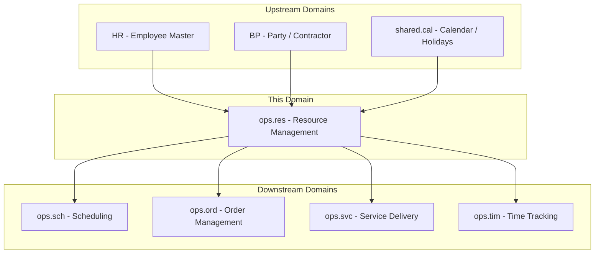
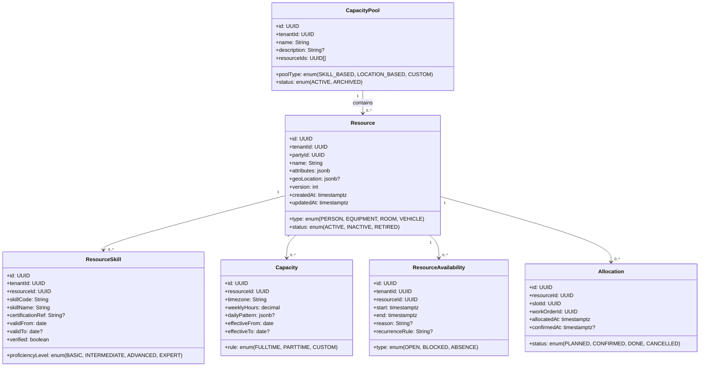
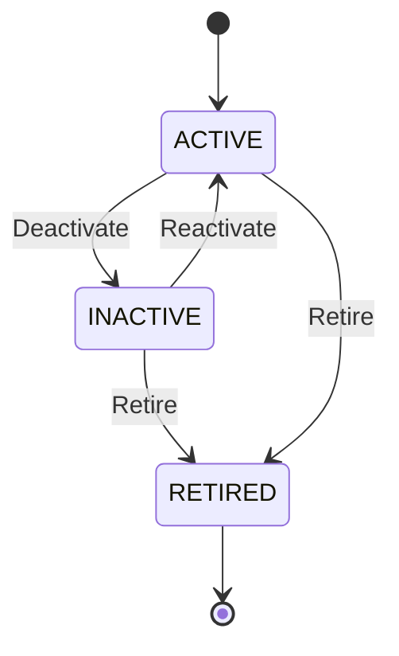
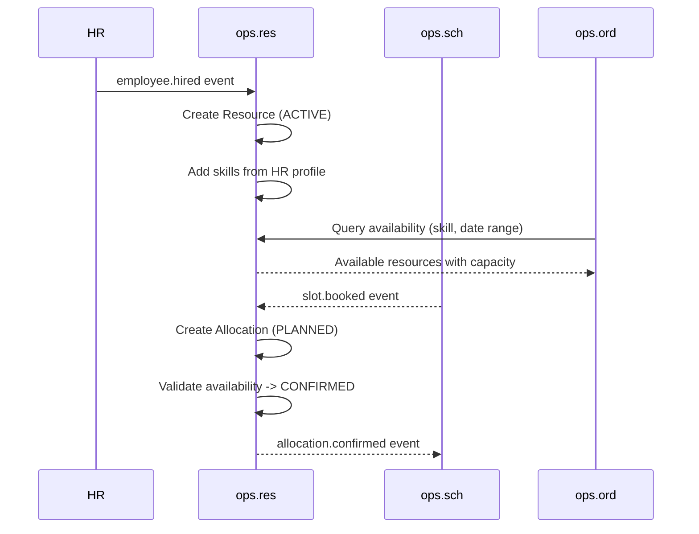
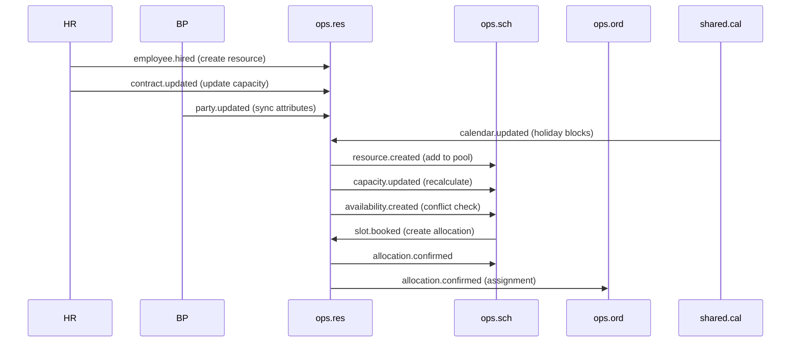
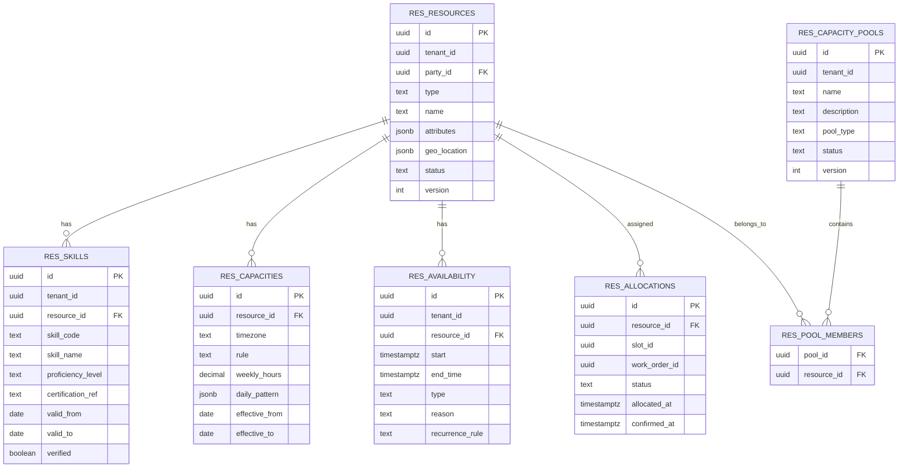

# OPS.RES - Resource Management Domain / Service Specification

> **Conceptual Stack Layer:** Domain / Service
> **Space:** Platform
> **Owner:** Domain Engineering Team
> **Schema alignment:** `service-layer.schema.json`
> **Companion files:** `openapi.yaml`, `*.schema.json` (event contracts)
> **Referenced by:** Platform-Feature Spec SS5 (backend dependencies), BFF Contract
> **Belongs to:** OPS Suite Spec (`_ops_suite.md`)

> **Meta Information**
> - **Version:** 2026-04-03
> - **Template:** `domain-service-spec.md` v1.0.0
> - **Template Compliance:** ~95%
> - **Author(s):** OpenLeap Architecture Team
> - **Status:** DRAFT
> - **Suite:** `ops`
> - **Domain:** `res`
> - **Bounded Context Ref:** `bc:resource-management`
> - **Service ID:** `ops-res-svc`
> - **basePackage:** `io.openleap.ops.res`
> - **API Base Path:** `/api/ops/res/v1`
> - **OpenLeap Starter Version:** `v1`
> - **Port:** OPEN QUESTION
> - **Repository:** OPEN QUESTION
> - **Tags:** `ops`, `resource-management`, `capacity`, `availability`, `allocation`, `skills`
> - **Team:**
>   - Name: `team-ops`
>   - Email: `ops-team@openleap.io`
>   - Slack: `#ops-team`

---

## Specification Guidelines Compliance

>
> ### Non-Negotiables
> - Never invent facts. If required info is missing, add an **OPEN QUESTION** entry.
> - Preserve intent and decisions. Only change meaning when explicitly requested.
> - Do not remove normative constraints unless they are explicitly replaced.
> - Keep the spec **self-contained**: no "see chat", no implicit context.
>
> ### Source of Truth Priority
> When sources conflict:
> 1. Spec (explicit) wins
> 2. Starter specs (implementation constraints) next
> 3. Guidelines (best practices) last
>
> ### Style Guide
> - Prefer short sentences and lists.
> - Use MUST/SHOULD/MAY for normative statements.
> - Keep terminology consistent (Aggregate, Domain Service, Application Service, Command, Event).
> - Avoid ambiguous words ("often", "maybe") unless explicitly noting uncertainty.

---

## 0. Document Purpose & Scope

### 0.1 Purpose
This specification defines the Resource Management domain within the OPS Suite. `ops.res` manages all operational resources — people (employees, contractors, consultants, technicians, teachers), equipment (vehicles, tools), and facilities (rooms, labs) — their attributes, skills, capacity models, and availability. It feeds scheduling (ops.sch), time tracking (ops.tim), and service execution (ops.svc).

### 0.2 Target Audience
- Product Owners & Business Stakeholders
- System Architects & Technical Leads
- Integration Engineers

### 0.3 Scope
**In Scope:**
- Resource registry (internal employees, external consultants, equipment, rooms, vehicles)
- Skills, qualifications, certifications with expiry tracking
- Capacity models (full-time, part-time, custom working hours)
- Availability management (open, blocked, absence periods)
- Resource allocation to work orders via schedule slots
- Capacity pool management (grouped resources for planning)
- Geo-location and service area attributes

**Out of Scope:**
- Timesheets and time entry recording (-> ops.tim)
- HR contracts and payroll (-> HR Suite)
- Schedule slot management (-> ops.sch)
- Equipment maintenance scheduling (future extension)
- Work order lifecycle (-> ops.ord)

### 0.4 Related Documents
- `_ops_suite.md` - OPS Suite overview
- `ops_sch-spec.md` - Scheduling domain
- `ops_svc-spec.md` - Service Delivery domain
- `ops_ord-spec.md` - Order Management domain
- `ops_tim-spec.md` - Time Tracking domain
- `BP_business_partner.md` - Business Partner
- `HR_core.md` - Human Resources Core
- `CAP_calendar_planning.md` - Calendar & Planning

---

## 1. Business Context

### 1.1 Domain Purpose
`ops.res` answers the fundamental operational question: **"Who or what is available to do this work?"** It maintains the master record of all resources, tracks their capacity and availability in real time, and supports intelligent resource allocation decisions. Every scheduling decision, every work order assignment, and every capacity planning exercise depends on the data managed by this domain.

### 1.2 Business Value
- Central registry of all operational resources across types (people, equipment, facilities)
- Real-time availability queries enabling conflict-free scheduling
- Skill-based matching for optimal resource-to-work assignment
- Capacity planning and utilization tracking across pools
- Integration with HR for employee lifecycle events (hire, transfer, terminate)
- Certification and qualification tracking with expiry alerting

### 1.3 Key Stakeholders

| Role | Responsibility | Primary Use Cases |
|------|----------------|-------------------|
| Operations Manager | Oversee resource pool and utilization | UC-RES-001, UC-RES-004, UC-RES-007 |
| Dispatcher / Planner | Query availability, allocate resources | UC-RES-005, UC-RES-006 |
| HR Manager | Maintain employee resource records | UC-RES-001 (via events) |
| Service Provider | View own availability and allocations | UC-RES-005 |
| Facility Manager | Manage room and equipment availability | UC-RES-002, UC-RES-003 |
| Capacity Planner | Manage capacity pools and forecasting | UC-RES-007 |

### 1.4 Strategic Positioning



### 1.5 Service Context

| Field | Value |
|-------|-------|
| Suite | `ops` (Operational Services) |
| Domain | `res` (Resource Management) |
| Bounded Context | `bc:resource-management` |
| Service ID | `ops-res-svc` |
| Base Package | `io.openleap.ops.res` |
| Authoritative Sources | OPS Suite Spec (`_ops_suite.md`), Resource Management best practices (SAP PM / Oracle Field Service) |

---

## 2. Service Identity

| Field | Value |
|-------|-------|
| **Service ID** | `ops-res-svc` |
| **Display Name** | Resource Management Service |
| **Suite** | `ops` |
| **Domain** | `res` |
| **Bounded Context Ref** | `bc:resource-management` |
| **Version** | 2026-04-03 |
| **Status** | DRAFT |
| **API Base Path** | `/api/ops/res/v1` |
| **Repository** | OPEN QUESTION |
| **Tags** | `ops`, `resource-management`, `capacity`, `availability`, `allocation`, `skills` |
| **Team Name** | `team-ops` |
| **Team Email** | `ops-team@openleap.io` |
| **Team Slack** | `#ops-team` |

---

## 3. Domain Model

### 3.1 Conceptual Overview

The domain centers on four aggregates. The **Resource** aggregate represents a person, equipment item, or facility. Resources have **ResourceSkill** records tracking qualifications and certifications with expiry dates. **ResourceAvailability** defines weekly/daily patterns and exceptions (open, blocked, absence). **CapacityPool** groups resources for planning purposes (e.g., "Field Technicians Berlin", "Senior Consultants"). Allocations link resources to work orders via schedule slots.



### 3.2 Core Concepts

| Concept | Owner | Description | Glossary Ref |
|---------|-------|-------------|--------------|
| Resource | ops-res-svc | Person, equipment, or facility that can perform work or be reserved | Resource |
| ResourceSkill | ops-res-svc | Qualification, certification, or competency of a resource with optional expiry | Skill |
| ResourceAvailability | ops-res-svc | Time window when a resource is open, blocked, or absent | Availability |
| Capacity | ops-res-svc | Time-based availability model defining working hours per period | Capacity |
| Allocation | ops-res-svc | Assignment of a resource to a work order via a schedule slot | Allocation |
| CapacityPool | ops-res-svc | Logical grouping of resources for capacity planning and dispatch | Pool |

### 3.3 Aggregate Definitions

#### 3.3.1 Aggregate: Resource

**Aggregate ID:** `agg:resource`
**Business Purpose:** Any entity that can perform work or be reserved: person, equipment, or facility. The Resource is the central aggregate holding identity, type, and lifecycle state.

**Aggregate Root Attributes:**

| Attribute | Type | Format | Required | Description | Example | Constraints |
|-----------|------|--------|----------|-------------|---------|-------------|
| id | UUID | uuid | Yes | Unique identifier | `a1b2c3d4-...` | Immutable after create, `OlUuid.create()` |
| tenantId | UUID | uuid | Yes | Tenant ownership | `t1-uuid` | Immutable, RLS-enforced |
| partyId | UUID | uuid | Yes | Link to BP party | `party-uuid` | FK logical to bp.party, must be active |
| type | Enum | — | Yes | Resource type | `PERSON` | PERSON, EQUIPMENT, ROOM, VEHICLE |
| name | String | — | Yes | Display name | `"Maria Schmidt"` | Max 200 chars |
| attributes | JSONB | — | No | Custom attributes (certifications, tags) | `{"region":"Berlin"}` | Schema-validated per tenant config |
| geoLocation | JSONB | — | No | Base location / service area | `{"lat":52.52,"lng":13.40,"radius":50}` | GeoJSON or lat/lng/radius |
| status | Enum | — | Yes | Lifecycle state | `ACTIVE` | ACTIVE, INACTIVE, RETIRED |
| version | Integer | — | Yes | Optimistic locking version | `1` | Auto-incremented |
| createdAt | Timestamptz | ISO 8601 | Yes | Creation timestamp | `2026-03-15T08:00:00Z` | System-managed |
| updatedAt | Timestamptz | ISO 8601 | Yes | Last update timestamp | `2026-03-15T10:00:00Z` | System-managed |

**Lifecycle States:**



**State Transitions:**

| From | To | Trigger | Guard / Precondition | Side Effects |
|------|----|---------|---------------------|--------------|
| — | ACTIVE | Create | Valid party (BR-001), unique (tenant, party) (BR-002) | Emits `resource.created` |
| ACTIVE | INACTIVE | Deactivate | No future CONFIRMED allocations (BR-006) | Emits `resource.inactivated` |
| INACTIVE | ACTIVE | Reactivate | Party still active in BP | Emits `resource.updated` |
| ACTIVE | RETIRED | Retire | No future CONFIRMED allocations (BR-006) | Emits `resource.retired`, cascade-cancels PLANNED allocations |
| INACTIVE | RETIRED | Retire | — | Emits `resource.retired` |

**Invariants:**
- INV-R-001: `(tenantId, partyId)` MUST be unique (BR-002)
- INV-R-002: Only ACTIVE resources MAY receive new allocations (BR-003)
- INV-R-003: Cannot deactivate or retire with future CONFIRMED allocations (BR-006)
- INV-R-004: `partyId` MUST reference an active party in BP at creation time (BR-001)

**Domain Events Emitted:**

| Event | Routing Key | When | Key Payload |
|-------|-------------|------|-------------|
| ResourceCreated | `ops.res.resource.created` | Resource created | resourceId, tenantId, type, name, partyId |
| ResourceUpdated | `ops.res.resource.updated` | Resource attributes changed | resourceId, changedFields |
| ResourceInactivated | `ops.res.resource.inactivated` | ACTIVE -> INACTIVE | resourceId, tenantId |
| ResourceRetired | `ops.res.resource.retired` | -> RETIRED | resourceId, tenantId |

#### 3.3.2 Aggregate: ResourceSkill

**Aggregate ID:** `agg:resource-skill`
**Business Purpose:** Tracks qualifications, certifications, and competencies for a resource. Supports skill-based matching for resource-to-work assignment. Certifications have expiry dates enabling compliance tracking.

**Aggregate Root Attributes:**

| Attribute | Type | Format | Required | Description | Example | Constraints |
|-----------|------|--------|----------|-------------|---------|-------------|
| id | UUID | uuid | Yes | Unique identifier | `skill-uuid` | Immutable, `OlUuid.create()` |
| tenantId | UUID | uuid | Yes | Tenant ownership | `t1-uuid` | Immutable, RLS |
| resourceId | UUID | uuid | Yes | Owning resource | `res-uuid` | FK to Resource, must be ACTIVE |
| skillCode | String | — | Yes | Skill catalog code | `ELEC-HV` | From ref-data skill catalog |
| skillName | String | — | Yes | Human-readable name | `"High Voltage Electrician"` | Max 200 chars |
| proficiencyLevel | Enum | — | Yes | Competency level | `ADVANCED` | BASIC, INTERMEDIATE, ADVANCED, EXPERT |
| certificationRef | String | — | No | External certification ID | `"CERT-2026-0042"` | Max 100 chars |
| validFrom | Date | ISO 8601 | Yes | Validity start | `2025-01-15` | — |
| validTo | Date | ISO 8601 | No | Validity end (expiry) | `2027-01-14` | >= validFrom if set |
| verified | Boolean | — | Yes | Verified by manager | `true` | Default false |

**Invariants:**
- INV-SK-001: `(resourceId, skillCode)` MUST be unique — no duplicate skills per resource
- INV-SK-002: `validTo >= validFrom` when validTo is set (BR-008)
- INV-SK-003: Resource MUST be ACTIVE to add skills

**Domain Events Emitted:**

| Event | Routing Key | When | Key Payload |
|-------|-------------|------|-------------|
| SkillAdded | `ops.res.skill.added` | Skill created | resourceId, skillCode, proficiencyLevel |
| SkillUpdated | `ops.res.skill.updated` | Skill modified | resourceId, skillCode, changedFields |
| SkillExpired | `ops.res.skill.expired` | validTo reached | resourceId, skillCode, validTo |
| SkillRemoved | `ops.res.skill.removed` | Skill deleted | resourceId, skillCode |

#### 3.3.3 Aggregate: ResourceAvailability

**Aggregate ID:** `agg:resource-availability`
**Business Purpose:** Defines specific time windows when a resource is open for work, blocked, or absent. Supports weekly recurring patterns and exception periods. Directly consumed by ops.sch for conflict-free scheduling.

**Aggregate Root Attributes:**

| Attribute | Type | Format | Required | Description | Example | Constraints |
|-----------|------|--------|----------|-------------|---------|-------------|
| id | UUID | uuid | Yes | Unique identifier | `avail-uuid` | Immutable, `OlUuid.create()` |
| tenantId | UUID | uuid | Yes | Tenant ownership | `t1-uuid` | Immutable, RLS |
| resourceId | UUID | uuid | Yes | Owning resource | `res-uuid` | FK to Resource |
| start | Timestamptz | ISO 8601 | Yes | Window start | `2026-03-15T08:00:00Z` | — |
| end | Timestamptz | ISO 8601 | Yes | Window end | `2026-03-15T17:00:00Z` | > start (BR-004) |
| type | Enum | — | Yes | Window type | `OPEN` | OPEN, BLOCKED, ABSENCE |
| reason | String | — | No | Explanation | `"Annual leave"` | Max 500 chars |
| recurrenceRule | String | — | No | RFC 5545 RRULE | `"FREQ=WEEKLY;BYDAY=MO,TU,WE,TH,FR"` | Valid RRULE format |

**Invariants:**
- INV-AV-001: `end > start` (BR-004)
- INV-AV-002: ABSENCE windows prevent overlapping CONFIRMED allocations (BR-005)
- INV-AV-003: Only RES_MANAGER or RES_ADMIN can override ABSENCE entries (BR-009)

**Domain Events Emitted:**

| Event | Routing Key | When | Key Payload |
|-------|-------------|------|-------------|
| AvailabilityCreated | `ops.res.availability.created` | Window created | resourceId, start, end, type |
| AvailabilityUpdated | `ops.res.availability.updated` | Window modified | resourceId, start, end, type |
| AvailabilityDeleted | `ops.res.availability.deleted` | Window removed | resourceId, availabilityId |

#### 3.3.4 Aggregate: CapacityPool

**Aggregate ID:** `agg:capacity-pool`
**Business Purpose:** Logical grouping of resources for capacity planning and dispatch. Pools can be skill-based ("All SAP consultants"), location-based ("Berlin technicians"), or custom. Used by dispatchers to query available capacity across a group rather than individual resources.

**Aggregate Root Attributes:**

| Attribute | Type | Format | Required | Description | Example | Constraints |
|-----------|------|--------|----------|-------------|---------|-------------|
| id | UUID | uuid | Yes | Unique identifier | `pool-uuid` | Immutable, `OlUuid.create()` |
| tenantId | UUID | uuid | Yes | Tenant ownership | `t1-uuid` | Immutable, RLS |
| name | String | — | Yes | Pool name | `"Berlin Field Techs"` | Max 200 chars, unique per tenant |
| description | String | — | No | Pool description | `"All field technicians in Berlin region"` | Max 1000 chars |
| resourceIds | UUID[] | uuid[] | Yes | Member resources | `["res-1","res-2"]` | Min 1, all must exist and be ACTIVE |
| poolType | Enum | — | Yes | Grouping strategy | `LOCATION_BASED` | SKILL_BASED, LOCATION_BASED, CUSTOM |
| status | Enum | — | Yes | Pool lifecycle | `ACTIVE` | ACTIVE, ARCHIVED |
| version | Integer | — | Yes | Optimistic locking | `1` | Auto-incremented |
| createdAt | Timestamptz | ISO 8601 | Yes | Creation timestamp | — | System-managed |
| updatedAt | Timestamptz | ISO 8601 | Yes | Last update | — | System-managed |

**Invariants:**
- INV-CP-001: `(tenantId, name)` MUST be unique
- INV-CP-002: All `resourceIds` MUST reference ACTIVE resources
- INV-CP-003: ARCHIVED pools cannot be modified (reactivate first)

**Domain Events Emitted:**

| Event | Routing Key | When | Key Payload |
|-------|-------------|------|-------------|
| CapacityPoolCreated | `ops.res.pool.created` | Pool created | poolId, name, poolType, resourceCount |
| CapacityPoolUpdated | `ops.res.pool.updated` | Pool membership changed | poolId, addedIds, removedIds |
| CapacityPoolArchived | `ops.res.pool.archived` | Pool archived | poolId |

#### 3.3.5 Entity: Capacity (child of Resource)

**Business Purpose:** Defines how much time/effort a resource contributes per period. Supports full-time, part-time, and custom working hour patterns. Effective-dated for tracking changes over time (e.g., switching from full-time to part-time).

| Attribute | Type | Format | Required | Description | Constraints |
|-----------|------|--------|----------|-------------|-------------|
| id | UUID | uuid | Yes | Unique identifier | Immutable, `OlUuid.create()` |
| resourceId | UUID | uuid | Yes | Parent resource | FK to Resource |
| timezone | String | IANA | Yes | Timezone for calculations | Valid IANA timezone (BR-010) |
| rule | Enum | — | Yes | Capacity rule | FULLTIME, PARTTIME, CUSTOM |
| weeklyHours | Decimal | (5,2) | Yes | Hours per week | > 0, <= 168 (BR-011) |
| dailyPattern | JSONB | — | No | Custom daily breakdown | `{"MON":8,"TUE":8,...}` |
| effectiveFrom | Date | ISO 8601 | Yes | Start of validity | — |
| effectiveTo | Date | ISO 8601 | No | End of validity | >= effectiveFrom (BR-012) |

**Invariants:**
- INV-C-001: No overlapping date ranges for the same resource (exclusion constraint) (BR-003)
- INV-C-002: `effectiveTo >= effectiveFrom` (BR-012)
- INV-C-003: All calculations MUST be timezone-aware (BR-010)

#### 3.3.6 Entity: Allocation (child of Resource)

**Business Purpose:** Links a resource to a work order via a schedule slot. Created when ops.sch books a slot. Tracks the lifecycle from planned through confirmed to done or cancelled.

| Attribute | Type | Format | Required | Description | Constraints |
|-----------|------|--------|----------|-------------|-------------|
| id | UUID | uuid | Yes | Unique identifier | Immutable, `OlUuid.create()` |
| resourceId | UUID | uuid | Yes | Allocated resource | FK to Resource |
| slotId | UUID | uuid | Yes | Schedule slot | FK logical to ops.sch |
| workOrderId | UUID | uuid | Yes | Work order | FK logical to ops.ord |
| status | Enum | — | Yes | Allocation state | PLANNED, CONFIRMED, DONE, CANCELLED |
| allocatedAt | Timestamptz | ISO 8601 | Yes | When allocated | System-managed |
| confirmedAt | Timestamptz | ISO 8601 | No | When confirmed | Set on CONFIRMED transition |

**Invariants:**
- INV-AL-001: CONFIRMED requires overlapping OPEN availability (BR-013)
- INV-AL-002: No double booking — enforced via ops.sch exclusion constraints (BR-007)

### 3.4 Enumerations

| Enum | Values | Description |
|------|--------|-------------|
| ResourceType | PERSON, EQUIPMENT, ROOM, VEHICLE | Type of operational resource |
| ResourceStatus | ACTIVE, INACTIVE, RETIRED | Resource lifecycle state |
| ProficiencyLevel | BASIC, INTERMEDIATE, ADVANCED, EXPERT | Skill competency level |
| AvailabilityType | OPEN, BLOCKED, ABSENCE | Time window classification |
| CapacityRule | FULLTIME, PARTTIME, CUSTOM | Working hour model |
| AllocationStatus | PLANNED, CONFIRMED, DONE, CANCELLED | Allocation lifecycle |
| PoolType | SKILL_BASED, LOCATION_BASED, CUSTOM | Capacity pool grouping strategy |
| PoolStatus | ACTIVE, ARCHIVED | Capacity pool lifecycle |

---

## 4. Business Rules & Constraints

### 4.1 Business Rules Catalog

| ID | Rule Name | Description | Scope | Enforcement | Error Code |
|----|-----------|-------------|-------|-------------|------------|
| BR-001 | Party Required | Resource partyId must reference a valid, active party in BP | Resource | Create | `RES-VAL-001` |
| BR-002 | Party Uniqueness | One resource per (tenant, party) | Resource | Create | `RES-VAL-002` |
| BR-003 | No Capacity Overlap | Capacity periods for same resource must not overlap | Capacity | Create/Update | `RES-BIZ-003` |
| BR-004 | Valid Time Range | Availability end > start | Availability | Create | `RES-VAL-004` |
| BR-005 | Absence Blocks Bookings | ABSENCE prevents overlapping CONFIRMED allocations | Availability | Booking | `RES-BIZ-005` |
| BR-006 | Deactivation Guard | Cannot deactivate/retire with future CONFIRMED allocations | Resource | Status change | `RES-BIZ-006` |
| BR-007 | Double Booking Prevention | No overlapping CONFIRMED allocations for same resource | Allocation | Confirm | `RES-BIZ-007` |
| BR-008 | Skill Validity | validTo >= validFrom when expiry is set | ResourceSkill | Create/Update | `RES-VAL-008` |
| BR-009 | Manager Override | Only RES_MANAGER or RES_ADMIN can override ABSENCE entries | Availability | Override | `RES-BIZ-009` |
| BR-010 | Timezone Required | All capacity calculations must be timezone-aware | Capacity | Create | `RES-VAL-010` |
| BR-011 | Weekly Hours Range | weeklyHours must be > 0 and <= 168 | Capacity | Create/Update | `RES-VAL-011` |
| BR-012 | Effective Range | effectiveTo >= effectiveFrom | Capacity | Create/Update | `RES-VAL-012` |
| BR-013 | Confirmed Needs Availability | Allocation CONFIRMED requires overlapping OPEN availability | Allocation | Confirm | `RES-BIZ-013` |

### 4.2 Detailed Rule Definitions

#### BR-005: Absence Blocks Bookings
**Context:** When a resource reports an absence (vacation, sick leave), no scheduling system should be able to confirm allocations during that period.
**Rule Statement:** If an ABSENCE availability window exists for a resource in a given time range, no allocation in that range may transition to CONFIRMED.
**Applies To:** ResourceAvailability aggregate, Allocation confirm transition
**Enforcement:** Domain service checks for overlapping ABSENCE windows before confirming allocation.
**Validation Logic:** `if (hasOverlappingAbsence(resourceId, slotStart, slotEnd)) throw AbsenceBlocksAllocationException`
**Error Handling:**
- Code: `RES-BIZ-005`
- Message: `"Resource {id} has an absence recorded for the requested period. Cannot confirm allocation."`
- HTTP: 409 Conflict

#### BR-006: Deactivation Guard
**Context:** Deactivating or retiring a resource that has future confirmed allocations would leave scheduling in an inconsistent state.
**Rule Statement:** A resource MUST NOT be deactivated or retired if it has any allocation in CONFIRMED status with a future slot date.
**Applies To:** Resource aggregate, status transitions
**Enforcement:** Application service queries allocations before status change.
**Validation Logic:** `if (hasFutureConfirmedAllocations(resourceId)) throw ResourceHasActiveAllocationsException`
**Error Handling:**
- Code: `RES-BIZ-006`
- Message: `"Resource {id} has future confirmed allocations. Cancel or reassign before deactivation."`
- HTTP: 409 Conflict

#### BR-007: Double Booking Prevention
**Context:** A single resource cannot be in two places at once. The scheduling domain enforces slot-level exclusion, but ops.res provides the final guard.
**Rule Statement:** No two CONFIRMED allocations for the same resource may have overlapping time slots.
**Applies To:** Allocation entity, confirm transition
**Enforcement:** Database exclusion constraint + domain service validation.
**Error Handling:**
- Code: `RES-BIZ-007`
- Message: `"Resource {id} already has a confirmed allocation for the requested time slot."`
- HTTP: 409 Conflict

### 4.3 Data Validation Rules

| Field | Validation Rule | Error Code | Error Message |
|-------|----------------|------------|---------------|
| partyId | Required, valid UUID, active in BP | `RES-VAL-001` | `"Valid active party ID is required"` |
| type | Required, valid enum (PERSON, EQUIPMENT, ROOM, VEHICLE) | `RES-VAL-013` | `"Invalid resource type"` |
| name | Required, max 200 chars | `RES-VAL-014` | `"Resource name is required (max 200 characters)"` |
| weeklyHours | > 0, <= 168 | `RES-VAL-011` | `"Weekly hours must be between 0 and 168"` |
| timezone | Valid IANA timezone | `RES-VAL-010` | `"Invalid IANA timezone identifier"` |
| skillCode | Required, from skill catalog | `RES-VAL-015` | `"Valid skill code from catalog required"` |
| proficiencyLevel | Valid enum value | `RES-VAL-016` | `"Valid proficiency level required (BASIC, INTERMEDIATE, ADVANCED, EXPERT)"` |
| start/end | end > start | `RES-VAL-004` | `"End time must be after start time"` |

### 4.4 Reference Data Dependencies

| Catalog | Usage | Provider Service | Validation |
|---------|-------|-----------------|------------|
| Business Partners | `partyId` field | bp-party-svc (T2) | Active status check |
| Skill Catalog | `skillCode` field | ref-data-svc (T1) | Code existence check |
| IANA Timezones | `timezone` field | JVM built-in | Valid identifier check |
| Calendar / Holidays | Holiday blocks | shared.cal (T2) | Calendar rules sync |

---

## 5. Use Cases

### 5.1 Business Logic Placement

| Layer | Responsibilities |
|-------|-----------------|
| Application Service | Command validation, aggregate loading, event publishing, orchestration (HR sync, capacity recalculation) |
| Domain Service | Availability query (cross-aggregate: capacity + availability + allocations), skill matching, pool capacity aggregation |
| Aggregate | State transitions, invariant enforcement, attribute validation |

### 5.2 Use Cases

#### UC-RES-001: Register Resource

| Field | Value |
|-------|-------|
| **ID** | UC-RES-001 |
| **Type** | WRITE |
| **Trigger** | REST or Event (hr.employee.hired) |
| **Aggregate** | Resource |
| **Domain Operation** | `Resource.create()` |
| **Inputs** | partyId, type, name, attributes?, geoLocation? |
| **Outputs** | Created Resource in ACTIVE state |
| **Events** | `ResourceCreated` -> `ops.res.resource.created` |
| **REST** | `POST /api/ops/res/v1/resources` -> 201 Created |
| **Idempotency** | `Idempotency-Key` header; also idempotent on (tenantId, partyId) uniqueness |
| **Errors** | 400 (validation), 409 (BR-002 duplicate partyId), 422 (BR-001 invalid party) |

#### UC-RES-002: Update Resource

| Field | Value |
|-------|-------|
| **ID** | UC-RES-002 |
| **Type** | WRITE |
| **Trigger** | REST |
| **Aggregate** | Resource |
| **Domain Operation** | `Resource.update()` |
| **Inputs** | resourceId, name?, attributes?, geoLocation? |
| **Outputs** | Updated Resource |
| **Events** | `ResourceUpdated` -> `ops.res.resource.updated` |
| **REST** | `PATCH /api/ops/res/v1/resources/{id}` -> 200 OK |
| **Idempotency** | Optimistic locking via `If-Match` header |
| **Errors** | 400 (validation), 404 (not found), 412 (version mismatch) |

#### UC-RES-003: Define Capacity Model

| Field | Value |
|-------|-------|
| **ID** | UC-RES-003 |
| **Type** | WRITE |
| **Trigger** | REST |
| **Aggregate** | Capacity (child of Resource) |
| **Domain Operation** | `Capacity.create()` |
| **Inputs** | resourceId, timezone, rule, weeklyHours, dailyPattern?, effectiveFrom, effectiveTo? |
| **Outputs** | Created Capacity record |
| **Events** | `CapacityUpdated` -> `ops.res.capacity.updated` |
| **REST** | `POST /api/ops/res/v1/resources/{id}/capacities` -> 201 Created |
| **Idempotency** | `Idempotency-Key` header |
| **Errors** | 400 (validation), 404 (resource not found), 409 (BR-003 overlap), 422 (BR-010, BR-011, BR-012) |

#### UC-RES-004: Manage Skills

| Field | Value |
|-------|-------|
| **ID** | UC-RES-004 |
| **Type** | WRITE |
| **Trigger** | REST |
| **Aggregate** | ResourceSkill |
| **Domain Operation** | `ResourceSkill.add()` / `ResourceSkill.update()` / `ResourceSkill.remove()` |
| **Inputs** | resourceId, skillCode, skillName, proficiencyLevel, certificationRef?, validFrom, validTo?, verified? |
| **Outputs** | Created/updated/removed ResourceSkill |
| **Events** | `SkillAdded` / `SkillUpdated` / `SkillRemoved` |
| **REST** | `POST /api/ops/res/v1/resources/{id}/skills` -> 201, `PATCH .../skills/{skillId}` -> 200, `DELETE .../skills/{skillId}` -> 204 |
| **Idempotency** | Unique constraint on (resourceId, skillCode) |
| **Errors** | 400 (validation), 404 (resource/skill not found), 409 (duplicate skillCode), 422 (BR-008) |

#### UC-RES-005: Query Availability

| Field | Value |
|-------|-------|
| **ID** | UC-RES-005 |
| **Type** | READ |
| **Trigger** | REST |
| **Aggregate** | Resource + Capacity + ResourceAvailability + Allocation (cross-aggregate query) |
| **Domain Operation** | `AvailabilityQueryService.findAvailable()` |
| **Inputs** | from, to, type?, skill?, minHours?, geoLat?, geoLng?, geoRadius?, poolId?, page, size |
| **Outputs** | Paginated list of available resources with remaining capacity |
| **Events** | — |
| **REST** | `GET /api/ops/res/v1/resources/availability?...` -> 200 OK |
| **Idempotency** | Inherently idempotent (GET) |
| **Errors** | 400 (invalid filter params) |

#### UC-RES-006: Allocate Resource

| Field | Value |
|-------|-------|
| **ID** | UC-RES-006 |
| **Type** | WRITE |
| **Trigger** | Event (ops.sch.slot.booked) or REST |
| **Aggregate** | Allocation (child of Resource) |
| **Domain Operation** | `Allocation.create()` -> `Allocation.confirm()` |
| **Inputs** | resourceId, slotId, workOrderId |
| **Outputs** | Allocation in PLANNED then CONFIRMED state |
| **Events** | `AllocationConfirmed` -> `ops.res.allocation.confirmed` |
| **REST** | `POST /api/ops/res/v1/allocations` -> 201, `POST /api/ops/res/v1/allocations/{id}:confirm` -> 200 |
| **Idempotency** | Unique constraint on (resourceId, slotId) |
| **Errors** | 404 (resource/slot not found), 409 (BR-005 absence, BR-007 double booking, BR-013 no availability), 422 (BR-003 resource not ACTIVE) |

#### UC-RES-007: Manage Capacity Pool

| Field | Value |
|-------|-------|
| **ID** | UC-RES-007 |
| **Type** | WRITE |
| **Trigger** | REST |
| **Aggregate** | CapacityPool |
| **Domain Operation** | `CapacityPool.create()` / `CapacityPool.updateMembers()` / `CapacityPool.archive()` |
| **Inputs** | name, description?, resourceIds, poolType |
| **Outputs** | Created/updated CapacityPool |
| **Events** | `CapacityPoolCreated` / `CapacityPoolUpdated` / `CapacityPoolArchived` |
| **REST** | `POST /api/ops/res/v1/pools` -> 201, `PATCH .../pools/{id}` -> 200, `POST .../pools/{id}:archive` -> 200 |
| **Idempotency** | `Idempotency-Key` header |
| **Errors** | 400 (validation), 404 (pool not found), 409 (duplicate name), 422 (inactive resources in list) |

#### UC-RES-008: Manage Availability Windows

| Field | Value |
|-------|-------|
| **ID** | UC-RES-008 |
| **Type** | WRITE |
| **Trigger** | REST |
| **Aggregate** | ResourceAvailability |
| **Domain Operation** | `ResourceAvailability.create()` / `ResourceAvailability.update()` / `ResourceAvailability.delete()` |
| **Inputs** | resourceId, start, end, type, reason?, recurrenceRule? |
| **Outputs** | Created/updated/deleted availability window |
| **Events** | `AvailabilityCreated` / `AvailabilityUpdated` / `AvailabilityDeleted` |
| **REST** | `POST /api/ops/res/v1/resources/{id}/availability` -> 201, `PATCH .../availability/{avId}` -> 200, `DELETE .../availability/{avId}` -> 204 |
| **Idempotency** | `Idempotency-Key` header |
| **Errors** | 400 (validation, BR-004), 403 (BR-009 absence override requires manager), 404 |

#### UC-RES-009: List / Search Resources (READ)

| Field | Value |
|-------|-------|
| **ID** | UC-RES-009 |
| **Type** | READ |
| **Trigger** | REST |
| **Aggregate** | Resource |
| **Domain Operation** | Query projection |
| **Inputs** | type?, status?, skill?, q? (text search), geoLat?, geoLng?, geoRadius?, page, size |
| **Outputs** | Paginated resource list |
| **Events** | — |
| **REST** | `GET /api/ops/res/v1/resources?...` -> 200 OK |
| **Idempotency** | Inherently idempotent (GET) |
| **Errors** | 400 (invalid filter params) |

### 5.3 Process Flow Diagrams



### 5.4 Cross-Domain Workflows

**Does this domain participate in multi-service workflows?** Yes

#### Workflow: Resource Scheduling (SAG-OPS-002)
**Orchestration Pattern:** Choreography (EDA)
**Pattern Rationale:** Sequential flow where ops.ord queries availability, ops.sch books slots, and ops.res confirms allocations. Each step is independently processable with eventual consistency. No distributed transaction needed — allocation confirmation is idempotent.

---

## 6. REST API

### 6.1 API Overview

| Field | Value |
|-------|-------|
| Base Path | `/api/ops/res/v1` |
| Authentication | OAuth2/JWT (Bearer token) |
| Authorization | Scopes: `ops.res:read`, `ops.res:write`, `ops.res:allocate`, `ops.res:admin` |
| Content Type | `application/json` |
| Versioning | URL path (`v1`) |

### 6.2 Resource Operations

#### Resource CRUD

| Endpoint | Method | Path | Summary | Role Required | Events Published |
|----------|--------|------|---------|---------------|-----------------|
| Create Resource | POST | `/resources` | Register new resource | `ops.res:write` | `ResourceCreated` |
| Get Resource | GET | `/resources/{id}` | Retrieve resource by ID | `ops.res:read` | — |
| List Resources | GET | `/resources` | Search/filter resources | `ops.res:read` | — |
| Update Resource | PATCH | `/resources/{id}` | Update resource attributes | `ops.res:write` | `ResourceUpdated` |

**Create Resource — Request:**
```json
{
  "partyId": "party-uuid",
  "type": "PERSON",
  "name": "Maria Schmidt",
  "attributes": { "region": "Berlin", "department": "Field Services" },
  "geoLocation": { "lat": 52.52, "lng": 13.40, "radius": 50 }
}
```

**Create Resource — Response (201 Created):**
```json
{
  "id": "res-uuid",
  "status": "ACTIVE",
  "version": 1,
  "createdAt": "2026-03-15T08:00:00Z"
}
```

**Update Resource — Headers:** `If-Match: "{version}"` (optimistic locking, 412 on conflict)

#### Capacity Management

| Endpoint | Method | Path | Summary | Role Required | Events Published |
|----------|--------|------|---------|---------------|-----------------|
| Add Capacity | POST | `/resources/{id}/capacities` | Define capacity model | `ops.res:write` | `CapacityUpdated` |
| Get Capacities | GET | `/resources/{id}/capacities` | List capacity models | `ops.res:read` | — |
| Update Capacity | PATCH | `/capacities/{id}` | Modify capacity | `ops.res:write` | `CapacityUpdated` |

#### Skill Management

| Endpoint | Method | Path | Summary | Role Required | Events Published |
|----------|--------|------|---------|---------------|-----------------|
| Add Skill | POST | `/resources/{id}/skills` | Add skill to resource | `ops.res:write` | `SkillAdded` |
| List Skills | GET | `/resources/{id}/skills` | List resource skills | `ops.res:read` | — |
| Update Skill | PATCH | `/skills/{id}` | Modify skill | `ops.res:write` | `SkillUpdated` |
| Remove Skill | DELETE | `/skills/{id}` | Remove skill | `ops.res:write` | `SkillRemoved` |

#### Availability Management

| Endpoint | Method | Path | Summary | Role Required | Events Published |
|----------|--------|------|---------|---------------|-----------------|
| Create Availability | POST | `/resources/{id}/availability` | Add availability window | `ops.res:write` | `AvailabilityCreated` |
| Get Availability | GET | `/resources/{id}/availability` | List windows for date range | `ops.res:read` | — |
| Update Availability | PATCH | `/availability/{id}` | Modify window | `ops.res:write` | `AvailabilityUpdated` |
| Delete Availability | DELETE | `/availability/{id}` | Remove window | `ops.res:write` | `AvailabilityDeleted` |

### 6.3 Business Operations

| Endpoint | Method | Path | Summary | Role Required | Events Published |
|----------|--------|------|---------|---------------|-----------------|
| Query Availability | GET | `/resources/availability` | Cross-resource availability search | `ops.res:read` | — |
| Create Allocation | POST | `/allocations` | Allocate resource to slot | `ops.res:allocate` | — |
| Confirm Allocation | POST | `/allocations/{id}:confirm` | Confirm allocation | `ops.res:allocate` | `AllocationConfirmed` |
| Cancel Allocation | POST | `/allocations/{id}:cancel` | Cancel allocation | `ops.res:allocate` | `AllocationCancelled` |
| List Allocations | GET | `/allocations` | Query allocations | `ops.res:read` | — |
| Deactivate Resource | POST | `/resources/{id}:deactivate` | Deactivate resource | `ops.res:admin` | `ResourceInactivated` |
| Reactivate Resource | POST | `/resources/{id}:reactivate` | Reactivate resource | `ops.res:admin` | `ResourceUpdated` |
| Retire Resource | POST | `/resources/{id}:retire` | Retire resource | `ops.res:admin` | `ResourceRetired` |

#### Capacity Pool Management

| Endpoint | Method | Path | Summary | Role Required | Events Published |
|----------|--------|------|---------|---------------|-----------------|
| Create Pool | POST | `/pools` | Create capacity pool | `ops.res:admin` | `CapacityPoolCreated` |
| Get Pool | GET | `/pools/{id}` | Retrieve pool | `ops.res:read` | — |
| List Pools | GET | `/pools` | List pools | `ops.res:read` | — |
| Update Pool | PATCH | `/pools/{id}` | Update pool membership | `ops.res:admin` | `CapacityPoolUpdated` |
| Archive Pool | POST | `/pools/{id}:archive` | Archive pool | `ops.res:admin` | `CapacityPoolArchived` |

### 6.4 Error Responses

| HTTP Status | Error Code | Description |
|-------------|------------|-------------|
| 400 | `RES-VAL-*` | Validation error (field-level) |
| 401 | — | Authentication required |
| 403 | `RES-BIZ-009` | Forbidden (insufficient role for absence override) |
| 404 | — | Resource not found |
| 409 | `RES-BIZ-*` | Conflict (duplicate, active allocations, absence block, double booking) |
| 412 | — | Precondition failed (optimistic lock version mismatch) |
| 422 | `RES-BIZ-*` | Business rule violation |

### 6.5 OpenAPI Specification
**Location:** `contracts/http/ops/res/openapi.yaml`
**OpenAPI Version:** 3.1.0

---

## 7. Events & Integration

### 7.1 Event-Driven Architecture Pattern
**Pattern Decision:** Choreography (EDA)
**Rationale:** Resource management publishes state changes for downstream consumers (scheduling, orders, service delivery). No distributed transaction coordination needed. At-least-once delivery with idempotent consumers. Outbox pattern per ADR-013.

### 7.2 Published Events

**Exchange:** `ops.res.events` (topic)

#### ResourceCreated
- **Routing Key:** `ops.res.resource.created`
- **Business Meaning:** A new resource has been registered and is available for scheduling
- **When Published:** Resource created in ACTIVE state
- **Payload Schema:**
```json
{
  "resourceId": "uuid",
  "tenantId": "uuid",
  "partyId": "uuid",
  "type": "PERSON",
  "name": "Maria Schmidt",
  "status": "ACTIVE"
}
```
- **Consumers:** ops.sch (scheduling pool), ops.svc (provider cache)

#### ResourceUpdated
- **Routing Key:** `ops.res.resource.updated`
- **Business Meaning:** Resource attributes (name, geo, custom) have changed
- **When Published:** Resource attributes modified
- **Payload Schema:** `{ "resourceId": "uuid", "tenantId": "uuid", "changedFields": ["name","geoLocation"] }`
- **Consumers:** ops.sch (scheduling cache), ops.svc (provider cache)

#### ResourceInactivated
- **Routing Key:** `ops.res.resource.inactivated`
- **Business Meaning:** A resource is temporarily unavailable for new allocations
- **When Published:** ACTIVE -> INACTIVE transition
- **Payload Schema:** `{ "resourceId": "uuid", "tenantId": "uuid" }`
- **Consumers:** ops.sch (remove from scheduling pool)

#### ResourceRetired
- **Routing Key:** `ops.res.resource.retired`
- **Business Meaning:** A resource is permanently retired from operations
- **When Published:** -> RETIRED transition
- **Payload Schema:** `{ "resourceId": "uuid", "tenantId": "uuid" }`
- **Consumers:** ops.sch (remove permanently), ops.ord (capacity recalculation)

#### CapacityUpdated
- **Routing Key:** `ops.res.capacity.updated`
- **Business Meaning:** Working hours or capacity model changed for a resource
- **When Published:** Capacity created, modified, or deleted
- **Payload Schema:**
```json
{
  "resourceId": "uuid",
  "tenantId": "uuid",
  "rule": "FULLTIME",
  "weeklyHours": 40.00,
  "effectiveFrom": "2026-04-01",
  "effectiveTo": null
}
```
- **Consumers:** ops.sch (capacity recalculation)

#### AvailabilityCreated / AvailabilityUpdated
- **Routing Key:** `ops.res.availability.created` / `ops.res.availability.updated`
- **Business Meaning:** An availability window has been created or modified
- **When Published:** Availability window created or updated
- **Payload Schema:** `{ "resourceId": "uuid", "tenantId": "uuid", "start": "timestamptz", "end": "timestamptz", "type": "OPEN|BLOCKED|ABSENCE" }`
- **Consumers:** ops.sch (schedule conflict check)

#### AvailabilityDeleted
- **Routing Key:** `ops.res.availability.deleted`
- **Business Meaning:** An availability window has been removed
- **When Published:** Availability window deleted
- **Payload Schema:** `{ "resourceId": "uuid", "tenantId": "uuid", "availabilityId": "uuid" }`
- **Consumers:** ops.sch (schedule recalculation)

#### AllocationConfirmed
- **Routing Key:** `ops.res.allocation.confirmed`
- **Business Meaning:** A resource has been confirmed for a work order slot
- **When Published:** Allocation transitions to CONFIRMED
- **Payload Schema:**
```json
{
  "allocationId": "uuid",
  "resourceId": "uuid",
  "tenantId": "uuid",
  "slotId": "uuid",
  "workOrderId": "uuid"
}
```
- **Consumers:** ops.sch (slot confirmation), ops.ord (assignment tracking)

#### AllocationCancelled
- **Routing Key:** `ops.res.allocation.cancelled`
- **Business Meaning:** A resource allocation has been cancelled — slot is free
- **When Published:** Allocation transitions to CANCELLED
- **Payload Schema:** `{ "allocationId": "uuid", "resourceId": "uuid", "tenantId": "uuid", "slotId": "uuid", "workOrderId": "uuid" }`
- **Consumers:** ops.sch (free slot), ops.ord (reassignment needed)

#### SkillAdded / SkillUpdated / SkillExpired / SkillRemoved
- **Routing Key:** `ops.res.skill.added` / `ops.res.skill.updated` / `ops.res.skill.expired` / `ops.res.skill.removed`
- **Business Meaning:** Resource qualification profile has changed
- **When Published:** Skill lifecycle events
- **Payload Schema:** `{ "resourceId": "uuid", "tenantId": "uuid", "skillCode": "string", "proficiencyLevel": "string" }`
- **Consumers:** ops.sch (skill-based matching cache)

#### CapacityPoolCreated / CapacityPoolUpdated / CapacityPoolArchived
- **Routing Key:** `ops.res.pool.created` / `ops.res.pool.updated` / `ops.res.pool.archived`
- **Business Meaning:** Capacity pool membership changed
- **When Published:** Pool lifecycle events
- **Payload Schema:** `{ "poolId": "uuid", "tenantId": "uuid", "name": "string", "resourceCount": 0 }`
- **Consumers:** ops.sch (pool-based scheduling)

### 7.3 Consumed Events

| Source Event | Source Service | Handler | Purpose | Queue |
|-------------|---------------|---------|---------|-------|
| `bp.party.updated` | bp-party-svc (T2) | PartyUpdatedHandler | Update resource name/attributes when party data changes | `ops.res.in.bp.party` |
| `hr.employee.hired` | hr-svc (T3) | EmployeeHiredHandler | Auto-create resource from HR employee record | `ops.res.in.hr.employee` |
| `hr.contract.updated` | hr-svc (T3) | ContractUpdatedHandler | Update capacity model (FT/PT change, hours change) | `ops.res.in.hr.contract` |
| `hr.employee.terminated` | hr-svc (T3) | EmployeeTerminatedHandler | Retire resource | `ops.res.in.hr.employee` |
| `ops.sch.slot.booked` | ops-sch-svc (T3) | SlotBookedHandler | Create allocation (PLANNED -> CONFIRMED) | `ops.res.in.ops.sch.slot` |
| `ops.sch.slot.cancelled` | ops-sch-svc (T3) | SlotCancelledHandler | Cancel allocation | `ops.res.in.ops.sch.slot` |
| `shared.cal.calendar.updated` | cal-svc (T2) | CalendarUpdatedHandler | Sync holiday blocks as BLOCKED availability | `ops.res.in.shared.cal` |

### 7.4 Event Flow Diagrams



### 7.5 Integration Points Summary

**Upstream Dependencies:**

| Service | Tier | Purpose | Type | Criticality | Fallback |
|---------|------|---------|------|-------------|----------|
| bp-party-svc | T2 | Party identity validation | REST + Cache | High | Use cached data |
| hr-svc | T3 | Employee lifecycle events | Events | Medium | Manual resource creation |
| cal-svc | T2 | Holiday calendar rules | REST + Cache | Low | Use cached data |
| ref-data-svc | T1 | Skill catalog codes | REST + Cache | Low | Use cached data |

**Downstream Consumers:**

| Service | Tier | Purpose | Type | SLA |
|---------|------|---------|------|-----|
| ops.sch | T3 | Scheduling pool, conflict check | REST + Events | < 100ms / < 5s |
| ops.ord | T3 | Availability queries, assignment tracking | REST + Events | < 100ms / < 5s |
| ops.svc | T3 | Provider cache | Events | < 5s processing |
| ops.tim | T3 | Resource reference for time entries | REST | < 100ms |

---

## 8. Data Model

### 8.1 Storage Technology

| Aspect | Choice |
|--------|--------|
| Database | PostgreSQL 16+ |
| Multi-tenancy | `tenant_id` column + PostgreSQL RLS |
| Soft Delete | No — resources use lifecycle states (ACTIVE/INACTIVE/RETIRED) |
| Audit Trail | All status transitions logged via iam.audit events |
| Outbox | `res_outbox_events` table for reliable event publishing (ADR-013) |

### 8.2 Conceptual Data Model



### 8.3 Table Definitions

#### Table: `res_resources`

| Column | Type | Nullable | Default | Description | Constraints |
|--------|------|----------|---------|-------------|-------------|
| id | uuid | NOT NULL | `OlUuid.create()` | Primary key | PK |
| tenant_id | uuid | NOT NULL | — | Tenant discriminator | RLS policy |
| party_id | uuid | NOT NULL | — | BP party reference | FK logical to bp.party |
| type | text | NOT NULL | — | PERSON/EQUIPMENT/ROOM/VEHICLE | CHECK(type IN ('PERSON','EQUIPMENT','ROOM','VEHICLE')) |
| name | text | NOT NULL | — | Display name | MAX 200 |
| attributes | jsonb | NULL | — | Custom attributes | — |
| geo_location | jsonb | NULL | — | Base location / service area | — |
| status | text | NOT NULL | `'ACTIVE'` | Lifecycle state | CHECK(status IN ('ACTIVE','INACTIVE','RETIRED')) |
| version | integer | NOT NULL | 1 | Optimistic lock | — |
| created_at | timestamptz | NOT NULL | `now()` | Creation timestamp | — |
| updated_at | timestamptz | NOT NULL | `now()` | Last update | — |

**Indexes:**

| Index Name | Columns | Type | Condition |
|------------|---------|------|-----------|
| uq_res_tenant_party | (tenant_id, party_id) | btree unique | — |
| idx_res_tenant_type_status | (tenant_id, type, status) | btree | — |
| idx_res_tenant_name | (tenant_id, name) | btree | — |
| idx_res_geo | (geo_location) | GIN | WHERE geo_location IS NOT NULL |
| idx_res_attributes | (attributes) | GIN | — |

#### Table: `res_skills`

| Column | Type | Nullable | Default | Description | Constraints |
|--------|------|----------|---------|-------------|-------------|
| id | uuid | NOT NULL | `OlUuid.create()` | Primary key | PK |
| tenant_id | uuid | NOT NULL | — | Tenant discriminator | RLS policy |
| resource_id | uuid | NOT NULL | — | Owning resource | FK to res_resources |
| skill_code | text | NOT NULL | — | Skill catalog code | — |
| skill_name | text | NOT NULL | — | Human-readable name | MAX 200 |
| proficiency_level | text | NOT NULL | `'BASIC'` | Competency level | CHECK(proficiency_level IN ('BASIC','INTERMEDIATE','ADVANCED','EXPERT')) |
| certification_ref | text | NULL | — | External certification ID | MAX 100 |
| valid_from | date | NOT NULL | — | Validity start | — |
| valid_to | date | NULL | — | Validity end (expiry) | CHECK(valid_to >= valid_from) |
| verified | boolean | NOT NULL | false | Manager-verified | — |
| created_at | timestamptz | NOT NULL | `now()` | Creation timestamp | — |
| updated_at | timestamptz | NOT NULL | `now()` | Last update | — |

**Indexes:**

| Index Name | Columns | Type | Condition |
|------------|---------|------|-----------|
| uq_res_skill_resource_code | (resource_id, skill_code) | btree unique | — |
| idx_res_skill_tenant_code | (tenant_id, skill_code) | btree | — |
| idx_res_skill_expiry | (valid_to) | btree | WHERE valid_to IS NOT NULL |

#### Table: `res_capacities`

| Column | Type | Nullable | Default | Description | Constraints |
|--------|------|----------|---------|-------------|-------------|
| id | uuid | NOT NULL | `OlUuid.create()` | Primary key | PK |
| resource_id | uuid | NOT NULL | — | Owning resource | FK to res_resources |
| timezone | text | NOT NULL | — | IANA timezone | — |
| rule | text | NOT NULL | — | FULLTIME/PARTTIME/CUSTOM | CHECK(rule IN ('FULLTIME','PARTTIME','CUSTOM')) |
| weekly_hours | numeric(5,2) | NOT NULL | — | Hours per week | CHECK(weekly_hours > 0 AND weekly_hours <= 168) |
| daily_pattern | jsonb | NULL | — | Custom daily breakdown | — |
| effective_from | date | NOT NULL | — | Start of validity | — |
| effective_to | date | NULL | — | End of validity | CHECK(effective_to >= effective_from) |

**Indexes:**

| Index Name | Columns | Type | Condition |
|------------|---------|------|-----------|
| idx_res_cap_resource | (resource_id) | btree | — |
| excl_res_cap_overlap | (resource_id WITH =, daterange(effective_from, effective_to) WITH &&) | exclusion (GiST) | — |

#### Table: `res_availability`

| Column | Type | Nullable | Default | Description | Constraints |
|--------|------|----------|---------|-------------|-------------|
| id | uuid | NOT NULL | `OlUuid.create()` | Primary key | PK |
| tenant_id | uuid | NOT NULL | — | Tenant discriminator | RLS policy |
| resource_id | uuid | NOT NULL | — | Owning resource | FK to res_resources |
| start_time | timestamptz | NOT NULL | — | Window start | — |
| end_time | timestamptz | NOT NULL | — | Window end | CHECK(end_time > start_time) |
| type | text | NOT NULL | — | OPEN/BLOCKED/ABSENCE | CHECK(type IN ('OPEN','BLOCKED','ABSENCE')) |
| reason | text | NULL | — | Explanation | MAX 500 |
| recurrence_rule | text | NULL | — | RFC 5545 RRULE | — |
| created_at | timestamptz | NOT NULL | `now()` | Creation timestamp | — |
| updated_at | timestamptz | NOT NULL | `now()` | Last update | — |

**Indexes:**

| Index Name | Columns | Type | Condition |
|------------|---------|------|-----------|
| idx_res_avail_resource_time | (resource_id, start_time, end_time) | btree | — |
| idx_res_avail_tenant_type | (tenant_id, type) | btree | — |

#### Table: `res_allocations`

| Column | Type | Nullable | Default | Description | Constraints |
|--------|------|----------|---------|-------------|-------------|
| id | uuid | NOT NULL | `OlUuid.create()` | Primary key | PK |
| resource_id | uuid | NOT NULL | — | Allocated resource | FK to res_resources |
| slot_id | uuid | NOT NULL | — | Schedule slot | FK logical to ops.sch |
| work_order_id | uuid | NOT NULL | — | Work order | FK logical to ops.ord |
| status | text | NOT NULL | `'PLANNED'` | Lifecycle state | CHECK(status IN ('PLANNED','CONFIRMED','DONE','CANCELLED')) |
| allocated_at | timestamptz | NOT NULL | `now()` | When allocated | — |
| confirmed_at | timestamptz | NULL | — | When confirmed | — |

**Indexes:**

| Index Name | Columns | Type | Condition |
|------------|---------|------|-----------|
| uq_res_alloc_resource_slot | (resource_id, slot_id) | btree unique | — |
| idx_res_alloc_resource_status | (resource_id, status) | btree | — |
| idx_res_alloc_workorder | (work_order_id) | btree | — |

#### Table: `res_capacity_pools`

| Column | Type | Nullable | Default | Description | Constraints |
|--------|------|----------|---------|-------------|-------------|
| id | uuid | NOT NULL | `OlUuid.create()` | Primary key | PK |
| tenant_id | uuid | NOT NULL | — | Tenant discriminator | RLS policy |
| name | text | NOT NULL | — | Pool name | MAX 200 |
| description | text | NULL | — | Pool description | MAX 1000 |
| pool_type | text | NOT NULL | — | SKILL_BASED/LOCATION_BASED/CUSTOM | CHECK(pool_type IN ('SKILL_BASED','LOCATION_BASED','CUSTOM')) |
| status | text | NOT NULL | `'ACTIVE'` | Pool lifecycle | CHECK(status IN ('ACTIVE','ARCHIVED')) |
| version | integer | NOT NULL | 1 | Optimistic lock | — |
| created_at | timestamptz | NOT NULL | `now()` | Creation timestamp | — |
| updated_at | timestamptz | NOT NULL | `now()` | Last update | — |

**Indexes:**

| Index Name | Columns | Type | Condition |
|------------|---------|------|-----------|
| uq_res_pool_tenant_name | (tenant_id, name) | btree unique | — |

#### Table: `res_pool_members`

| Column | Type | Nullable | Default | Description | Constraints |
|--------|------|----------|---------|-------------|-------------|
| pool_id | uuid | NOT NULL | — | Capacity pool | FK to res_capacity_pools |
| resource_id | uuid | NOT NULL | — | Member resource | FK to res_resources |

**Indexes:**

| Index Name | Columns | Type | Condition |
|------------|---------|------|-----------|
| pk_res_pool_members | (pool_id, resource_id) | btree unique (PK) | — |
| idx_res_pool_members_resource | (resource_id) | btree | — |

#### Table: `res_outbox_events`

Standard outbox pattern per platform guidelines (ADR-013).

### 8.4 Reference Data Dependencies

| Reference Data | Source | Usage |
|----------------|--------|-------|
| Business Partner parties | bp-party-svc (T2) | `party_id` validation |
| Skill catalog codes | ref-data-svc (T1) | `skill_code` validation |
| IANA timezones | JVM built-in | `timezone` validation |
| Holiday calendars | cal-svc (T2) | BLOCKED availability sync |

### 8.5 Data Retention

| Entity | Retention Period | Legal Basis | Action After Expiry |
|--------|-----------------|-------------|---------------------|
| Resources | Indefinite (soft lifecycle) | Operational | RETIRED resources archived after 5 years |
| Skills | As long as resource exists | Operational | Delete with resource archive |
| Capacities | As long as resource exists | Labour compliance | Archive with resource |
| Availability | 2 years after end_time | Operational | Delete |
| Allocations | 5 years | Operational audit | Archive then delete |
| Capacity Pools | Indefinite | Operational | ARCHIVED pools deleted after 2 years |
| Outbox Events | 30 days after publish | Operational | Delete |

---

## 9. Security & Compliance

### 9.1 Data Classification

| Data Element | Classification | Protection |
|--------------|----------------|------------|
| Resource ID, type, status | Public | None |
| Resource name, skills | Internal | RLS, access control |
| Party ID (links to person) | PII Reference | RLS, encryption at rest, audit |
| Geo-location | Internal | RLS, access control |
| Certifications | Confidential | RLS, RBAC, audit |

### 9.2 Access Control

**Roles & Permissions Matrix:**

| Role | Read | Create | Update | Allocate | Override Absence | Admin |
|------|------|--------|--------|----------|------------------|-------|
| RES_VIEWER | ✓ | ✗ | ✗ | ✗ | ✗ | ✗ |
| RES_EDITOR | ✓ | ✓ | ✓ | ✗ | ✗ | ✗ |
| RES_PLANNER | ✓ | ✗ | ✗ | ✓ | ✗ | ✗ |
| RES_MANAGER | ✓ | ✓ | ✓ | ✓ | ✓ | ✗ |
| RES_ADMIN | ✓ | ✓ | ✓ | ✓ | ✓ | ✓ |

**Data Isolation:** RLS by tenant_id. OPA for resource group scoping.

### 9.3 Compliance Requirements

| Regulation | Requirement | Implementation |
|------------|-------------|----------------|
| GDPR | Resource names and party links are personal data references | Tenant-scoped RLS, GDPR export via IAM suite, anonymization on data subject request |
| Labour | Working time and capacity records | Integration with HR for compliance reporting |
| Certification | Proof of valid qualifications for regulated work | Skill expiry tracking, verified flag, audit trail |

### 9.4 Audit Trail

| Aspect | Implementation |
|--------|----------------|
| Who | `currentPrincipal` from JWT token |
| What | Status transition (from -> to) + changed fields |
| When | Timestamped event |
| Old/New Value | Captured in domain event payload |
| Retention | 5 years (aligned with allocation retention) |
| Legal Basis | Operational audit, labour compliance |

---

## 10. Quality Attributes

### 10.1 Performance Requirements

| Operation | Target (p95) | Notes |
|-----------|-------------|-------|
| Read (GET single) | < 50ms | — |
| List (GET with filters) | < 200ms | Paginated, max 100 per page |
| Availability query (geo/skill) | < 100ms | GIN indexes on skills, GiST on geo |
| Write (create/update) | < 150ms | — |
| Allocation confirm | < 200ms | Includes availability + conflict check |

### 10.2 Throughput

| Metric | Target |
|--------|--------|
| Peak availability queries/min | 10,000 |
| Peak allocations/min | 1,000 |
| Peak resource writes/day | 100,000 |
| Concurrent users | 5,000 |

### 10.3 Availability

| Metric | Target |
|--------|--------|
| Uptime SLA | 99.9% |
| Planned maintenance window | Sunday 02:00-04:00 UTC |

### 10.4 Recovery Objectives

| Metric | Target |
|--------|--------|
| RTO (Recovery Time Objective) | < 15 minutes |
| RPO (Recovery Point Objective) | < 5 minutes |
| Failure mode | Idempotent events + reliable outbox pattern |

### 10.5 Scalability

| Aspect | Strategy |
|--------|----------|
| Horizontal scaling | Stateless application instances behind load balancer |
| Database scaling | Read replicas for availability queries, partitioning by tenant_id for large tenants |
| Event throughput | Partitioned topic by tenant_id |

### 10.6 Maintainability

| Aspect | Implementation |
|--------|----------------|
| API versioning | URL path versioning (`/v1`), backward-compatible changes within version |
| Schema evolution | Event schema versioning with backward compatibility |
| Monitoring | Trace: resourceId -> allocationId -> workOrderId |
| Key metrics | availability query latency, allocation success rate, capacity utilization, skill expiry count |
| Alerts | Allocation conflict rate > 5%, DLQ depth > 0, availability query p95 > 200ms |

---

## 11. Feature Dependencies

### 11.1 Purpose
This section answers: "Which features depend on this service?" It is the inverse of Platform-Feature Spec SS5 and helps the domain team assess the blast radius of API changes.

### 11.2 Feature Dependency Register

> **OPEN QUESTION:** Feature dependencies will be populated when feature specs (Phase 3) are authored for the OPS suite. The following is a preliminary mapping based on expected feature compositions.

| Feature ID | Feature Name | Suite | Tier | Dependency Type | Status |
|------------|-------------|-------|------|-----------------|--------|
| F-OPS-TBD | Resource Registry | ops | core | sync_api | planned |
| F-OPS-TBD | Skill Management | ops | core | sync_api | planned |
| F-OPS-TBD | Availability Calendar | ops | core | sync_api | planned |
| F-OPS-TBD | Capacity Planning | ops | supporting | sync_api + async_event | planned |
| F-OPS-TBD | Resource Allocation | ops | core | sync_api + async_event | planned |
| F-OPS-TBD | Capacity Pool Management | ops | supporting | sync_api | planned |

---

## 12. Extension Points

### 12.1 Purpose
Extension points follow the Open-Closed Principle: the service is open for extension via events and hooks but closed for direct modification.

### 12.2 Extension Events

| Event ID | Routing Key | Trigger | Payload | Purpose |
|----------|-------------|---------|---------|---------|
| EXT-RES-001 | `ops.res.resource.created` | Resource registered | Full resource snapshot | External systems can react to new resources (e.g., provisioning external accounts) |
| EXT-RES-002 | `ops.res.allocation.confirmed` | Allocation confirmed | Allocation details | External dispatch systems can sync confirmed assignments |
| EXT-RES-003 | `ops.res.skill.expired` | Skill expired | Resource + skill details | Compliance systems can flag expired certifications |

### 12.3 Aggregate Hooks

| Hook ID | Aggregate | Lifecycle Point | Hook Type | Description |
|---------|-----------|-----------------|-----------|-------------|
| HOOK-RES-001 | Resource | Pre-Create | validation | Custom validation rules per tenant (e.g., mandatory attributes, geo-fencing) |
| HOOK-RES-002 | Resource | Post-Create | notification | Custom notification channels (onboarding workflow trigger) |
| HOOK-RES-003 | ResourceSkill | Post-Expire | notification | Alert managers about expiring certifications |
| HOOK-RES-004 | Allocation | Pre-Confirm | validation | Custom allocation rules (e.g., maximum distance, skill minimum level) |

**Design Rules:**
- Hooks are fire-and-forget (notification) or bounded-timeout (validation: 2s, enrichment: 5s)
- Validation hooks fail-closed (block on timeout)
- Notification hooks fail-open (log and continue)
- Hooks do not modify aggregate state directly

### 12.4 Extension Points Summary

| ID | Type | Aggregate | Lifecycle Point | Fail Mode | Timeout |
|----|------|-----------|-----------------|-----------|---------|
| EXT-RES-001 | event | Resource | created | n/a | n/a |
| EXT-RES-002 | event | Allocation | confirmed | n/a | n/a |
| EXT-RES-003 | event | ResourceSkill | expired | n/a | n/a |
| HOOK-RES-001 | validation | Resource | pre-create | fail-closed | 2s |
| HOOK-RES-002 | notification | Resource | post-create | fail-open | 5s |
| HOOK-RES-003 | notification | ResourceSkill | post-expire | fail-open | 5s |
| HOOK-RES-004 | validation | Allocation | pre-confirm | fail-closed | 2s |

---

## 13. Migration & Evolution

### 13.1 Data Migration

**Legacy Source:** No direct legacy migration. New greenfield service.

### 13.2 Deprecation & Sunset

| Deprecated Feature | Replacement | Removal Timeline | Communication Plan |
|-------------------|-------------|------------------|-------------------|
| — | — | — | — |

### 13.3 Future Extensions

- Skill matrix with proficiency levels and expiry alerting (automated notifications)
- Geo-fencing for field service matching (spatial queries, PostGIS)
- Equipment maintenance windows (integration with maintenance scheduling)
- AI resource recommendation engine (ML-based skill/availability matching)
- External contractor marketplace integration (third-party workforce platforms)
- Resource utilization dashboards and forecasting
- Drag-and-drop capacity pool builder UI

---

## 14. Decisions & Open Questions

### 14.1 Consistency Checks

| Check | Status | Notes |
|-------|--------|-------|
| Every WRITE endpoint maps to exactly one use case | ✓ | UC-RES-001 through UC-RES-008 |
| Events in use cases appear in §7 with schema refs | ✓ | All events documented |
| Business rules referenced in aggregate invariants | ✓ | BR-001 through BR-013 |
| All aggregates have lifecycle states + transitions | ✓ | Resource, CapacityPool |

### 14.2 Decisions & Conflicts

| ID | Conflict Description | Resolution | Rationale |
|----|---------------------|------------|-----------|
| D-001 | Skills as JSONB blob vs. separate table | Separate table (res_skills) | Queryable, indexable, supports expiry tracking and per-skill lifecycle |
| D-002 | Capacity pool: materialized view vs. aggregate | Aggregate with membership table | Supports named pools with independent lifecycle and manual curation |
| D-003 | Allocation ownership: ops.res vs. ops.sch | ops.res owns allocation, ops.sch owns slot | Clear bounded context separation — resource knows its allocations, scheduler knows its slots |

### 14.3 Open Questions

| ID | Question | Why It Matters | Suggested Options | Owner |
|----|----------|----------------|-------------------|-------|
| OQ-001 | Multiple concurrent capacity models per resource? | Part-time employees with varying schedules | 1) Single active only, 2) Multiple with priority, 3) Merged view | Architecture Team |
| OQ-002 | External workforce platform integration? | Contractor marketplace | 1) Direct API, 2) Event-based sync, 3) Manual | Product Owner |
| OQ-003 | Port assignment for ops-res-svc | Deployment | Follow platform port registry | Architecture Team |
| OQ-004 | Should geo-location use PostGIS extensions? | Spatial query performance at scale | 1) JSONB with application-level filtering, 2) PostGIS | Architecture Team |

### 14.4 Architecture Decision Records

#### ADR-OPS-RES-001: Skills as Separate Table Instead of JSONB

**Status:** Accepted

**Context:** Resource skills/qualifications need to be queryable (find all resources with skill X at level Y), support expiry dates for certifications, and allow individual skill lifecycle management.

**Decision:** Model skills as a separate `res_skills` table with proper columns instead of a JSONB blob on the resource record.

**Rationale:**
- Individual skill records enable per-skill lifecycle (add, update, expire, remove)
- Proper indexes on skill_code and valid_to enable efficient queries
- Expiry alerting requires querying by valid_to date
- Proficiency level filtering requires structured data

**Consequences:**
- Positive: Queryable skills, expiry tracking, proper normalization
- Negative: More joins for full resource profile, slightly more complex writes

---

## 15. Appendix

### 15.1 Glossary

| Term | Definition | Aliases |
|------|------------|---------|
| Resource | Person, equipment, or facility that can perform work or be reserved | Asset, Capacity Unit |
| ResourceSkill | Qualification, certification, or competency attached to a resource | Skill, Qualification, Competency |
| Capacity | Time-based availability model defining working hours per period | Working Hours, Capacity Model |
| Availability | Time window when a resource is open, blocked, or absent | Calendar Block, Availability Window |
| Allocation | Resource-to-work-order assignment via schedule slot | Booking, Reservation |
| CapacityPool | Logical grouping of resources for planning and dispatch | Resource Pool, Team |
| Proficiency Level | Competency grade for a skill (BASIC to EXPERT) | Skill Level |

### 15.2 References

| Type | Reference |
|------|-----------|
| Business | OPS Suite Spec (`_ops_suite.md`) |
| Technical | OpenLeap Starter (ADR-002 CQRS, ADR-013 Outbox, ADR-014 At-least-once) |
| External | IANA Timezone Database, RFC 5545 (iCalendar RRULE), SAP PM (resource management patterns) |
| Schema | `contracts/http/ops/res/openapi.yaml`, `contracts/events/ops/res/*.schema.json` |

### 15.3 Change Log

| Date | Version | Author | Changes |
|------|---------|--------|---------|
| 2026-04-03 | 3.0 | Architecture Team | Full template compliance restructure — added §2 Service Identity, canonical UC format, §11 Feature Dependencies, §12 Extension Points, formal table definitions in §8, ResourceSkill/CapacityPool aggregates, error codes, RETIRED lifecycle state |
| 2026-02-23 | 2.0 | Architecture Team | Rewritten to DOMAIN_SPEC_TEMPLATE |
| 2025-12-05 | 1.0 | Architecture Team | Initial specification |

### 15.4 Document Review & Approval

**Status:** DRAFT

| Role | Reviewer | Date | Status |
|------|----------|------|--------|
| Product Owner | — | — | Pending |
| Architecture Lead | — | — | Pending |
| CTO/VP Engineering | — | — | Pending |
