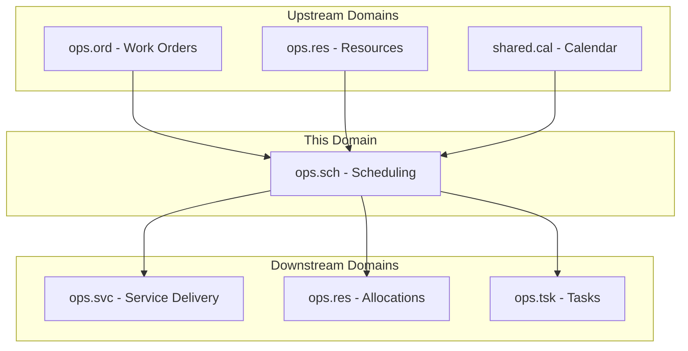
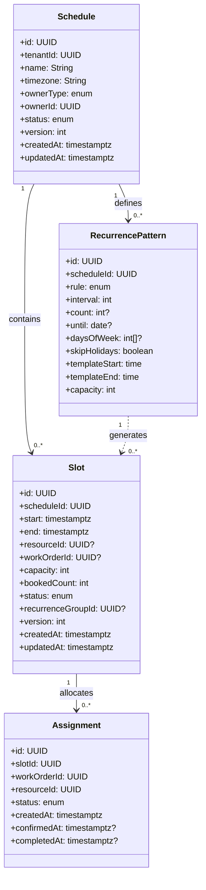
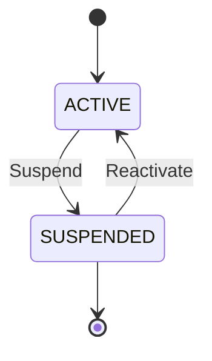
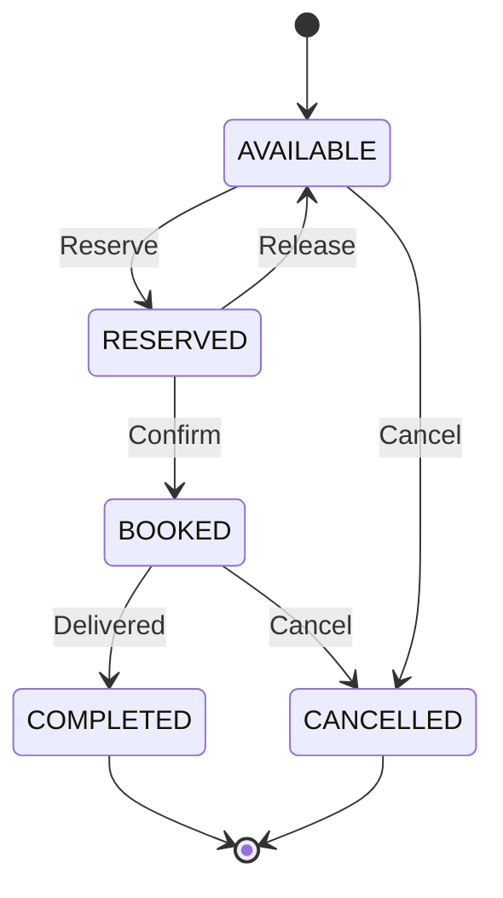
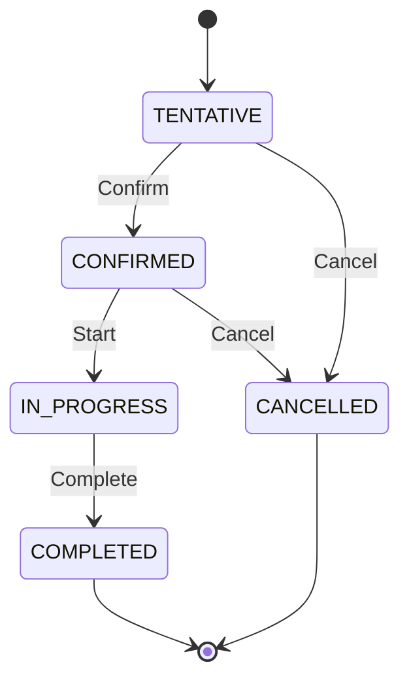
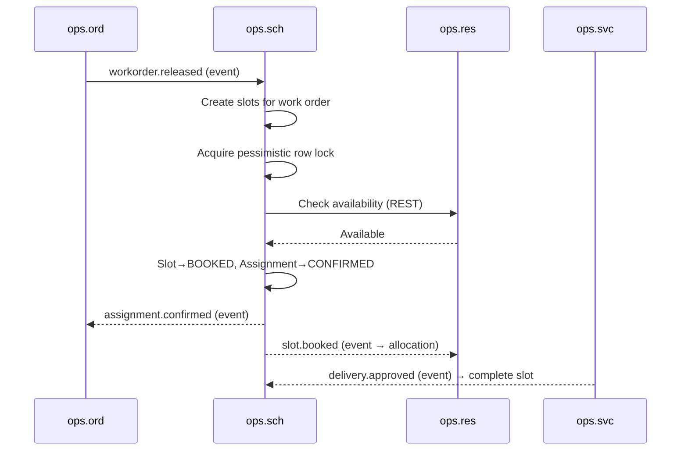
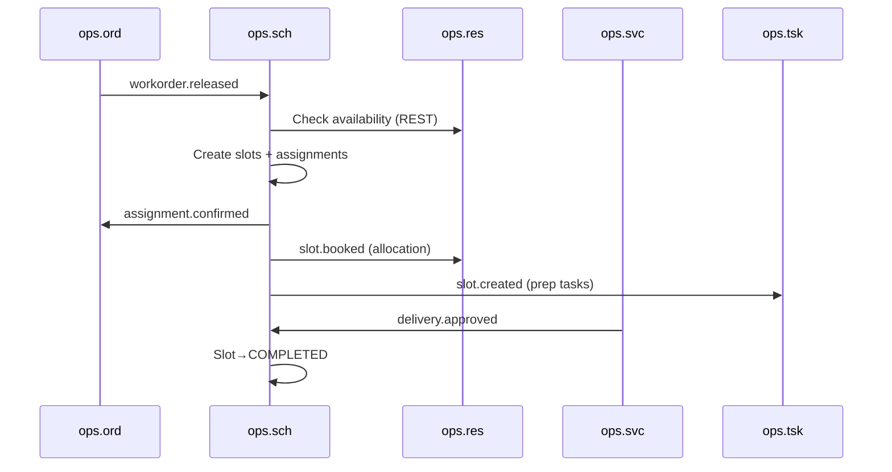
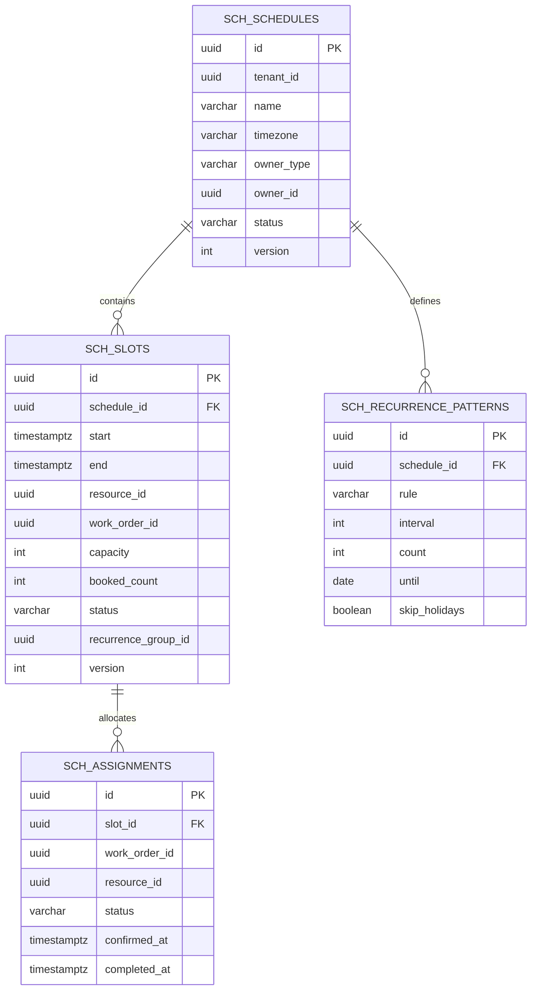

<!-- TEMPLATE COMPLIANCE: ~95%
Template: domain-service-spec.md v1.0.0
Present sections: §0-§15 all present with subsections
Missing sections: none
Naming issues: none — follows ops_sch-spec.md convention
Duplicates: none
Priority: DONE
-->
# OPS.SCH - Scheduling Domain / Service Specification

> **Conceptual Stack Layer:** Domain / Service
> **Space:** Platform
> **Owner:** Domain Engineering Team
> **Schema alignment:** `service-layer.schema.json`
> **Companion files:** `openapi.yaml`, `*.schema.json` (event contracts)
> **Referenced by:** Platform-Feature Spec SS5 (backend dependencies), BFF Contract
> **Belongs to:** OPS Suite Spec (`_ops_suite.md`)

> **Meta Information**
> - **Version:** 2026-04-03
> - **Template:** `domain-service-spec.md` v1.0.0
> - **Template Compliance:** ~95%
> - **Author(s):** OpenLeap Architecture Team
> - **Status:** DRAFT
> - **Suite:** `ops`
> - **Domain:** `sch`
> - **Bounded Context Ref:** `bc:scheduling`
> - **Service ID:** `ops-sch-svc`
> - **basePackage:** `io.openleap.ops.sch`
> - **API Base Path:** `/api/ops/sch/v1`
> - **OpenLeap Starter Version:** `v1`
> - **Port:** OPEN QUESTION
> - **Repository:** OPEN QUESTION
> - **Tags:** `ops`, `scheduling`, `slots`, `assignments`, `recurrence`, `booking`
> - **Team:**
>   - Name: `team-ops`
>   - Email: `ops-team@openleap.io`
>   - Slack: `#ops-team`

---

## Specification Guidelines Compliance

>
> ### Non-Negotiables
> - Never invent facts. If required info is missing, add an **OPEN QUESTION** entry.
> - Preserve intent and decisions. Only change meaning when explicitly requested.
> - Do not remove normative constraints unless they are explicitly replaced.
> - Keep the spec **self-contained**: no "see chat", no implicit context.
>
> ### Source of Truth Priority
> When sources conflict:
> 1. Spec (explicit) wins
> 2. Starter specs (implementation constraints) next
> 3. Guidelines (best practices) last
>
> ### Style Guide
> - Prefer short sentences and lists.
> - Use MUST/SHOULD/MAY for normative statements.
> - Keep terminology consistent (Aggregate, Domain Service, Application Service, Command, Event).
> - Avoid ambiguous words ("often", "maybe") unless explicitly noting uncertainty.

---

## 0. Document Purpose & Scope

### 0.1 Purpose
This specification defines the Scheduling domain within the OPS Suite. `ops.sch` provides calendar-based planning of resources to work orders and appointments. It manages schedules, time slots, and assignments, handles booking conflicts via pessimistic locking, and supports recurring schedules and multi-resource coordination.

### 0.2 Target Audience
- Product Owners & Business Stakeholders
- System Architects & Technical Leads
- Integration Engineers

### 0.3 Scope
**In Scope:**
- Schedule and calendar management
- Time slot creation (single and bulk/recurring)
- Slot booking, reservation, and cancellation
- Assignment confirmation against resource availability
- Conflict detection and overbooking prevention (pessimistic locking)
- Drag-and-drop rescheduling support (slot move operations)
- Schedule optimization hints

**Out of Scope:**
- Resource definitions and capacity models (ops.res)
- Actual service delivery recording (ops.svc)
- Calendar/holiday master data (shared.cal / CAP)
- Work order lifecycle management (ops.ord)

### 0.4 Related Documents
- `_ops_suite.md` - OPS Suite overview
- `ops_res-spec.md` - Resource Management
- `ops_ord-spec.md` - Order Management
- `ops_svc-spec.md` - Service Delivery
- `CAP_calendar_planning.md` - Calendar & Planning

---

## 1. Business Context

### 1.1 Domain Purpose
`ops.sch` answers **"when does the work happen?"** It assigns resources to time slots, ensures no double-booking, and coordinates the temporal dimension of operational execution. It is the central coordination point between what needs to happen (ops.ord), who can do it (ops.res), and when it actually gets delivered (ops.svc).

### 1.2 Business Value
- Conflict-free scheduling through pessimistic locking and exclusion constraints
- Recurring appointments (weekly lessons, service visits) with holiday awareness
- Real-time slot availability for booking portals and dispatch UIs
- Calendar views for resources, customers, and work orders
- Automatic slot-to-delivery linkage via event-driven integration
- Drag-and-drop rescheduling with atomic cancel-and-rebook

### 1.3 Key Stakeholders

| Role | Responsibility | Primary Use Cases |
|------|----------------|-------------------|
| Planner / Dispatcher | Create schedules, book slots, reschedule | UC-SCH-001, UC-SCH-002, UC-SCH-003 |
| Service Provider | View personal schedule, confirm assignments | UC-SCH-007 |
| Customer | Request appointments (portal) | UC-SCH-002 |
| Operations Manager | Oversee utilization, monitor conflicts | UC-SCH-008 |

### 1.4 Strategic Positioning



### 1.5 Service Context

| Field | Value |
|-------|-------|
| Suite | `ops` (Operational Services) |
| Domain | `sch` (Scheduling) |
| Bounded Context | `bc:scheduling` |
| Service ID | `ops-sch-svc` |
| Base Package | `io.openleap.ops.sch` |
| Authoritative Sources | OPS Suite Spec (`_ops_suite.md`), Scheduling best practices (resource scheduling, Gantt-based planning) |

---

## 2. Service Identity

| Field | Value |
|-------|-------|
| **Service ID** | `ops-sch-svc` |
| **Display Name** | Scheduling Service |
| **Suite** | `ops` |
| **Domain** | `sch` |
| **Bounded Context Ref** | `bc:scheduling` |
| **Version** | 2026-04-03 |
| **Status** | DRAFT |
| **API Base Path** | `/api/ops/sch/v1` |
| **Repository** | OPEN QUESTION |
| **Tags** | `ops`, `scheduling`, `slots`, `assignments`, `recurrence`, `booking` |
| **Team Name** | `team-ops` |
| **Team Email** | `ops-team@openleap.io` |
| **Team Slack** | `#ops-team` |

---

## 3. Domain Model

### 3.1 Conceptual Overview

The domain centers on the **Schedule** aggregate — a named calendar container scoped to a resource, work order, customer, or general purpose. Schedules contain **Slots** — bookable time windows with capacity. Slots link to **Assignments** that connect a specific resource to a work order for that time window. **RecurrencePatterns** define repeating slot generation rules (e.g., "every Monday 10:00-11:00 for 12 weeks").



### 3.2 Core Concepts

| Concept | Owner | Description | Glossary Ref |
|---------|-------|-------------|--------------|
| Schedule | ops-sch-svc | Named calendar container scoped to owner (resource, work order, customer, general) | Schedule (Kalender) |
| Slot | ops-sch-svc | Bookable time window with capacity and status lifecycle | Slot (Zeitfenster) |
| Assignment | ops-sch-svc | Confirmed booking of a resource to a work order for a specific slot | Assignment (Zuweisung) |
| RecurrencePattern | ops-sch-svc | Rule defining repeating slot generation with holiday awareness | Recurrence (Wiederholung) |

### 3.3 Aggregate Definitions

#### 3.3.1 Aggregate: Schedule

**Aggregate ID:** `agg:schedule`
**Business Purpose:** Named calendar container for organizing time slots. Scoped to a resource, work order, customer, or general purpose.

**Aggregate Root Attributes:**

| Attribute | Type | Format | Required | Description | Example | Constraints |
|-----------|------|--------|----------|-------------|---------|-------------|
| id | UUID | uuid | Yes | Unique identifier | `a1b2c3d4-...` | Immutable after create |
| tenantId | UUID | uuid | Yes | Tenant ownership | `t1-uuid` | Immutable, RLS-enforced |
| name | String | varchar(200) | Yes | Display name | `"Resource A - March 2026"` | Max 200 chars |
| timezone | String | IANA TZ | Yes | Schedule timezone | `"Europe/Berlin"` | Valid IANA timezone |
| ownerType | Enum | — | Yes | Owner entity type | `RESOURCE` | RESOURCE, WORKORDER, CUSTOMER, GENERAL |
| ownerId | UUID | uuid | Yes | Owner entity reference | `res-uuid` | FK logical to ownerType entity |
| status | Enum | — | Yes | Schedule state | `ACTIVE` | ACTIVE, SUSPENDED |
| version | Integer | — | Yes | Optimistic locking version | `1` | Auto-incremented |
| createdAt | Timestamptz | ISO 8601 | Yes | Creation timestamp | `2026-03-01T08:00:00Z` | System-managed |
| updatedAt | Timestamptz | ISO 8601 | Yes | Last update timestamp | `2026-03-01T08:00:00Z` | System-managed |

**Lifecycle States:**



**State Transitions:**

| From | To | Trigger | Guard / Precondition | Side Effects |
|------|----|---------|---------------------|--------------|
| — | ACTIVE | Create | Valid timezone (BR-001), valid ownerType + ownerId | Emits `schedule.created` |
| ACTIVE | SUSPENDED | Suspend | — | Prevents new slot creation; emits `schedule.updated` |
| SUSPENDED | ACTIVE | Reactivate | — | Emits `schedule.updated` |

**Invariants:**
- INV-S-001: `timezone` MUST be a valid IANA timezone identifier (BR-001)
- INV-S-002: Only ACTIVE schedules accept new slot creation (BR-006)

**Domain Events Emitted:**

| Event | Routing Key | When | Key Payload |
|-------|-------------|------|-------------|
| ScheduleCreated | `ops.sch.schedule.created` | Schedule created | scheduleId, ownerType, ownerId |
| ScheduleUpdated | `ops.sch.schedule.updated` | Status changed | scheduleId, status |

#### 3.3.2 Aggregate: Slot

**Aggregate ID:** `agg:slot`
**Business Purpose:** Bookable time window with capacity. Represents a specific period during which a resource can be assigned to work.

**Aggregate Root Attributes:**

| Attribute | Type | Format | Required | Description | Example | Constraints |
|-----------|------|--------|----------|-------------|---------|-------------|
| id | UUID | uuid | Yes | Unique identifier | `slot-uuid` | Immutable after create |
| scheduleId | UUID | uuid | Yes | Parent schedule | `sched-uuid` | FK to sch_schedules |
| start | Timestamptz | ISO 8601 | Yes | Slot start time | `2026-03-15T09:00:00Z` | — |
| end | Timestamptz | ISO 8601 | Yes | Slot end time | `2026-03-15T10:00:00Z` | > start (BR-002) |
| resourceId | UUID | uuid | No | Assigned resource | `res-uuid` | FK logical to ops.res |
| workOrderId | UUID | uuid | No | Linked work order | `wo-uuid` | FK logical to ops.ord |
| capacity | Integer | — | Yes | Max bookings | `1` | > 0, default 1 |
| bookedCount | Integer | — | Yes | Current bookings | `0` | >= 0, <= capacity (BR-003) |
| status | Enum | — | Yes | Slot state | `AVAILABLE` | AVAILABLE, RESERVED, BOOKED, COMPLETED, CANCELLED |
| recurrenceGroupId | UUID | uuid | No | Links recurring instances | `rg-uuid` | Set by recurrence engine |
| version | Integer | — | Yes | Optimistic locking version | `1` | Auto-incremented |
| createdAt | Timestamptz | ISO 8601 | Yes | Creation timestamp | — | System-managed |
| updatedAt | Timestamptz | ISO 8601 | Yes | Last update timestamp | — | System-managed |

**Lifecycle States:**



**State Transitions:**

| From | To | Trigger | Guard / Precondition | Side Effects |
|------|----|---------|---------------------|--------------|
| — | AVAILABLE | Create | Schedule ACTIVE (BR-006), end > start (BR-002), capacity > 0 | Emits `slot.created` |
| AVAILABLE | RESERVED | Reserve | bookedCount < capacity, min lead time (BR-007) | Acquires pessimistic row lock (BR-004); emits `slot.reserved` |
| RESERVED | BOOKED | Confirm | Resource available per ops.res (BR-005) | bookedCount++; emits `slot.booked` |
| RESERVED | AVAILABLE | Release | — | Releases lock; emits `slot.released` |
| BOOKED | COMPLETED | Delivered | ops.svc delivery.approved event | Emits `slot.completed` |
| BOOKED | CANCELLED | Cancel | — | bookedCount--; emits `slot.cancelled` |
| AVAILABLE | CANCELLED | Cancel | — | Emits `slot.cancelled` |

**Invariants:**
- INV-SL-001: `end > start` (BR-002)
- INV-SL-002: `bookedCount <= capacity` at all times (BR-003)
- INV-SL-003: No overlapping BOOKED slots per resource — enforced by DB exclusion constraint (BR-004)
- INV-SL-004: Booking MUST respect minimum lead time before slot start (BR-007)

**Domain Events Emitted:**

| Event | Routing Key | When | Key Payload |
|-------|-------------|------|-------------|
| SlotCreated | `ops.sch.slot.created` | Slot created | slotId, scheduleId, start, end, resourceId |
| SlotReserved | `ops.sch.slot.reserved` | AVAILABLE → RESERVED | slotId, resourceId |
| SlotBooked | `ops.sch.slot.booked` | RESERVED → BOOKED | slotId, resourceId, workOrderId, assignmentId |
| SlotReleased | `ops.sch.slot.released` | RESERVED → AVAILABLE | slotId |
| SlotCompleted | `ops.sch.slot.completed` | BOOKED → COMPLETED | slotId, assignmentId |
| SlotCancelled | `ops.sch.slot.cancelled` | → CANCELLED | slotId, resourceId |

#### 3.3.3 Aggregate: Assignment

**Aggregate ID:** `agg:assignment`
**Business Purpose:** Confirmed booking of a resource to a work order for a specific slot. Tracks the lifecycle from planning through confirmation to completion.

**Aggregate Root Attributes:**

| Attribute | Type | Format | Required | Description | Example | Constraints |
|-----------|------|--------|----------|-------------|---------|-------------|
| id | UUID | uuid | Yes | Unique identifier | `asgn-uuid` | Immutable after create |
| slotId | UUID | uuid | Yes | Linked slot | `slot-uuid` | FK to sch_slots |
| workOrderId | UUID | uuid | Yes | Work order reference | `wo-uuid` | FK logical to ops.ord |
| resourceId | UUID | uuid | Yes | Assigned resource | `res-uuid` | FK logical to ops.res |
| status | Enum | — | Yes | Assignment state | `TENTATIVE` | TENTATIVE, CONFIRMED, IN_PROGRESS, COMPLETED, CANCELLED |
| createdAt | Timestamptz | ISO 8601 | Yes | Creation timestamp | — | System-managed |
| confirmedAt | Timestamptz | ISO 8601 | No | Confirmation timestamp | — | Set on CONFIRMED transition |
| completedAt | Timestamptz | ISO 8601 | No | Completion timestamp | — | Set on COMPLETED transition |

**Lifecycle States:**



**State Transitions:**

| From | To | Trigger | Guard / Precondition | Side Effects |
|------|----|---------|---------------------|--------------|
| — | TENTATIVE | Create | Valid slot, resource, and work order | Emits `assignment.created` |
| TENTATIVE | CONFIRMED | Confirm | Slot RESERVED/BOOKED, resource available per ops.res (BR-005) | Sets confirmedAt; emits `assignment.confirmed` |
| CONFIRMED | IN_PROGRESS | Start | — | Emits `assignment.started` |
| IN_PROGRESS | COMPLETED | Complete | ops.svc delivery.approved | Sets completedAt; emits `assignment.completed` |
| TENTATIVE | CANCELLED | Cancel | — | Emits `assignment.cancelled` |
| CONFIRMED | CANCELLED | Cancel | — | Releases slot allocation; emits `assignment.cancelled` |

**Invariants:**
- INV-A-001: CONFIRMED requires slot in RESERVED or BOOKED state and resource available per ops.res (BR-005)

**Domain Events Emitted:**

| Event | Routing Key | When | Key Payload |
|-------|-------------|------|-------------|
| AssignmentCreated | `ops.sch.assignment.created` | Assignment created | assignmentId, slotId, resourceId, workOrderId |
| AssignmentConfirmed | `ops.sch.assignment.confirmed` | TENTATIVE → CONFIRMED | assignmentId, slotId, resourceId |
| AssignmentStarted | `ops.sch.assignment.started` | CONFIRMED → IN_PROGRESS | assignmentId |
| AssignmentCompleted | `ops.sch.assignment.completed` | IN_PROGRESS → COMPLETED | assignmentId |
| AssignmentCancelled | `ops.sch.assignment.cancelled` | → CANCELLED | assignmentId, slotId |

#### 3.3.4 Entity: RecurrencePattern (child of Schedule)

**Business Purpose:** Rule defining repeating slot generation. Supports weekly, daily, and custom recurrence with holiday skipping via shared.cal.

| Attribute | Type | Format | Required | Description | Constraints |
|-----------|------|--------|----------|-------------|-------------|
| id | UUID | uuid | Yes | Unique identifier | Immutable |
| scheduleId | UUID | uuid | Yes | Parent schedule | FK to sch_schedules |
| rule | Enum | — | Yes | Recurrence type | DAILY, WEEKLY, BIWEEKLY, MONTHLY |
| interval | Integer | — | Yes | Repeat interval | Default 1, > 0 |
| count | Integer | — | No | Number of occurrences | Mutually exclusive with `until` |
| until | Date | ISO 8601 | No | End date | Mutually exclusive with `count` |
| daysOfWeek | Integer[] | — | No | Days for WEEKLY rules | 1=Mon, 7=Sun |
| skipHolidays | Boolean | — | Yes | Skip calendar holidays | Default true |
| templateStart | Time | HH:mm | Yes | Slot start time template | — |
| templateEnd | Time | HH:mm | Yes | Slot end time template | — |
| capacity | Integer | — | Yes | Capacity per generated slot | Default 1, > 0 |

**Relationship:** Schedule `1` → `0..*` RecurrencePattern

### 3.4 Enumerations

| Enum | Values | Description |
|------|--------|-------------|
| OwnerType | RESOURCE, WORKORDER, CUSTOMER, GENERAL | Schedule owner entity type |
| ScheduleStatus | ACTIVE, SUSPENDED | Schedule lifecycle |
| SlotStatus | AVAILABLE, RESERVED, BOOKED, COMPLETED, CANCELLED | Slot lifecycle |
| AssignmentStatus | TENTATIVE, CONFIRMED, IN_PROGRESS, COMPLETED, CANCELLED | Assignment lifecycle |
| RecurrenceRule | DAILY, WEEKLY, BIWEEKLY, MONTHLY | Recurrence frequency |

---

## 4. Business Rules & Constraints

### 4.1 Business Rules Catalog

| ID | Rule Name | Description | Scope | Enforcement | Error Code |
|----|-----------|-------------|-------|-------------|------------|
| BR-001 | Valid Timezone | Timezone MUST be a valid IANA identifier | Schedule | Create | `SCH-VAL-001` |
| BR-002 | Valid Time Range | end > start | Slot | Create | `SCH-VAL-002` |
| BR-003 | Capacity Guard | bookedCount <= capacity at all times | Slot | Booking | `SCH-BIZ-003` |
| BR-004 | No Resource Overlap | No overlapping BOOKED slots per resource | Slot | DB exclusion | `SCH-BIZ-004` |
| BR-005 | Availability Check | Resource MUST be available per ops.res before confirmation | Assignment | Confirm | `SCH-BIZ-005` |
| BR-006 | Active Schedule | Only ACTIVE schedules accept new slot creation | Schedule | Slot create | `SCH-BIZ-006` |
| BR-007 | Min Lead Time | Configurable minimum time before slot start for booking | Slot | Booking | `SCH-BIZ-007` |

### 4.2 Detailed Rule Definitions

#### BR-003: Capacity Guard
**Context:** Slots have a maximum capacity (typically 1 for individual resources, higher for group sessions or rooms).
**Rule Statement:** At no point may `bookedCount` exceed `capacity` on a Slot.
**Applies To:** Slot aggregate
**Enforcement:** Pessimistic row lock during booking transaction; CHECK constraint on table.
**Validation Logic:** `if (slot.bookedCount >= slot.capacity) throw SlotFullException`
**Error Handling:**
- Code: `SCH-BIZ-003`
- Message: `"Slot {id} is at capacity ({capacity}). Cannot book."`
- HTTP: 409 Conflict

#### BR-004: No Resource Overlap
**Context:** A resource cannot be in two places at once. Physical constraint preventing double-booking.
**Rule Statement:** For any given resource, no two BOOKED slots may have overlapping time ranges.
**Applies To:** Slot aggregate
**Enforcement:** PostgreSQL exclusion constraint using `tstzrange` and GiST index.
**Validation Logic:** `EXCLUDE USING gist (resource_id WITH =, tstzrange(start, "end") WITH &&) WHERE (status = 'BOOKED')`
**Error Handling:**
- Code: `SCH-BIZ-004`
- Message: `"Resource {resourceId} already has a booking overlapping {start} - {end}."`
- HTTP: 409 Conflict

#### BR-005: Availability Check
**Context:** Before confirming an assignment, the system MUST verify the resource is available in ops.res (not on leave, not blocked, has capacity).
**Rule Statement:** Assignment confirmation requires a successful availability check via REST call to ops-res-svc.
**Applies To:** Assignment aggregate, Confirm transition
**Enforcement:** Application Service calls ops-res-svc before transitioning.
**Error Handling:**
- Code: `SCH-BIZ-005`
- Message: `"Resource {resourceId} is not available for the requested time period."`
- HTTP: 422 Unprocessable Entity

### 4.3 Data Validation Rules

| Field | Validation Rule | Error Code | Error Message |
|-------|----------------|------------|---------------|
| name | Required, max 200 chars | `SCH-VAL-010` | `"Schedule name is required (max 200 characters)"` |
| timezone | Required, valid IANA timezone | `SCH-VAL-001` | `"Valid IANA timezone is required"` |
| start | Required, valid timestamptz | `SCH-VAL-002` | `"Valid start time is required"` |
| end | Required, > start | `SCH-VAL-002` | `"End time must be after start time"` |
| capacity | Required, > 0 | `SCH-VAL-011` | `"Capacity must be greater than zero"` |
| resourceId | Valid UUID if present | `SCH-VAL-012` | `"Valid resource ID required"` |
| workOrderId | Valid UUID if present | `SCH-VAL-013` | `"Valid work order ID required"` |
| recurrence.count | > 0, mutually exclusive with until | `SCH-VAL-014` | `"Count must be positive; cannot combine with until"` |

### 4.4 Reference Data Dependencies

| Catalog | Usage | Provider Service | Validation |
|---------|-------|-----------------|------------|
| IANA Timezones | `timezone` field | JVM built-in | Zone existence check |
| Calendar / Holidays | Holiday skipping for recurrence | shared.cal / cap-svc (T2) | Holiday date lookup |
| Resources | `resourceId` validation | ops-res-svc (T3) | Availability check |
| Work Orders | `workOrderId` validation | ops-ord-svc (T3) | Order existence + status check |

---

## 5. Use Cases

### 5.1 Business Logic Placement

| Layer | Responsibilities |
|-------|-----------------|
| Application Service | Command validation, aggregate loading, event publishing, orchestration (recurrence expansion, rescheduling) |
| Domain Service | Availability integration (ops.res), conflict detection (cross-slot), recurrence generation with holiday skipping |
| Aggregate | State transitions, invariant enforcement, attribute validation |

### 5.2 Use Cases

#### UC-SCH-001: Create Schedule with Slots

| Field | Value |
|-------|-------|
| **ID** | UC-SCH-001 |
| **Type** | WRITE |
| **Trigger** | REST |
| **Aggregate** | Schedule, Slot |
| **Domain Operation** | `Schedule.create()` + `Slot.create()` (batch) |
| **Inputs** | name, timezone, ownerType, ownerId, slots[]? (start, end, capacity) |
| **Outputs** | Created Schedule in ACTIVE state, optional Slots in AVAILABLE state |
| **Events** | `ScheduleCreated`, `SlotCreated` (per slot) |
| **REST** | `POST /api/ops/sch/v1/schedules` → 201 Created |
| **Idempotency** | Client-generated `Idempotency-Key` header |
| **Errors** | 400 (validation), 422 (BR-001 invalid timezone) |

#### UC-SCH-002: Book Slot

| Field | Value |
|-------|-------|
| **ID** | UC-SCH-002 |
| **Type** | WRITE |
| **Trigger** | REST |
| **Aggregate** | Slot, Assignment |
| **Domain Operation** | `Slot.reserve()` → availability check → `Slot.book()` + `Assignment.confirm()` |
| **Inputs** | slotId, resourceId, workOrderId |
| **Outputs** | Slot in BOOKED state, Assignment in CONFIRMED state |
| **Events** | `SlotReserved`, `SlotBooked`, `AssignmentConfirmed` |
| **REST** | `POST /api/ops/sch/v1/slots/{id}:book` → 200 OK |
| **Idempotency** | Idempotent (re-book of BOOKED with same assignment is no-op) |
| **Errors** | 404 (not found), 409 (BR-003 at capacity, BR-004 overlap), 422 (BR-005 resource unavailable, BR-007 lead time) |

#### UC-SCH-003: Reschedule (Move Slot)

| Field | Value |
|-------|-------|
| **ID** | UC-SCH-003 |
| **Type** | WRITE |
| **Trigger** | REST |
| **Aggregate** | Slot, Assignment |
| **Domain Operation** | `Slot.cancel(oldSlotId)` → `Slot.book(newSlotId)` |
| **Inputs** | oldSlotId, newSlotId, assignmentId |
| **Outputs** | Old slot released, new slot booked, assignment updated |
| **Events** | `SlotCancelled` (old), `SlotBooked` (new), `AssignmentConfirmed` (updated) |
| **REST** | `POST /api/ops/sch/v1/assignments/{id}:reschedule` → 200 OK |
| **Idempotency** | Idempotency-Key header |
| **Errors** | 404, 409 (new slot conflict), 422 (resource unavailable) |

#### UC-SCH-004: Complete Slot (Event-Driven)

| Field | Value |
|-------|-------|
| **ID** | UC-SCH-004 |
| **Type** | WRITE |
| **Trigger** | Event (`ops.svc.delivery.approved`) |
| **Aggregate** | Slot, Assignment |
| **Domain Operation** | `Slot.complete()` + `Assignment.complete()` |
| **Inputs** | deliveryId (mapped to slotId via work order) |
| **Outputs** | Slot in COMPLETED state, Assignment in COMPLETED state |
| **Events** | `SlotCompleted`, `AssignmentCompleted` |
| **REST** | — (event-driven) |
| **Idempotency** | Idempotent (re-complete of COMPLETED is no-op) |
| **Errors** | Logged if slot not found (eventual consistency) |

#### UC-SCH-005: Bulk Create Recurring Slots

| Field | Value |
|-------|-------|
| **ID** | UC-SCH-005 |
| **Type** | WRITE |
| **Trigger** | REST |
| **Aggregate** | Schedule, Slot, RecurrencePattern |
| **Domain Operation** | `RecurrencePattern.create()` → expand → `Slot.create()` (batch) |
| **Inputs** | scheduleId, recurrence (rule, interval, count/until, daysOfWeek, skipHolidays, templateStart, templateEnd, capacity) |
| **Outputs** | RecurrencePattern + generated Slots linked by recurrenceGroupId |
| **Events** | `SlotCreated` (per generated slot) |
| **REST** | `POST /api/ops/sch/v1/schedules/{id}/slots` with recurrence body → 201 Created |
| **Idempotency** | Idempotency-Key header |
| **Errors** | 400 (invalid recurrence), 422 (BR-006 schedule suspended) |

#### UC-SCH-006: Cancel Slot

| Field | Value |
|-------|-------|
| **ID** | UC-SCH-006 |
| **Type** | WRITE |
| **Trigger** | REST |
| **Aggregate** | Slot, Assignment |
| **Domain Operation** | `Slot.cancel()` + `Assignment.cancel()` (if exists) |
| **Inputs** | slotId, reason? |
| **Outputs** | Slot in CANCELLED state, related assignments cancelled |
| **Events** | `SlotCancelled`, `AssignmentCancelled` |
| **REST** | `POST /api/ops/sch/v1/slots/{id}:cancel` → 200 OK |
| **Idempotency** | Idempotent (re-cancel of CANCELLED is no-op) |
| **Errors** | 404, 409 (COMPLETED slots cannot be cancelled) |

#### UC-SCH-007: Query Available Slots (READ)

| Field | Value |
|-------|-------|
| **ID** | UC-SCH-007 |
| **Type** | READ |
| **Trigger** | REST |
| **Aggregate** | Slot |
| **Domain Operation** | Query projection |
| **Inputs** | from?, to?, resourceId?, workOrderId?, status?, scheduleId?, page, size |
| **Outputs** | Paginated slot list with availability info |
| **Events** | — |
| **REST** | `GET /api/ops/sch/v1/slots?...` → 200 OK |
| **Idempotency** | Inherently idempotent (GET) |
| **Errors** | 400 (invalid filter params) |

#### UC-SCH-008: Query Schedule Overview (READ)

| Field | Value |
|-------|-------|
| **ID** | UC-SCH-008 |
| **Type** | READ |
| **Trigger** | REST |
| **Aggregate** | Schedule |
| **Domain Operation** | Query projection |
| **Inputs** | ownerType?, ownerId?, status?, page, size |
| **Outputs** | Paginated schedule list |
| **Events** | — |
| **REST** | `GET /api/ops/sch/v1/schedules?...` → 200 OK |
| **Idempotency** | Inherently idempotent (GET) |
| **Errors** | 400 (invalid filter params) |

### 5.3 Process Flow Diagrams



### 5.4 Cross-Domain Workflows

**Does this domain participate in multi-service workflows?** Yes

#### Workflow: Resource Scheduling (SAG-OPS-002)
**Orchestration Pattern:** Choreography (EDA)
**Pattern Rationale:** Sequential flow triggered by work order release. Each step is independently processable. ops.sch reacts to upstream events (work order released, delivery approved) and publishes downstream events (slot booked, assignment confirmed). No distributed transaction coordination needed — pessimistic locking handles concurrency locally.

---

## 6. REST API

### 6.1 API Overview

| Field | Value |
|-------|-------|
| Base Path | `/api/ops/sch/v1` |
| Authentication | OAuth2/JWT (Bearer token) |
| Authorization | Scopes: `ops.sch:read`, `ops.sch:write`, `ops.sch:admin` |
| Content Type | `application/json` |
| Versioning | URL path (`v1`) |

### 6.2 Resource Operations

#### Schedule Resource

| Endpoint | Method | Path | Summary | Role Required | Events Published |
|----------|--------|------|---------|---------------|-----------------|
| Create Schedule | POST | `/schedules` | Create new schedule | `ops.sch:write` | `ScheduleCreated` |
| Get Schedule | GET | `/schedules/{id}` | Retrieve schedule by ID | `ops.sch:read` | — |
| List Schedules | GET | `/schedules` | Search/filter schedules | `ops.sch:read` | — |
| Update Schedule | PATCH | `/schedules/{id}` | Update schedule attributes | `ops.sch:write` | `ScheduleUpdated` |

**Create Schedule — Request:**
```json
{
  "name": "Resource A - March 2026",
  "timezone": "Europe/Berlin",
  "ownerType": "RESOURCE",
  "ownerId": "res-uuid"
}
```

**Create Schedule — Response (201 Created):**
```json
{
  "id": "sched-uuid",
  "status": "ACTIVE",
  "version": 1,
  "createdAt": "2026-03-01T08:00:00Z"
}
```

**Update Schedule — Headers:** `If-Match: "{version}"` (optimistic locking, 412 on conflict)

#### Slot Resource

| Endpoint | Method | Path | Summary | Role Required | Events Published |
|----------|--------|------|---------|---------------|-----------------|
| Create Slots | POST | `/schedules/{id}/slots` | Create single or recurring slots | `ops.sch:write` | `SlotCreated` |
| List Slots | GET | `/slots` | Search/filter slots | `ops.sch:read` | — |
| Get Slot | GET | `/slots/{id}` | Retrieve slot by ID | `ops.sch:read` | — |

**Create Slots — Request (with recurrence):**
```json
{
  "slots": [{ "start": "2026-03-15T09:00:00Z", "end": "2026-03-15T10:00:00Z", "capacity": 1 }],
  "recurrence": { "rule": "WEEKLY", "count": 12, "skipHolidays": true }
}
```

### 6.3 Business Operations

| Endpoint | Method | Path | Summary | Role Required | Events Published |
|----------|--------|------|---------|---------------|-----------------|
| Reserve Slot | POST | `/slots/{id}:reserve` | Reserve a slot | `ops.sch:write` | `SlotReserved` |
| Book Slot | POST | `/slots/{id}:book` | Confirm booking | `ops.sch:write` | `SlotBooked`, `AssignmentConfirmed` |
| Complete Slot | POST | `/slots/{id}:complete` | Mark slot completed | `ops.sch:write` | `SlotCompleted` |
| Cancel Slot | POST | `/slots/{id}:cancel` | Cancel a slot | `ops.sch:write` | `SlotCancelled` |
| Create Assignment | POST | `/assignments` | Create new assignment | `ops.sch:write` | `AssignmentCreated` |
| Confirm Assignment | POST | `/assignments/{id}:confirm` | Confirm assignment | `ops.sch:write` | `AssignmentConfirmed` |
| Cancel Assignment | POST | `/assignments/{id}:cancel` | Cancel assignment | `ops.sch:write` | `AssignmentCancelled` |
| Reschedule | POST | `/assignments/{id}:reschedule` | Move to different slot | `ops.sch:write` | Multiple |

**Book Slot — Request Body:**
```json
{
  "resourceId": "res-uuid",
  "workOrderId": "wo-uuid"
}
```

**Reschedule — Request Body:**
```json
{
  "newSlotId": "new-slot-uuid"
}
```

### 6.4 Error Responses

| HTTP Status | Error Code | Description |
|-------------|------------|-------------|
| 400 | `SCH-VAL-*` | Validation error (field-level) |
| 401 | — | Authentication required |
| 403 | — | Forbidden (insufficient role) |
| 404 | — | Resource not found |
| 409 | `SCH-BIZ-003`, `SCH-BIZ-004` | Conflict (capacity full, resource overlap, invalid state transition) |
| 412 | — | Precondition failed (optimistic lock version mismatch) |
| 422 | `SCH-BIZ-*` | Business rule violation |

### 6.5 OpenAPI Specification
**Location:** `contracts/http/ops/sch/openapi.yaml`
**OpenAPI Version:** 3.1.0

---

## 7. Events & Integration

### 7.1 Event-Driven Architecture Pattern
**Pattern Decision:** Choreography (EDA)
**Rationale:** Scheduling follows a reactive pattern — reacts to upstream work order releases and resource changes, publishes downstream assignment confirmations and slot completions. Each consumer processes independently. Pessimistic locking handles local concurrency; no distributed transaction needed.

### 7.2 Published Events

**Exchange:** `ops.sch.events` (topic)

#### ScheduleUpdated
- **Routing Key:** `ops.sch.schedule.updated`
- **Business Meaning:** A schedule's status or attributes have changed
- **When Published:** Schedule created or status changed
- **Payload Schema:**
```json
{
  "scheduleId": "uuid",
  "tenantId": "uuid",
  "ownerType": "RESOURCE",
  "ownerId": "uuid",
  "status": "ACTIVE"
}
```
- **Consumers:** ops.svc

#### SlotCreated
- **Routing Key:** `ops.sch.slot.created`
- **Business Meaning:** New bookable time slot(s) have been created
- **When Published:** Slot creation (single or batch)
- **Payload Schema:**
```json
{
  "slotId": "uuid",
  "tenantId": "uuid",
  "scheduleId": "uuid",
  "start": "2026-03-15T09:00:00Z",
  "end": "2026-03-15T10:00:00Z",
  "resourceId": "uuid | null",
  "capacity": 1,
  "recurrenceGroupId": "uuid | null"
}
```
- **Consumers:** ops.tsk (preparation tasks)

#### SlotReserved
- **Routing Key:** `ops.sch.slot.reserved`
- **Business Meaning:** A slot has been temporarily reserved (pending confirmation)
- **When Published:** AVAILABLE → RESERVED transition
- **Payload Schema:** `{ "slotId": "uuid", "tenantId": "uuid", "resourceId": "uuid" }`
- **Consumers:** ops.res (tentative allocation)

#### SlotBooked
- **Routing Key:** `ops.sch.slot.booked`
- **Business Meaning:** A slot has been confirmed — resource is committed
- **When Published:** RESERVED → BOOKED transition
- **Payload Schema:**
```json
{
  "slotId": "uuid",
  "tenantId": "uuid",
  "resourceId": "uuid",
  "workOrderId": "uuid",
  "assignmentId": "uuid",
  "start": "2026-03-15T09:00:00Z",
  "end": "2026-03-15T10:00:00Z"
}
```
- **Consumers:** ops.res (firm allocation), ops.ord (scheduling confirmation)

#### SlotCompleted
- **Routing Key:** `ops.sch.slot.completed`
- **Business Meaning:** The scheduled service has been delivered and confirmed
- **When Published:** BOOKED → COMPLETED transition
- **Payload Schema:** `{ "slotId": "uuid", "tenantId": "uuid", "assignmentId": "uuid" }`
- **Consumers:** ops.svc, ops.ord

#### SlotCancelled
- **Routing Key:** `ops.sch.slot.cancelled`
- **Business Meaning:** A slot has been cancelled — resource freed
- **When Published:** → CANCELLED transition
- **Payload Schema:** `{ "slotId": "uuid", "tenantId": "uuid", "resourceId": "uuid | null" }`
- **Consumers:** ops.res (release allocation), ops.ord

#### AssignmentConfirmed
- **Routing Key:** `ops.sch.assignment.confirmed`
- **Business Meaning:** A resource-to-work-order assignment has been confirmed
- **When Published:** TENTATIVE → CONFIRMED transition
- **Payload Schema:**
```json
{
  "assignmentId": "uuid",
  "tenantId": "uuid",
  "slotId": "uuid",
  "resourceId": "uuid",
  "workOrderId": "uuid"
}
```
- **Consumers:** ops.ord, ops.tsk

#### AssignmentCancelled
- **Routing Key:** `ops.sch.assignment.cancelled`
- **Business Meaning:** An assignment has been cancelled
- **When Published:** → CANCELLED transition
- **Payload Schema:** `{ "assignmentId": "uuid", "tenantId": "uuid", "slotId": "uuid" }`
- **Consumers:** ops.ord

### 7.3 Consumed Events

| Source Event | Source Service | Handler | Purpose | Queue |
|-------------|---------------|---------|---------|-------|
| `ops.res.capacity.updated` | ops.res | CapacityUpdatedHandler | Recalculate slot templates when resource capacity changes | `ops.sch.in.ops.res.capacity` |
| `ops.ord.workorder.released` | ops.ord | WorkOrderReleasedHandler | Auto-create slots for newly released work orders | `ops.sch.in.ops.ord.workorder` |
| `ops.svc.delivery.approved` | ops.svc | DeliveryApprovedHandler | Mark slot COMPLETED and assignment COMPLETED | `ops.sch.in.ops.svc.delivery` |
| `cap.calendar.updated` | shared.cal | CalendarUpdatedHandler | Update holiday blocks, regenerate affected recurring slots | `ops.sch.in.cap.calendar` |

### 7.4 Event Flow Diagrams



### 7.5 Integration Points Summary

**Upstream Dependencies:**

| Service | Tier | Purpose | Type | Criticality | Fallback |
|---------|------|---------|------|-------------|----------|
| ops-res-svc | T3 | Resource availability check | REST API | High | Reject booking if unavailable |
| ops-ord-svc | T3 | Work order validation | REST + Cache | Medium | Use cached order data |
| cap-svc | T2 | Holiday calendar lookup | REST + Cache | Low | Use cached holiday data |

**Downstream Consumers:**

| Service | Tier | Purpose | Type | SLA |
|---------|------|---------|------|-----|
| ops.res | T3 | Resource allocation/release | Event | < 5s processing |
| ops.ord | T3 | Assignment confirmation | Event | < 5s processing |
| ops.svc | T3 | Delivery linkage | Event | < 5s processing |
| ops.tsk | T3 | Preparation task creation | Event | < 10s processing |

---

## 8. Data Model

### 8.1 Storage Technology

| Aspect | Choice |
|--------|--------|
| Database | PostgreSQL 16+ |
| Multi-tenancy | `tenant_id` column + PostgreSQL RLS |
| Soft Delete | No — cancelled slots remain for audit trail |
| Audit Trail | All status transitions logged via iam.audit events |
| Outbox | `sch_outbox_events` table for reliable event publishing |
| Exclusion Constraint | GiST-based tstzrange exclusion for overlap prevention |

### 8.2 Conceptual Data Model



### 8.3 Table Definitions

#### Table: `sch_schedules`

| Column | Type | Nullable | Default | Description | Constraints |
|--------|------|----------|---------|-------------|-------------|
| id | uuid | NOT NULL | `OlUuid.create()` | Primary key | PK |
| tenant_id | uuid | NOT NULL | — | Tenant discriminator | RLS policy |
| name | varchar(200) | NOT NULL | — | Display name | — |
| timezone | varchar(50) | NOT NULL | — | IANA timezone | Valid IANA TZ |
| owner_type | varchar(20) | NOT NULL | — | Owner entity type | CHECK(owner_type IN ('RESOURCE','WORKORDER','CUSTOMER','GENERAL')) |
| owner_id | uuid | NOT NULL | — | Owner entity reference | — |
| status | varchar(15) | NOT NULL | `'ACTIVE'` | Lifecycle state | CHECK(status IN ('ACTIVE','SUSPENDED')) |
| version | integer | NOT NULL | 1 | Optimistic lock | — |
| created_at | timestamptz | NOT NULL | `now()` | Creation timestamp | — |
| updated_at | timestamptz | NOT NULL | `now()` | Last update | — |

**Indexes:**

| Index Name | Columns | Type | Condition |
|------------|---------|------|-----------|
| idx_sch_sched_tenant_owner | (tenant_id, owner_type, owner_id) | btree | — |
| idx_sch_sched_tenant_status | (tenant_id, status) | btree | — |

#### Table: `sch_slots`

| Column | Type | Nullable | Default | Description | Constraints |
|--------|------|----------|---------|-------------|-------------|
| id | uuid | NOT NULL | `OlUuid.create()` | Primary key | PK |
| schedule_id | uuid | NOT NULL | — | Parent schedule | FK to sch_schedules |
| start | timestamptz | NOT NULL | — | Slot start time | — |
| end | timestamptz | NOT NULL | — | Slot end time | CHECK("end" > start) |
| resource_id | uuid | NULL | — | Assigned resource | FK logical to ops.res |
| work_order_id | uuid | NULL | — | Linked work order | FK logical to ops.ord |
| capacity | integer | NOT NULL | 1 | Maximum bookings | CHECK(capacity > 0) |
| booked_count | integer | NOT NULL | 0 | Current bookings | CHECK(booked_count >= 0), CHECK(booked_count <= capacity) |
| status | varchar(15) | NOT NULL | `'AVAILABLE'` | Lifecycle state | CHECK(status IN ('AVAILABLE','RESERVED','BOOKED','COMPLETED','CANCELLED')) |
| recurrence_group_id | uuid | NULL | — | Links recurring instances | — |
| version | integer | NOT NULL | 1 | Optimistic lock | — |
| created_at | timestamptz | NOT NULL | `now()` | Creation timestamp | — |
| updated_at | timestamptz | NOT NULL | `now()` | Last update | — |

**Indexes:**

| Index Name | Columns | Type | Condition |
|------------|---------|------|-----------|
| idx_sch_slot_sched_time | (schedule_id, start, "end") | btree | — |
| idx_sch_slot_resource_time | (resource_id, start) | btree | WHERE resource_id IS NOT NULL |
| idx_sch_slot_tenant_status | (tenant_id, status) | btree | — |
| idx_sch_slot_recurrence | (recurrence_group_id) | btree | WHERE recurrence_group_id IS NOT NULL |
| excl_sch_slot_no_overlap | (resource_id, tstzrange(start, "end")) | GiST exclusion | WHERE status = 'BOOKED' |

**Exclusion Constraint:**
```sql
EXCLUDE USING gist (
    resource_id WITH =,
    tstzrange(start, "end") WITH &&
) WHERE (status = 'BOOKED')
```

#### Table: `sch_assignments`

| Column | Type | Nullable | Default | Description | Constraints |
|--------|------|----------|---------|-------------|-------------|
| id | uuid | NOT NULL | `OlUuid.create()` | Primary key | PK |
| slot_id | uuid | NOT NULL | — | Linked slot | FK to sch_slots |
| work_order_id | uuid | NOT NULL | — | Work order reference | FK logical to ops.ord |
| resource_id | uuid | NOT NULL | — | Assigned resource | FK logical to ops.res |
| status | varchar(15) | NOT NULL | `'TENTATIVE'` | Lifecycle state | CHECK(status IN ('TENTATIVE','CONFIRMED','IN_PROGRESS','COMPLETED','CANCELLED')) |
| created_at | timestamptz | NOT NULL | `now()` | Creation timestamp | — |
| confirmed_at | timestamptz | NULL | — | Confirmation timestamp | — |
| completed_at | timestamptz | NULL | — | Completion timestamp | — |

**Indexes:**

| Index Name | Columns | Type | Condition |
|------------|---------|------|-----------|
| idx_sch_asgn_slot_status | (slot_id, status) | btree | — |
| idx_sch_asgn_resource | (resource_id, status) | btree | — |
| idx_sch_asgn_workorder | (work_order_id) | btree | — |

#### Table: `sch_recurrence_patterns`

| Column | Type | Nullable | Default | Description | Constraints |
|--------|------|----------|---------|-------------|-------------|
| id | uuid | NOT NULL | `OlUuid.create()` | Primary key | PK |
| schedule_id | uuid | NOT NULL | — | Parent schedule | FK to sch_schedules |
| rule | varchar(20) | NOT NULL | — | Recurrence type | CHECK(rule IN ('DAILY','WEEKLY','BIWEEKLY','MONTHLY')) |
| interval | integer | NOT NULL | 1 | Repeat interval | CHECK(interval > 0) |
| count | integer | NULL | — | Number of occurrences | CHECK(count > 0) |
| until | date | NULL | — | End date | — |
| days_of_week | integer[] | NULL | — | Days for WEEKLY (1=Mon..7=Sun) | — |
| skip_holidays | boolean | NOT NULL | true | Skip calendar holidays | — |
| template_start | time | NOT NULL | — | Slot start time template | — |
| template_end | time | NOT NULL | — | Slot end time template | CHECK(template_end > template_start) |
| capacity | integer | NOT NULL | 1 | Capacity per generated slot | CHECK(capacity > 0) |
| created_at | timestamptz | NOT NULL | `now()` | Creation timestamp | — |

**Indexes:**

| Index Name | Columns | Type | Condition |
|------------|---------|------|-----------|
| idx_sch_recur_schedule | (schedule_id) | btree | — |

#### Table: `sch_outbox_events`

Standard outbox pattern per platform guidelines (ADR-013).

### 8.4 Reference Data Dependencies

| Reference Data | Source | Usage |
|----------------|--------|-------|
| IANA Timezones | JVM built-in | `timezone` validation |
| Calendar / Holidays | shared.cal / cap-svc (T2) | Holiday skipping in recurrence |
| Resources | ops-res-svc (T3) | `resource_id` availability check |
| Work Orders | ops-ord-svc (T3) | `work_order_id` validation |

### 8.5 Data Retention

| Entity | Retention Period | Legal Basis | Action After Expiry |
|--------|-----------------|-------------|---------------------|
| Schedules | 5 years | Operational audit | Archive then delete |
| Slots | 5 years | Operational audit, linked to deliveries | Archive then delete |
| Assignments | 5 years | Resource allocation history | Archive then delete |
| Recurrence Patterns | As long as schedule exists | Operational | Delete with schedule |
| Outbox Events | 30 days after publish | Operational | Delete |

---

## 9. Security & Compliance

### 9.1 Data Classification

| Data Element | Classification | Protection |
|--------------|----------------|------------|
| Schedule ID, slot times | Public | None |
| Resource IDs, work order IDs | Internal | RLS, access control |
| Assignment details | Internal | RLS, RBAC |
| Customer-linked schedules | Restricted | RLS, access control, audit |

### 9.2 Access Control

**Roles & Permissions Matrix:**

| Role | Read | Create Slots | Book | Cancel | Admin |
|------|------|-------------|------|--------|-------|
| SCH_VIEWER | ✓ | ✗ | ✗ | ✗ | ✗ |
| SCH_PLANNER | ✓ | ✓ | ✓ | ✓ | ✗ |
| SCH_DISPATCHER | ✓ | ✓ | ✓ | ✓ | ✗ |
| SCH_MANAGER | ✓ | ✓ | ✓ | ✓ | ✗ |
| SCH_ADMIN | ✓ | ✓ | ✓ | ✓ | ✓ |

### 9.3 Compliance Requirements

| Regulation | Requirement | Implementation |
|------------|-------------|----------------|
| GDPR | Resource and customer scheduling data are personal data references | Tenant-scoped RLS, GDPR export via IAM suite |
| Labour | Working time scheduling documentation | Integration with ops.tim for time tracking |

### 9.4 Audit Trail

| Aspect | Implementation |
|--------|----------------|
| Who | `currentPrincipal` from JWT token |
| What | Status transition (from → to) + changed fields |
| When | Timestamped event |
| Old/New Value | Captured in domain event payload |
| Retention | 5 years (aligned with schedule retention) |

---

## 10. Quality Attributes

### 10.1 Performance Requirements

| Operation | Target (p95) | Notes |
|-----------|-------------|-------|
| Read (GET single slot) | < 100ms | — |
| List (GET with filters) | < 200ms | Paginated, max 100 per page |
| Availability query | < 100ms | Indexed by resource + time range |
| Booking (with pessimistic lock) | < 200ms | Includes row lock acquisition |
| Bulk slot creation (recurring) | 10,000 slots/min | Batch insert with recurrence expansion |

### 10.2 Throughput

| Metric | Target |
|--------|--------|
| Peak bookings/hour | 50,000 |
| Peak events/second | 200 |
| Concurrent users | 5,000 |

### 10.3 Availability

| Metric | Target |
|--------|--------|
| Uptime SLA | 99.9% |
| Pessimistic lock hold time | < 200ms, deadlock detection with retry |
| Planned maintenance window | Sunday 02:00-04:00 UTC |

### 10.4 Recovery Objectives

| Metric | Target |
|--------|--------|
| RTO (Recovery Time Objective) | < 15 minutes |
| RPO (Recovery Point Objective) | < 5 minutes |
| Failure mode | Idempotent events + reliable outbox pattern |

### 10.5 Scalability

| Aspect | Strategy |
|--------|----------|
| Horizontal scaling | Stateless application instances behind load balancer |
| Database scaling | Read replicas for query load, partitioning by tenant_id for large tenants |
| Event throughput | Partitioned topic by tenant_id |

### 10.6 Maintainability

| Aspect | Implementation |
|--------|----------------|
| API versioning | URL path versioning (`/v1`), backward-compatible changes within version |
| Schema evolution | Event schema versioning with backward compatibility |
| Monitoring | Trace: slotId → assignmentId → deliveryId |
| Key metrics | booking rate, conflict rate, utilization rate, cancellation rate |
| Alerts | Lock wait > 500ms, conflict rate > 5%, DLQ depth > 0 |

---

## 11. Feature Dependencies

### 11.1 Purpose
This section answers: "Which features depend on this service?" It is the inverse of Platform-Feature Spec SS5 and helps the domain team assess the blast radius of API changes.

### 11.2 Feature Dependency Register

> **OPEN QUESTION:** Feature dependencies will be populated when feature specs (Phase 3) are authored for the OPS suite. The following is a preliminary mapping based on expected feature compositions.

| Feature ID | Feature Name | Suite | Tier | Dependency Type | Status |
|------------|-------------|-------|------|-----------------|--------|
| F-OPS-TBD | Schedule Management | ops | core | sync_api | planned |
| F-OPS-TBD | Slot Booking | ops | core | sync_api | planned |
| F-OPS-TBD | Recurring Schedules | ops | supporting | sync_api | planned |
| F-OPS-TBD | Drag-and-Drop Rescheduling | ops | supporting | sync_api | planned |
| F-OPS-TBD | Resource Calendar View | ops | supporting | sync_api | planned |

---

## 12. Extension Points

### 12.1 Purpose
Extension points follow the Open-Closed Principle: the service is open for extension via events and hooks but closed for direct modification.

### 12.2 Extension Events

| Event ID | Routing Key | Trigger | Payload | Purpose |
|----------|-------------|---------|---------|---------|
| EXT-SCH-001 | `ops.sch.slot.booked` | Slot booked | Full slot + assignment snapshot | External systems can react to bookings (e.g., customer notification, calendar sync) |
| EXT-SCH-002 | `ops.sch.slot.cancelled` | Slot cancelled | Slot details + reason | External systems can react to cancellations (e.g., waitlist processing) |
| EXT-SCH-003 | `ops.sch.assignment.confirmed` | Assignment confirmed | Assignment details | External systems can react to confirmations (e.g., SMS notification) |

### 12.3 Aggregate Hooks

| Hook ID | Aggregate | Lifecycle Point | Hook Type | Description |
|---------|-----------|-----------------|-----------|-------------|
| HOOK-SCH-001 | Slot | Pre-Book | validation | Custom booking validation rules per tenant (e.g., mandatory qualifications, custom lead time) |
| HOOK-SCH-002 | Slot | Post-Book | notification | Custom notification channels (SMS, email, webhook, calendar sync) |
| HOOK-SCH-003 | Assignment | Pre-Confirm | validation | Custom confirmation rules (e.g., manager approval required) |
| HOOK-SCH-004 | Slot | Post-Cancel | notification | Custom cancellation notifications (e.g., waitlist advancement) |

**Design Rules:**
- Hooks are fire-and-forget (notification) or bounded-timeout (validation: 2s)
- Validation hooks fail-closed (block on timeout)
- Notification hooks fail-open (log and continue)
- Hooks do not modify aggregate state directly

### 12.4 Extension Points Summary

| ID | Type | Aggregate | Lifecycle Point | Fail Mode | Timeout |
|----|------|-----------|-----------------|-----------|---------|
| EXT-SCH-001 | event | Slot | booked | n/a | n/a |
| EXT-SCH-002 | event | Slot | cancelled | n/a | n/a |
| EXT-SCH-003 | event | Assignment | confirmed | n/a | n/a |
| HOOK-SCH-001 | validation | Slot | pre-book | fail-closed | 2s |
| HOOK-SCH-002 | notification | Slot | post-book | fail-open | 5s |
| HOOK-SCH-003 | validation | Assignment | pre-confirm | fail-closed | 2s |
| HOOK-SCH-004 | notification | Slot | post-cancel | fail-open | 5s |

---

## 13. Migration & Evolution

### 13.1 Data Migration

**Legacy Source:** No direct legacy migration. New greenfield service.

### 13.2 Deprecation & Sunset

| Deprecated Feature | Replacement | Removal Timeline | Communication Plan |
|-------------------|-------------|------------------|-------------------|
| — | — | — | — |

### 13.3 Future Extensions

- Constraint-solving optimizer (AI-based schedule optimization considering travel time, preferences, skill matching)
- Mobile calendar sync (iCal, Google Calendar, Outlook)
- Customer self-service booking portal with real-time availability
- Waitlist management (automatic slot assignment when cancellation occurs)
- Drag-and-drop Gantt chart integration for dispatch planning
- Multi-resource scheduling (rooms + instructor + equipment in single operation)

---

## 14. Decisions & Open Questions

### 14.1 Consistency Checks

| Check | Status | Notes |
|-------|--------|-------|
| Every WRITE endpoint maps to exactly one use case | ✓ | UC-SCH-001 through UC-SCH-008 |
| Events in use cases appear in §7 with schema refs | ✓ | All events documented |
| Business rules referenced in aggregate invariants | ✓ | BR-001 through BR-007 |
| All aggregates have lifecycle states + transitions | ✓ | Schedule, Slot, Assignment |

### 14.2 Decisions & Conflicts

| ID | Conflict Description | Resolution | Rationale |
|----|---------------------|------------|-----------|
| D-001 | Optimistic vs. pessimistic locking for bookings | Pessimistic row lock | Booking conflicts are common; pessimistic locking prevents lost updates and provides immediate feedback |
| D-002 | Slot as child of Schedule vs. independent aggregate | Child of Schedule (but own lifecycle) | Logical grouping, but slots have independent state machines |
| D-003 | Recurrence expansion: eager vs. lazy | Eager (generate all slots on creation) | Simplifies availability queries; holiday skipping applied at generation time |

### 14.3 Open Questions

| ID | Question | Why It Matters | Suggested Options | Owner |
|----|----------|----------------|-------------------|-------|
| OQ-001 | Waitlist support? | Customer experience when slots are full | 1) Phase 2, 2) Not needed | Product Owner |
| OQ-002 | External calendar integration (iCal/Google)? | Provider convenience, reduces no-shows | 1) Phase 2, 2) MVP scope | Product Owner |
| OQ-003 | Port assignment for ops-sch-svc | Deployment | Follow platform port registry | Architecture Team |
| OQ-004 | Maximum recurrence horizon (how far ahead can recurring slots be generated)? | Storage, performance | 1) 52 weeks, 2) Configurable per tenant | Architecture Team |

### 14.4 Architecture Decision Records

#### ADR-OPS-SCH-001: Pessimistic Locking for Slot Booking

**Status:** Accepted

**Context:** Multiple dispatchers may attempt to book the same slot concurrently. Optimistic locking would lead to frequent retries in high-contention scenarios (e.g., popular time slots for in-demand resources).

**Decision:** Use PostgreSQL `SELECT ... FOR UPDATE` (pessimistic row lock) during the booking transaction. Lock is held for < 200ms. Deadlock detection with automatic retry (max 3 attempts).

**Rationale:**
- Immediate conflict feedback (no retry loops for the user)
- Short lock duration minimizes contention
- PostgreSQL exclusion constraint provides a safety net for race conditions

**Consequences:**
- Positive: Predictable booking behavior, no lost updates, clear error messages
- Negative: Slightly higher latency per booking (lock acquisition), requires careful transaction scoping

---

## 15. Appendix

### 15.1 Glossary

| Term | Definition | Aliases |
|------|------------|---------|
| Schedule | Named calendar container scoped to an owner entity | Calendar, Kalender |
| Slot | Bookable time window with capacity | Time Slot, Zeitfenster |
| Assignment | Confirmed booking of a resource to a work order for a slot | Appointment, Zuweisung |
| Recurrence Group | Set of slots generated from a single recurrence pattern | Series, Wiederholungsserie |
| Recurrence Pattern | Rule defining repeating slot generation | Recurrence Rule |
| Pessimistic Lock | Database row lock held during booking transaction | Row Lock, SELECT FOR UPDATE |

### 15.2 References

| Type | Reference |
|------|-----------|
| Business | OPS Suite Spec (`_ops_suite.md`) |
| Technical | OpenLeap Starter (ADR-002 CQRS, ADR-013 Outbox, ADR-014 At-least-once) |
| External | IANA Time Zone Database, PostgreSQL Exclusion Constraints, tstzrange |
| Schema | `contracts/http/ops/sch/openapi.yaml`, `contracts/events/ops/sch/*.schema.json` |

### 15.3 Change Log

| Date | Version | Author | Changes |
|------|---------|--------|---------|
| 2026-04-03 | 3.0 | Architecture Team | Full template compliance restructure — added §2 Service Identity, canonical UC format, §11 Feature Dependencies, §12 Extension Points, formal table definitions in §8, error codes, Assignment lifecycle expansion (TENTATIVE→CONFIRMED→IN_PROGRESS→COMPLETED→CANCELLED), RecurrencePattern entity |
| 2026-02-23 | 2.0 | Architecture Team | Rewritten to DOMAIN_SPEC_TEMPLATE |
| 2025-12-05 | 1.0 | Architecture Team | Initial specification |

### 15.4 Document Review & Approval

**Status:** DRAFT

| Role | Reviewer | Date | Status |
|------|----------|------|--------|
| Product Owner | — | — | Pending |
| Architecture Lead | — | — | Pending |
| CTO/VP Engineering | — | — | Pending |

**Approval:**
- [ ] Product Owner approved
- [ ] Architecture Lead approved
