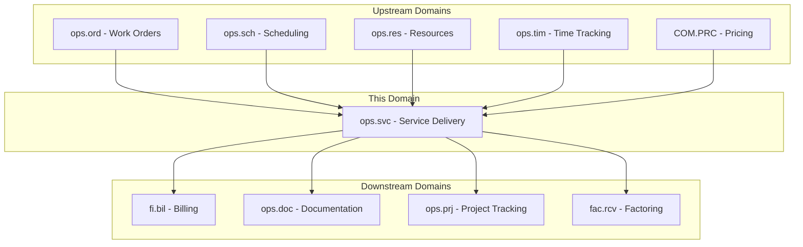
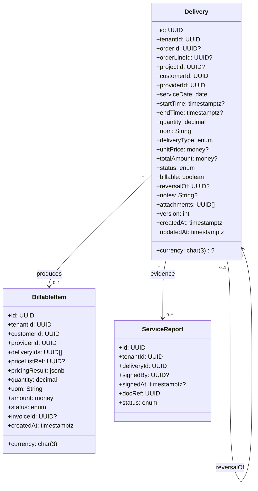
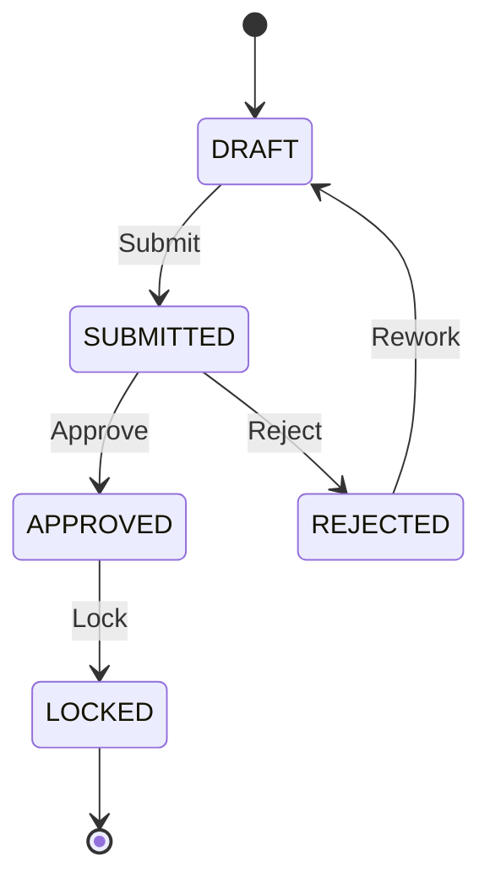
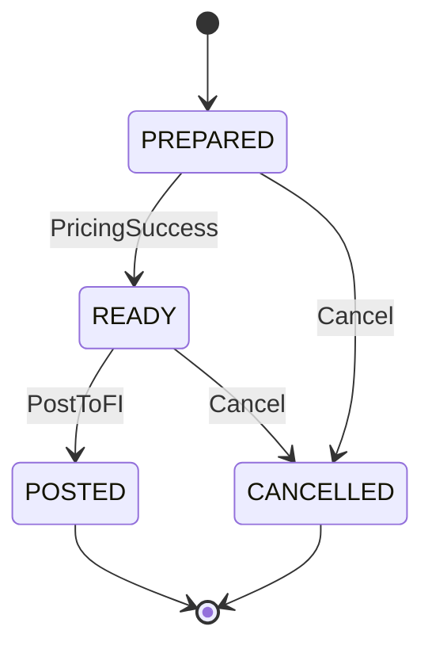
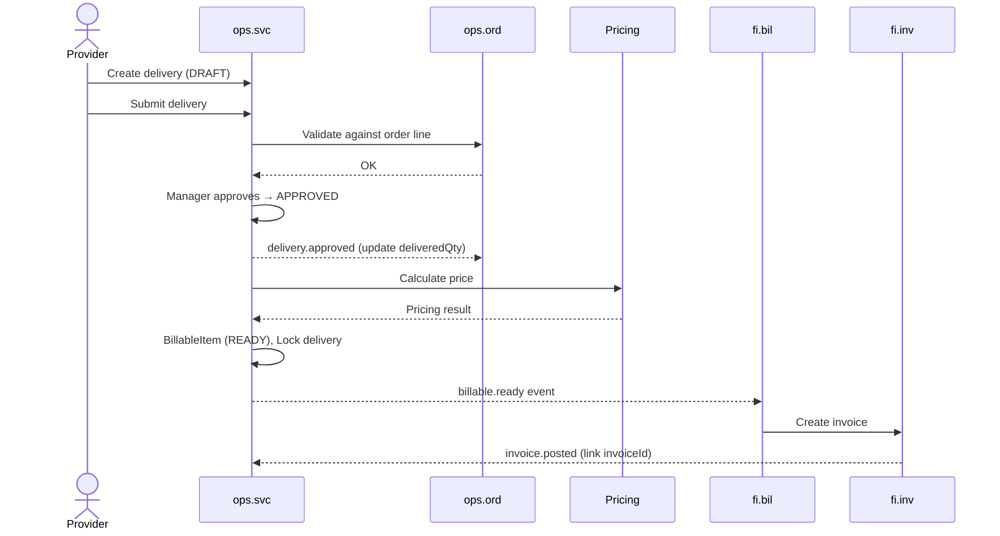
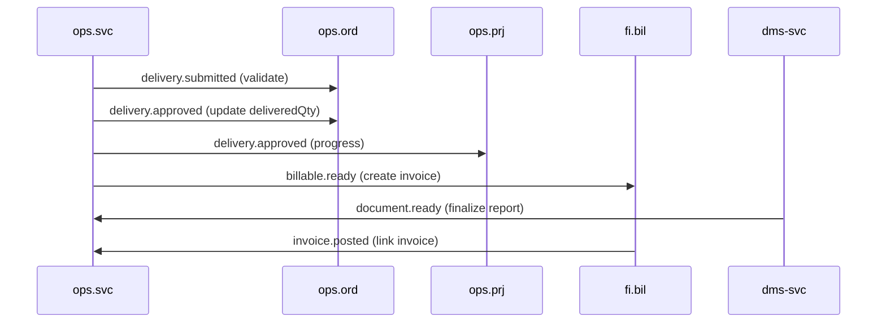
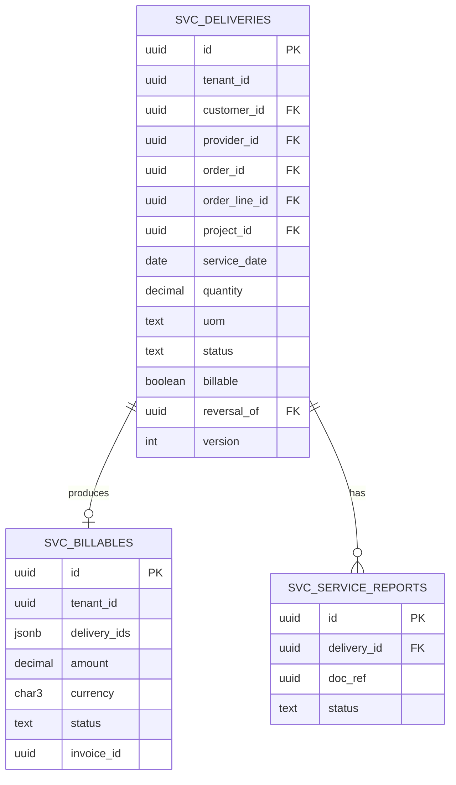

# OPS.SVC - Service Delivery Domain / Service Specification

> **Conceptual Stack Layer:** Domain / Service
> **Space:** Platform
> **Owner:** Domain Engineering Team
> **Schema alignment:** `service-layer.schema.json`
> **Companion files:** `openapi.yaml`, `*.schema.json` (event contracts)
> **Referenced by:** Platform-Feature Spec SS5 (backend dependencies), BFF Contract
> **Belongs to:** OPS Suite Spec (`_ops_suite.md`)

> **Meta Information**
> - **Version:** 2026-04-03
> - **Template:** `domain-service-spec.md` v1.0.0
> - **Template Compliance:** ~95%
> - **Author(s):** OpenLeap Architecture Team
> - **Status:** DRAFT
> - **Suite:** `ops`
> - **Domain:** `svc`
> - **Bounded Context Ref:** `bc:service-delivery`
> - **Service ID:** `ops-svc-svc`
> - **basePackage:** `io.openleap.ops.svc`
> - **API Base Path:** `/api/ops/svc/v1`
> - **OpenLeap Starter Version:** `v1`
> - **Port:** OPEN QUESTION
> - **Repository:** OPEN QUESTION
> - **Tags:** `ops`, `service-delivery`, `billable`, `delivery`, `reversal`
> - **Team:**
>   - Name: `team-ops`
>   - Email: `ops-team@openleap.io`
>   - Slack: `#ops-team`

---

## Specification Guidelines Compliance

>
> ### Non-Negotiables
> - Never invent facts. If required info is missing, add an **OPEN QUESTION** entry.
> - Preserve intent and decisions. Only change meaning when explicitly requested.
> - Do not remove normative constraints unless they are explicitly replaced.
> - Keep the spec **self-contained**: no "see chat", no implicit context.
>
> ### Source of Truth Priority
> When sources conflict:
> 1. Spec (explicit) wins
> 2. Starter specs (implementation constraints) next
> 3. Guidelines (best practices) last
>
> ### Style Guide
> - Prefer short sentences and lists.
> - Use MUST/SHOULD/MAY for normative statements.
> - Keep terminology consistent (Aggregate, Domain Service, Application Service, Command, Event).
> - Avoid ambiguous words ("often", "maybe") unless explicitly noting uncertainty.

---

## 0. Document Purpose & Scope

### 0.1 Purpose
This specification defines the Service Delivery domain within the OPS Suite. `ops.svc` captures the actual delivered services ("Leistungen") — lessons, consulting hours, field service visits — validates and approves them, and generates billable items for FI. It is the authoritative source of truth for what was delivered, when, by whom, and for whom.

### 0.2 Target Audience
- Product Owners & Business Stakeholders
- System Architects & Technical Leads
- Integration Engineers

### 0.3 Scope
**In Scope:**
- Service delivery recording (time-based, quantity-based, milestone-based)
- Delivery validation against work orders and contracts
- Approval workflow (submit → approve → lock)
- Billable item generation with pricing
- Service report attachment via DMS
- Immutable delivery records with reversal pattern for corrections

**Out of Scope:**
- Contract and price rule management (-> COM / PRC)
- Invoicing and accounts receivable (-> FI Suite)
- Payroll processing (-> HR Suite)
- Work order management (-> ops.ord)
- Resource definitions and capacity (-> ops.res)

### 0.4 Related Documents
- `_ops_suite.md` - OPS Suite overview
- `ops_ord-spec.md` - Order Management domain
- `ops_tim-spec.md` - Time Tracking domain
- `ops_doc-spec.md` - Operational Documentation domain
- `ops_res-spec.md` - Resource Management domain
- `BP_business_partner.md` - Business Partner
- `PRC_pricing.md` - Pricing Service

---

## 1. Business Context

### 1.1 Domain Purpose
`ops.svc` records the **operational reality** — what services were actually performed. It bridges the gap between "what was planned" (ops.ord) and "what should be invoiced" (FI). Every approved delivery becomes a traceable, auditable record that feeds billing, analytics, and compliance reporting.

### 1.2 Business Value
- Single source of truth for all delivered services
- Immutable audit trail supporting billing disputes and compliance
- Automated billable item generation reducing manual invoicing effort
- Reversal pattern ensuring financial integrity (no silent edits)
- Real-time delivery tracking for operations dashboards

### 1.3 Key Stakeholders

| Role | Responsibility | Primary Use Cases |
|------|----------------|-------------------|
| Service Provider | Record deliveries (teacher, consultant, technician) | UC-SVC-001 |
| Operations Manager | Approve/reject deliveries | UC-SVC-003 |
| Dispatcher | Monitor delivery status and coverage | UC-SVC-002 |
| Billing Clerk (FI) | Consume billable items for invoicing | UC-SVC-004, UC-SVC-005 |
| Customer | Receive service, sign service report | UC-SVC-006 |
| Factoring (FAC) | Consume delivery proof for receivables | (downstream) |

### 1.4 Strategic Positioning



### 1.5 Service Context

| Field | Value |
|-------|-------|
| Suite | `ops` (Operational Services) |
| Domain | `svc` (Service Delivery) |
| Bounded Context | `bc:service-delivery` |
| Service ID | `ops-svc-svc` |
| Base Package | `io.openleap.ops.svc` |
| Authoritative Sources | OPS Suite Spec (`_ops_suite.md`), Service Delivery best practices (SAP PS / Oracle Projects) |

---

## 2. Service Identity

| Field | Value |
|-------|-------|
| **Service ID** | `ops-svc-svc` |
| **Display Name** | Service Delivery Service |
| **Suite** | `ops` |
| **Domain** | `svc` |
| **Bounded Context Ref** | `bc:service-delivery` |
| **Version** | 2026-04-03 |
| **Status** | DRAFT |
| **API Base Path** | `/api/ops/svc/v1` |
| **Repository** | OPEN QUESTION |
| **Tags** | `ops`, `service-delivery`, `billable`, `delivery`, `reversal` |
| **Team Name** | `team-ops` |
| **Team Email** | `ops-team@openleap.io` |
| **Team Slack** | `#ops-team` |

---

## 3. Domain Model

### 3.1 Conceptual Overview

The domain centers on the **Delivery** aggregate — an immutable record of service performed. Approved deliveries produce **BillableItems** for FI. Deliveries may have attached **ServiceReports** as evidence (customer-signed documents stored in DMS). Corrections to locked deliveries use the reversal pattern: a negative reversal entry plus a new corrected entry.



### 3.2 Core Concepts

| Concept | Owner | Description | Glossary Ref |
|---------|-------|-------------|--------------|
| Delivery | ops-svc-svc | Immutable record of a service actually performed | Delivery (Leistung) |
| BillableItem | ops-svc-svc | Priced delivery aggregate ready for FI invoicing | Billable Item |
| ServiceReport | ops-svc-svc | Customer-signed evidence document attached to delivery | Service Report |
| Reversal | ops-svc-svc | Negative entry correcting a locked delivery | Reversal (Storno) |

### 3.3 Aggregate Definitions

#### 3.3.1 Aggregate: Delivery

**Aggregate ID:** `agg:delivery`
**Business Purpose:** Immutable record of a service actually performed. Represents: "Provider X delivered Y units of service Z to Customer A on date D."

**Aggregate Root Attributes:**

| Attribute | Type | Format | Required | Description | Example | Constraints |
|-----------|------|--------|----------|-------------|---------|-------------|
| id | UUID | uuid | Yes | Unique identifier | `a1b2c3d4-...` | Immutable after create |
| tenantId | UUID | uuid | Yes | Tenant ownership | `t1-uuid` | Immutable, RLS-enforced |
| orderId | UUID | uuid | No | Work order reference | `wo-uuid` | FK to ops.ord |
| orderLineId | UUID | uuid | No | Specific order line | `line-uuid` | FK to ops.ord line |
| projectId | UUID | uuid | No | Project reference | `prj-uuid` | FK to ops.prj |
| customerId | UUID | uuid | Yes | Customer (BP party) | `cust-uuid` | FK to bp.party, must be active |
| providerId | UUID | uuid | Yes | Service provider | `prov-uuid` | FK to bp.party, must be active |
| serviceDate | Date | ISO 8601 | Yes | Date service was performed | `2026-03-15` | Not future |
| startTime | Timestamptz | ISO 8601 | No | Service start time | `2026-03-15T09:00:00Z` | — |
| endTime | Timestamptz | ISO 8601 | No | Service end time | `2026-03-15T14:00:00Z` | > startTime |
| quantity | Decimal | (18,4) | Yes | Delivered quantity | `5.0000` | > 0 for originals, < 0 for reversals |
| uom | String | UCUM | Yes | Unit of measure | `H` (hours) | Valid UCUM code via si-unit-svc |
| deliveryType | Enum | — | Yes | Type of delivery | `TIME` | TIME, QUANTITY, MILESTONE |
| unitPrice | Money | (18,4) | No | Price per unit | `120.0000` | Resolved via pricing; nullable until priced |
| totalAmount | Money | (18,2) | No | quantity × unitPrice | `600.00` | Calculated field |
| currency | Char(3) | ISO 4217 | Cond. | Currency code | `EUR` | Required if priced |
| status | Enum | — | Yes | Lifecycle state | `DRAFT` | DRAFT, SUBMITTED, APPROVED, REJECTED, LOCKED |
| billable | Boolean | — | Yes | Whether billable | `true` | Default true |
| reversalOf | UUID | uuid | No | Delivery being reversed | `orig-uuid` | Null for originals |
| notes | String | — | No | Free-text notes | `"Strategy workshop day 1"` | Max 4000 chars |
| attachments | UUID[] | uuid[] | No | DMS document references | `["doc-uuid"]` | — |
| version | Integer | — | Yes | Optimistic locking version | `1` | Auto-incremented |
| createdAt | Timestamptz | ISO 8601 | Yes | Creation timestamp | `2026-03-15T08:30:00Z` | System-managed |
| updatedAt | Timestamptz | ISO 8601 | Yes | Last update timestamp | `2026-03-15T10:00:00Z` | System-managed |

**Lifecycle States:**



**State Transitions:**

| From | To | Trigger | Guard / Precondition | Side Effects |
|------|----|---------|---------------------|--------------|
| — | DRAFT | Create | Valid customer + provider (BR-001, BR-002) | — |
| DRAFT | SUBMITTED | Submit | quantity > 0 (BR-003), order line cap check (BR-006) | Emits `delivery.submitted` |
| SUBMITTED | APPROVED | Approve | Approver ≠ provider (BR-007), optional service report (BR-008) | Emits `delivery.approved`, notifies ops.ord |
| SUBMITTED | REJECTED | Reject | Reason required | Emits `delivery.rejected` |
| REJECTED | DRAFT | Rework | — | — |
| APPROVED | LOCKED | Lock | — | Triggers billable item generation; emits `delivery.locked` |

**Invariants:**
- INV-D-001: `customerId` and `providerId` MUST reference active parties in BP (BR-001, BR-002)
- INV-D-002: `quantity > 0` for originals, `quantity < 0` for reversals (BR-003)
- INV-D-003: LOCKED deliveries are immutable — no field changes allowed (BR-004)
- INV-D-004: If `reversalOf` is set, the referenced delivery MUST be in LOCKED state (BR-005)
- INV-D-005: If `orderLineId` is set, cumulative delivered quantity ≤ planned quantity (BR-006)
- INV-D-006: The approver (principal performing the Approve action) MUST NOT equal `providerId` (BR-007)

**Domain Events Emitted:**

| Event | Routing Key | When | Key Payload |
|-------|-------------|------|-------------|
| DeliverySubmitted | `ops.svc.delivery.submitted` | DRAFT → SUBMITTED | deliveryId, customerId, quantity, uom |
| DeliveryApproved | `ops.svc.delivery.approved` | SUBMITTED → APPROVED | deliveryId, orderId, orderLineId, quantity |
| DeliveryRejected | `ops.svc.delivery.rejected` | SUBMITTED → REJECTED | deliveryId, reason |
| DeliveryLocked | `ops.svc.delivery.locked` | APPROVED → LOCKED | deliveryId |

#### 3.3.2 Aggregate: BillableItem

**Aggregate ID:** `agg:billable-item`
**Business Purpose:** Priced delivery aggregate ready for FI invoicing. Aggregates one or more approved deliveries into an invoiceable unit.

**Aggregate Root Attributes:**

| Attribute | Type | Format | Required | Description | Example | Constraints |
|-----------|------|--------|----------|-------------|---------|-------------|
| id | UUID | uuid | Yes | Unique identifier | `bi-uuid` | Immutable |
| tenantId | UUID | uuid | Yes | Tenant ownership | `t1-uuid` | Immutable, RLS |
| customerId | UUID | uuid | Yes | Invoicing target | `cust-uuid` | FK to bp.party |
| providerId | UUID | uuid | Yes | Service performer | `prov-uuid` | FK to bp.party |
| deliveryIds | UUID[] | uuid[] | Yes | Source deliveries | `["d1-uuid"]` | Min 1, all must be APPROVED |
| priceListRef | UUID | uuid | No | Price list used | `pl-uuid` | FK to pricing |
| pricingResult | JSONB | — | Yes | Full pricing calculation | `{...}` | Set by pricing-svc |
| quantity | Decimal | (18,4) | Yes | Aggregated quantity | `10.0000` | Sum of delivery quantities |
| uom | String | UCUM | Yes | Unit of measure | `H` | Must match source deliveries |
| amount | Money | (18,2) | Yes | Total invoiceable amount | `1200.00` | >= 0 |
| currency | Char(3) | ISO 4217 | Yes | Currency | `EUR` | — |
| status | Enum | — | Yes | Lifecycle state | `PREPARED` | PREPARED, READY, POSTED, CANCELLED |
| invoiceId | UUID | uuid | No | FI invoice back-link | `inv-uuid` | Set when POSTED |
| createdAt | Timestamptz | ISO 8601 | Yes | Creation timestamp | — | System-managed |

**Lifecycle States:**



**Invariants:**
- INV-BI-001: READY only after pricing success (BR-009)
- INV-BI-002: POSTED is immutable, referenced by FI invoice
- INV-BI-003: One invoice per billable item (BR-010)

**Domain Events Emitted:**

| Event | Routing Key | When | Key Payload |
|-------|-------------|------|-------------|
| BillableItemReady | `ops.svc.billable.ready` | PREPARED → READY | billableId, customerId, amount, currency |
| BillableItemPosted | `ops.svc.billable.posted` | READY → POSTED | billableId, invoiceId |

#### 3.3.3 Entity: ServiceReport (child of Delivery)

**Business Purpose:** Evidence of delivery — customer-signed documents stored in DMS.

| Attribute | Type | Format | Required | Description | Constraints |
|-----------|------|--------|----------|-------------|-------------|
| id | UUID | uuid | Yes | Unique identifier | Immutable |
| tenantId | UUID | uuid | Yes | Tenant ownership | Immutable, RLS |
| deliveryId | UUID | uuid | Yes | Parent delivery | FK to Delivery |
| signedBy | UUID | uuid | No | Signer principal | FK to iam.principal |
| signedAt | Timestamptz | ISO 8601 | No | Signature timestamp | Set when signed |
| docRef | UUID | uuid | Yes | DMS document reference | FK to dms-svc |
| status | Enum | — | Yes | PENDING, SIGNED, VOIDED | — |

**Relationship:** Delivery `1` → `0..*` ServiceReport (one delivery may have multiple evidence documents)

### 3.4 Enumerations

| Enum | Values | Description |
|------|--------|-------------|
| DeliveryType | TIME, QUANTITY, MILESTONE | How the delivery is measured |
| DeliveryStatus | DRAFT, SUBMITTED, APPROVED, REJECTED, LOCKED | Delivery lifecycle |
| BillableStatus | PREPARED, READY, POSTED, CANCELLED | Billable item lifecycle |
| ReportStatus | PENDING, SIGNED, VOIDED | Service report lifecycle |

---

## 4. Business Rules & Constraints

### 4.1 Business Rules Catalog

| ID | Rule Name | Description | Scope | Enforcement | Error Code |
|----|-----------|-------------|-------|-------------|------------|
| BR-001 | Provider Required | Provider must be a valid, active party in BP | Delivery | Create | `SVC-VAL-001` |
| BR-002 | Customer Required | Customer must be a valid, active party in BP | Delivery | Create | `SVC-VAL-002` |
| BR-003 | Positive Quantity | quantity > 0 for originals, < 0 for reversals | Delivery | Create | `SVC-VAL-003` |
| BR-004 | Immutable After Lock | LOCKED deliveries cannot be modified | Delivery | Update | `SVC-BIZ-004` |
| BR-005 | Reversal Pattern | Corrections to LOCKED deliveries require reversal + new entry | Delivery | Correction | `SVC-BIZ-005` |
| BR-006 | Order Line Cap | Cumulative delivered qty ≤ planned quantity on order line | Delivery | Submit | `SVC-BIZ-006` |
| BR-007 | Separation of Duties | Provider cannot approve own deliveries | Delivery | Approve | `SVC-BIZ-007` |
| BR-008 | Service Report Required | If configured per customer, APPROVED requires signed ServiceReport | Delivery | Approve | `SVC-BIZ-008` |
| BR-009 | Pricing Success | BillableItem READY only after successful pricing calculation | BillableItem | Prepare | `SVC-BIZ-009` |
| BR-010 | Single Invoice | Maximum one invoice per billable item | BillableItem | Post | `SVC-BIZ-010` |

### 4.2 Detailed Rule Definitions

#### BR-004: Immutable After Lock
**Context:** Financial traceability requires that approved and locked deliveries cannot be silently edited.
**Rule Statement:** Once a Delivery reaches LOCKED status, no attribute may be changed.
**Applies To:** Delivery aggregate
**Enforcement:** Domain service rejects any update command targeting a LOCKED delivery.
**Validation Logic:** `if (delivery.status == LOCKED) throw ImmutableDeliveryException`
**Error Handling:**
- Code: `SVC-BIZ-004`
- Message: `"Delivery {id} is locked and cannot be modified. Use the reversal workflow to correct."`
- HTTP: 409 Conflict

#### BR-005: Reversal Pattern
**Context:** Industry best practice (SAP credit memo / Storno principle) — never delete financial records; create compensating entries.
**Rule Statement:** To correct a LOCKED delivery, create a reversal entry (negative quantity, `reversalOf` = original ID) then a new corrected delivery in DRAFT.
**Applies To:** Delivery aggregate
**Enforcement:** Application Service orchestrates reversal creation.
**Validation Logic:** Reversal delivery MUST have `quantity < 0`, `reversalOf` referencing a LOCKED delivery.

#### BR-007: Separation of Duties
**Context:** Internal controls for service businesses — the person who performs the service should not approve it (four-eyes principle).
**Rule Statement:** The principal executing the Approve command MUST NOT be the same as `delivery.providerId`.
**Applies To:** Delivery aggregate, Approve transition
**Enforcement:** Application Service checks `currentPrincipal != delivery.providerId`.
**Error Handling:**
- Code: `SVC-BIZ-007`
- Message: `"Provider cannot approve own delivery. Separation of duties violation."`
- HTTP: 403 Forbidden

### 4.3 Data Validation Rules

| Field | Validation Rule | Error Code | Error Message |
|-------|----------------|------------|---------------|
| customerId | Required, valid UUID, active in BP | `SVC-VAL-002` | `"Valid active customer ID is required"` |
| providerId | Required, valid UUID, active in BP | `SVC-VAL-001` | `"Valid active provider ID is required"` |
| serviceDate | Required, not future | `SVC-VAL-010` | `"Service date required and cannot be in the future"` |
| quantity | != 0, > 0 for originals, < 0 for reversals | `SVC-VAL-003` | `"Quantity must be positive (negative only for reversals)"` |
| uom | Required, valid UCUM code | `SVC-VAL-011` | `"Valid unit of measure required"` |
| endTime | > startTime if both present | `SVC-VAL-012` | `"End time must be after start time"` |
| deliveryType | Required, valid enum value | `SVC-VAL-013` | `"Valid delivery type required (TIME, QUANTITY, MILESTONE)"` |
| currency | Required if unitPrice set, valid ISO 4217 | `SVC-VAL-014` | `"Valid ISO 4217 currency code required when pricing"` |

### 4.4 Reference Data Dependencies

| Catalog | Usage | Provider Service | Validation |
|---------|-------|-----------------|------------|
| Units of Measure (UCUM) | `uom` field | si-unit-svc (T1) | Code existence check |
| Currencies (ISO 4217) | `currency` field | ref-data-svc (T1) | Code existence check |
| Business Partners | `customerId`, `providerId` | bp-party-svc (T2) | Active status check |
| Price Lists | `priceListRef` | pricing-svc (COM) | List existence check |

---

## 5. Use Cases

### 5.1 Business Logic Placement

| Layer | Responsibilities |
|-------|-----------------|
| Application Service | Command validation, aggregate loading, event publishing, orchestration (reversal workflow) |
| Domain Service | Pricing integration, order line cap validation (cross-aggregate) |
| Aggregate | State transitions, invariant enforcement, attribute validation |

### 5.2 Use Cases

#### UC-SVC-001: Record Service Delivery

| Field | Value |
|-------|-------|
| **ID** | UC-SVC-001 |
| **Type** | WRITE |
| **Trigger** | REST |
| **Aggregate** | Delivery |
| **Domain Operation** | `Delivery.create()` |
| **Inputs** | customerId, providerId, serviceDate, quantity, uom, deliveryType, orderId?, orderLineId?, projectId?, notes?, billable? |
| **Outputs** | Created Delivery in DRAFT state |
| **Events** | — (no event on DRAFT creation) |
| **REST** | `POST /api/ops/svc/v1/deliveries` → 201 Created |
| **Idempotency** | Client-generated `Idempotency-Key` header |
| **Errors** | 400 (validation), 422 (BR-001 invalid provider, BR-002 invalid customer) |

#### UC-SVC-002: Submit Delivery for Approval

| Field | Value |
|-------|-------|
| **ID** | UC-SVC-002 |
| **Type** | WRITE |
| **Trigger** | REST |
| **Aggregate** | Delivery |
| **Domain Operation** | `Delivery.submit()` |
| **Inputs** | deliveryId |
| **Outputs** | Delivery in SUBMITTED state |
| **Events** | `DeliverySubmitted` → `ops.svc.delivery.submitted` |
| **REST** | `POST /api/ops/svc/v1/deliveries/{id}:submit` → 200 OK |
| **Idempotency** | Idempotent (re-submit of SUBMITTED is no-op) |
| **Errors** | 404 (not found), 409 (not in DRAFT), 422 (BR-003 invalid quantity, BR-006 order line cap exceeded) |

#### UC-SVC-003: Approve / Reject Delivery

| Field | Value |
|-------|-------|
| **ID** | UC-SVC-003 |
| **Type** | WRITE |
| **Trigger** | REST |
| **Aggregate** | Delivery |
| **Domain Operation** | `Delivery.approve()` or `Delivery.reject(reason)` |
| **Inputs** | deliveryId, action (approve/reject), reason? |
| **Outputs** | Delivery in APPROVED or REJECTED state |
| **Events** | `DeliveryApproved` or `DeliveryRejected` |
| **REST** | `POST /api/ops/svc/v1/deliveries/{id}:approve` or `:reject` → 200 OK |
| **Idempotency** | Idempotent (re-approve of APPROVED is no-op) |
| **Errors** | 403 (BR-007 separation of duties), 404, 409 (not SUBMITTED), 422 (BR-008 service report required) |

#### UC-SVC-004: Generate Billable Item

| Field | Value |
|-------|-------|
| **ID** | UC-SVC-004 |
| **Type** | WRITE |
| **Trigger** | REST |
| **Aggregate** | BillableItem |
| **Domain Operation** | `BillableItem.prepare(deliveryIds, pricingContext)` |
| **Inputs** | deliveryIds[], pricingContext |
| **Outputs** | BillableItem in PREPARED state, then READY after pricing |
| **Events** | `BillableItemReady` → `ops.svc.billable.ready` |
| **REST** | `POST /api/ops/svc/v1/billables:prepare` → 201 Created |
| **Idempotency** | Idempotency-Key header |
| **Errors** | 422 (deliveries not APPROVED, BR-009 pricing failure) |

#### UC-SVC-005: Post Billable to FI

| Field | Value |
|-------|-------|
| **ID** | UC-SVC-005 |
| **Type** | WRITE |
| **Trigger** | REST |
| **Aggregate** | BillableItem |
| **Domain Operation** | `BillableItem.post()` |
| **Inputs** | billableId |
| **Outputs** | BillableItem in POSTED state |
| **Events** | `BillableItemPosted` → `ops.svc.billable.posted` |
| **REST** | `POST /api/ops/svc/v1/billables/{id}:post` → 200 OK |
| **Idempotency** | Idempotent (re-post of POSTED is no-op) |
| **Errors** | 409 (not READY, already POSTED), 422 (BR-010 duplicate invoice) |

#### UC-SVC-006: Correct a Locked Delivery (Reversal)

| Field | Value |
|-------|-------|
| **ID** | UC-SVC-006 |
| **Type** | WRITE |
| **Trigger** | REST |
| **Aggregate** | Delivery |
| **Domain Operation** | `Delivery.createReversal(originalId)` + `Delivery.create(corrected)` |
| **Inputs** | originalDeliveryId, correctedData |
| **Outputs** | Reversal delivery (LOCKED), new corrected delivery (DRAFT) |
| **Events** | `DeliverySubmitted`, `DeliveryApproved`, `DeliveryLocked` (reversal auto-processed) |
| **REST** | `POST /api/ops/svc/v1/deliveries/{id}:reverse` → 201 Created |
| **Idempotency** | Idempotency-Key header |
| **Errors** | 404, 409 (original not LOCKED), 422 (BR-005 validation) |

#### UC-SVC-007: List / Search Deliveries (READ)

| Field | Value |
|-------|-------|
| **ID** | UC-SVC-007 |
| **Type** | READ |
| **Trigger** | REST |
| **Aggregate** | Delivery |
| **Domain Operation** | Query projection |
| **Inputs** | customerId?, providerId?, from?, to?, status?, page, size |
| **Outputs** | Paginated delivery list |
| **Events** | — |
| **REST** | `GET /api/ops/svc/v1/deliveries?...` → 200 OK |
| **Idempotency** | Inherently idempotent (GET) |
| **Errors** | 400 (invalid filter params) |

#### UC-SVC-008: Upload and Attach Service Report

| Field | Value |
|-------|-------|
| **ID** | UC-SVC-008 |
| **Type** | WRITE |
| **Trigger** | REST |
| **Aggregate** | ServiceReport |
| **Domain Operation** | `ServiceReport.create(deliveryId)` → DMS upload → `ServiceReport.finalize()` |
| **Inputs** | deliveryId, document file |
| **Outputs** | ServiceReport with DMS docRef |
| **Events** | `ServiceReportCreated` → `ops.svc.servicereport.created` |
| **REST** | `POST /api/ops/svc/v1/deliveries/{id}/reports` → 201, then `POST /reports/{id}:finalize` → 200 |
| **Idempotency** | Idempotency-Key on initial upload |
| **Errors** | 404 (delivery not found), 422 (DMS upload failure) |

### 5.3 Process Flow Diagrams



### 5.4 Cross-Domain Workflows

**Does this domain participate in multi-service workflows?** Yes

#### Workflow: Service Delivery to Billing (SAG-OPS-001)
**Orchestration Pattern:** Choreography (EDA)
**Pattern Rationale:** Sequential flow, each step independent, eventual consistency acceptable. No compensating transactions needed — billable item creation is idempotent.

---

## 6. REST API

### 6.1 API Overview

| Field | Value |
|-------|-------|
| Base Path | `/api/ops/svc/v1` |
| Authentication | OAuth2/JWT (Bearer token) |
| Authorization | Scopes: `ops.svc:read`, `ops.svc:write`, `ops.svc:approve`, `ops.svc:admin` |
| Content Type | `application/json` |
| Versioning | URL path (`v1`) |

### 6.2 Resource Operations

#### Delivery Resource

| Endpoint | Method | Path | Summary | Role Required | Events Published |
|----------|--------|------|---------|---------------|-----------------|
| Create Delivery | POST | `/deliveries` | Record new service delivery | `ops.svc:write` | — |
| Get Delivery | GET | `/deliveries/{id}` | Retrieve delivery by ID | `ops.svc:read` | — |
| List Deliveries | GET | `/deliveries` | Search/filter deliveries | `ops.svc:read` | — |
| Update Delivery | PATCH | `/deliveries/{id}` | Update DRAFT/SUBMITTED delivery | `ops.svc:write` | — |

**Create Delivery — Request:**
```json
{
  "customerId": "cust-uuid",
  "providerId": "prov-uuid",
  "orderId": "wo-uuid",
  "orderLineId": "line-uuid",
  "serviceDate": "2026-02-20",
  "startTime": "2026-02-20T09:00:00Z",
  "endTime": "2026-02-20T14:00:00Z",
  "quantity": 5,
  "uom": "H",
  "deliveryType": "TIME",
  "billable": true,
  "notes": "Strategy workshop day 1"
}
```

**Create Delivery — Response (201 Created):**
```json
{
  "id": "del-uuid",
  "status": "DRAFT",
  "version": 1,
  "createdAt": "2026-02-20T08:30:00Z"
}
```

**Update Delivery — Headers:** `If-Match: "{version}"` (optimistic locking, 412 on conflict)

### 6.3 Business Operations

| Endpoint | Method | Path | Summary | Role Required | Events Published |
|----------|--------|------|---------|---------------|-----------------|
| Submit | POST | `/deliveries/{id}:submit` | Submit for approval | `ops.svc:write` | `DeliverySubmitted` |
| Approve | POST | `/deliveries/{id}:approve` | Approve delivery | `ops.svc:approve` | `DeliveryApproved` |
| Reject | POST | `/deliveries/{id}:reject` | Reject with reason | `ops.svc:approve` | `DeliveryRejected` |
| Lock | POST | `/deliveries/{id}:lock` | Lock approved delivery | `ops.svc:approve` | `DeliveryLocked` |
| Reverse | POST | `/deliveries/{id}:reverse` | Create reversal + correction | `ops.svc:admin` | Multiple |

**Reject — Request Body:**
```json
{ "reason": "Missing service report for customer XYZ" }
```

#### Billable Item Resource

| Endpoint | Method | Path | Summary | Role Required | Events Published |
|----------|--------|------|---------|---------------|-----------------|
| Prepare | POST | `/billables:prepare` | Create billable from deliveries | `ops.svc:write` | — |
| Mark Ready | POST | `/billables/{id}:mark-ready` | Confirm pricing | `ops.svc:write` | `BillableItemReady` |
| Post to FI | POST | `/billables/{id}:post` | Post for invoicing | `ops.svc:admin` | `BillableItemPosted` |
| Get Billable | GET | `/billables/{id}` | Retrieve billable item | `ops.svc:read` | — |

#### Service Report Resource

| Endpoint | Method | Path | Summary | Role Required |
|----------|--------|------|---------|---------------|
| Upload | POST | `/deliveries/{id}/reports` | Initiate report upload | `ops.svc:write` |
| Finalize | POST | `/reports/{id}:finalize` | Attach DMS docRef | `ops.svc:write` |

### 6.4 Error Responses

| HTTP Status | Error Code | Description |
|-------------|------------|-------------|
| 400 | `SVC-VAL-*` | Validation error (field-level) |
| 401 | — | Authentication required |
| 403 | `SVC-BIZ-007` | Forbidden (separation of duties, insufficient role) |
| 404 | — | Resource not found |
| 409 | `SVC-BIZ-004` | Conflict (invalid state transition, locked delivery) |
| 412 | — | Precondition failed (optimistic lock version mismatch) |
| 422 | `SVC-BIZ-*` | Business rule violation |

### 6.5 OpenAPI Specification
**Location:** `contracts/http/ops/svc/openapi.yaml`
**OpenAPI Version:** 3.1.0

---

## 7. Events & Integration

### 7.1 Event-Driven Architecture Pattern
**Pattern Decision:** Choreography (EDA)
**Rationale:** OPS service delivery follows a sequential flow (record → approve → price → bill) where each step is independently processable. No distributed transaction coordination needed. At-least-once delivery with idempotent consumers.

### 7.2 Published Events

**Exchange:** `ops.svc.events` (topic)

#### DeliverySubmitted
- **Routing Key:** `ops.svc.delivery.submitted`
- **Business Meaning:** A delivery has been submitted for manager approval
- **When Published:** DRAFT → SUBMITTED transition
- **Payload Schema:**
```json
{
  "deliveryId": "uuid",
  "tenantId": "uuid",
  "customerId": "uuid",
  "providerId": "uuid",
  "orderId": "uuid | null",
  "orderLineId": "uuid | null",
  "quantity": 5.0,
  "uom": "H",
  "deliveryType": "TIME",
  "serviceDate": "2026-02-20"
}
```
- **Consumers:** ops.ord (order line validation)

#### DeliveryApproved
- **Routing Key:** `ops.svc.delivery.approved`
- **Business Meaning:** A delivery has been approved — eligible for billing
- **When Published:** SUBMITTED → APPROVED transition
- **Payload Schema:**
```json
{
  "deliveryId": "uuid",
  "tenantId": "uuid",
  "customerId": "uuid",
  "providerId": "uuid",
  "orderId": "uuid | null",
  "orderLineId": "uuid | null",
  "quantity": 5.0,
  "uom": "H",
  "serviceDate": "2026-02-20",
  "billable": true
}
```
- **Consumers:** ops.ord (deliveredQty update), ops.prj (progress tracking), analytics

#### DeliveryRejected
- **Routing Key:** `ops.svc.delivery.rejected`
- **Business Meaning:** A delivery has been rejected by the manager
- **When Published:** SUBMITTED → REJECTED transition
- **Payload Schema:** `{ "deliveryId": "uuid", "tenantId": "uuid", "providerId": "uuid", "reason": "string" }`
- **Consumers:** Notification service

#### DeliveryLocked
- **Routing Key:** `ops.svc.delivery.locked`
- **Business Meaning:** A delivery has been locked and is now immutable
- **When Published:** APPROVED → LOCKED transition
- **Payload Schema:** `{ "deliveryId": "uuid", "tenantId": "uuid" }`
- **Consumers:** Audit

#### BillableItemReady
- **Routing Key:** `ops.svc.billable.ready`
- **Business Meaning:** A priced billable item is ready for FI invoicing
- **When Published:** PREPARED → READY transition
- **Payload Schema:**
```json
{
  "billableId": "uuid",
  "tenantId": "uuid",
  "customerId": "uuid",
  "amount": 1200.00,
  "currency": "EUR",
  "deliveryIds": ["uuid"]
}
```
- **Consumers:** fi.bil (invoice creation)

#### BillableItemPosted
- **Routing Key:** `ops.svc.billable.posted`
- **Business Meaning:** A billable item has been posted to FI
- **When Published:** READY → POSTED transition
- **Payload Schema:** `{ "billableId": "uuid", "tenantId": "uuid", "invoiceId": "uuid" }`
- **Consumers:** Audit

#### ServiceReportCreated
- **Routing Key:** `ops.svc.servicereport.created`
- **Business Meaning:** A service report has been attached to a delivery
- **When Published:** Report finalized
- **Payload Schema:** `{ "reportId": "uuid", "deliveryId": "uuid", "docRef": "uuid" }`
- **Consumers:** ops.doc (documentation index)

### 7.3 Consumed Events

| Source Event | Source Service | Handler | Purpose | Queue |
|-------------|---------------|---------|---------|-------|
| `ops.sch.assignment.updated` | ops.sch | ScheduleAssignmentHandler | Link delivery to schedule confirmation | `ops.svc.in.ops.sch.assignment` |
| `ops.res.resource.updated` | ops.res | ResourceCacheHandler | Update provider cache | `ops.svc.in.ops.res.resource` |
| `dms.document.ready` | dms-svc (T1) | DocumentReadyHandler | Finalize service report docRef | `ops.svc.in.dms.document` |
| `fi.inv.invoice.posted` | fi.inv | InvoicePostedHandler | Link invoiceId to BillableItem | `ops.svc.in.fi.inv.invoice` |

### 7.4 Event Flow Diagrams



### 7.5 Integration Points Summary

**Upstream Dependencies:**

| Service | Tier | Purpose | Type | Criticality | Fallback |
|---------|------|---------|------|-------------|----------|
| ops-ord-svc | T3 | Order line validation | REST API | Medium | Reject if unavailable |
| pricing-svc | T3 | Price calculation | REST API | High | Fallback price + flag for review |
| bp-party-svc | T2 | Customer/provider validation | REST + Cache | High | Use cached data |
| si-unit-svc | T1 | UoM validation | REST + Cache | Low | Use cached data |
| dms-svc | T1 | Document upload (presigned) | REST | Medium | Queue upload for retry |

**Downstream Consumers:**

| Service | Tier | Purpose | Type | SLA |
|---------|------|---------|------|-----|
| fi.bil | T3 | Invoice creation from billable items | Event | < 5s processing |
| ops.ord | T3 | Fulfillment tracking (deliveredQty) | Event | < 5s processing |
| ops.prj | T3 | Project progress tracking | Event | < 10s processing |
| ops.doc | T3 | Documentation index | Event | < 10s processing |
| fac.rcv | T3 | Factoring / receivables proof | Event | < 30s processing |

---

## 8. Data Model

### 8.1 Storage Technology

| Aspect | Choice |
|--------|--------|
| Database | PostgreSQL 16+ |
| Multi-tenancy | `tenant_id` column + PostgreSQL RLS |
| Soft Delete | No — LOCKED deliveries are immutable; corrections use reversal pattern |
| Audit Trail | All status transitions logged via iam.audit events |
| Outbox | `svc_outbox_events` table for reliable event publishing |

### 8.2 Conceptual Data Model



### 8.3 Table Definitions

#### Table: `svc_deliveries`

| Column | Type | Nullable | Default | Description | Constraints |
|--------|------|----------|---------|-------------|-------------|
| id | uuid | NOT NULL | `OlUuid.create()` | Primary key | PK |
| tenant_id | uuid | NOT NULL | — | Tenant discriminator | RLS policy |
| customer_id | uuid | NOT NULL | — | Customer party reference | FK logical to bp.party |
| provider_id | uuid | NOT NULL | — | Provider party reference | FK logical to bp.party |
| order_id | uuid | NULL | — | Work order reference | FK logical to ops.ord |
| order_line_id | uuid | NULL | — | Order line reference | FK logical to ops.ord line |
| project_id | uuid | NULL | — | Project reference | FK logical to ops.prj |
| service_date | date | NOT NULL | — | Date of service | CHECK(service_date <= CURRENT_DATE) |
| start_time | timestamptz | NULL | — | Service start | — |
| end_time | timestamptz | NULL | — | Service end | CHECK(end_time > start_time) |
| quantity | numeric(18,4) | NOT NULL | — | Delivered quantity | CHECK(quantity != 0) |
| uom | text | NOT NULL | — | UCUM unit code | — |
| delivery_type | text | NOT NULL | — | TIME/QUANTITY/MILESTONE | CHECK(delivery_type IN (...)) |
| unit_price | numeric(18,4) | NULL | — | Price per unit | — |
| total_amount | numeric(18,2) | NULL | — | Calculated total | — |
| currency | char(3) | NULL | — | ISO 4217 | — |
| status | text | NOT NULL | `'DRAFT'` | Lifecycle state | CHECK(status IN ('DRAFT','SUBMITTED','APPROVED','REJECTED','LOCKED')) |
| billable | boolean | NOT NULL | true | Billable flag | — |
| billable_item_id | uuid | NULL | — | Back-link to billable | FK to svc_billables |
| reversal_of | uuid | NULL | — | Reversed delivery | FK to svc_deliveries |
| notes | text | NULL | — | Free-text notes | MAX 4000 |
| attachments | uuid[] | NULL | — | DMS document refs | — |
| version | integer | NOT NULL | 1 | Optimistic lock | — |
| created_at | timestamptz | NOT NULL | `now()` | Creation timestamp | — |
| updated_at | timestamptz | NOT NULL | `now()` | Last update | — |

**Indexes:**
| Index Name | Columns | Type | Condition |
|------------|---------|------|-----------|
| idx_svc_del_tenant_cust_date | (tenant_id, customer_id, service_date) | btree | — |
| idx_svc_del_tenant_prov_date | (tenant_id, provider_id, service_date) | btree | — |
| idx_svc_del_tenant_status | (tenant_id, status) | btree | — |
| idx_svc_del_order | (order_id) | btree | WHERE order_id IS NOT NULL |

#### Table: `svc_billables`

| Column | Type | Nullable | Default | Description | Constraints |
|--------|------|----------|---------|-------------|-------------|
| id | uuid | NOT NULL | `OlUuid.create()` | Primary key | PK |
| tenant_id | uuid | NOT NULL | — | Tenant discriminator | RLS policy |
| customer_id | uuid | NOT NULL | — | Invoicing target | — |
| provider_id | uuid | NOT NULL | — | Service performer | — |
| delivery_ids | jsonb | NOT NULL | — | Source delivery UUIDs | — |
| price_list_ref | uuid | NULL | — | Price list used | — |
| pricing_result | jsonb | NOT NULL | — | Pricing calculation details | — |
| quantity | numeric(18,4) | NOT NULL | — | Aggregated quantity | — |
| uom | text | NOT NULL | — | Unit of measure | — |
| amount | numeric(18,2) | NOT NULL | — | Total amount | CHECK(amount >= 0) |
| currency | char(3) | NOT NULL | — | ISO 4217 | — |
| status | text | NOT NULL | `'PREPARED'` | Lifecycle state | CHECK(status IN ('PREPARED','READY','POSTED','CANCELLED')) |
| invoice_id | uuid | NULL | — | FI invoice back-link | — |
| created_at | timestamptz | NOT NULL | `now()` | Creation timestamp | — |

**Indexes:**
| Index Name | Columns | Type | Condition |
|------------|---------|------|-----------|
| idx_svc_bil_tenant_cust | (tenant_id, customer_id) | btree | — |
| idx_svc_bil_invoice | (tenant_id, invoice_id) | btree unique | WHERE invoice_id IS NOT NULL |

#### Table: `svc_service_reports`

| Column | Type | Nullable | Default | Description | Constraints |
|--------|------|----------|---------|-------------|-------------|
| id | uuid | NOT NULL | `OlUuid.create()` | Primary key | PK |
| tenant_id | uuid | NOT NULL | — | Tenant discriminator | RLS policy |
| delivery_id | uuid | NOT NULL | — | Parent delivery | FK to svc_deliveries |
| signed_by | uuid | NULL | — | Signer principal | — |
| signed_at | timestamptz | NULL | — | Signature timestamp | — |
| doc_ref | uuid | NOT NULL | — | DMS document reference | — |
| status | text | NOT NULL | `'PENDING'` | PENDING/SIGNED/VOIDED | — |

#### Table: `svc_outbox_events`

Standard outbox pattern per platform guidelines (ADR-013).

### 8.4 Reference Data Dependencies

| Reference Data | Source | Usage |
|----------------|--------|-------|
| UCUM unit codes | si-unit-svc (T1) | `uom` validation |
| ISO 4217 currencies | ref-data-svc (T1) | `currency` validation |
| Business Partner parties | bp-party-svc (T2) | `customer_id`, `provider_id` validation |

### 8.5 Data Retention

| Entity | Retention Period | Legal Basis | Action After Expiry |
|--------|-----------------|-------------|---------------------|
| Deliveries | 10 years | Financial audit, tax regulations | Archive then delete |
| Billable Items | As long as linked invoice exists | Invoicing traceability | Delete with invoice |
| Service Reports | 10 years | Service evidence | Archive then delete |
| Outbox Events | 30 days after publish | Operational | Delete |

---

## 9. Security & Compliance

### 9.1 Data Classification

| Data Element | Classification | Protection |
|--------------|----------------|------------|
| Delivery ID, status | Public | None |
| Customer/Provider IDs | Internal | RLS, access control |
| Pricing data (unitPrice, amount) | Restricted | Encryption at rest, RBAC, audit |
| Service reports | Confidential | DMS encryption, access control |

### 9.2 Access Control

**Roles & Permissions Matrix:**

| Role | Read | Create | Update | Submit | Approve | Lock | Billables | Admin |
|------|------|--------|--------|--------|---------|------|-----------|-------|
| SVC_PROVIDER | Own | ✓ | Own DRAFT | ✓ | ✗ | ✗ | ✗ | ✗ |
| SVC_APPROVER | Team | ✗ | ✗ | ✗ | ✓ | ✓ | ✗ | ✗ |
| SVC_MANAGER | All | ✓ | ✓ | ✓ | ✓ | ✓ | ✓ | ✗ |
| SVC_ADMIN | All | ✓ | ✓ | ✓ | ✓ | ✓ | ✓ | ✓ |

### 9.3 Compliance Requirements

| Regulation | Requirement | Implementation |
|------------|-------------|----------------|
| GDPR | Provider and customer data are personal data references | Tenant-scoped RLS, GDPR export via IAM suite |
| SOX | Financial traceability of delivered services | Immutable records, reversal pattern, audit trail |
| Tax | Delivery records as primary documents | 10-year retention, immutability |
| Labour | Working time documentation | Integration with ops.tim for time-based deliveries |

### 9.4 Audit Trail

| Aspect | Implementation |
|--------|----------------|
| Who | `currentPrincipal` from JWT token |
| What | Status transition (from → to) + changed fields |
| When | Timestamped event |
| Old/New Value | Captured in domain event payload |
| Retention | 10 years (aligned with delivery retention) |
| Legal Basis | Financial audit requirements, SOX compliance |

---

## 10. Quality Attributes

### 10.1 Performance Requirements

| Operation | Target (p95) | Notes |
|-----------|-------------|-------|
| Read (GET single) | < 100ms | — |
| List (GET with filters) | < 300ms | Paginated, max 100 per page |
| Write (create/update) | < 200ms | — |
| Submit → Approve | < 1s | Includes order line validation |
| Billable prepare (100 deliveries) | < 2s | Includes pricing call |

### 10.2 Throughput

| Metric | Target |
|--------|--------|
| Peak deliveries/day | 1,000,000 |
| Peak events/second | 500 |
| Concurrent users | 10,000 |

### 10.3 Availability

| Metric | Target |
|--------|--------|
| Uptime SLA | 99.9% |
| Planned maintenance window | Sunday 02:00-04:00 UTC |

### 10.4 Recovery Objectives

| Metric | Target |
|--------|--------|
| RTO (Recovery Time Objective) | < 15 minutes |
| RPO (Recovery Point Objective) | < 5 minutes |
| Failure mode | Idempotent events + reliable outbox pattern |

### 10.5 Scalability

| Aspect | Strategy |
|--------|----------|
| Horizontal scaling | Stateless application instances behind load balancer |
| Database scaling | Read replicas for query load, partitioning by tenant_id for large tenants |
| Event throughput | Partitioned topic by tenant_id |

### 10.6 Maintainability

| Aspect | Implementation |
|--------|----------------|
| API versioning | URL path versioning (`/v1`), backward-compatible changes within version |
| Schema evolution | Event schema versioning with backward compatibility |
| Monitoring | Trace: deliveryId → billableItemId → invoiceId |
| Key metrics | delivery rate, approval rate, billing lag, rejection rate |
| Alerts | Approval queue > 100, billing failure > 1%, DLQ depth > 0 |

---

## 11. Feature Dependencies

### 11.1 Purpose
This section answers: "Which features depend on this service?" It is the inverse of Platform-Feature Spec SS5 and helps the domain team assess the blast radius of API changes.

### 11.2 Feature Dependency Register

> **OPEN QUESTION:** Feature dependencies will be populated when feature specs (Phase 3) are authored for the OPS suite. The following is a preliminary mapping based on expected feature compositions.

| Feature ID | Feature Name | Suite | Tier | Dependency Type | Status |
|------------|-------------|-------|------|-----------------|--------|
| F-OPS-TBD | Record Delivery | ops | core | sync_api | planned |
| F-OPS-TBD | Approve Delivery | ops | core | sync_api | planned |
| F-OPS-TBD | Billable Generation | ops | supporting | sync_api + async_event | planned |
| F-OPS-TBD | Service Report Upload | ops | supporting | sync_api | planned |

---

## 12. Extension Points

### 12.1 Purpose
Extension points follow the Open-Closed Principle: the service is open for extension via events and hooks but closed for direct modification.

### 12.2 Extension Events

| Event ID | Routing Key | Trigger | Payload | Purpose |
|----------|-------------|---------|---------|---------|
| EXT-SVC-001 | `ops.svc.delivery.approved` | Delivery approved | Full delivery snapshot | External systems can react to approvals (e.g., client portal notification) |
| EXT-SVC-002 | `ops.svc.billable.ready` | Billable ready | Billable item details | External billing systems can consume billable items |

### 12.3 Aggregate Hooks

| Hook ID | Aggregate | Lifecycle Point | Hook Type | Description |
|---------|-----------|-----------------|-----------|-------------|
| HOOK-SVC-001 | Delivery | Pre-Submit | validation | Custom validation rules per tenant (e.g., mandatory fields, custom checks) |
| HOOK-SVC-002 | Delivery | Post-Approve | notification | Custom notification channels (SMS, email, webhook) |
| HOOK-SVC-003 | BillableItem | Pre-Prepare | enrichment | Custom pricing enrichment (discounts, surcharges) |

**Design Rules:**
- Hooks are fire-and-forget (notification) or bounded-timeout (validation: 2s, enrichment: 5s)
- Validation hooks fail-closed (block on timeout)
- Notification hooks fail-open (log and continue)
- Hooks do not modify aggregate state directly

### 12.4 Extension Points Summary

| ID | Type | Aggregate | Lifecycle Point | Fail Mode | Timeout |
|----|------|-----------|-----------------|-----------|---------|
| EXT-SVC-001 | event | Delivery | approved | n/a | n/a |
| EXT-SVC-002 | event | BillableItem | ready | n/a | n/a |
| HOOK-SVC-001 | validation | Delivery | pre-submit | fail-closed | 2s |
| HOOK-SVC-002 | notification | Delivery | post-approve | fail-open | 5s |
| HOOK-SVC-003 | enrichment | BillableItem | pre-prepare | fail-open | 5s |

---

## 13. Migration & Evolution

### 13.1 Data Migration

**Legacy Source:** No direct legacy migration. New greenfield service.

### 13.2 Deprecation & Sunset

| Deprecated Feature | Replacement | Removal Timeline | Communication Plan |
|-------------------|-------------|------------------|-------------------|
| — | — | — | — |

### 13.3 Future Extensions

- IoT usage ingestion for automated delivery recording
- Usage-based billing models (metered services)
- Automatic pricing suggestions based on historical data
- Anomaly detection for unusual delivery patterns
- Mobile offline delivery recording with sync-on-reconnect

---

## 14. Decisions & Open Questions

### 14.1 Consistency Checks

| Check | Status | Notes |
|-------|--------|-------|
| Every WRITE endpoint maps to exactly one use case | ✓ | UC-SVC-001 through UC-SVC-008 |
| Events in use cases appear in §7 with schema refs | ✓ | All events documented |
| Business rules referenced in aggregate invariants | ✓ | BR-001 through BR-010 |
| All aggregates have lifecycle states + transitions | ✓ | Delivery and BillableItem |

### 14.2 Decisions & Conflicts

| ID | Conflict Description | Resolution | Rationale |
|----|---------------------|------------|-----------|
| D-001 | Reversal vs. edit for corrections | Reversal pattern | Financial audit trail, SAP best practice |
| D-002 | Sync vs. async for billing | Async (event) | Eventual consistency acceptable, decouples services |
| D-003 | Pricing inline vs. separate call | Separate REST call to pricing-svc | Pricing rules complex, owned by COM suite |

### 14.3 Open Questions

| ID | Question | Why It Matters | Suggested Options | Owner |
|----|----------|----------------|-------------------|-------|
| OQ-001 | Should service reports require digital signatures or accept scanned PDFs? | Compliance, UX | 1) Digital only, 2) Both, 3) Configurable per customer | Product Owner |
| OQ-002 | Should billable items support partial invoicing (partial quantity)? | Complex billing scenarios | 1) Full only, 2) Partial allowed | Finance team |
| OQ-003 | Port assignment for ops-svc-svc | Deployment | Follow platform port registry | Architecture Team |

### 14.4 Architecture Decision Records

#### ADR-OPS-SVC-001: Immutable Deliveries with Reversal Pattern

**Status:** Accepted

**Context:** Deliveries feed billing and must support complete audit trails. Corrections are common in service delivery (wrong hours, wrong customer, wrong date).

**Decision:** Make approved/locked deliveries immutable. Corrections via reversal entry (negative quantity, `reversalOf` = original ID) plus a new corrected delivery in DRAFT.

**Rationale:**
- Complete audit trail for financial compliance (SOX, tax)
- Supports billing dispute resolution with full history
- Follows industry best practice (SAP credit memo / Storno principle)

**Consequences:**
- Positive: Complete audit trail, no data loss, supports billing disputes
- Negative: More complex queries (must sum reversals), additional storage

---

## 15. Appendix

### 15.1 Glossary

| Term | Definition | Aliases |
|------|------------|---------|
| Delivery | Record of service actually performed | Service Delivery, Leistung |
| Billable Item | Priced delivery ready for invoicing | Billing Item |
| Service Report | Document evidence of delivery | Delivery Note, Proof |
| Reversal | Negative entry to correct a locked delivery | Correction, Storno |
| Order Line Cap | Maximum deliverable quantity per work order line | — |
| Separation of Duties | Principle requiring different people for service delivery and approval | Four-eyes principle |

### 15.2 References

| Type | Reference |
|------|-----------|
| Business | OPS Suite Spec (`_ops_suite.md`) |
| Technical | OpenLeap Starter (ADR-002 CQRS, ADR-013 Outbox, ADR-014 At-least-once) |
| External | UCUM (units of measure), ISO 4217 (currencies), SAP PS module (service delivery patterns) |
| Schema | `contracts/http/ops/svc/openapi.yaml`, `contracts/events/ops/svc/*.schema.json` |

### 15.3 Change Log

| Date | Version | Author | Changes |
|------|---------|--------|---------|
| 2026-04-03 | 3.0 | Architecture Team | Full template compliance restructure — added §2 Service Identity, canonical UC format, §11 Feature Dependencies, §12 Extension Points, formal table definitions in §8, error codes |
| 2026-02-23 | 2.0 | Architecture Team | Rewritten to conform to domain-service-spec template |
| 2025-12-05 | 1.0 | Architecture Team | Initial specification |

### 15.4 Document Review & Approval

**Status:** DRAFT

| Role | Reviewer | Date | Status |
|------|----------|------|--------|
| Product Owner | — | — | Pending |
| Architecture Lead | — | — | Pending |
| CTO/VP Engineering | — | — | Pending |

**Approval:**
- [ ] Product Owner approved
- [ ] Architecture Lead approved
