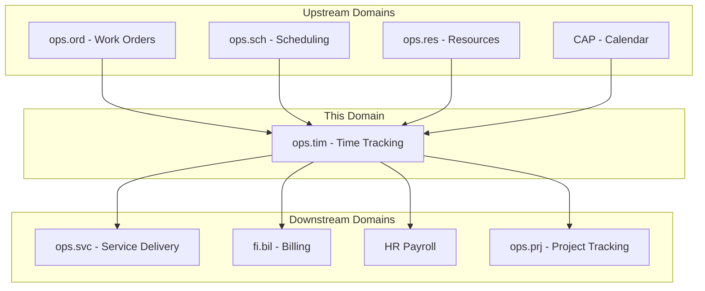
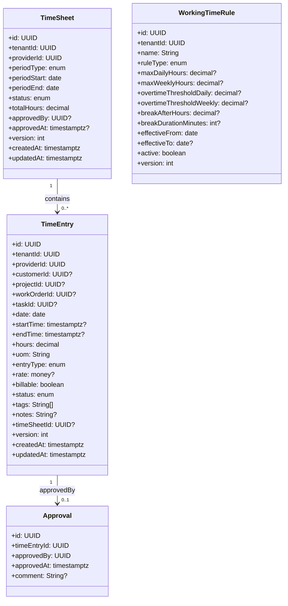
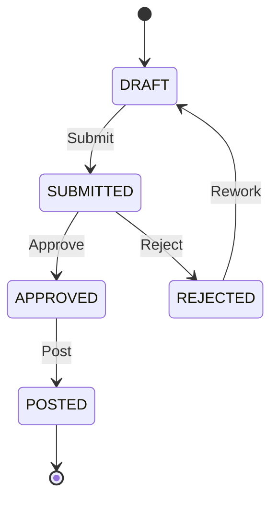
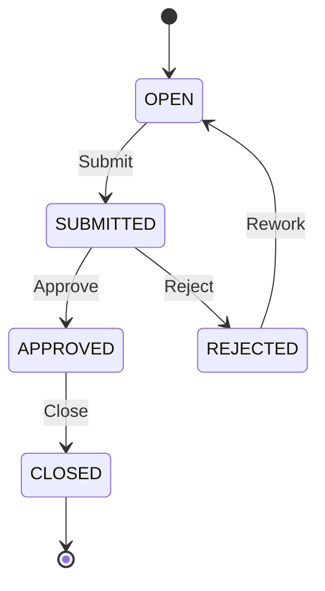
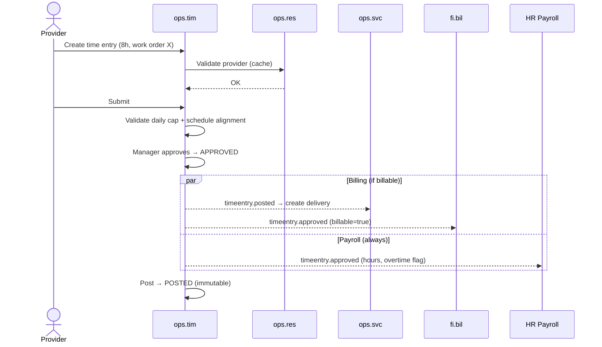
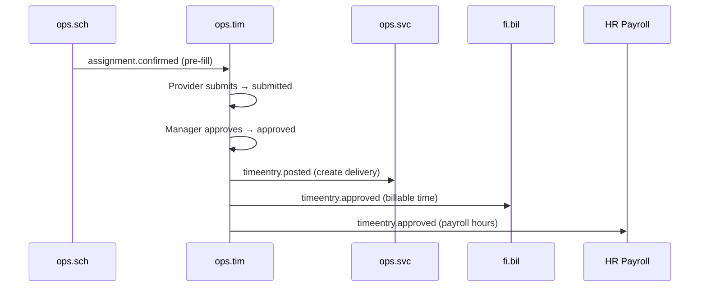
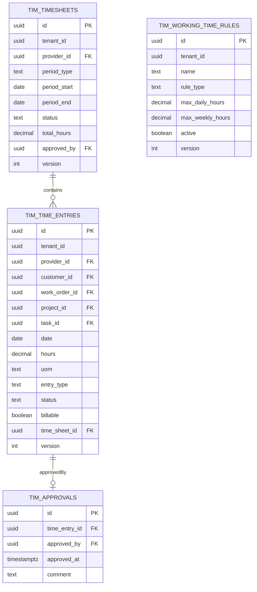

# OPS.TIM - Time Tracking Domain / Service Specification

> **Conceptual Stack Layer:** Domain / Service
> **Space:** Platform
> **Owner:** Domain Engineering Team
> **Schema alignment:** `service-layer.schema.json`
> **Companion files:** `openapi.yaml`, `*.schema.json` (event contracts)
> **Referenced by:** Platform-Feature Spec SS5 (backend dependencies), BFF Contract
> **Belongs to:** OPS Suite Spec (`_ops_suite.md`)

> **Meta Information**
> - **Version:** 2026-04-03
> - **Template:** `domain-service-spec.md` v1.0.0
> - **Template Compliance:** ~95%
> - **Author(s):** OpenLeap Architecture Team
> - **Status:** DRAFT
> - **Suite:** `ops`
> - **Domain:** `tim`
> - **Bounded Context Ref:** `bc:time-tracking`
> - **Service ID:** `ops-tim-svc`
> - **basePackage:** `io.openleap.ops.tim`
> - **API Base Path:** `/api/ops/tim/v1`
> - **OpenLeap Starter Version:** `v1`
> - **Port:** OPEN QUESTION
> - **Repository:** OPEN QUESTION
> - **Tags:** `ops`, `time-tracking`, `timesheet`, `working-time`, `approval`
> - **Team:**
>   - Name: `team-ops`
>   - Email: `ops-team@openleap.io`
>   - Slack: `#ops-team`

---

## Specification Guidelines Compliance

>
> ### Non-Negotiables
> - Never invent facts. If required info is missing, add an **OPEN QUESTION** entry.
> - Preserve intent and decisions. Only change meaning when explicitly requested.
> - Do not remove normative constraints unless they are explicitly replaced.
> - Keep the spec **self-contained**: no "see chat", no implicit context.
>
> ### Source of Truth Priority
> When sources conflict:
> 1. Spec (explicit) wins
> 2. Starter specs (implementation constraints) next
> 3. Guidelines (best practices) last
>
> ### Style Guide
> - Prefer short sentences and lists.
> - Use MUST/SHOULD/MAY for normative statements.
> - Keep terminology consistent (Aggregate, Domain Service, Application Service, Command, Event).
> - Avoid ambiguous words ("often", "maybe") unless explicitly noting uncertainty.

---

## 0. Document Purpose & Scope

### 0.1 Purpose
This specification defines the Time Tracking domain within the OPS Suite. `ops.tim` captures working time and service time entries, validates them against schedules and work orders, and exposes approved time to billing (fi.bil) and optionally payroll (HR). It serves the dual purpose of customer billing and employee compensation.

### 0.2 Target Audience
- Product Owners & Business Stakeholders
- System Architects & Technical Leads
- Integration Engineers

### 0.3 Scope
**In Scope:**
- Time entry creation (manual, start/stop timer, imported from external systems)
- Time validation against work orders, schedules, and capacity
- Approval workflow (submit → approve → lock)
- TimeSheet aggregation (weekly/monthly collection of time entries)
- Working time rule management (overtime rules, break rules)
- Conversion of approved time to ops.svc deliveries (configurable)
- Direct billable item generation for fi.bil
- Payroll data export to HR

**Out of Scope:**
- Pay rules and salary calculation (HR Suite)
- Invoicing (FI Suite)
- Delivery management (ops.svc — time is converted to delivery)
- Attendance/biometric hardware integration (future)
- Resource definitions and capacity (ops.res)

### 0.4 Related Documents
- `_ops_suite.md` - OPS Suite overview
- `ops_svc-spec.md` - Service Delivery domain
- `ops_ord-spec.md` - Order Management domain
- `ops_sch-spec.md` - Scheduling domain
- `ops_res-spec.md` - Resource Management domain
- `HR_core.md` - Human Resources
- `CAP_calendar_planning.md` - Calendar & Planning

---

## 1. Business Context

### 1.1 Domain Purpose
`ops.tim` is the system of record for **how much time was spent on work**. It captures both billable time (customer-facing) and non-billable time (internal, training, admin). Approved time entries feed two critical downstream processes: customer billing (via ops.svc or directly fi.bil) and employee payroll (via HR).

### 1.2 Business Value
- Accurate time capture for billing and payroll accuracy
- Dual-purpose entries serving both customer billing and employee compensation
- Approval workflow ensuring manager oversight before financial impact
- Schedule-aware validation preventing impossible time entries
- Real-time visibility into working hours and utilization
- Working time rule enforcement for overtime and break compliance

### 1.3 Key Stakeholders

| Role | Responsibility | Primary Use Cases |
|------|----------------|-------------------|
| Service Provider | Record daily time entries (manual or timer) | UC-TIM-001, UC-TIM-002 |
| Supervisor / Manager | Approve/reject time entries and timesheets | UC-TIM-004 |
| Billing Clerk | Consume approved billable time for invoicing | UC-TIM-005 |
| HR / Payroll | Consume approved time for salary and overtime | UC-TIM-006 |
| Operations Manager | Monitor utilization and productivity | UC-TIM-008 |

### 1.4 Strategic Positioning



### 1.5 Service Context

| Field | Value |
|-------|-------|
| Suite | `ops` (Operational Services) |
| Domain | `tim` (Time Tracking) |
| Bounded Context | `bc:time-tracking` |
| Service ID | `ops-tim-svc` |
| Base Package | `io.openleap.ops.tim` |
| Authoritative Sources | OPS Suite Spec (`_ops_suite.md`), Time tracking best practices (SAP CATS / Harvest / Toggl) |

---

## 2. Service Identity

| Field | Value |
|-------|-------|
| **Service ID** | `ops-tim-svc` |
| **Display Name** | Time Tracking Service |
| **Suite** | `ops` |
| **Domain** | `tim` |
| **Bounded Context Ref** | `bc:time-tracking` |
| **Version** | 2026-04-03 |
| **Status** | DRAFT |
| **API Base Path** | `/api/ops/tim/v1` |
| **Repository** | OPEN QUESTION |
| **Tags** | `ops`, `time-tracking`, `timesheet`, `working-time`, `approval` |
| **Team Name** | `team-ops` |
| **Team Email** | `ops-team@openleap.io` |
| **Team Slack** | `#ops-team` |

---

## 3. Domain Model

### 3.1 Conceptual Overview

The domain centers on three aggregates. The **TimeEntry** is the core aggregate — a record of time spent by a provider on a specific work order, project, or internal activity. Time entries go through an approval workflow (DRAFT → SUBMITTED → APPROVED → POSTED). The **TimeSheet** aggregate collects time entries into weekly or monthly periods for batch submission and approval. **WorkingTimeRule** defines overtime thresholds, break rules, and maximum daily/weekly hours per tenant or resource group.



### 3.2 Core Concepts

| Concept | Owner | Description | Glossary Ref |
|---------|-------|-------------|--------------|
| TimeEntry | ops-tim-svc | Record of time spent on work by a provider; dual-purpose for billing and payroll | Time Entry |
| TimeSheet | ops-tim-svc | Weekly/monthly collection of time entries for batch submission and approval | Timesheet |
| WorkingTimeRule | ops-tim-svc | Configurable rules for overtime, breaks, and maximum working hours | Working Time Rule |
| Approval | ops-tim-svc | Manager sign-off on a time entry, required before billing/payroll | Approval |

### 3.3 Aggregate Definitions

#### 3.3.1 Aggregate: TimeEntry

**Aggregate ID:** `agg:time-entry`
**Business Purpose:** Record of time spent on work by a provider. Dual-purpose: serves both billing (customer) and payroll (employee). Supports manual entry, start/stop timer, and import from external systems.

**Aggregate Root Attributes:**

| Attribute | Type | Format | Required | Description | Example | Constraints |
|-----------|------|--------|----------|-------------|---------|-------------|
| id | UUID | uuid | Yes | Unique identifier | `a1b2c3d4-...` | Immutable after create |
| tenantId | UUID | uuid | Yes | Tenant ownership | `t1-uuid` | Immutable, RLS-enforced |
| providerId | UUID | uuid | Yes | Worker who logged time | `prov-uuid` | FK to ops.res / bp.party, must be active |
| customerId | UUID | uuid | No | Customer (if billable) | `cust-uuid` | FK to bp.party |
| projectId | UUID | uuid | No | Project reference | `prj-uuid` | FK to ops.prj |
| workOrderId | UUID | uuid | No | Work order reference | `wo-uuid` | FK to ops.ord |
| taskId | UUID | uuid | No | Task reference | `task-uuid` | FK to ops.ord task |
| date | Date | ISO 8601 | Yes | Date of work | `2026-03-15` | Not future |
| startTime | Timestamptz | ISO 8601 | No | Clock-in time | `2026-03-15T09:00:00Z` | Required for TIMER entry type |
| endTime | Timestamptz | ISO 8601 | No | Clock-out time | `2026-03-15T17:00:00Z` | > startTime if both present |
| hours | Decimal | (8,2) | Yes | Hours worked | `8.00` | > 0, <= 24 |
| uom | String | UCUM | Yes | Unit of measure | `H` | Default "H" (hours) |
| entryType | Enum | — | Yes | How time was captured | `MANUAL` | MANUAL, TIMER, SCHEDULE_PREFILL, IMPORT |
| rate | Money | (18,4) | No | Hourly rate | `85.0000` | Resolved via pricing; nullable until priced |
| billable | Boolean | — | Yes | Billable to customer? | `true` | Default true |
| status | Enum | — | Yes | Lifecycle state | `DRAFT` | DRAFT, SUBMITTED, APPROVED, REJECTED, POSTED |
| tags | String[] | — | No | Activity tags | `["consulting", "on-site"]` | Max 20 tags, each max 50 chars |
| notes | String | — | No | Free-text description | `"Sprint planning session"` | Max 4000 chars |
| timeSheetId | UUID | uuid | No | Parent timesheet | `ts-uuid` | FK to tim_timesheets |
| version | Integer | — | Yes | Optimistic locking version | `1` | Auto-incremented |
| createdAt | Timestamptz | ISO 8601 | Yes | Creation timestamp | `2026-03-15T08:30:00Z` | System-managed |
| updatedAt | Timestamptz | ISO 8601 | Yes | Last update timestamp | `2026-03-15T10:00:00Z` | System-managed |

**Lifecycle States:**



**State Transitions:**

| From | To | Trigger | Guard / Precondition | Side Effects |
|------|----|---------|---------------------|--------------|
| — | DRAFT | Create | Valid provider (BR-001), positive hours (BR-002) | — |
| DRAFT | SUBMITTED | Submit | Daily cap check (BR-004), schedule alignment (BR-005) | Emits `timeentry.submitted` |
| SUBMITTED | APPROVED | Approve | Approver ≠ provider (BR-007) | Creates Approval record; emits `timeentry.approved` |
| SUBMITTED | REJECTED | Reject | Reason required | Emits `timeentry.rejected` |
| REJECTED | DRAFT | Rework | — | — |
| APPROVED | POSTED | Post | — | Locks entry; emits `timeentry.posted`; triggers downstream (billing/payroll) |

**Invariants:**
- INV-TE-001: `providerId` MUST reference an active resource in ops.res or party in BP (BR-001)
- INV-TE-002: `hours > 0` and `hours <= 24` (BR-002)
- INV-TE-003: `endTime > startTime` if both are present (BR-003)
- INV-TE-004: Total hours per provider per date MUST NOT exceed 24 (configurable via WorkingTimeRule) (BR-004)
- INV-TE-005: POSTED entries are immutable — no field changes allowed (BR-006)
- INV-TE-006: The approver (principal performing the Approve action) MUST NOT equal `providerId` (configurable) (BR-007)

**Domain Events Emitted:**

| Event | Routing Key | When | Key Payload |
|-------|-------------|------|-------------|
| TimeEntrySubmitted | `ops.tim.timeentry.submitted` | DRAFT → SUBMITTED | timeEntryId, providerId, date, hours, workOrderId |
| TimeEntryApproved | `ops.tim.timeentry.approved` | SUBMITTED → APPROVED | timeEntryId, providerId, customerId, hours, billable |
| TimeEntryRejected | `ops.tim.timeentry.rejected` | SUBMITTED → REJECTED | timeEntryId, providerId, reason |
| TimeEntryPosted | `ops.tim.timeentry.posted` | APPROVED → POSTED | timeEntryId, providerId, customerId, hours, billable, workOrderId |

#### 3.3.2 Aggregate: TimeSheet

**Aggregate ID:** `agg:timesheet`
**Business Purpose:** Weekly or monthly collection of time entries for a provider. Enables batch submission and approval of a provider's time for an entire period.

**Aggregate Root Attributes:**

| Attribute | Type | Format | Required | Description | Example | Constraints |
|-----------|------|--------|----------|-------------|---------|-------------|
| id | UUID | uuid | Yes | Unique identifier | `ts-uuid` | Immutable |
| tenantId | UUID | uuid | Yes | Tenant ownership | `t1-uuid` | Immutable, RLS |
| providerId | UUID | uuid | Yes | Resource who owns the timesheet | `prov-uuid` | FK to ops.res / bp.party |
| periodType | Enum | — | Yes | Period granularity | `WEEKLY` | WEEKLY, BIWEEKLY, MONTHLY |
| periodStart | Date | ISO 8601 | Yes | Period start date | `2026-03-09` | — |
| periodEnd | Date | ISO 8601 | Yes | Period end date | `2026-03-15` | > periodStart |
| status | Enum | — | Yes | Lifecycle state | `OPEN` | OPEN, SUBMITTED, APPROVED, REJECTED, CLOSED |
| totalHours | Decimal | (8,2) | Yes | Sum of contained entry hours | `40.00` | Calculated, >= 0 |
| approvedBy | UUID | uuid | No | Approver principal | `mgr-uuid` | Set on approval |
| approvedAt | Timestamptz | ISO 8601 | No | Approval timestamp | `2026-03-16T10:00:00Z` | Set on approval |
| version | Integer | — | Yes | Optimistic locking version | `1` | Auto-incremented |
| createdAt | Timestamptz | ISO 8601 | Yes | Creation timestamp | — | System-managed |
| updatedAt | Timestamptz | ISO 8601 | Yes | Last update timestamp | — | System-managed |

**Lifecycle States:**



**Invariants:**
- INV-TS-001: Only one timesheet per provider per period (uniqueness constraint)
- INV-TS-002: All contained time entries MUST have dates within periodStart..periodEnd
- INV-TS-003: Submitting a timesheet submits all contained DRAFT entries
- INV-TS-004: Closing a timesheet posts all contained APPROVED entries

**Domain Events Emitted:**

| Event | Routing Key | When | Key Payload |
|-------|-------------|------|-------------|
| TimeSheetSubmitted | `ops.tim.timesheet.submitted` | OPEN → SUBMITTED | timeSheetId, providerId, periodStart, periodEnd, totalHours |
| TimeSheetApproved | `ops.tim.timesheet.approved` | SUBMITTED → APPROVED | timeSheetId, providerId, totalHours |
| TimeSheetClosed | `ops.tim.timesheet.closed` | APPROVED → CLOSED | timeSheetId, providerId, totalHours |

#### 3.3.3 Aggregate: WorkingTimeRule

**Aggregate ID:** `agg:working-time-rule`
**Business Purpose:** Configurable rules governing overtime thresholds, mandatory break rules, and maximum working hours. Applied per tenant or per resource group. Enforced as warnings or hard constraints during time entry validation.

**Aggregate Root Attributes:**

| Attribute | Type | Format | Required | Description | Example | Constraints |
|-----------|------|--------|----------|-------------|---------|-------------|
| id | UUID | uuid | Yes | Unique identifier | `wtr-uuid` | Immutable |
| tenantId | UUID | uuid | Yes | Tenant ownership | `t1-uuid` | Immutable, RLS |
| name | String | — | Yes | Rule display name | `"EU Standard 48h"` | Max 200 chars |
| ruleType | Enum | — | Yes | Rule category | `OVERTIME` | OVERTIME, BREAK, MAX_HOURS, NIGHT_WORK |
| maxDailyHours | Decimal | (4,2) | No | Max hours per day | `10.00` | > 0 |
| maxWeeklyHours | Decimal | (4,2) | No | Max hours per week | `48.00` | > 0 |
| overtimeThresholdDaily | Decimal | (4,2) | No | Daily overtime kicks in after | `8.00` | > 0 |
| overtimeThresholdWeekly | Decimal | (4,2) | No | Weekly overtime kicks in after | `40.00` | > 0 |
| breakAfterHours | Decimal | (4,2) | No | Break required after N hours | `6.00` | > 0 |
| breakDurationMinutes | Integer | — | No | Minimum break duration | `30` | > 0 |
| effectiveFrom | Date | ISO 8601 | Yes | Rule effective start | `2026-01-01` | — |
| effectiveTo | Date | ISO 8601 | No | Rule effective end | `null` | > effectiveFrom if set |
| active | Boolean | — | Yes | Whether rule is active | `true` | — |
| version | Integer | — | Yes | Optimistic locking version | `1` | Auto-incremented |

#### 3.3.4 Entity: Approval (child of TimeEntry)

**Business Purpose:** Manager sign-off on time entry, required before billing/payroll.

| Attribute | Type | Format | Required | Description | Constraints |
|-----------|------|--------|----------|-------------|-------------|
| id | UUID | uuid | Yes | Unique identifier | Immutable |
| timeEntryId | UUID | uuid | Yes | Parent time entry | FK to TimeEntry, UNIQUE |
| approvedBy | UUID | uuid | Yes | Approver principal | FK to iam.principal |
| approvedAt | Timestamptz | ISO 8601 | Yes | Approval timestamp | System-managed |
| comment | String | — | No | Approval/rejection note | Max 2000 chars |

**Relationship:** TimeEntry `1` → `0..1` Approval

### 3.4 Enumerations

| Enum | Values | Description |
|------|--------|-------------|
| TimeEntryStatus | DRAFT, SUBMITTED, APPROVED, REJECTED, POSTED | Time entry lifecycle |
| TimeSheetStatus | OPEN, SUBMITTED, APPROVED, REJECTED, CLOSED | Timesheet lifecycle |
| EntryType | MANUAL, TIMER, SCHEDULE_PREFILL, IMPORT | How the time entry was captured |
| PeriodType | WEEKLY, BIWEEKLY, MONTHLY | Timesheet period granularity |
| RuleType | OVERTIME, BREAK, MAX_HOURS, NIGHT_WORK | Working time rule category |

---

## 4. Business Rules & Constraints

### 4.1 Business Rules Catalog

| ID | Rule Name | Description | Scope | Enforcement | Error Code |
|----|-----------|-------------|-------|-------------|------------|
| BR-001 | Provider Required | Provider must be a valid, active resource in ops.res or party in BP | TimeEntry | Create | `TIM-VAL-001` |
| BR-002 | Positive Hours | hours > 0 and hours <= 24 | TimeEntry | Create | `TIM-VAL-002` |
| BR-003 | Time Consistency | endTime > startTime if both are present | TimeEntry | Create | `TIM-VAL-003` |
| BR-004 | Daily Cap | Total hours per provider per date <= configurable max (default 24) | TimeEntry | Submit | `TIM-BIZ-004` |
| BR-005 | Schedule Alignment | If workOrderId set, time should align with scheduled slot (warning, not blocking) | TimeEntry | Submit | `TIM-BIZ-005` |
| BR-006 | Immutable After Post | POSTED entries cannot be modified | TimeEntry | Update | `TIM-BIZ-006` |
| BR-007 | Separation of Duties | Provider cannot approve own time entries (configurable) | Approval | Approve | `TIM-BIZ-007` |
| BR-008 | Timesheet Period Unique | Only one timesheet per provider per period | TimeSheet | Create | `TIM-BIZ-008` |
| BR-009 | Timesheet Entry Dates | All entries in a timesheet must have dates within the period | TimeSheet | AddEntry | `TIM-BIZ-009` |
| BR-010 | Overtime Rule | Hours exceeding daily/weekly threshold flagged as overtime | TimeEntry | Submit | `TIM-BIZ-010` |
| BR-011 | Break Rule | Break required after configured consecutive hours | TimeEntry | Submit | `TIM-BIZ-011` |

### 4.2 Detailed Rule Definitions

#### BR-006: Immutable After Post
**Context:** Financial and payroll traceability requires that posted time entries cannot be silently edited.
**Rule Statement:** Once a TimeEntry reaches POSTED status, no attribute may be changed.
**Applies To:** TimeEntry aggregate
**Enforcement:** Domain service rejects any update command targeting a POSTED entry.
**Validation Logic:** `if (timeEntry.status == POSTED) throw ImmutableTimeEntryException`
**Error Handling:**
- Code: `TIM-BIZ-006`
- Message: `"Time entry {id} is posted and cannot be modified. Create a correcting entry instead."`
- HTTP: 409 Conflict

#### BR-007: Separation of Duties
**Context:** Internal controls — the person who logs time should not approve it (four-eyes principle).
**Rule Statement:** The principal executing the Approve command MUST NOT be the same as `timeEntry.providerId`.
**Applies To:** TimeEntry aggregate, Approve transition
**Enforcement:** Application Service checks `currentPrincipal != timeEntry.providerId`.
**Error Handling:**
- Code: `TIM-BIZ-007`
- Message: `"Provider cannot approve own time entry. Separation of duties violation."`
- HTTP: 403 Forbidden

#### BR-010: Overtime Rule
**Context:** Labor law compliance — hours exceeding daily or weekly thresholds must be flagged as overtime for correct payroll processing.
**Rule Statement:** If a provider's total hours for a day exceed `WorkingTimeRule.overtimeThresholdDaily`, or weekly hours exceed `overtimeThresholdWeekly`, the excess MUST be flagged as overtime in the event payload.
**Applies To:** TimeEntry aggregate, Submit transition
**Enforcement:** Domain Service queries WorkingTimeRule and annotates the time entry.

### 4.3 Data Validation Rules

| Field | Validation Rule | Error Code | Error Message |
|-------|----------------|------------|---------------|
| providerId | Required, valid UUID, active in ops.res or BP | `TIM-VAL-001` | `"Valid active provider ID is required"` |
| date | Required, not future | `TIM-VAL-010` | `"Date required and cannot be in the future"` |
| hours | Required, > 0, <= 24 | `TIM-VAL-002` | `"Hours must be between 0 and 24"` |
| endTime | > startTime if both present | `TIM-VAL-003` | `"End time must be after start time"` |
| entryType | Required, valid enum value | `TIM-VAL-011` | `"Valid entry type required (MANUAL, TIMER, SCHEDULE_PREFILL, IMPORT)"` |
| tags | Max 20 elements, each max 50 chars | `TIM-VAL-012` | `"Maximum 20 tags allowed, each up to 50 characters"` |
| notes | Max 4000 chars | `TIM-VAL-013` | `"Notes cannot exceed 4000 characters"` |

### 4.4 Reference Data Dependencies

| Catalog | Usage | Provider Service | Validation |
|---------|-------|-----------------|------------|
| Resources | `providerId` field | ops-res-svc (T3) | Active status check |
| Business Partners | `customerId` field | bp-party-svc (T2) | Active status check |
| Work Orders | `workOrderId` field | ops-ord-svc (T3) | Existence + status check |
| Calendar / Holidays | Holiday awareness | cap-calendar-svc (T2) | Holiday lookup |

---

## 5. Use Cases

### 5.1 Business Logic Placement

| Layer | Responsibilities |
|-------|-----------------|
| Application Service | Command validation, aggregate loading, event publishing, orchestration (batch operations, timesheet lifecycle) |
| Domain Service | Working time rule evaluation, daily cap validation (cross-aggregate), overtime calculation |
| Aggregate | State transitions, invariant enforcement, attribute validation |

### 5.2 Use Cases

#### UC-TIM-001: Record Time Entry (Manual)

| Field | Value |
|-------|-------|
| **ID** | UC-TIM-001 |
| **Type** | WRITE |
| **Trigger** | REST |
| **Aggregate** | TimeEntry |
| **Domain Operation** | `TimeEntry.create()` |
| **Inputs** | providerId, date, hours, workOrderId?, customerId?, projectId?, taskId?, billable?, notes?, tags[] |
| **Outputs** | Created TimeEntry in DRAFT state |
| **Events** | — (no event on DRAFT creation) |
| **REST** | `POST /api/ops/tim/v1/timeentries` → 201 Created |
| **Idempotency** | Client-generated `Idempotency-Key` header |
| **Errors** | 400 (validation), 422 (BR-001 invalid provider, BR-002 invalid hours) |

#### UC-TIM-002: Record Time Entry (Start/Stop Timer)

| Field | Value |
|-------|-------|
| **ID** | UC-TIM-002 |
| **Type** | WRITE |
| **Trigger** | REST |
| **Aggregate** | TimeEntry |
| **Domain Operation** | `TimeEntry.startTimer()` then `TimeEntry.stopTimer()` |
| **Inputs** | providerId, workOrderId?, customerId?, projectId? (start); timeEntryId (stop) |
| **Outputs** | Created TimeEntry with startTime; updated with endTime and calculated hours |
| **Events** | — (DRAFT state, no events) |
| **REST** | `POST /api/ops/tim/v1/timeentries:start-timer` → 201, `POST /api/ops/tim/v1/timeentries/{id}:stop-timer` → 200 |
| **Idempotency** | Idempotency-Key on start; stop is idempotent (re-stop is no-op) |
| **Errors** | 404 (not found), 409 (already stopped), 422 (validation) |

#### UC-TIM-003: Pre-fill from Schedule

| Field | Value |
|-------|-------|
| **ID** | UC-TIM-003 |
| **Type** | WRITE |
| **Trigger** | Event (`ops.sch.assignment.confirmed`) |
| **Aggregate** | TimeEntry |
| **Domain Operation** | `TimeEntry.createFromSchedule(slot)` |
| **Inputs** | Schedule assignment data (providerId, date, hours, workOrderId) |
| **Outputs** | Created TimeEntry in DRAFT state with entryType=SCHEDULE_PREFILL |
| **Events** | — (DRAFT state) |
| **REST** | — (event-driven) |
| **Idempotency** | Idempotent on assignmentId (skip if already pre-filled) |
| **Errors** | Logged; DLQ on repeated failure |

#### UC-TIM-004: Submit Time Entry for Approval

| Field | Value |
|-------|-------|
| **ID** | UC-TIM-004 |
| **Type** | WRITE |
| **Trigger** | REST |
| **Aggregate** | TimeEntry |
| **Domain Operation** | `TimeEntry.submit()` |
| **Inputs** | timeEntryId |
| **Outputs** | TimeEntry in SUBMITTED state |
| **Events** | `TimeEntrySubmitted` → `ops.tim.timeentry.submitted` |
| **REST** | `POST /api/ops/tim/v1/timeentries/{id}:submit` → 200 OK |
| **Idempotency** | Idempotent (re-submit of SUBMITTED is no-op) |
| **Errors** | 404 (not found), 409 (not in DRAFT), 422 (BR-004 daily cap, BR-005 schedule misalignment) |

#### UC-TIM-005: Approve / Reject Time Entry

| Field | Value |
|-------|-------|
| **ID** | UC-TIM-005 |
| **Type** | WRITE |
| **Trigger** | REST |
| **Aggregate** | TimeEntry |
| **Domain Operation** | `TimeEntry.approve()` or `TimeEntry.reject(reason)` |
| **Inputs** | timeEntryId, action (approve/reject), comment? |
| **Outputs** | TimeEntry in APPROVED or REJECTED state |
| **Events** | `TimeEntryApproved` or `TimeEntryRejected` |
| **REST** | `POST /api/ops/tim/v1/timeentries/{id}:approve` or `:reject` → 200 OK |
| **Idempotency** | Idempotent (re-approve of APPROVED is no-op) |
| **Errors** | 403 (BR-007 separation of duties), 404, 409 (not SUBMITTED) |

#### UC-TIM-006: Convert to Delivery

| Field | Value |
|-------|-------|
| **ID** | UC-TIM-006 |
| **Type** | WRITE |
| **Trigger** | REST or Event (configurable) |
| **Aggregate** | TimeEntry |
| **Domain Operation** | `TimeEntry.convertToDelivery()` |
| **Inputs** | timeEntryId or timeEntryIds[] |
| **Outputs** | TimeEntry(s) posted; ops.svc delivery creation triggered |
| **Events** | `TimeEntryPosted` → `ops.tim.timeentry.posted` |
| **REST** | `POST /api/ops/tim/v1/timeentries:convert-to-deliveries` → 200 OK |
| **Idempotency** | Idempotent (skip already POSTED entries) |
| **Errors** | 409 (entries not APPROVED), 422 (validation) |

#### UC-TIM-007: Batch Submit / Approve via TimeSheet

| Field | Value |
|-------|-------|
| **ID** | UC-TIM-007 |
| **Type** | WRITE |
| **Trigger** | REST |
| **Aggregate** | TimeSheet |
| **Domain Operation** | `TimeSheet.submit()` or `TimeSheet.approve()` |
| **Inputs** | timeSheetId |
| **Outputs** | TimeSheet and all contained entries transition state |
| **Events** | `TimeSheetSubmitted` or `TimeSheetApproved` + individual entry events |
| **REST** | `POST /api/ops/tim/v1/timesheets/{id}:submit` or `:approve` → 200 OK |
| **Idempotency** | Idempotent (re-submit/approve is no-op) |
| **Errors** | 404, 409 (invalid state), 422 (contained entries fail validation) |

#### UC-TIM-008: List / Search Time Entries (READ)

| Field | Value |
|-------|-------|
| **ID** | UC-TIM-008 |
| **Type** | READ |
| **Trigger** | REST |
| **Aggregate** | TimeEntry |
| **Domain Operation** | Query projection |
| **Inputs** | providerId?, customerId?, from?, to?, status?, workOrderId?, projectId?, billable?, page, size |
| **Outputs** | Paginated time entry list |
| **Events** | — |
| **REST** | `GET /api/ops/tim/v1/timeentries?...` → 200 OK |
| **Idempotency** | Inherently idempotent (GET) |
| **Errors** | 400 (invalid filter params) |

#### UC-TIM-009: Manage Working Time Rules

| Field | Value |
|-------|-------|
| **ID** | UC-TIM-009 |
| **Type** | WRITE |
| **Trigger** | REST |
| **Aggregate** | WorkingTimeRule |
| **Domain Operation** | `WorkingTimeRule.create()`, `.update()`, `.deactivate()` |
| **Inputs** | name, ruleType, thresholds, effectiveFrom, effectiveTo? |
| **Outputs** | Created/updated WorkingTimeRule |
| **Events** | `WorkingTimeRuleUpdated` → `ops.tim.workingtmerule.updated` |
| **REST** | `POST /api/ops/tim/v1/working-time-rules` → 201, `PATCH .../{id}` → 200 |
| **Idempotency** | Idempotency-Key on create |
| **Errors** | 400 (validation), 409 (overlapping rule period) |

### 5.3 Process Flow Diagrams



### 5.4 Cross-Domain Workflows

**Does this domain participate in multi-service workflows?** Yes

#### Workflow: Time Approval to Billing (SAG-OPS-003)
**Orchestration Pattern:** Choreography (EDA)
**Pattern Rationale:** Sequential flow, each step independent, eventual consistency acceptable. Approved time entries trigger delivery creation in ops.svc and/or direct billing in fi.bil.

#### Workflow: Time Approval to Payroll (SAG-OPS-004)
**Orchestration Pattern:** Choreography (EDA)
**Pattern Rationale:** Approved time events consumed by HR payroll service for salary calculation. No compensating transactions needed — payroll processes are batch-oriented.

---

## 6. REST API

### 6.1 API Overview

| Field | Value |
|-------|-------|
| Base Path | `/api/ops/tim/v1` |
| Authentication | OAuth2/JWT (Bearer token) |
| Authorization | Scopes: `ops.tim:read`, `ops.tim:write`, `ops.tim:approve`, `ops.tim:admin` |
| Content Type | `application/json` |
| Versioning | URL path (`v1`) |

### 6.2 Resource Operations

#### TimeEntry Resource

| Endpoint | Method | Path | Summary | Role Required | Events Published |
|----------|--------|------|---------|---------------|-----------------|
| Create Time Entry | POST | `/timeentries` | Record new time entry | `ops.tim:write` | — |
| Get Time Entry | GET | `/timeentries/{id}` | Retrieve time entry by ID | `ops.tim:read` | — |
| List Time Entries | GET | `/timeentries` | Search/filter time entries | `ops.tim:read` | — |
| Update Time Entry | PATCH | `/timeentries/{id}` | Update DRAFT time entry | `ops.tim:write` | — |

**Create Time Entry — Request:**
```json
{
  "providerId": "prov-uuid",
  "customerId": "cust-uuid",
  "workOrderId": "wo-uuid",
  "date": "2026-03-15",
  "startTime": "2026-03-15T09:00:00Z",
  "endTime": "2026-03-15T17:00:00Z",
  "hours": 8,
  "uom": "H",
  "entryType": "MANUAL",
  "billable": true,
  "tags": ["consulting"],
  "notes": "Sprint planning session"
}
```

**Create Time Entry — Response (201 Created):**
```json
{
  "id": "te-uuid",
  "status": "DRAFT",
  "version": 1,
  "createdAt": "2026-03-15T08:30:00Z"
}
```

**Update Time Entry — Headers:** `If-Match: "{version}"` (optimistic locking, 412 on conflict)

### 6.3 Business Operations

| Endpoint | Method | Path | Summary | Role Required | Events Published |
|----------|--------|------|---------|---------------|-----------------|
| Submit | POST | `/timeentries/{id}:submit` | Submit for approval | `ops.tim:write` | `TimeEntrySubmitted` |
| Approve | POST | `/timeentries/{id}:approve` | Approve time entry | `ops.tim:approve` | `TimeEntryApproved` |
| Reject | POST | `/timeentries/{id}:reject` | Reject with reason | `ops.tim:approve` | `TimeEntryRejected` |
| Post | POST | `/timeentries/{id}:post` | Post approved entry | `ops.tim:approve` | `TimeEntryPosted` |
| Start Timer | POST | `/timeentries:start-timer` | Start timer-based entry | `ops.tim:write` | — |
| Stop Timer | POST | `/timeentries/{id}:stop-timer` | Stop running timer | `ops.tim:write` | — |
| Batch Submit | POST | `/timeentries:batch-submit` | Submit multiple entries | `ops.tim:write` | Multiple `TimeEntrySubmitted` |
| Batch Approve | POST | `/timeentries:batch-approve` | Approve multiple entries | `ops.tim:approve` | Multiple `TimeEntryApproved` |
| Convert to Deliveries | POST | `/timeentries:convert-to-deliveries` | Post and convert to ops.svc | `ops.tim:admin` | Multiple `TimeEntryPosted` |

**Reject — Request Body:**
```json
{ "reason": "Hours do not match scheduled slot for work order WO-1234" }
```

#### TimeSheet Resource

| Endpoint | Method | Path | Summary | Role Required | Events Published |
|----------|--------|------|---------|---------------|-----------------|
| Create TimeSheet | POST | `/timesheets` | Create timesheet for period | `ops.tim:write` | — |
| Get TimeSheet | GET | `/timesheets/{id}` | Retrieve timesheet with entries | `ops.tim:read` | — |
| List TimeSheets | GET | `/timesheets` | Search/filter timesheets | `ops.tim:read` | — |
| Submit TimeSheet | POST | `/timesheets/{id}:submit` | Submit all entries | `ops.tim:write` | `TimeSheetSubmitted` |
| Approve TimeSheet | POST | `/timesheets/{id}:approve` | Approve all entries | `ops.tim:approve` | `TimeSheetApproved` |
| Close TimeSheet | POST | `/timesheets/{id}:close` | Close and post all entries | `ops.tim:admin` | `TimeSheetClosed` |

#### Working Time Rule Resource

| Endpoint | Method | Path | Summary | Role Required |
|----------|--------|------|---------|---------------|
| Create Rule | POST | `/working-time-rules` | Create working time rule | `ops.tim:admin` |
| Get Rule | GET | `/working-time-rules/{id}` | Retrieve rule | `ops.tim:read` |
| List Rules | GET | `/working-time-rules` | List active rules | `ops.tim:read` |
| Update Rule | PATCH | `/working-time-rules/{id}` | Update rule | `ops.tim:admin` |
| Deactivate Rule | POST | `/working-time-rules/{id}:deactivate` | Deactivate rule | `ops.tim:admin` |

### 6.4 Error Responses

| HTTP Status | Error Code | Description |
|-------------|------------|-------------|
| 400 | `TIM-VAL-*` | Validation error (field-level) |
| 401 | — | Authentication required |
| 403 | `TIM-BIZ-007` | Forbidden (separation of duties, insufficient role) |
| 404 | — | Resource not found |
| 409 | `TIM-BIZ-006` | Conflict (invalid state transition, posted entry) |
| 412 | — | Precondition failed (optimistic lock version mismatch) |
| 422 | `TIM-BIZ-*` | Business rule violation |

### 6.5 OpenAPI Specification
**Location:** `contracts/http/ops/tim/openapi.yaml`
**OpenAPI Version:** 3.1.0

---

## 7. Events & Integration

### 7.1 Event-Driven Architecture Pattern
**Pattern Decision:** Choreography (EDA)
**Rationale:** Time tracking follows a sequential flow (record → submit → approve → post) where each step is independently processable. Downstream consumers (billing, payroll) process approved time asynchronously. At-least-once delivery with idempotent consumers.

### 7.2 Published Events

**Exchange:** `ops.tim.events` (topic)

#### TimeEntrySubmitted
- **Routing Key:** `ops.tim.timeentry.submitted`
- **Business Meaning:** A time entry has been submitted for manager approval
- **When Published:** DRAFT → SUBMITTED transition
- **Payload Schema:**
```json
{
  "timeEntryId": "uuid",
  "tenantId": "uuid",
  "providerId": "uuid",
  "customerId": "uuid | null",
  "workOrderId": "uuid | null",
  "date": "2026-03-15",
  "hours": 8.00,
  "uom": "H",
  "entryType": "MANUAL",
  "billable": true
}
```
- **Consumers:** Notification service (manager alert)

#### TimeEntryApproved
- **Routing Key:** `ops.tim.timeentry.approved`
- **Business Meaning:** A time entry has been approved — eligible for billing and payroll
- **When Published:** SUBMITTED → APPROVED transition
- **Payload Schema:**
```json
{
  "timeEntryId": "uuid",
  "tenantId": "uuid",
  "providerId": "uuid",
  "customerId": "uuid | null",
  "workOrderId": "uuid | null",
  "date": "2026-03-15",
  "hours": 8.00,
  "uom": "H",
  "billable": true,
  "overtimeHours": 0.00
}
```
- **Consumers:** fi.bil (billable time), HR payroll (salary calculation), analytics

#### TimeEntryRejected
- **Routing Key:** `ops.tim.timeentry.rejected`
- **Business Meaning:** A time entry has been rejected by the manager
- **When Published:** SUBMITTED → REJECTED transition
- **Payload Schema:** `{ "timeEntryId": "uuid", "tenantId": "uuid", "providerId": "uuid", "reason": "string" }`
- **Consumers:** Notification service (provider alert)

#### TimeEntryPosted
- **Routing Key:** `ops.tim.timeentry.posted`
- **Business Meaning:** A time entry has been posted and is now immutable
- **When Published:** APPROVED → POSTED transition
- **Payload Schema:**
```json
{
  "timeEntryId": "uuid",
  "tenantId": "uuid",
  "providerId": "uuid",
  "customerId": "uuid | null",
  "workOrderId": "uuid | null",
  "date": "2026-03-15",
  "hours": 8.00,
  "billable": true,
  "overtimeHours": 0.00
}
```
- **Consumers:** ops.svc (delivery creation), HR payroll, audit

#### TimeSheetSubmitted
- **Routing Key:** `ops.tim.timesheet.submitted`
- **Business Meaning:** A timesheet has been submitted for approval
- **When Published:** OPEN → SUBMITTED transition
- **Payload Schema:** `{ "timeSheetId": "uuid", "tenantId": "uuid", "providerId": "uuid", "periodStart": "date", "periodEnd": "date", "totalHours": 40.00 }`
- **Consumers:** Notification service

#### TimeSheetApproved
- **Routing Key:** `ops.tim.timesheet.approved`
- **Business Meaning:** A timesheet has been approved
- **When Published:** SUBMITTED → APPROVED transition
- **Payload Schema:** `{ "timeSheetId": "uuid", "tenantId": "uuid", "providerId": "uuid", "totalHours": 40.00 }`
- **Consumers:** HR payroll, analytics

#### TimeSheetClosed
- **Routing Key:** `ops.tim.timesheet.closed`
- **Business Meaning:** A timesheet has been closed and all entries posted
- **When Published:** APPROVED → CLOSED transition
- **Payload Schema:** `{ "timeSheetId": "uuid", "tenantId": "uuid", "providerId": "uuid", "totalHours": 40.00 }`
- **Consumers:** Audit

#### WorkingTimeRuleUpdated
- **Routing Key:** `ops.tim.workingtimerule.updated`
- **Business Meaning:** A working time rule has been created, updated, or deactivated
- **When Published:** Rule create/update/deactivate
- **Payload Schema:** `{ "ruleId": "uuid", "tenantId": "uuid", "ruleType": "string", "active": true }`
- **Consumers:** Cache invalidation

### 7.3 Consumed Events

| Source Event | Source Service | Handler | Purpose | Queue |
|-------------|---------------|---------|---------|-------|
| `ops.ord.workorder.released` | ops.ord | WorkOrderReleasedHandler | Pre-fill metadata for time entries (customer, project context) | `ops.tim.in.ops.ord.workorder` |
| `ops.sch.assignment.confirmed` | ops.sch | ScheduleAssignmentHandler | Pre-create DRAFT time entries from schedule slot | `ops.tim.in.ops.sch.assignment` |
| `ops.res.resource.updated` | ops.res | ResourceCacheHandler | Update provider cache (name, active status) | `ops.tim.in.ops.res.resource` |
| `cap.calendar.updated` | cap-calendar-svc | CalendarUpdatedHandler | Holiday/absence awareness for validation | `ops.tim.in.cap.calendar` |

### 7.4 Event Flow Diagrams



### 7.5 Integration Points Summary

**Upstream Dependencies:**

| Service | Tier | Purpose | Type | Criticality | Fallback |
|---------|------|---------|------|-------------|----------|
| ops-res-svc | T3 | Provider validation | REST + Cache | High | Use cached data |
| ops-ord-svc | T3 | Work order context | REST + Event | Medium | Accept without validation |
| ops-sch-svc | T3 | Schedule pre-fill | Event | Low | Manual entry fallback |
| bp-party-svc | T2 | Customer validation | REST + Cache | Medium | Use cached data |
| cap-calendar-svc | T2 | Holiday/absence awareness | Event + Cache | Low | Use cached data |

**Downstream Consumers:**

| Service | Tier | Purpose | Type | SLA |
|---------|------|---------|------|-----|
| ops.svc | T3 | Delivery creation from posted time | Event | < 5s processing |
| fi.bil | T3 | Billable time for invoicing | Event | < 5s processing |
| HR payroll | T3 | Working hours for salary calculation | Event | < 10s processing |
| ops.prj | T3 | Project time tracking / progress | Event | < 10s processing |

---

## 8. Data Model

### 8.1 Storage Technology

| Aspect | Choice |
|--------|--------|
| Database | PostgreSQL 16+ |
| Multi-tenancy | `tenant_id` column + PostgreSQL RLS |
| Soft Delete | No — POSTED entries are immutable; corrections create new entries |
| Audit Trail | All status transitions logged via iam.audit events |
| Outbox | `tim_outbox_events` table for reliable event publishing |

### 8.2 Conceptual Data Model



### 8.3 Table Definitions

#### Table: `tim_time_entries`

| Column | Type | Nullable | Default | Description | Constraints |
|--------|------|----------|---------|-------------|-------------|
| id | uuid | NOT NULL | `OlUuid.create()` | Primary key | PK |
| tenant_id | uuid | NOT NULL | — | Tenant discriminator | RLS policy |
| provider_id | uuid | NOT NULL | — | Worker who logged time | FK logical to ops.res / bp.party |
| customer_id | uuid | NULL | — | Customer (if billable) | FK logical to bp.party |
| project_id | uuid | NULL | — | Project reference | FK logical to ops.prj |
| work_order_id | uuid | NULL | — | Work order reference | FK logical to ops.ord |
| task_id | uuid | NULL | — | Task reference | FK logical to ops.ord task |
| date | date | NOT NULL | — | Date of work | CHECK(date <= CURRENT_DATE) |
| start_time | timestamptz | NULL | — | Clock-in time | — |
| end_time | timestamptz | NULL | — | Clock-out time | CHECK(end_time > start_time) |
| hours | numeric(8,2) | NOT NULL | — | Hours worked | CHECK(hours > 0 AND hours <= 24) |
| uom | text | NOT NULL | `'H'` | UCUM unit code | — |
| entry_type | text | NOT NULL | `'MANUAL'` | How time was captured | CHECK(entry_type IN ('MANUAL','TIMER','SCHEDULE_PREFILL','IMPORT')) |
| rate | numeric(18,4) | NULL | — | Hourly rate | — |
| billable | boolean | NOT NULL | true | Billable to customer | — |
| status | text | NOT NULL | `'DRAFT'` | Lifecycle state | CHECK(status IN ('DRAFT','SUBMITTED','APPROVED','REJECTED','POSTED')) |
| tags | text[] | NULL | — | Activity tags | — |
| notes | text | NULL | — | Free-text description | MAX 4000 |
| time_sheet_id | uuid | NULL | — | Parent timesheet | FK to tim_timesheets |
| version | integer | NOT NULL | 1 | Optimistic lock | — |
| created_at | timestamptz | NOT NULL | `now()` | Creation timestamp | — |
| updated_at | timestamptz | NOT NULL | `now()` | Last update | — |

**Indexes:**

| Index Name | Columns | Type | Condition |
|------------|---------|------|-----------|
| idx_tim_te_tenant_prov_date | (tenant_id, provider_id, date) | btree | — |
| idx_tim_te_tenant_cust_date | (tenant_id, customer_id, date) | btree | WHERE customer_id IS NOT NULL |
| idx_tim_te_tenant_status | (tenant_id, status) | btree | — |
| idx_tim_te_work_order | (work_order_id) | btree | WHERE work_order_id IS NOT NULL |
| idx_tim_te_timesheet | (time_sheet_id) | btree | WHERE time_sheet_id IS NOT NULL |

#### Table: `tim_timesheets`

| Column | Type | Nullable | Default | Description | Constraints |
|--------|------|----------|---------|-------------|-------------|
| id | uuid | NOT NULL | `OlUuid.create()` | Primary key | PK |
| tenant_id | uuid | NOT NULL | — | Tenant discriminator | RLS policy |
| provider_id | uuid | NOT NULL | — | Resource who owns the timesheet | FK logical to ops.res / bp.party |
| period_type | text | NOT NULL | — | Period granularity | CHECK(period_type IN ('WEEKLY','BIWEEKLY','MONTHLY')) |
| period_start | date | NOT NULL | — | Period start date | — |
| period_end | date | NOT NULL | — | Period end date | CHECK(period_end > period_start) |
| status | text | NOT NULL | `'OPEN'` | Lifecycle state | CHECK(status IN ('OPEN','SUBMITTED','APPROVED','REJECTED','CLOSED')) |
| total_hours | numeric(8,2) | NOT NULL | 0 | Sum of entry hours | CHECK(total_hours >= 0) |
| approved_by | uuid | NULL | — | Approver principal | — |
| approved_at | timestamptz | NULL | — | Approval timestamp | — |
| version | integer | NOT NULL | 1 | Optimistic lock | — |
| created_at | timestamptz | NOT NULL | `now()` | Creation timestamp | — |
| updated_at | timestamptz | NOT NULL | `now()` | Last update | — |

**Indexes:**

| Index Name | Columns | Type | Condition |
|------------|---------|------|-----------|
| idx_tim_ts_tenant_prov_period | (tenant_id, provider_id, period_start) | btree unique | — |
| idx_tim_ts_tenant_status | (tenant_id, status) | btree | — |

#### Table: `tim_approvals`

| Column | Type | Nullable | Default | Description | Constraints |
|--------|------|----------|---------|-------------|-------------|
| id | uuid | NOT NULL | `OlUuid.create()` | Primary key | PK |
| time_entry_id | uuid | NOT NULL | — | Parent time entry | FK to tim_time_entries, UNIQUE |
| approved_by | uuid | NOT NULL | — | Approver principal | — |
| approved_at | timestamptz | NOT NULL | `now()` | Approval timestamp | — |
| comment | text | NULL | — | Approval/rejection note | MAX 2000 |

#### Table: `tim_working_time_rules`

| Column | Type | Nullable | Default | Description | Constraints |
|--------|------|----------|---------|-------------|-------------|
| id | uuid | NOT NULL | `OlUuid.create()` | Primary key | PK |
| tenant_id | uuid | NOT NULL | — | Tenant discriminator | RLS policy |
| name | text | NOT NULL | — | Rule display name | MAX 200 |
| rule_type | text | NOT NULL | — | Rule category | CHECK(rule_type IN ('OVERTIME','BREAK','MAX_HOURS','NIGHT_WORK')) |
| max_daily_hours | numeric(4,2) | NULL | — | Max hours per day | CHECK(max_daily_hours > 0) |
| max_weekly_hours | numeric(4,2) | NULL | — | Max hours per week | CHECK(max_weekly_hours > 0) |
| overtime_threshold_daily | numeric(4,2) | NULL | — | Daily overtime threshold | CHECK(overtime_threshold_daily > 0) |
| overtime_threshold_weekly | numeric(4,2) | NULL | — | Weekly overtime threshold | CHECK(overtime_threshold_weekly > 0) |
| break_after_hours | numeric(4,2) | NULL | — | Break required after N hours | CHECK(break_after_hours > 0) |
| break_duration_minutes | integer | NULL | — | Minimum break duration | CHECK(break_duration_minutes > 0) |
| effective_from | date | NOT NULL | — | Rule effective start | — |
| effective_to | date | NULL | — | Rule effective end | CHECK(effective_to > effective_from) |
| active | boolean | NOT NULL | true | Whether rule is active | — |
| version | integer | NOT NULL | 1 | Optimistic lock | — |
| created_at | timestamptz | NOT NULL | `now()` | Creation timestamp | — |
| updated_at | timestamptz | NOT NULL | `now()` | Last update | — |

**Indexes:**

| Index Name | Columns | Type | Condition |
|------------|---------|------|-----------|
| idx_tim_wtr_tenant_type | (tenant_id, rule_type) | btree | WHERE active = true |

#### Table: `tim_outbox_events`

Standard outbox pattern per platform guidelines (ADR-013).

### 8.4 Reference Data Dependencies

| Reference Data | Source | Usage |
|----------------|--------|-------|
| Resources | ops-res-svc (T3) | `provider_id` validation |
| Business Partner parties | bp-party-svc (T2) | `customer_id` validation |
| Work Orders | ops-ord-svc (T3) | `work_order_id` context |
| Calendar / Holidays | cap-calendar-svc (T2) | Holiday awareness |

### 8.5 Data Retention

| Entity | Retention Period | Legal Basis | Action After Expiry |
|--------|-----------------|-------------|---------------------|
| Time Entries | 7 years | Financial audit, labor law | Archive then delete |
| Timesheets | 7 years | Financial audit, labor law | Archive then delete |
| Approvals | Same as parent entry | Traceability | Delete with parent |
| Working Time Rules | Indefinite while active | Configuration | Archive on deactivation |
| Outbox Events | 30 days after publish | Operational | Delete |

---

## 9. Security & Compliance

### 9.1 Data Classification

| Data Element | Classification | Protection |
|--------------|----------------|------------|
| Time entry ID, status | Public | None |
| Provider ID, hours worked | Internal | RLS, access control |
| Customer ID, billing rate | Restricted | Encryption at rest, RBAC, audit |
| Working time rules | Internal | RBAC |

### 9.2 Access Control

**Roles & Permissions Matrix:**

| Role | Read | Create | Update | Submit | Approve | Post | Admin |
|------|------|--------|--------|--------|---------|------|-------|
| TIM_USER | Own | ✓ | Own DRAFT | ✓ | ✗ | ✗ | ✗ |
| TIM_APPROVER | Team | ✗ | ✗ | ✗ | ✓ | ✓ | ✗ |
| TIM_MANAGER | All | ✓ | ✓ | ✓ | ✓ | ✓ | ✗ |
| TIM_ADMIN | All | ✓ | ✓ | ✓ | ✓ | ✓ | ✓ |

**Data Isolation:** Providers see own entries. Supervisors see team entries. RLS by tenant_id.

### 9.3 Compliance Requirements

| Regulation | Requirement | Implementation |
|------------|-------------|----------------|
| GDPR | Working time is personal data (provider identity + hours) | Tenant-scoped RLS, GDPR export via IAM suite |
| Labour Law | Time records required in many jurisdictions (EU Working Time Directive) | 7-year retention, immutable after post, overtime tracking |
| Tax | Time records as primary documents for billable services | Immutable records, approval trail |
| SOX | Traceability of time-based billing | Approval workflow, separation of duties |

### 9.4 Audit Trail

| Aspect | Implementation |
|--------|----------------|
| Who | `currentPrincipal` from JWT token |
| What | Status transition (from → to) + changed fields |
| When | Timestamped event |
| Old/New Value | Captured in domain event payload |
| Retention | 7 years (aligned with time entry retention) |
| Legal Basis | Financial audit, labor law requirements |

---

## 10. Quality Attributes

### 10.1 Performance Requirements

| Operation | Target (p95) | Notes |
|-----------|-------------|-------|
| Read (GET single) | < 100ms | — |
| List (GET with filters) | < 200ms | Paginated, max 100 per page |
| Write (create/update) | < 200ms | — |
| Submit → Approve | < 1s | Includes daily cap + schedule validation |
| Batch submit (50 entries) | < 3s | Timesheet submit |
| Timer start/stop | < 150ms | Low latency for UX |

### 10.2 Throughput

| Metric | Target |
|--------|--------|
| Peak time entries/day | 50,000 |
| Peak events/second | 200 |
| Concurrent users | 5,000 |

### 10.3 Availability

| Metric | Target |
|--------|--------|
| Uptime SLA | 99.9% |
| Planned maintenance window | Sunday 02:00-04:00 UTC |

### 10.4 Recovery Objectives

| Metric | Target |
|--------|--------|
| RTO (Recovery Time Objective) | < 15 minutes |
| RPO (Recovery Point Objective) | < 5 minutes |
| Failure mode | Idempotent events + reliable outbox pattern |

### 10.5 Scalability

| Aspect | Strategy |
|--------|----------|
| Horizontal scaling | Stateless application instances behind load balancer |
| Database scaling | Read replicas for query load, partitioning by tenant_id for large tenants |
| Event throughput | Partitioned topic by tenant_id |

### 10.6 Maintainability

| Aspect | Implementation |
|--------|----------------|
| API versioning | URL path versioning (`/v1`), backward-compatible changes within version |
| Schema evolution | Event schema versioning with backward compatibility |
| Monitoring | Trace: timeEntryId → timeSheetId → deliveryId |
| Key metrics | Entry rate, approval rate, rejection rate, average hours/day, overtime ratio |
| Alerts | Approval queue > 50, rejection rate > 10%, DLQ depth > 0 |

---

## 11. Feature Dependencies

### 11.1 Purpose
This section answers: "Which features depend on this service?" It is the inverse of Platform-Feature Spec SS5 and helps the domain team assess the blast radius of API changes.

### 11.2 Feature Dependency Register

> **OPEN QUESTION:** Feature dependencies will be populated when feature specs (Phase 3) are authored for the OPS suite. The following is a preliminary mapping based on expected feature compositions.

| Feature ID | Feature Name | Suite | Tier | Dependency Type | Status |
|------------|-------------|-------|------|-----------------|--------|
| F-OPS-TBD | Record Time Entry | ops | core | sync_api | planned |
| F-OPS-TBD | Timer Start/Stop | ops | core | sync_api | planned |
| F-OPS-TBD | Approve Time | ops | core | sync_api | planned |
| F-OPS-TBD | TimeSheet Management | ops | supporting | sync_api | planned |
| F-OPS-TBD | Working Time Rules | ops | supporting | sync_api | planned |
| F-OPS-TBD | Time to Delivery Conversion | ops | supporting | sync_api + async_event | planned |

---

## 12. Extension Points

### 12.1 Purpose
Extension points follow the Open-Closed Principle: the service is open for extension via events and hooks but closed for direct modification.

### 12.2 Extension Events

| Event ID | Routing Key | Trigger | Payload | Purpose |
|----------|-------------|---------|---------|---------|
| EXT-TIM-001 | `ops.tim.timeentry.approved` | Time entry approved | Full time entry snapshot | External systems can react to approvals (e.g., project management, client portal) |
| EXT-TIM-002 | `ops.tim.timeentry.posted` | Time entry posted | Full time entry snapshot | External billing/payroll systems can consume posted time |
| EXT-TIM-003 | `ops.tim.timesheet.approved` | Timesheet approved | Timesheet summary + entry IDs | External HR systems can consume approved timesheets |

### 12.3 Aggregate Hooks

| Hook ID | Aggregate | Lifecycle Point | Hook Type | Description |
|---------|-----------|-----------------|-----------|-------------|
| HOOK-TIM-001 | TimeEntry | Pre-Submit | validation | Custom validation rules per tenant (e.g., mandatory project for billable entries) |
| HOOK-TIM-002 | TimeEntry | Post-Approve | notification | Custom notification channels (SMS, email, webhook) |
| HOOK-TIM-003 | TimeEntry | Post-Post | enrichment | Custom downstream triggers (e.g., auto-create expense entries) |
| HOOK-TIM-004 | TimeSheet | Pre-Submit | validation | Custom timesheet validation (e.g., minimum hours per period) |

**Design Rules:**
- Hooks are fire-and-forget (notification) or bounded-timeout (validation: 2s, enrichment: 5s)
- Validation hooks fail-closed (block on timeout)
- Notification hooks fail-open (log and continue)
- Hooks do not modify aggregate state directly

### 12.4 Extension Points Summary

| ID | Type | Aggregate | Lifecycle Point | Fail Mode | Timeout |
|----|------|-----------|-----------------|-----------|---------|
| EXT-TIM-001 | event | TimeEntry | approved | n/a | n/a |
| EXT-TIM-002 | event | TimeEntry | posted | n/a | n/a |
| EXT-TIM-003 | event | TimeSheet | approved | n/a | n/a |
| HOOK-TIM-001 | validation | TimeEntry | pre-submit | fail-closed | 2s |
| HOOK-TIM-002 | notification | TimeEntry | post-approve | fail-open | 5s |
| HOOK-TIM-003 | enrichment | TimeEntry | post-post | fail-open | 5s |
| HOOK-TIM-004 | validation | TimeSheet | pre-submit | fail-closed | 2s |

---

## 13. Migration & Evolution

### 13.1 Data Migration

**Legacy Source:** No direct legacy migration. New greenfield service.

### 13.2 Deprecation & Sunset

| Deprecated Feature | Replacement | Removal Timeline | Communication Plan |
|-------------------|-------------|------------------|-------------------|
| — | — | — | — |

### 13.3 Future Extensions

- GPS/geofence clock-in/out for field workers
- Mobile kiosk mode for shared-device time entry
- Calendar sync (iCal) for schedule-aware time tracking
- Biometric attendance integration (fingerprint, facial recognition)
- AI anomaly detection on time patterns (fraud detection, burnout risk)
- Voice-based time entry via conversational interfaces
- Offline time entry with sync-on-reconnect for mobile workers

---

## 14. Decisions & Open Questions

### 14.1 Consistency Checks

| Check | Status | Notes |
|-------|--------|-------|
| Every WRITE endpoint maps to exactly one use case | ✓ | UC-TIM-001 through UC-TIM-009 |
| Events in use cases appear in §7 with schema refs | ✓ | All events documented |
| Business rules referenced in aggregate invariants | ✓ | BR-001 through BR-011 |
| All aggregates have lifecycle states + transitions | ✓ | TimeEntry, TimeSheet, WorkingTimeRule |

### 14.2 Decisions & Conflicts

| ID | Conflict Description | Resolution | Rationale |
|----|---------------------|------------|-----------|
| D-001 | Timer vs. manual entry only | Support both + schedule pre-fill + import | Flexibility for different work patterns |
| D-002 | TimeSheet mandatory vs. optional | Optional (entries can exist without timesheet) | Not all organizations use timesheet-based approval |
| D-003 | Sync vs. async for payroll | Async (event) | Eventual consistency acceptable, payroll is batch-oriented |
| D-004 | LOCKED vs. POSTED terminal state naming | POSTED (aligns with financial posting concept) | Consistent with accounting terminology |

### 14.3 Open Questions

| ID | Question | Why It Matters | Suggested Options | Owner |
|----|----------|----------------|-------------------|-------|
| OQ-001 | Track breaks separately or just work time? | Labor law compliance in some jurisdictions | 1) Separate break entries, 2) Break deducted from hours, 3) Configurable per rule | Product Owner |
| OQ-002 | Auto-post after payroll period close? | Prevents late edits to already-processed payroll | 1) Auto-post on period close, 2) Manual post only, 3) Configurable | HR team |
| OQ-003 | Port assignment for ops-tim-svc | Deployment | Follow platform port registry | Architecture Team |
| OQ-004 | Should timer entries auto-calculate hours from start/end? | UX consistency | 1) Always calculate, 2) Allow override, 3) Calculate with manual adjustment | Product Owner |

### 14.4 Architecture Decision Records

#### ADR-OPS-TIM-001: Dual-Purpose Time Entries (Billing + Payroll)

**Status:** Accepted

**Context:** Time entries serve two distinct downstream processes: customer billing (via ops.svc/fi.bil) and employee payroll (via HR). Some organizations treat these as separate data streams.

**Decision:** Single TimeEntry aggregate serves both purposes. The `billable` flag determines billing relevance. All approved entries feed payroll regardless of billable status.

**Rationale:**
- Avoids duplicate data entry for providers
- Single source of truth for hours worked
- Billable flag provides clean separation for downstream routing

**Consequences:**
- Positive: Simple model, no double-entry, consistent time records
- Negative: Must ensure both billing and payroll event consumers handle the same event correctly

#### ADR-OPS-TIM-002: Optional TimeSheet Aggregate

**Status:** Accepted

**Context:** Some organizations require weekly/monthly timesheet approval. Others approve individual entries.

**Decision:** TimeSheet is an optional grouping aggregate. Time entries can be submitted and approved individually or via timesheet batch operations.

**Rationale:**
- Flexibility for different organizational processes
- TimeSheet provides batch operations without mandating them
- Individual entry approval remains the atomic unit

**Consequences:**
- Positive: Supports both individual and batch workflows
- Negative: Slightly more complex state management when timesheet and entry states must be synchronized

---

## 15. Appendix

### 15.1 Glossary

| Term | Definition | Aliases |
|------|------------|---------|
| Time Entry | Record of hours spent on work by a provider | Timesheet Entry, Zeitbuchung |
| TimeSheet | Weekly/monthly collection of time entries for batch processing | Stundenzettel |
| Working Time Rule | Configurable rule for overtime, breaks, and max hours | Arbeitszeitregel |
| Approval | Manager sign-off on a time entry | Authorization |
| Billable Time | Time chargeable to a customer | Client Time |
| Non-Billable | Internal/admin/training time | Overhead |
| Overtime | Hours exceeding the configured daily/weekly threshold | Überstunden |
| Entry Type | How the time entry was captured (manual, timer, import) | — |

### 15.2 References

| Type | Reference |
|------|-----------|
| Business | OPS Suite Spec (`_ops_suite.md`) |
| Technical | OpenLeap Starter (ADR-002 CQRS, ADR-013 Outbox, ADR-014 At-least-once) |
| External | EU Working Time Directive (2003/88/EC), SAP CATS (Cross-Application Time Sheets) |
| Schema | `contracts/http/ops/tim/openapi.yaml`, `contracts/events/ops/tim/*.schema.json` |

---

## Document Review & Approval
**Status:** DRAFT
**Approval:**
- Product Owner: {Name} - {Date} - [ ] Approved
- CTO/VP Engineering: {Name} - {Date} - [ ] Approved
