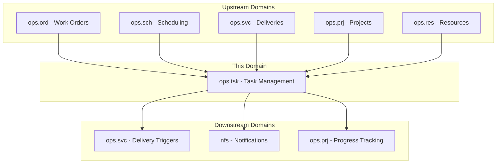
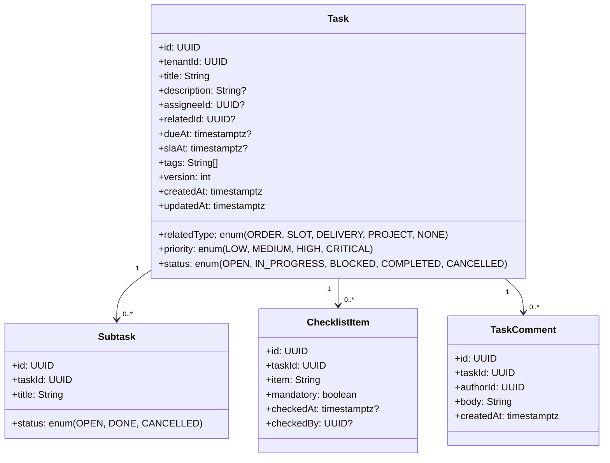
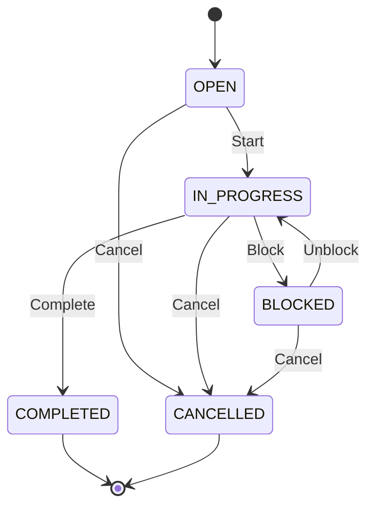
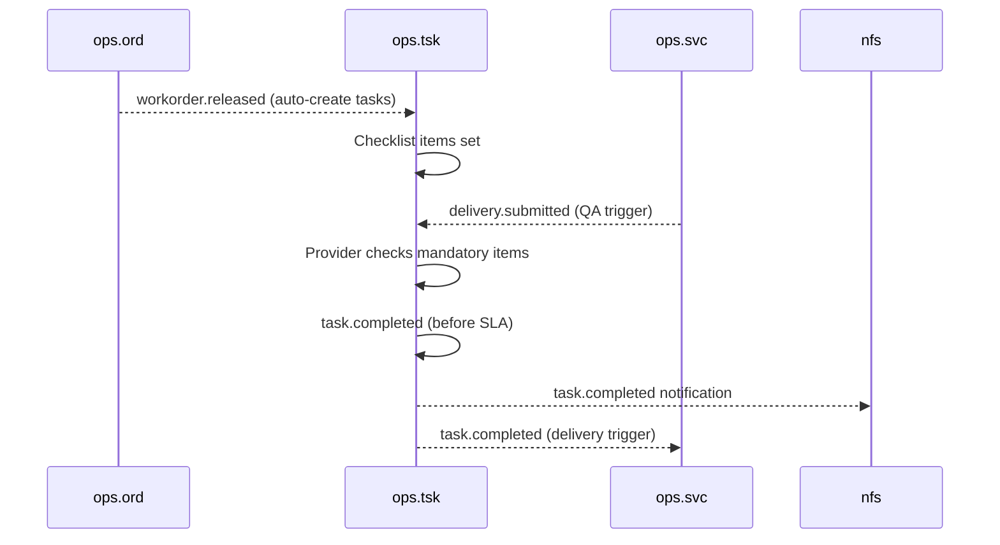
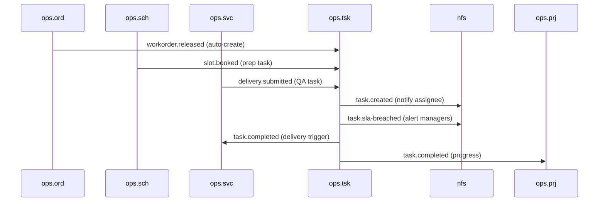
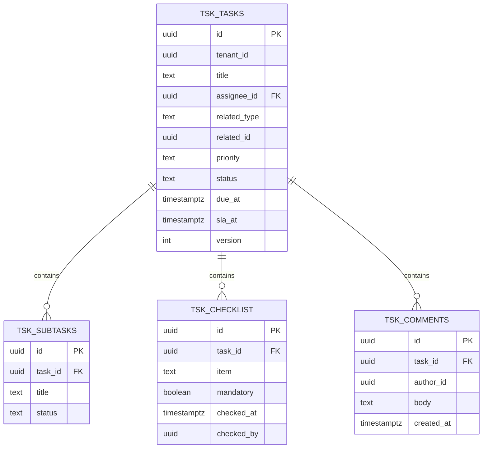

# OPS.TSK - Task Management Domain / Service Specification

> **Conceptual Stack Layer:** Domain / Service
> **Space:** Platform
> **Owner:** Domain Engineering Team
> **Schema alignment:** `service-layer.schema.json`
> **Companion files:** `openapi.yaml`, `*.schema.json` (event contracts)
> **Referenced by:** Platform-Feature Spec SS5 (backend dependencies), BFF Contract
> **Belongs to:** OPS Suite Spec (`_ops_suite.md`)

> **Meta Information**
> - **Version:** 2026-04-03
> - **Template:** `domain-service-spec.md` v1.0.0
> - **Template Compliance:** ~95%
> - **Author(s):** OpenLeap Architecture Team
> - **Status:** DRAFT
> - **Suite:** `ops`
> - **Domain:** `tsk`
> - **Bounded Context Ref:** `bc:task-management`
> - **Service ID:** `ops-tsk-svc`
> - **basePackage:** `io.openleap.ops.tsk`
> - **API Base Path:** `/api/ops/tsk/v1`
> - **OpenLeap Starter Version:** `v1`
> - **Port:** OPEN QUESTION
> - **Repository:** OPEN QUESTION
> - **Tags:** `ops`, `task-management`, `checklist`, `sla`, `assignment`
> - **Team:**
>   - Name: `team-ops`
>   - Email: `ops-team@openleap.io`
>   - Slack: `#ops-team`

---

## Specification Guidelines Compliance

>
> ### Non-Negotiables
> - Never invent facts. If required info is missing, add an **OPEN QUESTION** entry.
> - Preserve intent and decisions. Only change meaning when explicitly requested.
> - Do not remove normative constraints unless they are explicitly replaced.
> - Keep the spec **self-contained**: no "see chat", no implicit context.
>
> ### Source of Truth Priority
> When sources conflict:
> 1. Spec (explicit) wins
> 2. Starter specs (implementation constraints) next
> 3. Guidelines (best practices) last
>
> ### Style Guide
> - Prefer short sentences and lists.
> - Use MUST/SHOULD/MAY for normative statements.
> - Keep terminology consistent (Aggregate, Domain Service, Application Service, Command, Event).
> - Avoid ambiguous words ("often", "maybe") unless explicitly noting uncertainty.

---

## 0. Document Purpose & Scope

### 0.1 Purpose
This specification defines the Task Management domain within the OPS Suite. `ops.tsk` provides lightweight task and checklist management to support operational execution: atomic tasks for providers and dispatchers, compliance checklists for service quality, linkage to work orders, schedules, deliveries, and projects, and SLA timer tracking.

### 0.2 Target Audience
- Product Owners & Business Stakeholders
- System Architects & Technical Leads
- Integration Engineers

### 0.3 Scope
**In Scope:**
- Task creation (manual and auto-generated from events)
- Subtask management
- Mandatory checklist items with completion tracking
- Assignment to users/resources with due dates and priorities
- SLA tracking with breach alerts
- Linking to operational artifacts (orders, slots, deliveries, projects)
- Simple Kanban-style status flow
- Task comments for collaboration and notes

**Out of Scope:**
- Complex BPMN workflows (external engine)
- Document authoring (ops.doc / DMS)
- Full project management (ops.prj)

### 0.4 Related Documents
- `_ops_suite.md` - OPS Suite overview
- `ops_ord-spec.md` - Order Management
- `ops_svc-spec.md` - Service Delivery
- `ops_sch-spec.md` - Scheduling
- `ops_prj-spec.md` - Project Management
- `ops_res-spec.md` - Resource Management

---

## 1. Business Context

### 1.1 Domain Purpose
`ops.tsk` breaks operational work into manageable, trackable units. It ensures that service providers complete all required steps (checklists), meet deadlines (SLA timers), and that nothing falls through the cracks during service delivery. Tasks are the granular operational units that decompose work orders into actionable items for individual assignees.

### 1.2 Business Value
- Operational task tracking ensuring nothing is missed
- Compliance checklists for service quality assurance
- SLA monitoring with proactive breach alerts
- Auto-task generation from work order and scheduling events
- Integration with all OPS domains for end-to-end operational visibility
- Collaboration through task comments and notes

### 1.3 Key Stakeholders

| Role | Responsibility | Primary Use Cases |
|------|----------------|-------------------|
| Service Provider | Complete tasks and checklists | UC-TSK-001, UC-TSK-004 |
| Dispatcher | Create and assign tasks | UC-TSK-001, UC-TSK-003 |
| Operations Manager | Monitor SLA compliance | UC-TSK-005, UC-TSK-007 |
| Quality Manager | Define checklist templates | UC-TSK-003 |

### 1.4 Strategic Positioning



### 1.5 Service Context

| Field | Value |
|-------|-------|
| Suite | `ops` (Operational Services) |
| Domain | `tsk` (Task Management) |
| Bounded Context | `bc:task-management` |
| Service ID | `ops-tsk-svc` |
| Base Package | `io.openleap.ops.tsk` |
| Authoritative Sources | OPS Suite Spec (`_ops_suite.md`), Task Management best practices |

---

## 2. Service Identity

| Field | Value |
|-------|-------|
| **Service ID** | `ops-tsk-svc` |
| **Display Name** | Task Management Service |
| **Suite** | `ops` |
| **Domain** | `tsk` |
| **Bounded Context Ref** | `bc:task-management` |
| **Version** | 2026-04-03 |
| **Status** | DRAFT |
| **API Base Path** | `/api/ops/tsk/v1` |
| **Repository** | OPEN QUESTION |
| **Tags** | `ops`, `task-management`, `checklist`, `sla`, `assignment` |
| **Team Name** | `team-ops` |
| **Team Email** | `ops-team@openleap.io` |
| **Team Slack** | `#ops-team` |

---

## 3. Domain Model

### 3.1 Conceptual Overview

The domain centers on the **Task** aggregate — a granular work item assigned to a person with deadline, priority, and SLA tracking. Tasks contain **Subtasks** for breaking down work further and **ChecklistItems** for mandatory/optional quality steps. **TaskComments** provide collaboration and audit notes. Tasks are auto-created from upstream events (work orders, schedule slots, deliveries) or manually by dispatchers.



### 3.2 Core Concepts

| Concept | Owner | Description | Glossary Ref |
|---------|-------|-------------|--------------|
| Task | ops-tsk-svc | Individual work item assigned to a person with deadline and SLA | Task (To-Do) |
| Subtask | ops-tsk-svc | Child work item within a task for further decomposition | Subtask (Sub-item) |
| ChecklistItem | ops-tsk-svc | Required or optional quality step within a task | Checklist (QA List) |
| TaskComment | ops-tsk-svc | Collaboration note or audit remark on a task | Comment (Note) |

### 3.3 Aggregate Definitions

#### 3.3.1 Aggregate: Task

**Aggregate ID:** `agg:task`
**Business Purpose:** Individual work item assigned to a person with deadline, priority, and SLA tracking. Represents: "Assignee X must complete task Y by deadline D with checklist items verified."

**Aggregate Root Attributes:**

| Attribute | Type | Format | Required | Description | Example | Constraints |
|-----------|------|--------|----------|-------------|---------|-------------|
| id | UUID | uuid | Yes | Unique identifier | `a1b2c3d4-...` | Immutable after create |
| tenantId | UUID | uuid | Yes | Tenant ownership | `t1-uuid` | Immutable, RLS-enforced |
| title | String | — | Yes | Task title | `"Prepare equipment for visit"` | Non-empty, max 500 chars |
| description | String | — | No | Detailed description | `"Ensure all tools are calibrated"` | Max 4000 chars |
| assigneeId | UUID | uuid | No | Assigned resource/user | `user-uuid` | FK logical to ops.res / iam.principal |
| relatedType | Enum | — | Yes | Link type | `ORDER` | ORDER, SLOT, DELIVERY, PROJECT, NONE |
| relatedId | UUID | uuid | Cond. | Linked artifact ID | `wo-uuid` | Required if relatedType != NONE |
| priority | Enum | — | Yes | Task priority | `MEDIUM` | LOW, MEDIUM, HIGH, CRITICAL; default MEDIUM |
| status | Enum | — | Yes | Lifecycle state | `OPEN` | OPEN, IN_PROGRESS, BLOCKED, COMPLETED, CANCELLED |
| dueAt | Timestamptz | ISO 8601 | No | Due date/time | `2026-03-20T17:00:00Z` | — |
| slaAt | Timestamptz | ISO 8601 | No | SLA deadline | `2026-03-20T12:00:00Z` | >= createdAt |
| tags | String[] | — | No | Categorization tags | `["maintenance", "urgent"]` | — |
| version | Integer | — | Yes | Optimistic locking version | `1` | Auto-incremented |
| createdAt | Timestamptz | ISO 8601 | Yes | Creation timestamp | `2026-03-15T08:30:00Z` | System-managed |
| updatedAt | Timestamptz | ISO 8601 | Yes | Last update timestamp | `2026-03-15T10:00:00Z` | System-managed |

**Lifecycle States:**



**State Transitions:**

| From | To | Trigger | Guard / Precondition | Side Effects |
|------|----|---------|---------------------|--------------|
| — | OPEN | Create | Valid title (BR-001), valid relatedId if type != NONE (BR-005) | — |
| OPEN | IN_PROGRESS | Start | — | Emits `task.started` |
| IN_PROGRESS | BLOCKED | Block | Reason required | Emits `task.blocked` |
| BLOCKED | IN_PROGRESS | Unblock | — | Emits `task.unblocked` |
| IN_PROGRESS | COMPLETED | Complete | All mandatory checklist items checked (BR-002) | Emits `task.completed` |
| OPEN | CANCELLED | Cancel | — | Emits `task.cancelled` |
| IN_PROGRESS | CANCELLED | Cancel | — | Emits `task.cancelled` |
| BLOCKED | CANCELLED | Cancel | — | Emits `task.cancelled` |

**Invariants:**
- INV-T-001: `title` MUST be non-empty (BR-001)
- INV-T-002: All `mandatory=true` ChecklistItems MUST be checked before transition to COMPLETED (BR-002)
- INV-T-003: `slaAt` MUST be >= `createdAt` (BR-003)
- INV-T-004: If `relatedType` != NONE, `relatedId` MUST be set and valid (BR-005)
- INV-T-005: COMPLETED and CANCELLED are terminal — no further state transitions allowed

**Domain Events Emitted:**

| Event | Routing Key | When | Key Payload |
|-------|-------------|------|-------------|
| TaskCreated | `ops.tsk.task.created` | Task created | taskId, tenantId, assigneeId, priority, relatedType, relatedId |
| TaskUpdated | `ops.tsk.task.updated` | Task attributes changed | taskId, changedFields |
| TaskStarted | `ops.tsk.task.started` | OPEN → IN_PROGRESS | taskId, assigneeId |
| TaskBlocked | `ops.tsk.task.blocked` | IN_PROGRESS → BLOCKED | taskId, reason |
| TaskUnblocked | `ops.tsk.task.unblocked` | BLOCKED → IN_PROGRESS | taskId |
| TaskCompleted | `ops.tsk.task.completed` | IN_PROGRESS → COMPLETED | taskId, assigneeId, relatedType, relatedId |
| TaskCancelled | `ops.tsk.task.cancelled` | → CANCELLED | taskId, reason |
| TaskSlaBreached | `ops.tsk.task.sla-breached` | SLA deadline exceeded | taskId, slaAt, assigneeId |

#### 3.3.2 Entity: Subtask (child of Task)

**Business Purpose:** Child work item for further decomposition of a task into smaller steps.

| Attribute | Type | Format | Required | Description | Constraints |
|-----------|------|--------|----------|-------------|-------------|
| id | UUID | uuid | Yes | Unique identifier | Immutable |
| taskId | UUID | uuid | Yes | Parent task | FK to Task |
| title | String | — | Yes | Subtask title | Non-empty, max 500 chars |
| status | Enum | — | Yes | OPEN, DONE, CANCELLED | Default OPEN |

**Relationship:** Task `1` → `0..*` Subtask

#### 3.3.3 Entity: ChecklistItem (child of Task)

**Business Purpose:** Required or optional step within a task for quality assurance. Mandatory items MUST be checked before the parent task can transition to COMPLETED.

| Attribute | Type | Format | Required | Description | Constraints |
|-----------|------|--------|----------|-------------|-------------|
| id | UUID | uuid | Yes | Unique identifier | Immutable |
| taskId | UUID | uuid | Yes | Parent task | FK to Task |
| item | String | — | Yes | Checklist item text | Non-empty, max 500 chars |
| mandatory | Boolean | — | Yes | Whether required for completion | Default false |
| checkedAt | Timestamptz | ISO 8601 | No | When item was checked | Set when checked |
| checkedBy | UUID | uuid | No | Who checked the item | FK to iam.principal |

**Relationship:** Task `1` → `0..*` ChecklistItem

**Domain Events Emitted:**

| Event | Routing Key | When | Key Payload |
|-------|-------------|------|-------------|
| ChecklistItemChecked | `ops.tsk.checklist.checked` | Item checked | checklistItemId, taskId, checkedBy |

#### 3.3.4 Entity: TaskComment (child of Task)

**Business Purpose:** Collaboration note or audit remark attached to a task. Supports discussion between assignee, dispatcher, and manager.

| Attribute | Type | Format | Required | Description | Constraints |
|-----------|------|--------|----------|-------------|-------------|
| id | UUID | uuid | Yes | Unique identifier | Immutable |
| taskId | UUID | uuid | Yes | Parent task | FK to Task |
| authorId | UUID | uuid | Yes | Comment author | FK to iam.principal |
| body | String | — | Yes | Comment text | Non-empty, max 4000 chars |
| createdAt | Timestamptz | ISO 8601 | Yes | Creation timestamp | System-managed |

**Relationship:** Task `1` → `0..*` TaskComment

### 3.4 Enumerations

| Enum | Values | Description |
|------|--------|-------------|
| RelatedType | ORDER, SLOT, DELIVERY, PROJECT, NONE | Type of linked operational artifact |
| TaskStatus | OPEN, IN_PROGRESS, BLOCKED, COMPLETED, CANCELLED | Task lifecycle |
| SubtaskStatus | OPEN, DONE, CANCELLED | Subtask lifecycle |
| TaskPriority | LOW, MEDIUM, HIGH, CRITICAL | Task urgency level |

---

## 4. Business Rules & Constraints

### 4.1 Business Rules Catalog

| ID | Rule Name | Description | Scope | Enforcement | Error Code |
|----|-----------|-------------|-------|-------------|------------|
| BR-001 | Title Required | Non-empty title for every task | Task | Create / Update | `TSK-VAL-001` |
| BR-002 | Checklist Guard | All mandatory checklist items must be checked before COMPLETED | Task | Complete | `TSK-BIZ-002` |
| BR-003 | SLA Validity | slaAt >= createdAt | Task | Create / Update | `TSK-VAL-003` |
| BR-004 | SLA Breach Alert | Auto-alert when current time > slaAt and status not COMPLETED/CANCELLED | Task | Scheduler | `TSK-BIZ-004` |
| BR-005 | Related Consistency | relatedId must be valid and set when relatedType != NONE | Task | Create | `TSK-VAL-005` |
| BR-006 | Assignee Validation | assigneeId must reference an active resource or user | Task | Create / Update | `TSK-VAL-006` |
| BR-007 | Terminal State Guard | COMPLETED and CANCELLED tasks cannot be modified | Task | Update | `TSK-BIZ-007` |

### 4.2 Detailed Rule Definitions

#### BR-002: Checklist Guard
**Context:** Compliance and quality assurance require that all mandatory steps are verified before a task is marked complete.
**Rule Statement:** A task MUST NOT transition to COMPLETED if any ChecklistItem with `mandatory=true` has `checkedAt` = null.
**Applies To:** Task aggregate, Complete transition
**Enforcement:** Domain service rejects Complete command if unchecked mandatory items exist.
**Validation Logic:** `if (task.checklistItems.any { it.mandatory && it.checkedAt == null }) throw ChecklistIncompleteException`
**Error Handling:**
- Code: `TSK-BIZ-002`
- Message: `"Task {id} cannot be completed. {count} mandatory checklist items remain unchecked."`
- HTTP: 422 Unprocessable Entity

#### BR-004: SLA Breach Alert
**Context:** Operations managers need proactive notification when tasks exceed SLA deadlines to take corrective action.
**Rule Statement:** A scheduled job ticks every minute and checks all tasks where `slaAt` < now() and `status` not in (COMPLETED, CANCELLED). For each breached task, emit `TaskSlaBreached` event.
**Applies To:** Task aggregate
**Enforcement:** Scheduler (cron job)
**Validation Logic:** `SELECT * FROM tsk_tasks WHERE sla_at < now() AND status NOT IN ('COMPLETED','CANCELLED') AND sla_breached = false`

#### BR-007: Terminal State Guard
**Context:** Once a task reaches a terminal state (COMPLETED or CANCELLED), it is an immutable record of operational execution.
**Rule Statement:** No attribute changes are permitted on tasks in COMPLETED or CANCELLED status.
**Applies To:** Task aggregate
**Enforcement:** Domain service rejects any update command targeting a terminal task.
**Error Handling:**
- Code: `TSK-BIZ-007`
- Message: `"Task {id} is in terminal state {status} and cannot be modified."`
- HTTP: 409 Conflict

### 4.3 Data Validation Rules

| Field | Validation Rule | Error Code | Error Message |
|-------|----------------|------------|---------------|
| title | Required, non-empty, max 500 chars | `TSK-VAL-001` | `"Non-empty title is required (max 500 characters)"` |
| assigneeId | Optional, valid UUID, active resource/user | `TSK-VAL-006` | `"Assignee must be a valid, active resource or user"` |
| relatedType | Required, valid enum value | `TSK-VAL-010` | `"Valid related type required (ORDER, SLOT, DELIVERY, PROJECT, NONE)"` |
| relatedId | Required if relatedType != NONE, valid UUID | `TSK-VAL-005` | `"Related ID required when related type is not NONE"` |
| priority | Required, valid enum value | `TSK-VAL-011` | `"Valid priority required (LOW, MEDIUM, HIGH, CRITICAL)"` |
| slaAt | If set, >= createdAt | `TSK-VAL-003` | `"SLA deadline must be on or after task creation time"` |
| dueAt | If set, valid timestamptz | `TSK-VAL-012` | `"Valid due date/time required"` |
| description | Optional, max 4000 chars | `TSK-VAL-013` | `"Description must not exceed 4000 characters"` |

### 4.4 Reference Data Dependencies

| Catalog | Usage | Provider Service | Validation |
|---------|-------|-----------------|------------|
| Resources | `assigneeId` field | ops-res-svc (T3) | Active status check |
| IAM Principals | `assigneeId`, `checkedBy`, `authorId` | iam-principal-svc (T1) | Principal existence check |
| Work Orders | `relatedId` (ORDER) | ops-ord-svc (T3) | Order existence check |
| Schedule Slots | `relatedId` (SLOT) | ops-sch-svc (T3) | Slot existence check |

---

## 5. Use Cases

### 5.1 Business Logic Placement

| Layer | Responsibilities |
|-------|-----------------|
| Application Service | Command validation, aggregate loading, event publishing, orchestration (auto-create from events) |
| Domain Service | SLA breach checking (cross-aggregate), assignee validation |
| Aggregate | State transitions, invariant enforcement, attribute validation |

### 5.2 Use Cases

#### UC-TSK-001: Create Task

| Field | Value |
|-------|-------|
| **ID** | UC-TSK-001 |
| **Type** | WRITE |
| **Trigger** | REST |
| **Aggregate** | Task |
| **Domain Operation** | `Task.create()` |
| **Inputs** | title, description?, assigneeId?, relatedType, relatedId?, priority?, dueAt?, slaAt?, tags? |
| **Outputs** | Created Task in OPEN state |
| **Events** | `TaskCreated` → `ops.tsk.task.created` |
| **REST** | `POST /api/ops/tsk/v1/tasks` → 201 Created |
| **Idempotency** | Client-generated `Idempotency-Key` header |
| **Errors** | 400 (validation), 422 (BR-001 empty title, BR-005 invalid related ref, BR-006 invalid assignee) |

#### UC-TSK-002: Auto-Create Task from Work Order

| Field | Value |
|-------|-------|
| **ID** | UC-TSK-002 |
| **Type** | WRITE |
| **Trigger** | Event (`ops.ord.workorder.released`) |
| **Aggregate** | Task |
| **Domain Operation** | `Task.create()` (system-initiated) |
| **Inputs** | workOrderId, workOrderTitle, checklist template |
| **Outputs** | Task(s) in OPEN state with pre-populated checklist items |
| **Events** | `TaskCreated` → `ops.tsk.task.created` |
| **REST** | — (event-driven) |
| **Idempotency** | Idempotent on (relatedType=ORDER, relatedId=workOrderId) |
| **Errors** | DLQ on repeated failure |

#### UC-TSK-003: Add Checklist Items

| Field | Value |
|-------|-------|
| **ID** | UC-TSK-003 |
| **Type** | WRITE |
| **Trigger** | REST |
| **Aggregate** | Task (child: ChecklistItem) |
| **Domain Operation** | `Task.addChecklistItem()` |
| **Inputs** | taskId, item, mandatory? |
| **Outputs** | Created ChecklistItem |
| **Events** | — |
| **REST** | `POST /api/ops/tsk/v1/tasks/{id}/checklist` → 201 Created |
| **Idempotency** | Idempotency-Key header |
| **Errors** | 404 (task not found), 409 (task in terminal state, BR-007) |

#### UC-TSK-004: Complete Task with Checklist

| Field | Value |
|-------|-------|
| **ID** | UC-TSK-004 |
| **Type** | WRITE |
| **Trigger** | REST |
| **Aggregate** | Task |
| **Domain Operation** | `Task.complete()` |
| **Inputs** | taskId |
| **Outputs** | Task in COMPLETED state |
| **Events** | `TaskCompleted` → `ops.tsk.task.completed` |
| **REST** | `POST /api/ops/tsk/v1/tasks/{id}:complete` → 200 OK |
| **Idempotency** | Idempotent (re-complete of COMPLETED is no-op) |
| **Errors** | 404, 409 (not IN_PROGRESS), 422 (BR-002 mandatory checklist items unchecked) |

#### UC-TSK-005: SLA Monitoring

| Field | Value |
|-------|-------|
| **ID** | UC-TSK-005 |
| **Type** | WRITE |
| **Trigger** | Scheduler (cron, every 1 minute) |
| **Aggregate** | Task |
| **Domain Operation** | `SlaMonitorService.checkBreaches()` |
| **Inputs** | — (batch query) |
| **Outputs** | Breached tasks flagged |
| **Events** | `TaskSlaBreached` → `ops.tsk.task.sla-breached` |
| **REST** | — (scheduler-driven) |
| **Idempotency** | Idempotent (sla_breached flag prevents re-emission) |
| **Errors** | Logged, retried on next tick |

#### UC-TSK-006: Check Checklist Item

| Field | Value |
|-------|-------|
| **ID** | UC-TSK-006 |
| **Type** | WRITE |
| **Trigger** | REST |
| **Aggregate** | Task (child: ChecklistItem) |
| **Domain Operation** | `ChecklistItem.check()` |
| **Inputs** | checklistItemId |
| **Outputs** | ChecklistItem with checkedAt and checkedBy set |
| **Events** | `ChecklistItemChecked` → `ops.tsk.checklist.checked` |
| **REST** | `PATCH /api/ops/tsk/v1/checklist/{id}:check` → 200 OK |
| **Idempotency** | Idempotent (re-check is no-op) |
| **Errors** | 404, 409 (task in terminal state) |

#### UC-TSK-007: List / Search Tasks (READ)

| Field | Value |
|-------|-------|
| **ID** | UC-TSK-007 |
| **Type** | READ |
| **Trigger** | REST |
| **Aggregate** | Task |
| **Domain Operation** | Query projection |
| **Inputs** | assigneeId?, status?, priority?, relatedType?, relatedId?, q?, page, size |
| **Outputs** | Paginated task list |
| **Events** | — |
| **REST** | `GET /api/ops/tsk/v1/tasks?...` → 200 OK |
| **Idempotency** | Inherently idempotent (GET) |
| **Errors** | 400 (invalid filter params) |

#### UC-TSK-008: Add Task Comment

| Field | Value |
|-------|-------|
| **ID** | UC-TSK-008 |
| **Type** | WRITE |
| **Trigger** | REST |
| **Aggregate** | Task (child: TaskComment) |
| **Domain Operation** | `Task.addComment()` |
| **Inputs** | taskId, body |
| **Outputs** | Created TaskComment |
| **Events** | — |
| **REST** | `POST /api/ops/tsk/v1/tasks/{id}/comments` → 201 Created |
| **Idempotency** | Idempotency-Key header |
| **Errors** | 404 (task not found), 400 (empty body) |

### 5.3 Process Flow Diagrams



### 5.4 Cross-Domain Workflows

**Does this domain participate in multi-service workflows?** Yes

#### Workflow: Work Order Decomposition to Task Completion
**Orchestration Pattern:** Choreography (EDA)
**Pattern Rationale:** Sequential flow — work order released triggers task creation, task completion triggers downstream updates. Each step is independently processable. At-least-once delivery with idempotent consumers.

---

## 6. REST API

### 6.1 API Overview

| Field | Value |
|-------|-------|
| Base Path | `/api/ops/tsk/v1` |
| Authentication | OAuth2/JWT (Bearer token) |
| Authorization | Scopes: `ops.tsk:read`, `ops.tsk:write`, `ops.tsk:admin` |
| Content Type | `application/json` |
| Versioning | URL path (`v1`) |

### 6.2 Resource Operations

#### Task Resource

| Endpoint | Method | Path | Summary | Role Required | Events Published |
|----------|--------|------|---------|---------------|-----------------|
| Create Task | POST | `/tasks` | Create new task | `ops.tsk:write` | `TaskCreated` |
| Get Task | GET | `/tasks/{id}` | Retrieve task by ID | `ops.tsk:read` | — |
| List Tasks | GET | `/tasks` | Search/filter tasks | `ops.tsk:read` | — |
| Update Task | PATCH | `/tasks/{id}` | Update non-terminal task | `ops.tsk:write` | `TaskUpdated` |

**Create Task — Request:**
```json
{
  "title": "Prepare equipment for visit",
  "description": "Ensure all tools are calibrated and packed",
  "assigneeId": "user-uuid",
  "relatedType": "ORDER",
  "relatedId": "wo-uuid",
  "priority": "HIGH",
  "dueAt": "2026-03-20T17:00:00Z",
  "slaAt": "2026-03-20T12:00:00Z",
  "tags": ["maintenance", "urgent"]
}
```

**Create Task — Response (201 Created):**
```json
{
  "id": "task-uuid",
  "status": "OPEN",
  "priority": "HIGH",
  "version": 1,
  "createdAt": "2026-03-15T08:30:00Z"
}
```

**Update Task — Headers:** `If-Match: "{version}"` (optimistic locking, 412 on conflict)

### 6.3 Business Operations

| Endpoint | Method | Path | Summary | Role Required | Events Published |
|----------|--------|------|---------|---------------|-----------------|
| Start | POST | `/tasks/{id}:start` | Start task (OPEN → IN_PROGRESS) | `ops.tsk:write` | `TaskStarted` |
| Block | POST | `/tasks/{id}:block` | Block task | `ops.tsk:write` | `TaskBlocked` |
| Unblock | POST | `/tasks/{id}:unblock` | Unblock task | `ops.tsk:write` | `TaskUnblocked` |
| Complete | POST | `/tasks/{id}:complete` | Complete task | `ops.tsk:write` | `TaskCompleted` |
| Cancel | POST | `/tasks/{id}:cancel` | Cancel task | `ops.tsk:write` | `TaskCancelled` |

**Block — Request Body:**
```json
{ "reason": "Waiting for parts delivery" }
```

#### Subtask Resource

| Endpoint | Method | Path | Summary | Role Required | Events Published |
|----------|--------|------|---------|---------------|-----------------|
| Add Subtask | POST | `/tasks/{id}/subtasks` | Add subtask to task | `ops.tsk:write` | — |
| Update Subtask | PATCH | `/subtasks/{id}` | Update subtask status | `ops.tsk:write` | — |

#### Checklist Resource

| Endpoint | Method | Path | Summary | Role Required | Events Published |
|----------|--------|------|---------|---------------|-----------------|
| Add Checklist Item | POST | `/tasks/{id}/checklist` | Add checklist item | `ops.tsk:write` | — |
| Check Item | PATCH | `/checklist/{id}:check` | Mark item as checked | `ops.tsk:write` | `ChecklistItemChecked` |

#### Comment Resource

| Endpoint | Method | Path | Summary | Role Required | Events Published |
|----------|--------|------|---------|---------------|-----------------|
| Add Comment | POST | `/tasks/{id}/comments` | Add comment to task | `ops.tsk:write` | — |
| List Comments | GET | `/tasks/{id}/comments` | List task comments | `ops.tsk:read` | — |

### 6.4 Error Responses

| HTTP Status | Error Code | Description |
|-------------|------------|-------------|
| 400 | `TSK-VAL-*` | Validation error (field-level) |
| 401 | — | Authentication required |
| 403 | — | Forbidden (insufficient role) |
| 404 | — | Resource not found |
| 409 | `TSK-BIZ-007` | Conflict (invalid state transition, terminal state) |
| 412 | — | Precondition failed (optimistic lock version mismatch) |
| 422 | `TSK-BIZ-*` | Business rule violation |

### 6.5 OpenAPI Specification
**Location:** `contracts/http/ops/tsk/openapi.yaml`
**OpenAPI Version:** 3.1.0

---

## 7. Events & Integration

### 7.1 Event-Driven Architecture Pattern
**Pattern Decision:** Choreography (EDA)
**Rationale:** OPS task management follows an event-driven flow — upstream events trigger task creation, task lifecycle events notify downstream systems. No distributed transaction coordination needed. At-least-once delivery with idempotent consumers.

### 7.2 Published Events

**Exchange:** `ops.tsk.events` (topic)

#### TaskCreated
- **Routing Key:** `ops.tsk.task.created`
- **Business Meaning:** A new task has been created (manually or auto-generated)
- **When Published:** Task creation
- **Payload Schema:**
```json
{
  "taskId": "uuid",
  "tenantId": "uuid",
  "title": "string",
  "assigneeId": "uuid | null",
  "relatedType": "ORDER | SLOT | DELIVERY | PROJECT | NONE",
  "relatedId": "uuid | null",
  "priority": "LOW | MEDIUM | HIGH | CRITICAL",
  "dueAt": "timestamptz | null",
  "slaAt": "timestamptz | null"
}
```
- **Consumers:** nfs (notification to assignee)

#### TaskUpdated
- **Routing Key:** `ops.tsk.task.updated`
- **Business Meaning:** Task attributes have been modified
- **When Published:** Attribute update (non-state-transition)
- **Payload Schema:** `{ "taskId": "uuid", "tenantId": "uuid", "changedFields": ["string"] }`
- **Consumers:** nfs (notification)

#### TaskCompleted
- **Routing Key:** `ops.tsk.task.completed`
- **Business Meaning:** A task has been completed with all mandatory checklist items verified
- **When Published:** IN_PROGRESS → COMPLETED transition
- **Payload Schema:**
```json
{
  "taskId": "uuid",
  "tenantId": "uuid",
  "assigneeId": "uuid | null",
  "relatedType": "string",
  "relatedId": "uuid | null",
  "completedAt": "timestamptz"
}
```
- **Consumers:** ops.svc (delivery trigger), ops.prj (progress tracking), nfs (notification)

#### TaskCancelled
- **Routing Key:** `ops.tsk.task.cancelled`
- **Business Meaning:** A task has been cancelled
- **When Published:** → CANCELLED transition
- **Payload Schema:** `{ "taskId": "uuid", "tenantId": "uuid", "reason": "string | null" }`
- **Consumers:** ops.prj (progress tracking)

#### TaskSlaBreached
- **Routing Key:** `ops.tsk.task.sla-breached`
- **Business Meaning:** A task has exceeded its SLA deadline without being completed
- **When Published:** SLA scheduler detects breach
- **Payload Schema:**
```json
{
  "taskId": "uuid",
  "tenantId": "uuid",
  "assigneeId": "uuid | null",
  "slaAt": "timestamptz",
  "breachedAt": "timestamptz"
}
```
- **Consumers:** nfs (alert to managers), analytics

#### ChecklistItemChecked
- **Routing Key:** `ops.tsk.checklist.checked`
- **Business Meaning:** A checklist item has been checked off
- **When Published:** Item checked
- **Payload Schema:** `{ "checklistItemId": "uuid", "taskId": "uuid", "tenantId": "uuid", "checkedBy": "uuid" }`
- **Consumers:** iam.audit (audit trail)

### 7.3 Consumed Events

| Source Event | Source Service | Handler | Purpose | Queue |
|-------------|---------------|---------|---------|-------|
| `ops.ord.workorder.released` | ops.ord | WorkOrderReleasedHandler | Auto-create operational tasks with checklists | `ops.tsk.in.ops.ord.workorder` |
| `ops.sch.slot.booked` | ops.sch | SlotBookedHandler | Create visit-preparation task | `ops.tsk.in.ops.sch.slot` |
| `ops.svc.delivery.submitted` | ops.svc | DeliverySubmittedHandler | Create QA checklist task | `ops.tsk.in.ops.svc.delivery` |
| `ops.res.resource.updated` | ops.res | ResourceCacheHandler | Update assignee availability cache | `ops.tsk.in.ops.res.resource` |

### 7.4 Event Flow Diagrams



### 7.5 Integration Points Summary

**Upstream Dependencies:**

| Service | Tier | Purpose | Type | Criticality | Fallback |
|---------|------|---------|------|-------------|----------|
| ops-ord-svc | T3 | Work order reference validation | Event + Cache | Medium | Use cached data |
| ops-sch-svc | T3 | Schedule slot reference | Event | Low | Log and skip |
| ops-svc-svc | T3 | Delivery reference for QA tasks | Event | Low | Log and skip |
| ops-res-svc | T3 | Assignee validation | REST + Cache | Medium | Use cached data |
| iam-principal-svc | T1 | Principal validation | REST + Cache | Low | Use cached data |

**Downstream Consumers:**

| Service | Tier | Purpose | Type | SLA |
|---------|------|---------|------|-----|
| nfs | T1 | Task notifications and SLA alerts | Event | < 5s processing |
| ops.svc | T3 | Delivery triggers on task completion | Event | < 5s processing |
| ops.prj | T3 | Project progress tracking | Event | < 10s processing |
| iam.audit | T1 | Audit trail for checklist operations | Event | < 10s processing |

---

## 8. Data Model

### 8.1 Storage Technology

| Aspect | Choice |
|--------|--------|
| Database | PostgreSQL 16+ |
| Multi-tenancy | `tenant_id` column + PostgreSQL RLS |
| Soft Delete | No — COMPLETED/CANCELLED tasks are terminal, immutable records |
| Audit Trail | Status transitions logged via iam.audit events |
| Outbox | `tsk_outbox_events` table for reliable event publishing |

### 8.2 Conceptual Data Model



### 8.3 Table Definitions

#### Table: `tsk_tasks`

| Column | Type | Nullable | Default | Description | Constraints |
|--------|------|----------|---------|-------------|-------------|
| id | uuid | NOT NULL | `OlUuid.create()` | Primary key | PK |
| tenant_id | uuid | NOT NULL | — | Tenant discriminator | RLS policy |
| title | varchar(500) | NOT NULL | — | Task title | CHECK(length(title) > 0) |
| description | text | NULL | — | Detailed description | MAX 4000 |
| assignee_id | uuid | NULL | — | Assigned resource/user | FK logical to ops.res / iam.principal |
| related_type | text | NOT NULL | `'NONE'` | Link type | CHECK(related_type IN ('ORDER','SLOT','DELIVERY','PROJECT','NONE')) |
| related_id | uuid | NULL | — | Linked artifact ID | Required if related_type != 'NONE' |
| priority | text | NOT NULL | `'MEDIUM'` | Task priority | CHECK(priority IN ('LOW','MEDIUM','HIGH','CRITICAL')) |
| status | text | NOT NULL | `'OPEN'` | Lifecycle state | CHECK(status IN ('OPEN','IN_PROGRESS','BLOCKED','COMPLETED','CANCELLED')) |
| due_at | timestamptz | NULL | — | Due date/time | — |
| sla_at | timestamptz | NULL | — | SLA deadline | CHECK(sla_at >= created_at) |
| sla_breached | boolean | NOT NULL | false | Whether SLA breach event was emitted | — |
| tags | text[] | NULL | — | Categorization tags | — |
| version | integer | NOT NULL | 1 | Optimistic lock | — |
| created_at | timestamptz | NOT NULL | `now()` | Creation timestamp | — |
| updated_at | timestamptz | NOT NULL | `now()` | Last update | — |

**Indexes:**

| Index Name | Columns | Type | Condition |
|------------|---------|------|-----------|
| idx_tsk_tasks_tenant_assignee_status | (tenant_id, assignee_id, status) | btree | — |
| idx_tsk_tasks_tenant_status | (tenant_id, status) | btree | — |
| idx_tsk_tasks_related | (related_type, related_id) | btree | WHERE related_type != 'NONE' |
| idx_tsk_tasks_sla | (tenant_id, sla_at) | btree | WHERE sla_at IS NOT NULL AND status NOT IN ('COMPLETED','CANCELLED') AND sla_breached = false |

#### Table: `tsk_subtasks`

| Column | Type | Nullable | Default | Description | Constraints |
|--------|------|----------|---------|-------------|-------------|
| id | uuid | NOT NULL | `OlUuid.create()` | Primary key | PK |
| tenant_id | uuid | NOT NULL | — | Tenant discriminator | RLS policy |
| task_id | uuid | NOT NULL | — | Parent task | FK to tsk_tasks |
| title | varchar(500) | NOT NULL | — | Subtask title | CHECK(length(title) > 0) |
| status | text | NOT NULL | `'OPEN'` | Lifecycle state | CHECK(status IN ('OPEN','DONE','CANCELLED')) |

**Indexes:**

| Index Name | Columns | Type | Condition |
|------------|---------|------|-----------|
| idx_tsk_subtasks_task | (task_id) | btree | — |

#### Table: `tsk_checklist`

| Column | Type | Nullable | Default | Description | Constraints |
|--------|------|----------|---------|-------------|-------------|
| id | uuid | NOT NULL | `OlUuid.create()` | Primary key | PK |
| tenant_id | uuid | NOT NULL | — | Tenant discriminator | RLS policy |
| task_id | uuid | NOT NULL | — | Parent task | FK to tsk_tasks |
| item | varchar(500) | NOT NULL | — | Checklist item text | CHECK(length(item) > 0) |
| mandatory | boolean | NOT NULL | false | Whether required for completion | — |
| checked_at | timestamptz | NULL | — | When checked | — |
| checked_by | uuid | NULL | — | Who checked | FK logical to iam.principal |

**Indexes:**

| Index Name | Columns | Type | Condition |
|------------|---------|------|-----------|
| idx_tsk_checklist_task | (task_id) | btree | — |
| idx_tsk_checklist_mandatory | (task_id, mandatory) | btree | WHERE mandatory = true AND checked_at IS NULL |

#### Table: `tsk_comments`

| Column | Type | Nullable | Default | Description | Constraints |
|--------|------|----------|---------|-------------|-------------|
| id | uuid | NOT NULL | `OlUuid.create()` | Primary key | PK |
| tenant_id | uuid | NOT NULL | — | Tenant discriminator | RLS policy |
| task_id | uuid | NOT NULL | — | Parent task | FK to tsk_tasks |
| author_id | uuid | NOT NULL | — | Comment author | FK logical to iam.principal |
| body | text | NOT NULL | — | Comment text | CHECK(length(body) > 0), MAX 4000 |
| created_at | timestamptz | NOT NULL | `now()` | Creation timestamp | — |

**Indexes:**

| Index Name | Columns | Type | Condition |
|------------|---------|------|-----------|
| idx_tsk_comments_task | (task_id) | btree | — |

#### Table: `tsk_outbox_events`

Standard outbox pattern per platform guidelines (ADR-013).

### 8.4 Reference Data Dependencies

| Reference Data | Source | Usage |
|----------------|--------|-------|
| Resources | ops-res-svc (T3) | `assignee_id` validation |
| IAM Principals | iam-principal-svc (T1) | `assignee_id`, `checked_by`, `author_id` validation |
| Work Orders | ops-ord-svc (T3) | `related_id` validation (ORDER type) |

### 8.5 Data Retention

| Entity | Retention Period | Legal Basis | Action After Expiry |
|--------|-----------------|-------------|---------------------|
| Tasks | 5 years | Operational audit | Archive then delete |
| Subtasks | As long as parent task exists | Task context | Delete with parent |
| Checklist Items | As long as parent task exists | Quality audit | Delete with parent |
| Comments | As long as parent task exists | Collaboration record | Delete with parent |
| Outbox Events | 30 days after publish | Operational | Delete |

---

## 9. Security & Compliance

### 9.1 Data Classification

| Data Element | Classification | Protection |
|--------------|----------------|------------|
| Task ID, status, priority | Public | None |
| Assignee ID | Internal | RLS, access control |
| Task description, comments | Internal | RLS, access control |
| Checklist items (compliance) | Restricted | RLS, audit trail |

### 9.2 Access Control

**Roles & Permissions Matrix:**

| Role | Read | Create | Update | Complete | Admin |
|------|------|--------|--------|----------|-------|
| TSK_USER | Own/Assigned | ✓ | Own | ✓ | ✗ |
| TSK_MANAGER | Team | ✓ | Team | ✓ | ✗ |
| TSK_ADMIN | All | ✓ | All | ✓ | ✓ |

SLA breach notifications are restricted to TSK_MANAGER and TSK_ADMIN roles.

### 9.3 Compliance Requirements

| Regulation | Requirement | Implementation |
|------------|-------------|----------------|
| GDPR | Assignee data is personal data reference | Tenant-scoped RLS, GDPR export via IAM suite |
| Labour | Task assignment and completion tracking | Audit trail, time-stamped status transitions |
| Quality | Checklist completion evidence | ChecklistItem.checkedAt + checkedBy, immutable after check |

### 9.4 Audit Trail

| Aspect | Implementation |
|--------|----------------|
| Who | `currentPrincipal` from JWT token |
| What | Status transition (from → to) + changed fields |
| When | Timestamped event |
| Old/New Value | Captured in domain event payload |
| Retention | 5 years (aligned with task retention) |
| Legal Basis | Operational and quality audit requirements |

---

## 10. Quality Attributes

### 10.1 Performance Requirements

| Operation | Target (p95) | Notes |
|-----------|-------------|-------|
| Read (GET single) | < 100ms | — |
| List (GET with filters) | < 200ms | Paginated, max 100 per page |
| Write (create/update) | < 200ms | — |
| SLA scheduler tick | ≤ 1 min | Batch query with partial index |

### 10.2 Throughput

| Metric | Target |
|--------|--------|
| Peak tasks/day | 500,000 |
| Peak events/second | 200 |
| Concurrent users | 5,000 |

### 10.3 Availability

| Metric | Target |
|--------|--------|
| Uptime SLA | 99.9% |
| Planned maintenance window | Sunday 02:00-04:00 UTC |

### 10.4 Recovery Objectives

| Metric | Target |
|--------|--------|
| RTO (Recovery Time Objective) | < 15 minutes |
| RPO (Recovery Point Objective) | < 5 minutes |
| Failure mode | Idempotent events + reliable outbox pattern |

### 10.5 Scalability

| Aspect | Strategy |
|--------|----------|
| Horizontal scaling | Stateless application instances behind load balancer |
| Database scaling | Read replicas for query load, partitioning by tenant_id for large tenants |
| Event throughput | Partitioned topic by tenant_id |

### 10.6 Maintainability

| Aspect | Implementation |
|--------|----------------|
| API versioning | URL path versioning (`/v1`), backward-compatible changes within version |
| Schema evolution | Event schema versioning with backward compatibility |
| Monitoring | Trace: taskId → relatedId (order/slot/delivery) |
| Key metrics | task creation rate, completion rate, SLA breach rate, avg completion time |
| Alerts | SLA breach rate > 5%, DLQ depth > 0, completion backlog > 500 |

---

## 11. Feature Dependencies

### 11.1 Purpose
This section answers: "Which features depend on this service?" It is the inverse of Platform-Feature Spec SS5 and helps the domain team assess the blast radius of API changes.

### 11.2 Feature Dependency Register

> **OPEN QUESTION:** Feature dependencies will be populated when feature specs (Phase 3) are authored for the OPS suite. The following is a preliminary mapping based on expected feature compositions.

| Feature ID | Feature Name | Suite | Tier | Dependency Type | Status |
|------------|-------------|-------|------|-----------------|--------|
| F-OPS-TBD | Task Board | ops | core | sync_api | planned |
| F-OPS-TBD | Checklist Management | ops | core | sync_api | planned |
| F-OPS-TBD | SLA Dashboard | ops | supporting | sync_api + async_event | planned |
| F-OPS-TBD | Auto-Task Generation | ops | supporting | async_event | planned |

---

## 12. Extension Points

### 12.1 Purpose
Extension points follow the Open-Closed Principle: the service is open for extension via events and hooks but closed for direct modification.

### 12.2 Extension Events

| Event ID | Routing Key | Trigger | Payload | Purpose |
|----------|-------------|---------|---------|---------|
| EXT-TSK-001 | `ops.tsk.task.completed` | Task completed | Full task snapshot | External systems can react to task completions (e.g., client portal update) |
| EXT-TSK-002 | `ops.tsk.task.sla-breached` | SLA breached | Task + SLA details | External alerting systems (SMS, pager, webhook) |

### 12.3 Aggregate Hooks

| Hook ID | Aggregate | Lifecycle Point | Hook Type | Description |
|---------|-----------|-----------------|-----------|-------------|
| HOOK-TSK-001 | Task | Pre-Complete | validation | Custom validation rules per tenant (e.g., mandatory photo upload, GPS check-in) |
| HOOK-TSK-002 | Task | Post-Complete | notification | Custom notification channels (SMS, email, webhook) |
| HOOK-TSK-003 | Task | Pre-Create (auto) | enrichment | Custom checklist template selection based on work order type |

**Design Rules:**
- Hooks are fire-and-forget (notification) or bounded-timeout (validation: 2s, enrichment: 5s)
- Validation hooks fail-closed (block on timeout)
- Notification hooks fail-open (log and continue)
- Hooks do not modify aggregate state directly

### 12.4 Extension Points Summary

| ID | Type | Aggregate | Lifecycle Point | Fail Mode | Timeout |
|----|------|-----------|-----------------|-----------|---------|
| EXT-TSK-001 | event | Task | completed | n/a | n/a |
| EXT-TSK-002 | event | Task | sla-breached | n/a | n/a |
| HOOK-TSK-001 | validation | Task | pre-complete | fail-closed | 2s |
| HOOK-TSK-002 | notification | Task | post-complete | fail-open | 5s |
| HOOK-TSK-003 | enrichment | Task | pre-create (auto) | fail-open | 5s |

---

## 13. Migration & Evolution

### 13.1 Data Migration

**Legacy Source:** No direct legacy migration. New greenfield service.

### 13.2 Deprecation & Sunset

| Deprecated Feature | Replacement | Removal Timeline | Communication Plan |
|-------------------|-------------|------------------|-------------------|
| — | — | — | — |

### 13.3 Future Extensions

- Kanban board UI with drag-and-drop
- Task templates library (reusable checklist + subtask templates)
- Recurring tasks (cron-based auto-creation)
- Task dependencies (predecessor/successor with critical path)
- AI task prioritization based on SLA urgency and resource load
- Mobile offline task completion with sync-on-reconnect

---

## 14. Decisions & Open Questions

### 14.1 Consistency Checks

| Check | Status | Notes |
|-------|--------|-------|
| Every WRITE endpoint maps to exactly one use case | ✓ | UC-TSK-001 through UC-TSK-008 |
| Events in use cases appear in §7 with schema refs | ✓ | All events documented |
| Business rules referenced in aggregate invariants | ✓ | BR-001 through BR-007 |
| All aggregates have lifecycle states + transitions | ✓ | Task with full state machine |

### 14.2 Decisions & Conflicts

| ID | Conflict Description | Resolution | Rationale |
|----|---------------------|------------|-----------|
| D-001 | Sync vs. async for auto-task creation | Async (event) | Decouples from upstream services, eventual consistency acceptable |
| D-002 | SLA check: push vs. pull | Pull (scheduler) | Simpler architecture, no timer infrastructure needed |
| D-003 | Checklist enforcement: soft vs. hard | Hard (mandatory items block completion) | Quality compliance requirements |

### 14.3 Open Questions

| ID | Question | Why It Matters | Suggested Options | Owner |
|----|----------|----------------|-------------------|-------|
| OQ-001 | Task dependency graph (predecessor/successor)? | Complex workflows, critical path | 1) V1 without, 2) V2 with simple deps | Architecture Team |
| OQ-002 | Checklist template library (shared across tenants)? | Reusability, consistency | 1) Per-task only, 2) Template entity | Product Owner |
| OQ-003 | Port assignment for ops-tsk-svc | Deployment | Follow platform port registry | Architecture Team |

### 14.4 Architecture Decision Records

#### ADR-OPS-TSK-001: Hard Checklist Enforcement

**Status:** Accepted

**Context:** Tasks with mandatory checklist items support quality assurance and compliance. The question is whether to enforce mandatory items as a hard gate (block completion) or soft gate (warn but allow).

**Decision:** Hard enforcement — all mandatory ChecklistItems must be checked (checkedAt not null) before a task can transition to COMPLETED.

**Rationale:**
- Quality and compliance require verifiable completion of mandatory steps
- Soft enforcement leads to skipped steps under time pressure
- Audit trail requires proof that all mandatory items were verified

**Consequences:**
- Positive: Guaranteed compliance, complete audit trail
- Negative: Slightly longer completion flow, potential frustration if checklist is misconfigured

---

## 15. Appendix

### 15.1 Glossary

| Term | Definition | Aliases |
|------|------------|---------|
| Task | Individual work item assigned to a person with deadline and SLA | To-Do |
| Subtask | Child work item within a task | Sub-item |
| Checklist Item | Required or optional quality step within a task | QA Item |
| Task Comment | Collaboration note or audit remark on a task | Note |
| SLA | Service Level Agreement deadline for task completion | Deadline |
| SLA Breach | Condition where current time exceeds SLA deadline on an active task | Overdue |

### 15.2 References

| Type | Reference |
|------|-----------|
| Business | OPS Suite Spec (`_ops_suite.md`) |
| Technical | OpenLeap Starter (ADR-002 CQRS, ADR-013 Outbox, ADR-014 At-least-once) |
| External | Task management best practices |
| Schema | `contracts/http/ops/tsk/openapi.yaml`, `contracts/events/ops/tsk/*.schema.json` |

### 15.3 Change Log

| Date | Version | Author | Changes |
|------|---------|--------|---------|
| 2026-04-03 | 3.0 | Architecture Team | Full template compliance restructure — added §2 Service Identity, canonical UC format, §11 Feature Dependencies, §12 Extension Points, formal table definitions in §8, TaskComment entity, error codes, §14 ADRs |
| 2026-02-23 | 2.0 | Architecture Team | Rewritten to DOMAIN_SPEC_TEMPLATE |
| 2025-12-05 | 1.0 | Architecture Team | Initial specification |

### 15.4 Document Review & Approval

**Status:** DRAFT

| Role | Reviewer | Date | Status |
|------|----------|------|--------|
| Product Owner | — | — | Pending |
| Architecture Lead | — | — | Pending |
| CTO/VP Engineering | — | — | Pending |

**Approval:**
- [ ] Product Owner approved
- [ ] Architecture Lead approved
