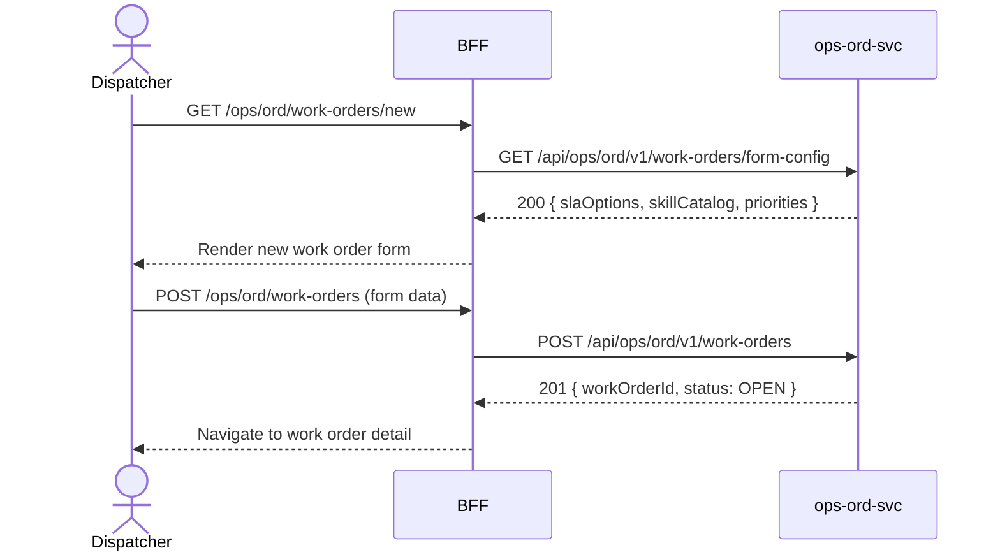

# F-OPS-001-01 — Create Work Order

> **Conceptual Stack Layer:** Domain-Feature
> **Space:** Business Domain
> **Owner:** Operations Engineering Team
> **Companion files:** `F-OPS-001-01.uvl`, `F-OPS-001-01.aui.yaml`
> **Referenced by:** Suite Feature Catalog §6
> **References:** `domain-specs/ops_ord-spec.md` (backend)

> **Meta Information**
> - **Version:** 2026-04-04
> - **Template:** `feature-spec.md` v1.0.0
> - **Template Compliance:** 100%
> - **Status:** DRAFT
> - **Feature ID:** `F-OPS-001-01`
> - **Suite:** `ops`
> - **Node type:** LEAF
> - **Parent:** `F-OPS-001` — Work Order Management
> - **Companion UVL:** `uvl/leaves/F-OPS-001-01.uvl`
> - **Companion AUI:** `contracts/aui/F-OPS-001-01.aui.yaml`

---

## ═══════════════════════════════════════════════
## PROBLEM SPACE
## ═══════════════════════════════════════════════

## 0. Feature Identity & Orientation

### 0.1 One-Line Summary
This feature lets a **field service dispatcher** create a new work order for a customer site visit or internal maintenance task so that the work can be scheduled, assigned, and executed.

### 0.2 Non-Goals
- Does not assign resources to the work order — that is F-OPS-002-02.
- Does not track execution progress — that is F-OPS-001-02.
- Does not generate closing documents — that is F-OPS-001-03.

### 0.3 Entry & Exit Points

**Entry points:**
- Operations → "New Work Order"
- Direct URL: `/ops/ord/work-orders/new`
- Via COM event (order.created) — auto-creates draft work order

**Exit points:**
- Submit → work order created in status `OPEN`, navigate to work order detail
- Cancel → return to work order list

### 0.4 Variability Points

| Variability Point | Model | Values | Default | Binding Time |
|---|---|---|---|---|
| SLA enforcement | UVL attribute | enabled/disabled | enabled | deploy |
| Required skills selection | UVL attribute | enabled/disabled | enabled | deploy |
| Customer signature at creation | UVL attribute | required/optional/hidden | optional | deploy |

---

## 1. User Goal & Scenarios

### 1.1 User Goal
Create a complete, actionable work order that contains all information a technician needs: what to do, where, for whom, by when, and with what skills required.

### 1.2 Scenarios

| # | Scenario | Precondition | Action | Expected Outcome |
|---|----------|-------------|--------|-----------------|
| S1 | Create field service order | Dispatcher is authenticated | Fill form and submit | Work order created with status OPEN, ID assigned |
| S2 | Select skills required | Work order form open | Check required skills (e.g., HVAC-certified) | Skills attached to work order for resource matching |
| S3 | Attach documents | Work order form open | Upload site plan or specification PDF | Document linked to work order |
| S4 | Set SLA | Work order form open | Select SLA tier (4h, 8h, next-day) | SLA deadline computed and stored |
| S5 | Submit | All mandatory fields filled | Click "Create Work Order" | Work order persisted, event published |

---

## 2. User Journey & Screen Layout

### 2.1 Sequence Diagram



### 2.2 Screen Layout

```
┌─────────────────────────────────────────────────────┐
│ [← Work Orders]   New Work Order                     │
├─────────────────────────────────────────────────────┤
│ Title *         [_________________________________]  │
│ Customer *      [Search customer...          ▾]      │
│ Location *      [Street, City, Country       ]       │
│ Priority *      [◉ Normal  ○ High  ○ Critical]       │
│ Requested From* [Date picker]  To* [Date picker]     │
│ SLA Tier        [4h Response ▾]                      │
├─────────────────────────────────────────────────────┤
│ Required Skills                                       │
│ [ ] HVAC-certified  [ ] Forklift-license  [ ] ...   │
├─────────────────────────────────────────────────────┤
│ Description     [Textarea...]                         │
│ Attachments     [+ Add file]                         │
├─────────────────────────────────────────────────────┤
│ [EXT: extension zone]                                │
├─────────────────────────────────────────────────────┤
│                       [Cancel]  [Create Work Order]  │
└─────────────────────────────────────────────────────┘
```

---

## 3. Interaction Requirements

### 3.1 Fields Table

| Field | Type | Required | Editable | Validation | i18n Key |
|---|---|---|---|---|---|
| Title | text | Yes | Yes | 3–200 chars | `F-OPS-001-01.field.title` |
| Customer | typeahead | Yes | Yes | Must resolve to valid bp.party ID | `F-OPS-001-01.field.customer` |
| Location | address | Yes | Yes | Non-empty | `F-OPS-001-01.field.location` |
| Priority | radio | Yes | Yes | NORMAL, HIGH, CRITICAL | `F-OPS-001-01.field.priority` |
| Requested From | date | Yes | Yes | Not in past | `F-OPS-001-01.field.requestedFrom` |
| Requested To | date | Yes | Yes | After Requested From | `F-OPS-001-01.field.requestedTo` |
| SLA Tier | select | No | Yes | Catalog value | `F-OPS-001-01.field.slaTier` |
| Required Skills | multi-check | No | Yes | Catalog values | `F-OPS-001-01.field.skills` |
| Description | textarea | No | Yes | Max 2000 chars | `F-OPS-001-01.field.description` |

### 3.2 Actions Table

| Action | Trigger | Precondition | Effect |
|---|---|---|---|
| Create Work Order | Button click | All mandatory fields valid | POST to ops-ord-svc, navigate to detail |
| Cancel | Button click | — | Navigate back without saving |
| Add file | File picker | — | Upload attachment |

### 3.3 Validation Messages

| Field | Condition | Message |
|---|---|---|
| Title | Empty | `F-OPS-001-01.validation.title.required` |
| Customer | Not resolved | `F-OPS-001-01.validation.customer.required` |
| Requested To | Before Requested From | `F-OPS-001-01.validation.date.range` |

---

## 4. Edge Cases & Screen States

### 4.1 Component States

| State | When | Behaviour |
|---|---|---|
| **Loading** | Awaiting form config | Skeleton form; submit disabled |
| **Idle** | Form config loaded | Form editable |
| **Submitting** | POST in flight | Spinner on button; form read-only |
| **Error** | ops-ord-svc unavailable | Inline error with retry |
| **Success** | 201 received | Navigate to work order detail |

### 4.2 Specific Edge Cases

| Case | Behaviour | Affected users |
|---|---|---|
| Duplicate submission | Idempotency key prevents duplicate; show existing WO | Dispatcher with poor connectivity |
| Customer not found | Inline typeahead error message | Dispatcher |
| Requested From in past | Field highlighted; warning (not error) for backdated entry | Dispatcher creating a catch-up WO |

### 4.3 Attribute-Driven Behaviour Changes

| Attribute | Non-default value | Observable change |
|---|---|---|
| `slaEnforcement` | disabled | SLA Tier field hidden |
| `skillsSelection` | disabled | Required Skills panel hidden |

### 4.4 Connectivity
On network loss: form data preserved in session storage; warn user before navigating away.

---

## ═══════════════════════════════════════════════
## SOLUTION SPACE
## ═══════════════════════════════════════════════

## 5. Backend Dependencies & BFF Contract

### 5.1 Service Calls

| # | Service | Endpoint | Tier | isMutation | Failure Mode |
|---|---------|----------|------|------------|-------------|
| 1 | ops-ord-svc | `GET /api/ops/ord/v1/work-orders/form-config` | T3 | No | Show error + retry |
| 2 | ops-ord-svc | `POST /api/ops/ord/v1/work-orders` | T3 | Yes | Show error + retry |

### 5.2 BFF View-Model Shape

```jsonc
{
  "workOrder": {
    "title": "HVAC inspection — Müller GmbH",
    "customerId": "bp-uuid",
    "location": { "street": "...", "city": "...", "country": "DE" },
    "priority": "HIGH",
    "requestedFrom": "2026-04-10",
    "requestedTo": "2026-04-10",
    "slaTier": "4H_RESPONSE",
    "requiredSkills": ["HVAC-certified"],
    "description": "Annual HVAC maintenance"
  },
  "_meta": {
    "allowedActions": ["CREATE", "CANCEL"],
    "formConfig": { "slaOptions": [...], "skillCatalog": [...] }
  }
}
```

### 5.3 Feature-Gating Rules

| Mode | Behaviour |
|---|---|
| Full | All interactions available |
| Excluded | Menu item hidden; direct URL returns 404 |

### 5.4 Failure Modes

| Failure | User Experience |
|---------|----------------|
| ops-ord-svc down | Error banner with retry button; form data preserved |
| Validation error (422) | Field-level inline error messages |

### 5.5 Caching Hints
Form config (SLA options, skill catalog) SHOULD be cached for 10 minutes. No caching of the POST response.

### 5.6 i18n Keys

| Key | Default (en) |
|-----|-------------|
| `F-OPS-001-01.title` | `New Work Order` |
| `F-OPS-001-01.field.title` | `Title` |
| `F-OPS-001-01.field.customer` | `Customer` |
| `F-OPS-001-01.field.priority` | `Priority` |
| `F-OPS-001-01.field.slaTier` | `SLA Tier` |
| `F-OPS-001-01.action.create` | `Create Work Order` |
| `F-OPS-001-01.action.cancel` | `Cancel` |
| `F-OPS-001-01.validation.title.required` | `Title is required.` |
| `F-OPS-001-01.validation.date.range` | `End date must be after start date.` |

---

## 6. AUI Screen Contract

See companion file `contracts/aui/F-OPS-001-01.aui.yaml`.

---

## ═══════════════════════════════════════════════
## BRIDGE ARTIFACTS
## ═══════════════════════════════════════════════

## 7. Permissions & Accessibility

### 7.1 Permission Matrix

| Action | DISPATCHER | OPERATIONS_MANAGER | OPS_ADMIN | TECHNICIAN |
|---|---|---|---|---|
| Open form | ✓ | ✓ | ✓ | ✗ |
| Create work order | ✓ | ✓ | ✓ | ✗ |

### 7.2 Accessibility
- Form MUST have labelled sections with ARIA landmarks.
- Required fields MUST be indicated with `aria-required="true"`.
- Keyboard: Tab through fields, Enter to submit, Escape to cancel.

---

## 8. Acceptance Criteria

| AC | Scenario | Given | When | Then |
|----|----------|-------|------|------|
| AC-01 | S1 | Dispatcher opens new work order form | Submits with all required fields | Work order created with status OPEN and unique ID |
| AC-02 | S2 | Work order form open | Dispatcher selects HVAC-certified skill | Skill appears in required skills list on created WO |
| AC-03 | S4 | Work order form open | Dispatcher selects SLA tier "4h" | SLA deadline stored as requestedFrom + 4 hours |
| AC-04 | S5 | All fields valid | Dispatcher clicks Create | Navigates to work order detail; ops.ord.work-order.created event published |
| AC-05 | Error | ops-ord-svc unavailable | Dispatcher submits | Error message with retry; form data preserved |
| AC-06 | Duplicate | Connectivity issue causes double submit | Second POST received | 409 returned; dispatcher sees existing WO |

---

## 9. Variability & Extension

### 9.1 Feature Dependencies
Requires IAM authentication (cross-suite). References bp.party for customer lookup.

### 9.2 Attributes
See §0.4 variability points. Binding time: `deploy`.

### 9.3 Extension Points
| Extension Zone | Interface | Default Behaviour |
|---|---|---|
| `ext.workOrderFormFields` | Additional custom fields panel | Hidden (no extension) |

### 9.4 Companion UVL
See `uvl/leaves/F-OPS-001-01.uvl`.

---

**END OF SPECIFICATION**
