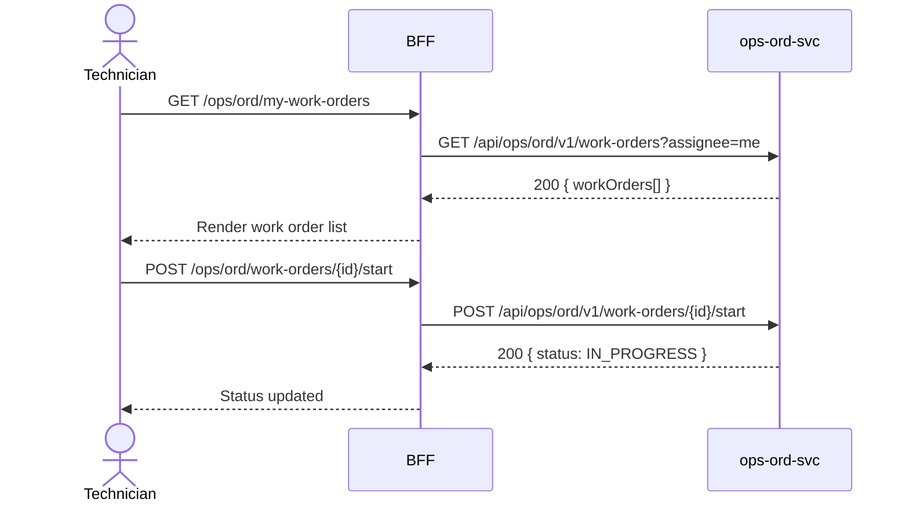

# F-OPS-001-02 — Work Order Execution

> **Conceptual Stack Layer:** Domain-Feature
> **Space:** Business Domain
> **Owner:** Operations Engineering Team
> **Companion files:** `F-OPS-001-02.uvl`, `F-OPS-001-02.aui.yaml`
> **Referenced by:** Suite Feature Catalog §6
> **References:** `domain-specs/ops_ord-spec.md` (backend)

> **Meta Information**
> - **Version:** 2026-04-04
> - **Template:** `feature-spec.md` v1.0.0
> - **Template Compliance:** 100%
> - **Status:** DRAFT
> - **Feature ID:** `F-OPS-001-02`
> - **Suite:** `ops`
> - **Node type:** LEAF
> - **Parent:** `F-OPS-001` — Work Order Management
> - **Companion UVL:** `uvl/leaves/F-OPS-001-02.uvl`
> - **Companion AUI:** `contracts/aui/F-OPS-001-02.aui.yaml`

---

## ═══════════════════════════════════════════════
## PROBLEM SPACE
## ═══════════════════════════════════════════════

## 0. Feature Identity & Orientation

### 0.1 One-Line Summary
This feature lets a **field technician** view their assigned work orders, update status at each stage, and record what work was performed so that dispatch has real-time visibility and billing can be triggered.

### 0.2 Non-Goals
- Does not create new work orders — that is F-OPS-001-01.
- Does not generate closing documents or capture signatures — that is F-OPS-001-03.
- Does not manage resource assignments — that is F-OPS-002-02.

### 0.3 Entry & Exit Points

**Entry points:**
- My Work → "Work Orders"
- Direct URL: `/ops/ord/my-work-orders`
- Push notification from dispatch

**Exit points:**
- Mark complete → triggers F-OPS-001-03 (if included) or sets status COMPLETED
- Back to dashboard

### 0.4 Variability Points

| Variability Point | Model | Values | Default | Binding Time |
|---|---|---|---|---|
| GPS check-in required | UVL attribute | required/optional/disabled | optional | deploy |
| Photo evidence required | UVL attribute | required/optional/disabled | optional | deploy |
| Offline mode support | UVL attribute | enabled/disabled | enabled | deploy |

---

## 1. User Goal & Scenarios

### 1.1 User Goal
See all assigned work, know exactly what is expected, update status as work progresses, and record what was done — all from a mobile device in the field.

### 1.2 Scenarios

| # | Scenario | Precondition | Action | Expected Outcome |
|---|----------|-------------|--------|-----------------|
| S1 | View assigned orders | Technician is authenticated | Open My Work Orders | List of assigned WOs with status, location, SLA countdown |
| S2 | Accept order | WO in status ASSIGNED | Tap "Accept" | Status changes to ACCEPTED; dispatcher notified |
| S3 | Start travel | WO accepted | Tap "En Route" | Status changes to EN_ROUTE; GPS location recorded |
| S4 | Start work | Arrived at site | Tap "Start Work" | Status changes to IN_PROGRESS; clock-in recorded |
| S5 | Record work items | WO in progress | Enter materials used and notes | Work items saved against WO |

---

## 2. User Journey & Screen Layout

### 2.1 Sequence Diagram



### 2.2 Screen Layout

```
┌─────────────────────────────────────────────────────┐
│ My Work Orders                        [Today ▾]      │
├─────────────────────────────────────────────────────┤
│ ● HVAC inspection — Müller GmbH         SLA: 2h 30m │
│   📍 Hauptstr. 5, Berlin    Priority: HIGH           │
│   [Accept]  [Navigate]                               │
├─────────────────────────────────────────────────────┤
│ ● Network install — Techpark B                       │
│   📍 Messeweg 12, Hamburg   Priority: NORMAL         │
│   Status: EN_ROUTE          [Start Work]             │
├─────────────────────────────────────────────────────┤
│ [EXT: extension zone]                                │
└─────────────────────────────────────────────────────┘
```

---

## 3. Interaction Requirements

### 3.1 Fields Table

| Field | Type | Required | Editable | Validation | i18n Key |
|---|---|---|---|---|---|
| Date filter | select | No | Yes | TODAY, THIS_WEEK, ALL | `F-OPS-001-02.filter.date` |
| Work notes | textarea | No | Yes | Max 2000 chars | `F-OPS-001-02.field.notes` |
| Materials used | repeating list | No | Yes | Item + quantity | `F-OPS-001-02.field.materials` |

### 3.2 Actions Table

| Action | Trigger | Precondition | Effect |
|---|---|---|---|
| Accept | Button | WO status ASSIGNED | POST .../accept → status ACCEPTED |
| En Route | Button | WO status ACCEPTED | POST .../en-route → status EN_ROUTE |
| Start Work | Button | WO status EN_ROUTE | POST .../start → status IN_PROGRESS |
| Complete | Button | WO status IN_PROGRESS | POST .../complete → status COMPLETED or triggers F-OPS-001-03 |

### 3.3 Validation Messages

| Field | Condition | Message |
|---|---|---|
| Materials | Negative quantity | `F-OPS-001-02.validation.quantity.negative` |

---

## 4. Edge Cases & Screen States

### 4.1 Component States

| State | When | Behaviour |
|---|---|---|
| **Loading** | Awaiting API | Skeleton cards |
| **Empty** | No WOs assigned | "No work orders assigned for today." |
| **Offline** | Network lost | Cached WO list shown; actions queued locally |
| **Syncing** | Back online | Queued actions replayed; spinner shown |

### 4.2 Specific Edge Cases

| Case | Behaviour | Affected users |
|---|---|---|
| SLA breach | WO card highlighted red; escalation event published | Technician, Dispatcher |
| Duplicate status update | Idempotent POST; no error shown | Poor connectivity |

### 4.3 Attribute-Driven Behaviour Changes

| Attribute | Non-default value | Observable change |
|---|---|---|
| `gpsCheckIn` | required | "Start Work" requires GPS fix within 100m of site |
| `offlineMode` | disabled | No local caching; error shown when offline |

### 4.4 Connectivity
Offline mode: WO list cached for 24 hours. Status transitions queued and replayed on reconnect.

---

## ═══════════════════════════════════════════════
## SOLUTION SPACE
## ═══════════════════════════════════════════════

## 5. Backend Dependencies & BFF Contract

### 5.1 Service Calls

| # | Service | Endpoint | Tier | isMutation | Failure Mode |
|---|---------|----------|------|------------|-------------|
| 1 | ops-ord-svc | `GET /api/ops/ord/v1/work-orders?assignee=me` | T3 | No | Show cached or error |
| 2 | ops-ord-svc | `POST /api/ops/ord/v1/work-orders/{id}/accept` | T3 | Yes | Queue offline |
| 3 | ops-ord-svc | `POST /api/ops/ord/v1/work-orders/{id}/start` | T3 | Yes | Queue offline |
| 4 | ops-ord-svc | `POST /api/ops/ord/v1/work-orders/{id}/complete` | T3 | Yes | Queue offline |

### 5.2 BFF View-Model Shape

```jsonc
{
  "workOrders": [
    {
      "workOrderId": "wo-uuid",
      "title": "HVAC inspection — Müller GmbH",
      "status": "ASSIGNED",
      "priority": "HIGH",
      "location": { "address": "Hauptstr. 5, Berlin" },
      "slaDue": "2026-04-10T14:00:00Z",
      "slaBreached": false
    }
  ],
  "_meta": { "allowedActions": ["ACCEPT", "EN_ROUTE", "START", "COMPLETE"] }
}
```

### 5.3 Feature-Gating Rules

| Mode | Behaviour |
|---|---|
| Full | All status transitions available |
| Excluded | Menu item hidden; direct URL returns 404 |

### 5.4 Failure Modes

| Failure | User Experience |
|---------|----------------|
| ops-ord-svc down | Cached list shown; offline banner |
| Status transition rejected (409) | Inline error; WO list refreshed |

### 5.5 Caching Hints
BFF SHOULD cache WO list per user for 2 minutes. Mobile app SHOULD cache for 24 hours for offline support.

### 5.6 i18n Keys

| Key | Default (en) |
|-----|-------------|
| `F-OPS-001-02.title` | `My Work Orders` |
| `F-OPS-001-02.action.accept` | `Accept` |
| `F-OPS-001-02.action.enRoute` | `En Route` |
| `F-OPS-001-02.action.startWork` | `Start Work` |
| `F-OPS-001-02.action.complete` | `Complete` |
| `F-OPS-001-02.empty` | `No work orders assigned for today.` |

---

## 6. AUI Screen Contract

See companion file `contracts/aui/F-OPS-001-02.aui.yaml`.

---

## ═══════════════════════════════════════════════
## BRIDGE ARTIFACTS
## ═══════════════════════════════════════════════

## 7. Permissions & Accessibility

### 7.1 Permission Matrix

| Action | TECHNICIAN | FIELD_ENGINEER | DISPATCHER | OPERATIONS_MANAGER |
|---|---|---|---|---|
| View assigned WOs | ✓ | ✓ | ✓ (all) | ✓ (all) |
| Accept / start / complete | ✓ | ✓ | ✗ | ✗ |

### 7.2 Accessibility
- Cards MUST have ARIA role `article` with descriptive label.
- Status badges MUST not rely on color alone (include text label).
- Offline banner MUST be announced via `aria-live="assertive"`.

---

## 8. Acceptance Criteria

| AC | Scenario | Given | When | Then |
|----|----------|-------|------|------|
| AC-01 | S1 | Technician opens My Work Orders | Page loads | List shows assigned WOs with SLA countdown |
| AC-02 | S2 | WO in status ASSIGNED | Technician taps Accept | Status becomes ACCEPTED; dispatcher sees update within 30s |
| AC-03 | S4 | WO accepted | Technician taps Start Work | Status becomes IN_PROGRESS; clock-in time recorded |
| AC-04 | S5 | WO in progress | Technician records materials | Materials saved against WO |
| AC-05 | Offline | Network unavailable | Technician taps Start Work | Action queued; status shown as IN_PROGRESS locally |
| AC-06 | SLA breach | SLA deadline passed | WO card rendered | Card highlighted red; escalation event published |

---

## 9. Variability & Extension

### 9.1 Feature Dependencies
Requires IAM authentication. Requires F-OPS-001-01 (work orders must exist before execution).

### 9.2 Attributes
See §0.4 variability points. Binding time: `deploy`.

### 9.3 Extension Points
| Extension Zone | Interface | Default Behaviour |
|---|---|---|
| `ext.workOrderCardActions` | Additional action buttons per WO card | Hidden |

### 9.4 Companion UVL
See `uvl/leaves/F-OPS-001-02.uvl`.

---

**END OF SPECIFICATION**
