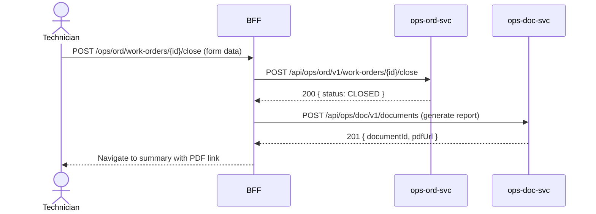

# F-OPS-001-03 — Work Order Close & Report

> **Conceptual Stack Layer:** Domain-Feature
> **Space:** Business Domain
> **Owner:** Operations Engineering Team
> **Companion files:** `F-OPS-001-03.uvl`, `F-OPS-001-03.aui.yaml`
> **Referenced by:** Suite Feature Catalog §6
> **References:** `domain-specs/ops_ord-spec.md`, `domain-specs/ops_doc-spec.md` (backend)

> **Meta Information**
> - **Version:** 2026-04-04
> - **Template:** `feature-spec.md` v1.0.0
> - **Template Compliance:** 100%
> - **Status:** DRAFT
> - **Feature ID:** `F-OPS-001-03`
> - **Suite:** `ops`
> - **Node type:** LEAF
> - **Parent:** `F-OPS-001` — Work Order Management
> - **Companion UVL:** `uvl/leaves/F-OPS-001-03.uvl`
> - **Companion AUI:** `contracts/aui/F-OPS-001-03.aui.yaml`

---

## ═══════════════════════════════════════════════
## PROBLEM SPACE
## ═══════════════════════════════════════════════

## 0. Feature Identity & Orientation

### 0.1 One-Line Summary
This feature lets a **field technician** complete a work order by capturing the completion code, recording materials used, capturing a customer signature, and generating the service report PDF.

### 0.2 Non-Goals
- Does not handle invoicing — that is FI suite.
- Does not manage document storage — that is ops.doc / DMS.
- Does not track time entries — that is F-OPS-003-01.

### 0.3 Entry & Exit Points

**Entry points:**
- Work Order detail → "Close & Report" button (visible when status = IN_PROGRESS)
- Direct URL: `/ops/ord/work-orders/{id}/close`

**Exit points:**
- Submit → work order status = CLOSED; PDF generated; navigate to work order summary
- Cancel → return to work order detail (status unchanged)

### 0.4 Variability Points

| Variability Point | Model | Values | Default | Binding Time |
|---|---|---|---|---|
| Customer signature | UVL attribute | required/optional/disabled | optional | deploy |
| PDF email on close | UVL attribute | auto/manual/disabled | manual | deploy |
| Materials reconciliation | UVL attribute | enabled/disabled | enabled | deploy |

---

## 1. User Goal & Scenarios

### 1.1 User Goal
Formally close out a completed work order with all required evidence — what was done, what was used, and proof the customer accepted the work — and generate the service report immediately at the job site.

### 1.2 Scenarios

| # | Scenario | Precondition | Action | Expected Outcome |
|---|----------|-------------|--------|-----------------|
| S1 | Select completion code | Close form open | Choose RESOLVED from dropdown | Completion code recorded |
| S2 | Record materials used | Close form open | Enter items and quantities | Materials list saved to WO |
| S3 | Capture customer signature | Close form, customer present | Customer signs on screen | Signature image stored |
| S4 | Generate PDF report | All fields complete | Tap "Generate Report" | PDF generated and displayed for review |
| S5 | Email to customer | PDF generated | Tap "Send to Customer" | PDF emailed to customer contact address |

---

## 2. User Journey & Screen Layout

### 2.1 Sequence Diagram



### 2.2 Screen Layout

```
┌─────────────────────────────────────────────────────┐
│ [← Work Order]   Close & Report                      │
├─────────────────────────────────────────────────────┤
│ Completion Code * [RESOLVED ▾]                       │
│ Notes             [Textarea — what was done...]      │
├─────────────────────────────────────────────────────┤
│ Materials Used                                        │
│ [+ Add item]  Item: [___] Qty: [___] Unit: [___]    │
├─────────────────────────────────────────────────────┤
│ Customer Signature                                    │
│ ┌──────────────────────────────┐                     │
│ │  [Signature pad area]        │  [Clear]            │
│ └──────────────────────────────┘                     │
├─────────────────────────────────────────────────────┤
│ [EXT: extension zone]                                │
├─────────────────────────────────────────────────────┤
│          [Cancel]  [Generate Report & Close]         │
└─────────────────────────────────────────────────────┘
```

---

## 3. Interaction Requirements

### 3.1 Fields Table

| Field | Type | Required | Editable | Validation | i18n Key |
|---|---|---|---|---|---|
| Completion Code | select | Yes | Yes | Catalog value (RESOLVED, CANCELLED, DEFERRED, ESCALATED) | `F-OPS-001-03.field.completionCode` |
| Notes | textarea | No | Yes | Max 2000 chars | `F-OPS-001-03.field.notes` |
| Materials | repeating list | No | Yes | Item name + quantity + unit | `F-OPS-001-03.field.materials` |
| Customer Signature | signature pad | Configurable | Yes | Non-empty if required | `F-OPS-001-03.field.signature` |

### 3.2 Actions Table

| Action | Trigger | Precondition | Effect |
|---|---|---|---|
| Generate Report & Close | Button | Completion code selected | POST close + POST document generation |
| Send to Customer | Button (post-close) | PDF generated | Email PDF to customer |
| Cancel | Button | — | Navigate back; WO unchanged |

### 3.3 Validation Messages

| Field | Condition | Message |
|---|---|---|
| Completion Code | Not selected | `F-OPS-001-03.validation.completionCode.required` |
| Signature | Required mode, empty | `F-OPS-001-03.validation.signature.required` |

---

## 4. Edge Cases & Screen States

### 4.1 Component States

| State | When | Behaviour |
|---|---|---|
| **Idle** | Form loaded | All fields editable |
| **Generating** | PDF generation in progress | Spinner; form locked |
| **Success** | PDF ready | PDF preview + email button |
| **Error** | ops-doc-svc unavailable | WO still closed; PDF retry available |

### 4.2 Specific Edge Cases

| Case | Behaviour | Affected users |
|---|---|---|
| ops-doc-svc unavailable | WO is closed; PDF generated async when service recovers | Technician |
| Customer refuses to sign | Technician can proceed without signature (unless required mode) | Technician |

### 4.3 Attribute-Driven Behaviour Changes

| Attribute | Non-default value | Observable change |
|---|---|---|
| `customerSignature` | required | Cannot submit without signature |
| `pdfEmailOnClose` | auto | Email sent automatically; no manual Send button |

### 4.4 Connectivity
If offline: close action queued locally; PDF generated when back online.

---

## ═══════════════════════════════════════════════
## SOLUTION SPACE
## ═══════════════════════════════════════════════

## 5. Backend Dependencies & BFF Contract

### 5.1 Service Calls

| # | Service | Endpoint | Tier | isMutation | Failure Mode |
|---|---------|----------|------|------------|-------------|
| 1 | ops-ord-svc | `POST /api/ops/ord/v1/work-orders/{id}/close` | T3 | Yes | Show error; allow retry |
| 2 | ops-doc-svc | `POST /api/ops/doc/v1/documents` | T3 | Yes | WO closed; PDF async |

### 5.2 BFF View-Model Shape

```jsonc
{
  "close": {
    "workOrderId": "wo-uuid",
    "completionCode": "RESOLVED",
    "notes": "Replaced filter unit. System running normally.",
    "materials": [{ "item": "HVAC-filter-F12", "qty": 2, "unit": "PCS" }],
    "signatureData": "data:image/png;base64,..."
  },
  "_meta": { "documentId": "doc-uuid", "pdfUrl": "/documents/doc-uuid/pdf" }
}
```

### 5.3 Feature-Gating Rules

| Mode | Behaviour |
|---|---|
| Full | All interactions available |
| Excluded | "Close & Report" button hidden; URL returns 404 |

### 5.4 Failure Modes

| Failure | User Experience |
|---------|----------------|
| ops-doc-svc down | WO closed successfully; banner: "Report will be generated when service is available." |

### 5.5 Caching Hints
No caching. All POST operations are mutations.

### 5.6 i18n Keys

| Key | Default (en) |
|-----|-------------|
| `F-OPS-001-03.title` | `Close & Report` |
| `F-OPS-001-03.field.completionCode` | `Completion Code` |
| `F-OPS-001-03.action.generate` | `Generate Report & Close` |
| `F-OPS-001-03.action.sendToCustomer` | `Send to Customer` |
| `F-OPS-001-03.success.closed` | `Work order closed and report generated.` |

---

## 6. AUI Screen Contract

See companion file `contracts/aui/F-OPS-001-03.aui.yaml`.

---

## ═══════════════════════════════════════════════
## BRIDGE ARTIFACTS
## ═══════════════════════════════════════════════

## 7. Permissions & Accessibility

### 7.1 Permission Matrix

| Action | TECHNICIAN | FIELD_ENGINEER | DISPATCHER | OPERATIONS_MANAGER |
|---|---|---|---|---|
| Close work order | ✓ | ✓ | ✗ | ✓ |
| Generate report | ✓ | ✓ | ✗ | ✓ |
| Send to customer | ✓ | ✓ | ✓ | ✓ |

### 7.2 Accessibility
- Signature pad MUST have keyboard fallback (type name) for accessibility.
- PDF link MUST open in new tab with `aria-label="Open service report PDF"`.

---

## 8. Acceptance Criteria

| AC | Scenario | Given | When | Then |
|----|----------|-------|------|------|
| AC-01 | S1 | Technician opens Close form | Selects RESOLVED | Completion code stored on submit |
| AC-02 | S3 | Customer signs on screen | Form submitted | Signature image linked to work order |
| AC-03 | S4 | All fields valid | Technician taps Generate Report & Close | WO status = CLOSED; PDF available within 10 seconds |
| AC-04 | S5 | PDF generated | Technician taps Send to Customer | Email dispatched to customer primary contact |
| AC-05 | Error | ops-doc-svc unavailable | Form submitted | WO closed; async PDF generation notice shown |

---

## 9. Variability & Extension

### 9.1 Feature Dependencies
Requires F-OPS-001-02 (cannot close a work order that was never started). Requires ops-doc-svc for PDF generation.

### 9.2 Attributes
See §0.4 variability points. Binding time: `deploy`.

### 9.3 Extension Points
| Extension Zone | Interface | Default Behaviour |
|---|---|---|
| `ext.closeFormChecklist` | Pre-close checklist items | Hidden |

### 9.4 Companion UVL
See `uvl/leaves/F-OPS-001-03.uvl`.

---

**END OF SPECIFICATION**
