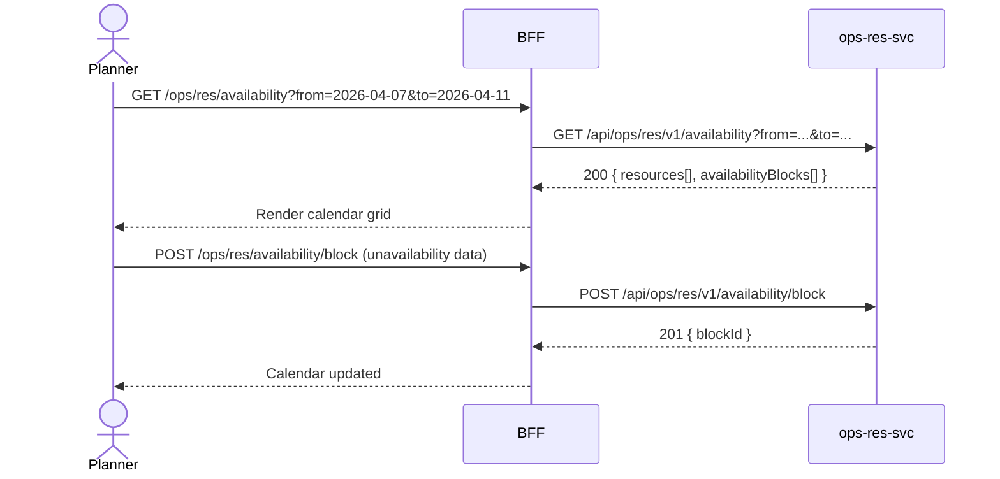

# F-OPS-002-01 — Resource Availability

> **Conceptual Stack Layer:** Domain-Feature
> **Space:** Business Domain
> **Owner:** Operations Engineering Team
> **Companion files:** `F-OPS-002-01.uvl`, `F-OPS-002-01.aui.yaml`
> **Referenced by:** Suite Feature Catalog §6
> **References:** `domain-specs/ops_res-spec.md` (backend)

> **Meta Information**
> - **Version:** 2026-04-04
> - **Template:** `feature-spec.md` v1.0.0
> - **Template Compliance:** 100%
> - **Status:** DRAFT
> - **Feature ID:** `F-OPS-002-01`
> - **Suite:** `ops`
> - **Node type:** LEAF
> - **Parent:** `F-OPS-002` — Resource & Scheduling
> - **Companion UVL:** `uvl/leaves/F-OPS-002-01.uvl`
> - **Companion AUI:** `contracts/aui/F-OPS-002-01.aui.yaml`

---

## ═══════════════════════════════════════════════
## PROBLEM SPACE
## ═══════════════════════════════════════════════

## 0. Feature Identity & Orientation

### 0.1 One-Line Summary
This feature lets a **resource planner** view the current and future availability of all resources filtered by skill and location so that they can identify who is free to take on new work.

### 0.2 Non-Goals
- Does not assign resources to work orders — that is F-OPS-002-02.
- Does not calculate payroll or HR leave — that is HR suite.
- Does not display utilization rates — that is F-OPS-002-03.

### 0.3 Entry & Exit Points

**Entry points:**
- Planning → "Resource Availability"
- Direct URL: `/ops/res/availability`

**Exit points:**
- Click resource → navigate to F-OPS-002-02 Schedule Board pre-filtered to that resource
- Set unavailability → inline form; stays on same page

### 0.4 Variability Points

| Variability Point | Model | Values | Default | Binding Time |
|---|---|---|---|---|
| Default view period | UVL attribute | DAY, WEEK, MONTH | WEEK | runtime |
| Resource type filter | UVL attribute | EMPLOYEE, VEHICLE, MACHINE, ALL | ALL | runtime |

---

## 1. User Goal & Scenarios

### 1.1 User Goal
Quickly see who is available, for how long, in what location, and with what skills — so that the right resource can be matched to the next incoming work order.

### 1.2 Scenarios

| # | Scenario | Precondition | Action | Expected Outcome |
|---|----------|-------------|--------|-----------------|
| S1 | View availability calendar | Planner authenticated | Open Resource Availability | Calendar grid showing all resources and their availability blocks |
| S2 | Filter by skill | Calendar displayed | Select skill "HVAC-certified" | Only HVAC-certified resources shown |
| S3 | Filter by location | Calendar displayed | Select location "Berlin" | Only Berlin-based resources shown |
| S4 | View resource detail | Calendar displayed | Click resource row | Resource profile with skills, certifications, and weekly hours |
| S5 | Set unavailability | Calendar displayed | Click "+Block" on resource | Inline form to enter unavailability reason and dates |

---

## 2. User Journey & Screen Layout

### 2.1 Sequence Diagram



### 2.2 Screen Layout

```
┌─────────────────────────────────────────────────────┐
│ Resource Availability   [Week: Apr 7–11 ▾] [< >]   │
├──────────────┬──────────────────────────────────────┤
│ Filters:     │ [Skill: All ▾]  [Location: All ▾]   │
│              │ [Type: All ▾]                        │
├──────────────┼────┬────┬────┬────┬────┬─────────────┤
│ Resource     │Mon │Tue │Wed │Thu │Fri │ Skills       │
├──────────────┼────┼────┼────┼────┼────┼─────────────┤
│ A. Müller    │ ██ │ ██ │    │ ██ │ ██ │ HVAC, Elec  │
│ B. Schmidt   │    │    │ ██ │    │    │ Plumbing     │
│ C. Weber     │ ██ │ ██ │ ██ │    │ ██ │ HVAC         │
├──────────────┴────┴────┴────┴────┴────┴─────────────┤
│ [EXT: extension zone]                                │
└─────────────────────────────────────────────────────┘
█ = Available  (blank) = Unavailable/Blocked
```

---

## 3. Interaction Requirements

### 3.1 Fields Table

| Field | Type | Required | Editable | Validation | i18n Key |
|---|---|---|---|---|---|
| Period | date range | Yes | Yes | Max 31 days span | `F-OPS-002-01.filter.period` |
| Skill filter | multi-select | No | Yes | Catalog values | `F-OPS-002-01.filter.skill` |
| Location filter | select | No | Yes | Catalog values | `F-OPS-002-01.filter.location` |
| Block reason | select | Yes (when blocking) | Yes | LEAVE, TRAINING, SICK, OTHER | `F-OPS-002-01.field.blockReason` |
| Block dates | date range | Yes (when blocking) | Yes | Non-overlapping | `F-OPS-002-01.field.blockDates` |

### 3.2 Actions Table

| Action | Trigger | Precondition | Effect |
|---|---|---|---|
| Filter | Select change | — | Reload calendar grid |
| Navigate period | Arrow buttons | — | Shift period forward/back |
| View resource | Row click | — | Navigate to resource detail |
| Block availability | "+ Block" click | — | Open inline block form |

### 3.3 Validation Messages

| Field | Condition | Message |
|---|---|---|
| Block dates | Overlaps existing block | `F-OPS-002-01.validation.block.overlap` |

---

## 4. Edge Cases & Screen States

### 4.1 Component States

| State | When | Behaviour |
|---|---|---|
| **Loading** | Awaiting API | Calendar skeleton |
| **Empty** | No resources match filters | "No resources found for selected filters." |
| **Error** | ops-res-svc unavailable | Error banner with retry |

### 4.2 Specific Edge Cases

| Case | Behaviour | Affected users |
|---|---|---|
| > 100 resources | Server-side pagination; row virtualization | Large teams |
| Block overlap | Validation error on submit | Planner |

### 4.3 Attribute-Driven Behaviour Changes

| Attribute | Non-default value | Observable change |
|---|---|---|
| `defaultViewPeriod` | MONTH | Calendar opens in monthly view |

### 4.4 Connectivity
Requires live connection. On loss: error banner; calendar data not cached.

---

## ═══════════════════════════════════════════════
## SOLUTION SPACE
## ═══════════════════════════════════════════════

## 5. Backend Dependencies & BFF Contract

### 5.1 Service Calls

| # | Service | Endpoint | Tier | isMutation | Failure Mode |
|---|---------|----------|------|------------|-------------|
| 1 | ops-res-svc | `GET /api/ops/res/v1/availability` | T3 | No | Error + retry |
| 2 | ops-res-svc | `POST /api/ops/res/v1/availability/block` | T3 | Yes | Error + retry |

### 5.2 BFF View-Model Shape

```jsonc
{
  "resources": [
    {
      "resourceId": "res-uuid",
      "name": "A. Müller",
      "skills": ["HVAC-certified", "Electrical"],
      "location": "Berlin",
      "availability": [
        { "date": "2026-04-07", "status": "AVAILABLE" },
        { "date": "2026-04-09", "status": "BLOCKED", "reason": "TRAINING" }
      ]
    }
  ]
}
```

### 5.3 Feature-Gating Rules

| Mode | Behaviour |
|---|---|
| Full | Read and block operations available |
| Excluded | Menu item hidden; URL returns 404 |

### 5.4 Failure Modes

| Failure | User Experience |
|---------|----------------|
| ops-res-svc down | Error banner with retry |

### 5.5 Caching Hints
BFF SHOULD cache availability grid for 1 minute. Cache invalidated on `ops.res.resource.availability.updated` event.

### 5.6 i18n Keys

| Key | Default (en) |
|-----|-------------|
| `F-OPS-002-01.title` | `Resource Availability` |
| `F-OPS-002-01.filter.skill` | `Skill` |
| `F-OPS-002-01.filter.location` | `Location` |
| `F-OPS-002-01.action.block` | `Block Availability` |
| `F-OPS-002-01.empty` | `No resources found for selected filters.` |

---

## 6. AUI Screen Contract

See companion file `contracts/aui/F-OPS-002-01.aui.yaml`.

---

## ═══════════════════════════════════════════════
## BRIDGE ARTIFACTS
## ═══════════════════════════════════════════════

## 7. Permissions & Accessibility

### 7.1 Permission Matrix

| Action | RESOURCE_PLANNER | OPERATIONS_MANAGER | DISPATCHER | TECHNICIAN |
|---|---|---|---|---|
| View availability | ✓ | ✓ | ✓ | ✓ (own only) |
| Block availability | ✓ | ✓ | ✗ | ✗ |

### 7.2 Accessibility
- Calendar grid MUST have ARIA role `grid` with column/row headers.
- Availability status MUST not rely on color alone (use `aria-label`).

---

## 8. Acceptance Criteria

| AC | Scenario | Given | When | Then |
|----|----------|-------|------|------|
| AC-01 | S1 | Planner opens availability page | Page loads | Calendar shows all resources with availability blocks |
| AC-02 | S2 | Calendar displayed | Planner selects skill HVAC-certified | Only HVAC-certified resources shown |
| AC-03 | S5 | Calendar displayed | Planner creates availability block | Block saved; calendar cell shows BLOCKED |
| AC-04 | Overlap | Resource already blocked | Planner creates overlapping block | Validation error shown |

---

## 9. Variability & Extension

### 9.1 Feature Dependencies
Requires IAM authentication. Resource master data comes from ops-res-svc.

### 9.2 Attributes
See §0.4 variability points. Binding time: `runtime`.

### 9.3 Extension Points
| Extension Zone | Interface | Default Behaviour |
|---|---|---|
| `ext.resourceCalendarColumns` | Additional calendar columns | Hidden |

### 9.4 Companion UVL
See `uvl/leaves/F-OPS-002-01.uvl`.

---

**END OF SPECIFICATION**
