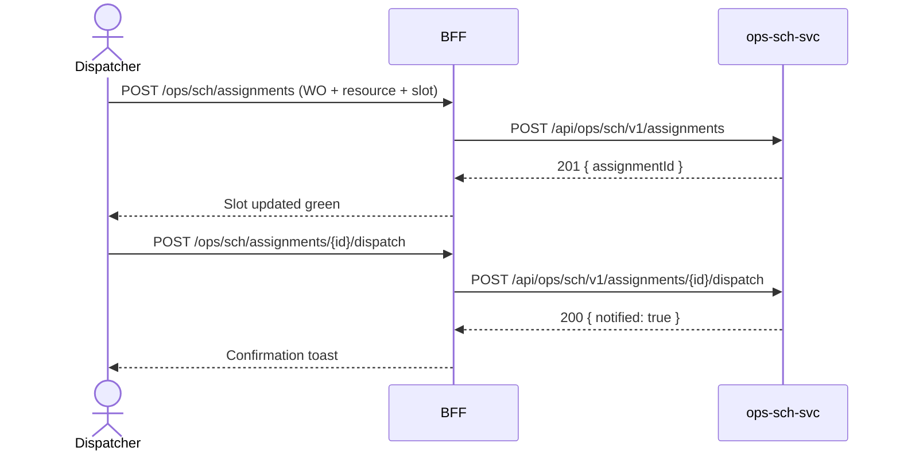

# F-OPS-002-02 — Schedule Assignment

> **Conceptual Stack Layer:** Domain-Feature
> **Space:** Business Domain
> **Owner:** Operations Engineering Team
> **Companion files:** `F-OPS-002-02.uvl`, `F-OPS-002-02.aui.yaml`
> **Referenced by:** Suite Feature Catalog §6
> **References:** `domain-specs/ops_sch-spec.md` (backend)

> **Meta Information**
> - **Version:** 2026-04-04
> - **Template:** `feature-spec.md` v1.0.0
> - **Template Compliance:** 100%
> - **Status:** DRAFT
> - **Feature ID:** `F-OPS-002-02`
> - **Suite:** `ops`
> - **Node type:** LEAF
> - **Parent:** `F-OPS-002` — Resource & Scheduling
> - **Companion UVL:** `uvl/leaves/F-OPS-002-02.uvl`
> - **Companion AUI:** `contracts/aui/F-OPS-002-02.aui.yaml`

---

## ═══════════════════════════════════════════════
## PROBLEM SPACE
## ═══════════════════════════════════════════════

## 0. Feature Identity & Orientation

### 0.1 One-Line Summary
This feature lets a **dispatcher** assign available resources to work orders via a drag-and-drop schedule board and send dispatch notifications to the assigned technician.

### 0.2 Non-Goals
- Does not manage resource availability blocks — that is F-OPS-002-01.
- Does not create work orders — that is F-OPS-001-01.
- Does not calculate route optimization — that is a future P3 feature.

### 0.3 Entry & Exit Points

**Entry points:**
- Planning → "Schedule Board"
- Direct URL: `/ops/sch/board`

**Exit points:**
- Dispatch → notification sent to technician; navigate to work order detail
- Back to planning dashboard

### 0.4 Variability Points

| Variability Point | Model | Values | Default | Binding Time |
|---|---|---|---|---|
| Travel time display | UVL attribute | enabled/disabled | enabled | deploy |
| Auto-dispatch on assignment | UVL attribute | enabled/disabled | disabled | deploy |
| Conflict warning | UVL attribute | block/warn/disabled | warn | deploy |

---

## 1. User Goal & Scenarios

### 1.1 User Goal
Efficiently place the right resource on the right work order at the right time — reducing scheduling conflicts, minimizing travel, and getting dispatch notifications out instantly.

### 1.2 Scenarios

| # | Scenario | Precondition | Action | Expected Outcome |
|---|----------|-------------|--------|-----------------|
| S1 | View schedule board | Dispatcher authenticated | Open Schedule Board | Board shows unassigned WOs (left panel) and resource time slots (grid) |
| S2 | Assign resource to WO | WO unassigned, resource available | Drag WO card onto resource slot | Assignment created; slot turns green |
| S3 | Reassign | WO already assigned | Drag to different resource slot | Old assignment removed; new one created |
| S4 | View travel time | Assignment created | Hover assignment card | Estimated travel time from previous location shown |
| S5 | Send dispatch notification | Assignment confirmed | Click "Dispatch" | Push notification sent to technician; WO status = ASSIGNED |

---

## 2. User Journey & Screen Layout

### 2.1 Sequence Diagram



### 2.2 Screen Layout

```
┌──────────────┬──────────────────────────────────────┐
│ Unassigned   │ Schedule Board   [Week: Apr 7–11 ▾]  │
│ Work Orders  ├────────┬────┬────┬────┬────┬─────────┤
│              │        │Mon │Tue │Wed │Thu │Fri      │
│ [WO-001]     ├────────┼────┼────┼────┼────┼─────────┤
│ HVAC inspect │Müller  │ WO │    │    │    │         │
│ Priority: H  │Schmidt │    │ WO │    │    │         │
│ SLA: 4h      │Weber   │    │    │ WO │ WO │         │
│              ├────────┴────┴────┴────┴────┴─────────┤
│ [WO-002]     │ [EXT: extension zone]                 │
│ Network inst │                                       │
└──────────────┴──────────────────────────────────────┘
```

---

## 3. Interaction Requirements

### 3.1 Fields Table

| Field | Type | Required | Editable | Validation | i18n Key |
|---|---|---|---|---|---|
| Week selector | date picker | Yes | Yes | — | `F-OPS-002-02.filter.week` |
| Resource filter | multi-select | No | Yes | Catalog values | `F-OPS-002-02.filter.resource` |

### 3.2 Actions Table

| Action | Trigger | Precondition | Effect |
|---|---|---|---|
| Assign | Drag WO → resource slot | Slot available | POST assignment |
| Reassign | Drag to new slot | — | DELETE old + POST new |
| Dispatch | Button on assignment card | Assignment exists | POST dispatch |
| Remove assignment | Right-click → Remove | Assignment exists | DELETE assignment |

### 3.3 Validation Messages

| Field | Condition | Message |
|---|---|---|
| Slot | Conflict detected | `F-OPS-002-02.validation.conflict` (warn or block per config) |

---

## 4. Edge Cases & Screen States

### 4.1 Component States

| State | When | Behaviour |
|---|---|---|
| **Loading** | Board data loading | Skeleton grid |
| **Conflict (warn)** | Overlap detected | Amber warning; allow proceed |
| **Conflict (block)** | Overlap detected | Red error; prevent drop |
| **Error** | ops-sch-svc unavailable | Error banner; board read-only |

### 4.2 Specific Edge Cases

| Case | Behaviour | Affected users |
|---|---|---|
| Overbooking attempt | Warn or block per config | Dispatcher |
| Technician rejects assignment | WO returns to unassigned panel | Dispatcher (notified by event) |

### 4.3 Attribute-Driven Behaviour Changes

| Attribute | Non-default value | Observable change |
|---|---|---|
| `autoDispatch` | enabled | Dispatch notification sent automatically on assignment |
| `conflictWarning` | block | Drag-and-drop prevented on conflict |

### 4.4 Connectivity
Requires live connection. Board not available offline.

---

## ═══════════════════════════════════════════════
## SOLUTION SPACE
## ═══════════════════════════════════════════════

## 5. Backend Dependencies & BFF Contract

### 5.1 Service Calls

| # | Service | Endpoint | Tier | isMutation | Failure Mode |
|---|---------|----------|------|------------|-------------|
| 1 | ops-sch-svc | `GET /api/ops/sch/v1/board` | T3 | No | Error + retry |
| 2 | ops-sch-svc | `POST /api/ops/sch/v1/assignments` | T3 | Yes | Error; undo drag |
| 3 | ops-sch-svc | `POST /api/ops/sch/v1/assignments/{id}/dispatch` | T3 | Yes | Error + retry |

### 5.2 BFF View-Model Shape

```jsonc
{
  "unassigned": [
    { "workOrderId": "wo-uuid", "title": "HVAC inspect", "priority": "HIGH", "slaDue": "2026-04-10T14:00:00Z" }
  ],
  "assignments": [
    { "assignmentId": "asgn-uuid", "workOrderId": "wo-uuid", "resourceId": "res-uuid", "slot": { "from": "2026-04-07T08:00:00Z", "to": "2026-04-07T12:00:00Z" }, "dispatched": false }
  ]
}
```

### 5.3 Feature-Gating Rules

| Mode | Behaviour |
|---|---|
| Full | Drag-and-drop and dispatch available |
| Excluded | Menu item hidden; URL returns 404 |

### 5.4 Failure Modes

| Failure | User Experience |
|---------|----------------|
| POST assignment fails | Drag undone; error toast |
| Dispatch notification fails | Assignment kept; retry button shown |

### 5.5 Caching Hints
Board data SHOULD NOT be cached (real-time scheduling). WebSocket or polling every 30 seconds recommended.

### 5.6 i18n Keys

| Key | Default (en) |
|-----|-------------|
| `F-OPS-002-02.title` | `Schedule Board` |
| `F-OPS-002-02.action.dispatch` | `Dispatch` |
| `F-OPS-002-02.validation.conflict` | `This slot conflicts with an existing assignment.` |
| `F-OPS-002-02.success.dispatched` | `Technician notified.` |

---

## 6. AUI Screen Contract

See companion file `contracts/aui/F-OPS-002-02.aui.yaml`.

---

## ═══════════════════════════════════════════════
## BRIDGE ARTIFACTS
## ═══════════════════════════════════════════════

## 7. Permissions & Accessibility

### 7.1 Permission Matrix

| Action | DISPATCHER | OPERATIONS_MANAGER | RESOURCE_PLANNER | TECHNICIAN |
|---|---|---|---|---|
| View board | ✓ | ✓ | ✓ | ✗ |
| Assign resource | ✓ | ✓ | ✓ | ✗ |
| Dispatch | ✓ | ✓ | ✗ | ✗ |

### 7.2 Accessibility
- Drag-and-drop MUST have keyboard alternative (select WO → select slot → confirm).
- Assignment cards MUST have descriptive `aria-label`.

---

## 8. Acceptance Criteria

| AC | Scenario | Given | When | Then |
|----|----------|-------|------|------|
| AC-01 | S1 | Dispatcher opens board | Page loads | Unassigned WOs shown left; resource slots shown in grid |
| AC-02 | S2 | Resource slot available | Dispatcher drags WO onto slot | Assignment created; slot turns green |
| AC-03 | S5 | Assignment exists | Dispatcher clicks Dispatch | Push notification sent; WO status = ASSIGNED |
| AC-04 | Conflict (warn) | Slot partially occupied | Dispatcher drags WO | Warning shown; dispatcher can proceed or cancel |
| AC-05 | Conflict (block) | Slot fully occupied | Dispatcher drags WO | Drop rejected; error shown |

---

## 9. Variability & Extension

### 9.1 Feature Dependencies
Requires F-OPS-001-01 (work orders must exist). Requires F-OPS-002-01 (availability data feeds the board).

### 9.2 Attributes
See §0.4 variability points. Binding time: `deploy`.

### 9.3 Extension Points
| Extension Zone | Interface | Default Behaviour |
|---|---|---|
| `ext.boardSidebar` | Additional sidebar panels | Hidden |

### 9.4 Companion UVL
See `uvl/leaves/F-OPS-002-02.uvl`.

---

**END OF SPECIFICATION**
