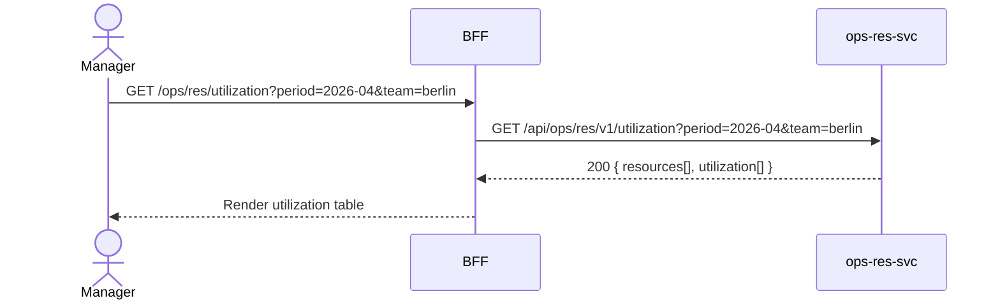

# F-OPS-002-03 — Utilization Report

> **Conceptual Stack Layer:** Domain-Feature
> **Space:** Business Domain
> **Owner:** Operations Engineering Team
> **Companion files:** `F-OPS-002-03.uvl`, `F-OPS-002-03.aui.yaml`
> **Referenced by:** Suite Feature Catalog §6
> **References:** `domain-specs/ops_res-spec.md` (backend)

> **Meta Information**
> - **Version:** 2026-04-04
> - **Template:** `feature-spec.md` v1.0.0
> - **Template Compliance:** 100%
> - **Status:** DRAFT
> - **Feature ID:** `F-OPS-002-03`
> - **Suite:** `ops`
> - **Node type:** LEAF
> - **Parent:** `F-OPS-002` — Resource & Scheduling
> - **Companion UVL:** `uvl/leaves/F-OPS-002-03.uvl`
> - **Companion AUI:** `contracts/aui/F-OPS-002-03.aui.yaml`

---

## ═══════════════════════════════════════════════
## PROBLEM SPACE
## ═══════════════════════════════════════════════

## 0. Feature Identity & Orientation

### 0.1 One-Line Summary
This feature lets an **operations manager** view resource utilization rates by period, team, and skill group so that they can identify over- and under-utilization and adjust capacity accordingly.

### 0.2 Non-Goals
- Does not create assignments or availability blocks — those are F-OPS-002-01 and F-OPS-002-02.
- Does not produce payroll reports — that is HR suite.
- Does not show individual time entries — that is F-OPS-003-01.

### 0.3 Entry & Exit Points

**Entry points:**
- Reports → "Utilization"
- Direct URL: `/ops/res/utilization`

**Exit points:**
- Click resource row → navigate to F-OPS-002-01 (Availability) filtered to that resource
- Export → download CSV/PDF

### 0.4 Variability Points

| Variability Point | Model | Values | Default | Binding Time |
|---|---|---|---|---|
| Default period | UVL attribute | WEEK, MONTH, QUARTER | MONTH | runtime |
| Target utilization threshold | UVL attribute | 0–100% | 80% | deploy |

---

## 1. User Goal & Scenarios

### 1.1 User Goal
Understand whether the team is being used efficiently — identify who is overloaded, who has spare capacity, and how overall utilization compares to targets — at a glance.

### 1.2 Scenarios

| # | Scenario | Precondition | Action | Expected Outcome |
|---|----------|-------------|--------|-----------------|
| S1 | Monthly summary | Manager authenticated | Open Utilization, select month | Summary table with utilization % per resource |
| S2 | Filter by team | Summary displayed | Select team "Field Berlin" | Only Berlin field team resources shown |
| S3 | Drill to resource | Summary displayed | Click resource name | Detail view with daily utilization chart |
| S4 | Compare to target | Summary displayed | View target column | Green/amber/red indication vs 80% target |
| S5 | Export | Summary displayed | Click Export | CSV downloaded with utilization data |

---

## 2. User Journey & Screen Layout

### 2.1 Sequence Diagram



### 2.2 Screen Layout

```
┌─────────────────────────────────────────────────────┐
│ Resource Utilization   [April 2026 ▾] [Team: All ▾] │
├─────────────────────┬──────────┬────────┬───────────┤
│ Resource            │ Available│ Booked │ Util %    │
├─────────────────────┼──────────┼────────┼───────────┤
│ A. Müller           │  160h    │  142h  │ 89% ●     │
│ B. Schmidt          │  160h    │   52h  │ 33% ▲     │
│ C. Weber            │  160h    │  128h  │ 80% ✓     │
├─────────────────────┴──────────┴────────┴───────────┤
│ Legend: ● Over target  ✓ On target  ▲ Under target  │
│                               [Export CSV] [Export PDF] │
└─────────────────────────────────────────────────────┘
```

---

## 3. Interaction Requirements

### 3.1 Fields Table

| Field | Type | Required | Editable | Validation | i18n Key |
|---|---|---|---|---|---|
| Period | month picker | Yes | Yes | — | `F-OPS-002-03.filter.period` |
| Team filter | select | No | Yes | Catalog values | `F-OPS-002-03.filter.team` |
| Skill filter | multi-select | No | Yes | Catalog values | `F-OPS-002-03.filter.skill` |

### 3.2 Actions Table

| Action | Trigger | Precondition | Effect |
|---|---|---|---|
| Filter | Select change | — | Reload utilization data |
| Drill to resource | Row click | — | Navigate to resource detail |
| Export CSV | Button | — | Download utilization data as CSV |
| Export PDF | Button | — | Download formatted PDF report |

### 3.3 Validation Messages
None — read-only report screen.

---

## 4. Edge Cases & Screen States

### 4.1 Component States

| State | When | Behaviour |
|---|---|---|
| **Loading** | Awaiting API | Table skeleton |
| **Empty** | No resources in team | "No resources found for selected filters." |
| **Error** | ops-res-svc unavailable | Error banner with retry |

### 4.2 Specific Edge Cases

| Case | Behaviour | Affected users |
|---|---|---|
| Resource with 0 available hours | Row shown with N/A utilization | Manager |
| Future period selected | Data shows scheduled (projected) utilization | Manager |

### 4.3 Attribute-Driven Behaviour Changes

| Attribute | Non-default value | Observable change |
|---|---|---|
| `targetUtilization` | 70% | Threshold for green/amber/red changes |

### 4.4 Connectivity
Requires live connection. No caching — real-time accuracy expected.

---

## ═══════════════════════════════════════════════
## SOLUTION SPACE
## ═══════════════════════════════════════════════

## 5. Backend Dependencies & BFF Contract

### 5.1 Service Calls

| # | Service | Endpoint | Tier | isMutation | Failure Mode |
|---|---------|----------|------|------------|-------------|
| 1 | ops-res-svc | `GET /api/ops/res/v1/utilization` | T3 | No | Error + retry |

### 5.2 BFF View-Model Shape

```jsonc
{
  "period": "2026-04",
  "target": 80,
  "resources": [
    {
      "resourceId": "res-uuid",
      "name": "A. Müller",
      "availableHours": 160,
      "bookedHours": 142,
      "utilizationPct": 89,
      "status": "OVER_TARGET"
    }
  ]
}
```

### 5.3 Feature-Gating Rules

| Mode | Behaviour |
|---|---|
| Full | Full read + export |
| Excluded | Menu item hidden; URL returns 404 |

### 5.4 Failure Modes

| Failure | User Experience |
|---------|----------------|
| ops-res-svc down | Error banner with retry |

### 5.5 Caching Hints
BFF MAY cache utilization data for 5 minutes for same period/team combination.

### 5.6 i18n Keys

| Key | Default (en) |
|-----|-------------|
| `F-OPS-002-03.title` | `Resource Utilization` |
| `F-OPS-002-03.filter.period` | `Period` |
| `F-OPS-002-03.filter.team` | `Team` |
| `F-OPS-002-03.action.exportCsv` | `Export CSV` |
| `F-OPS-002-03.action.exportPdf` | `Export PDF` |

---

## 6. AUI Screen Contract

See companion file `contracts/aui/F-OPS-002-03.aui.yaml`.

---

## ═══════════════════════════════════════════════
## BRIDGE ARTIFACTS
## ═══════════════════════════════════════════════

## 7. Permissions & Accessibility

### 7.1 Permission Matrix

| Action | OPERATIONS_MANAGER | RESOURCE_PLANNER | DISPATCHER | TECHNICIAN |
|---|---|---|---|---|
| View utilization | ✓ | ✓ | ✗ | ✗ |
| Export | ✓ | ✓ | ✗ | ✗ |

### 7.2 Accessibility
- Status indicators MUST use text plus icon (not color only).
- Export buttons MUST have descriptive `aria-label`.

---

## 8. Acceptance Criteria

| AC | Scenario | Given | When | Then |
|----|----------|-------|------|------|
| AC-01 | S1 | Manager opens Utilization | Selects April 2026 | Table shows utilization % per resource for that month |
| AC-02 | S4 | Summary displayed | Target is 80% | Resources >80% shown in over-target state; <80% in under-target |
| AC-03 | S5 | Summary displayed | Manager clicks Export CSV | CSV file downloaded with period, resource, hours, utilization % |
| AC-04 | S3 | Manager clicks resource | Detail view opens | Daily utilization chart shown for that resource |

---

## 9. Variability & Extension

### 9.1 Feature Dependencies
Requires F-OPS-002-01 (availability data feeds utilization calculation).

### 9.2 Attributes
See §0.4 variability points. Binding time: `runtime` for period, `deploy` for target threshold.

### 9.3 Extension Points
| Extension Zone | Interface | Default Behaviour |
|---|---|---|
| `ext.utilizationCharts` | Custom chart panels | Hidden |

### 9.4 Companion UVL
See `uvl/leaves/F-OPS-002-03.uvl`.

---

**END OF SPECIFICATION**
