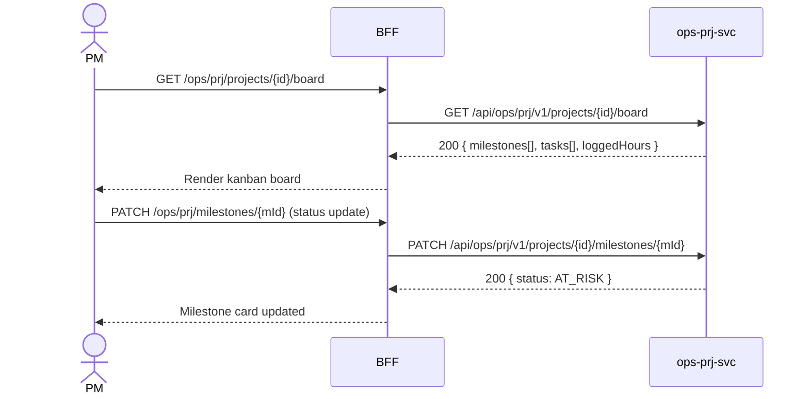

# F-OPS-003-02 — Project Status Board

> **Conceptual Stack Layer:** Domain-Feature
> **Space:** Business Domain
> **Owner:** Operations Engineering Team
> **Companion files:** `F-OPS-003-02.uvl`, `F-OPS-003-02.aui.yaml`
> **Referenced by:** Suite Feature Catalog §6
> **References:** `domain-specs/ops_prj-spec.md` (backend)

> **Meta Information**
> - **Version:** 2026-04-04
> - **Template:** `feature-spec.md` v1.0.0
> - **Template Compliance:** 100%
> - **Status:** DRAFT
> - **Feature ID:** `F-OPS-003-02`
> - **Suite:** `ops`
> - **Node type:** LEAF
> - **Parent:** `F-OPS-003` — Time & Project Tracking
> - **Companion UVL:** `uvl/leaves/F-OPS-003-02.uvl`
> - **Companion AUI:** `contracts/aui/F-OPS-003-02.aui.yaml`

---

## ═══════════════════════════════════════════════
## PROBLEM SPACE
## ═══════════════════════════════════════════════

## 0. Feature Identity & Orientation

### 0.1 One-Line Summary
This feature lets a **project manager** view the current health of all milestones and tasks across a project and update milestone status so that stakeholders always have an accurate picture of progress.

### 0.2 Non-Goals
- Does not create or manage tasks in detail — that is F-OPS-003-03 (optional).
- Does not manage budgets or financial forecasting — that is FI suite.
- Does not replace a full PPM tool — OPS board is for operational status tracking only.

### 0.3 Entry & Exit Points

**Entry points:**
- Projects → select project → "Status Board"
- Direct URL: `/ops/prj/projects/{id}/board`

**Exit points:**
- Click task → navigate to task detail (F-OPS-003-03 if enabled)
- Generate status report → download PDF
- Back to project list

### 0.4 Variability Points

| Variability Point | Model | Values | Default | Binding Time |
|---|---|---|---|---|
| Board view type | UVL attribute | KANBAN, GANTT | KANBAN | runtime |
| Milestone count per board | UVL attribute | 5, 10, unlimited | 10 | deploy |

---

## 1. User Goal & Scenarios

### 1.1 User Goal
See the complete picture of a project's progress — what milestones are on track, which are at risk, and how many hours have been logged — in one view without navigating across multiple screens.

### 1.2 Scenarios

| # | Scenario | Precondition | Action | Expected Outcome |
|---|----------|-------------|--------|-----------------|
| S1 | View project board | PM authenticated | Open project board | Kanban columns for milestones; tasks shown as cards |
| S2 | Filter by milestone | Board displayed | Select milestone "M2: Integration" | Only M2 tasks shown |
| S3 | View task detail | Board displayed | Click task card | Task detail side panel with assignee, due date, logged hours |
| S4 | Update milestone status | Board displayed | Click milestone status → change to AT_RISK | Milestone status updated; stakeholders notified |
| S5 | Generate status report | Board displayed | Click "Status Report" | PDF generated with milestone statuses and logged hours |

---

## 2. User Journey & Screen Layout

### 2.1 Sequence Diagram



### 2.2 Screen Layout

```
┌─────────────────────────────────────────────────────┐
│ Project: Smart Office Fit-Out   [Status Report PDF]  │
├──────────────┬───────────────┬───────────────────────┤
│ M1: Planning │ M2: Execution │ M3: Handover          │
│ ✓ ON_TRACK  │ ⚠ AT_RISK    │ ○ NOT_STARTED         │
├──────────────┼───────────────┼───────────────────────┤
│ [Task card]  │ [Task card]   │                       │
│ Elec survey  │ Network inst  │                       │
│ A. Müller    │ B. Schmidt    │                       │
│ Due: Apr 9   │ Due: Apr 15   │                       │
│ 4h logged    │ 6h logged     │                       │
├──────────────┴───────────────┴───────────────────────┤
│ Total logged: 42h   Budget: 200h   Remaining: 158h   │
│ [EXT: extension zone]                                │
└─────────────────────────────────────────────────────┘
```

---

## 3. Interaction Requirements

### 3.1 Fields Table

| Field | Type | Required | Editable | Validation | i18n Key |
|---|---|---|---|---|---|
| Milestone filter | select | No | Yes | Catalog values | `F-OPS-003-02.filter.milestone` |
| Board view | toggle | No | Yes | KANBAN, GANTT | `F-OPS-003-02.filter.view` |
| Milestone status | select | Yes (on update) | Yes | ON_TRACK, AT_RISK, DELAYED, COMPLETED | `F-OPS-003-02.field.milestoneStatus` |

### 3.2 Actions Table

| Action | Trigger | Precondition | Effect |
|---|---|---|---|
| Update milestone status | Status click | PM role | PATCH milestone |
| View task detail | Card click | — | Open side panel |
| Generate status report | Button | — | POST document generation |

### 3.3 Validation Messages
None — board interactions are simple selects.

---

## 4. Edge Cases & Screen States

### 4.1 Component States

| State | When | Behaviour |
|---|---|---|
| **Loading** | Awaiting API | Skeleton board |
| **Empty** | No milestones | "No milestones defined for this project." |
| **Error** | ops-prj-svc unavailable | Error banner with retry |

### 4.2 Specific Edge Cases

| Case | Behaviour | Affected users |
|---|---|---|
| > 50 tasks per milestone | Virtualized card list | PM on large projects |
| Milestone status AT_RISK | Automated notification to project sponsor | PM |

### 4.3 Attribute-Driven Behaviour Changes

| Attribute | Non-default value | Observable change |
|---|---|---|
| `boardViewType` | GANTT | Board renders as Gantt timeline by default |

### 4.4 Connectivity
Requires live connection. No offline support.

---

## ═══════════════════════════════════════════════
## SOLUTION SPACE
## ═══════════════════════════════════════════════

## 5. Backend Dependencies & BFF Contract

### 5.1 Service Calls

| # | Service | Endpoint | Tier | isMutation | Failure Mode |
|---|---------|----------|------|------------|-------------|
| 1 | ops-prj-svc | `GET /api/ops/prj/v1/projects/{id}/board` | T3 | No | Error + retry |
| 2 | ops-prj-svc | `PATCH /api/ops/prj/v1/projects/{id}/milestones/{mId}` | T3 | Yes | Error + retry |

### 5.2 BFF View-Model Shape

```jsonc
{
  "project": { "projectId": "prj-uuid", "name": "Smart Office Fit-Out", "budgetHours": 200, "loggedHours": 42 },
  "milestones": [
    {
      "milestoneId": "m-uuid",
      "name": "M1: Planning",
      "status": "ON_TRACK",
      "tasks": [{ "taskId": "t-uuid", "title": "Electrical survey", "assignee": "A. Müller", "dueDate": "2026-04-09", "loggedHours": 4 }]
    }
  ]
}
```

### 5.3 Feature-Gating Rules

| Mode | Behaviour |
|---|---|
| Full | View and milestone update available |
| Excluded | Menu item hidden; URL returns 404 |

### 5.4 Failure Modes

| Failure | User Experience |
|---------|----------------|
| ops-prj-svc down | Error banner with retry |

### 5.5 Caching Hints
BFF SHOULD cache board data for 1 minute. Invalidate on `ops.prj.project-milestone.reached` event.

### 5.6 i18n Keys

| Key | Default (en) |
|-----|-------------|
| `F-OPS-003-02.title` | `Project Status Board` |
| `F-OPS-003-02.action.statusReport` | `Status Report` |
| `F-OPS-003-02.field.milestoneStatus` | `Milestone Status` |
| `F-OPS-003-02.status.onTrack` | `On Track` |
| `F-OPS-003-02.status.atRisk` | `At Risk` |
| `F-OPS-003-02.status.delayed` | `Delayed` |

---

## 6. AUI Screen Contract

See companion file `contracts/aui/F-OPS-003-02.aui.yaml`.

---

## ═══════════════════════════════════════════════
## BRIDGE ARTIFACTS
## ═══════════════════════════════════════════════

## 7. Permissions & Accessibility

### 7.1 Permission Matrix

| Action | PROJECT_MANAGER | OPERATIONS_MANAGER | TEAM_MEMBER | STAKEHOLDER |
|---|---|---|---|---|
| View board | ✓ | ✓ | ✓ | ✓ (read-only) |
| Update milestone status | ✓ | ✓ | ✗ | ✗ |
| Generate status report | ✓ | ✓ | ✗ | ✗ |

### 7.2 Accessibility
- Kanban board MUST be navigable by keyboard (Tab to columns, arrow keys through cards).
- Status badges MUST include text label in addition to color.

---

## 8. Acceptance Criteria

| AC | Scenario | Given | When | Then |
|----|----------|-------|------|------|
| AC-01 | S1 | PM opens project board | Page loads | Kanban columns per milestone; task cards displayed |
| AC-02 | S4 | Milestone status ON_TRACK | PM changes to AT_RISK | Milestone card updates; project.milestone.status.changed event published |
| AC-03 | S5 | Board displayed | PM clicks Status Report | PDF generated with milestone statuses and logged hours summary |

---

## 9. Variability & Extension

### 9.1 Feature Dependencies
Requires IAM authentication. Time entry data comes from ops-tim-svc (logged hours per task).

### 9.2 Attributes
See §0.4 variability points. Binding time: `runtime` for view type, `deploy` for milestone count.

### 9.3 Extension Points
| Extension Zone | Interface | Default Behaviour |
|---|---|---|
| `ext.projectBoardWidgets` | Additional summary widgets | Hidden |

### 9.4 Companion UVL
See `uvl/leaves/F-OPS-003-02.uvl`.

---

**END OF SPECIFICATION**
