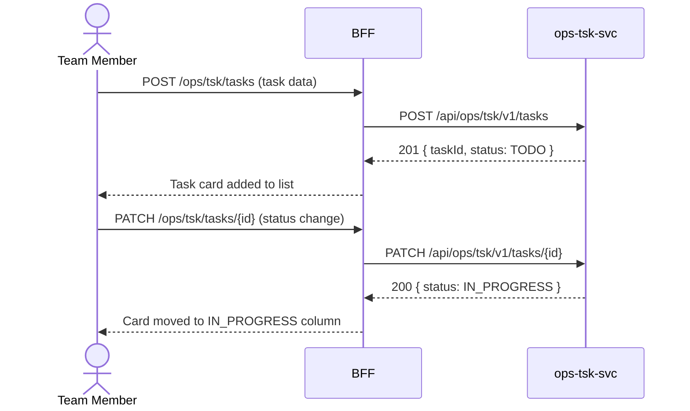

# F-OPS-003-03 — Task Management

> **Conceptual Stack Layer:** Domain-Feature
> **Space:** Business Domain
> **Owner:** Operations Engineering Team
> **Companion files:** `F-OPS-003-03.uvl`, `F-OPS-003-03.aui.yaml`
> **Referenced by:** Suite Feature Catalog §6
> **References:** `domain-specs/ops_tsk-spec.md` (backend)

> **Meta Information**
> - **Version:** 2026-04-04
> - **Template:** `feature-spec.md` v1.0.0
> - **Template Compliance:** 100%
> - **Status:** DRAFT
> - **Feature ID:** `F-OPS-003-03`
> - **Suite:** `ops`
> - **Node type:** LEAF
> - **Parent:** `F-OPS-003` — Time & Project Tracking
> - **Companion UVL:** `uvl/leaves/F-OPS-003-03.uvl`
> - **Companion AUI:** `contracts/aui/F-OPS-003-03.aui.yaml`

---

## ═══════════════════════════════════════════════
## PROBLEM SPACE
## ═══════════════════════════════════════════════

## 0. Feature Identity & Orientation

### 0.1 One-Line Summary
This feature lets a **team member** create, assign, and track tasks within a project so that work is decomposed, owned, and progressed in a structured way.

### 0.2 Non-Goals
- Does not manage project milestones — that is F-OPS-003-02.
- Does not record time against tasks — that is F-OPS-003-01.
- Does not support complex task dependencies or critical path analysis — that is a future P3 feature.

### 0.3 Entry & Exit Points

**Entry points:**
- Projects → select project → "Tasks"
- Direct URL: `/ops/tsk/tasks?projectId={id}`

**Exit points:**
- Task created → stays on task list; task card added
- Back to project status board (F-OPS-003-02)

### 0.4 Variability Points

| Variability Point | Model | Values | Default | Binding Time |
|---|---|---|---|---|
| Comment thread | UVL attribute | enabled/disabled | enabled | deploy |
| Task due date reminder | UVL attribute | 1d, 2d, 3d, disabled | 1d | deploy |

---

## 1. User Goal & Scenarios

### 1.1 User Goal
Break project milestones into concrete tasks, assign them to specific people, track status changes, and communicate in context — all without leaving the OPS interface.

### 1.2 Scenarios

| # | Scenario | Precondition | Action | Expected Outcome |
|---|----------|-------------|--------|-----------------|
| S1 | Create task | Project selected | Fill task form and save | Task created in status TODO; appears in project board |
| S2 | Assign to team member | Task created | Select assignee | Task assigned; assignee notified |
| S3 | Set due date | Task created | Pick due date | Due date stored; reminder scheduled |
| S4 | Change status | Task assigned | Move to IN_PROGRESS | Status updated; project board reflects change |
| S5 | Add comment | Task detail open | Type comment and send | Comment saved with timestamp; mentioned users notified |

---

## 2. User Journey & Screen Layout

### 2.1 Sequence Diagram



### 2.2 Screen Layout

```
┌─────────────────────────────────────────────────────┐
│ Tasks — Smart Office Fit-Out   [+ New Task]          │
├─────────────────┬───────────────────┬───────────────┤
│ TODO            │ IN_PROGRESS       │ DONE          │
├─────────────────┼───────────────────┼───────────────┤
│ [Task card]     │ [Task card]       │ [Task card]   │
│ Elec survey     │ Network install   │ Site survey   │
│ → A. Müller     │ → B. Schmidt      │ → C. Weber    │
│ Due: Apr 9      │ Due: Apr 15       │ Done: Apr 3   │
├─────────────────┴───────────────────┴───────────────┤
│ [EXT: extension zone]                                │
└─────────────────────────────────────────────────────┘
```

---

## 3. Interaction Requirements

### 3.1 Fields Table

| Field | Type | Required | Editable | Validation | i18n Key |
|---|---|---|---|---|---|
| Title | text | Yes | Yes | 3–200 chars | `F-OPS-003-03.field.title` |
| Assignee | typeahead | No | Yes | Must resolve to valid user | `F-OPS-003-03.field.assignee` |
| Due date | date picker | No | Yes | Not in past | `F-OPS-003-03.field.dueDate` |
| Milestone | select | No | Yes | Project milestone | `F-OPS-003-03.field.milestone` |
| Status | select | Yes | Yes | TODO, IN_PROGRESS, BLOCKED, DONE | `F-OPS-003-03.field.status` |
| Comment | textarea | No | Yes | Max 1000 chars | `F-OPS-003-03.field.comment` |

### 3.2 Actions Table

| Action | Trigger | Precondition | Effect |
|---|---|---|---|
| Create task | Form submit | Title filled | POST task |
| Assign | Typeahead select | — | PATCH task.assigneeId |
| Change status | Drag or select | — | PATCH task.status |
| Add comment | Send button | Comment not empty | POST comment |
| Delete task | Context menu | Task in TODO | DELETE task |

### 3.3 Validation Messages

| Field | Condition | Message |
|---|---|---|
| Title | Empty | `F-OPS-003-03.validation.title.required` |
| Due date | Past date | `F-OPS-003-03.validation.dueDate.past` |

---

## 4. Edge Cases & Screen States

### 4.1 Component States

| State | When | Behaviour |
|---|---|---|
| **Empty** | No tasks | "No tasks yet. Click + New Task to add the first." |
| **Blocked** | Status = BLOCKED | Card highlighted amber; blocker reason required |
| **Overdue** | Due date passed, not DONE | Card highlighted red |

### 4.2 Specific Edge Cases

| Case | Behaviour | Affected users |
|---|---|---|
| Assignee not in project | Warning shown; assignment allowed | PM |
| Task deleted with time entries | Task soft-deleted; time entries retained | Member |

### 4.3 Attribute-Driven Behaviour Changes

| Attribute | Non-default value | Observable change |
|---|---|---|
| `commentThread` | disabled | Comment section hidden on task detail |
| `taskDueDateReminder` | disabled | No reminder notifications sent |

### 4.4 Connectivity
Requires live connection. No offline task creation.

---

## ═══════════════════════════════════════════════
## SOLUTION SPACE
## ═══════════════════════════════════════════════

## 5. Backend Dependencies & BFF Contract

### 5.1 Service Calls

| # | Service | Endpoint | Tier | isMutation | Failure Mode |
|---|---------|----------|------|------------|-------------|
| 1 | ops-tsk-svc | `GET /api/ops/tsk/v1/tasks?projectId={id}` | T3 | No | Error + retry |
| 2 | ops-tsk-svc | `POST /api/ops/tsk/v1/tasks` | T3 | Yes | Error + retry |
| 3 | ops-tsk-svc | `PATCH /api/ops/tsk/v1/tasks/{id}` | T3 | Yes | Error + retry |

### 5.2 BFF View-Model Shape

```jsonc
{
  "tasks": [
    {
      "taskId": "tsk-uuid",
      "title": "Electrical survey",
      "status": "TODO",
      "assigneeId": "user-uuid",
      "assigneeName": "A. Müller",
      "dueDate": "2026-04-09",
      "milestoneId": "m-uuid",
      "loggedHours": 0
    }
  ]
}
```

### 5.3 Feature-Gating Rules

| Mode | Behaviour |
|---|---|
| Full | All CRUD operations |
| Excluded | Menu item hidden; URL returns 404 |

### 5.4 Failure Modes

| Failure | User Experience |
|---------|----------------|
| ops-tsk-svc down | Error banner with retry; board read-only |

### 5.5 Caching Hints
BFF SHOULD cache task list for 1 minute. Invalidate on `ops.tsk.task.completed`.

### 5.6 i18n Keys

| Key | Default (en) |
|-----|-------------|
| `F-OPS-003-03.title` | `Tasks` |
| `F-OPS-003-03.action.newTask` | `New Task` |
| `F-OPS-003-03.field.status` | `Status` |
| `F-OPS-003-03.status.todo` | `To Do` |
| `F-OPS-003-03.status.inProgress` | `In Progress` |
| `F-OPS-003-03.status.done` | `Done` |

---

## 6. AUI Screen Contract

See companion file `contracts/aui/F-OPS-003-03.aui.yaml`.

---

## ═══════════════════════════════════════════════
## BRIDGE ARTIFACTS
## ═══════════════════════════════════════════════

## 7. Permissions & Accessibility

### 7.1 Permission Matrix

| Action | TEAM_MEMBER | PROJECT_MANAGER | OPERATIONS_MANAGER |
|---|---|---|---|
| Create task | ✓ | ✓ | ✓ |
| Assign task | ✓ (own) | ✓ | ✓ |
| Delete task | ✗ | ✓ | ✓ |
| Add comment | ✓ | ✓ | ✓ |

### 7.2 Accessibility
- Kanban drag-and-drop MUST have keyboard alternative for status change.
- Overdue indicators MUST use `aria-label` in addition to color.

---

## 8. Acceptance Criteria

| AC | Scenario | Given | When | Then |
|----|----------|-------|------|------|
| AC-01 | S1 | PM opens Tasks | Fills form and saves | Task appears in TODO column; ops.tsk.task.created event published |
| AC-02 | S2 | Task created | PM assigns to A. Müller | Assignee notified; task card shows assignee name |
| AC-03 | S4 | Task in TODO | Member moves to IN_PROGRESS | Status updated in board and project status board (F-OPS-003-02) |
| AC-04 | S5 | Task detail open | Member adds comment | Comment visible in thread with timestamp |

---

## 9. Variability & Extension

### 9.1 Feature Dependencies
Requires F-OPS-003-02 (task status reflected in project board). IAM required for authentication and assignee resolution.

### 9.2 Attributes
See §0.4 variability points. Binding time: `deploy`.

### 9.3 Extension Points
| Extension Zone | Interface | Default Behaviour |
|---|---|---|
| `ext.taskDetailPanel` | Custom fields in task detail | Hidden |

### 9.4 Companion UVL
See `uvl/leaves/F-OPS-003-03.uvl`.

---

**END OF SPECIFICATION**
