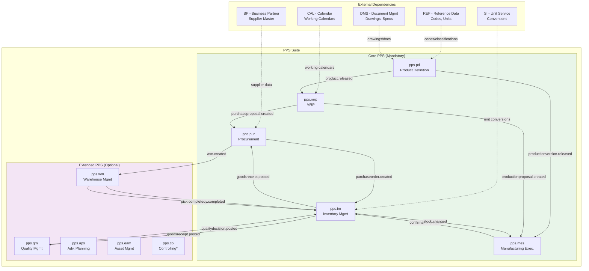
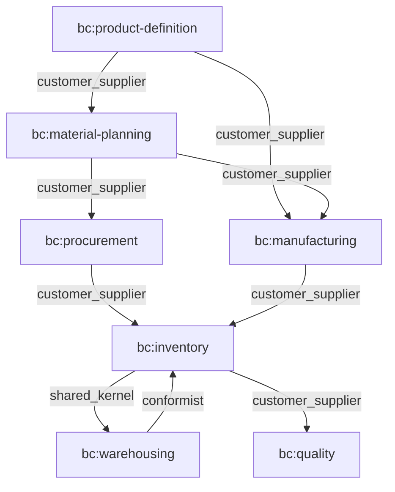
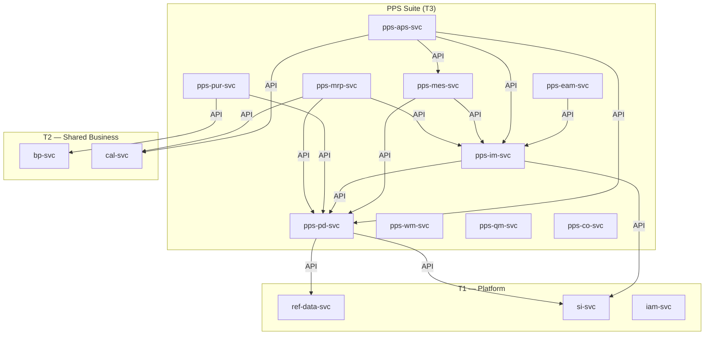
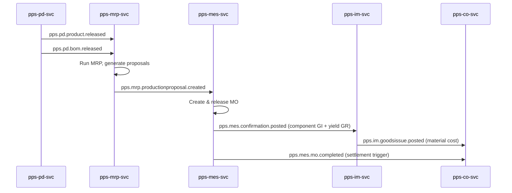
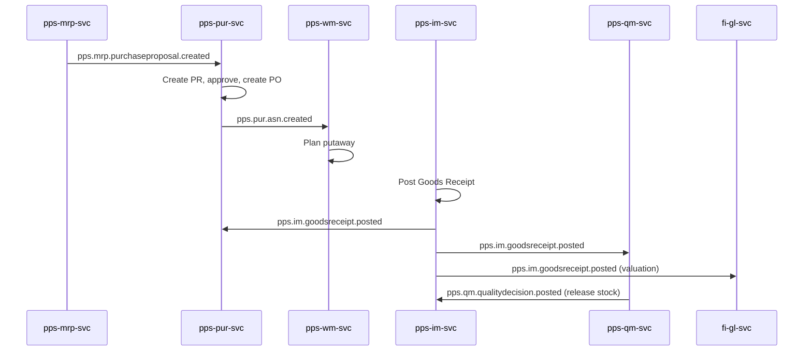
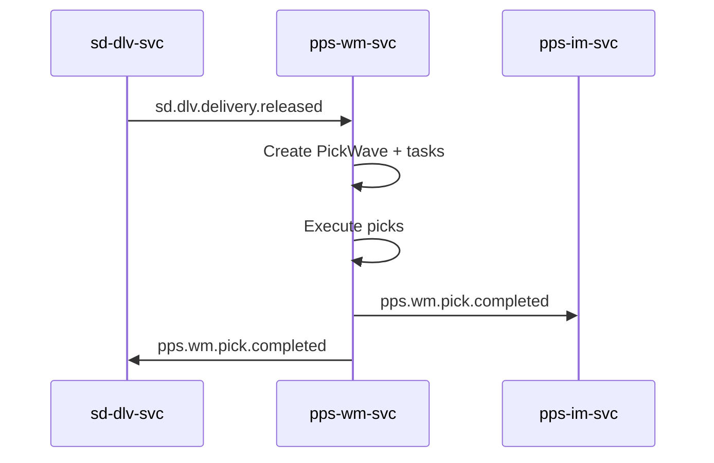
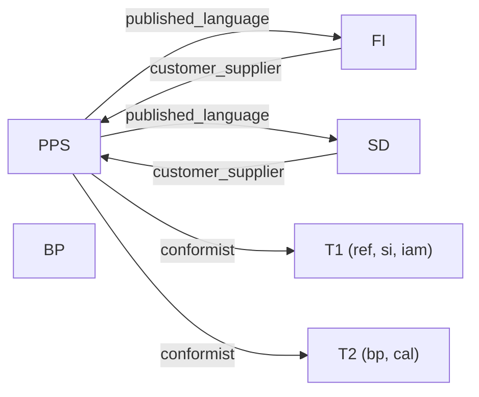

# Production, Planning & Shopfloor (PPS) Suite Specification

> **Conceptual Stack Layer:** Suite
> **Space:** Platform
> **Owner:** Domain Engineering Team
> **Schema alignment:** `suite-layer.schema.json`
> **Companion files:** `pps.catalog.uvl` (referenced in SS6)
> **Contains:** Domain/Service Specs, Platform-Feature Specs, Feature Catalog

> **Meta Information**
> - **Version:** 2026-04-01
> - **Template:** `suite-spec.md` v1.0.0
> - **Template Compliance:** 100%
> - **Author(s):** OpenLeap Architecture Team
> - **Status:** DRAFT
> - **Suite ID:** `pps`
> - **Suite Name:** Production, Planning & Shopfloor
> - **Description:** Manufacturing ERP suite covering product definition, planning, procurement, production execution, inventory, warehousing, quality, and asset management.
> - **Semantic Version:** `1.0.0`
> - **Team:**
>   - Name: `team-pps`
>   - Email: `pps-team@openleap.io`
>   - Slack: `#pps-team`
> - **Bounded Contexts:** `bc:product-definition`, `bc:material-planning`, `bc:procurement`, `bc:manufacturing`, `bc:inventory`, `bc:warehousing`, `bc:quality`, `bc:asset-management`, `bc:controlling`

---

## Specification Guidelines

> **This specification MUST comply with the OpenLeap specification guidelines.**
>
> ### Non-Negotiables
> - Never invent facts. If required info is missing, add an **OPEN QUESTION** entry.
> - Preserve intent and decisions. Only change meaning when explicitly requested.
> - Keep the spec **self-contained**: no "see chat", no implicit context.
>
> ### Style Guide
> - Prefer short sentences and lists.
> - Use MUST/SHOULD/MAY for normative statements.
> - Keep terminology consistent with the Ubiquitous Language defined in SS1.
> - Avoid ambiguous words ("often", "maybe") unless explicitly noting uncertainty.

---

<!-- ═══════════════════════════════════════════════════════════════════
     SS0  SUITE IDENTITY & PURPOSE
     ═══════════════════════════════════════════════════════════════════ -->

## 0. Suite Identity & Purpose

### 0.1 Suite Identity

| Field | Value |
|-------|-------|
| id | `pps` |
| name | Production, Planning & Shopfloor |
| description | Manufacturing ERP suite covering product definition, planning, procurement, production execution, inventory, warehousing, quality, and asset management. |
| version | `1.0.0` |
| status | `draft` |
| owner.team | `team-pps` |
| owner.email | `pps-team@openleap.io` |
| owner.slack | `#pps-team` |
| boundedContexts | `bc:product-definition`, `bc:material-planning`, `bc:procurement`, `bc:manufacturing`, `bc:inventory`, `bc:warehousing`, `bc:quality`, `bc:asset-management`, `bc:controlling` |

### 0.2 Business Purpose

The **Production, Planning & Shopfloor Suite** encompasses all capabilities required for **defining products, planning material requirements, procuring materials, managing inventory and warehouses, and executing manufacturing operations**. It covers the complete supply-side lifecycle from product definition through production and procurement to stock management. PPS enables manufacturing companies to define their products, plan material and production requirements, procure raw materials, execute manufacturing operations, manage inventory and warehouse logistics, ensure quality, and maintain production assets — from order-to-delivery in a single cohesive suite.

**Key Characteristics:**
- **Supply-Side Focus:** Covers the entire path from product definition to finished goods on stock
- **Master-Data Driven:** PD provides the authoritative product master consumed by all other PPS domains
- **Event-Driven Choreography:** Domains communicate via RabbitMQ topic exchanges, not direct orchestration
- **Transactional Integrity:** Outbox pattern ensures at-least-once delivery for all domain events
- **SAP MM/PP/WM Equivalent:** Replaces SAP's MM (split into PUR + IM + WM), PP (split into PD + MRP + MES), QM, and PM modules

### 0.3 In Scope

- Product master data: BOMs, routings, production versions
- Material requirements planning (MRP)
- Procurement: purchase orders, supplier management integration (via BP)
- Manufacturing execution: work orders, confirmations, shop floor control
- Inventory management: stock movements, goods receipts, goods issues, valuations
- Warehouse management: bin locations, put-away, picking, packing, shipping
- Quality management: inspection lots, quality checks, defect recording
- Asset management: equipment, maintenance schedules, downtime tracking
- Controlling: cost center accounting, product costing, variance analysis (optional hosting within PPS)

### 0.4 Out of Scope

- Finance & Accounting (-> FI suite): cost accounting, valuations, GL postings triggered via events
- Sales & Distribution (-> SD suite): sales orders, pricing, customer management
- Business Partner master data (-> BP suite, T2): supplier/customer records consumed via API
- HR & Workforce management (-> HR suite)
- Business Intelligence / Analytics (-> T4 BI): consumes PPS events
- Product catalog, pricing rules, marketplace channels (-> COM suite)
- Operational work order execution for services (-> OPS suite)
- Strategic analytics and BI dashboards (-> T4 Analytics Tier)

### 0.5 Target Users

| Role | Interest |
|------|----------|
| Production Planner | MRP runs, production scheduling, capacity planning |
| Shop Floor Operator | Work order execution, confirmations, quality checks |
| Warehouse Worker | Goods receipt, put-away, picking, shipping |
| Warehouse Manager | Bin layout, inventory levels, throughput KPIs |
| Procurement Officer | Purchase orders, supplier delivery tracking |
| Quality Inspector | Inspection lots, defect analysis |
| PLM / Manufacturing Engineer | Define products, BOMs, routings |
| Plant Manager | Oversee inventory accuracy, production KPIs |
| Maintenance Technician | Execute maintenance orders |
| Controller | Cost center accounting, product costing, variance analysis |

### 0.6 Business Value

- **Single Source of Truth:** One authoritative definition of every product, its composition, and its manufacturing process
- **Supply Chain Coordination:** Synchronized procurement and production schedules via MRP
- **Operational Visibility:** Real-time status of manufacturing orders, stock levels, and warehouse operations
- **Quality Assurance:** Systematic inspection prevents defective goods from reaching customers
- **Asset Reliability:** Preventive maintenance reduces unplanned downtime
- **Cost Transparency:** Product costing and variance analysis for management decisions
- **Working Capital Optimization:** Accurate planning minimizes excess inventory

### 0.7 PPS vs. Related Suites

| Aspect | PPS | SD (Sales) | FI (Finance) | CO (Controlling) | OPS (Operations) |
|--------|-----|------------|--------------|-------------------|------------------|
| Focus | Make & procure | Sell & deliver | Account & report | Analyze costs | Service execution |
| Key entities | Product, BOM, PO, Stock, MO | SalesOrder, Delivery, Invoice | Journal, GL Account | CostCenter, CostObject | WorkOrder, TimeEntry |
| Who uses it? | Planners, buyers, warehouse, production | Sales reps, logistics | Accountants | Controllers | Dispatchers, technicians |
| Time perspective | Planning -> execution -> stock | Commitment -> fulfillment | Financial recording | Cost analysis | Service delivery |
| Inventory | Owns stock & movements | Consumes ATP, triggers GI | Records valuation | Analyzes inventory cost | N/A |
| Procurement | Owns PO lifecycle | N/A | Records AP invoice | Tracks purchasing costs | N/A |

### 0.8 SAP Module Mapping

| SAP Module | SAP Scope | OpenLeap Domain(s) | Key Difference |
|------------|-----------|---------------------|----------------|
| PP (Production Planning) | BOM, routing, MRP, production orders | `pd`, `mrp`, `mes`, `aps` | Separated into master data, planning, and execution |
| MM (Materials Management) | Purchasing, inventory, WM | `pur`, `im`, `wm` | Three independent bounded contexts instead of one monolith |
| WM / EWM | Warehouse management | `wm` | Dedicated domain, not embedded in MM |
| QM | Quality management | `qm` | Standalone domain with event-driven integration |
| PM / EAM | Plant maintenance | `eam` | Asset-focused, event-driven |

---

<!-- ═══════════════════════════════════════════════════════════════════
     SS1  UBIQUITOUS LANGUAGE
     ═══════════════════════════════════════════════════════════════════ -->

## 1. Ubiquitous Language

The UBL is the defining characteristic of PPS as a suite. All domains within PPS share these terms with consistent meaning. Suite boundary = UBL boundary.

### 1.1 Glossary

| ID | Term | Aliases | Definition |
|----|------|---------|------------|
| pps:glossary:material | Material | Item, Part, Component | A tangible item tracked by the suite — can be raw material, semi-finished, or finished goods. Identified by SKU, measured in a base unit (pcs, kg, m). Every PPS domain uses "Material" to mean the same thing. |
| pps:glossary:bom | Bill of Materials (BOM) | Parts List, Recipe, Stueckliste | Hierarchical list of materials and quantities needed to produce one unit of a product. Owned by pd, referenced by mrp, mes, qm. |
| pps:glossary:work-order | Work Order | Production Order, Manufacturing Order, Fertigungsauftrag | An instruction to produce a specific quantity of a material. Created by mrp, executed by mes, confirmed against by im (goods receipt of produced goods). |
| pps:glossary:stock | Stock | Inventory, On-Hand | Quantity of a material at a specific location. Managed by im, queried by mrp (for planning), wm (for bin-level detail), mes (for consumption). |
| pps:glossary:goods-receipt | Goods Receipt | GR, Inbound Delivery, Wareneingang (WE) | Recording of material arriving at the warehouse — from a supplier (purchase order), from production (work order), or from a transfer. Owned by im. |
| pps:glossary:goods-issue | Goods Issue | GI, Outbound Delivery, Warenausgang (WA) | Recording of material leaving the warehouse — for a customer delivery, for production consumption, or for scrapping. Owned by im. |
| pps:glossary:bin-location | Bin Location | Storage Bin, Slot | A specific physical position in the warehouse identified by aisle-rack-level-position. Owned by wm. Referenced by im (stock-per-bin queries). |
| pps:glossary:lot-batch | Lot / Batch | Charge, Batch Number | A tracked group of identical material produced or received together. Enables traceability (which batch was used where) and FIFO/FEFO strategies. |
| pps:glossary:pick-wave | Pick Wave | Wave, Pick Run, Kommissionierwelle | A grouped set of pick tasks released together for efficiency. Created by wm, driven by delivery orders from SD. |
| pps:glossary:routing | Routing | Operation Plan, Arbeitsplan | Sequence of manufacturing operations needed to produce a material, with work centers, setup times, and run times. Owned by pd, used by mes. |
| pps:glossary:production-version | Production Version | Fertigungsversion | Links a product to a specific BOM and routing with a validity date range. Entry point for MES and MRP. |
| pps:glossary:purchase-order | Purchase Order | PO, Bestellung | Formal order to a supplier for materials. Owned by pur, referenced by im (goods receipt). |
| pps:glossary:reservation | Reservation | Allocation | Earmarks a quantity of stock for a future consumption (MO, SO). Prevents double-allocation. Owned by im. |
| pps:glossary:inspection-lot | Inspection Lot | Prueflos | An instance of a quality inspection triggered by a business event (GR, confirmation). Owned by qm. |
| pps:glossary:work-center | Work Center | Machine Group, Arbeitsplatz | Machine or labor group where manufacturing operations are performed. Used by pd (routing), mes (execution), aps (scheduling). |
| pps:glossary:cost-center | Cost Center | Kostenstelle | Organizational unit that incurs costs. Used by co for cost tracking and allocation. |

### 1.2 UBL Boundary Test

**PPS vs. FI:**
PPS uses "Goods Receipt" (a physical material movement increasing stock) and "Goods Issue" (a physical material movement decreasing stock). FI uses "Posting" (a debit/credit entry in the general ledger). The same business event (material arrives) is expressed differently: PPS records the physical movement, FI records the financial valuation. This confirms PPS and FI are separate suites.

**PPS vs. SD:**
PPS uses "Pick Wave" (grouping warehouse pick tasks for efficiency). SD uses "Delivery" (a commitment to ship goods to a customer). SD triggers the pick wave; PPS executes it. This confirms PPS and SD are separate suites.

---

<!-- ═══════════════════════════════════════════════════════════════════
     SS2  DOMAIN MODEL
     ═══════════════════════════════════════════════════════════════════ -->

## 2. Domain Model

### 2.1 Conceptual Overview



*\* CO can be hosted in PPS or FI depending on deployment governance. It keeps its own exchange prefix regardless.*

### 2.2 Core Concepts

| Concept | Owner (Service) | Description | Glossary Ref |
|---------|----------------|-------------|-------------|
| Product | `pps-pd-svc` | The definition of what can be manufactured: BOM, routing, production version | `pps:glossary:material` |
| Material | `pps-pd-svc` (master), `pps-im-svc` (stock) | Master data owned by pd, stock quantities managed by im | `pps:glossary:material` |
| Purchase Order | `pps-pur-svc` | Procurement document for acquiring materials from suppliers | `pps:glossary:purchase-order` |
| Work Order | `pps-mes-svc` | Production execution instruction | `pps:glossary:work-order` |
| Stock | `pps-im-svc` | Material quantities at locations | `pps:glossary:stock` |
| Bin Location | `pps-wm-svc` | Physical warehouse positions | `pps:glossary:bin-location` |
| Inspection Lot | `pps-qm-svc` | Quality check container | `pps:glossary:inspection-lot` |
| Cost Center | `pps-co-svc` | Organizational cost tracking unit | `pps:glossary:cost-center` |

### 2.3 Shared Kernel

| Concept | Owner | Shared With | Mechanism |
|---------|-------|-------------|-----------|
| Material (identity + base attributes) | `pps-pd-svc` | All PPS services | API lookup |
| Unit of Measure | T1 si-svc | All PPS services | API lookup |
| Lot/Batch (identity + traceability) | `pps-im-svc` | `pps-wm-svc`, `pps-qm-svc`, `pps-mes-svc` | Event + API |

### 2.4 Bounded Context Map (Intra-Suite)

| Upstream | Downstream | Pattern | Description |
|----------|-----------|---------|-------------|
| `bc:product-definition` | `bc:material-planning` | `customer_supplier` | pd releases products, mrp plans them |
| `bc:product-definition` | `bc:manufacturing` | `customer_supplier` | pd provides routings, mes executes them |
| `bc:material-planning` | `bc:procurement` | `customer_supplier` | mrp generates purchase proposals, pur creates POs |
| `bc:material-planning` | `bc:manufacturing` | `customer_supplier` | mrp generates production proposals, mes creates MOs |
| `bc:procurement` | `bc:inventory` | `customer_supplier` | pur creates POs, im receives goods against them |
| `bc:inventory` | `bc:warehousing` | `shared_kernel` | im manages stock quantities, wm manages bin-level placement |
| `bc:inventory` | `bc:quality` | `customer_supplier` | im flags goods receipt, qm inspects |
| `bc:warehousing` | `bc:inventory` | `conformist` | wm confirms movements, im updates stock |
| `bc:manufacturing` | `bc:inventory` | `customer_supplier` | mes posts confirmations, im records GI/GR |



### 2.5 Domain Boundaries & Responsibilities

#### PD vs. MRP vs. MES — The Planning Triangle
- **PD** defines *what* a product is (master data, static). PD never executes.
- **MRP** decides *how much and when* to produce or procure (planning, batch-run). MRP generates proposals but never executes them.
- **MES** executes *how* to produce on the shop floor (transactional, real-time). MES consumes production orders and posts confirmations.

#### IM vs. WM — The Inventory Split
- **IM** owns the **logical stock ledger**: quantities per material / plant / storage location / batch / serial, all goods movements (GR, GI, transfer, adjustment), reservations, and physical inventory.
- **WM** owns the **physical warehouse operations**: storage bin management, putaway strategies, picking waves/tasks, handling units, warehouse-internal moves.
- **Rule of thumb:** If the question is "how much?" -> IM. If the question is "where exactly, and how do I get it there?" -> WM.

#### PUR vs. IM — The Procurement/Inventory Split
- **PUR** owns the **procurement lifecycle**: supplier management, purchase requisitions, purchase orders, ASN, and the 3-way match.
- **IM** owns the **goods receipt posting** itself. PUR receives `goodsreceipt.posted` to update PO delivery status.

---

<!-- ═══════════════════════════════════════════════════════════════════
     SS3  SERVICE LANDSCAPE
     ═══════════════════════════════════════════════════════════════════ -->

## 3. Service Landscape

### 3.1 Service Catalog

#### Core PPS (Mandatory)

| Service ID | Name | Bounded Context | Status | Responsibility | Spec |
|-----------|------|----------------|--------|----------------|------|
| `pps-pd-svc` | Product Definition | `bc:product-definition` | `active` | Product master data: materials, BOMs, routings, production versions | `pps_pd-spec.md` |
| `pps-mrp-svc` | Material Planning | `bc:material-planning` | `planned` | MRP runs, purchase proposals, production proposals | `pps_mrp-spec.md` |
| `pps-pur-svc` | Procurement | `bc:procurement` | `planned` | Purchase orders, supplier delivery tracking, invoice matching | `pps_pur-spec.md` |
| `pps-im-svc` | Inventory Management | `bc:inventory` | `active` | Stock movements, goods receipts, goods issues, valuations | `pps_im-spec.md` |
| `pps-mes-svc` | Manufacturing Execution | `bc:manufacturing` | `planned` | Work orders, shop floor operations, confirmations | `pps_mes-spec.md` |

#### Extended PPS (Optional)

| Service ID | Name | Bounded Context | Status | Responsibility | Spec |
|-----------|------|----------------|--------|----------------|------|
| `pps-wm-svc` | Warehouse Management | `bc:warehousing` | `active` | Bin locations, put-away, picking, packing, shipping | `pps_wm-spec.md` |
| `pps-qm-svc` | Quality Management | `bc:quality` | `planned` | Inspection lots, quality checks, defect recording | `pps_qm-spec.md` |
| `pps-aps-svc` | Advanced Planning & Scheduling | `bc:scheduling` | `planned` | Finite capacity scheduling, optimization | `pps_aps-spec.md` |
| `pps-eam-svc` | Asset Management | `bc:asset-management` | `planned` | Equipment, maintenance, downtime | `pps_eam-spec.md` |
| `pps-co-svc` | Controlling | `bc:controlling` | `planned` | Cost centers, product costing, variance analysis | `pps_co-spec.md` |

### 3.2 Responsibility Matrix

| Responsibility | Service |
|---------------|---------|
| Product master data (BOMs, routings, production versions) | `pps-pd-svc` |
| Material requirements planning, supply proposals | `pps-mrp-svc` |
| Supplier management, purchase orders, ASN, 3-way match | `pps-pur-svc` |
| Stock ledger, goods movements, reservations, physical inventory | `pps-im-svc` |
| Manufacturing order execution, confirmations | `pps-mes-svc` |
| Bin-level warehouse operations, putaway, picking, waves | `pps-wm-svc` |
| Inspection lots, quality checks, usage decisions | `pps-qm-svc` |
| Finite capacity scheduling, optimization | `pps-aps-svc` |
| Equipment maintenance, calibration | `pps-eam-svc` |
| Cost center accounting, product costing, MO settlement | `pps-co-svc` |

### 3.3 Service Dependency Diagram



### 3.4 Service Naming

| Domain | Service Name | Spring Profile | DB Schema | Package Base |
|--------|-------------|----------------|-----------|--------------|
| pps.pd | `pps-pd-svc` | `pps-pd` | `pps_pd` | `io.openleap.pps.pd` |
| pps.mrp | `pps-mrp-svc` | `pps-mrp` | `pps_mrp` | `io.openleap.pps.mrp` |
| pps.pur | `pps-pur-svc` | `pps-pur` | `pps_pur` | `io.openleap.pps.pur` |
| pps.im | `pps-im-svc` | `pps-im` | `pps_im` | `io.openleap.pps.im` |
| pps.mes | `pps-mes-svc` | `pps-mes` | `pps_mes` | `io.openleap.pps.mes` |
| pps.wm | `pps-wm-svc` | `pps-wm` | `pps_wm` | `io.openleap.pps.wm` |
| pps.qm | `pps-qm-svc` | `pps-qm` | `pps_qm` | `io.openleap.pps.qm` |
| pps.aps | `pps-aps-svc` | `pps-aps` | `pps_aps` | `io.openleap.pps.aps` |
| pps.eam | `pps-eam-svc` | `pps-eam` | `pps_eam` | `io.openleap.pps.eam` |
| pps.co | `pps-co-svc` | `pps-co` | `pps_co` | `io.openleap.pps.co` |

---

<!-- ═══════════════════════════════════════════════════════════════════
     SS4  INTEGRATION PATTERNS
     ═══════════════════════════════════════════════════════════════════ -->

## 4. Integration Patterns

### 4.1 Pattern Decision

| Field | Value |
|-------|-------|
| **Pattern** | `event_driven` |

**Rationale:**
- PPS domains are loosely coupled — pd releases products, mrp reacts; pur creates POs, im reacts. Events enable each domain to evolve independently.
- Sync API used only for data lookups (material details, stock queries).
- Outbox pattern ensures at-least-once delivery for all domain events.
- No central orchestrator; each consumer reacts independently to published facts (choreography).

### 4.2 Key Event Flows

#### Flow 1: Plan-to-Produce

**Trigger:** MRP run completes and generates production proposals



#### Flow 2: Procure-to-Stock

**Trigger:** MRP run completes and generates purchase proposals



#### Flow 3: Warehouse-to-Delivery

**Trigger:** SD delivery released for picking



### 4.3 Sync vs. Async Decisions

| Integration | Type | Reason |
|------------|------|--------|
| All PPS domains read material master from PD | `sync` | Real-time validation needed during transactions |
| MRP reads stock levels from IM | `sync` | Accurate planning requires current data |
| MRP publishes proposals to PUR/MES | `async` | Eventual consistency acceptable; domains react independently |
| IM publishes goods receipt | `async` | Multiple consumers react independently |
| MES publishes confirmations | `async` | IM, QM, CO react independently |
| APS reads open MOs from MES | `sync` | Scheduling requires current order list |

### 4.4 Error Handling

| Scenario | Handling |
|----------|---------|
| Event consumer fails | Dead-letter queue after 3 retries with exponential backoff; manual retry via admin API |
| Sync API call times out | Circuit breaker, cached fallback data (e.g., cached material master) |
| Outbox publisher fails | Outbox table retains events; publisher retries on reconnect |
| Cross-suite event delivery delayed | Eventual consistency tolerated; monitoring alerts if lag exceeds SLA |

---

<!-- ═══════════════════════════════════════════════════════════════════
     SS5  EVENT CONVENTIONS
     ═══════════════════════════════════════════════════════════════════ -->

## 5. Event Conventions

### 5.1 Routing Key Pattern

**Pattern:** `pps.{domain}.{aggregate}.{action}`

| Segment | Description | Examples |
|---------|-------------|---------|
| `pps` | Always `pps` | `pps` |
| `{domain}` | Domain short code | im, wm, pd, pur, mes, qm, aps, eam, co |
| `{aggregate}` | Aggregate root name (lowercase) | goodsreceipt, pickwave, product, mo |
| `{action}` | Past-tense verb | `created`, `updated`, `posted`, `released`, `completed`, `changed` |

**Examples:**
- `pps.im.goodsreceipt.posted`
- `pps.wm.pickwave.completed`
- `pps.pd.product.released`
- `pps.mes.confirmation.posted`
- `pps.pur.purchaseorder.created`

### 5.2 Payload Envelope

```json
{
  "eventId": "uuid",
  "eventType": "pps.im.goodsreceipt.posted",
  "timestamp": "ISO-8601",
  "tenantId": "string",
  "correlationId": "uuid",
  "causationId": "uuid",
  "producer": "pps-im-svc",
  "schemaVersion": "1.0.0",
  "payload": { }
}
```

### 5.3 Versioning Strategy

| Field | Value |
|-------|-------|
| **Strategy** | Schema evolution with backward compatibility |
| **Description** | New optional fields are additive. Removing fields requires a new major version with parallel publishing during migration. Schema registry at `https://schemas.openleap.io/pps/{domain}/{aggregate}-{changeType}.schema.json`. |

### 5.4 Event Catalog

| Routing Key | Producer | Consumer(s) | Description |
|------------|----------|-------------|-------------|
| `pps.pd.product.released` | `pps-pd-svc` | `pps-mrp-svc`, `pps-mes-svc`, `pps-im-svc`, `pps-pur-svc`, `pps-qm-svc`, `pps-co-svc`, `pps-eam-svc` | Product master data released |
| `pps.pd.bom.released` | `pps-pd-svc` | `pps-mrp-svc`, `pps-mes-svc`, `pps-co-svc`, `pps-qm-svc` | BOM released for production |
| `pps.pd.routing.released` | `pps-pd-svc` | `pps-mes-svc`, `pps-aps-svc`, `pps-co-svc` | Routing released |
| `pps.pd.productionversion.released` | `pps-pd-svc` | `pps-mes-svc`, `pps-mrp-svc` | Production version activated |
| `pps.mrp.purchaseproposal.created` | `pps-mrp-svc` | `pps-pur-svc` | Purchase proposal for procurement |
| `pps.mrp.productionproposal.created` | `pps-mrp-svc` | `pps-mes-svc`, `pps-aps-svc` | Production proposal for manufacturing |
| `pps.mrp.mrprun.completed` | `pps-mrp-svc` | T4 BI | MRP run statistics |
| `pps.pur.purchaseorder.created` | `pps-pur-svc` | `pps-im-svc`, `pps-co-svc`, `fi-ap-svc` | PO created |
| `pps.pur.purchaseorder.updated` | `pps-pur-svc` | `pps-im-svc`, `fi-ap-svc` | PO updated |
| `pps.pur.asn.created` | `pps-pur-svc` | `pps-wm-svc`, `pps-im-svc` | Advance shipping notice |
| `pps.im.goodsreceipt.posted` | `pps-im-svc` | `pps-pur-svc`, `pps-qm-svc`, `fi-gl-svc`, `pps-wm-svc`, T4 BI | Material received into stock |
| `pps.im.goodsissue.posted` | `pps-im-svc` | `fi-gl-svc`, `pps-co-svc`, T4 BI | Material issued from stock |
| `pps.im.transfer.posted` | `pps-im-svc` | `fi-gl-svc`, `pps-wm-svc` | Stock transferred |
| `pps.im.stock.changed` | `pps-im-svc` | `pps-mrp-svc`, `pps-mes-svc`, `sd-ord-svc` | Stock level changed |
| `pps.im.inventory.adjusted` | `pps-im-svc` | `fi-gl-svc`, T4 BI | Physical inventory adjustment |
| `pps.mes.mo.created` | `pps-mes-svc` | `pps-aps-svc`, T4 BI | Manufacturing order created |
| `pps.mes.mo.released` | `pps-mes-svc` | `pps-im-svc`, `pps-wm-svc` | MO released for execution |
| `pps.mes.confirmation.posted` | `pps-mes-svc` | `pps-im-svc`, `pps-qm-svc`, `pps-co-svc` | Operation confirmed |
| `pps.mes.mo.completed` | `pps-mes-svc` | `pps-co-svc`, T4 BI | MO technically complete |
| `pps.wm.putaway.completed` | `pps-wm-svc` | `pps-im-svc`, T4 BI | Putaway confirmed |
| `pps.wm.pick.completed` | `pps-wm-svc` | `pps-im-svc`, `sd-dlv-svc`, T4 BI | Pick confirmed |
| `pps.wm.pickwave.completed` | `pps-wm-svc` | `sd-dlv-svc` | All picks in wave done |
| `pps.wm.hu.packed` | `pps-wm-svc` | `sd-shp-svc` | HU ready for shipping |
| `pps.qm.qualitydecision.posted` | `pps-qm-svc` | `pps-im-svc`, `pps-pur-svc` | Quality accept/reject decision |
| `pps.qm.inspectionlot.created` | `pps-qm-svc` | T4 BI | Inspection lot created |
| `pps.aps.schedule.published` | `pps-aps-svc` | `pps-mes-svc` | Production schedule published |
| `pps.eam.equipment.statuschanged` | `pps-eam-svc` | `pps-aps-svc`, `pps-mes-svc` | Equipment up/down |
| `pps.eam.maintenanceorder.completed` | `pps-eam-svc` | `pps-co-svc`, T4 BI | Maintenance completed |
| `pps.co.settlement.posted` | `pps-co-svc` | `fi-gl-svc`, T4 BI | MO variance settled |
| `pps.co.allocation.posted` | `pps-co-svc` | `fi-gl-svc`, T4 BI | Cost allocation |

---

<!-- ═══════════════════════════════════════════════════════════════════
     SS6  FEATURE CATALOG
     ═══════════════════════════════════════════════════════════════════ -->

## 6. Feature Catalog

> OPEN QUESTION: The full feature tree for the PPS suite has not been authored yet. The structure below is a preliminary outline based on domain capabilities.

### 6.1 Feature Tree

```
PPS Suite
├── F-PPS-001  Product Definition                  [COMPOSITION] [mandatory]
│   ├── F-PPS-001-01  Product Master CRUD           [LEAF]        [mandatory]
│   ├── F-PPS-001-02  BOM Management                [LEAF]        [mandatory]
│   ├── F-PPS-001-03  Routing Management             [LEAF]        [mandatory]
│   └── F-PPS-001-04  Production Version Management  [LEAF]        [mandatory]
├── F-PPS-002  Material Requirements Planning       [COMPOSITION] [mandatory]
│   ├── F-PPS-002-01  MRP Run                        [LEAF]        [mandatory]
│   ├── F-PPS-002-02  Planned Order Management       [LEAF]        [mandatory]
│   └── F-PPS-002-03  MRP Profile Management         [LEAF]        [optional]
├── F-PPS-003  Procurement                          [COMPOSITION] [mandatory]
│   ├── F-PPS-003-01  Purchase Requisition            [LEAF]        [mandatory]
│   ├── F-PPS-003-02  Purchase Order Management       [LEAF]        [mandatory]
│   ├── F-PPS-003-03  ASN Processing                  [LEAF]        [optional]
│   └── F-PPS-003-04  Supplier Evaluation             [LEAF]        [optional]
├── F-PPS-004  Inventory Management                 [COMPOSITION] [mandatory]
│   ├── F-PPS-004-01  Post Goods Receipt              [LEAF]        [mandatory]
│   ├── F-PPS-004-02  Post Goods Issue                [LEAF]        [mandatory]
│   ├── F-PPS-004-03  Stock Overview                  [LEAF]        [mandatory]
│   ├── F-PPS-004-04  Physical Inventory              [LEAF]        [optional]
│   └── F-PPS-004-05  Reservation Management          [LEAF]        [optional]
├── F-PPS-005  Manufacturing Execution              [COMPOSITION] [mandatory]
│   ├── F-PPS-005-01  Manufacturing Order Management  [LEAF]        [mandatory]
│   ├── F-PPS-005-02  Confirmation Posting            [LEAF]        [mandatory]
│   └── F-PPS-005-03  Component Issue                 [LEAF]        [optional]
├── F-PPS-006  Warehouse Management                 [COMPOSITION] [optional]
│   ├── F-PPS-006-01  Inbound Putaway                 [LEAF]        [mandatory]
│   ├── F-PPS-006-02  Pick & Pack                     [LEAF]        [mandatory]
│   └── F-PPS-006-03  Handling Unit Management        [LEAF]        [optional]
├── F-PPS-007  Quality Management                   [COMPOSITION] [optional]
│   ├── F-PPS-007-01  Inspection Lot Processing       [LEAF]        [mandatory]
│   └── F-PPS-007-02  Quality Notification            [LEAF]        [optional]
├── F-PPS-008  Advanced Planning & Scheduling       [COMPOSITION] [optional]
│   └── F-PPS-008-01  Finite Scheduling               [LEAF]        [mandatory]
├── F-PPS-009  Enterprise Asset Management          [COMPOSITION] [optional]
│   ├── F-PPS-009-01  Maintenance Order               [LEAF]        [mandatory]
│   └── F-PPS-009-02  Calibration                     [LEAF]        [optional]
└── F-PPS-010  Controlling                          [COMPOSITION] [optional]
    ├── F-PPS-010-01  Cost Center Accounting          [LEAF]        [mandatory]
    ├── F-PPS-010-02  Product Costing                 [LEAF]        [mandatory]
    └── F-PPS-010-03  MO Settlement                   [LEAF]        [mandatory]
```

### 6.2 Mandatory Features

| Feature ID | Name | Rationale |
|-----------|------|-----------|
| `F-PPS-001` | Product Definition | All PPS domains depend on product master data |
| `F-PPS-002` | Material Requirements Planning | Core planning capability |
| `F-PPS-003` | Procurement | Required for material acquisition |
| `F-PPS-004` | Inventory Management | Single source of truth for stock |
| `F-PPS-005` | Manufacturing Execution | Core production execution |

### 6.3 Cross-Suite Feature Dependencies

| This Suite Feature | Requires | From Suite | Reason |
|-------------------|----------|-----------|--------|
| `F-PPS-003` | BP supplier data | `bp` | Reads supplier master for PO creation |
| `F-PPS-004` | FI valuation postings | `fi` | GR/GI triggers financial valuation |
| `F-PPS-006-02` | SD delivery release | `sd` | Pick waves triggered by delivery requests |

### 6.4 Feature Register

> OPEN QUESTION: Detailed feature specs (platform/feature-spec.md) have not been authored yet for individual leaf features.

### 6.5 Variability Summary

| Metric | Value |
|--------|-------|
| Total composition nodes | 10 |
| Total leaf features | 25 |
| Mandatory features | 5 (compositions) |
| Optional features | 5 (compositions) |
| Cross-suite `requires` | 3 |
| Attributes (total across leaves) | TBD |
| Binding times used | `compile`, `deploy`, `runtime` |

---

<!-- ═══════════════════════════════════════════════════════════════════
     SS7  CROSS-CUTTING CONCERNS
     ═══════════════════════════════════════════════════════════════════ -->

## 7. Cross-Cutting Concerns

### 7.1 Compliance

| Regulation | Requirement | Implementation |
|-----------|-------------|----------------|
| ISO 9001 | Material movements must be traceable | Every stock movement has timestamp, actor, source/destination, lot reference |
| GDPR | Minimal personal data in warehouse operations | Only IAM user IDs stored, no personal data in PPS |
| SOX | Financial-relevant movements must have audit trail | Movement ledger is append-only with full traceability |
| GxP / FDA 21 CFR Part 11 | Batch traceability, electronic signatures | Batch/serial tracking, electronic signatures for adjustments above threshold |
| ISO 17025 | Calibration of measuring instruments | EAM calibration tracking with certificates |

### 7.2 Security

| Aspect | Approach |
|--------|---------|
| **Authentication** | OAuth2 / OIDC via T1 iam-svc |
| **Authorization** | RBAC via T1 iam-svc, roles defined per service (e.g., PD_VIEWER, IM_OPERATOR) |
| **Data Classification** | Internal — no PII stored in PPS (only IAM user IDs) |

### 7.3 Multi-Tenancy

| Aspect | Value |
|--------|-------|
| **Model** | `shared_schema` |
| **Isolation** | Row-Level Security via `tenant_id` on all tables |
| **Tenant ID Propagation** | JWT claim `tenant_id` -> propagated in event envelope and `X-Tenant-ID` header |

**Rules:**
- All queries MUST include `tenant_id` filter (enforced by RLS)
- Cross-tenant data access is forbidden at the API level
- Optional plant-level authorization within a tenant

### 7.4 Audit

**Audit Requirements:**
- All state changes on aggregates MUST be audit-logged
- Movement ledger (IM) is append-only — corrections via reversal only
- Audit log entries MUST include: who, when, what, old value, new value

**Retention Policies:**

| Entity / Data Class | Retention Period | Legal Basis | Action After Expiry |
|--------------------|-----------------|-------------|-------------------|
| Stock Movements | 10 years | HGB SS257, SOX | `archive` |
| Manufacturing Orders | 10 years | ISO 9001, GxP | `archive` |
| Quality Records | 10 years | ISO 9001, FDA | `archive` |
| Audit Log | 7 years | Internal policy | `archive` |
| Physical Inventory | 10 years | HGB SS257 | `archive` |

---

<!-- ═══════════════════════════════════════════════════════════════════
     SS8  EXTERNAL INTERFACES
     ═══════════════════════════════════════════════════════════════════ -->

## 8. External Interfaces

### 8.1 Outbound Interfaces (PPS -> Other Suites)

| Target Suite | Interface Type | Interface Name | Description |
|-------------|---------------|----------------|-------------|
| fi | `event` | `pps.im.goodsreceipt.posted` | Triggers FI material valuation posting |
| fi | `event` | `pps.im.goodsissue.posted` | Triggers FI consumption / COGS posting |
| fi | `event` | `pps.co.settlement.posted` | MO variance settlement journal entries |
| sd | `event` | `pps.wm.pick.completed` | Confirms delivery line picked |
| sd | `event` | `pps.wm.pickwave.completed` | All picks done, proceed to ship |
| sd | `event` | `pps.wm.hu.packed` | HU ready for carrier handoff |
| T4 bi | `event` | All PPS events | Analytics ingestion |

### 8.2 Inbound Interfaces (Other Suites -> PPS)

| Source Suite | Interface Type | Interface Name | Description |
|-------------|---------------|----------------|-------------|
| sd | `event` | `sd.dlv.delivery.released` | Triggers pick wave creation in wm |
| sd | `event` | `sd.ord.salesorder.created` | Demand signal for MRP |
| fi | `event` | `fi.ap.invoice.posted` | Triggers 3-way match in pur |
| bp | `api` | `GET /api/shared/bp/v1/parties/{id}` | Business Partner lookup for supplier data |
| T1 ref | `api` | `GET /api/ref/ref/v1/catalogs/{catalog}` | Reference data lookup for codes/labels |
| T1 si | `api` | `GET /api/shared/si/v1/units/{code}` | SI unit lookup for material units of measure |
| T2 cal | `api` | `GET /api/shared/cal/v1/calendars/{id}` | Working calendar lookup |

### 8.3 External Context Mapping

| Upstream | Downstream | Pattern | Description |
|----------|-----------|---------|-------------|
| `pps` | `fi` | `published_language` | PPS events published using shared schema; FI consumes for valuation |
| `pps` | `sd` | `published_language` | PPS warehouse events consumed by SD for delivery tracking |
| `sd` | `pps` | `customer_supplier` | SD provides demand signals (delivery, sales order); PPS reacts |
| `fi` | `pps` | `customer_supplier` | FI.AP provides invoice events; PUR performs 3-way match |
| `bp` | `pps` | `conformist` | PPS consumes BP supplier data as-is |
| T1 (ref, si) | `pps` | `conformist` | PPS consumes reference data as-is |



---

<!-- ═══════════════════════════════════════════════════════════════════
     SS9  ARCHITECTURE DECISIONS
     ═══════════════════════════════════════════════════════════════════ -->

## 9. Architecture Decisions

### ADR-PPS-001: Event-Driven Choreography

| Field | Value |
|-------|-------|
| **ID** | `ADR-PPS-001` |
| **Status** | `accepted` |
| **Scope** | All PPS services |

**Context:**
PPS domains need to communicate about state changes (product released, goods received, confirmation posted). A central orchestrator would create tight coupling.

**Decision:**
Use event-driven choreography via RabbitMQ topic exchanges. Each domain publishes facts; consumers react independently.

**Rationale:**
- Domains evolve independently
- No single point of failure for coordination
- Natural fit for manufacturing where reactions are domain-specific

**Consequences:**

| Positive | Negative |
|----------|----------|
| Loose coupling between domains | Eventual consistency (not immediate) |
| Independent scalability | Harder to trace end-to-end flows |
| Resilient — one domain down does not block others | DLQ monitoring required |

**Affected Services:** All PPS services

### ADR-PPS-002: Transactional Outbox for Event Publishing

| Field | Value |
|-------|-------|
| **ID** | `ADR-PPS-002` |
| **Status** | `accepted` |
| **Scope** | All PPS services |

**Context:**
Publishing events to RabbitMQ directly from business transactions risks losing events if the broker is unavailable.

**Decision:**
All PPS services use the transactional outbox pattern. Events are written to an `outbox_events` table in the same transaction as the business state change, then published by a separate process.

**Rationale:**
- Guarantees at-least-once delivery
- No distributed transactions needed
- Event publishing survives broker outages

**Consequences:**

| Positive | Negative |
|----------|----------|
| Zero event loss | Slight write overhead (outbox table) |
| Simple transactional semantics | Consumers must be idempotent |

**Affected Services:** All PPS services

### ADR-PPS-003: IM/WM Split (Logical vs. Physical)

| Field | Value |
|-------|-------|
| **ID** | `ADR-PPS-003` |
| **Status** | `accepted` |
| **Scope** | `pps-im-svc`, `pps-wm-svc` |

**Context:**
SAP MM bundles inventory and warehouse management into one monolith. We need to decide whether to split them.

**Decision:**
IM owns the logical stock ledger ("how much"). WM owns the physical warehouse operations ("where exactly, and how to move it"). WM is optional; simple warehouses use IM directly.

**Rationale:**
- Clear bounded contexts
- WM can be deployed only when bin-level management is needed
- Each domain can scale independently

**Consequences:**

| Positive | Negative |
|----------|----------|
| Clear responsibilities | Eventual consistency between IM and WM BinStock |
| WM is optional | Periodic reconciliation needed |

**Affected Services:** `pps-im-svc`, `pps-wm-svc`

---

<!-- ═══════════════════════════════════════════════════════════════════
     SS10  ROADMAP
     ═══════════════════════════════════════════════════════════════════ -->

## 10. Roadmap

| Phase | Timeframe | Items |
|-------|-----------|-------|
| Phase 1 — Core PPS | Weeks 1-36 | pps.pd (products, BOMs, routings), pps.im (stock, movements, reservations), pps.pur (suppliers, POs, ASN), pps.mrp (BOM explosion, netting, proposals), pps.mes (MOs, confirmations, yield), integration hardening |
| Phase 2 — Extended PPS | Weeks 37-60 | pps.wm (warehouse structure, putaway, picking, waves), pps.qm (inspection plans, lots, results, usage decisions), pps.aps (finite scheduling, capacity model), pps.eam (equipment, maintenance, calibration) |
| Phase 3 — Advanced | TBD | Variant configuration, CAD/PLM integration, IoT/SCADA for condition-based maintenance, predictive maintenance (ML), multi-plant MRP with transfers, consignment stock |

### Cross-Domain Sagas

#### SAG-PPS-001: Procure-to-Stock

| Suite | Domain | Step | Action | Compensation |
|-------|--------|------|--------|--------------|
| PPS | pps.mrp | 1 | Generate purchase proposal | Cancel proposal |
| PPS | pps.pur | 2 | Create PR -> approve -> create PO | Cancel PO |
| PPS | pps.wm | 3 | Plan inbound putaway (from ASN) | Cancel putaway plan |
| PPS | pps.im | 4 | Post Goods Receipt | Reverse GR |
| PPS | pps.qm | 5 | Create inspection lot, record results | Cancel inspection |
| PPS | pps.im | 6 | Release stock (quality -> unrestricted) | Revert to quality stock |
| FI | fi.gl | 7 | Post stock valuation | Reverse posting |

#### SAG-PPS-002: Produce-to-Stock

| Suite | Domain | Step | Action | Compensation |
|-------|--------|------|--------|--------------|
| PPS | pps.mrp | 1 | Generate production proposal | Cancel proposal |
| PPS | pps.mes | 2 | Create & release MO | Cancel MO |
| PPS | pps.im | 3 | Reserve components | Release reservation |
| PPS | pps.mes | 4 | Confirm operations | Reverse confirmation |
| PPS | pps.im | 5 | Post GI (component consumption) | Reverse GI |
| PPS | pps.im | 6 | Post GR (yield receipt) | Reverse GR |
| FI | fi.co | 7 | Settle MO (WIP clearing, variance) | Reverse settlement |

---

<!-- ═══════════════════════════════════════════════════════════════════
     SS11  APPENDIX
     ═══════════════════════════════════════════════════════════════════ -->

## 11. Appendix

### 11.1 Change Log

| Date | Version | Author | Changes |
|------|---------|--------|---------|
| 2026-02-23 | 0.1.0 | OpenLeap Architecture Team | Initial suite specification |
| 2026-04-01 | 1.0.0 | OpenLeap Architecture Team | Restructured to template compliance (SS0-SS11) |

### 11.2 Review & Approval

**Status:** DRAFT

**Reviewers:**

| Role | Name | Date | Status |
|------|------|------|--------|
| Suite Architect | {Name} | YYYY-MM-DD | [ ] Reviewed |
| Domain Lead (pd) | {Name} | YYYY-MM-DD | [ ] Reviewed |
| Domain Lead (im) | {Name} | YYYY-MM-DD | [ ] Reviewed |
| Domain Lead (mes) | {Name} | YYYY-MM-DD | [ ] Reviewed |
| Product Owner | {Name} | YYYY-MM-DD | [ ] Reviewed |

**Approval:**

| Role | Name | Date | Approved |
|------|------|------|----------|
| Suite Architect | {Name} | YYYY-MM-DD | [ ] |
| Engineering Manager | {Name} | YYYY-MM-DD | [ ] |

---

## Authoring Checklist

> Before moving to REVIEW status, verify:

- [x] Suite ID follows pattern `^[a-z]{2,4}$` (SS0)
- [x] Business purpose is at least 50 characters (SS0)
- [x] In-scope and out-of-scope are concrete and mutually exclusive (SS0)
- [x] UBL glossary has entries for every core concept (SS1)
- [x] Every glossary definition is at least 20 characters (SS1)
- [x] UBL boundary test demonstrates vocabulary distinction from at least one related suite (SS1)
- [x] Every core concept in SS2 has a glossary_ref back to SS1 (SS2)
- [ ] Shared kernel types define authoritative attributes (SS2, if applicable)
- [x] Bounded context map uses valid DDD patterns (SS2)
- [x] Service catalog lists all services with status and spec reference (SS3)
- [x] Integration pattern decision has rationale (SS4)
- [x] Event flows cover all major intra-suite workflows (SS4)
- [x] Routing key pattern is documented with segments and examples (SS5)
- [x] Payload envelope matches platform standard (SS5)
- [x] Event catalog lists every published event (SS5)
- [ ] Feature tree is complete with mandatory/optional annotations (SS6) — *preliminary*
- [x] Cross-suite feature dependencies are listed (SS6)
- [ ] Companion `pps.catalog.uvl` is created and matches SS6 tree (SS6)
- [x] Compliance requirements list all applicable regulations (SS7)
- [x] Multi-tenancy model is specified (SS7)
- [x] Retention policies have legal basis (SS7)
- [x] External interfaces document all cross-suite communication (SS8)
- [x] External context mapping uses valid DDD patterns (SS8)
- [x] All ADRs have ID pattern `ADR-PPS-NNN` (SS9)
- [x] Roadmap covers at least the next two phases (SS10)
