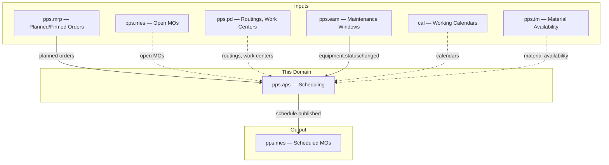
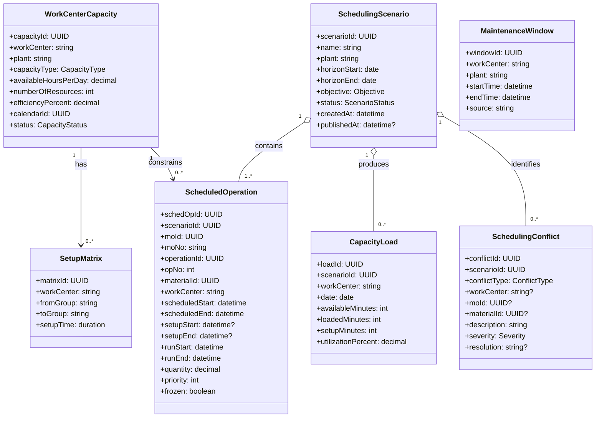
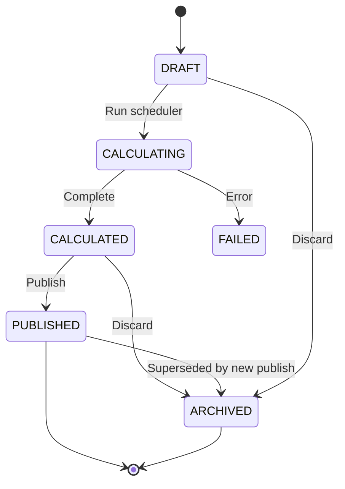
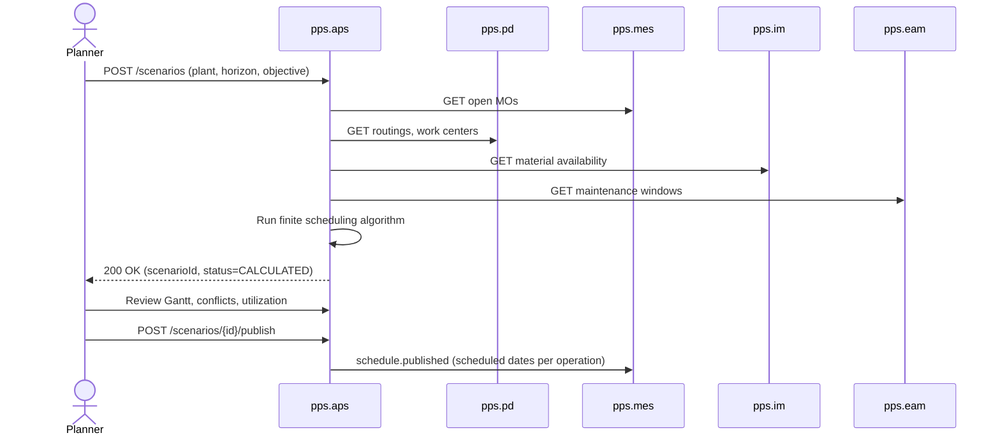
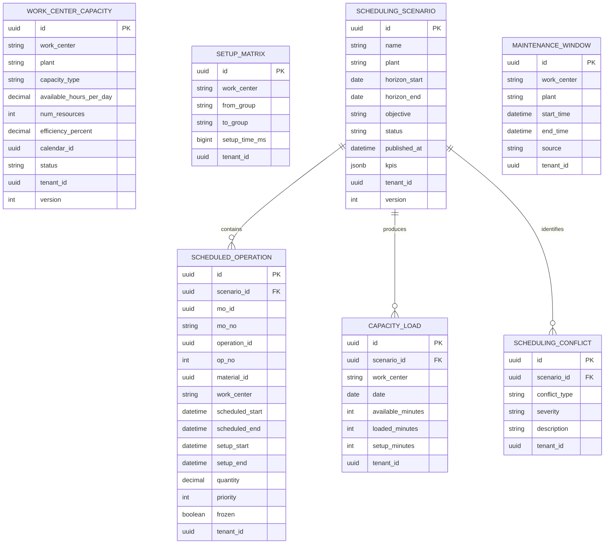

# Advanced Planning & Scheduling (APS) - Domain & Microservice Specification

> **Conceptual Stack Layer:** Domain / Service
> **Space:** Platform
> **Owner:** Domain Engineering Team
> **Schema alignment:** `service-layer.schema.json`
> **Companion files:** `openapi.yaml`, `*.schema.json` (event contracts)
> **Referenced by:** Platform-Feature Spec SS5 (backend dependencies), BFF Contract
> **Belongs to:** Suite Spec `_pps_suite.md`

> **Meta Information**
> - **Version:** 2026-04-03
> - **Template:** `domain-service-spec.md` v1.0.0
> - **Template Compliance:** ~95%
> - **Author(s):** OpenLeap Architecture Team
> - **Status:** DRAFT
> - **Suite:** `pps`
> - **Domain:** `aps`
> - **Bounded Context Ref:** `bc:scheduling`
> - **Service ID:** `pps-aps-svc`
> - **basePackage:** `io.openleap.pps.aps`
> - **API Base Path:** `/api/pps/aps/v1`
> - **OpenLeap Starter Version:** `v1.0.0`
> - **Port:** `TBD`
> - **Repository:** `TBD`
> - **Tags:** `pps`, `aps`, `manufacturing`, `scheduling`
> - **Team:**
>   - Name: `team-pps`
>   - Email: `pps-team@openleap.io`
>   - Slack: `#pps-team`

---

## Specification Guidelines Compliance

> **This specification MUST comply with the OpenLeap specification guidelines.**
>
> ### Non-Negotiables
> - Never invent facts. If required info is missing, add an **OPEN QUESTION** entry.
> - Preserve intent and decisions. Only change meaning when explicitly requested.
> - Do not remove normative constraints unless they are explicitly replaced.
> - Keep the spec **self-contained**: no "see chat", no implicit context.
>
> ### Style Guide
> - Prefer short sentences and lists.
> - Use MUST/SHOULD/MAY for normative statements.
> - Keep terminology consistent (Aggregate, Domain Service, Application Service, Command, Event).
---

## 0. Document Purpose & Scope

### 0.1 Purpose
This specification defines the Advanced Planning & Scheduling domain, which performs finite-capacity scheduling and optimization beyond MRP's infinite-capacity planning. APS considers machine availability, labor, tooling constraints, maintenance windows, and sequence-dependent setup times to produce executable, optimized production schedules.

### 0.2 Scope
**In Scope:**
- Work center capacity modeling (machines, labor pools, tools)
- Finite capacity scheduling (forward, backward, bottleneck)
- Sequence-dependent setup time optimization
- Constraint management (material, capacity, tooling, labor)
- Schedule optimization (minimize makespan, tardiness, setup time)
- What-if simulation (scenario comparison)
- Schedule publishing to MES
- Maintenance window integration (from EAM)
- Rescheduling on disruption (machine breakdown, material shortage, rush order)
- Gantt chart / schedule visualization data

**Out of Scope:**
- Infinite-capacity MRP planning (MRP — pps.mrp)
- Manufacturing order execution (MES — pps.mes)
- Equipment maintenance execution (EAM — pps.eam)
- Demand forecasting and demand planning
- Strategic / long-range capacity planning (future domain)
- Shop-floor data collection and confirmations (MES)

### 0.3 Related Documents
- `_pps_suite.md` - PPS Suite overview
- `pps_mrp-spec.md` - MRP (proposal source)
- `pps_mes-spec.md` - MES (schedule consumer)
- `pps_eam-spec.md` - EAM (maintenance windows)
- `PD_product_definition.md` - Routings, work centers
- `CAP_calendar_planning.md` - Working calendars
- `DOMAIN_SPEC_TEMPLATE.md` - Template reference

---

## 1. Business Context

### 1.1 Domain Purpose
MRP generates planned orders assuming infinite capacity — it does not check whether enough machine hours or labor exist. APS takes MRP's output (or manually created MOs) and schedules them against finite resources, resolving conflicts and optimizing the sequence. The result is a realistic, executable schedule that MES can follow.

### 1.2 Business Value
- **Feasibility:** Ensures production plans are executable within actual capacity constraints
- **Throughput:** Optimized sequencing reduces setup times and increases effective capacity
- **On-Time Delivery:** Scheduling against due dates minimizes tardiness
- **Visibility:** Planners see bottlenecks, conflicts, and alternatives before they happen
- **Agility:** Rapid rescheduling on disruptions (breakdown, rush order, material delay)

### 1.3 Key Stakeholders
| Role | Responsibility | Primary Use Cases |
|------|----------------|-------------------|
| Production Planner | Create and adjust schedules | Run scheduling, resolve conflicts, what-if |
| Plant Manager | Approve schedules, review KPIs | Schedule review, capacity utilization |
| MES Supervisor | Execute published schedule | Receive scheduled order sequence |
| Maintenance Manager | Provide maintenance windows | EAM integration |

### 1.4 Strategic Positioning



### 1.5 Service Context

| Field | Value |
|-------|-------|
| Suite | `pps` (Production Planning & Scheduling) |
| Domain | `aps` (Advanced Planning & Scheduling) |
| Bounded Context | `bc:scheduling` |
| Service ID | `pps-aps-svc` |
| Base Package | `io.openleap.pps.aps` |
| Authoritative Sources | PPS Suite Spec (`_pps_suite.md`), APS/Leitstand best practices |

---

## 2. Service Identity

| Field | Value |
|-------|-------|
| **Service ID** | `pps-aps-svc` |
| **Display Name** | Advanced Planning & Scheduling Service |
| **Suite** | `pps` |
| **Domain** | `aps` |
| **Bounded Context Ref** | `bc:scheduling` |
| **Version** | 2026-04-03 |
| **Status** | DRAFT |
| **API Base Path** | `/api/pps/aps/v1` |
| **Repository** | TBD |
| **Tags** | `pps`, `aps`, `manufacturing`, `scheduling` |
| **Team Name** | `team-pps` |
| **Team Email** | `pps-team@openleap.io` |
| **Team Slack** | `#pps-team` |

---

## 3. Domain Model

### 3.1 Core Concepts



**Enumerations:**
| Enum | Values |
|------|--------|
| CapacityType | `MACHINE`, `LABOR`, `TOOL` |
| CapacityStatus | `ACTIVE`, `INACTIVE` |
| Objective | `MIN_MAKESPAN`, `MIN_TARDINESS`, `MIN_SETUP_TIME`, `BALANCED_LOAD`, `CUSTOM` |
| ScenarioStatus | `DRAFT`, `CALCULATING`, `CALCULATED`, `PUBLISHED`, `ARCHIVED`, `FAILED` |
| ConflictType | `CAPACITY_OVERLOAD`, `MATERIAL_SHORTAGE`, `MAINTENANCE_OVERLAP`, `DUE_DATE_VIOLATION`, `TOOL_UNAVAILABLE` |
| Severity | `INFO`, `WARNING`, `CRITICAL` |

### 3.2 Aggregate Definitions

#### SchedulingScenario
**Business Purpose:** Represents a single scheduling run or simulation. Multiple scenarios can coexist for what-if comparison; only one can be PUBLISHED (active) per plant at a time.

**Lifecycle:**


**Business Rules:**
1. **Single Published:** Only one PUBLISHED scenario per plant at a time. Publishing a new scenario archives the previous.
2. **Frozen Operations:** Individual operations can be frozen (pinned to a specific time slot). The scheduler works around frozen operations.
3. **Horizon Overlap:** Scheduling horizon must cover all open MO end dates or raise a warning.

#### WorkCenterCapacity
**Business Purpose:** Defines the available capacity for a work center, including efficiency factor and working calendar.
**Business Rules:**
1. **Calendar Required:** Every capacity record must reference a valid working calendar.
2. **Efficiency Factor:** 0-100%; actual available minutes = calendar hours * efficiency%.

#### SetupMatrix
**Business Purpose:** Defines sequence-dependent setup times. When switching from product group A to group B on a work center, the setup time is looked up in the matrix.
**Business Rules:**
1. **Symmetric Optional:** A->B setup time may differ from B->A.
2. **Default Fallback:** If no matrix entry exists, use the operation's standard setup time.

---

## 4. Business Rules & Constraints

### 4.1 Business Rules Catalog

| ID | Rule Name | Description | Scope | Enforcement | Error Code |
|----|-----------|-------------|-------|-------------|------------|
| BR-APS-001 | Single Published Scenario | Only one PUBLISHED scenario per plant at a time | SchedulingScenario | On publish | `APS-BIZ-001` |
| BR-APS-002 | Capacity Not Exceeded | Capacity not exceeded per time slot | ScheduledOperation | During scheduling | `APS-BIZ-002` |
| BR-APS-003 | Operation Sequence | Operation sequence within MO respected | ScheduledOperation | During scheduling | `APS-BIZ-003` |
| BR-APS-004 | Maintenance Windows Blocked | Maintenance windows block capacity slots | ScheduledOperation | During scheduling | `APS-BIZ-004` |
| BR-APS-005 | Frozen Operations Immovable | Frozen operations not moved by scheduler | ScheduledOperation | During scheduling | `APS-BIZ-005` |
| BR-APS-006 | Material Availability Check | Material availability verified before scheduling | ScheduledOperation | During scheduling | `APS-BIZ-006` |
| BR-APS-007 | Setup Matrix Applied | Setup matrix applied if exists for work center transition | ScheduledOperation | During scheduling | `APS-BIZ-007` |
| BR-APS-008 | Due Date Violations Flagged | Due date violations flagged as conflicts | SchedulingConflict | Post-scheduling | `APS-BIZ-008` |

### 4.2 Data Validation Rules

| Field | Validation Rule | Error Code | Error Message |
|-------|----------------|------------|---------------|
| plant | Required, non-empty | `APS-VAL-001` | `"Plant is required"` |
| horizonStart | Required, valid date | `APS-VAL-002` | `"Valid horizon start date is required"` |
| horizonEnd | Required, > horizonStart | `APS-VAL-003` | `"Horizon end must be after horizon start"` |
| objective | Required, valid enum | `APS-VAL-004` | `"Valid scheduling objective is required"` |
| workCenter | Required for capacity record | `APS-VAL-005` | `"Work center is required"` |
| efficiencyPercent | 0-100 range | `APS-VAL-006` | `"Efficiency must be between 0 and 100 percent"` |

---

## 5. Use Cases

### 5.1 Business Logic Placement

| Layer | Responsibilities |
|-------|-----------------|
| Application Service | Command validation, aggregate loading, event publishing, orchestration (scheduling workflow) |
| Domain Service | Scheduling algorithm execution, constraint resolution, setup matrix lookup (cross-aggregate) |
| Aggregate | State transitions, invariant enforcement, attribute validation |

### 5.2 Use Cases

#### UC-APS-001: Run Finite Scheduling

| Field | Value |
|-------|-------|
| **ID** | UC-APS-001 |
| **Type** | WRITE |
| **Trigger** | REST |
| **Aggregate** | SchedulingScenario |
| **Domain Operation** | `SchedulingScenario.create()` + `SchedulingService.runSchedule()` |
| **Inputs** | plant, horizonStart, horizonEnd, objective, name? |
| **Outputs** | SchedulingScenario in CALCULATED state with ScheduledOperations, CapacityLoads, Conflicts |
| **Events** | `SchedulingScenarioCalculated` -> `pps.aps.scenario.calculated` |
| **REST** | `POST /api/pps/aps/v1/scenarios` -> 201 Created |
| **Idempotency** | Client-generated `Idempotency-Key` header |
| **Errors** | 400 (validation), 422 (no open MOs for plant/horizon), 500 (scheduling engine failure) |

**Detailed Flow:**
1. Create SchedulingScenario (plant, horizon, objective function)
2. System loads: open MOs from MES, planned orders from MRP, routings from PD, capacities, setup matrices, maintenance windows from EAM, material availability from IM
3. System runs scheduling algorithm: assign each operation to a time slot on its work center, respect capacity limits, respect operation sequence within MO, apply setup matrix for sequencing, respect maintenance windows, optimize per objective
4. Generate ScheduledOperations, CapacityLoads, and Conflicts
5. Scenario status -> CALCULATED
6. Planner reviews Gantt view, conflicts, and utilization

#### UC-APS-002: What-If Simulation

| Field | Value |
|-------|-------|
| **ID** | UC-APS-002 |
| **Type** | WRITE |
| **Trigger** | REST |
| **Aggregate** | SchedulingScenario |
| **Domain Operation** | `SchedulingScenario.clone()` + `SchedulingService.runSchedule()` |
| **Inputs** | sourceScenarioId, modifications (add/remove MOs, change priorities) |
| **Outputs** | New SchedulingScenario in CALCULATED state |
| **Events** | `SchedulingScenarioCalculated` -> `pps.aps.scenario.calculated` |
| **REST** | `POST /api/pps/aps/v1/scenarios/{id}/clone` -> 201 Created |
| **Idempotency** | Client-generated `Idempotency-Key` header |
| **Errors** | 404 (source scenario not found), 422 (invalid modifications) |

#### UC-APS-003: Publish Schedule

| Field | Value |
|-------|-------|
| **ID** | UC-APS-003 |
| **Type** | WRITE |
| **Trigger** | REST |
| **Aggregate** | SchedulingScenario |
| **Domain Operation** | `SchedulingScenario.publish()` |
| **Inputs** | scenarioId |
| **Outputs** | SchedulingScenario in PUBLISHED state; previous published scenario -> ARCHIVED |
| **Events** | `SchedulePublished` -> `pps.aps.schedule.published` |
| **REST** | `POST /api/pps/aps/v1/scenarios/{id}/publish` -> 200 OK |
| **Idempotency** | Idempotent (re-publish of PUBLISHED is no-op) |
| **Errors** | 404, 409 (not in CALCULATED state), 422 (BR-APS-001 single published) |

#### UC-APS-004: Reschedule on Disruption

| Field | Value |
|-------|-------|
| **ID** | UC-APS-004 |
| **Type** | WRITE |
| **Trigger** | Event / REST |
| **Aggregate** | SchedulingScenario |
| **Domain Operation** | `SchedulingService.reschedule()` |
| **Inputs** | scenarioId, disruptionType (breakdown, material shortage, rush order) |
| **Outputs** | New SchedulingScenario with disruption constraints in CALCULATED state |
| **Events** | `SchedulingScenarioCalculated` -> `pps.aps.scenario.calculated` |
| **REST** | `POST /api/pps/aps/v1/scenarios/{id}/reschedule` -> 201 Created |
| **Idempotency** | Client-generated `Idempotency-Key` header |
| **Errors** | 404, 422 (no active disruptions) |

**Triggers:**
- `pps.eam.equipment.statuschanged` (breakdown -> capacity lost)
- `pps.im.stock.changed` (material shortage)
- New rush MO created in MES

#### UC-APS-005: Manage Capacity Model

| Field | Value |
|-------|-------|
| **ID** | UC-APS-005 |
| **Type** | WRITE |
| **Trigger** | REST |
| **Aggregate** | WorkCenterCapacity, SetupMatrix, MaintenanceWindow |
| **Domain Operation** | CRUD operations on capacity master data |
| **Inputs** | Capacity/matrix/window attributes |
| **Outputs** | Created/updated capacity data |
| **Events** | -- |
| **REST** | `POST/GET/PATCH/DELETE /api/pps/aps/v1/capacities`, `/setup-matrices`, `/maintenance-windows` |
| **Idempotency** | Standard CRUD idempotency |
| **Errors** | 400 (validation), 404 (not found), 409 (conflict) |

#### UC-APS-006: View Gantt Data (READ)

| Field | Value |
|-------|-------|
| **ID** | UC-APS-006 |
| **Type** | READ |
| **Trigger** | REST |
| **Aggregate** | SchedulingScenario |
| **Domain Operation** | Query projection |
| **Inputs** | scenarioId, workCenter?, dateFrom?, dateTo? |
| **Outputs** | Time-bucketed data optimized for Gantt chart rendering |
| **Events** | -- |
| **REST** | `GET /api/pps/aps/v1/scenarios/{id}/gantt?...` -> 200 OK |
| **Idempotency** | Inherently idempotent (GET) |
| **Errors** | 400 (invalid filter params), 404 (scenario not found) |

### 5.3 Process Flow Diagrams



---

## 6. REST API

**Base Path:** `/api/pps/aps/v1`
**Auth:** OAuth2/JWT — `pps.aps:read`, `pps.aps:write`, `pps.aps:admin`

### Work Center Capacity
```
POST   /api/pps/aps/v1/capacities
GET    /api/pps/aps/v1/capacities?plant={}&workCenter={}
GET/PATCH /api/pps/aps/v1/capacities/{id}
```

### Setup Matrices
```
POST   /api/pps/aps/v1/setup-matrices
GET    /api/pps/aps/v1/setup-matrices?workCenter={}
PUT    /api/pps/aps/v1/setup-matrices/{id}
DELETE /api/pps/aps/v1/setup-matrices/{id}
```

### Scheduling Scenarios
```
POST   /api/pps/aps/v1/scenarios                              — Create & run
GET    /api/pps/aps/v1/scenarios?plant={}&status={}&page=0&size=20
GET    /api/pps/aps/v1/scenarios/{id}                          — With summary KPIs
GET    /api/pps/aps/v1/scenarios/{id}/operations?workCenter={}&moId={}&page=0&size=100 — Scheduled ops
GET    /api/pps/aps/v1/scenarios/{id}/capacity-load?workCenter={}&dateFrom={}&dateTo={} — Utilization
GET    /api/pps/aps/v1/scenarios/{id}/conflicts?severity={}
POST   /api/pps/aps/v1/scenarios/{id}/publish
POST   /api/pps/aps/v1/scenarios/{id}/archive
POST   /api/pps/aps/v1/scenarios/{id}/clone                    — Clone for what-if
PATCH  /api/pps/aps/v1/scenarios/{id}/operations/{schedOpId}    — Freeze/unfreeze, manual move
POST   /api/pps/aps/v1/scenarios/{id}/reschedule                — Re-run with updated data
```

### Gantt Data
```
GET    /api/pps/aps/v1/scenarios/{id}/gantt?workCenter={}&dateFrom={}&dateTo={}
```
Returns time-bucketed data optimized for Gantt chart rendering.

### Maintenance Windows
```
POST   /api/pps/aps/v1/maintenance-windows                     — Manual entry
GET    /api/pps/aps/v1/maintenance-windows?workCenter={}&dateFrom={}&dateTo={}
DELETE /api/pps/aps/v1/maintenance-windows/{id}
```

---

## 7. Events & Integration

### 7.1 Published Events
**Exchange:** `pps.aps.events` (topic, durable)

#### schedule.published
**Key:** `pps.aps.schedule.published`
```json
{
  "scenarioId": "uuid",
  "plant": "P100",
  "horizonStart": "2026-03-01",
  "horizonEnd": "2026-03-31",
  "operations": [
    {
      "moId": "uuid", "moNo": "MO-100200", "opNo": 10,
      "workCenter": "WC-CNC-01",
      "scheduledStart": "2026-03-05T06:00:00Z",
      "scheduledEnd": "2026-03-05T14:00:00Z",
      "setupStart": "2026-03-05T06:00:00Z",
      "setupEnd": "2026-03-05T06:30:00Z"
    }
  ],
  "publishedAt": "2026-02-23T18:00:00Z"
}
```
**Consumer:** pps.mes — updates MO/operation scheduled dates

#### schedule.updated
**Key:** `pps.aps.schedule.updated`
**Consumer:** pps.mes — reschedule notification

### 7.2 Consumed Events
| Event | Source | Queue | Logic |
|-------|--------|-------|-------|
| `pps.eam.equipment.statuschanged` | pps.eam | `pps.aps.in.pps.eam.equipment` | Update capacity (block/unblock slots); flag for reschedule |
| `pps.mes.mo.created` | pps.mes | `pps.aps.in.pps.mes.mo` | New MO to schedule |
| `pps.mes.mo.completed` | pps.mes | `pps.aps.in.pps.mes.mo` | Remove from schedule |
| `pps.im.stock.changed` | pps.im | `pps.aps.in.pps.im.stock` | Material availability update |
| `pps.mrp.productionproposal.created` | pps.mrp | `pps.aps.in.pps.mrp.productionproposal` | New planned order to schedule |

### 7.3 Upstream Dependencies (Synchronous)
| Service | Purpose | Fallback |
|---------|---------|----------|
| pps.pd | Routings, work center definitions | Cached |
| pps.mes | Open MO list | Cached |
| pps.im | Material availability per date | Cached |
| cal | Working calendars | Default calendar |

---

## 8. Data Model



---

## 9. Security & Compliance

| Role | Read | Run Schedule | Publish | Manage Capacity | Admin |
|------|------|-------------|---------|----------------|-------|
| APS_VIEWER | Y | N | N | N | N |
| APS_PLANNER | Y | Y | Y | N | N |
| APS_MANAGER | Y | Y | Y | Y | N |
| APS_ADMIN | Y | Y | Y | Y | Y |

---

## 10. Quality Attributes
- Scheduling (500 operations): < 30 seconds
- Scheduling (5,000 operations): < 5 minutes
- Gantt query: < 500ms
- Availability: 99.5% (planning tool; short downtime tolerable)

---

## 11. Feature Dependencies

### 11.1 Purpose
This section answers: "Which features depend on this service?" It is the inverse of Platform-Feature Spec SS5 and helps the domain team assess the blast radius of API changes.

### 11.2 Feature Dependency Register

> **OPEN QUESTION:** Feature dependencies will be populated when feature specs (Phase 3) are authored for the PPS suite. The following is a preliminary mapping based on expected feature compositions.

| Feature ID | Feature Name | Suite | Tier | Dependency Type | Status |
|------------|-------------|-------|------|-----------------|--------|
| F-PPS-TBD | Run Scheduling | pps | core | sync_api | planned |
| F-PPS-TBD | What-If Simulation | pps | supporting | sync_api | planned |
| F-PPS-TBD | Publish Schedule | pps | core | sync_api + async_event | planned |
| F-PPS-TBD | Gantt Visualization | pps | supporting | sync_api | planned |
| F-PPS-TBD | Capacity Management | pps | supporting | sync_api | planned |

---

## 12. Extension Points

### 12.1 Purpose
Extension points follow the Open-Closed Principle: the service is open for extension via events and hooks but closed for direct modification.

### 12.2 Extension Events

| Event ID | Routing Key | Trigger | Payload | Purpose |
|----------|-------------|---------|---------|---------|
| EXT-APS-001 | `pps.aps.schedule.published` | Schedule published | Full schedule snapshot | External systems can react to new schedules (e.g., MES integration, shop-floor displays) |
| EXT-APS-002 | `pps.aps.scenario.calculated` | Scenario calculated | Scenario summary with KPIs | External analytics or dashboards can consume scheduling results |

### 12.3 Aggregate Hooks

| Hook ID | Aggregate | Lifecycle Point | Hook Type | Description |
|---------|-----------|-----------------|-----------|-------------|
| HOOK-APS-001 | SchedulingScenario | Pre-Schedule | validation | Custom constraint rules per tenant (e.g., mandatory rest periods, shift preferences) |
| HOOK-APS-002 | SchedulingScenario | Post-Calculate | notification | Custom notification channels (email to planner, dashboard refresh) |
| HOOK-APS-003 | SchedulingScenario | Pre-Publish | validation | Custom approval checks before publishing (e.g., manager sign-off required) |

**Design Rules:**
- Hooks are fire-and-forget (notification) or bounded-timeout (validation: 2s)
- Validation hooks fail-closed (block on timeout)
- Notification hooks fail-open (log and continue)
- Hooks do not modify aggregate state directly

### 12.4 Extension Points Summary

| ID | Type | Aggregate | Lifecycle Point | Fail Mode | Timeout |
|----|------|-----------|-----------------|-----------|---------|
| EXT-APS-001 | event | SchedulingScenario | published | n/a | n/a |
| EXT-APS-002 | event | SchedulingScenario | calculated | n/a | n/a |
| HOOK-APS-001 | validation | SchedulingScenario | pre-schedule | fail-closed | 2s |
| HOOK-APS-002 | notification | SchedulingScenario | post-calculate | fail-open | 5s |
| HOOK-APS-003 | validation | SchedulingScenario | pre-publish | fail-closed | 2s |

---

## 13. Migration & Evolution

### 13.1 Data Migration

**Legacy Source:** Legacy APS/Leitstand systems, spreadsheet-based scheduling.

| Migration Item | Source | Strategy | Complexity |
|---------------|--------|----------|------------|
| Work center capacities | Legacy ERP master data | Batch import via CSV/API | Low |
| Setup matrices | Spreadsheets / legacy system | Manual review + import | Medium |
| Historical schedules | Not migrated | Start fresh; historical data stays in legacy for reference | N/A |

### 13.2 Deprecation & Sunset

| Deprecated Feature | Replacement | Removal Timeline | Communication Plan |
|-------------------|-------------|------------------|-------------------|
| -- | -- | -- | -- |

### 13.3 Future Extensions

- Integration with external APS engines (e.g., OR-Tools, OptaPlanner)
- Multi-plant scheduling with inter-plant transfers
- Real-time schedule update as MES posts confirmations
- Machine learning-based objective function tuning
- Mobile Gantt view for shop-floor supervisors

---

## 14. Decisions & Open Questions

### 14.1 Open Questions

| ID | Question | Status |
|----|----------|--------|
| Q-001 | Which scheduling algorithm? (heuristic, CP-SAT, genetic?) | Open — Phase 1 |
| Q-002 | Multi-plant scheduling with inter-plant transfers? | Open — Phase 3 |
| Q-003 | Integration with external APS engines (e.g., OR-Tools, OptaPlanner)? | Open — Phase 2 |
| Q-004 | Real-time schedule update as MES posts confirmations? | Open — Phase 2 |

### 14.2 Architectural Decision Records

### ADR-APS-001: Scenario-Based Scheduling
**Status:** Accepted. All scheduling runs produce immutable scenarios. Only one is PUBLISHED at a time. Enables what-if comparison without affecting production.

---

## 15. Appendix

### 15.1 Glossary
| Term | Definition | Aliases |
|------|------------|---------|
| Finite Capacity | Scheduling respecting actual resource limits | Kapazitaetsterminierung |
| Makespan | Total time from first operation start to last end | Durchlaufzeit |
| Tardiness | Delay beyond due date | Verspaetung |
| Setup Matrix | Sequence-dependent changeover times | Ruestmatrix |
| Frozen Operation | Operation pinned to a fixed time slot | Fixierte Operation |
| Gantt Chart | Visual time-resource schedule | - |
| Bottleneck | Resource limiting overall throughput | Engpass |

### 15.2 Change Log
| Date | Version | Author | Changes |
|------|---------|--------|---------|
| 2026-02-23 | 1.0 | OpenLeap Architecture Team | Initial version |
| 2026-04-03 | 1.1 | OpenLeap Architecture Team | Template compliance: add Service Identity, reorder sections, convert UC to table format, expand Feature Dependencies, Extension Points, Migration |

---

## Document Review & Approval
**Status:** DRAFT
