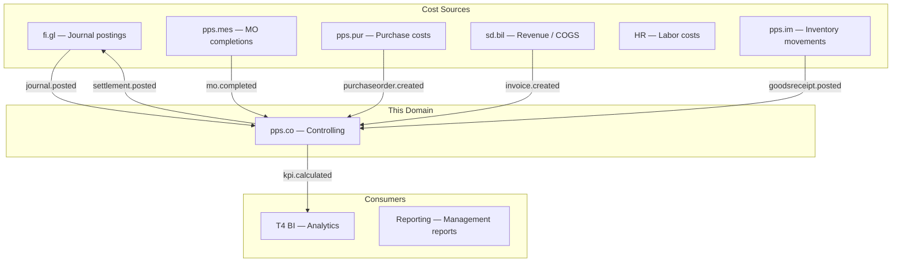
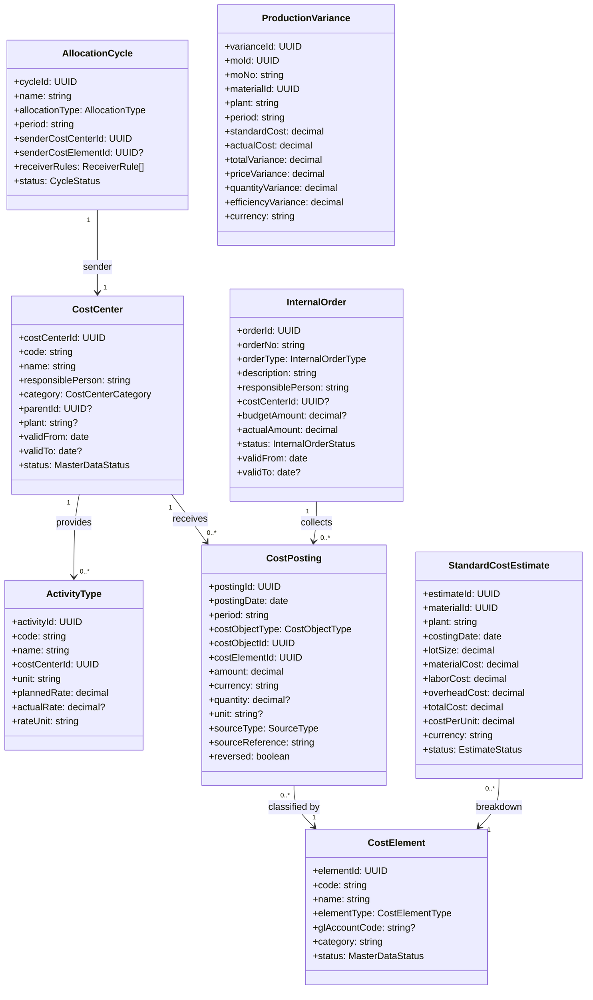
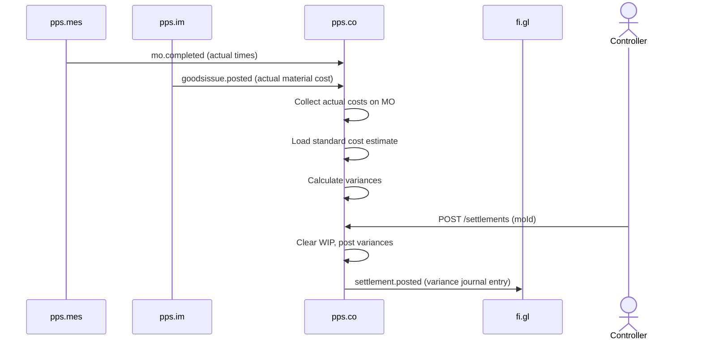

# Controlling (CO) - Domain & Microservice Specification

> **Conceptual Stack Layer:** Domain / Service
> **Space:** Platform
> **Owner:** Domain Engineering Team
> **Schema alignment:** `service-layer.schema.json`
> **Companion files:** `openapi.yaml`, `*.schema.json` (event contracts)
> **Referenced by:** Platform-Feature Spec SS5 (backend dependencies), BFF Contract
> **Belongs to:** Suite Spec `_pps_suite.md`

> **Meta Information**
> - **Version:** 2026-04-03
> - **Template:** `domain-service-spec.md` v1.0.0
> - **Template Compliance:** ~95%
> - **Author(s):** OpenLeap Architecture Team
> - **Status:** DRAFT
> - **Suite:** `pps`
> - **Domain:** `co`
> - **Bounded Context Ref:** `bc:controlling`
> - **Service ID:** `pps-co-svc`
> - **basePackage:** `io.openleap.pps.co`
> - **API Base Path:** `/api/pps/co/v1`
> - **OpenLeap Starter Version:** `v1.0.0`
> - **Port:** `TBD`
> - **Repository:** `TBD`
> - **Tags:** `pps`, `co`, `controlling`, `cost-accounting`
> - **Team:**
>   - Name: `team-pps`
>   - Email: `pps-team@openleap.io`
>   - Slack: `#pps-team`

---

## Specification Guidelines Compliance

> **This specification MUST comply with the OpenLeap specification guidelines.**
>
> ### Non-Negotiables
> - Never invent facts. If required info is missing, add an **OPEN QUESTION** entry.
> - Preserve intent and decisions. Only change meaning when explicitly requested.
> - Do not remove normative constraints unless they are explicitly replaced.
> - Keep the spec **self-contained**: no "see chat", no implicit context.
>
> ### Style Guide
> - Prefer short sentences and lists.
> - Use MUST/SHOULD/MAY for normative statements.
> - Keep terminology consistent (Aggregate, Domain Service, Application Service, Command, Event).
---

## 0. Document Purpose & Scope

### 0.1 Purpose
This specification defines the Controlling domain as a microservice within the PPS suite. CO provides management accounting capabilities: cost center accounting, product costing, internal order settlement, and profitability analysis. CO consumes actual transaction data from FI, MES, PUR, and SD to track, allocate, and analyze costs for internal decision-making.

**Deployment Note:** CO can be deployed as part of PPS or FI depending on organizational governance. Regardless of hosting, CO uses its own exchange prefix (`pps.co.events`) and maintains its own database schema. The suite overview is documented in `_co_suite.md`.

### 0.2 Scope
**In Scope:**
- Cost center accounting (overhead cost tracking, allocation)
- Product costing (standard cost calculation, actual cost collection, variance analysis)
- Internal orders (cost collectors for projects, maintenance, campaigns)
- Cost allocation and distribution (assessment, distribution, activity allocation)
- Profitability analysis (by customer, product, region, channel)
- Budget vs. actual variance reporting
- Manufacturing order settlement (WIP clearing, production variance)
- Period-end closing activities (allocation cycles, settlement runs)

**Out of Scope:**
- Financial Accounting / external reporting (FI — fi.gl, fi.ar, fi.ap)
- Budget planning and forecasting (future Planning domain)
- Strategic BI dashboards (T4 Analytics)
- Operational transaction posting (handled by source domains: MES, SD, PUR)

### 0.3 Related Documents
- `_co_suite.md` - CO Suite architecture overview
- `_pps_suite.md` - PPS Suite overview
- `_fi_suite.md` - FI Suite overview
- `fi_acc_core_spec_complete.md` - FI Accounting Core spec
- `pps_mes-spec.md` - MES (production cost source)
- `PUR_procurement.md` - Procurement (purchasing cost source)
- `_sd_suite.md` - SD Suite (revenue source)
- `DOMAIN_SPEC_TEMPLATE.md` - Template reference

---

## 1. Business Context

### 1.1 Domain Purpose
CO answers the internal management question: "What did it cost, and why?" While FI records transactions for external compliance (IFRS/GAAP), CO slices the same data by internal dimensions — cost center, product, customer, project — to support management decisions. CO also performs allocations that have no FI counterpart (overhead allocation, activity-based costing).

### 1.2 Business Value
- **Cost Transparency:** Understand true cost of products, services, and departments
- **Variance Analysis:** Compare planned vs. actual costs; identify deviations early
- **Pricing Support:** Standard cost calculations inform pricing decisions
- **Profitability:** Know which customers, products, and channels are profitable
- **Decision Support:** What-if scenarios for make-vs-buy, product mix, capacity investment

### 1.3 Key Stakeholders
| Role | Responsibility | Primary Use Cases |
|------|----------------|-------------------|
| Controller | Manage cost accounting, run allocations | Period-end, variance analysis |
| Plant Controller | Analyze production costs | MO settlement, product costing |
| Sales Controller | Analyze customer/product profitability | Profitability reports |
| CFO | Strategic cost decisions | Dashboard, KPIs |
| Production Manager | Understand production cost drivers | MO variance reports |

### 1.4 Strategic Positioning



### 1.5 Service Context

| Field | Value |
|-------|-------|
| Suite | `pps` (Production Planning & Scheduling) |
| Domain | `co` (Controlling) |
| Bounded Context | `bc:controlling` |
| Service ID | `pps-co-svc` |
| Base Package | `io.openleap.pps.co` |
| Authoritative Sources | PPS Suite Spec (`_pps_suite.md`), CO Suite Spec (`_co_suite.md`), SAP CO best practices |

---

## 2. Service Identity

| Field | Value |
|-------|-------|
| **Service ID** | `pps-co-svc` |
| **Display Name** | Controlling Service |
| **Suite** | `pps` |
| **Domain** | `co` |
| **Bounded Context Ref** | `bc:controlling` |
| **Version** | 2026-04-03 |
| **Status** | DRAFT |
| **API Base Path** | `/api/pps/co/v1` |
| **Repository** | TBD |
| **Tags** | `pps`, `co`, `controlling`, `cost-accounting` |
| **Team Name** | `team-pps` |
| **Team Email** | `pps-team@openleap.io` |
| **Team Slack** | `#pps-team` |

---

## 3. Domain Model

### 3.1 Core Concepts



**Enumerations:**
| Enum | Values |
|------|--------|
| CostCenterCategory | `PRODUCTION`, `ADMINISTRATION`, `SALES`, `RND`, `LOGISTICS`, `IT` |
| CostElementType | `PRIMARY` (maps to GL account), `SECONDARY` (internal allocation only) |
| InternalOrderType | `OVERHEAD`, `INVESTMENT`, `MAINTENANCE`, `CAMPAIGN`, `PROJECT` |
| InternalOrderStatus | `CREATED`, `RELEASED`, `TECHNICALLY_COMPLETE`, `CLOSED`, `CANCELLED` |
| CostObjectType | `COST_CENTER`, `INTERNAL_ORDER`, `MANUFACTURING_ORDER`, `PRODUCT`, `CUSTOMER`, `PROFITABILITY_SEGMENT` |
| SourceType | `FI_POSTING`, `ALLOCATION`, `SETTLEMENT`, `REVALUATION`, `MANUAL` |
| AllocationType | `ASSESSMENT`, `DISTRIBUTION`, `ACTIVITY_ALLOCATION` |
| CycleStatus | `DRAFT`, `EXECUTED`, `REVERSED` |
| EstimateStatus | `DRAFT`, `RELEASED`, `SUPERSEDED` |
| MasterDataStatus | `ACTIVE`, `INACTIVE`, `ARCHIVED` |

### 3.2 Key Business Rules

| ID | Rule | Scope | Enforcement |
|----|------|-------|-------------|
| BR-CO-001 | Unique cost center code per tenant | CostCenter | On create |
| BR-CO-002 | Cost element maps to GL account (primary) or is internal-only (secondary) | CostElement | On create |
| BR-CO-003 | Internal order budget check (warning when >90%, block when >100% if configured) | InternalOrder | On posting |
| BR-CO-004 | Allocation cycle sender != receiver | AllocationCycle | On create |
| BR-CO-005 | Settlement clears WIP to variance | ProductionVariance | On MO settlement |
| BR-CO-006 | Period must be open for postings | CostPosting | On post |
| BR-CO-007 | Standard cost estimate must be released before use | StandardCostEstimate | On release |
| BR-CO-008 | Variance = actual - standard; decomposed into price, quantity, efficiency | ProductionVariance | On settlement |

---

## 4. Business Rules & Constraints

### 4.1 Business Rules Catalog

| ID | Rule Name | Description | Scope | Enforcement | Error Code |
|----|-----------|-------------|-------|-------------|------------|
| BR-CO-001 | Unique Cost Center Code | Unique cost center code per tenant | CostCenter | On create | `CO-VAL-001` |
| BR-CO-002 | Cost Element Type Mapping | Primary maps to GL account; secondary is internal-only | CostElement | On create | `CO-VAL-002` |
| BR-CO-003 | Budget Check | Warning when >90%, block when >100% if configured | InternalOrder | On posting | `CO-BIZ-003` |
| BR-CO-004 | Sender Not Receiver | Allocation cycle sender != receiver | AllocationCycle | On create | `CO-BIZ-004` |
| BR-CO-005 | Settlement Clears WIP | Settlement clears WIP to variance accounts | ProductionVariance | On MO settlement | `CO-BIZ-005` |
| BR-CO-006 | Period Open Check | Period must be open for postings | CostPosting | On post | `CO-BIZ-006` |
| BR-CO-007 | Estimate Release Required | Standard cost estimate must be released before use in valuation | StandardCostEstimate | On release | `CO-BIZ-007` |
| BR-CO-008 | Variance Decomposition | Variance = actual - standard; decomposed into price, quantity, efficiency | ProductionVariance | On settlement | `CO-BIZ-008` |

### 4.2 Data Validation Rules

| Field | Validation Rule | Error Code | Error Message |
|-------|----------------|------------|---------------|
| costCenter.code | Required, unique per tenant | `CO-VAL-001` | `"Cost center code must be unique per tenant"` |
| costElement.glAccountCode | Required for PRIMARY type | `CO-VAL-002` | `"GL account code required for primary cost elements"` |
| posting.period | Required, must be open | `CO-BIZ-006` | `"Period must be open for postings"` |
| posting.amount | Required, non-zero | `CO-VAL-010` | `"Posting amount must be non-zero"` |
| allocationCycle.senderCostCenterId | Must differ from all receivers | `CO-BIZ-004` | `"Sender cost center cannot also be a receiver"` |
| standardCostEstimate.lotSize | Required, > 0 | `CO-VAL-011` | `"Lot size must be greater than zero"` |

---

## 5. Use Cases

### 5.1 Business Logic Placement

| Layer | Responsibilities |
|-------|-----------------|
| Application Service | Command validation, aggregate loading, event publishing, orchestration (settlement workflow, period-end) |
| Domain Service | Allocation execution, variance calculation, standard cost rollup (cross-aggregate) |
| Aggregate | State transitions, invariant enforcement, attribute validation |

### 5.2 Use Cases

#### UC-CO-001: Cost Center Accounting

| Field | Value |
|-------|-------|
| **ID** | UC-CO-001 |
| **Type** | WRITE (event-driven) + READ |
| **Trigger** | Event (FI journal, MES/PUR events) / REST (reports) |
| **Aggregate** | CostCenter, CostPosting |
| **Domain Operation** | `CostPostingService.classifyAndPost()` |
| **Inputs** | Incoming event payload (journal entry, MO completion, purchase cost) |
| **Outputs** | CostPosting records classified by cost center and cost element |
| **Events** | `pps.co.costposting.created` |
| **REST** | `GET /api/pps/co/v1/cost-centers/{id}/report?periodFrom={}&periodTo={}` -> 200 OK |
| **Idempotency** | Event deduplication via source reference |
| **Errors** | 422 (BR-CO-006 period closed), 404 (unknown cost center) |

**Detailed Flow:** Actual costs flow into cost centers via FI journal postings and MES/PUR events. Controller reviews cost center reports and runs overhead allocation cycles at period-end.

#### UC-CO-002: Product Costing (Standard Cost)

| Field | Value |
|-------|-------|
| **ID** | UC-CO-002 |
| **Type** | WRITE |
| **Trigger** | REST |
| **Aggregate** | StandardCostEstimate |
| **Domain Operation** | `StandardCostEstimate.calculate()` + `StandardCostEstimate.release()` |
| **Inputs** | materialId, plant, costingDate, lotSize |
| **Outputs** | StandardCostEstimate with material, labor, overhead cost breakdown |
| **Events** | `pps.co.costestimate.released` (on release) |
| **REST** | `POST /api/pps/co/v1/cost-estimates` -> 201 Created; `POST /api/pps/co/v1/cost-estimates/{id}/release` -> 200 OK |
| **Idempotency** | Client-generated `Idempotency-Key` header |
| **Errors** | 400 (validation), 422 (BOM/routing not found, BR-CO-007 already released) |

**Detailed Flow:**
1. Create StandardCostEstimate for a material (BOM explosion + routing times + rates)
2. Material cost = sum of component costs (from BOM)
3. Labor cost = sum of operation times * activity rates
4. Overhead = overhead rates applied per cost center
5. Release estimate -> becomes the standard cost for valuation

#### UC-CO-003: Manufacturing Order Settlement

| Field | Value |
|-------|-------|
| **ID** | UC-CO-003 |
| **Type** | WRITE |
| **Trigger** | Event (`pps.mes.mo.completed`) / REST |
| **Aggregate** | ProductionVariance |
| **Domain Operation** | `SettlementService.settleMO()` |
| **Inputs** | moId (from event or REST) |
| **Outputs** | ProductionVariance with price, quantity, efficiency breakdown |
| **Events** | `pps.co.settlement.posted` -> fi.gl (settlement journal) |
| **REST** | `POST /api/pps/co/v1/settlements` -> 201 Created |
| **Idempotency** | Idempotent per moId + period (duplicate settlement rejected) |
| **Errors** | 404 (MO not found), 422 (no standard cost estimate, BR-CO-005 already settled) |

**Detailed Flow:**
1. MES publishes `mo.completed`
2. CO collects actual costs on MO: actual material consumption (from IM GI), actual labor (from MES confirmations * activity rates), actual overhead
3. CO compares actual vs. standard cost (from StandardCostEstimate)
4. Calculate variances: price, quantity, efficiency
5. Settle: clear WIP, post variances to variance cost elements
6. Publish `pps.co.settlement.posted` -> FI posts settlement journal

#### UC-CO-004: Allocation Cycles

| Field | Value |
|-------|-------|
| **ID** | UC-CO-004 |
| **Type** | WRITE |
| **Trigger** | REST |
| **Aggregate** | AllocationCycle |
| **Domain Operation** | `AllocationCycle.execute()` / `AllocationCycle.reverse()` |
| **Inputs** | cycleId or cycle definition (sender CC, receiver CCs, allocation keys, period) |
| **Outputs** | CostPostings of sourceType=ALLOCATION distributed to receivers |
| **Events** | `pps.co.allocation.posted` |
| **REST** | `POST /api/pps/co/v1/allocation-cycles/{id}/execute` -> 200 OK |
| **Idempotency** | Idempotent per cycleId + period |
| **Errors** | 404, 409 (already executed), 422 (BR-CO-004 sender=receiver, BR-CO-006 period closed) |

**Detailed Flow:**
1. Define allocation cycle (sender CC, receiver CCs, allocation keys)
2. Run cycle for a period
3. System distributes sender costs to receivers proportionally
4. Creates CostPostings of sourceType=ALLOCATION

#### UC-CO-005: Profitability Analysis

| Field | Value |
|-------|-------|
| **ID** | UC-CO-005 |
| **Type** | READ |
| **Trigger** | REST |
| **Aggregate** | CostPosting (query projection) |
| **Domain Operation** | Query projection across profitability segments |
| **Inputs** | dimensions (customer, product, region), periodFrom, periodTo |
| **Outputs** | Contribution margin reports aggregated by selected dimensions |
| **Events** | -- |
| **REST** | `GET /api/pps/co/v1/profitability?dimensions=customer,product&periodFrom={}&periodTo={}` -> 200 OK |
| **Idempotency** | Inherently idempotent (GET) |
| **Errors** | 400 (invalid dimensions or period range) |

#### UC-CO-006: Period-End Closing

| Field | Value |
|-------|-------|
| **ID** | UC-CO-006 |
| **Type** | WRITE |
| **Trigger** | REST |
| **Aggregate** | Period (cross-aggregate orchestration) |
| **Domain Operation** | `PeriodCloseService.closePeriod()` |
| **Inputs** | period |
| **Outputs** | Period marked as closed; all allocations and settlements executed |
| **Events** | `pps.co.period.closed` |
| **REST** | `POST /api/pps/co/v1/periods/{period}/close` -> 200 OK |
| **Idempotency** | Idempotent (re-close of closed period is no-op) |
| **Errors** | 409 (already closed), 422 (open settlements or allocations pending) |

**Detailed Flow:**
1. Run allocation cycles (overhead distribution, assessment)
2. Settle internal orders (maintenance, projects -> cost centers)
3. Settle manufacturing orders (WIP -> variance)
4. Generate management reports
5. Close period

### 5.3 Process Flow Diagrams



---

## 6. REST API

**Base Path:** `/api/pps/co/v1`
**Auth:** OAuth2/JWT — `pps.co:read`, `pps.co:write`, `pps.co:admin`

### Cost Centers
```
POST   /api/pps/co/v1/cost-centers
GET    /api/pps/co/v1/cost-centers?category={}&plant={}&status={}&page=0&size=50
GET    /api/pps/co/v1/cost-centers/{id}
PATCH  /api/pps/co/v1/cost-centers/{id}
GET    /api/pps/co/v1/cost-centers/{id}/postings?period={}&page=0&size=100
GET    /api/pps/co/v1/cost-centers/{id}/report?periodFrom={}&periodTo={}
```

### Cost Elements
```
POST   /api/pps/co/v1/cost-elements
GET    /api/pps/co/v1/cost-elements?elementType={}&status={}
GET/PATCH /api/pps/co/v1/cost-elements/{id}
```

### Internal Orders
```
POST   /api/pps/co/v1/internal-orders
GET    /api/pps/co/v1/internal-orders?orderType={}&status={}&page=0&size=50
GET    /api/pps/co/v1/internal-orders/{id}
PATCH  /api/pps/co/v1/internal-orders/{id}
POST   /api/pps/co/v1/internal-orders/{id}/release
POST   /api/pps/co/v1/internal-orders/{id}/complete
POST   /api/pps/co/v1/internal-orders/{id}/settle            — Settle to receiver
GET    /api/pps/co/v1/internal-orders/{id}/postings?period={}
```

### Activity Types
```
POST   /api/pps/co/v1/activity-types
GET    /api/pps/co/v1/activity-types?costCenterId={}
GET/PATCH /api/pps/co/v1/activity-types/{id}
```

### Standard Cost Estimates
```
POST   /api/pps/co/v1/cost-estimates                          — Calculate estimate
GET    /api/pps/co/v1/cost-estimates?materialId={}&plant={}&status={}
GET    /api/pps/co/v1/cost-estimates/{id}
POST   /api/pps/co/v1/cost-estimates/{id}/release
```

### Settlements (MO Variance)
```
POST   /api/pps/co/v1/settlements                             — Settle MO
GET    /api/pps/co/v1/settlements?moId={}&period={}
GET    /api/pps/co/v1/settlements/{id}
GET    /api/pps/co/v1/variances?materialId={}&period={}&page=0&size=50
```

### Allocation Cycles
```
POST   /api/pps/co/v1/allocation-cycles
GET    /api/pps/co/v1/allocation-cycles?period={}&allocationType={}
GET    /api/pps/co/v1/allocation-cycles/{id}
POST   /api/pps/co/v1/allocation-cycles/{id}/execute
POST   /api/pps/co/v1/allocation-cycles/{id}/reverse
```

### Profitability
```
GET    /api/pps/co/v1/profitability?dimensions=customer,product&periodFrom={}&periodTo={}
```

### Period Management
```
POST   /api/pps/co/v1/periods/{period}/close
POST   /api/pps/co/v1/periods/{period}/reopen
GET    /api/pps/co/v1/periods?year={}
```

---

## 7. Events & Integration

### 7.1 Published Events
**Exchange:** `pps.co.events` (topic, durable)

#### settlement.posted
**Key:** `pps.co.settlement.posted`
```json
{
  "settlementId": "uuid",
  "moId": "uuid", "moNo": "MO-100200",
  "materialId": "uuid", "plant": "P100",
  "period": "2026-03",
  "standardCost": 5000.00, "actualCost": 5250.00,
  "totalVariance": 250.00,
  "priceVariance": 100.00, "quantityVariance": 80.00, "efficiencyVariance": 70.00,
  "currency": "EUR",
  "journalEntries": [
    { "account": "890100", "costCenter": "CC-PROD-01", "amount": 250.00, "side": "DEBIT" }
  ]
}
```
**Consumer:** fi.gl (post settlement journal), T4 BI

#### allocation.posted
**Key:** `pps.co.allocation.posted`
**Consumer:** fi.gl (if allocation affects GL), T4 BI

#### kpi.calculated
**Key:** `pps.co.kpi.calculated`
**Consumer:** T4 BI

### 7.2 Consumed Events
| Event | Source | Queue | Logic |
|-------|--------|-------|-------|
| `fi.gl.journal.posted` | fi.gl | `pps.co.in.fi.gl.journal` | Classify cost by cost center/element/order |
| `pps.mes.mo.completed` | pps.mes | `pps.co.in.pps.mes.mo` | Trigger MO settlement |
| `pps.mes.confirmation.posted` | pps.mes | `pps.co.in.pps.mes.confirmation` | Accumulate actual labor costs on MO |
| `pps.im.goodsissue.posted` | pps.im | `pps.co.in.pps.im.goodsissue` | Accumulate actual material costs on MO |
| `pps.im.goodsreceipt.posted` | pps.im | `pps.co.in.pps.im.goodsreceipt` | Inventory valuation for cost estimates |
| `sd.bil.invoice.created` | sd.bil | `pps.co.in.sd.bil.invoice` | Revenue for profitability analysis |
| `pps.eam.maintenanceorder.completed` | pps.eam | `pps.co.in.pps.eam.maintenanceorder` | Maintenance cost on internal order |

---

## 8. Data Model

```mermaid
erDiagram
    COST_CENTER ||--o{ COST_POSTING : receives
    COST_CENTER ||--o{ ACTIVITY_TYPE : provides
    INTERNAL_ORDER ||--o{ COST_POSTING : collects
    COST_POSTING }o--|| COST_ELEMENT : "classified by"

    COST_CENTER { uuid id PK; string code UK; string name; string category; uuid parent_id FK; string plant; string status; uuid tenant_id; int version }
    COST_ELEMENT { uuid id PK; string code UK; string name; string element_type; string gl_account_code; string status; uuid tenant_id }
    INTERNAL_ORDER { uuid id PK; string order_no UK; string order_type; string status; decimal budget_amount; decimal actual_amount; uuid cost_center_id FK; uuid tenant_id; int version }
    ACTIVITY_TYPE { uuid id PK; string code UK; uuid cost_center_id FK; string unit; decimal planned_rate; decimal actual_rate; uuid tenant_id }
    COST_POSTING { uuid id PK; date posting_date; string period; string cost_object_type; uuid cost_object_id; uuid cost_element_id FK; decimal amount; string currency; string source_type; string source_reference; boolean reversed; uuid tenant_id }
    ALLOCATION_CYCLE { uuid id PK; string name; string allocation_type; string period; uuid sender_cc_id FK; jsonb receiver_rules; string status; uuid tenant_id }
    STANDARD_COST_ESTIMATE { uuid id PK; uuid material_id; string plant; date costing_date; decimal lot_size; decimal material_cost; decimal labor_cost; decimal overhead_cost; decimal total_cost; decimal cost_per_unit; string currency; string status; uuid tenant_id; int version }
    PRODUCTION_VARIANCE { uuid id PK; uuid mo_id; uuid material_id; string period; decimal standard_cost; decimal actual_cost; decimal total_variance; decimal price_variance; decimal quantity_variance; decimal efficiency_variance; string currency; uuid tenant_id }
```

---

## 9. Security & Compliance

| Role | Read | Post | Allocate | Settle | Period Close | Admin |
|------|------|------|----------|--------|-------------|-------|
| CO_VIEWER | Y | N | N | N | N | N |
| CO_ANALYST | Y | Y | N | N | N | N |
| CO_CONTROLLER | Y | Y | Y | Y | N | N |
| CO_MANAGER | Y | Y | Y | Y | Y | N |
| CO_ADMIN | Y | Y | Y | Y | Y | Y |

**Compliance:** SOX (cost data integrity), IFRS (inventory valuation via standard costs).

---

## 10. Quality Attributes
- Cost posting: < 100ms
- Allocation cycle (1000 postings): < 10 seconds
- MO settlement: < 500ms
- Profitability query: < 1 second
- Availability: 99.5%

---

## 11. Feature Dependencies

### 11.1 Purpose
This section answers: "Which features depend on this service?" It is the inverse of Platform-Feature Spec SS5 and helps the domain team assess the blast radius of API changes.

### 11.2 Feature Dependency Register

> **OPEN QUESTION:** Feature dependencies will be populated when feature specs (Phase 3) are authored for the PPS/CO suite. The following is a preliminary mapping based on expected feature compositions.

| Feature ID | Feature Name | Suite | Tier | Dependency Type | Status |
|------------|-------------|-------|------|-----------------|--------|
| F-CO-TBD | Cost Center Reporting | pps/co | core | sync_api | planned |
| F-CO-TBD | Product Costing | pps/co | core | sync_api | planned |
| F-CO-TBD | MO Settlement | pps/co | core | sync_api + async_event | planned |
| F-CO-TBD | Allocation Cycles | pps/co | supporting | sync_api | planned |
| F-CO-TBD | Profitability Analysis | pps/co | supporting | sync_api | planned |
| F-CO-TBD | Period-End Close | pps/co | core | sync_api | planned |

---

## 12. Extension Points

### 12.1 Purpose
Extension points follow the Open-Closed Principle: the service is open for extension via events and hooks but closed for direct modification.

### 12.2 Extension Events

| Event ID | Routing Key | Trigger | Payload | Purpose |
|----------|-------------|---------|---------|---------|
| EXT-CO-001 | `pps.co.settlement.posted` | MO settlement completed | Full variance breakdown | External systems can react to settlements (e.g., management dashboard, external ERP sync) |
| EXT-CO-002 | `pps.co.kpi.calculated` | KPI calculation completed | KPI summary per period | External analytics and BI systems can consume cost KPIs |
| EXT-CO-003 | `pps.co.allocation.posted` | Allocation cycle executed | Allocation details | External reporting systems can track allocation flows |

### 12.3 Aggregate Hooks

| Hook ID | Aggregate | Lifecycle Point | Hook Type | Description |
|---------|-----------|-----------------|-----------|-------------|
| HOOK-CO-001 | CostPosting | Pre-Post | validation | Custom validation rules per tenant (e.g., mandatory cost object, custom approval thresholds) |
| HOOK-CO-002 | AllocationCycle | Pre-Execute | validation | Custom allocation key validation (e.g., tenant-specific distribution rules) |
| HOOK-CO-003 | StandardCostEstimate | Post-Release | notification | Custom notification channels (email to plant controller, ERP sync) |
| HOOK-CO-004 | ProductionVariance | Post-Settle | enrichment | Custom variance categorization or additional cost breakdown |

**Design Rules:**
- Hooks are fire-and-forget (notification) or bounded-timeout (validation: 2s, enrichment: 5s)
- Validation hooks fail-closed (block on timeout)
- Notification hooks fail-open (log and continue)
- Hooks do not modify aggregate state directly

### 12.4 Extension Points Summary

| ID | Type | Aggregate | Lifecycle Point | Fail Mode | Timeout |
|----|------|-----------|-----------------|-----------|---------|
| EXT-CO-001 | event | ProductionVariance | settled | n/a | n/a |
| EXT-CO-002 | event | KPI | calculated | n/a | n/a |
| EXT-CO-003 | event | AllocationCycle | executed | n/a | n/a |
| HOOK-CO-001 | validation | CostPosting | pre-post | fail-closed | 2s |
| HOOK-CO-002 | validation | AllocationCycle | pre-execute | fail-closed | 2s |
| HOOK-CO-003 | notification | StandardCostEstimate | post-release | fail-open | 5s |
| HOOK-CO-004 | enrichment | ProductionVariance | post-settle | fail-open | 5s |

---

## 13. Migration & Evolution

### 13.1 Data Migration

**Legacy Source:** Legacy ERP controlling modules (SAP CO, Oracle Cost Management).

| Migration Item | Source | Strategy | Complexity |
|---------------|--------|----------|------------|
| Cost centers | Legacy ERP master data | Batch import via CSV/API | Low |
| Cost elements | Legacy chart of accounts mapping | Manual mapping + import | Medium |
| Internal orders | Legacy project/order system | Selective migration of open orders | Medium |
| Standard cost estimates | Legacy product costing | Recalculate in new system; import as baseline | Medium |
| Historical postings | Not migrated | Start fresh; historical data stays in legacy for period comparison | N/A |

### 13.2 Deprecation & Sunset

| Deprecated Feature | Replacement | Removal Timeline | Communication Plan |
|-------------------|-------------|------------------|-------------------|
| -- | -- | -- | -- |

### 13.3 Future Extensions

- Activity-based costing (ABC) with multi-level cost drivers
- Transfer pricing for multi-entity organizations
- Real-time cost monitoring dashboards (beyond period-end)
- Machine learning-based cost anomaly detection
- Integration with external BI tools for advanced profitability analytics

---

## 14. Decisions & Open Questions

### 14.1 Open Questions

| ID | Question | Status |
|----|----------|--------|
| Q-001 | CO hosted in PPS or FI? | Decided — deployment-specific, own exchange regardless |
| Q-002 | Activity-based costing vs. traditional overhead rates? | Open — support both |
| Q-003 | Transfer pricing for multi-entity? | Open — Phase 3 |
| Q-004 | Real-time cost monitoring vs. period-end only? | Decided — hybrid (event-driven actuals + period-end allocation) |

### 14.2 Architectural Decision Records

### ADR-CO-001: Event-Driven Actual Cost Collection
**Status:** Accepted. CO subscribes to events from MES, IM, FI to accumulate actuals in real-time. Allocation and settlement remain period-end batch processes.

---

## 15. Appendix

### 15.1 Glossary
| Term | Definition | Aliases |
|------|------------|---------|
| Cost Center | Organizational unit that incurs costs | Kostenstelle |
| Cost Element | Classification of a cost (material, labor, overhead) | Kostenart |
| Internal Order | Cost collector for a specific purpose | Innenauftrag |
| Activity Type | Measurable output of a cost center (machine hours, labor hours) | Leistungsart |
| Assessment | Allocation by percentage/ratio (secondary cost element) | Umlage |
| Distribution | Allocation preserving original cost element | Verteilung |
| Settlement | Clearing WIP from MO to variance accounts | Abrechnung |
| Standard Cost | Planned cost per unit for valuation | Standardkosten |
| Variance | Difference between standard and actual cost | Abweichung |

### 15.2 Change Log
| Date | Version | Author | Changes |
|------|---------|--------|---------|
| 2026-02-23 | 1.0 | OpenLeap Architecture Team | Initial version |
| 2026-04-03 | 1.1 | OpenLeap Architecture Team | Template compliance: add Service Identity, reorder sections, convert UC to table format, expand Feature Dependencies, Extension Points, Migration |

---

## Document Review & Approval
**Status:** DRAFT
