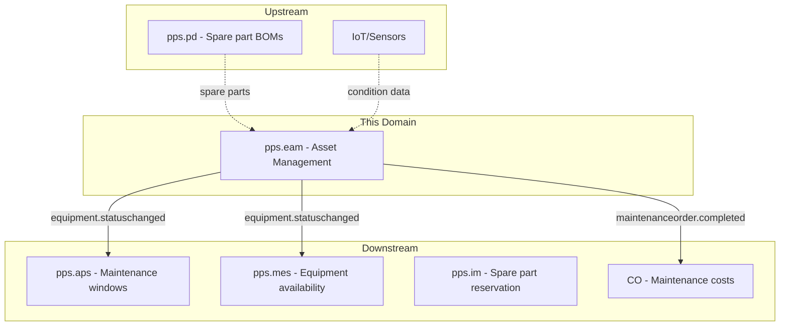
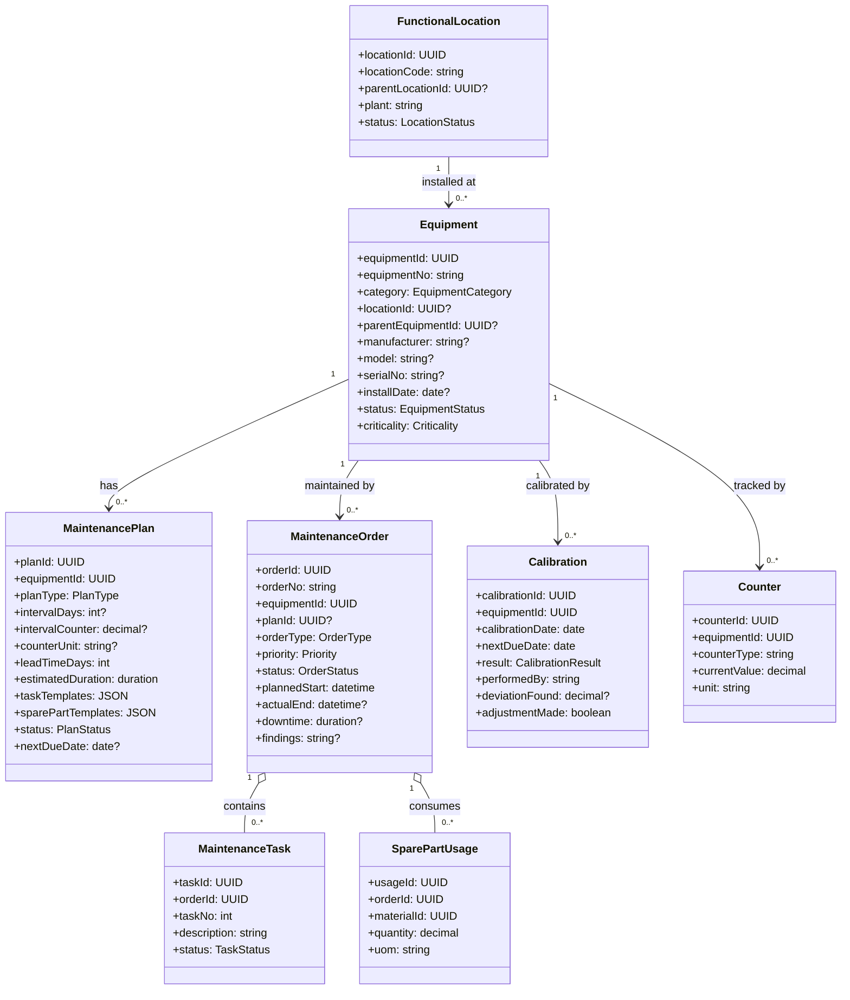
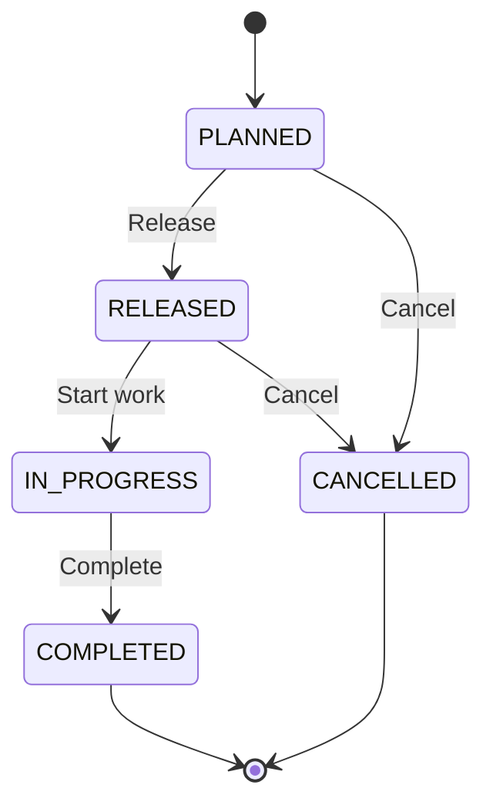
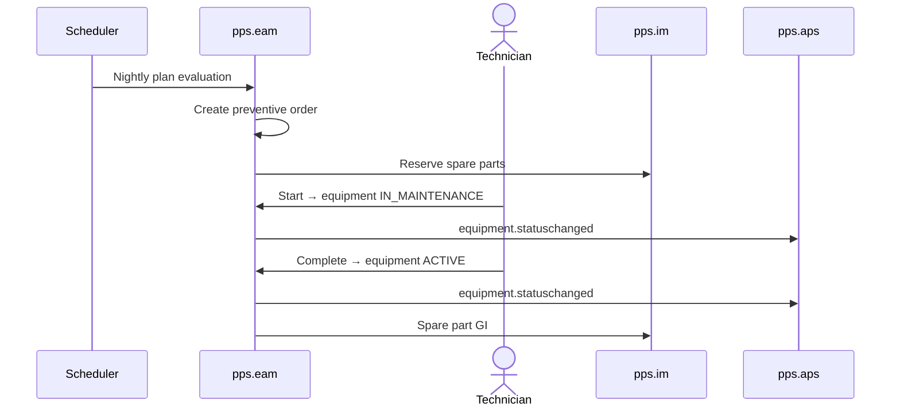

# Enterprise Asset Management (EAM) - Domain & Microservice Specification

> **Conceptual Stack Layer:** Domain / Service
> **Space:** Platform
> **Owner:** Domain Engineering Team
> **Schema alignment:** `service-layer.schema.json`
> **Companion files:** `openapi.yaml`, `*.schema.json` (event contracts)
> **Referenced by:** Platform-Feature Spec SS5 (backend dependencies), BFF Contract
> **Belongs to:** Suite Spec `_pps_suite.md`

> **Meta Information**
> - **Version:** 2026-04-03
> - **Template:** `domain-service-spec.md` v1.0.0
> - **Template Compliance:** ~95%
> - **Author(s):** OpenLeap Architecture Team
> - **Status:** DRAFT
> - **Suite:** `pps`
> - **Domain:** `eam`
> - **Bounded Context Ref:** `bc:asset-management`
> - **Service ID:** `pps-eam-svc`
> - **basePackage:** `io.openleap.pps.eam`
> - **API Base Path:** `/api/pps/eam/v1`
> - **OpenLeap Starter Version:** `v1.0.0`
> - **Port:** `TBD`
> - **Repository:** `TBD`
> - **Tags:** `pps`, `eam`, `maintenance`, `assets`
> - **Team:**
>   - Name: `team-pps`
>   - Email: `pps-team@openleap.io`
>   - Slack: `#pps-team`

---

## Specification Guidelines Compliance

> **This specification MUST comply with the OpenLeap specification guidelines.**
>
> ### Non-Negotiables
> - Never invent facts. If required info is missing, add an **OPEN QUESTION** entry.
> - Preserve intent and decisions. Only change meaning when explicitly requested.
> - Do not remove normative constraints unless they are explicitly replaced.
> - Keep the spec **self-contained**: no "see chat", no implicit context.
>
> ### Style Guide
> - Prefer short sentences and lists.
> - Use MUST/SHOULD/MAY for normative statements.
> - Keep terminology consistent (Aggregate, Domain Service, Application Service, Command, Event).
---

## 0. Document Purpose & Scope

### 0.1 Purpose
This specification defines the Enterprise Asset Management domain, which manages production equipment, facilities, and instruments throughout their lifecycle. EAM handles preventive and corrective maintenance planning, maintenance order execution, spare part coordination, and calibration tracking.

### 0.2 Scope
**In Scope:** Equipment master data and hierarchy, maintenance plans (time/counter/condition-based), maintenance order lifecycle, preventive scheduling, corrective/breakdown handling, spare part planning, calibration management, equipment status and downtime tracking, maintenance history.

**Out of Scope:** Spare part inventory (IM), spare part procurement (PUR), production scheduling (APS), cost posting (CO/FI), warehouse operations (WM), quality inspection (QM), IoT sensor collection.

### 0.3 Related Documents
`_pps_suite.md`, `pps_im-spec.md`, `PUR_procurement.md`, `pps_mes-spec.md`, `DOMAIN_SPEC_TEMPLATE.md`

---

## 1. Business Context

### 1.1 Domain Purpose
EAM ensures production assets are available, reliable, and compliant. It plans and tracks all maintenance activities and provides history for reliability analysis and regulatory compliance.

### 1.2 Business Value
- **Uptime:** Preventive maintenance reduces unplanned downtime
- **Cost Control:** Planned maintenance is 3-5x cheaper than breakdown repair
- **Compliance:** Calibration tracking for ISO 17025, FDA, GxP
- **Asset Lifecycle:** Full history from installation to decommissioning
- **Spare Parts:** Plans drive spare part demand into MRP/PUR

### 1.3 Key Stakeholders
| Role | Responsibility | Primary Use Cases |
|------|----------------|-------------------|
| Maintenance Manager | Plan and schedule | Plans, scheduling, KPIs |
| Maintenance Technician | Execute orders | Order execution, parts recording |
| Production Manager | Coordinate windows | Equipment availability |
| Calibration Officer | Manage calibrations | Schedules, certificates |
| Plant Engineer | Define structure | Equipment hierarchy |

### 1.4 Strategic Positioning



### 1.5 Service Context

| Field | Value |
|-------|-------|
| Suite | `pps` (Production Planning & Scheduling) |
| Domain | `eam` (Enterprise Asset Management) |
| Bounded Context | `bc:asset-management` |
| Service ID | `pps-eam-svc` |
| Base Package | `io.openleap.pps.eam` |
| Authoritative Sources | PPS Suite Spec (`_pps_suite.md`), SAP PM / IBM Maximo best practices |

---

## 2. Service Identity

| Field | Value |
|-------|-------|
| **Service ID** | `pps-eam-svc` |
| **Display Name** | Enterprise Asset Management Service |
| **Suite** | `pps` |
| **Domain** | `eam` |
| **Bounded Context Ref** | `bc:asset-management` |
| **Version** | 2026-04-03 |
| **Status** | DRAFT |
| **API Base Path** | `/api/pps/eam/v1` |
| **Repository** | TBD |
| **Tags** | `pps`, `eam`, `maintenance`, `assets` |
| **Team Name** | `team-pps` |
| **Team Email** | `pps-team@openleap.io` |
| **Team Slack** | `#pps-team` |

---

## 3. Domain Model

### 3.1 Core Concepts



**Enumerations:**
| Enum | Values |
|------|--------|
| EquipmentCategory | `MACHINE`, `TOOL`, `INSTRUMENT`, `FACILITY`, `VEHICLE`, `IT_ASSET` |
| EquipmentStatus | `ACTIVE`, `IN_MAINTENANCE`, `BREAKDOWN`, `DECOMMISSIONED` |
| Criticality | `A` (critical), `B` (important), `C` (standard) |
| PlanType | `TIME_BASED`, `COUNTER_BASED`, `CONDITION_BASED` |
| PlanStatus | `DRAFT`, `ACTIVE`, `SUSPENDED`, `ARCHIVED` |
| OrderType | `PREVENTIVE`, `CORRECTIVE`, `BREAKDOWN`, `IMPROVEMENT`, `CALIBRATION` |
| OrderStatus | `PLANNED`, `RELEASED`, `IN_PROGRESS`, `COMPLETED`, `CANCELLED` |
| TaskStatus | `OPEN`, `IN_PROGRESS`, `COMPLETED`, `SKIPPED` |
| Priority | `LOW`, `MEDIUM`, `HIGH`, `EMERGENCY` |
| CalibrationResult | `PASS`, `PASS_WITH_ADJUSTMENT`, `FAIL`, `OUT_OF_TOLERANCE` |

### 3.2 MaintenanceOrder Lifecycle


### 3.3 Business Rules
| ID | Rule | Scope | Enforcement |
|----|------|-------|-------------|
| BR-EAM-001 | Unique Equipment No per tenant | Equipment | On create |
| BR-EAM-002 | Plan type requires matching params | MaintenancePlan | On save |
| BR-EAM-003 | Only INSTRUMENT can have calibrations | Calibration | On create |
| BR-EAM-004 | Overdue calibrations generate critical alert | Calibration | Nightly |
| BR-EAM-005 | Spare parts reserved on order release | MaintenanceOrder | On release |
| BR-EAM-006 | Status change starts/stops downtime clock | Equipment | On change |
| BR-EAM-007 | BREAKDOWN orders default EMERGENCY priority | MaintenanceOrder | On create |
| BR-EAM-008 | Completion updates plan nextDueDate | MaintenancePlan | On complete |

---

## 4. Business Rules & Constraints

### 4.1 Business Rules Catalog

| ID | Rule Name | Description | Scope | Enforcement | Error Code |
|----|-----------|-------------|-------|-------------|------------|
| BR-EAM-001 | Unique Equipment No | Unique equipment number per tenant | Equipment | On create | `EAM-VAL-001` |
| BR-EAM-002 | Plan Type Params | Plan type requires matching parameters (days for time-based, counter for counter-based) | MaintenancePlan | On save | `EAM-VAL-002` |
| BR-EAM-003 | Calibration Category | Only INSTRUMENT category equipment can have calibrations | Calibration | On create | `EAM-BIZ-003` |
| BR-EAM-004 | Overdue Calibration Alert | Overdue calibrations generate critical alert | Calibration | Nightly batch | `EAM-BIZ-004` |
| BR-EAM-005 | Spare Part Reservation | Spare parts reserved in IM on order release | MaintenanceOrder | On release | `EAM-BIZ-005` |
| BR-EAM-006 | Downtime Clock | Equipment status change starts/stops downtime clock | Equipment | On status change | `EAM-BIZ-006` |
| BR-EAM-007 | Breakdown Priority | BREAKDOWN orders default to EMERGENCY priority | MaintenanceOrder | On create | `EAM-BIZ-007` |
| BR-EAM-008 | Plan Next Due Update | Completion of maintenance order updates plan nextDueDate | MaintenancePlan | On order complete | `EAM-BIZ-008` |

### 4.2 Data Validation Rules

| Field | Validation Rule | Error Code | Error Message |
|-------|----------------|------------|---------------|
| equipmentNo | Required, unique per tenant | `EAM-VAL-001` | `"Equipment number must be unique per tenant"` |
| plan.intervalDays | Required for TIME_BASED plans, > 0 | `EAM-VAL-002` | `"Interval days required for time-based plans"` |
| plan.intervalCounter | Required for COUNTER_BASED plans, > 0 | `EAM-VAL-003` | `"Counter interval required for counter-based plans"` |
| order.equipmentId | Required, must reference existing equipment | `EAM-VAL-004` | `"Valid equipment reference required"` |
| calibration.equipmentId | Must reference INSTRUMENT category equipment | `EAM-BIZ-003` | `"Calibrations only allowed for INSTRUMENT category equipment"` |
| counter.currentValue | Must be >= previous value (monotonic) | `EAM-VAL-005` | `"Counter value must be monotonically increasing"` |

---

## 5. Use Cases

### 5.1 Business Logic Placement

| Layer | Responsibilities |
|-------|-----------------|
| Application Service | Command validation, aggregate loading, event publishing, orchestration (plan evaluation, spare part reservation) |
| Domain Service | Plan evaluation scheduling, downtime calculation, calibration due-date logic (cross-aggregate) |
| Aggregate | State transitions, invariant enforcement, attribute validation |

### 5.2 Use Cases

#### UC-EAM-001: Preventive Maintenance Scheduling

| Field | Value |
|-------|-------|
| **ID** | UC-EAM-001 |
| **Type** | WRITE |
| **Trigger** | System (nightly batch) / REST |
| **Aggregate** | MaintenancePlan, MaintenanceOrder |
| **Domain Operation** | `PlanEvaluationService.evaluateActivePlans()` |
| **Inputs** | -- (nightly) or planId (manual trigger) |
| **Outputs** | MaintenanceOrder(s) created from plan templates |
| **Events** | `pps.eam.maintenanceorder.created` |
| **REST** | `POST /api/pps/eam/v1/plans/{id}/evaluate` -> 200 OK (manual trigger) |
| **Idempotency** | Idempotent per plan + evaluation cycle (no duplicate orders) |
| **Errors** | 404 (plan not found), 409 (plan not ACTIVE) |

**Detailed Flow:**
1. Evaluate active plans; check due dates (time) or counter thresholds
2. Generate MaintenanceOrder from plan templates
3. Publish `pps.eam.maintenanceorder.created`

#### UC-EAM-002: Execute Maintenance Order

| Field | Value |
|-------|-------|
| **ID** | UC-EAM-002 |
| **Type** | WRITE |
| **Trigger** | REST |
| **Aggregate** | MaintenanceOrder, Equipment |
| **Domain Operation** | `MaintenanceOrder.release()`, `MaintenanceOrder.start()`, `MaintenanceOrder.complete()` |
| **Inputs** | orderId, action (release/start/complete), findings?, spare parts used? |
| **Outputs** | MaintenanceOrder progressed through lifecycle; Equipment status updated |
| **Events** | `pps.eam.equipment.statuschanged` (on start/complete), `pps.eam.maintenanceorder.completed` (on complete) |
| **REST** | `POST /api/pps/eam/v1/orders/{id}/release`, `/start`, `/complete` -> 200 OK |
| **Idempotency** | Idempotent (re-complete of COMPLETED is no-op) |
| **Errors** | 404, 409 (invalid state transition), 422 (BR-EAM-005 spare parts unavailable) |

**Detailed Flow:**
1. Release order, reserve spare parts in IM
2. Start -> equipment IN_MAINTENANCE -> publish status event
3. Complete tasks, record findings and spare parts
4. Complete -> equipment ACTIVE, update plan next-due
5. Publish `pps.eam.maintenanceorder.completed`

#### UC-EAM-003: Breakdown Handling

| Field | Value |
|-------|-------|
| **ID** | UC-EAM-003 |
| **Type** | WRITE |
| **Trigger** | REST |
| **Aggregate** | MaintenanceOrder, Equipment |
| **Domain Operation** | `Equipment.reportBreakdown()` + `MaintenanceOrder.createBreakdown()` |
| **Inputs** | equipmentId, description, root cause? |
| **Outputs** | Equipment in BREAKDOWN status; BREAKDOWN order with EMERGENCY priority |
| **Events** | `pps.eam.equipment.statuschanged` (BREAKDOWN), `pps.eam.maintenanceorder.created` |
| **REST** | `POST /api/pps/eam/v1/equipment/{id}/report-breakdown` -> 201 Created |
| **Idempotency** | Client-generated `Idempotency-Key` header |
| **Errors** | 404 (equipment not found), 409 (equipment already in BREAKDOWN) |

**Detailed Flow:**
1. Report breakdown -> equipment BREAKDOWN, publish status event
2. Create BREAKDOWN order (EMERGENCY priority, BR-EAM-007)
3. Repair, record root cause, complete
4. Equipment -> ACTIVE, publish status event

#### UC-EAM-004: Calibration

| Field | Value |
|-------|-------|
| **ID** | UC-EAM-004 |
| **Type** | WRITE |
| **Trigger** | REST / System (plan-triggered) |
| **Aggregate** | Calibration, Equipment |
| **Domain Operation** | `Calibration.record()` |
| **Inputs** | equipmentId, calibrationDate, result, performedBy, deviationFound?, adjustmentMade? |
| **Outputs** | Calibration record; updated nextDueDate on plan; equipment blocked if FAIL |
| **Events** | `pps.eam.calibration.recorded` |
| **REST** | `POST /api/pps/eam/v1/calibrations` -> 201 Created |
| **Idempotency** | Client-generated `Idempotency-Key` header |
| **Errors** | 404 (equipment not found), 422 (BR-EAM-003 not INSTRUMENT category) |

**Detailed Flow:**
1. Plan triggers calibration order when due
2. Perform calibration against standard
3. Record result; if FAIL -> block equipment
4. Update next due date, generate certificate via DMS

#### UC-EAM-005: Manage Equipment (READ/WRITE)

| Field | Value |
|-------|-------|
| **ID** | UC-EAM-005 |
| **Type** | READ + WRITE |
| **Trigger** | REST |
| **Aggregate** | Equipment, FunctionalLocation |
| **Domain Operation** | CRUD operations on equipment and location master data |
| **Inputs** | Equipment/location attributes |
| **Outputs** | Created/updated equipment data, equipment history |
| **Events** | -- |
| **REST** | `POST/GET/PATCH /api/pps/eam/v1/equipment`, `GET /api/pps/eam/v1/equipment/{id}/history` |
| **Idempotency** | Standard CRUD idempotency |
| **Errors** | 400 (validation), 404 (not found), 409 (BR-EAM-001 duplicate equipment no) |

### 5.3 Process Flow Diagrams



---

## 6. REST API

**Base Path:** `/api/pps/eam/v1`
**Auth:** OAuth2/JWT — `pps.eam:read`, `pps.eam:write`, `pps.eam:admin`

### Functional Locations
```
POST/GET   /api/pps/eam/v1/locations
GET/PATCH  /api/pps/eam/v1/locations/{id}
```

### Equipment
```
POST   /api/pps/eam/v1/equipment
GET    /api/pps/eam/v1/equipment?plant={}&category={}&status={}&page=0&size=50
GET    /api/pps/eam/v1/equipment/{id}
PATCH  /api/pps/eam/v1/equipment/{id}
GET    /api/pps/eam/v1/equipment/{id}/history
GET    /api/pps/eam/v1/equipment/{id}/counters
POST   /api/pps/eam/v1/equipment/{id}/counters
```

### Maintenance Plans
```
POST   /api/pps/eam/v1/plans
GET    /api/pps/eam/v1/plans?equipmentId={}&planType={}&status={}
GET/PATCH /api/pps/eam/v1/plans/{id}
POST   /api/pps/eam/v1/plans/{id}/activate
POST   /api/pps/eam/v1/plans/{id}/suspend
```

### Maintenance Orders
```
POST   /api/pps/eam/v1/orders
GET    /api/pps/eam/v1/orders?equipmentId={}&orderType={}&status={}&priority={}&page=0&size=50
GET/PATCH /api/pps/eam/v1/orders/{id}
POST   /api/pps/eam/v1/orders/{id}/release
POST   /api/pps/eam/v1/orders/{id}/start
POST   /api/pps/eam/v1/orders/{id}/complete
POST   /api/pps/eam/v1/orders/{id}/cancel
POST   /api/pps/eam/v1/orders/{id}/tasks/{taskId}/complete
POST   /api/pps/eam/v1/orders/{id}/spare-parts
```

### Calibrations
```
POST   /api/pps/eam/v1/calibrations
GET    /api/pps/eam/v1/calibrations?equipmentId={}&overdue=true
GET    /api/pps/eam/v1/calibrations/{id}
```

---

## 7. Events & Integration

### 7.1 Published Events
**Exchange:** `pps.eam.events` (topic, durable)

#### equipment.statuschanged
**Key:** `pps.eam.equipment.statuschanged`
```json
{ "equipmentId":"uuid", "equipmentNo":"EQ-001", "plant":"P100",
  "previousStatus":"ACTIVE", "newStatus":"IN_MAINTENANCE",
  "reason":"PM-2026-003", "expectedAvailableAt":"2026-02-24T08:00:00Z" }
```
**Consumers:** pps.aps, pps.mes

#### maintenanceorder.completed
**Key:** `pps.eam.maintenanceorder.completed`
```json
{ "orderId":"uuid", "orderNo":"MO-EAM-003", "equipmentId":"uuid",
  "orderType":"PREVENTIVE", "actualDuration":"PT6H", "downtime":"PT8H",
  "spareParts":[{"materialId":"uuid","quantity":2,"uom":"PC"}] }
```
**Consumers:** CO, T4 BI

#### calibration.recorded
**Key:** `pps.eam.calibration.recorded`
**Consumers:** pps.qm, T4 BI

### 7.2 Consumed Events
| Event | Source | Queue | Logic |
|-------|--------|-------|-------|
| `pps.im.stock.changed` | pps.im | `pps.eam.in.pps.im.stock` | Spare part availability |
| `pps.pd.product.released` | pps.pd | `pps.eam.in.pps.pd.product` | Spare part master cache |

---

## 8. Data Model

```mermaid
erDiagram
    FUNCTIONAL_LOCATION ||--o{ EQUIPMENT : "installed at"
    EQUIPMENT ||--o{ MAINTENANCE_PLAN : has
    EQUIPMENT ||--o{ MAINTENANCE_ORDER : "maintained by"
    EQUIPMENT ||--o{ CALIBRATION : "calibrated by"
    EQUIPMENT ||--o{ COUNTER : "tracked by"
    MAINTENANCE_ORDER ||--o{ MAINTENANCE_TASK : contains
    MAINTENANCE_ORDER ||--o{ SPARE_PART_USAGE : consumes

    FUNCTIONAL_LOCATION { uuid id PK; string location_code UK; uuid parent_id FK; string plant; string status; uuid tenant_id }
    EQUIPMENT { uuid id PK; string equipment_no UK; string category; uuid location_id FK; string status; string criticality; jsonb attributes; uuid tenant_id; int version }
    MAINTENANCE_PLAN { uuid id PK; uuid equipment_id FK; string plan_type; int interval_days; string status; date next_due_date; jsonb task_templates; jsonb spare_part_templates; uuid tenant_id; int version }
    MAINTENANCE_ORDER { uuid id PK; string order_no UK; uuid equipment_id FK; uuid plan_id FK; string order_type; string priority; string status; bigint downtime_ms; uuid tenant_id; int version }
    MAINTENANCE_TASK { uuid id PK; uuid order_id FK; int task_no; string status; uuid tenant_id }
    SPARE_PART_USAGE { uuid id PK; uuid order_id FK; uuid material_id; decimal quantity; uuid tenant_id }
    CALIBRATION { uuid id PK; uuid equipment_id FK; date calibration_date; date next_due_date; string result; uuid tenant_id }
    COUNTER { uuid id PK; uuid equipment_id FK; string counter_type; decimal current_value; string unit; uuid tenant_id }
```

---

## 9. Security & Compliance

| Role | Read | Execute | Plans | Calibrate | Admin |
|------|------|---------|-------|-----------|-------|
| EAM_VIEWER | Y | N | N | N | N |
| EAM_TECHNICIAN | Y | Y | N | N | N |
| EAM_PLANNER | Y | Y | Y | N | N |
| EAM_CALIBRATOR | Y | N | N | Y | N |
| EAM_MANAGER | Y | Y | Y | Y | N |
| EAM_ADMIN | Y | Y | Y | Y | Y |

**Compliance:** ISO 55000, ISO 17025, FDA 21 CFR Part 11, GxP.

---

## 10. Quality Attributes
- Equipment query: < 100ms; Order creation: < 200ms; Availability: 99.5%

---

## 11. Feature Dependencies

### 11.1 Purpose
This section answers: "Which features depend on this service?" It is the inverse of Platform-Feature Spec SS5 and helps the domain team assess the blast radius of API changes.

### 11.2 Feature Dependency Register

> **OPEN QUESTION:** Feature dependencies will be populated when feature specs (Phase 3) are authored for the PPS suite. The following is a preliminary mapping based on expected feature compositions.

| Feature ID | Feature Name | Suite | Tier | Dependency Type | Status |
|------------|-------------|-------|------|-----------------|--------|
| F-PPS-TBD | Preventive Maintenance | pps | core | sync_api + async_event | planned |
| F-PPS-TBD | Breakdown Management | pps | core | sync_api + async_event | planned |
| F-PPS-TBD | Calibration Tracking | pps | supporting | sync_api | planned |
| F-PPS-TBD | Equipment Master Data | pps | core | sync_api | planned |
| F-PPS-TBD | Spare Part Planning | pps | supporting | sync_api + async_event | planned |

---

## 12. Extension Points

### 12.1 Purpose
Extension points follow the Open-Closed Principle: the service is open for extension via events and hooks but closed for direct modification.

### 12.2 Extension Events

| Event ID | Routing Key | Trigger | Payload | Purpose |
|----------|-------------|---------|---------|---------|
| EXT-EAM-001 | `pps.eam.equipment.statuschanged` | Equipment status change | Full equipment status snapshot | External systems can react to status changes (e.g., shop-floor displays, MES integration) |
| EXT-EAM-002 | `pps.eam.maintenanceorder.completed` | Maintenance order completed | Order summary with spare parts and downtime | External cost tracking, KPI dashboards |
| EXT-EAM-003 | `pps.eam.calibration.recorded` | Calibration recorded | Calibration result details | External compliance systems, quality management |

### 12.3 Aggregate Hooks

| Hook ID | Aggregate | Lifecycle Point | Hook Type | Description |
|---------|-----------|-----------------|-----------|-------------|
| HOOK-EAM-001 | MaintenanceOrder | Pre-Release | validation | Custom validation rules per tenant (e.g., mandatory safety checks, supervisor sign-off) |
| HOOK-EAM-002 | MaintenanceOrder | Post-Complete | notification | Custom notification channels (email to maintenance manager, ERP sync) |
| HOOK-EAM-003 | Equipment | Post-StatusChange | notification | Custom alerting for equipment status changes (SMS, webhook to monitoring) |
| HOOK-EAM-004 | Calibration | Pre-Record | validation | Custom calibration acceptance criteria per tenant |

**Design Rules:**
- Hooks are fire-and-forget (notification) or bounded-timeout (validation: 2s)
- Validation hooks fail-closed (block on timeout)
- Notification hooks fail-open (log and continue)
- Hooks do not modify aggregate state directly

### 12.4 Extension Points Summary

| ID | Type | Aggregate | Lifecycle Point | Fail Mode | Timeout |
|----|------|-----------|-----------------|-----------|---------|
| EXT-EAM-001 | event | Equipment | status-changed | n/a | n/a |
| EXT-EAM-002 | event | MaintenanceOrder | completed | n/a | n/a |
| EXT-EAM-003 | event | Calibration | recorded | n/a | n/a |
| HOOK-EAM-001 | validation | MaintenanceOrder | pre-release | fail-closed | 2s |
| HOOK-EAM-002 | notification | MaintenanceOrder | post-complete | fail-open | 5s |
| HOOK-EAM-003 | notification | Equipment | post-status-change | fail-open | 5s |
| HOOK-EAM-004 | validation | Calibration | pre-record | fail-closed | 2s |

---

## 13. Migration & Evolution

### 13.1 Data Migration

**Legacy Source:** Legacy CMMS (Computerized Maintenance Management Systems), SAP PM, spreadsheet-based maintenance logs.

| Migration Item | Source | Strategy | Complexity |
|---------------|--------|----------|------------|
| Equipment master data | Legacy CMMS / ERP | Batch import via CSV/API | Low |
| Functional locations | Legacy plant hierarchy | Manual mapping + import | Medium |
| Maintenance plans | Legacy PM schedules | Review and recreate; import templates | Medium |
| Calibration history | Legacy calibration records | Selective import for compliance continuity | Medium |
| Open maintenance orders | Legacy work orders | Migrate only open/in-progress orders | Low |
| Historical maintenance orders | Not migrated | Start fresh; historical data stays in legacy for MTBF/MTTR reference | N/A |

### 13.2 Deprecation & Sunset

| Deprecated Feature | Replacement | Removal Timeline | Communication Plan |
|-------------------|-------------|------------------|-------------------|
| -- | -- | -- | -- |

### 13.3 Future Extensions

- IoT/SCADA integration for condition-based maintenance triggers
- Predictive maintenance using machine learning models
- Mobile offline mode for field technicians
- Augmented reality (AR) work instructions for complex repairs
- Integration with external CMMS for multi-site environments

---

## 14. Decisions & Open Questions

### 14.1 Open Questions
| ID | Question | Status |
|----|----------|--------|
| Q-001 | IoT/SCADA for condition-based triggers? | Phase 3 |
| Q-002 | Predictive maintenance (ML)? | Phase 3 |
| Q-003 | Mobile offline for technicians? | Phase 2 |

### 14.2 Architectural Decision Records

### ADR-EAM-001: Plans as Templates
**Status:** Accepted. Plans store task/spare-part templates (JSON). Orders expand on creation.

---

## 15. Appendix

### 15.1 Glossary
| Term | Definition | Aliases |
|------|------------|---------|
| Preventive Maintenance | Scheduled to prevent failures | Vorbeugende Instandhaltung |
| Breakdown | Unplanned equipment failure | Stoerung |
| Calibration | Verification of instruments | Kalibrierung |
| Functional Location | Logical place for equipment | Technischer Platz |
| Counter | Meter reading (hours, cycles) | Zaehlerstand |
| MTBF / MTTR | Mean Time Between Failures / To Repair | - |

### 15.2 Change Log
| Date | Version | Author | Changes |
|------|---------|--------|---------|
| 2026-02-23 | 1.0 | OpenLeap Architecture Team | Initial version |
| 2026-04-03 | 1.1 | OpenLeap Architecture Team | Template compliance: add Service Identity, reorder sections, convert UC to table format, expand Feature Dependencies, Extension Points, Migration |

---

## Document Review & Approval
**Status:** DRAFT
