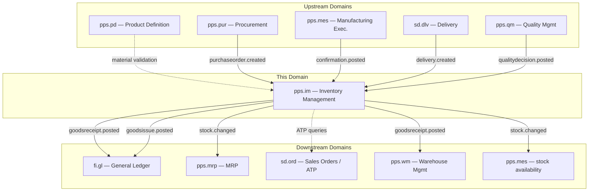
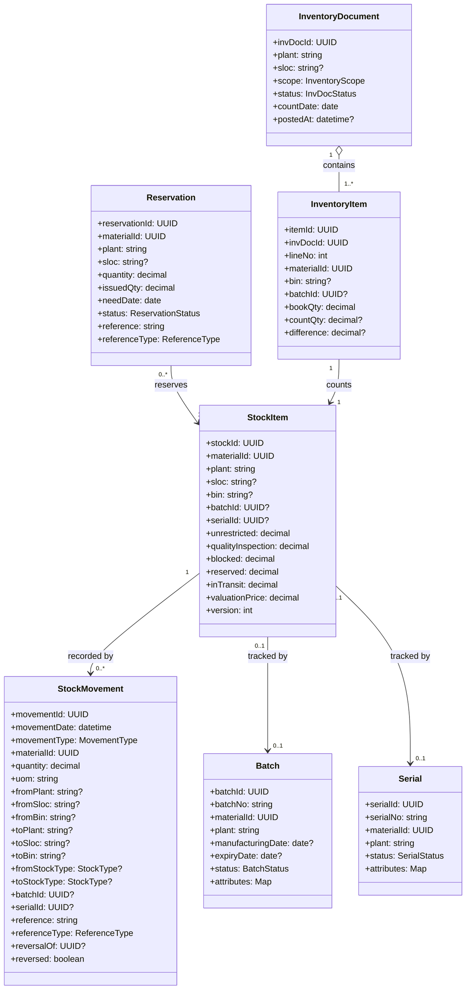
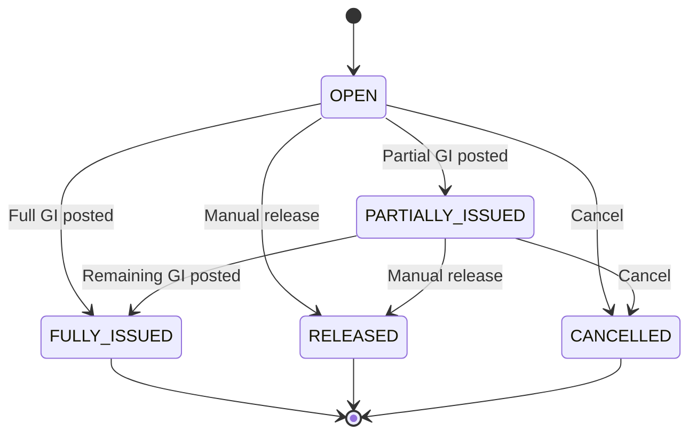
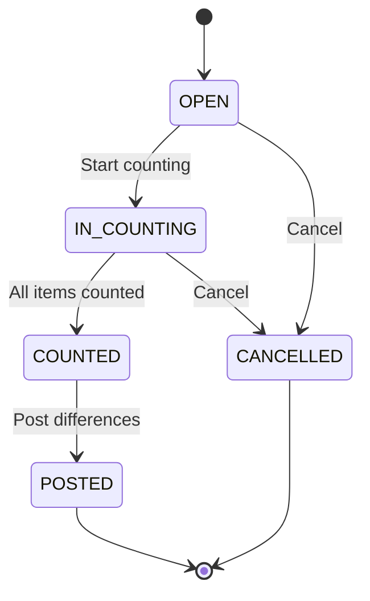
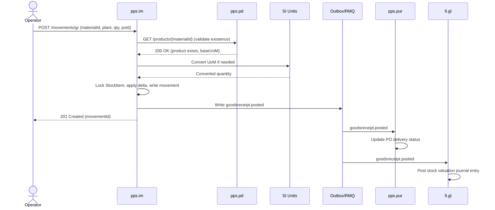
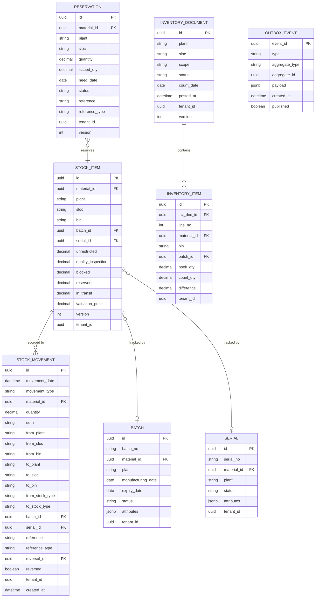

# PPS.IM - Inventory Management Domain / Service Specification

> **Conceptual Stack Layer:** Domain / Service
> **Space:** Platform
> **Owner:** Domain Engineering Team
> **Schema alignment:** `service-layer.schema.json`
> **Companion files:** `openapi.yaml`, `*.schema.json` (event contracts)
> **Referenced by:** Platform-Feature Spec SS5 (backend dependencies), BFF Contract
> **Belongs to:** PPS Suite Spec (`_pps_suite.md`)

> **Meta Information**
> - **Version:** 2026-04-03
> - **Template:** `domain-service-spec.md` v1.0.0
> - **Template Compliance:** ~95%
> - **Author(s):** OpenLeap Architecture Team
> - **Status:** DRAFT
> - **Suite:** `pps`
> - **Domain:** `im`
> - **Bounded Context Ref:** `bc:inventory`
> - **Service ID:** `pps-im-svc`
> - **basePackage:** `io.openleap.pps.im`
> - **API Base Path:** `/api/pps/im/v1`
> - **OpenLeap Starter Version:** `v1.0.0`
> - **Port:** OPEN QUESTION
> - **Repository:** OPEN QUESTION
> - **Tags:** `pps`, `im`, `inventory`, `logistics`, `stock`, `movement`
> - **Team:**
>   - Name: `team-pps`
>   - Email: `pps-team@openleap.io`
>   - Slack: `#pps-team`

---

## Specification Guidelines Compliance

>
> ### Non-Negotiables
> - Never invent facts. If required info is missing, add an **OPEN QUESTION** entry.
> - Preserve intent and decisions. Only change meaning when explicitly requested.
> - Do not remove normative constraints unless they are explicitly replaced.
> - Keep the spec **self-contained**: no "see chat", no implicit context.
>
> ### Source of Truth Priority
> When sources conflict:
> 1. Spec (explicit) wins
> 2. Starter specs (implementation constraints) next
> 3. Guidelines (best practices) last
>
> ### Style Guide
> - Prefer short sentences and lists.
> - Use MUST/SHOULD/MAY for normative statements.
> - Keep terminology consistent (Aggregate, Domain Service, Application Service, Command, Event).
> - Avoid ambiguous words ("often", "maybe") unless explicitly noting uncertainty.

---

## 0. Document Purpose & Scope

### 0.1 Purpose
This specification defines the Inventory Management domain, which maintains the authoritative stock ledger across plants, storage locations, and bins. It processes all goods movements (receipt, issue, transfer, adjustment), manages reservations and batch/serial traceability, and conducts physical inventory counts. IM is the single source of truth for the question "how much stock do we have?"

### 0.2 Target Audience
- Product Owners & Business Stakeholders
- System Architects & Technical Leads
- Integration Engineers

### 0.3 Scope
**In Scope:**
- Stock master data per (material, plant, storage location, bin, batch, serial)
- Stock types: unrestricted, quality inspection, blocked, reserved, in transit
- Goods Receipt (GR) against PO, MO, or free
- Goods Issue (GI) against MO, SO, cost center, or free
- Transfer Posting (location change, stock type change)
- Stock Transfer (plant-to-plant, including in-transit)
- Reservations and allocations
- Batch management (lot tracking, expiry, attributes)
- Serial number management
- Physical inventory (annual count, cycle count, ad-hoc)
- Available-to-Promise (ATP) queries
- Movement valuation reference (price passed to FI, not owned by IM)

**Out of Scope:**
- Physical warehouse operations: picking, putaway, waves, bin optimization (WM -- `pps.wm`)
- Product master data maintenance (PD -- `pps.pd`)
- Purchase order lifecycle (PUR -- `pps.pur`)
- Manufacturing order execution (MES -- `pps.mes`)
- Financial valuation and GL postings (FI -- `fi.gl`)
- Material requirements planning (MRP -- `pps.mrp`)
- Quality inspection execution (QM -- `pps.qm`)

### 0.4 Related Documents
- `_pps_suite.md` - PPS Suite overview
- [system-topology.md](https://github.com/openleap-io/io.openleap.dev.hub/blob/main/architecture/system-topology.md) - Platform architecture overview
- `PD_product_definition.md` - Product Definition spec
- `PUR_procurement.md` - Procurement spec
- `MES_execution.md` - Manufacturing Execution spec
- `WM_warehouse.md` - Warehouse Management spec
- `DOMAIN_SPEC_TEMPLATE.md` - Template reference
- `_fi_suite.md` - Financial Accounting Suite

---

## 1. Business Context

### 1.1 Domain Purpose
Inventory Management provides a single, accurate, and auditable record of all material quantities in the enterprise. Every physical movement of goods -- whether receiving from a supplier, issuing to production, transferring between locations, or adjusting after a count -- is recorded as an immutable stock movement in IM. Downstream systems (FI for valuation, MRP for planning, SD for availability) rely on IM as the authoritative stock ledger.

### 1.2 Business Value
- **Accuracy:** Single source of truth for stock quantities prevents over-selling, production shortages, and financial discrepancies
- **Traceability:** Full audit trail from source document to current stock position via append-only movement ledger
- **Compliance:** Batch/serial tracking for regulated industries (pharma, food, aerospace)
- **Efficiency:** Real-time ATP enables reliable order promising; reservation system prevents double-allocation
- **Financial Integrity:** Every movement produces an event consumed by FI for accurate inventory valuation

### 1.3 Key Stakeholders
| Role | Responsibility | Primary Use Cases |
|------|----------------|-------------------|
| Warehouse Operator | Execute goods movements | Post GR, GI, transfers; perform counts |
| Production Planner | Plan material availability | Query stock, manage reservations |
| Procurement Specialist | Verify receipt of purchased goods | Post GR against PO |
| Quality Inspector | Manage quality stock decisions | View quality stock, stock type transfers |
| Finance Controller | Ensure accurate inventory valuation | Consume movement events for GL postings |
| Plant Manager | Oversee inventory accuracy | Monitor KPIs, approve inventory adjustments |

### 1.4 Strategic Positioning



### 1.5 Service Context

| Property | Value |
|----------|-------|
| **Suite** | `pps` |
| **Domain** | `im` |
| **Bounded Context** | `bc:inventory` |
| **Service ID** | `pps-im-svc` |
| **Base Package** | `io.openleap.pps.im` |
| **Authoritative Sources** | PPS Suite Spec (`_pps_suite.md`), SAP MM / WM module patterns |

---

## 2. Service Identity

| Field | Value |
|-------|-------|
| **Service ID** | `pps-im-svc` |
| **Display Name** | Inventory Management Service |
| **Suite** | `pps` |
| **Domain** | `im` |
| **Bounded Context Ref** | `bc:inventory` |
| **Version** | 2026-04-03 |
| **Status** | DRAFT |
| **API Base Path** | `/api/pps/im/v1` |
| **Repository** | OPEN QUESTION |
| **Tags** | `pps`, `im`, `inventory`, `logistics`, `stock`, `movement` |
| **Team Name** | `team-pps` |
| **Team Email** | `pps-team@openleap.io` |
| **Team Slack** | `#pps-team` |

---

## 3. Domain Model

### 3.1 Conceptual Overview
IM manages stock as a set of **StockItem** records keyed by a composite of (material, plant, storage location, bin, batch, serial). Every change to stock is recorded as an immutable **StockMovement** in an append-only ledger. The current StockItem quantities are a projection of all movements. **Reservations** earmark stock for future consumption. **InventoryDocuments** drive the physical counting process. **Batch** and **Serial** provide traceability.

### 3.2 Core Concepts



### 3.3 Enumerations

| Enum | Values | Description |
|------|--------|-------------|
| MovementType | `GR` (Goods Receipt), `GI` (Goods Issue), `TRANSFER`, `ADJUSTMENT`, `RETURN`, `SCRAP` | Classification of stock movement |
| StockType | `UNRESTRICTED`, `QUALITY_INSPECTION`, `BLOCKED`, `IN_TRANSIT` | Quality-based stock segmentation |
| ReferenceType | `PURCHASE_ORDER`, `MANUFACTURING_ORDER`, `SALES_ORDER`, `COST_CENTER`, `INVENTORY_DOC`, `TRANSFER_ORDER`, `NONE` | Source document type |
| ReservationStatus | `OPEN`, `PARTIALLY_ISSUED`, `FULLY_ISSUED`, `RELEASED`, `CANCELLED` | Reservation lifecycle |
| InvDocStatus | `OPEN`, `IN_COUNTING`, `COUNTED`, `POSTED`, `CANCELLED` | Physical inventory lifecycle |
| InventoryScope | `FULL`, `CYCLE_COUNT`, `AD_HOC` | Physical inventory scope |
| BatchStatus | `ACTIVE`, `RESTRICTED`, `EXPIRED`, `BLOCKED` | Batch lifecycle |
| SerialStatus | `AVAILABLE`, `INSTALLED`, `IN_REPAIR`, `SCRAPPED` | Serial lifecycle |

### 3.4 Aggregate Definitions

#### 3.4.1 Aggregate: StockItem

**Aggregate ID:** `agg:stock-item`
**Business Purpose:** Represents the current quantity of a specific material at a specific location, optionally down to batch/serial level. This is the core "stock position" record.

**Aggregate Root Attributes:**

| Attribute | Type | Format | Required | Description | Example | Constraints |
|-----------|------|--------|----------|-------------|---------|-------------|
| stockId | UUID | uuid | Yes | Unique identifier | `si-uuid` | PK, immutable |
| materialId | UUID | uuid | Yes | Reference to PD product | `mat-uuid` | Required, must exist in PD |
| plant | String | text | Yes | Plant code | `P100` | Max 10 chars |
| sloc | String | text | No | Storage location | `SL01` | Max 10 chars |
| bin | String | text | No | Storage bin | `A-01-03` | Max 20 chars |
| batchId | UUID | uuid | Cond. | Batch reference | `bat-uuid` | Required if material is batch-managed |
| serialId | UUID | uuid | Cond. | Serial reference | `ser-uuid` | Required if material is serial-managed |
| unrestricted | Decimal | (18,4) | Yes | Freely usable quantity | `500.0000` | >= 0 |
| qualityInspection | Decimal | (18,4) | Yes | In QI quantity | `0.0000` | >= 0 |
| blocked | Decimal | (18,4) | Yes | Blocked quantity | `0.0000` | >= 0 |
| reserved | Decimal | (18,4) | Yes | Reserved quantity | `120.0000` | >= 0, <= unrestricted |
| inTransit | Decimal | (18,4) | Yes | In-transit quantity | `0.0000` | >= 0 |
| valuationPrice | Decimal | (18,4) | Yes | Current valuation price per unit | `12.5000` | >= 0 |
| version | Integer | int | Yes | Optimistic locking | `14` | Auto-increment |

**Invariants:**
- INV-SI-001: No stock type quantity may become negative after a movement posting (BR-001)
- INV-SI-002: `reserved` MUST NOT exceed `unrestricted` (BR-004)
- INV-SI-003: The combination (materialId, plant, sloc, bin, batchId, serialId) is unique per tenant
- INV-SI-004: If serialId is set, all stock type quantities must be 0 or 1 (BR-008)

**Domain Events Emitted:**

| Event | Routing Key | When | Key Payload |
|-------|-------------|------|-------------|
| StockChanged | `pps.im.stock.changed` | Any movement posting | materialId, plant, sloc, unrestricted, available |

#### 3.4.2 Aggregate: StockMovement

**Aggregate ID:** `agg:stock-movement`
**Business Purpose:** Immutable, append-only record of a single inventory change. The full history of StockMovements for a given StockItem, when replayed, yields the current stock position.

**Aggregate Root Attributes:**

| Attribute | Type | Format | Required | Description | Example | Constraints |
|-----------|------|--------|----------|-------------|---------|-------------|
| movementId | UUID | uuid | Yes | Unique identifier | `mv-uuid` | PK, immutable |
| movementDate | Datetime | ISO 8601 | Yes | Business date/time of movement | `2026-02-23T10:00:00Z` | Required |
| movementType | Enum | MovementType | Yes | GR, GI, TRANSFER, ADJUSTMENT, RETURN, SCRAP | `GR` | Required |
| materialId | UUID | uuid | Yes | Material moved | `mat-uuid` | Required |
| quantity | Decimal | (18,4) | Yes | Quantity moved (always positive) | `100.0000` | > 0 |
| uom | String | UCUM | Yes | Unit of measure | `KG` | Valid SI code |
| reference | String | text | Cond. | Source document ID | `PO-4500012345` | Required for GR/GI |
| referenceType | Enum | ReferenceType | Yes | Type of source document | `PURCHASE_ORDER` | Required |
| reversalOf | UUID | uuid | No | Points to original movement if reversal | `orig-uuid` | Optional |
| reversed | Boolean | boolean | Yes | Whether this movement has been reversed | `false` | Default false |

**Invariants:**
- INV-SM-001: StockMovement records are never updated or deleted. Corrections via reversal movements (BR-005)
- INV-SM-002: GR must reference a PO or MO (unless free receipt). GI must reference an MO, SO, cost center, or reservation (BR-002)
- INV-SM-003: A reversal movement must set `reversalOf` to the original movementId, and the original `reversed` flag is set to true

**Domain Events Emitted:**

| Event | Routing Key | When | Key Payload |
|-------|-------------|------|-------------|
| GoodsReceiptPosted | `pps.im.goodsreceipt.posted` | GR movement posted | movementId, materialId, plant, quantity, reference |
| GoodsIssuePosted | `pps.im.goodsissue.posted` | GI movement posted | movementId, materialId, plant, quantity, reference |
| TransferPosted | `pps.im.transfer.posted` | Transfer movement posted | movementId, materialId, fromPlant, toPlant |
| InventoryAdjusted | `pps.im.inventory.adjusted` | Adjustment movement posted | movementId, materialId, plant, quantity |

#### 3.4.3 Aggregate: Reservation

**Aggregate ID:** `agg:reservation`
**Business Purpose:** Earmarks a quantity of unrestricted stock for a future goods issue. Prevents double-allocation of the same stock to multiple demands.

**Lifecycle States:**


**Invariants:**
- INV-RES-001: On creation, `reserved + requested_qty <= unrestricted` must hold (BR-004)
- INV-RES-002: When a GI consumes a reservation, oldest matching reservation is consumed first (BR-003)
- INV-RES-003: Reservations past their `needDate` + configurable grace period may be auto-released

**Domain Events Emitted:**

| Event | Routing Key | When | Key Payload |
|-------|-------------|------|-------------|
| ReservationChanged | `pps.im.reservation.changed` | Creation, consumption, release, or cancellation | reservationId, materialId, status |

#### 3.4.4 Aggregate: InventoryDocument

**Aggregate ID:** `agg:inventory-document`
**Business Purpose:** Drives the physical inventory counting process. Contains a set of InventoryItems to be counted. After counting, differences are computed and posted as adjustment movements.

**Lifecycle States:**


**Invariants:**
- INV-ID-001: While an InventoryDocument is IN_COUNTING for a given material/location, no GR/GI/Transfer is allowed for that combination (BR-009)
- INV-ID-002: Adjustments exceeding a configurable threshold require manager approval before posting (BR-010)
- INV-ID-003: Items can only be added while status is OPEN

#### 3.4.5 Entity: Batch (child of StockItem)

**Business Purpose:** Tracks a production lot or vendor lot. Carries attributes like manufacturing date, expiry date, country of origin, and custom attributes for regulatory traceability.

**Invariants:**
- INV-BAT-001: `batchNo` is unique per (materialId, plant) per tenant
- INV-BAT-002: Material with expired batches cannot be issued from unrestricted stock without override (BR-012)
- INV-BAT-003: System recommends FEFO (First Expiry, First Out) order for goods issue (BR-007)

#### 3.4.6 Entity: Serial (child of StockItem)

**Business Purpose:** Tracks an individual unit through its lifecycle. Used for high-value or regulated items requiring unit-level traceability.

**Invariants:**
- INV-SER-001: `serialNo` is unique per (materialId) per tenant
- INV-SER-002: A serial item's stock quantity is always 0 or 1 per stock type (BR-008)
- INV-SER-003: Serial status changes are logged for full audit trail

---

## 4. Business Rules & Constraints

### 4.1 Business Rules Catalog

| ID | Rule Name | Description | Scope | Enforcement | Error Code |
|----|-----------|-------------|-------|-------------|------------|
| BR-001 | No Negative Stock | No stock type quantity may become negative | StockItem | Every movement posting | `IM-BIZ-001` |
| BR-002 | Reference Required | GR/GI must reference a source document (PO, MO, SO, CC) unless flagged free | StockMovement | On posting | `IM-VAL-002` |
| BR-003 | Reservation FIFO | When GI consumes a reservation, oldest matching reservation is consumed first | Reservation | On GI with reservation | `IM-BIZ-003` |
| BR-004 | Reservation Cap | Reserved qty cannot exceed unrestricted qty | StockItem | On reservation create/update | `IM-BIZ-004` |
| BR-005 | Movement Immutability | StockMovements are never updated or deleted; corrections via reversal | StockMovement | Always | `IM-BIZ-005` |
| BR-006 | Batch/Serial Required | If material profile requires batch or serial, movements must provide them | StockMovement | On posting | `IM-VAL-006` |
| BR-007 | Batch FEFO | System recommends First-Expiry-First-Out order for GI batch selection | Batch | On GI (advisory) | n/a |
| BR-008 | Serial Unit Quantity | Serial-managed items have quantity 0 or 1 per stock type | StockItem | Every movement | `IM-BIZ-008` |
| BR-009 | Count Freeze | During physical inventory counting, no movements for in-scope materials | StockItem | While InvDoc is IN_COUNTING | `IM-BIZ-009` |
| BR-010 | Adjustment Threshold | Large adjustments require approval before posting | InventoryDocument | On post differences | `IM-BIZ-010` |
| BR-011 | Over-Delivery Tolerance | GR quantity exceeding PO qty beyond tolerance percentage is rejected | StockMovement | On GR against PO | `IM-BIZ-011` |
| BR-012 | Expired Batch Block | Expired batches cannot be issued from unrestricted without override | Batch/GI | On GI | `IM-BIZ-012` |

### 4.2 Detailed Rule Definitions

#### BR-001: No Negative Stock
**Context:** Physical stock cannot be negative. All inventory systems enforce this to maintain data integrity.
**Rule Statement:** After any movement posting, no stock type quantity (unrestricted, qualityInspection, blocked, inTransit) on the affected StockItem may be less than zero.
**Applies To:** StockItem aggregate
**Enforcement:** On every movement posting (GI, transfer, adjustment)
**Validation Logic:** `if (stockItem.unrestricted - movementQty < 0) throw InsufficientStockException`
**Error Handling:**
- Code: `IM-BIZ-001`
- Message: `"Insufficient stock for material {materialId} at plant {plant}. Available: {available}, Requested: {quantity}"`
- HTTP: 422 Unprocessable Entity

#### BR-005: Movement Immutability
**Context:** Audit trail integrity requires that posted movements never change. Industry best practice (SAP Storno principle).
**Rule Statement:** StockMovement records are never updated or deleted. Corrections are posted as reversal movements.
**Applies To:** StockMovement aggregate
**Enforcement:** No UPDATE/DELETE operations exposed.
**Error Handling:**
- Code: `IM-BIZ-005`
- Message: `"Movement {movementId} cannot be modified. Use reversal to correct."`
- HTTP: 409 Conflict

### 4.3 Data Validation Rules

| Field | Validation Rule | Error Code | Error Message |
|-------|----------------|------------|---------------|
| materialId | Required, must exist in PD as Released | `IM-VAL-001` | `"Material not found or not released"` |
| plant | Required, max 10 chars, must be valid plant code | `IM-VAL-002` | `"Invalid plant code"` |
| quantity | Required, > 0 | `IM-VAL-003` | `"Quantity must be positive"` |
| uom | Required, valid UCUM code via SI service | `IM-VAL-004` | `"Invalid unit of measure"` |
| batchNo | Unique per (materialId, plant, tenant) | `IM-VAL-005` | `"Batch number already exists for this material and plant"` |
| serialNo | Unique per (materialId, tenant) | `IM-VAL-006` | `"Serial number already exists for this material"` |

**Cross-Field Validations:**
- For GR: `toPlant` and `toSloc` are required; `fromPlant`/`fromSloc` must be null
- For GI: `fromPlant` and `fromSloc` are required; `toPlant`/`toSloc` must be null
- For TRANSFER: both from and to locations are required
- `countQty` on InventoryItem must be >= 0

### 4.4 Reference Data Dependencies

| Catalog | Usage | Provider Service | Validation |
|---------|-------|-----------------|------------|
| Plants | plant field | ref-svc (T1) | Must exist in REF as active plant |
| Storage Locations | sloc field | ref-svc (T1) | Must exist under given plant |
| Units of Measure (UCUM) | uom field, conversions | si-svc (T1) | Must be valid via SI service |
| Movement Type Codes | movementType | Internal | Internal enum |
| Material Master | materialId | pps-pd-svc (T3) | Must exist in PD as Released |

---

## 5. Use Cases

### 5.1 Business Logic Placement

| Layer | Responsibilities |
|-------|-----------------|
| Application Service | Command validation, aggregate loading, event publishing, orchestration (reversal workflow) |
| Domain Service | ATP calculation (cross-aggregate), reservation FIFO logic, posting freeze enforcement |
| Aggregate | State transitions, invariant enforcement, attribute validation |

### 5.2 Use Cases

#### UC-IM-001: Post Goods Receipt (GR)

| Field | Value |
|-------|-------|
| **ID** | UC-IM-001 |
| **Type** | WRITE |
| **Trigger** | REST / Event (pps.pur.purchaseorder.created, pps.mes.confirmation.posted) |
| **Aggregate** | StockItem, StockMovement |
| **Domain Operation** | `StockItem.applyGoodsReceipt(movement)` |
| **Inputs** | materialId, plant, sloc, bin?, quantity, uom, referenceType, reference, batchNo?, serialNo?, targetStockType?, movementDate |
| **Outputs** | StockMovement created, StockItem quantities updated |
| **Events** | `GoodsReceiptPosted` -> `pps.im.goodsreceipt.posted`, `StockChanged` -> `pps.im.stock.changed` |
| **REST** | `POST /api/pps/im/v1/movements/gr` -> 201 Created |
| **Idempotency** | Client-generated `Idempotency-Key` header |
| **Errors** | 404 (material not found), 409 (idempotency conflict), 422 (BR-001 insufficient stock, BR-002 missing reference, BR-006 batch/serial required, BR-011 over-delivery) |

**Preconditions:**
- Material exists in PD and is Released
- Reference document exists (PO in PUR or MO in MES) -- unless free receipt
- If batch-managed: batch exists or is auto-created
- If serial-managed: serial exists or is provided

**Postconditions:**
- StockItem quantities updated
- StockMovement appended to ledger
- Event `pps.im.goodsreceipt.posted` published
- PUR receives event -> updates PO delivery status
- QM receives event -> creates inspection lot (if applicable)
- FI.GL receives event -> posts stock valuation

**Alternative Flows:**
- **GR to Quality:** If material requires quality inspection, stock is posted to `QUALITY_INSPECTION` type instead of `UNRESTRICTED`
- **Over-Delivery:** If received quantity exceeds PO quantity beyond tolerance, system rejects or requires override

#### UC-IM-002: Post Goods Issue (GI)

| Field | Value |
|-------|-------|
| **ID** | UC-IM-002 |
| **Type** | WRITE |
| **Trigger** | REST / Event (pps.mes.confirmation.posted, sd.dlv.delivery.goodsissued) |
| **Aggregate** | StockItem, StockMovement, Reservation |
| **Domain Operation** | `StockItem.applyGoodsIssue(movement)` |
| **Inputs** | materialId, plant, sloc, quantity, uom, referenceType, reference, reservationId?, batchNo?, movementDate |
| **Outputs** | StockMovement created, StockItem quantities reduced |
| **Events** | `GoodsIssuePosted` -> `pps.im.goodsissue.posted`, `StockChanged` -> `pps.im.stock.changed` |
| **REST** | `POST /api/pps/im/v1/movements/gi` -> 201 Created |
| **Idempotency** | Client-generated `Idempotency-Key` header |
| **Errors** | 422 (BR-001 insufficient stock `IM_INSUFFICIENT_STOCK`, BR-006 batch required, BR-012 expired batch `IM_BATCH_EXPIRED`) |

**Postconditions:**
- Stock reduced, movement recorded, event published
- FI.GL consumes event for COGS / consumption posting
- If reservation referenced: reservation `issuedQty` incremented, status transitions

#### UC-IM-003: Transfer Posting

| Field | Value |
|-------|-------|
| **ID** | UC-IM-003 |
| **Type** | WRITE |
| **Trigger** | REST |
| **Aggregate** | StockItem (source + target), StockMovement |
| **Domain Operation** | `StockItem.applyTransfer(movement)` |
| **Inputs** | materialId, fromPlant, fromSloc, fromBin?, toPlant, toSloc, toBin?, quantity, uom, fromStockType?, toStockType?, batchNo?, movementDate |
| **Outputs** | Two StockMovement records (issue from source, receipt at target), both StockItems updated |
| **Events** | `TransferPosted` -> `pps.im.transfer.posted`, `StockChanged` -> `pps.im.stock.changed` |
| **REST** | `POST /api/pps/im/v1/movements/transfer` -> 201 Created |
| **Idempotency** | Client-generated `Idempotency-Key` header |
| **Errors** | 422 (BR-001 insufficient source stock, BR-009 count freeze active) |

**Variants:**
- **Location Transfer:** Same plant, different sloc/bin
- **Stock Type Transfer:** Same location, different stock type (e.g., quality -> unrestricted after QM approval)
- **Plant Transfer (2-step):** GI from plant A (creates in-transit), GR at plant B (clears in-transit)

#### UC-IM-004: Physical Inventory Count

| Field | Value |
|-------|-------|
| **ID** | UC-IM-004 |
| **Type** | WRITE |
| **Trigger** | REST |
| **Aggregate** | InventoryDocument, StockItem, StockMovement |
| **Domain Operation** | `InventoryDocument.create()`, `InventoryDocument.startCounting()`, `InventoryDocument.recordCount()`, `InventoryDocument.post()` |
| **Inputs** | plant, sloc?, scope, materialFilter?, countData[] |
| **Outputs** | InventoryDocument with counted items, adjustment movements for differences |
| **Events** | `InventoryAdjusted` -> `pps.im.inventory.adjusted` |
| **REST** | `POST /api/pps/im/v1/inventory-docs` -> 201; `POST .../start-counting` -> 200; `POST .../items/{id}/count` -> 200; `POST .../post` -> 200 |
| **Idempotency** | Idempotent (re-post of POSTED is no-op) |
| **Errors** | 409 (invalid state transition), 422 (BR-010 adjustment threshold requires approval) |

#### UC-IM-005: Create / Consume Reservation

| Field | Value |
|-------|-------|
| **ID** | UC-IM-005 |
| **Type** | WRITE |
| **Trigger** | REST / Event (MRP, MES) |
| **Aggregate** | Reservation, StockItem |
| **Domain Operation** | `Reservation.create()`, consumed via `StockItem.applyGoodsIssue()` |
| **Inputs** | materialId, plant, quantity, needDate, referenceType, reference |
| **Outputs** | Reservation in OPEN state, StockItem.reserved increased |
| **Events** | `ReservationChanged` -> `pps.im.reservation.changed` |
| **REST** | `POST /api/pps/im/v1/reservations` -> 201 Created |
| **Idempotency** | Idempotency-Key header |
| **Errors** | 422 (BR-004 insufficient unrestricted stock for reservation) |

#### UC-IM-006: ATP Query

| Field | Value |
|-------|-------|
| **ID** | UC-IM-006 |
| **Type** | READ |
| **Trigger** | REST (synchronous from SD.ord, MRP) |
| **Aggregate** | StockItem (read projection) |
| **Domain Operation** | Query: `unrestricted - reserved + expected_receipts - expected_issues` |
| **Inputs** | materialId, plant, date? |
| **Outputs** | Available quantity, earliest availability date |
| **Events** | -- |
| **REST** | `GET /api/pps/im/v1/stock/atp?materialId={id}&plant={code}&date={date}` -> 200 OK |
| **Idempotency** | Inherently idempotent (GET) |
| **Errors** | 400 (invalid params), 404 (material not found) |

#### UC-IM-007: Query Stock Positions (READ)

| Field | Value |
|-------|-------|
| **ID** | UC-IM-007 |
| **Type** | READ |
| **Trigger** | REST |
| **Aggregate** | StockItem (read projection) |
| **Domain Operation** | Query projection |
| **Inputs** | materialId?, plant?, sloc?, bin?, batchNo?, stockType?, nonZeroOnly?, page, size |
| **Outputs** | Paginated stock position list |
| **Events** | -- |
| **REST** | `GET /api/pps/im/v1/stock?...` -> 200 OK |
| **Idempotency** | Inherently idempotent (GET) |
| **Errors** | 400 (invalid filter params) |

#### UC-IM-008: Reverse Movement

| Field | Value |
|-------|-------|
| **ID** | UC-IM-008 |
| **Type** | WRITE |
| **Trigger** | REST |
| **Aggregate** | StockMovement, StockItem |
| **Domain Operation** | `StockMovement.createReversal(originalId)` |
| **Inputs** | movementId, reason, reversalDate |
| **Outputs** | Reversal movement created, original marked as reversed, StockItem updated |
| **Events** | Corresponding movement event (GR/GI/Transfer reversal) + `StockChanged` |
| **REST** | `POST /api/pps/im/v1/movements/{movementId}/reverse` -> 201 Created |
| **Idempotency** | Idempotency-Key header |
| **Errors** | 404 (movement not found), 409 (already reversed), 422 (BR-001 reversal would cause negative stock) |

### 5.3 Process Flow Diagrams



### 5.4 Cross-Domain Workflows

**Does this domain participate in multi-service workflows?** Yes

#### Workflow: Procure-to-Stock

**Business Purpose:** Receive purchased goods into inventory and update procurement status and financial valuation.

**Orchestration Pattern:** Choreography (EDA)

**Pattern Rationale:** Each domain reacts independently to IM's `goodsreceipt.posted` event. No central coordinator needed -- PUR updates PO status, QM creates inspection lot, FI posts valuation, each independently.

**Participating Services:**
| Service | Role | Responsibilities |
|---------|------|------------------|
| pps.pur | Trigger source | PO provides reference for GR |
| pps.im | Event producer | Posts GR, publishes event |
| pps.qm | Consumer | Creates inspection lot if required |
| fi.gl | Consumer | Posts stock valuation |

#### Workflow: Produce-to-Stock

**Business Purpose:** Receive finished goods from production into inventory and consume components.

**Orchestration Pattern:** Choreography (EDA)

**Participating Services:**
| Service | Role | Responsibilities |
|---------|------|------------------|
| pps.mes | Trigger source | Confirmation triggers component GI and yield GR |
| pps.im | Event producer | Posts GI (components) and GR (yield), publishes events |
| fi.gl | Consumer | Posts WIP clearing |

---

## 6. REST API

### 6.1 API Overview

| Field | Value |
|-------|-------|
| Base Path | `/api/pps/im/v1` |
| Authentication | OAuth2/JWT (Bearer token) |
| Authorization | Scopes: `pps.im:read`, `pps.im:write`, `pps.im:admin` |
| Content Type | `application/json` |
| Versioning | URL path (`v1`) |

### 6.2 Resource Operations

#### 6.2.1 Stock -- Query

```http
GET /api/pps/im/v1/stock?materialId={id}&plant={code}&sloc={code}&bin={code}&batchNo={no}&page=0&size=50
Authorization: Bearer {token}
```

**Query Parameters:**
| Parameter | Type | Description | Default |
|-----------|------|-------------|---------|
| materialId | UUID | Filter by material | (all) |
| plant | string | Filter by plant | (all) |
| sloc | string | Filter by storage location | (all) |
| bin | string | Filter by bin | (all) |
| batchNo | string | Filter by batch number | (all) |
| stockType | string | Filter by stock type (UNRESTRICTED, QUALITY, BLOCKED) | (all) |
| nonZeroOnly | boolean | Exclude zero-stock positions | false |
| page | integer | Page number (0-based) | 0 |
| size | integer | Page size (max 200) | 50 |

**Success Response:** `200 OK`
```json
{
  "content": [
    {
      "stockId": "uuid",
      "materialId": "uuid",
      "materialNo": "MAT-001",
      "plant": "P100",
      "sloc": "SL01",
      "bin": "A-01-03",
      "batchNo": "B2026-001",
      "unrestricted": 500.000,
      "qualityInspection": 0.000,
      "blocked": 0.000,
      "reserved": 120.000,
      "inTransit": 0.000,
      "available": 380.000,
      "uom": "KG",
      "valuationPrice": 12.50,
      "version": 14
    }
  ],
  "page": { "size": 50, "totalElements": 235, "totalPages": 5, "number": 0 }
}
```

#### 6.2.2 Stock -- ATP Query

```http
GET /api/pps/im/v1/stock/atp?materialId={id}&plant={code}&date={date}
Authorization: Bearer {token}
```

**Success Response:** `200 OK`
```json
{
  "materialId": "uuid",
  "plant": "P100",
  "asOfDate": "2026-03-01",
  "currentUnrestricted": 500.000,
  "currentReserved": 120.000,
  "expectedReceipts": 200.000,
  "expectedIssues": 80.000,
  "availableToPromise": 500.000,
  "uom": "KG"
}
```

#### 6.2.3 Movements -- Post Goods Receipt

```http
POST /api/pps/im/v1/movements/gr
Authorization: Bearer {token}
Content-Type: application/json
Idempotency-Key: {uuid}
```

**Request Body:**
```json
{
  "materialId": "uuid",
  "plant": "P100",
  "sloc": "SL01",
  "bin": "A-01-03",
  "quantity": 100.000,
  "uom": "KG",
  "referenceType": "PURCHASE_ORDER",
  "reference": "PO-4500012345",
  "referenceItem": 10,
  "batchNo": "B2026-001",
  "targetStockType": "UNRESTRICTED",
  "movementDate": "2026-02-23T10:00:00Z",
  "note": "Delivery note DN-123"
}
```

**Success Response:** `201 Created`
```json
{
  "movementId": "uuid",
  "movementType": "GR",
  "materialId": "uuid",
  "plant": "P100",
  "sloc": "SL01",
  "quantity": 100.000,
  "uom": "KG",
  "reference": "PO-4500012345",
  "stockAfter": {
    "unrestricted": 600.000,
    "qualityInspection": 0.000,
    "blocked": 0.000
  },
  "createdAt": "2026-02-23T10:00:01Z"
}
```

**Error Responses:**
- `400 Bad Request` -- Validation error
- `404 Not Found` -- Material not found in PD
- `409 Conflict` -- Idempotency key already processed
- `422 Unprocessable Entity` -- Business rule violation (e.g., PO fully received, batch required)

#### 6.2.4 Movements -- Post Goods Issue

```http
POST /api/pps/im/v1/movements/gi
Authorization: Bearer {token}
Content-Type: application/json
Idempotency-Key: {uuid}
```

**Request Body:**
```json
{
  "materialId": "uuid",
  "plant": "P100",
  "sloc": "SL01",
  "quantity": 50.000,
  "uom": "KG",
  "referenceType": "MANUFACTURING_ORDER",
  "reference": "MO-100200",
  "reservationId": "uuid",
  "batchNo": "B2026-001",
  "movementDate": "2026-02-23T14:00:00Z"
}
```

**Success Response:** `201 Created`

**Error Responses:**
- `422 Unprocessable Entity` -- Insufficient stock (`IM_INSUFFICIENT_STOCK`), expired batch (`IM_BATCH_EXPIRED`)

#### 6.2.5 Movements -- Transfer Posting

```http
POST /api/pps/im/v1/movements/transfer
Authorization: Bearer {token}
Content-Type: application/json
Idempotency-Key: {uuid}
```

**Request Body:**
```json
{
  "materialId": "uuid",
  "fromPlant": "P100",
  "fromSloc": "SL01",
  "fromBin": "A-01-03",
  "toPlant": "P100",
  "toSloc": "SL02",
  "toBin": "B-05-01",
  "quantity": 20.000,
  "uom": "KG",
  "fromStockType": "QUALITY_INSPECTION",
  "toStockType": "UNRESTRICTED",
  "batchNo": "B2026-001",
  "movementDate": "2026-02-23T15:00:00Z"
}
```

#### 6.2.6 Movements -- Post Adjustment

```http
POST /api/pps/im/v1/movements/adjustment
Authorization: Bearer {token}
Content-Type: application/json
```

**Request Body:**
```json
{
  "materialId": "uuid",
  "plant": "P100",
  "sloc": "SL01",
  "quantity": -5.000,
  "uom": "KG",
  "referenceType": "INVENTORY_DOC",
  "reference": "INV-2026-001",
  "reason": "Cycle count difference",
  "movementDate": "2026-02-23T16:00:00Z"
}
```

#### 6.2.7 Movements -- Reversal

```http
POST /api/pps/im/v1/movements/{movementId}/reverse
Authorization: Bearer {token}
Content-Type: application/json
```

**Request Body:**
```json
{
  "reason": "Incorrect quantity posted",
  "reversalDate": "2026-02-23T17:00:00Z"
}
```

#### 6.2.8 Movements -- List / Search

```http
GET /api/pps/im/v1/movements?materialId={id}&plant={code}&movementType={type}&dateFrom={date}&dateTo={date}&page=0&size=50
Authorization: Bearer {token}
```

### 6.3 Business Operations

#### 6.3.1 Reservations

```http
POST   /api/pps/im/v1/reservations
GET    /api/pps/im/v1/reservations?materialId={id}&status={status}&page=0&size=50
GET    /api/pps/im/v1/reservations/{reservationId}
POST   /api/pps/im/v1/reservations/{reservationId}/release
POST   /api/pps/im/v1/reservations/{reservationId}/cancel
```

#### 6.3.2 Physical Inventory

```http
POST   /api/pps/im/v1/inventory-docs                              — Create document
GET    /api/pps/im/v1/inventory-docs?plant={code}&status={status}  — List documents
GET    /api/pps/im/v1/inventory-docs/{invDocId}                    — Get document with items
POST   /api/pps/im/v1/inventory-docs/{invDocId}/start-counting     — Transition to IN_COUNTING
POST   /api/pps/im/v1/inventory-docs/{invDocId}/items/{itemId}/count — Record count
POST   /api/pps/im/v1/inventory-docs/{invDocId}/complete-counting  — Transition to COUNTED
POST   /api/pps/im/v1/inventory-docs/{invDocId}/post               — Post differences as adjustments
POST   /api/pps/im/v1/inventory-docs/{invDocId}/cancel              — Cancel document
```

#### 6.3.3 Batches

```http
POST   /api/pps/im/v1/batches
GET    /api/pps/im/v1/batches?materialId={id}&plant={code}&status={status}
GET    /api/pps/im/v1/batches/{batchId}
PATCH  /api/pps/im/v1/batches/{batchId}   — Update attributes, expiry
```

#### 6.3.4 Serials

```http
POST   /api/pps/im/v1/serials
GET    /api/pps/im/v1/serials?materialId={id}&status={status}
GET    /api/pps/im/v1/serials/{serialId}
PATCH  /api/pps/im/v1/serials/{serialId}   — Update attributes, status
```

### 6.4 Error Responses

| HTTP Status | Error Code | Description |
|-------------|------------|-------------|
| 400 | `IM-VAL-*` | Validation error (field-level) |
| 401 | -- | Authentication required |
| 403 | -- | Forbidden (insufficient role) |
| 404 | -- | Resource not found |
| 409 | `IM-BIZ-005` | Conflict (idempotency, already reversed) |
| 412 | -- | Precondition failed (optimistic lock version mismatch) |
| 422 | `IM-BIZ-*` | Business rule violation |

### 6.5 OpenAPI Specification

**Location:** `contracts/http/pps/im/openapi.yaml`
**Version:** OpenAPI 3.1
**Documentation URL:** `https://api.openleap.io/docs/pps/im`

---

## 7. Events & Integration

### 7.1 Event-Driven Architecture Pattern

**Pattern Used:** Choreography (EDA)

**Pattern Rationale:** IM publishes facts about stock changes. Multiple consumers (FI, PUR, QM, MRP, MES, SD) react independently without central coordination. This is appropriate because each consumer's reaction is self-contained and does not require orchestrated rollback across consumers.

### 7.2 Published Events

**Exchange:** `pps.im.events` (topic, durable)

#### Event: goodsreceipt.posted

**Routing Key:** `pps.im.goodsreceipt.posted`

**Business Purpose:** Announces that material has been received into inventory.

**Payload Structure:**
```json
{
  "movementId": "uuid",
  "movementType": "GR",
  "materialId": "uuid",
  "materialNo": "MAT-001",
  "plant": "P100",
  "sloc": "SL01",
  "quantity": 100.000,
  "uom": "KG",
  "targetStockType": "UNRESTRICTED",
  "referenceType": "PURCHASE_ORDER",
  "reference": "PO-4500012345",
  "batchNo": "B2026-001",
  "valuationPrice": 12.50,
  "currency": "EUR",
  "movementDate": "2026-02-23T10:00:00Z"
}
```

**Event Envelope:**
```json
{
  "eventId": "uuid",
  "traceId": "string",
  "tenantId": "uuid",
  "occurredAt": "2026-02-23T10:00:01Z",
  "producer": "pps.im",
  "schemaRef": "https://schemas.openleap.io/pps/im/goodsreceipt-posted.schema.json",
  "payload": { "..." : "..." }
}
```

**Known Consumers:**
| Consumer Service | Purpose | Processing Type |
|-----------------|---------|-----------------|
| pps.pur | Update PO delivery status | Async/Immediate |
| pps.qm | Create inspection lot (if QM required) | Async/Immediate |
| fi.gl | Post stock valuation journal entry | Async/Immediate |
| pps.wm | Trigger putaway planning | Async/Immediate |
| T4 BI | Analytics ingestion | Async/Batch |

#### Event: goodsissue.posted

**Routing Key:** `pps.im.goodsissue.posted`

**Business Purpose:** Announces that material has been issued from inventory.

**Payload Structure:**
```json
{
  "movementId": "uuid",
  "movementType": "GI",
  "materialId": "uuid",
  "materialNo": "MAT-001",
  "plant": "P100",
  "sloc": "SL01",
  "quantity": 50.000,
  "uom": "KG",
  "sourceStockType": "UNRESTRICTED",
  "referenceType": "MANUFACTURING_ORDER",
  "reference": "MO-100200",
  "batchNo": "B2026-001",
  "valuationPrice": 12.50,
  "currency": "EUR",
  "movementDate": "2026-02-23T14:00:00Z"
}
```

**Known Consumers:**
| Consumer Service | Purpose | Processing Type |
|-----------------|---------|-----------------|
| fi.gl | Post consumption / COGS journal entry | Async/Immediate |
| pps.mes | Confirm component consumption | Async/Immediate |
| T4 BI | Analytics ingestion | Async/Batch |

#### Event: transfer.posted

**Routing Key:** `pps.im.transfer.posted`

**Business Purpose:** Announces a stock transfer between locations or stock types.

**Known Consumers:**
| Consumer Service | Purpose | Processing Type |
|-----------------|---------|-----------------|
| fi.gl | Post inter-plant transfer valuation (if cross-plant) | Async/Immediate |
| pps.wm | Update bin stock tracking | Async/Immediate |

#### Event: stock.changed

**Routing Key:** `pps.im.stock.changed`

**Business Purpose:** Lightweight notification that stock position has changed. Published after every movement. Used by consumers needing real-time stock awareness without full movement details.

**Payload Structure:**
```json
{
  "materialId": "uuid",
  "plant": "P100",
  "sloc": "SL01",
  "unrestricted": 450.000,
  "available": 330.000,
  "uom": "KG",
  "changeType": "GI",
  "changedAt": "2026-02-23T14:00:01Z"
}
```

**Known Consumers:**
| Consumer Service | Purpose | Processing Type |
|-----------------|---------|-----------------|
| pps.mrp | Trigger re-planning if below safety stock | Async/Immediate |
| pps.mes | Component availability check | Async/Immediate |
| sd.ord | ATP cache invalidation | Async/Immediate |

#### Event: inventory.adjusted

**Routing Key:** `pps.im.inventory.adjusted`

**Business Purpose:** Announces that physical inventory differences have been posted.

**Known Consumers:**
| Consumer Service | Purpose | Processing Type |
|-----------------|---------|-----------------|
| fi.gl | Post inventory adjustment journal entries | Async/Immediate |
| T4 BI | Inventory accuracy analytics | Async/Batch |

#### Event: reservation.changed

**Routing Key:** `pps.im.reservation.changed`

**Business Purpose:** Announces reservation creation, consumption, or release.

**Known Consumers:**
| Consumer Service | Purpose | Processing Type |
|-----------------|---------|-----------------|
| pps.mrp | Update planned supply/demand picture | Async/Immediate |
| pps.mes | Component reservation status | Async/Immediate |

### 7.3 Consumed Events

#### Event: pps.pur.purchaseorder.created

**Source Service:** `pps.pur`
**Routing Key:** `pps.pur.purchaseorder.created`
**Queue:** `pps.im.in.pps.pur.purchaseorder`
**Business Purpose:** IM registers expected inbound delivery for ATP calculation.
**Processing Strategy:** Read Model Update
**Business Logic:** Create or update an "expected receipt" record used by ATP queries.

#### Event: pps.mes.confirmation.posted

**Source Service:** `pps.mes`
**Routing Key:** `pps.mes.confirmation.posted`
**Queue:** `pps.im.in.pps.mes.confirmation`
**Business Purpose:** MES confirmation triggers component GI and/or yield GR.
**Processing Strategy:** Saga Participation
**Business Logic:** Post GI for consumed components and GR for yield quantity. Both trigger downstream IM events.

#### Event: sd.dlv.delivery.goodsissued

**Source Service:** `sd.dlv`
**Routing Key:** `sd.dlv.delivery.goodsissued`
**Queue:** `pps.im.in.sd.dlv.goodsissue`
**Business Purpose:** SD delivery triggers outbound GI for shipped materials.
**Processing Strategy:** Saga Participation
**Business Logic:** Post GI for each delivery line, consuming any reservations linked to the sales order.

#### Event: pps.qm.qualitydecision.posted

**Source Service:** `pps.qm`
**Routing Key:** `pps.qm.qualitydecision.posted`
**Queue:** `pps.im.in.pps.qm.qualitydecision`
**Business Purpose:** QM usage decision triggers stock type transfer.
**Processing Strategy:** Background Enrichment
**Business Logic:** If decision is "accept" -> transfer from QUALITY_INSPECTION to UNRESTRICTED. If "reject" -> transfer to BLOCKED or SCRAP.

### 7.4 Integration Points Summary

**Upstream Dependencies (Services this domain calls synchronously):**
| Service | Purpose | Integration Type | Fallback |
|---------|---------|------------------|----------|
| pps.pd (pps-pd-svc) | Material existence & profile validation | REST API + Cache | Cached material master |
| si (si-svc) | Unit of measure conversion | REST API | Local conversion table |
| ref (ref-svc) | Plant, sloc code validation | REST API + Cache | Cached reference data |

**Downstream Consumers (Services that consume IM events):**
| Service | Purpose | Integration Type | SLA |
|---------|---------|------------------|-----|
| fi.gl | Stock valuation postings | Event consumption | < 5 seconds |
| pps.pur | PO delivery status | Event consumption | < 5 seconds |
| pps.qm | Inspection lot creation | Event consumption | < 10 seconds |
| pps.mrp | Stock level for planning | Event consumption | < 30 seconds |
| pps.mes | Component availability | Event consumption | < 5 seconds |
| sd.ord | ATP cache | Event consumption | < 5 seconds |
| T4 BI | Analytics ingestion | Event consumption | Best effort |

---

## 8. Data Model

### 8.1 Conceptual Data Model



### 8.2 Entity Definitions

#### Entity: STOCK_ITEM

**Indexes:**
- Primary Key: `id`
- Unique: `(tenant_id, material_id, plant, sloc, bin, batch_id, serial_id)` -- composite stock position key
- Query: `(tenant_id, material_id, plant)` -- material-at-plant lookups
- Query: `(tenant_id, plant, sloc)` -- location-based stock overview

#### Entity: STOCK_MOVEMENT

**Indexes:**
- Primary Key: `id`
- Query: `(tenant_id, material_id, movement_date)` -- movement history per material
- Query: `(tenant_id, reference, reference_type)` -- movements per source document
- Query: `(tenant_id, movement_date)` -- chronological movement journal

**Data Retention:**
- Append-only: Never updated or deleted
- Archive: Movements older than 7 years moved to cold storage
- Audit trail: Retained indefinitely

#### Entity: RESERVATION

**Indexes:**
- Primary Key: `id`
- Query: `(tenant_id, material_id, plant, status)` -- open reservations per material
- Query: `(tenant_id, reference, reference_type)` -- reservations per source document

### 8.3 Reference Data Dependencies

| Reference Data | Source | Usage |
|----------------|--------|-------|
| UCUM unit codes | si-svc (T1) | `uom` validation and conversion |
| Plant codes | ref-svc (T1) | `plant` validation |
| Material master | pps-pd-svc (T3) | `materialId` validation |

### 8.4 Data Retention

| Entity | Retention Period | Legal Basis | Action After Expiry |
|--------|-----------------|-------------|---------------------|
| StockItem | Indefinite | Active stock position | n/a |
| StockMovement | 7 years | Financial audit, tax regulations | Archive to cold storage |
| Reservation | 1 year after FULLY_ISSUED/CANCELLED | Operational | Delete |
| InventoryDocument | 7 years | Financial audit | Archive |
| Batch | As long as stock exists | Traceability | Archive when stock zeroed |
| Serial | As long as asset tracked | Regulatory traceability | Archive when scrapped |
| Outbox Events | 30 days after publish | Operational | Delete |

---

## 9. Security & Compliance

### 9.1 Data Classification

| Data Element | Classification | Protection |
|--------------|----------------|------------|
| Stock quantities | Internal | RLS, access control |
| Movement records | Internal | RLS, immutability |
| Valuation prices | Restricted | Encryption at rest, RBAC, audit |
| Batch attributes (may contain origin data) | Internal | RLS |
| Serial attributes | Internal | RLS |

### 9.2 Access Control

**Roles & Permissions:**
| Role | Read Stock | Post Movements | Manage Reservations | Physical Inventory | Admin |
|------|-----------|----------------|--------------------|--------------------|-------|
| IM_VIEWER | x | -- | -- | -- | -- |
| IM_OPERATOR | x | x | x | x (count) | -- |
| IM_PLANNER | x | -- | x | -- | -- |
| IM_MANAGER | x | x | x | x (count + post) | -- |
| IM_ADMIN | x | x | x | x | x |
| SYSTEM_APP | x | x | x | -- | -- |

**Data Isolation:**
- Multi-tenancy: Row-Level Security (RLS) via `tenant_id` on all tables
- Optional: Plant-level authorization (user can only access stock in assigned plants)

### 9.3 Compliance Requirements

| Regulation | Requirement | Implementation |
|------------|-------------|----------------|
| SOX (Financial) | Movement ledger immutability | Append-only movement table, reversal pattern |
| GDPR | Batch/serial attributes may contain personal data | Erasure endpoint provided |
| GxP (Pharma) | Batch traceability, full audit trail | Full movement history, electronic signatures for adjustments |
| FDA 21 CFR Part 11 | Serial tracking, immutable records | Serial lifecycle logging, append-only movements |

**Compliance Controls:**
1. **Audit Trail:** All movements are append-only with full traceability (who, what, when, reference)
2. **Segregation of Duties:** Physical inventory count and posting approval are separate permissions
3. **Electronic Signatures:** Adjustment postings above threshold require authenticated approval

---

## 10. Quality Attributes

### 10.1 Performance Requirements

**Response Time (95th percentile):**
- Stock query (single material/plant): < 50ms
- Stock query (list, page of 50): < 200ms
- Movement posting (single): < 150ms
- ATP query: < 100ms

**Throughput:**
- Peak movement postings: 500 req/sec
- Peak stock queries: 2,000 req/sec
- Event processing: 1,000 events/sec

### 10.2 Availability & Reliability

**Availability Target:** 99.9%

**Recovery Objectives:**
- RTO: < 15 minutes
- RPO: < 1 minute (movement ledger is critical)

**Failure Scenarios:**
| Scenario | Impact | Mitigation |
|----------|--------|------------|
| Database failure | All operations blocked | Automatic failover to synchronous replica |
| RabbitMQ outage | Events queued in outbox | Outbox publisher retries; no data loss |
| PD service unavailable | Cannot validate new materials | Cached material master; degrade to cache-only validation |
| SI service unavailable | Cannot convert units | Local conversion table fallback |

### 10.3 Scalability

**Scaling Strategy:**
- Horizontal: Multiple service instances behind load balancer
- Database: Read replicas for stock queries; primary for movements (write-heavy)
- Partitioning: Stock movements table partitioned by `movement_date` (monthly)
- Event processing: Multiple consumer instances on same queue (competing consumers)

**Capacity Planning:**
- Data growth: ~100,000 movements/month per mid-size plant
- Storage: ~2 GB/year per plant (movements + stock)
- Event volume: ~100,000 events/day per plant

---

## 11. Feature Dependencies

### 11.1 Purpose
This section answers: "Which features depend on this service?" It is the inverse of Platform-Feature Spec SS5 and helps the domain team assess the blast radius of API changes.

### 11.2 Feature Dependency Register

> **OPEN QUESTION:** Feature dependencies will be populated when feature specs (Phase 3) are authored for the PPS suite. The following is a preliminary mapping based on expected feature compositions.

| Feature ID | Feature Name | Suite | Tier | Dependency Type | Status |
|------------|-------------|-------|------|-----------------|--------|
| F-PPS-IM-001 | Goods Receipt | pps | core | sync_api | planned |
| F-PPS-IM-002 | Goods Issue | pps | core | sync_api | planned |
| F-PPS-IM-003 | Stock Transfer | pps | core | sync_api | planned |
| F-PPS-IM-004 | Physical Inventory | pps | supporting | sync_api | planned |
| F-PPS-IM-005 | Reservation Management | pps | supporting | sync_api + async_event | planned |
| F-PPS-IM-006 | ATP Query | pps | core | sync_api | planned |
| F-PPS-IM-007 | Batch Management | pps | supporting | sync_api | planned |
| F-PPS-IM-008 | Serial Management | pps | supporting | sync_api | planned |

---

## 12. Extension Points

### 12.1 Purpose
Extension points follow the Open-Closed Principle: the service is open for extension via events and hooks but closed for direct modification.

### 12.2 Extension Events

| Event ID | Routing Key | Trigger | Payload | Purpose |
|----------|-------------|---------|---------|---------|
| EXT-IM-001 | `pps.im.goodsreceipt.posted` | GR posted | Full movement snapshot | External systems react to receipts (e.g., customs, supplier portal notification) |
| EXT-IM-002 | `pps.im.goodsissue.posted` | GI posted | Full movement snapshot | External systems react to issues (e.g., shop floor dashboard) |
| EXT-IM-003 | `pps.im.stock.changed` | Any movement | Stock position summary | External systems react to stock changes (e.g., IoT dashboards, reorder triggers) |

### 12.3 Aggregate Hooks

| Hook ID | Aggregate | Lifecycle Point | Hook Type | Description |
|---------|-----------|-----------------|-----------|-------------|
| HOOK-IM-001 | StockMovement | Pre-Post | validation | Custom validation rules per tenant (e.g., mandatory lot attributes, custom reference checks) |
| HOOK-IM-002 | StockMovement | Post-Post | notification | Custom notification channels (SMS, email, webhook for critical stock changes) |
| HOOK-IM-003 | InventoryDocument | Pre-Post-Differences | enrichment | Custom adjustment approval workflow (e.g., multi-level approval for high-value items) |
| HOOK-IM-004 | Reservation | Post-Create | notification | Notify downstream systems of reservation creation |

**Design Rules:**
- Hooks are fire-and-forget (notification) or bounded-timeout (validation: 2s, enrichment: 5s)
- Validation hooks fail-closed (block on timeout)
- Notification hooks fail-open (log and continue)
- Hooks do not modify aggregate state directly

### 12.4 Extension Points Summary

| ID | Type | Aggregate | Lifecycle Point | Fail Mode | Timeout |
|----|------|-----------|-----------------|-----------|---------|
| EXT-IM-001 | event | StockMovement | gr-posted | n/a | n/a |
| EXT-IM-002 | event | StockMovement | gi-posted | n/a | n/a |
| EXT-IM-003 | event | StockItem | stock-changed | n/a | n/a |
| HOOK-IM-001 | validation | StockMovement | pre-post | fail-closed | 2s |
| HOOK-IM-002 | notification | StockMovement | post-post | fail-open | 5s |
| HOOK-IM-003 | enrichment | InventoryDocument | pre-post-diff | fail-open | 5s |
| HOOK-IM-004 | notification | Reservation | post-create | fail-open | 5s |

---

## 13. Migration & Evolution

### 13.1 Data Migration

**Legacy Source: SAP MM**

| Source | Target | Mapping | Data Quality Issues |
|--------|--------|---------|---------------------|
| MARD (Plant Stock) | STOCK_ITEM | Direct field mapping | UoM normalization needed |
| MKPF/MSEG (Material Documents) | STOCK_MOVEMENT | Movement type mapping | Historical movements are read-only import |
| RESB (Reservations) | RESERVATION | Status mapping | Open reservations only |
| CHARG (Batches) | BATCH | Direct mapping | Custom fields -> attributes JSON |

**Migration Strategy:**
1. Export current stock balances (snapshot, not full history)
2. Import as "opening balance" adjustment movements
3. Optionally import N years of movement history as read-only records
4. Validate: stock totals must match source system
5. Go-live cutover with parallel run period

### 13.2 Deprecation & Sunset

| Deprecated Feature | Replacement | Removal Timeline | Communication Plan |
|-------------------|-------------|------------------|-------------------|
| -- | -- | -- | -- |

### 13.3 Future Extensions

- Consignment stock management (vendor-owned at our plant)
- Warehouse-managed stock with full WM integration (bin-level tracking delegation)
- Negative stock tolerance for bulk goods with imprecise measurement
- ATP with MRP planned order integration (expected receipts from planned orders)
- Hazardous materials handling attributes on stock positions
- Cross-company stock transfer with intercompany billing

---

## 14. Decisions & Open Questions

### 14.1 Consistency Checks

| Check | Status | Notes |
|-------|--------|-------|
| Every WRITE endpoint maps to exactly one use case | x | UC-IM-001 through UC-IM-008 |
| Events in use cases appear in S7 with schema refs | x | All events documented |
| Business rules referenced in aggregate invariants | x | BR-001 through BR-012 |
| All aggregates have lifecycle states + transitions | x | Reservation, InventoryDocument |

### 14.2 Open Questions

| ID | Question | Why It Matters | Suggested Options | Owner |
|----|----------|----------------|-------------------|-------|
| Q-001 | Should ATP include expected receipts from MRP planned orders (not yet converted to PO/MO)? | ATP accuracy | 1) Current stock only, 2) Include planned orders | Product Owner |
| Q-002 | Consignment stock (vendor-owned at our plant) -- separate stock type or separate domain? | Data model | 1) Stock type, 2) Separate domain | Architecture Team |
| Q-003 | Warehouse-managed stock: does IM track bin or only sloc, with WM owning bin-level detail? | IM/WM boundary | 1) IM owns bin, 2) WM owns bin | Architecture Team |
| Q-004 | Negative stock tolerance for specific materials (e.g., bulk goods where measurement is imprecise)? | BR-001 exception | 1) Never allow, 2) Configurable per material | Product Owner |

### 14.3 Architectural Decision Records

#### ADR-IM-001: Append-Only Movement Ledger

**Status:** Accepted

**Context:** Stock quantities can be derived from movements or maintained as running totals. We need both auditability and query performance.

**Decision:** Use an append-only StockMovement table as the source of truth. Maintain a materialized StockItem table as a projection for fast queries. Every movement atomically updates both within a single transaction.

**Consequences:**
- Positive: Full audit trail, replayability, immutability
- Positive: Fast stock queries via materialized StockItem
- Negative: Slight write overhead (two tables per movement)
- Risk: StockItem and movement ledger could diverge -- mitigated by single-transaction writes and periodic reconciliation job

#### ADR-IM-002: Optimistic Locking on StockItem

**Status:** Accepted

**Context:** Concurrent movements on the same StockItem could cause lost updates.

**Decision:** Use `SELECT FOR UPDATE` (pessimistic) for movement postings to prevent lost updates on the hot path. Use optimistic locking (version field) for reservation operations.

**Consequences:**
- Positive: Correct concurrent stock updates
- Negative: Potential lock contention on high-volume materials -- mitigated by short transaction scope

---

## 15. Appendix

### 15.1 Glossary

| Term | Definition | Aliases |
|------|------------|---------|
| GR | Goods Receipt -- material enters inventory | Wareneingang (WE) |
| GI | Goods Issue -- material leaves inventory | Warenausgang (WA) |
| ATP | Available-to-Promise -- quantity available for new commitments | Verfuegbarkeit |
| FEFO | First Expiry, First Out -- batch consumption strategy | - |
| Sloc | Storage Location -- logical subdivision of a plant | Lagerort |
| Posting Freeze | Period during physical inventory where movements are blocked | Buchungssperre |
| Movement Type | Classification of a stock movement (GR, GI, Transfer, etc.) | Bewegungsart |

### 15.2 References

| Type | Reference |
|------|-----------|
| Business | PPS Suite Spec (`_pps_suite.md`) |
| Technical | OpenLeap Starter (ADR-002 CQRS, ADR-013 Outbox, ADR-014 At-least-once) |
| External | UCUM (units of measure), ISO 3166 (country codes), GS1 (serial number standards), RFC 3339 (date/time) |
| Schema | `contracts/http/pps/im/openapi.yaml`, `contracts/events/pps/im/*.schema.json` |

### 15.3 Change Log

| Date | Version | Author | Changes |
|------|---------|--------|---------|
| 2026-04-03 | 2.0 | Architecture Team | Full template compliance restructure -- added S2 Service Identity, canonical UC format, S11 Feature Dependencies, S12 Extension Points, correct section ordering, error codes |
| 2026-02-23 | 1.0 | OpenLeap Architecture Team | Initial version |

### 15.4 Document Review & Approval

**Status:** DRAFT

| Role | Reviewer | Date | Status |
|------|----------|------|--------|
| Product Owner | -- | -- | Pending |
| Architecture Lead | -- | -- | Pending |
| CTO/VP Engineering | -- | -- | Pending |

**Approval:**
- [ ] Product Owner approved
- [ ] Architecture Lead approved
