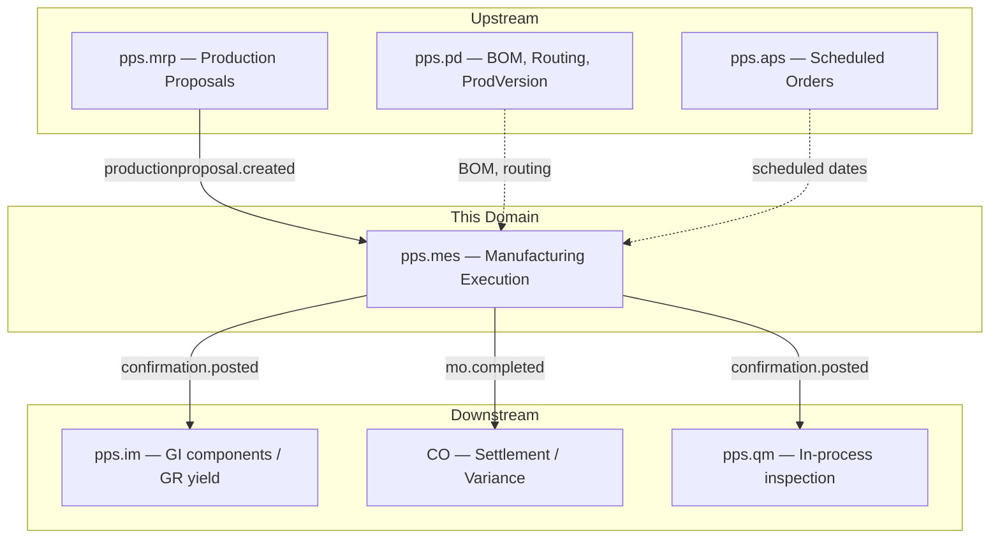
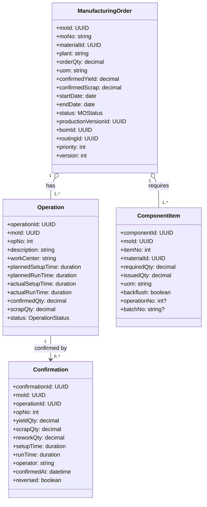
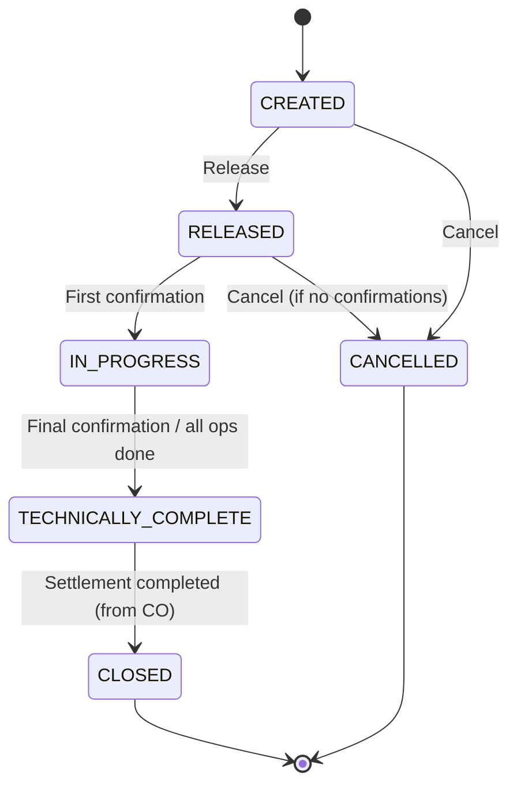
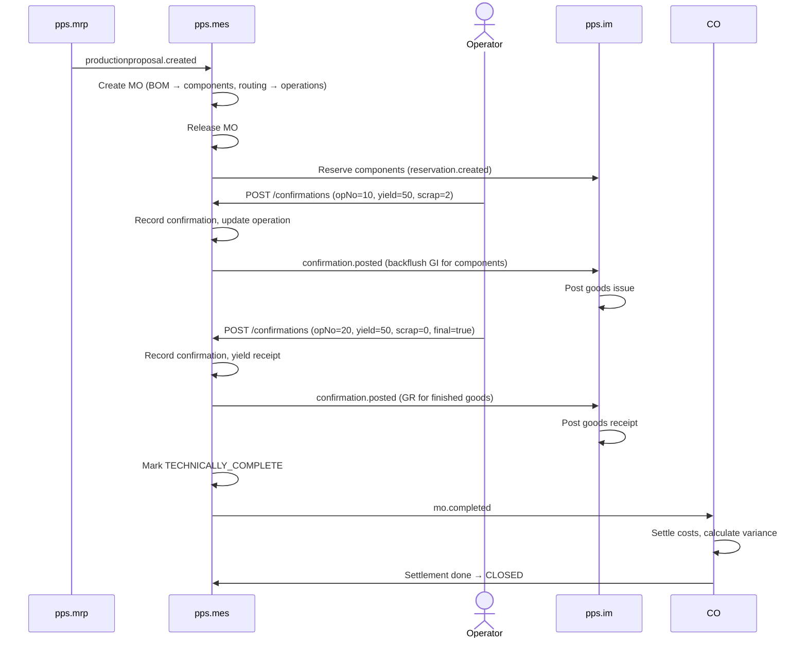
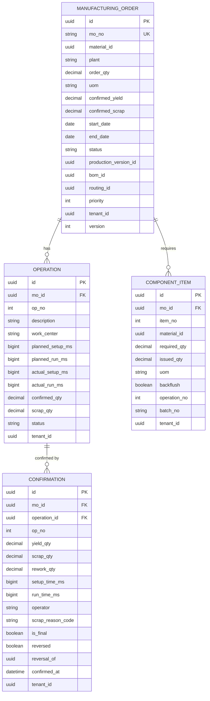

# Manufacturing Execution (MES) - Domain & Microservice Specification

> **Conceptual Stack Layer:** Domain / Service
> **Space:** Platform
> **Owner:** Domain Engineering Team
> **Schema alignment:** `service-layer.schema.json`
> **Companion files:** `openapi.yaml`, `*.schema.json` (event contracts)
> **Referenced by:** Platform-Feature Spec SS5 (backend dependencies), BFF Contract
> **Belongs to:** Suite Spec `_pps_suite.md`

> **Meta Information**
> - **Version:** 2026-04-03
> - **Template:** `domain-service-spec.md` v1.0.0
> - **Template Compliance:** ~95% — feature dependency register preliminary, extension hooks preliminary
> - **Author(s):** OpenLeap Architecture Team
> - **Status:** DRAFT
> - **Suite:** `pps`
> - **Domain:** `mes`
> - **Bounded Context Ref:** `bc:manufacturing`
> - **Service ID:** `pps-mes-svc`
> - **basePackage:** `io.openleap.pps.mes`
> - **API Base Path:** `/api/pps/mes/v1`
> - **OpenLeap Starter Version:** `v1.0.0`
> - **Port:** `TBD`
> - **Repository:** `TBD`
> - **Tags:** `pps`, `mes`, `manufacturing`, `shopfloor`
> - **Team:**
>   - Name: `team-pps`
>   - Email: `pps-team@openleap.io`
>   - Slack: `#pps-team`

---

## Specification Guidelines Compliance

> **This specification MUST comply with the OpenLeap specification guidelines.**
>
> ### Non-Negotiables
> - Never invent facts. If required info is missing, add an **OPEN QUESTION** entry.
> - Preserve intent and decisions. Only change meaning when explicitly requested.
> - Do not remove normative constraints unless they are explicitly replaced.
> - Keep the spec **self-contained**: no "see chat", no implicit context.
>
> ### Style Guide
> - Prefer short sentences and lists.
> - Use MUST/SHOULD/MAY for normative statements.
> - Keep terminology consistent (Aggregate, Domain Service, Application Service, Command, Event).
---

## 0. Document Purpose & Scope

### 0.1 Purpose
This specification defines the Manufacturing Execution domain, which manages the shop-floor lifecycle of manufacturing orders: creation, release, operation execution, time/quantity confirmations, component consumption (goods issue), and yield receipts (goods receipt of finished/semi-finished goods). MES bridges the gap between planning (MRP) and the stock ledger (IM).

### 0.2 Target Audience
- Product Owners & Business Stakeholders
- System Architects & Technical Leads
- Integration Engineers

### 0.3 Scope
**In Scope:**
- Manufacturing Order (MO) lifecycle management
- Operation scheduling and sequencing within an MO
- Confirmation posting (time, yield quantity, scrap)
- Component consumption (backflush and explicit issue)
- Yield receipt (finished goods into stock)
- Shop-floor status tracking (operation start/stop/complete)
- MO settlement trigger (send to CO for variance calculation)
- Work center capacity consumption tracking

**Out of Scope:**
- Product definition, BOM, routing maintenance (PD — pps.pd)
- Material requirements planning (MRP — pps.mrp)
- Stock ledger and goods movements (IM — pps.im)
- Warehouse operations (WM — pps.wm)
- Finite capacity scheduling and optimization (APS — pps.aps)
- Quality inspection execution (QM — pps.qm)
- Financial cost settlement (CO / FI)
- Equipment maintenance (EAM — pps.eam)

### 0.4 Related Documents
- `_pps_suite.md` - PPS Suite overview
- `PD_product_definition.md` - Product Definition (BOM, routing source)
- `pps_im-spec.md` - Inventory Management (GI/GR consumer)
- `pps_mrp-spec.md` - MRP (proposal source)
- `DOMAIN_SPEC_TEMPLATE.md` - Template reference

---

## 1. Business Context

### 1.1 Domain Purpose
MES takes planned or manually created manufacturing orders and guides them through shop-floor execution. It tracks which operations have been started, confirmed, and completed; records how much time was spent and how many good/scrap units were produced; and triggers the corresponding inventory movements (component consumption and yield receipt).

### 1.2 Business Value
- **Production Visibility:** Real-time status of every manufacturing order and operation
- **Accurate Costing:** Actual time and quantity data feeds CO for variance analysis
- **Inventory Accuracy:** Automatic component consumption and yield posting keep IM in sync
- **Quality Feedback:** Scrap and rework tracking enables continuous improvement
- **Capacity Utilization:** Actual vs. planned time data feeds capacity planning

### 1.3 Key Stakeholders
| Role | Responsibility | Primary Use Cases |
|------|----------------|-------------------|
| Production Supervisor | Manage MO lifecycle, monitor floor | Release MOs, review progress |
| Machine Operator | Execute operations, post confirmations | Start/stop operations, report yield/scrap |
| Production Planner | Create and schedule MOs | Convert MRP proposals, sequence operations |
| Quality Engineer | Review scrap and rework data | Analyze confirmation data |
| Controller | Settle production costs | Consume MO completion events for variance |

### 1.4 Strategic Positioning



---

### 1.5 Service Context

| Property | Value |
|----------|-------|
| **Suite** | `pps` |
| **Domain** | `mes` |
| **Bounded Context** | `bc:manufacturing` |
| **Service ID** | `pps-mes-svc` |
| **Base Package** | `io.openleap.pps.mes` |

---

## 2. Service Identity

| Field | Value |
|-------|-------|
| **Service ID** | `pps-mes-svc` |
| **Display Name** | Manufacturing Execution Service |
| **Suite** | `pps` |
| **Domain** | `mes` |
| **Bounded Context Ref** | `bc:manufacturing` |
| **Version** | 2026-04-03 |
| **Status** | DRAFT |
| **API Base Path** | `/api/pps/mes/v1` |
| **Repository** | OPEN QUESTION |
| **Tags** | `pps`, `mes`, `manufacturing`, `shopfloor` |
| **Team Name** | `team-pps` |
| **Team Email** | `pps-team@openleap.io` |
| **Team Slack** | `#pps-team` |

---

## 3. Domain Model

### 3.1 Conceptual Overview
The central aggregate is the **ManufacturingOrder (MO)**, which is created from an MRP proposal or manually. An MO contains **Operations** (derived from the routing) and a **ComponentList** (derived from the BOM). As operations are executed, **Confirmations** record actual time and quantities. Component consumption and yield receipt trigger downstream events to IM.

### 3.2 Core Concepts



**Enumerations:**

| Enum | Values |
|------|--------|
| MOStatus | `CREATED`, `RELEASED`, `IN_PROGRESS`, `TECHNICALLY_COMPLETE`, `CLOSED`, `CANCELLED` |
| OperationStatus | `SCHEDULED`, `RELEASED`, `STARTED`, `CONFIRMED`, `PARTIALLY_CONFIRMED`, `CANCELLED` |

### 3.3 Aggregate Definitions

#### 3.3.1 ManufacturingOrder

**Lifecycle States:**


**State Descriptions:**
| State | Description | Business Meaning |
|-------|-------------|------------------|
| CREATED | MO header and operations generated | Planned, not yet executable |
| RELEASED | Released for shop-floor execution | Operators can start work, components can be staged |
| IN_PROGRESS | At least one confirmation posted | Production actively running |
| TECHNICALLY_COMPLETE | All yield confirmed, production done | Awaiting cost settlement by CO |
| CLOSED | Cost settled, MO is archived | Read-only, historical |
| CANCELLED | Order cancelled before completion | No further processing |

**Business Rules & Invariants:**
1. **Material Must Be Released:** The materialId must reference a Released product in PD.
2. **Production Version Required:** A valid ProductionVersion (linking BOM + Routing) must exist for the material.
3. **No Confirmation After Tech Complete:** Once TECHNICALLY_COMPLETE, no further confirmations are allowed (only reversal).
4. **Yield + Scrap <= Order Qty (soft):** System warns but allows over-confirmation with tolerance %.
5. **Cancel Only If No Confirmations:** RELEASED MOs can only be cancelled if zero confirmations exist.

#### 3.3.2 Operation

**Business Rules:**
1. **Unique OpNo per MO:** Operation numbers must be unique within a manufacturing order.
2. **Sequential Execution (optional):** If configured, operations must be started in opNo order.
3. **Partial Confirmation:** An operation can have multiple confirmations (partial quantities).

#### 3.3.3 ComponentItem

**Business Rules:**
1. **Derived from BOM:** Component list is generated from the BOM at MO creation. Manual additions allowed.
2. **Backflush:** If `backflush = true`, component consumption is automatically posted when the associated operation is confirmed (no explicit GI needed).
3. **Issued <= Required (soft):** Over-consumption triggers a warning but is allowed.

#### 3.3.4 Confirmation

**Business Rules:**
1. **Immutable:** Confirmations are not updated. Corrections are posted as reversal confirmations.
2. **Operation Must Be Released:** Cannot confirm against a SCHEDULED operation.
3. **Triggers IM Events:** Each confirmation triggers component consumption (GI) and/or yield receipt (GR) events to IM.

---

## 4. Business Rules & Constraints

### 4.1 Business Rules Catalog

| ID | Rule Name | Description | Scope | Enforcement |
|----|-----------|-------------|-------|-------------|
| BR-MES-001 | Valid Production Version | MO requires a valid ProductionVersion (BOM + Routing) | MO creation | On create |
| BR-MES-002 | Released Material | Material must be Released in PD | MO creation | On create |
| BR-MES-003 | No Confirm After Complete | No confirmations on TECHNICALLY_COMPLETE MO | Confirmation | On post |
| BR-MES-004 | Over-Confirmation Warning | Yield + scrap > order qty raises warning (configurable tolerance) | Confirmation | On post |
| BR-MES-005 | Cancel Only If Clean | Cancel only if no confirmations exist | MO | On cancel |
| BR-MES-006 | Backflush Calculation | Backflush qty = (BOM qty per * confirmed yield) / order qty | ComponentItem | On confirmation |
| BR-MES-007 | Confirmation Immutability | Confirmations are never updated; corrections via reversal | Confirmation | Always |
| BR-MES-008 | Sequential Operations | If configured, opNo N must be started before opNo N+1 | Operation | On start |
| BR-MES-009 | Unique MO Number | moNo is unique per tenant | MO | On create |
| BR-MES-010 | Scrap Reason | Scrap > 0 requires a reason code | Confirmation | On post |

---

## 5. Use Cases

### 5.1 Business Logic Placement

| Layer | Responsibilities |
|-------|-----------------|
| Application Service | Command validation, aggregate loading, event publishing, orchestration (backflush, yield receipt) |
| Domain Service | BOM/routing copy, backflush calculation, over-confirmation tolerance check (cross-aggregate) |
| Aggregate | State transitions, invariant enforcement, attribute validation |

### 5.2 Use Cases

#### UC-MES-001: Create Manufacturing Order

| Field | Value |
|-------|-------|
| **ID** | UC-MES-001 |
| **Type** | WRITE |
| **Trigger** | Event (`pps.mrp.productionproposal.created`) or REST |
| **Aggregate** | ManufacturingOrder |
| **Domain Operation** | `ManufacturingOrder.create(material, qty, productionVersion)` — copies BOM -> ComponentList, Routing -> Operations |
| **Inputs** | materialId, plant, orderQty, uom, startDate, endDate, productionVersionId, priority? |
| **Outputs** | ManufacturingOrder in CREATED state with Operations and ComponentItems |
| **Events** | `pps.mes.mo.created` |
| **REST** | `POST /api/pps/mes/v1/manufacturing-orders` -> 201 Created |
| **Idempotency** | Idempotency-Key header |
| **Errors** | 400 (validation), 422 (BR-MES-001 invalid production version, BR-MES-002 material not released) |

#### UC-MES-002: Release Manufacturing Order

| Field | Value |
|-------|-------|
| **ID** | UC-MES-002 |
| **Type** | WRITE |
| **Trigger** | REST |
| **Aggregate** | ManufacturingOrder |
| **Domain Operation** | `ManufacturingOrder.release()` |
| **Inputs** | moId |
| **Outputs** | ManufacturingOrder in RELEASED state |
| **Events** | `pps.mes.mo.released` |
| **REST** | `POST /api/pps/mes/v1/manufacturing-orders/{moId}/release` -> 200 OK |
| **Idempotency** | Idempotent (re-release of RELEASED is no-op) |
| **Errors** | 404 (not found), 409 (not in CREATED state) |

#### UC-MES-003: Post Confirmation

| Field | Value |
|-------|-------|
| **ID** | UC-MES-003 |
| **Type** | WRITE |
| **Trigger** | REST |
| **Aggregate** | ManufacturingOrder, Operation, Confirmation |
| **Domain Operation** | `Confirmation.post(opNo, yieldQty, scrapQty, setupTime, runTime)` — updates Operation actuals, MO header totals, triggers backflush and yield receipt |
| **Inputs** | moId, opNo, yieldQty, scrapQty, reworkQty?, setupTime, runTime, operator, scrapReasonCode?, isFinal?, confirmedAt |
| **Outputs** | Confirmation record; updated Operation and MO header |
| **Events** | `pps.mes.confirmation.posted` (consumed by IM for GI/GR, QM for inspection, CO for actuals) |
| **REST** | `POST /api/pps/mes/v1/confirmations` -> 201 Created |
| **Idempotency** | Idempotency-Key header |
| **Errors** | 400 (validation), 409 (BR-MES-003 MO technically complete, operation not RELEASED/STARTED), 422 (BR-MES-004 over-confirmation warning, BR-MES-010 scrap reason required) |

#### UC-MES-004: Explicit Component Issue

| Field | Value |
|-------|-------|
| **ID** | UC-MES-004 |
| **Type** | WRITE |
| **Trigger** | REST |
| **Aggregate** | ComponentItem |
| **Domain Operation** | `ComponentItem.issue(quantity)` |
| **Inputs** | componentId, quantity, batchNo? |
| **Outputs** | Updated ComponentItem.issuedQty |
| **Events** | `pps.mes.componentissue.posted` (consumed by IM for GI) |
| **REST** | `POST /api/pps/mes/v1/components/{componentId}/issue` -> 200 OK |
| **Idempotency** | Idempotency-Key header |
| **Errors** | 400 (validation), 404 (component not found), 409 (MO not RELEASED or IN_PROGRESS) |

#### UC-MES-005: Complete Manufacturing Order

| Field | Value |
|-------|-------|
| **ID** | UC-MES-005 |
| **Type** | WRITE |
| **Trigger** | REST |
| **Aggregate** | ManufacturingOrder |
| **Domain Operation** | `ManufacturingOrder.complete()` |
| **Inputs** | moId |
| **Outputs** | ManufacturingOrder in TECHNICALLY_COMPLETE state |
| **Events** | `pps.mes.mo.completed` (consumed by CO for settlement, T4 BI) |
| **REST** | `POST /api/pps/mes/v1/manufacturing-orders/{moId}/complete` -> 200 OK |
| **Idempotency** | Idempotent (re-complete of TECHNICALLY_COMPLETE is no-op) |
| **Errors** | 404 (not found), 409 (not in IN_PROGRESS state) |

#### UC-MES-006: Reverse Confirmation

| Field | Value |
|-------|-------|
| **ID** | UC-MES-006 |
| **Type** | WRITE |
| **Trigger** | REST |
| **Aggregate** | Confirmation |
| **Domain Operation** | `Confirmation.reverse(originalConfirmationId)` — posts negative quantities, reverses component consumption and yield |
| **Inputs** | confirmationId |
| **Outputs** | Reversal Confirmation record (negative quantities) |
| **Events** | `pps.mes.confirmation.posted` (with reversed flag; IM reverses GI/GR) |
| **REST** | `POST /api/pps/mes/v1/confirmations/{confirmationId}/reverse` -> 201 Created |
| **Idempotency** | Idempotency-Key header |
| **Errors** | 404 (not found), 409 (already reversed), 422 (BR-MES-007 validation) |

#### UC-MES-007: List / Search Manufacturing Orders (READ)

| Field | Value |
|-------|-------|
| **ID** | UC-MES-007 |
| **Type** | READ |
| **Trigger** | REST |
| **Aggregate** | ManufacturingOrder |
| **Domain Operation** | Query projection |
| **Inputs** | plant?, materialId?, status?, dateRange?, page, size |
| **Outputs** | Paginated MO list with operations summary |
| **Events** | -- |
| **REST** | `GET /api/pps/mes/v1/manufacturing-orders?...` -> 200 OK |
| **Idempotency** | Inherently idempotent (GET) |
| **Errors** | 400 (invalid filter params) |

#### UC-MES-008: Cancel Manufacturing Order

| Field | Value |
|-------|-------|
| **ID** | UC-MES-008 |
| **Type** | WRITE |
| **Trigger** | REST |
| **Aggregate** | ManufacturingOrder |
| **Domain Operation** | `ManufacturingOrder.cancel()` |
| **Inputs** | moId |
| **Outputs** | ManufacturingOrder in CANCELLED state |
| **Events** | `pps.mes.mo.cancelled` |
| **REST** | `POST /api/pps/mes/v1/manufacturing-orders/{moId}/cancel` -> 200 OK |
| **Idempotency** | Idempotent (re-cancel of CANCELLED is no-op) |
| **Errors** | 404 (not found), 409 (BR-MES-005 confirmations exist, not in CREATED/RELEASED) |

### 5.3 Process Flow Diagrams



### 5.4 Cross-Domain Workflows

**Does this domain participate in multi-service workflows?** [x] YES

#### Workflow: MRP-Proposal-to-MO

**Orchestration Pattern:** [x] Choreography (EDA)
**Pattern Rationale:** MRP publishes production proposals, MES reacts independently to create manufacturing orders. No distributed transaction coordination needed.

#### Workflow: Confirmation-to-IM

**Orchestration Pattern:** [x] Choreography (EDA)
**Pattern Rationale:** MES publishes confirmation events, IM reacts independently to post goods issues (component consumption) and goods receipts (yield). Eventual consistency acceptable.

#### Workflow: MO-Completion-to-Settlement

**Orchestration Pattern:** [x] Choreography (EDA)
**Pattern Rationale:** MES publishes completion event, CO reacts independently to settle costs. CO signals back via event when settlement is done, triggering CLOSED transition.

---

## 6. REST API

### 6.1 API Overview
**Base Path:** `/api/pps/mes/v1`
**Authentication:** OAuth2/JWT
**Authorization:** `pps.mes:read`, `pps.mes:write`, `pps.mes:admin`

### 6.2 Resource Operations

#### Manufacturing Orders
```
POST   /api/pps/mes/v1/manufacturing-orders                    — Create MO
GET    /api/pps/mes/v1/manufacturing-orders?plant={code}&materialId={id}&status={s}&page=0&size=50
GET    /api/pps/mes/v1/manufacturing-orders/{moId}              — Get MO with operations & components
PATCH  /api/pps/mes/v1/manufacturing-orders/{moId}              — Update header (qty, dates)
POST   /api/pps/mes/v1/manufacturing-orders/{moId}/release       — Release for execution
POST   /api/pps/mes/v1/manufacturing-orders/{moId}/complete      — Mark technically complete
POST   /api/pps/mes/v1/manufacturing-orders/{moId}/cancel        — Cancel
POST   /api/pps/mes/v1/manufacturing-orders/{moId}/close         — Close (after settlement)
```

**Create Request:**
```json
{
  "materialId": "uuid",
  "plant": "P100",
  "orderQty": 100.000,
  "uom": "PC",
  "startDate": "2026-03-10",
  "endDate": "2026-03-14",
  "productionVersionId": "uuid",
  "priority": 5
}
```

#### Operations
```
GET    /api/pps/mes/v1/manufacturing-orders/{moId}/operations
PATCH  /api/pps/mes/v1/operations/{operationId}                  — Update (planned times, work center)
POST   /api/pps/mes/v1/operations/{operationId}/start             — Start operation
```

#### Component Items
```
GET    /api/pps/mes/v1/manufacturing-orders/{moId}/components
POST   /api/pps/mes/v1/manufacturing-orders/{moId}/components     — Add component manually
PATCH  /api/pps/mes/v1/components/{componentId}                   — Update (qty, batch, backflush flag)
POST   /api/pps/mes/v1/components/{componentId}/issue              — Explicit component issue
```

#### Confirmations
```
POST   /api/pps/mes/v1/confirmations                              — Post confirmation
GET    /api/pps/mes/v1/confirmations?moId={id}&opNo={no}&page=0&size=50
POST   /api/pps/mes/v1/confirmations/{confirmationId}/reverse      — Reverse confirmation
```

**Post Confirmation Request:**
```json
{
  "moId": "uuid",
  "opNo": 10,
  "yieldQty": 50.000,
  "scrapQty": 2.000,
  "reworkQty": 0.000,
  "setupTime": "PT30M",
  "runTime": "PT4H",
  "operator": "operator-001",
  "scrapReasonCode": "TOOL_WEAR",
  "isFinal": false,
  "confirmedAt": "2026-03-11T14:30:00Z"
}
```

---

## 7. Events & Integration

### 7.1 Published Events
**Exchange:** `pps.mes.events` (topic, durable)

#### mo.created
**Routing Key:** `pps.mes.mo.created`
**Consumer:** T4 BI

#### mo.released
**Routing Key:** `pps.mes.mo.released`
**Payload:** `{ moId, moNo, materialId, plant, orderQty, startDate, endDate }`
**Consumers:** pps.im (reservation), pps.wm (component staging)

#### confirmation.posted
**Routing Key:** `pps.mes.confirmation.posted`
**Payload:**
```json
{
  "confirmationId": "uuid",
  "moId": "uuid",
  "moNo": "MO-100200",
  "opNo": 10,
  "materialId": "uuid",
  "plant": "P100",
  "yieldQty": 50.000,
  "scrapQty": 2.000,
  "setupTime": "PT30M",
  "runTime": "PT4H",
  "isFinal": false,
  "components": [
    { "materialId": "uuid", "quantity": 150.000, "uom": "KG", "batchNo": "B001", "issueType": "BACKFLUSH" }
  ],
  "yield": null
}
```
**Consumers:** pps.im (GI for components, GR for yield), pps.qm (in-process inspection trigger), CO (actual costs)

#### mo.completed
**Routing Key:** `pps.mes.mo.completed`
**Payload:** `{ moId, moNo, materialId, plant, totalYield, totalScrap, actualStartDate, actualEndDate }`
**Consumers:** CO (settlement trigger), T4 BI

#### componentissue.posted
**Routing Key:** `pps.mes.componentissue.posted`
**Consumer:** pps.im (explicit GI)

### 7.2 Consumed Events

| Event | Source | Queue | Business Logic |
|-------|--------|-------|----------------|
| `pps.mrp.productionproposal.created` | pps.mrp | `pps.mes.in.pps.mrp.productionproposal` | Auto-create MO (if configured) or queue for review |
| `pps.pd.productionversion.released` | pps.pd | `pps.mes.in.pps.pd.productionversion` | Cache production version data |
| `pps.im.stock.changed` | pps.im | `pps.mes.in.pps.im.stock` | Update component availability for released MOs |
| `pps.aps.schedule.published` | pps.aps | `pps.mes.in.pps.aps.schedule` | Update MO/operation dates from finite schedule |

---

## 8. Data Model

### 8.1 Conceptual Data Model



---

## 9. Security & Compliance

### 9.1 Access Control
| Role | Read | Create MO | Confirm | Release/Complete | Admin |
|------|------|----------|---------|-----------------|-------|
| MES_VIEWER | Y | -- | -- | -- | -- |
| MES_OPERATOR | Y | -- | Y | -- | -- |
| MES_PLANNER | Y | Y | -- | Y | -- |
| MES_SUPERVISOR | Y | Y | Y | Y | -- |
| MES_ADMIN | Y | Y | Y | Y | Y |

---

## 10. Quality Attributes

### 10.1 Performance
- Confirmation posting: < 200ms (95th percentile)
- MO query: < 100ms
- MO creation (BOM/routing copy): < 500ms

### 10.2 Availability
**Target:** 99.9% — shop floor depends on real-time confirmation posting.

---

## 11. Feature Dependencies

### 11.1 Purpose
This section answers: "Which features depend on this service?" It is the inverse of Platform-Feature Spec SS5 and helps the domain team assess the blast radius of API changes.

### 11.2 Feature Dependency Register

> **OPEN QUESTION:** Feature dependencies will be populated when feature specs (Phase 3) are authored for the PPS suite. The following is a preliminary mapping based on expected feature compositions.

| Feature ID | Feature Name | Suite | Tier | Dependency Type | Status |
|------------|-------------|-------|------|-----------------|--------|
| F-PPS-TBD | Manufacturing Order Management | pps | core | sync_api | planned |
| F-PPS-TBD | Shop Floor Confirmation | pps | core | sync_api | planned |
| F-PPS-TBD | Component Consumption | pps | supporting | sync_api + async_event | planned |
| F-PPS-TBD | Production Order Settlement | pps | supporting | async_event (mo.completed) | planned |
| F-CO-TBD | Variance Analysis | co | core | async_event (mo.completed) | planned |

---

## 12. Extension Points

### 12.1 Purpose
Extension points follow the Open-Closed Principle: the service is open for extension via events and hooks but closed for direct modification.

### 12.2 Extension Events

| Event ID | Routing Key | Trigger | Payload | Purpose |
|----------|-------------|---------|---------|---------|
| EXT-MES-001 | `pps.mes.confirmation.posted` | Confirmation posted | Full confirmation snapshot | External systems can react to confirmations (e.g., SCADA integration, real-time dashboard) |
| EXT-MES-002 | `pps.mes.mo.completed` | MO technically complete | MO summary with totals | External systems can react to completions (e.g., customer portal, planning feedback) |
| EXT-MES-003 | `pps.mes.mo.released` | MO released | MO header with operations | External systems can react to releases (e.g., component staging, WMS notification) |

### 12.3 Aggregate Hooks

| Hook ID | Aggregate | Lifecycle Point | Hook Type | Description |
|---------|-----------|-----------------|-----------|-------------|
| HOOK-MES-001 | ManufacturingOrder | Pre-Release | validation | Custom validation rules per tenant (e.g., capacity check, material availability) |
| HOOK-MES-002 | Confirmation | Pre-Post | validation | Custom confirmation validation (e.g., mandatory fields, quality gate) |
| HOOK-MES-003 | Confirmation | Post-Post | notification | Custom notification channels (dashboard update, supervisor alert, SCADA feedback) |
| HOOK-MES-004 | ManufacturingOrder | Post-Complete | notification | Custom completion notification (e.g., CO trigger, planning feedback) |

**Design Rules:**
- Hooks are fire-and-forget (notification) or bounded-timeout (validation: 2s, enrichment: 5s)
- Validation hooks fail-closed (block on timeout)
- Notification hooks fail-open (log and continue)
- Hooks do not modify aggregate state directly

### 12.4 Extension Points Summary

| ID | Type | Aggregate | Lifecycle Point | Fail Mode | Timeout |
|----|------|-----------|-----------------|-----------|---------|
| EXT-MES-001 | event | Confirmation | posted | n/a | n/a |
| EXT-MES-002 | event | ManufacturingOrder | completed | n/a | n/a |
| EXT-MES-003 | event | ManufacturingOrder | released | n/a | n/a |
| HOOK-MES-001 | validation | ManufacturingOrder | pre-release | fail-closed | 2s |
| HOOK-MES-002 | validation | Confirmation | pre-post | fail-closed | 2s |
| HOOK-MES-003 | notification | Confirmation | post-post | fail-open | 5s |
| HOOK-MES-004 | notification | ManufacturingOrder | post-complete | fail-open | 5s |

---

## 13. Migration & Evolution

### 13.1 Data Migration

**Legacy Source:** No direct legacy migration planned. New greenfield service.

For organizations migrating from legacy MES/MRP systems, a data migration adapter can import:
- Open manufacturing orders via bulk creation API
- Historical confirmations via batch import (for reporting continuity)
- BOM/routing references are resolved from pps.pd at MO creation time

### 13.2 Deprecation & Sunset

| Deprecated Feature | Replacement | Removal Timeline | Communication Plan |
|-------------------|-------------|------------------|-------------------|
| -- | -- | -- | -- |

### 13.3 Future Extensions

- SCADA/IoT integration for automatic confirmations (sensor-driven)
- Co-products and by-products support
- Rework order flow (feed scrap back into production)
- Batch determination at confirmation time (FEFO-based)
- Mobile offline confirmation with sync-on-reconnect
- Real-time OEE (Overall Equipment Effectiveness) dashboard integration

---

## 14. Decisions & Open Questions

### 14.1 Open Questions

| ID | Question | Status | Decision |
|----|----------|--------|----------|
| Q-001 | Should MES support co-products and by-products? | Open | Phase 2 |
| Q-002 | Rework orders (feed scrap back into production)? | Open | Phase 2 |
| Q-003 | Integration with SCADA/IoT for automatic confirmations? | Open | Phase 3 |
| Q-004 | Batch determination at confirmation time? | Decided | Yes, operator selects or system proposes FEFO |

### 14.2 Architectural Decision Records

### ADR-MES-001: Backflush as Default
**Status:** Accepted
**Decision:** Components default to backflush (auto-consumption on confirmation). Explicit issue is opt-in per component. Simplifies shop-floor operations.

---

## 15. Appendix

### 15.1 Glossary
| Term | Definition | Aliases |
|------|------------|---------|
| MO | Manufacturing Order | Fertigungsauftrag |
| Confirmation | Report of actual time and quantity | Rueckmeldung |
| Backflush | Automatic component consumption | Retrograde Entnahme |
| Yield | Good output quantity | Gutmenge |
| Scrap | Defective output quantity | Ausschuss |
| Work Center | Machine or labor group where operations run | Arbeitsplatz |

### 15.2 Change Log
| Date | Version | Author | Changes |
|------|---------|--------|---------|
| 2026-04-03 | 2.0 | Architecture Team | Template compliance restructure — added SS2 Service Identity, canonical UC format, SS11 Feature Dependencies, SS12 Extension Points, SS13 Migration, fixed section order |
| 2026-02-23 | 1.0 | OpenLeap Architecture Team | Initial version |

---

## Document Review & Approval
**Status:** DRAFT
**Reviewers:**
- Product Owner: {Name} - {Date} - [ ] Approved
- System Architect: {Name} - {Date} - [ ] Approved
- Technical Lead (PPS): {Name} - {Date} - [ ] Approved
