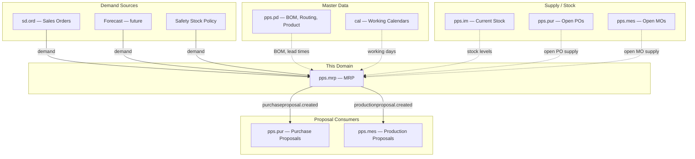
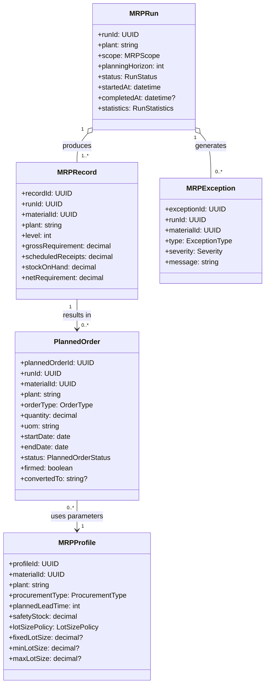
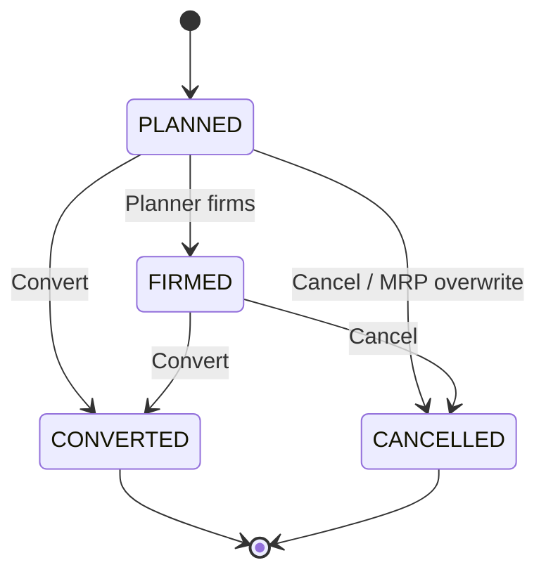
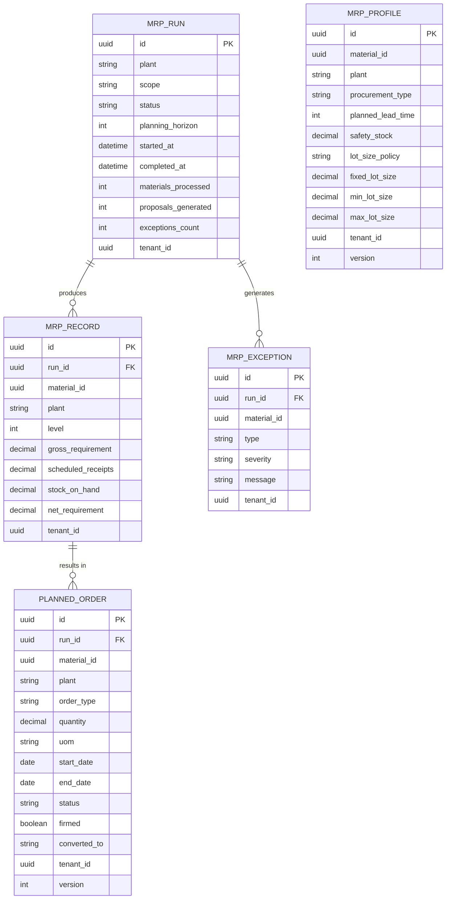

# Material Requirements Planning (MRP) - Domain & Microservice Specification

> **Conceptual Stack Layer:** Domain / Service
> **Space:** Platform
> **Owner:** Domain Engineering Team
> **Schema alignment:** `service-layer.schema.json`
> **Companion files:** `openapi.yaml`, `*.schema.json` (event contracts)
> **Referenced by:** Platform-Feature Spec SS5 (backend dependencies), BFF Contract
> **Belongs to:** Suite Spec `_pps_suite.md`

> **Meta Information**
> - **Version:** 2026-04-01
> - **Template:** `domain-service-spec.md` v1.0.0
> - **Template Compliance:** ~95%
> - **Author(s):** OpenLeap Architecture Team
> - **Status:** DRAFT
> - **Suite:** `pps`
> - **Domain:** `mrp`
> - **Bounded Context Ref:** `bc:material-planning`
> - **Service ID:** `pps-mrp-svc`
> - **basePackage:** `io.openleap.pps.mrp`
> - **API Base Path:** `/api/pps/mrp/v1`
> - **OpenLeap Starter Version:** `v1.0.0`
> - **Port:** `TBD`
> - **Repository:** `TBD`
> - **Tags:** `pps`, `mrp`, `manufacturing`, `planning`
> - **Team:**
>   - Name: `team-pps`
>   - Email: `pps-team@openleap.io`
>   - Slack: `#pps-team`

---

## Specification Guidelines Compliance

> **This specification MUST comply with the OpenLeap specification guidelines.**
>
> ### Non-Negotiables
> - Never invent facts. If required info is missing, add an **OPEN QUESTION** entry.
> - Preserve intent and decisions. Only change meaning when explicitly requested.
> - Do not remove normative constraints unless they are explicitly replaced.
> - Keep the spec **self-contained**: no "see chat", no implicit context.
>
> ### Style Guide
> - Prefer short sentences and lists.
> - Use MUST/SHOULD/MAY for normative statements.
> - Keep terminology consistent (Aggregate, Domain Service, Application Service, Command, Event).
---

## 0. Document Purpose & Scope

### 0.1 Purpose
This specification defines the Material Requirements Planning domain, which calculates net material requirements based on demand and supply, explodes BOMs to determine component needs, and generates actionable supply proposals (purchase proposals for externally procured materials, production proposals for in-house manufactured materials).

### 0.2 Target Audience
- Product Owners & Business Stakeholders
- System Architects & Technical Leads
- Integration Engineers

### 0.3 Scope
**In Scope:**
- MRP run orchestration (total, plant-level, single-material)
- Gross-to-net calculation (demand vs. supply)
- Multi-level BOM explosion
- Lead time scheduling (backward and forward)
- Purchase proposal generation
- Production proposal generation
- Planned order management (review, firm, convert)
- Safety stock planning
- Lot-sizing policies (lot-for-lot, fixed lot, period-based, min-max)
- Rescheduling proposals (expedite / defer existing supply)
- MRP exception monitoring

**Out of Scope:**
- Product master data, BOMs, routings (PD — pps.pd)
- Inventory stock management (IM — pps.im)
- Purchase order lifecycle (PUR — pps.pur)
- Manufacturing order execution (MES — pps.mes)
- Finite capacity scheduling (APS — pps.aps)
- Demand forecasting and demand planning (future domain)
- Sales order management (SD — sd.ord)

### 0.4 Related Documents
- `_pps_suite.md` - PPS Suite overview
- `PD_product_definition.md` - Product Definition (BOM source)
- `pps_im-spec.md` - Inventory Management (stock source)
- `PUR_procurement.md` - Procurement (proposal consumer)
- `MES_execution.md` - Manufacturing Execution (proposal consumer)
- `CAP_calendar_planning.md` - Calendar & Planner
- `DOMAIN_SPEC_TEMPLATE.md` - Template reference

---

## 1. Business Context

### 1.1 Domain Purpose
MRP answers the fundamental planning questions: "What do we need?", "How much?", and "When?" It takes demand signals (sales orders, forecasts, safety stock requirements), explodes them through BOMs to determine component requirements at every level, nets against available stock and open supply, and generates proposals to close any gaps. MRP is a batch-oriented planning engine that runs periodically or on-demand.

### 1.2 Business Value
- **Demand Fulfillment:** Ensures materials are available when needed for production and sales
- **Working Capital Optimization:** Minimizes excess inventory through accurate planning
- **Supply Chain Coordination:** Synchronizes procurement and production schedules
- **Exception Management:** Highlights problems (shortages, excess, reschedules) proactively
- **Cost Reduction:** Optimal lot sizing reduces setup costs and inventory carrying costs

### 1.3 Key Stakeholders
| Role | Responsibility | Primary Use Cases |
|------|----------------|-------------------|
| Production Planner | Run MRP, review and convert proposals | MRP run, planned order management |
| Procurement Planner | Review and convert purchase proposals | Purchase proposal review, conversion to PR/PO |
| Plant Manager | Approve planning parameters | Safety stock, lot sizes, lead times |
| Sales Planner | Provide demand forecast | Demand input for MRP |

### 1.4 Strategic Positioning



---

### 1.5 Service Context

| Property | Value |
|----------|-------|
| **Suite** | `pps` |
| **Domain** | `mrp` |
| **Bounded Context** | `bc:material-planning` |
| **Service ID** | `pps-mrp-svc` |
| **Base Package** | `io.openleap.pps.mrp` |

---

## 2. Service Identity

| Field | Value |
|-------|-------|
| **Service ID** | `pps-mrp-svc` |
| **Display Name** | Material Requirements Planning Service |
| **Suite** | `pps` |
| **Domain** | `mrp` |
| **Bounded Context Ref** | `bc:material-planning` |
| **Version** | 2026-04-01 |
| **Status** | DRAFT |
| **API Base Path** | `/api/pps/mrp/v1` |
| **Repository** | TBD |
| **Tags** | `pps`, `mrp`, `manufacturing`, `planning` |
| **Team Name** | `team-pps` |
| **Team Email** | `pps-team@openleap.io` |
| **Team Slack** | `#pps-team` |

---

## 3. Domain Model

### 3.1 Conceptual Overview
MRP operates in a run-based model. An **MRPRun** defines the scope and triggers the planning engine. The engine processes each material through an **MRPRecord** that captures demand, supply, and the resulting **PlannedOrders**. Planned orders are the output: either **PurchaseProposals** (external) or **ProductionProposals** (internal). Planning parameters are stored per material/plant in **MRPProfile**.

### 3.2 Core Concepts



**Enumerations:**

| Enum | Values |
|------|--------|
| MRPScope | `TOTAL`, `MATERIAL_GROUP`, `SINGLE_MATERIAL` |
| RunStatus | `SCHEDULED`, `RUNNING`, `COMPLETED`, `FAILED`, `CANCELLED` |
| OrderType | `PURCHASE`, `PRODUCTION` |
| PlannedOrderStatus | `PLANNED`, `FIRMED`, `CONVERTED`, `CANCELLED` |
| ProcurementType | `EXTERNAL` (buy), `INTERNAL` (make), `BOTH` |
| LotSizePolicy | `LOT_FOR_LOT`, `FIXED_LOT`, `PERIOD_BASED`, `MIN_MAX` |
| DemandType | `SALES_ORDER`, `FORECAST`, `DEPENDENT_DEMAND`, `SAFETY_STOCK`, `RESERVATION` |
| SupplyType | `STOCK_ON_HAND`, `PURCHASE_ORDER`, `MANUFACTURING_ORDER`, `PLANNED_ORDER_FIRMED` |
| ExceptionType | `SHORTAGE`, `EXCESS`, `RESCHEDULE_IN`, `RESCHEDULE_OUT`, `PAST_DUE`, `LEAD_TIME_VIOLATION` |
| Severity | `INFO`, `WARNING`, `CRITICAL` |

### 3.3 Aggregate Definitions

#### 3.3.1 MRPRun
**Business Purpose:** Single execution of the MRP planning engine.
**Business Rules:**
1. **Single Active Run:** Only one run per plant at a time.
2. **Scope Immutability:** Once RUNNING, scope cannot be changed.
3. **Idempotent Proposals:** Re-running replaces previous non-firmed planned orders.

#### 3.3.2 PlannedOrder
**Lifecycle States:**

**Business Rules:**
1. **Firmed Protection:** Firmed orders not overwritten by MRP.
2. **Conversion Tracking:** `convertedTo` stores resulting PO/MO ID.
3. **Lot Size Compliance:** Quantity respects min/max/rounding from MRP profile.

#### 3.3.3 MRPProfile
**Business Purpose:** Planning parameters per material/plant.
**Key Attributes:**
| Attribute | Type | Description | Constraints |
|-----------|------|-------------|-------------|
| procurementType | ProcurementType | Buy or make | Required |
| plannedLeadTime | int | Lead time in working days | Required, >= 0 |
| safetyStock | decimal | Minimum stock to maintain | >= 0, default 0 |
| lotSizePolicy | LotSizePolicy | How to size orders | Required |
| fixedLotSize | decimal | For FIXED_LOT policy | Required if FIXED_LOT |
**Business Rules:**
1. **Unique per material/plant** per tenant.
2. **Parameter Consistency:** FIXED_LOT requires fixedLotSize > 0.

---

## 4. Business Rules & Constraints

### 4.1 Business Rules Catalog

| ID | Rule Name | Description | Scope | Enforcement |
|----|-----------|-------------|-------|-------------|
| BR-MRP-001 | Single Active Run | Only one run per plant at a time | MRPRun | On creation |
| BR-MRP-002 | Firmed Protection | Firmed orders not overwritten | PlannedOrder | During MRP run |
| BR-MRP-003 | No Negative Net | Net requirement floored at 0 | MRPRecord | During calculation |
| BR-MRP-004 | Lot Size Compliance | Quantity respects min/max/rounding | PlannedOrder | During lot sizing |
| BR-MRP-005 | Lead Time Feasibility | Start date < today → PAST_DUE exception | PlannedOrder | During scheduling |
| BR-MRP-006 | BOM Validity | Only Released BOMs valid on planning date | BOM explosion | During explosion |
| BR-MRP-007 | Profile Required | No profile → material skipped with WARNING | MRPRecord | During run |
| BR-MRP-008 | Scrap Inflation | Component demand inflated by BOM scrap % | BOM explosion | During explosion |
| BR-MRP-009 | Safety Stock Demand | Stock < safety stock → generates demand | MRPRecord | During demand collection |
| BR-MRP-010 | Rescheduling | Supply too early/late → RESCHEDULE exception | MRPException | During netting |

---

## 5. Use Cases

### 5.1 Business Logic Placement

| Layer | Responsibilities |
|-------|-----------------|
| Application Service | Command validation, aggregate loading, event publishing, MRP run orchestration |
| Domain Service | BOM explosion, gross-to-net calculation, lot sizing, lead time scheduling |
| Aggregate | State transitions, invariant enforcement, attribute validation |

### 5.2 Use Cases

#### UC-MRP-001: Run MRP

| Field | Value |
|-------|-------|
| **ID** | UC-MRP-001 |
| **Type** | WRITE |
| **Trigger** | REST / Scheduled Job |
| **Aggregate** | MRPRun |
| **Domain Operation** | `MRPRun.trigger(scope, plant, horizon)` |
| **Inputs** | plant, scope (TOTAL / MATERIAL_GROUP / SINGLE_MATERIAL), planningHorizon, autoConvert? |
| **Outputs** | MRPRun in RUNNING state (202 Accepted) |
| **Events** | `mrprun.completed` on finish |
| **REST** | `POST /api/pps/mrp/v1/mrp-runs` -> 202 Accepted |
| **Idempotency** | Rejected if active run exists for same plant (BR-MRP-001) |
| **Errors** | 409 (active run exists), 422 (invalid scope/plant) |

**MRP Calculation Algorithm:**
1. **Build Material List:** All in-scope materials ordered by low-level code (level 0 = finished, highest = raw).
2. **Process Level 0 (Finished Goods):** Collect independent demand, net against stock + supply, lot-size, schedule, explode BOM -> dependent demand at level 1.
3. **Process Level 1..N:** Collect dependent + independent demand, net, lot-size, schedule. If INTERNAL -> BOM explosion for next level. If EXTERNAL -> purchase proposal.
4. **Repeat until lowest level.**
5. **Post-Processing:** Generate exceptions (shortages, reschedules, past-due items).

#### UC-MRP-002: Review Planned Orders

| Field | Value |
|-------|-------|
| **ID** | UC-MRP-002 |
| **Type** | READ |
| **Trigger** | REST |
| **Aggregate** | PlannedOrder |
| **Domain Operation** | Query projection |
| **Inputs** | plant?, materialId?, orderType?, status?, runId?, page, size |
| **Outputs** | Paginated planned order list with exception details |
| **Events** | -- |
| **REST** | `GET /api/pps/mrp/v1/planned-orders?...` -> 200 OK |
| **Idempotency** | Inherently idempotent (GET) |
| **Errors** | 400 (invalid filter params) |

#### UC-MRP-003: Firm Planned Order

| Field | Value |
|-------|-------|
| **ID** | UC-MRP-003 |
| **Type** | WRITE |
| **Trigger** | REST |
| **Aggregate** | PlannedOrder |
| **Domain Operation** | `PlannedOrder.firm()` |
| **Inputs** | plannedOrderId |
| **Outputs** | PlannedOrder in FIRMED state |
| **Events** | -- |
| **REST** | `POST /api/pps/mrp/v1/planned-orders/{id}/firm` -> 200 OK |
| **Idempotency** | Idempotent (re-firm of FIRMED is no-op) |
| **Errors** | 404 (not found), 409 (not in PLANNED state) |

#### UC-MRP-004: Convert Planned Order

| Field | Value |
|-------|-------|
| **ID** | UC-MRP-004 |
| **Type** | WRITE |
| **Trigger** | REST / Auto-Job |
| **Aggregate** | PlannedOrder |
| **Domain Operation** | `PlannedOrder.convert()` |
| **Inputs** | plannedOrderId |
| **Outputs** | PlannedOrder in CONVERTED state |
| **Events** | PURCHASE: `pps.mrp.purchaseproposal.created`; PRODUCTION: `pps.mrp.productionproposal.created` |
| **REST** | `POST /api/pps/mrp/v1/planned-orders/{id}/convert` -> 200 OK |
| **Idempotency** | Idempotent (re-convert of CONVERTED is no-op) |
| **Errors** | 404 (not found), 409 (not in PLANNED or FIRMED state) |

#### UC-MRP-005: Bulk Convert Planned Orders

| Field | Value |
|-------|-------|
| **ID** | UC-MRP-005 |
| **Type** | WRITE |
| **Trigger** | REST |
| **Aggregate** | PlannedOrder |
| **Domain Operation** | `PlannedOrder.convert()` for each |
| **Inputs** | plannedOrderIds[] or filter criteria (plant, orderType, runId) |
| **Outputs** | Conversion result summary |
| **Events** | Multiple `purchaseproposal.created` / `productionproposal.created` |
| **REST** | `POST /api/pps/mrp/v1/planned-orders:bulk-convert` -> 200 OK |
| **Idempotency** | Skips already-CONVERTED orders |
| **Errors** | 422 (no eligible orders) |

#### UC-MRP-006: Manage MRP Profiles

| Field | Value |
|-------|-------|
| **ID** | UC-MRP-006 |
| **Type** | WRITE |
| **Trigger** | REST |
| **Aggregate** | MRPProfile |
| **Domain Operation** | `MRPProfile.create()`, `MRPProfile.update()`, `MRPProfile.delete()` |
| **Inputs** | materialId, plant, procurementType, plannedLeadTime, safetyStock, lotSizePolicy, fixedLotSize?, minLotSize?, maxLotSize? |
| **Outputs** | Created/updated MRP profile |
| **Events** | -- |
| **REST** | `POST /api/pps/mrp/v1/profiles` -> 201, `PATCH /api/pps/mrp/v1/profiles/{id}` -> 200, `DELETE /api/pps/mrp/v1/profiles/{id}` -> 204 |
| **Idempotency** | Idempotency-Key header on POST |
| **Errors** | 400 (validation), 409 (duplicate material/plant), 422 (BR: FIXED_LOT without fixedLotSize) |

#### UC-MRP-007: Cancel MRP Run

| Field | Value |
|-------|-------|
| **ID** | UC-MRP-007 |
| **Type** | WRITE |
| **Trigger** | REST |
| **Aggregate** | MRPRun |
| **Domain Operation** | `MRPRun.cancel()` |
| **Inputs** | runId |
| **Outputs** | MRPRun in CANCELLED state |
| **Events** | -- |
| **REST** | `POST /api/pps/mrp/v1/mrp-runs/{runId}/cancel` -> 200 OK |
| **Idempotency** | Idempotent (re-cancel is no-op) |
| **Errors** | 404, 409 (already COMPLETED or CANCELLED) |

### 5.3 Cross-Domain Workflows

**Does this domain participate in multi-service workflows?** Yes

#### Workflow: MRP-to-Procurement (CHR-MRP-001)
**Orchestration Pattern:** Choreography (EDA)
**Pattern Rationale:** MRP publishes purchase proposals; PUR reacts independently. No distributed transaction needed.

#### Workflow: MRP-to-Production (CHR-MRP-002)
**Orchestration Pattern:** Choreography (EDA)
**Pattern Rationale:** MRP publishes production proposals; MES reacts independently. No distributed transaction needed.

---

## 6. REST API

### 6.1 API Overview
**Base Path:** `/api/pps/mrp/v1`
**Authentication:** OAuth2/JWT
**Authorization:** `pps.mrp:read`, `pps.mrp:write`, `pps.mrp:admin`

### 6.2 Resource Operations

#### MRP Runs
```
POST   /api/pps/mrp/v1/mrp-runs                          — Trigger run (202 Accepted)
GET    /api/pps/mrp/v1/mrp-runs?plant={code}&status={s}
GET    /api/pps/mrp/v1/mrp-runs/{runId}
GET    /api/pps/mrp/v1/mrp-runs/{runId}/records?materialId={id}
GET    /api/pps/mrp/v1/mrp-runs/{runId}/exceptions?severity={s}&type={t}
POST   /api/pps/mrp/v1/mrp-runs/{runId}/cancel
```

**Trigger Request:**
```json
{
  "plant": "P100",
  "scope": "TOTAL",
  "planningHorizon": 90,
  "autoConvert": false
}
```

#### Planned Orders
```
GET    /api/pps/mrp/v1/planned-orders?plant={code}&materialId={id}&orderType={type}&status={s}
GET    /api/pps/mrp/v1/planned-orders/{id}
PATCH  /api/pps/mrp/v1/planned-orders/{id}                 — Adjust qty/dates
POST   /api/pps/mrp/v1/planned-orders/{id}/firm
POST   /api/pps/mrp/v1/planned-orders/{id}/convert
POST   /api/pps/mrp/v1/planned-orders/{id}/cancel
POST   /api/pps/mrp/v1/planned-orders:bulk-convert
```

#### MRP Profiles
```
POST   /api/pps/mrp/v1/profiles
GET    /api/pps/mrp/v1/profiles?plant={code}&materialId={id}
GET    /api/pps/mrp/v1/profiles/{id}
PATCH  /api/pps/mrp/v1/profiles/{id}
DELETE /api/pps/mrp/v1/profiles/{id}
POST   /api/pps/mrp/v1/profiles:bulk-upload
```

---

## 7. Events & Integration

### 7.1 Published Events
**Exchange:** `pps.mrp.events` (topic, durable)

#### purchaseproposal.created
**Routing Key:** `pps.mrp.purchaseproposal.created`
```json
{
  "plannedOrderId": "uuid",
  "runId": "uuid",
  "materialId": "uuid",
  "materialNo": "MAT-RAW-001",
  "plant": "P100",
  "quantity": 500.000,
  "uom": "KG",
  "needDate": "2026-03-15",
  "startDate": "2026-03-01",
  "suggestedSupplierId": "uuid"
}
```
**Consumer:** pps.pur — creates PR/PO

#### productionproposal.created
**Routing Key:** `pps.mrp.productionproposal.created`
```json
{
  "plannedOrderId": "uuid",
  "runId": "uuid",
  "materialId": "uuid",
  "materialNo": "MAT-FIN-001",
  "plant": "P100",
  "quantity": 100.000,
  "uom": "PC",
  "needDate": "2026-03-20",
  "startDate": "2026-03-10",
  "productionVersionId": "uuid",
  "bomId": "uuid",
  "routingId": "uuid"
}
```
**Consumer:** pps.mes — creates Manufacturing Order

#### mrprun.completed
**Routing Key:** `pps.mrp.mrprun.completed`
**Consumer:** T4 BI — planning analytics

### 7.2 Consumed Events

| Event | Source | Queue | Business Logic |
|-------|--------|-------|----------------|
| `pps.pd.product.released` | pps.pd | `pps.mrp.in.pps.pd.product` | Cache material master |
| `pps.pd.bom.released` | pps.pd | `pps.mrp.in.pps.pd.bom` | Cache BOM; flag for re-plan |
| `pps.im.stock.changed` | pps.im | `pps.mrp.in.pps.im.stock` | Update stock cache; check reorder point |
| `sd.ord.salesorder.created` | sd.ord | `pps.mrp.in.sd.ord.salesorder` | Register demand element |

### 7.3 Integration Points Summary

**Upstream (Synchronous):**
| Service | Purpose | Fallback |
|---------|---------|----------|
| pps.pd | BOM structures, production versions | Cached snapshot |
| pps.im | Stock levels, reservations | Cached last-known |
| pps.pur | Open PO quantities | Cached snapshot |
| pps.mes | Open MO quantities | Cached snapshot |
| cal | Working calendar | Default calendar |

---

## 8. Data Model

### 8.1 Conceptual Data Model



---

## 9. Security & Compliance

### 9.1 Access Control
| Role | Read | Run MRP | Manage Orders | Configure Profiles | Admin |
|------|------|---------|--------------|-------------------|-------|
| MRP_VIEWER | ✓ | ✗ | ✗ | ✗ | ✗ |
| MRP_PLANNER | ✓ | ✓ | ✓ | ✗ | ✗ |
| MRP_MANAGER | ✓ | ✓ | ✓ | ✓ | ✗ |
| MRP_ADMIN | ✓ | ✓ | ✓ | ✓ | ✓ |

---

## 10. Quality Attributes

### 10.1 Performance Requirements
- 1,000 materials/plant: < 2 minutes
- 10,000 materials/plant: < 15 minutes
- 50,000 materials/plant: < 60 minutes
- API queries: < 100ms (95th percentile)

### 10.2 Availability
**Target:** 99.5% (batch-oriented; runs are idempotent and re-triggerable)

---

## 11. Feature Dependencies

### 11.1 Purpose
This section answers: "Which features depend on this service?" It is the inverse of Platform-Feature Spec SS5 and helps the domain team assess the blast radius of API changes.

### 11.2 Feature Dependency Register

> **OPEN QUESTION:** Feature dependencies will be populated when feature specs (Phase 3) are authored for the PPS suite. The following is a preliminary mapping based on expected feature compositions.

| Feature ID | Feature Name | Suite | Tier | Dependency Type | Status |
|------------|-------------|-------|------|-----------------|--------|
| F-PPS-TBD | Run MRP | pps | core | sync_api | planned |
| F-PPS-TBD | Review Planned Orders | pps | core | sync_api | planned |
| F-PPS-TBD | Convert Planned Order | pps | core | sync_api + async_event | planned |
| F-PPS-TBD | Manage MRP Profiles | pps | supporting | sync_api | planned |
| F-PPS-TBD | MRP Exception Monitor | pps | supporting | sync_api | planned |

---

## 12. Extension Points

### 12.1 Purpose
Extension points follow the Open-Closed Principle: the service is open for extension via events and hooks but closed for direct modification.

### 12.2 Extension Events

| Event ID | Routing Key | Trigger | Payload | Purpose |
|----------|-------------|---------|---------|---------|
| EXT-MRP-001 | `pps.mrp.purchaseproposal.created` | Planned order converted (PURCHASE) | Full purchase proposal snapshot | External procurement systems can react to MRP proposals |
| EXT-MRP-002 | `pps.mrp.productionproposal.created` | Planned order converted (PRODUCTION) | Full production proposal snapshot | External scheduling/MES systems can react to MRP proposals |
| EXT-MRP-003 | `pps.mrp.mrprun.completed` | MRP run finished | Run statistics, exception summary | Analytics and monitoring dashboards |

### 12.3 Aggregate Hooks

| Hook ID | Aggregate | Lifecycle Point | Hook Type | Description |
|---------|-----------|-----------------|-----------|-------------|
| HOOK-MRP-001 | MRPRun | Pre-Trigger | validation | Custom validation rules per tenant (e.g., mandatory planning calendar check, blackout periods) |
| HOOK-MRP-002 | PlannedOrder | Post-Convert | notification | Custom notification channels (email, webhook) for converted proposals |
| HOOK-MRP-003 | MRPProfile | Pre-Update | validation | Custom parameter validation (e.g., tenant-specific lot size constraints) |

**Design Rules:**
- Hooks are fire-and-forget (notification) or bounded-timeout (validation: 2s, enrichment: 5s)
- Validation hooks fail-closed (block on timeout)
- Notification hooks fail-open (log and continue)
- Hooks do not modify aggregate state directly

### 12.4 Extension Points Summary

| ID | Type | Aggregate | Lifecycle Point | Fail Mode | Timeout |
|----|------|-----------|-----------------|-----------|---------|
| EXT-MRP-001 | event | PlannedOrder | converted (purchase) | n/a | n/a |
| EXT-MRP-002 | event | PlannedOrder | converted (production) | n/a | n/a |
| EXT-MRP-003 | event | MRPRun | completed | n/a | n/a |
| HOOK-MRP-001 | validation | MRPRun | pre-trigger | fail-closed | 2s |
| HOOK-MRP-002 | notification | PlannedOrder | post-convert | fail-open | 5s |
| HOOK-MRP-003 | validation | MRPProfile | pre-update | fail-closed | 2s |

---

## 13. Migration & Evolution

### 13.1 Data Migration

**Legacy Source:** MRP data typically migrates from legacy ERP systems (SAP PP/MRP, Oracle MPS).

| Legacy Entity | Target Entity | Migration Strategy | Notes |
|---------------|---------------|--------------------|-------|
| Planning parameters | MRPProfile | Bulk import via `/profiles:bulk-upload` | Map legacy lot size codes to LotSizePolicy enum |
| Open planned orders | PlannedOrder | Not migrated (re-run MRP) | MRP run generates fresh proposals from current demand/supply |
| Historical MRP runs | -- | Not migrated | Legacy runs archived in source system |

### 13.2 Deprecation & Sunset

| Deprecated Feature | Replacement | Removal Timeline | Communication Plan |
|-------------------|-------------|------------------|-------------------|
| -- | -- | -- | -- |

### 13.3 Future Extensions

- Net-change MRP (incremental re-planning on demand/supply changes)
- Multi-plant MRP with inter-plant transfer proposals
- Demand forecasting integration (statistical forecast as demand source)
- ATP (Available-to-Promise) integration for real-time promise dates
- Finite capacity-aware MRP (integration with pps.aps)

---

## 14. Decisions & Open Questions

### 14.1 Open Questions

| ID | Question | Status | Decision |
|----|----------|--------|----------|
| Q-001 | Net-change MRP in Phase 1? | Open | Phase 1 |
| Q-002 | Demand forecast — separate domain? | Open | Phase 2 |
| Q-003 | Multi-plant MRP with transfer proposals? | Open | Phase 2 |
| Q-004 | Auto-convert vs. planner review? | Decided | Configurable per profile |

### 14.2 Architectural Decision Records

### ADR-MRP-001: Batch-Run Model
**Status:** Accepted
**Decision:** MRP operates as batch runs. Consistent planning results, predictable performance. Single-material MRP for urgent changes.

---

## 15. Appendix

### 15.1 Glossary
| Term | Definition | Aliases |
|------|------------|---------|
| BOM Explosion | Expanding a product into its components recursively | Stücklistenauflösung |
| Gross-to-Net | Subtracting supply from demand | Bruttobedarfsrechnung |
| Low-Level Code | Deepest BOM level for a material | Dispositionsstufe |
| Lot Sizing | Grouping net requirements into order quantities | Losgrößenverfahren |
| Planned Order | Proposed supply element | Planauftrag |
| Safety Stock | Minimum buffer stock | Sicherheitsbestand |

### 15.2 Change Log
| Date | Version | Author | Changes |
|------|---------|--------|---------|
| 2026-02-23 | 1.0 | OpenLeap Architecture Team | Initial version |

---

## Document Review & Approval
**Status:** DRAFT
**Reviewers:**
- Product Owner: {Name} - {Date} - [ ] Approved
- System Architect: {Name} - {Date} - [ ] Approved
- Technical Lead (PPS): {Name} - {Date} - [ ] Approved
