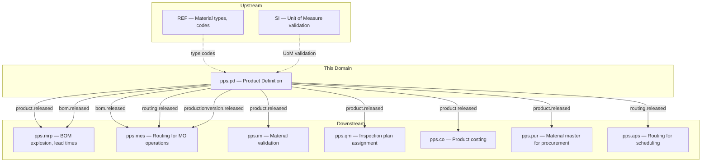
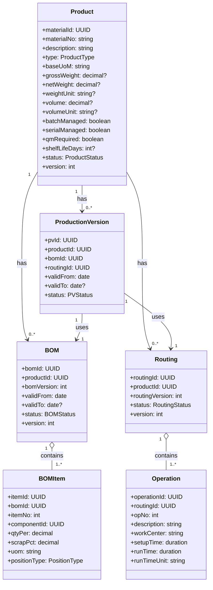
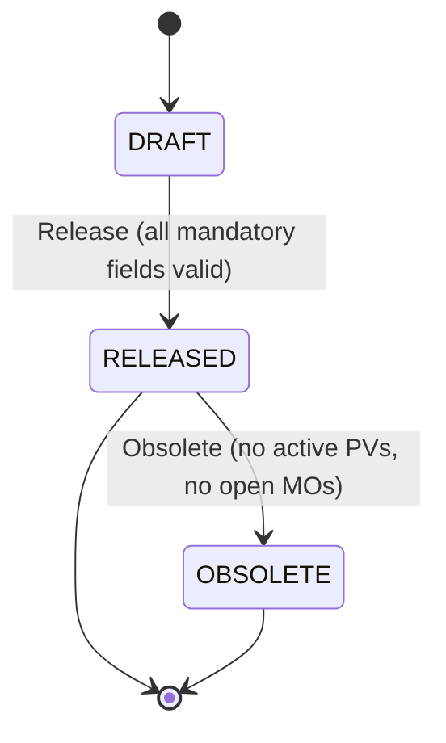
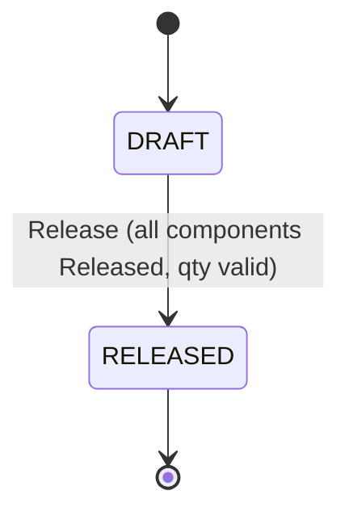
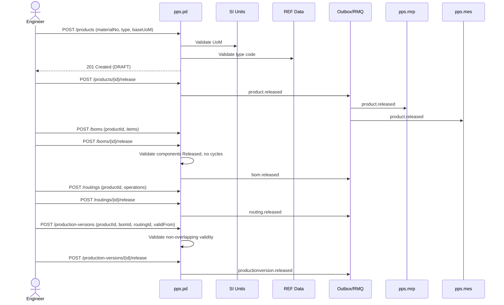
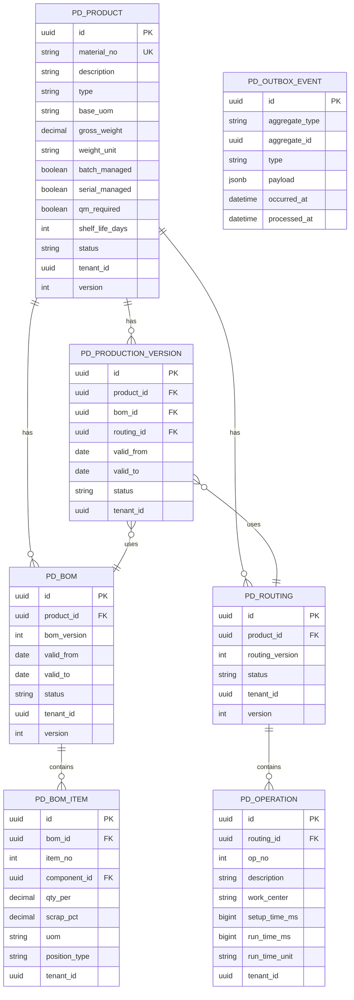

# PPS.PD - Product Definition Domain / Service Specification

> **Conceptual Stack Layer:** Domain / Service
> **Space:** Platform
> **Owner:** Domain Engineering Team
> **Schema alignment:** `service-layer.schema.json`
> **Companion files:** `openapi.yaml`, `*.schema.json` (event contracts)
> **Referenced by:** Platform-Feature Spec SS5 (backend dependencies), BFF Contract
> **Belongs to:** PPS Suite Spec (`_pps_suite.md`)

> **Meta Information**
> - **Version:** 2026-04-03
> - **Template:** `domain-service-spec.md` v1.0.0
> - **Template Compliance:** ~95%
> - **Author(s):** OpenLeap Architecture Team
> - **Status:** DRAFT
> - **Suite:** `pps`
> - **Domain:** `pd`
> - **Bounded Context Ref:** `bc:product-definition`
> - **Service ID:** `pps-pd-svc`
> - **basePackage:** `io.openleap.pps.pd`
> - **API Base Path:** `/api/pps/pd/v1`
> - **OpenLeap Starter Version:** `v1.0.0`
> - **Port:** OPEN QUESTION
> - **Repository:** OPEN QUESTION
> - **Tags:** `pps`, `pd`, `manufacturing`, `master-data`, `bom`, `routing`
> - **Team:**
>   - Name: `team-pps`
>   - Email: `pps-team@openleap.io`
>   - Slack: `#pps-team`

---

## Specification Guidelines Compliance

>
> ### Non-Negotiables
> - Never invent facts. If required info is missing, add an **OPEN QUESTION** entry.
> - Preserve intent and decisions. Only change meaning when explicitly requested.
> - Do not remove normative constraints unless they are explicitly replaced.
> - Keep the spec **self-contained**: no "see chat", no implicit context.
>
> ### Source of Truth Priority
> When sources conflict:
> 1. Spec (explicit) wins
> 2. Starter specs (implementation constraints) next
> 3. Guidelines (best practices) last
>
> ### Style Guide
> - Prefer short sentences and lists.
> - Use MUST/SHOULD/MAY for normative statements.
> - Keep terminology consistent (Aggregate, Domain Service, Application Service, Command, Event).
> - Avoid ambiguous words ("often", "maybe") unless explicitly noting uncertainty.

---

## 0. Document Purpose & Scope

### 0.1 Purpose
This specification defines the Product Definition domain, which manages all technical master data that defines what a product is and how it is manufactured. PD is the authoritative source of truth for product master records, bills of materials (BOMs), routings (operation sequences), and production versions (BOM-routing links). PD is a pure master-data domain -- it publishes versioned, stable data; it does not handle transactional execution.

### 0.2 Target Audience
- Product Owners & Business Stakeholders
- System Architects & Technical Leads
- Integration Engineers

### 0.3 Scope
**In Scope:**
- Product (material) master data management (finished, semi-finished, raw, service)
- Bill of Materials (BOM) management with versioning and validity periods
- Routing management (operations, work centers, setup/run times)
- Production Version management (linking product -> BOM -> routing with validity)
- Lifecycle management (Draft -> Released -> Obsolete)
- Validation services (component validation, BOM explosion readiness)
- Bulk import/export for migration scenarios

**Out of Scope:**
- Material requirements planning and demand calculation (MRP -- `pps.mrp`)
- Procurement and supplier management (PUR -- `pps.pur`)
- Inventory stock and goods movements (IM -- `pps.im`)
- Manufacturing order execution (MES -- `pps.mes`)
- Quality inspection plans (QM -- `pps.qm`)
- Product pricing (PRC -- `co.prc`)
- Variant configuration (future extension)
- CAD/PLM integration (future extension)
- Engineering Change Management / ECN/ECR workflows (future extension)

### 0.4 Related Documents
- `_pps_suite.md` - PPS Suite overview
- `pps_mrp-spec.md` - MRP (BOM consumer)
- `pps_mes-spec.md` - MES (routing/BOM consumer)
- `pps_im-spec.md` - Inventory Management (material validation)
- `SI_unit_service.md` - SI Unit Service (UoM validation)
- `REF_reference_data.md` - Reference Data (material types, work center codes)
- `DOMAIN_SPEC_TEMPLATE.md` - Template reference

---

## 1. Business Context

### 1.1 Domain Purpose
PD answers the fundamental engineering questions: "What is this product?" (material master), "What is it made of?" (BOM), and "How is it made?" (routing). Every downstream domain -- MRP for planning, MES for execution, IM for stock management, CO for costing -- depends on PD's master data as its foundation.

### 1.2 Business Value
- **Single Source of Truth:** One authoritative definition of every product, its composition, and its manufacturing process
- **Version Control:** Full history of BOM and routing changes enables auditability and traceability
- **Quality Gate:** Draft -> Released lifecycle ensures only validated master data reaches downstream systems
- **Scalability:** Supports >1M products with efficient search and bulk operations
- **Downstream Enablement:** Every PPS domain depends on PD; accurate PD data prevents cascading errors

### 1.3 Key Stakeholders
| Role | Responsibility | Primary Use Cases |
|------|----------------|-------------------|
| PLM / Manufacturing Engineer | Define products, BOMs, routings | Create/edit/release master data |
| Production Planner | Consume production versions for MRP/MES | Query released BOMs and routings |
| Quality Engineer | Define inspection-relevant product attributes | Query material profiles, BOM structure |
| ERP Administrator | Bulk import, migration, data governance | Bulk operations, audit history |
| Cost Accountant | Use BOM/routing for product costing | Query released BOM + routing for cost rollup |

### 1.4 Strategic Positioning



### 1.5 Service Context

| Property | Value |
|----------|-------|
| **Suite** | `pps` |
| **Domain** | `pd` |
| **Bounded Context** | `bc:product-definition` |
| **Service ID** | `pps-pd-svc` |
| **Base Package** | `io.openleap.pps.pd` |
| **Authoritative Sources** | PPS Suite Spec (`_pps_suite.md`), SAP PP / PLM module patterns |

**Responsibilities:**
- Product (material) master data management
- Bill of Materials (BOM) management with versioning and validity periods
- Routing management (operations, work centers, setup/run times)
- Production Version management (linking product -> BOM -> routing with validity)

**Authoritative Sources:**
| Source Type | Description | Access Pattern |
|-------------|-------------|----------------|
| REST API | Product, BOM, Routing, Production Version CRUD and queries | Synchronous |
| Database | Product master data (sole owner) | Direct (owner) |
| Events | product.released, bom.released, routing.released, productionversion.released | Asynchronous |

---

## 2. Service Identity

| Field | Value |
|-------|-------|
| **Service ID** | `pps-pd-svc` |
| **Display Name** | Product Definition Service |
| **Suite** | `pps` |
| **Domain** | `pd` |
| **Bounded Context Ref** | `bc:product-definition` |
| **Version** | 2026-04-03 |
| **Status** | DRAFT |
| **API Base Path** | `/api/pps/pd/v1` |
| **Repository** | OPEN QUESTION |
| **Tags** | `pps`, `pd`, `manufacturing`, `master-data`, `bom`, `routing` |
| **Team Name** | `team-pps` |
| **Team Email** | `pps-team@openleap.io` |
| **Team Slack** | `#pps-team` |

---

## 3. Domain Model

### 3.1 Conceptual Overview
PD has four aggregates: **Product** (the material master), **BOM** (what it's made of), **Routing** (how it's made), and **ProductionVersion** (which BOM + Routing combination is valid for a given date range). All four follow a Draft -> Released lifecycle ensuring data integrity before downstream consumption.

### 3.2 Core Concepts



### 3.3 Enumerations

| Enum | Values | Description |
|------|--------|-------------|
| ProductType | `FINISHED`, `SEMI_FINISHED`, `RAW`, `SERVICE`, `TRADING`, `NON_STOCK` | Material classification |
| ProductStatus | `DRAFT`, `RELEASED`, `OBSOLETE` | Product lifecycle |
| BOMStatus | `DRAFT`, `RELEASED` | BOM lifecycle |
| RoutingStatus | `DRAFT`, `RELEASED` | Routing lifecycle |
| PVStatus | `DRAFT`, `RELEASED`, `OBSOLETE` | Production version lifecycle |
| PositionType | `STANDARD`, `PHANTOM`, `CO_PRODUCT`, `BY_PRODUCT` | BOM item classification |

### 3.4 Aggregate Definitions

#### 3.4.1 Aggregate: Product

**Aggregate ID:** `agg:product`
**Business Purpose:** The material master record. Defines what a product is -- its identity, type, base unit, physical attributes, and management profiles (batch, serial, QM).

**Lifecycle States:**


**Invariants:**
- INV-PRD-001: `materialNo` is unique per tenant (BR-PD-001)
- INV-PRD-002: Once RELEASED, only description and physical attributes (weight, volume) can be updated. Type, baseUoM, and management profiles are immutable (BR-PD-002)
- INV-PRD-003: Released products cannot be deleted, only obsoleted (BR-PD-003)
- INV-PRD-004: Product can only be obsoleted if no active ProductionVersion references it and no open MOs exist (BR-PD-004)
- INV-PRD-005: `baseUoM` must be a valid UCUM code via SI service (BR-PD-005)

**Domain Events Emitted:**

| Event | Routing Key | When | Key Payload |
|-------|-------------|------|-------------|
| ProductReleased | `pps.pd.product.released` | DRAFT -> RELEASED | materialId, materialNo, type, baseUoM, batchManaged, serialManaged |

#### 3.4.2 Aggregate: BOM

**Aggregate ID:** `agg:bom`
**Business Purpose:** Defines the material composition of a product -- which components and how much of each are needed to produce one unit of the parent product.

**Lifecycle States:**


**Invariants:**
- INV-BOM-001: A BOM must reference exactly one Product
- INV-BOM-002: All BOMItem `componentId` references must point to Released products (BR-PD-006)
- INV-BOM-003: `qtyPer` must be > 0 (BR-PD-008)
- INV-BOM-004: `itemNo` unique within a BOM (BR-PD-010)
- INV-BOM-005: (productId, bomVersion) is unique per tenant
- INV-BOM-006: A product cannot be a component of its own BOM, direct or indirect (BR-PD-007)
- INV-BOM-007: 0 <= `scrapPct` <= 100 (BR-PD-009)
- INV-BOM-008: Released BOMs cannot be modified; create a new version instead (BR-PD-016)

**Domain Events Emitted:**

| Event | Routing Key | When | Key Payload |
|-------|-------------|------|-------------|
| BOMReleased | `pps.pd.bom.released` | DRAFT -> RELEASED | bomId, productId, bomVersion, items[] |

#### 3.4.3 Aggregate: Routing

**Aggregate ID:** `agg:routing`
**Business Purpose:** Defines the sequence of manufacturing operations for a product -- which work centers, in what order, and how long each step takes.

**Invariants:**
- INV-RTG-001: A routing must contain at least one operation to be released (BR-PD-011)
- INV-RTG-002: Operation numbers unique within a routing (BR-PD-012)
- INV-RTG-003: (productId, routingVersion) is unique per tenant
- INV-RTG-004: `workCenter` must be a valid code (REF or APS capacity model)
- INV-RTG-005: Released routings cannot be modified (BR-PD-016)

**Domain Events Emitted:**

| Event | Routing Key | When | Key Payload |
|-------|-------------|------|-------------|
| RoutingReleased | `pps.pd.routing.released` | DRAFT -> RELEASED | routingId, productId, routingVersion, operations[] |

#### 3.4.4 Aggregate: ProductionVersion

**Aggregate ID:** `agg:production-version`
**Business Purpose:** Links a product to a specific BOM and routing with a validity date range. This is the entry point for MES and MRP -- given a product and date, the production version tells them which BOM to explode and which routing to follow.

**Invariants:**
- INV-PV-001: For a given product, no two released production versions may have overlapping validity ranges (BR-PD-013). Enforced via PostgreSQL EXCLUDE constraint with btree_gist and application-level check
- INV-PV-002: Both the referenced BOM and routing must be in RELEASED status (BR-PD-014)
- INV-PV-003: BOM.productId and Routing.productId must match the PV's productId (BR-PD-015)

**Domain Events Emitted:**

| Event | Routing Key | When | Key Payload |
|-------|-------------|------|-------------|
| ProductionVersionReleased | `pps.pd.productionversion.released` | DRAFT -> RELEASED | pvId, productId, bomId, routingId, validFrom, validTo |

---

## 4. Business Rules & Constraints

### 4.1 Business Rules Catalog

| ID | Rule Name | Description | Scope | Enforcement | Error Code |
|----|-----------|-------------|-------|-------------|------------|
| BR-PD-001 | Unique Material Number | materialNo unique per tenant | Product | On create/update | `PD-VAL-001` |
| BR-PD-002 | No Edit After Release | Critical fields immutable after RELEASED | Product | On PATCH | `PD-BIZ-002` |
| BR-PD-003 | No Delete After Release | Released products only obsoleted | Product | On DELETE | `PD-BIZ-003` |
| BR-PD-004 | Obsolescence Guard | No active PVs, no open MOs for obsolete | Product | On obsolete | `PD-BIZ-004` |
| BR-PD-005 | UoM Validation | baseUoM must be valid UCUM via SI | Product | On create | `PD-VAL-005` |
| BR-PD-006 | Component Must Be Released | BOM items reference Released products only | BOM | On release | `PD-BIZ-006` |
| BR-PD-007 | No Circular BOM | Product cannot be its own component (any level) | BOM | On release | `PD-BIZ-007` |
| BR-PD-008 | Positive Quantity | qtyPer > 0 | BOMItem | On create/update | `PD-VAL-008` |
| BR-PD-009 | Scrap Range | 0 <= scrapPct <= 100 | BOMItem | On create/update | `PD-VAL-009` |
| BR-PD-010 | Unique ItemNo per BOM | itemNo unique within BOM | BOMItem | On create | `PD-VAL-010` |
| BR-PD-011 | At Least One Operation | Routing needs >= 1 operation for release | Routing | On release | `PD-BIZ-011` |
| BR-PD-012 | Unique OpNo per Routing | opNo unique within routing | Operation | On create | `PD-VAL-012` |
| BR-PD-013 | Non-Overlapping PV | No two released PVs overlap for same product | ProductionVersion | On release | `PD-BIZ-013` |
| BR-PD-014 | PV References Released | BOM and Routing must be Released for PV release | ProductionVersion | On release | `PD-BIZ-014` |
| BR-PD-015 | Same Product Consistency | PV's bomId and routingId must belong to same productId | ProductionVersion | On create | `PD-BIZ-015` |
| BR-PD-016 | Immutable After Release | Released BOMs and Routings cannot be modified | BOM, Routing | On PATCH | `PD-BIZ-016` |

### 4.2 Detailed Rule Definitions

#### BR-PD-002: No Edit After Release
**Context:** Downstream systems cache critical fields (type, baseUoM, management profiles). Changing them after release would cause data inconsistencies.
**Rule Statement:** Once a Product reaches RELEASED status, only `description` and physical attributes (`grossWeight`, `netWeight`, `volume`, `weightUnit`, `volumeUnit`) can be updated.
**Applies To:** Product aggregate
**Enforcement:** Domain service rejects PATCH commands targeting immutable fields on RELEASED products.
**Error Handling:**
- Code: `PD-BIZ-002`
- Message: `"Product {materialId} is released. Field '{field}' is immutable after release."`
- HTTP: 409 Conflict

#### BR-PD-007: No Circular BOM
**Context:** A circular BOM (where product A contains component B, and B's BOM contains A) would cause infinite explosion loops in MRP.
**Rule Statement:** A product MUST NOT appear as a component of its own BOM, at any level of nesting.
**Applies To:** BOM aggregate, on release
**Enforcement:** Recursive check on release.
**Error Handling:**
- Code: `PD-BIZ-007`
- Message: `"Circular reference detected: product {materialNo} is a component of its own BOM at level {level}."`
- HTTP: 422 Unprocessable Entity

### 4.3 Data Validation Rules

| Field | Validation Rule | Error Code | Error Message |
|-------|----------------|------------|---------------|
| materialNo | Required, unique per tenant, max 40 chars | `PD-VAL-001` | `"Material number required and must be unique"` |
| type | Required, valid ProductType enum | `PD-VAL-002` | `"Valid product type required"` |
| baseUoM | Required, valid UCUM code via SI service | `PD-VAL-005` | `"Valid UCUM unit of measure required"` |
| qtyPer | Required, > 0 | `PD-VAL-008` | `"Quantity per must be greater than zero"` |
| scrapPct | 0 <= value <= 100 | `PD-VAL-009` | `"Scrap percentage must be between 0 and 100"` |
| workCenter | Required on Operation, must be valid code | `PD-VAL-013` | `"Valid work center code required"` |

### 4.4 Reference Data Dependencies

| Catalog | Usage | Provider Service | Validation |
|---------|-------|-----------------|------------|
| Material Types | type field | ref-svc (T1) | Must exist and be active |
| Units of Measure (UCUM) | baseUoM, uom, weightUnit, volumeUnit | si-svc (T1) | Valid UCUM code |
| Work Centers | workCenter (Operation) | ref-svc or APS | Must exist |

---

## 5. Use Cases

### 5.1 Business Logic Placement

| Layer | Responsibilities |
|-------|-----------------|
| Application Service | Command validation, aggregate loading, event publishing, bulk import orchestration |
| Domain Service | Circular BOM check (cross-aggregate), non-overlapping PV validation (cross-aggregate) |
| Aggregate | State transitions, invariant enforcement, attribute validation |

### 5.2 Use Cases

#### UC-PD-001: Create and Release Product

| Field | Value |
|-------|-------|
| **ID** | UC-PD-001 |
| **Type** | WRITE |
| **Trigger** | REST |
| **Aggregate** | Product |
| **Domain Operation** | `Product.create()` then `Product.release()` |
| **Inputs** | materialNo, description, type, baseUoM, grossWeight?, netWeight?, weightUnit?, volume?, volumeUnit?, batchManaged, serialManaged, qmRequired, shelfLifeDays? |
| **Outputs** | Product in DRAFT state; then RELEASED after release action |
| **Events** | `ProductReleased` -> `pps.pd.product.released` (on release) |
| **REST** | `POST /api/pps/pd/v1/products` -> 201 Created; `POST /api/pps/pd/v1/products/{materialId}/release` -> 200 OK |
| **Idempotency** | Client-generated `Idempotency-Key` header on create |
| **Errors** | 400 (validation), 409 (duplicate materialNo BR-PD-001), 422 (BR-PD-005 invalid UoM) |

**Main Flow:**
1. Engineer creates product with materialNo, description, type, baseUoM, management flags
2. System validates UoM via SI service, type via REF
3. Product created in DRAFT status
4. Engineer completes all mandatory fields
5. Engineer releases product -> status RELEASED
6. System publishes `pps.pd.product.released`

#### UC-PD-002: Create and Release BOM

| Field | Value |
|-------|-------|
| **ID** | UC-PD-002 |
| **Type** | WRITE |
| **Trigger** | REST |
| **Aggregate** | BOM |
| **Domain Operation** | `BOM.create(items)` then `BOM.release()` |
| **Inputs** | productId, validFrom, validTo?, items[]{itemNo, componentId, qtyPer, scrapPct, uom, positionType} |
| **Outputs** | BOM in DRAFT state; then RELEASED after release action |
| **Events** | `BOMReleased` -> `pps.pd.bom.released` (on release) |
| **REST** | `POST /api/pps/pd/v1/boms` -> 201 Created; `POST /api/pps/pd/v1/boms/{bomId}/release` -> 200 OK |
| **Idempotency** | Idempotency-Key header on create |
| **Errors** | 422 (BR-PD-006 component not released, BR-PD-007 circular reference, BR-PD-008 invalid qty, BR-PD-009 scrap range) |

**Main Flow:**
1. Engineer creates BOM for a released product, adds BOMItems (components, quantities, scrap%)
2. System validates each component is a Released product
3. Engineer releases BOM -> system checks circular references, component validity
4. System publishes `pps.pd.bom.released`

#### UC-PD-003: Create and Release Routing

| Field | Value |
|-------|-------|
| **ID** | UC-PD-003 |
| **Type** | WRITE |
| **Trigger** | REST |
| **Aggregate** | Routing |
| **Domain Operation** | `Routing.create(operations)` then `Routing.release()` |
| **Inputs** | productId, operations[]{opNo, description, workCenter, setupTime, runTime, runTimeUnit} |
| **Outputs** | Routing in DRAFT state; then RELEASED after release action |
| **Events** | `RoutingReleased` -> `pps.pd.routing.released` (on release) |
| **REST** | `POST /api/pps/pd/v1/routings` -> 201 Created; `POST /api/pps/pd/v1/routings/{routingId}/release` -> 200 OK |
| **Idempotency** | Idempotency-Key header on create |
| **Errors** | 422 (BR-PD-011 no operations, BR-PD-012 duplicate opNo) |

**Main Flow:**
1. Engineer creates routing for a product, adds operations (opNo, work center, setup/run times)
2. System validates work center codes
3. Engineer releases routing -> system checks at least one operation
4. System publishes `pps.pd.routing.released`

#### UC-PD-004: Create and Release Production Version

| Field | Value |
|-------|-------|
| **ID** | UC-PD-004 |
| **Type** | WRITE |
| **Trigger** | REST |
| **Aggregate** | ProductionVersion |
| **Domain Operation** | `ProductionVersion.create()` then `ProductionVersion.release()` |
| **Inputs** | productId, bomId, routingId, validFrom, validTo? |
| **Outputs** | ProductionVersion in DRAFT state; then RELEASED after release action |
| **Events** | `ProductionVersionReleased` -> `pps.pd.productionversion.released` (on release) |
| **REST** | `POST /api/pps/pd/v1/production-versions` -> 201 Created; `POST /api/pps/pd/v1/production-versions/{pvId}/release` -> 200 OK |
| **Idempotency** | Idempotency-Key header on create |
| **Errors** | 422 (BR-PD-013 overlapping validity, BR-PD-014 BOM/routing not released, BR-PD-015 product mismatch) |

**Main Flow:**
1. Engineer creates PV linking product + released BOM + released routing + validity range
2. System checks non-overlapping validity, BOM/routing released, same product
3. Engineer releases PV
4. System publishes `pps.pd.productionversion.released`
5. MRP and MES consume this to know which BOM/routing to use

#### UC-PD-005: Bulk Import

| Field | Value |
|-------|-------|
| **ID** | UC-PD-005 |
| **Type** | WRITE |
| **Trigger** | REST |
| **Aggregate** | Product, BOM, Routing |
| **Domain Operation** | `BulkImportService.import(items[])` |
| **Inputs** | JSON array of products/BOMs/routings |
| **Outputs** | 207 Multi-Status with per-item results |
| **Events** | Per-item release events if items are released |
| **REST** | `POST /api/pps/pd/v1/products:bulk` -> 207 Multi-Status |
| **Idempotency** | Idempotency-Key header for safe retries |
| **Errors** | 207 with per-item 201/400/409/422 |

#### UC-PD-006: Query Products (READ)

| Field | Value |
|-------|-------|
| **ID** | UC-PD-006 |
| **Type** | READ |
| **Trigger** | REST |
| **Aggregate** | Product (read projection) |
| **Domain Operation** | Query projection |
| **Inputs** | q? (text search), type?, status?, changedSince?, page, size |
| **Outputs** | Paginated product list |
| **Events** | -- |
| **REST** | `GET /api/pps/pd/v1/products?...` -> 200 OK |
| **Idempotency** | Inherently idempotent (GET) |
| **Errors** | 400 (invalid filter params) |

#### UC-PD-007: Obsolete Product

| Field | Value |
|-------|-------|
| **ID** | UC-PD-007 |
| **Type** | WRITE |
| **Trigger** | REST |
| **Aggregate** | Product |
| **Domain Operation** | `Product.obsolete()` |
| **Inputs** | materialId |
| **Outputs** | Product in OBSOLETE state |
| **Events** | -- |
| **REST** | `POST /api/pps/pd/v1/products/{materialId}/obsolete` -> 200 OK |
| **Idempotency** | Idempotent (re-obsolete of OBSOLETE is no-op) |
| **Errors** | 409 (BR-PD-004 active PVs or open MOs exist) |

### 5.3 Process Flow Diagrams



### 5.4 Cross-Domain Workflows
**Does this domain participate in multi-service workflows?** Yes -- but PD is always the **publisher**, never the orchestrator. PD publishes master data events; downstream domains react independently (choreography).

---

## 6. REST API

### 6.1 API Overview

| Field | Value |
|-------|-------|
| Base Path | `/api/pps/pd/v1` |
| Authentication | OAuth2/JWT (Bearer token) |
| Authorization | Scopes: `pps.pd:read`, `pps.pd:write`, `pps.pd:approve`, `pps.pd:admin` |
| Content Type | `application/json` |
| Versioning | URL path (`v1`) |

### 6.2 Products
```
POST   /api/pps/pd/v1/products                              — Create draft product
GET    /api/pps/pd/v1/products?q={text}&type={type}&status={s}&changedSince={dt}&page=0&size=50
GET    /api/pps/pd/v1/products/{materialId}                  — Get product (view=basic|full)
PATCH  /api/pps/pd/v1/products/{materialId}                  — Update draft (If-Match required)
POST   /api/pps/pd/v1/products/{materialId}/release          — Release
POST   /api/pps/pd/v1/products/{materialId}/obsolete         — Obsolete
GET    /api/pps/pd/v1/products/{materialId}/versions          — Audit history
POST   /api/pps/pd/v1/products:bulk                           — Bulk create/update (207 Multi-Status)
```

**Create Product Request:**
```json
{
  "materialNo": "MAT-FIN-001",
  "description": "Finished Widget A",
  "type": "FINISHED",
  "baseUoM": "PC",
  "grossWeight": 1.250,
  "weightUnit": "KG",
  "batchManaged": true,
  "serialManaged": false,
  "qmRequired": true,
  "shelfLifeDays": 365
}
```

**Success Response:** `201 Created`
```json
{
  "materialId": "uuid",
  "materialNo": "MAT-FIN-001",
  "status": "DRAFT",
  "version": 1,
  "createdAt": "2026-02-24T10:00:00Z",
  "_links": { "self": { "href": "/api/pps/pd/v1/products/uuid" } }
}
```

### 6.3 BOMs
```
POST   /api/pps/pd/v1/boms                                   — Create draft BOM with items
GET    /api/pps/pd/v1/boms?productId={id}&status={s}&validOn={date}&page=0&size=50
GET    /api/pps/pd/v1/boms/{bomId}                            — Get BOM with items
PATCH  /api/pps/pd/v1/boms/{bomId}                            — Update header (validFrom, validTo)
PUT    /api/pps/pd/v1/boms/{bomId}/items/{itemNo}             — Upsert BOM item
DELETE /api/pps/pd/v1/boms/{bomId}/items/{itemNo}             — Remove BOM item
POST   /api/pps/pd/v1/boms/{bomId}/release                   — Release BOM
```

**Create BOM Request:**
```json
{
  "productId": "uuid",
  "validFrom": "2026-01-01",
  "items": [
    { "itemNo": 10, "componentId": "uuid-comp-1", "qtyPer": 2.000, "scrapPct": 1.5, "uom": "PC" },
    { "itemNo": 20, "componentId": "uuid-comp-2", "qtyPer": 0.500, "scrapPct": 0, "uom": "KG" }
  ]
}
```

### 6.4 Routings
```
POST   /api/pps/pd/v1/routings                                — Create draft routing with operations
GET    /api/pps/pd/v1/routings?productId={id}&status={s}&page=0&size=50
GET    /api/pps/pd/v1/routings/{routingId}                     — Get routing with operations
PUT    /api/pps/pd/v1/routings/{routingId}/operations/{opNo}   — Upsert operation
DELETE /api/pps/pd/v1/routings/{routingId}/operations/{opNo}   — Remove operation
POST   /api/pps/pd/v1/routings/{routingId}/release             — Release routing
```

### 6.5 Production Versions
```
POST   /api/pps/pd/v1/production-versions                     — Create PV
GET    /api/pps/pd/v1/production-versions?productId={id}&validOn={date}&page=0&size=50
GET    /api/pps/pd/v1/production-versions/{pvId}
POST   /api/pps/pd/v1/production-versions/{pvId}/release       — Release PV
POST   /api/pps/pd/v1/production-versions:validate             — Validate before creation
```

### 6.6 Validation & Utilities
```
POST   /api/pps/pd/v1/validation/components                    — Validate component list
GET    /api/pps/pd/v1/health                                   — Health/readiness
```

### 6.7 Error Responses

| HTTP Status | Error Code | Description |
|-------------|------------|-------------|
| 400 | `PD-VAL-*` | Validation error (field-level) |
| 401 | -- | Authentication required |
| 403 | -- | Forbidden (insufficient role) |
| 404 | -- | Resource not found |
| 409 | `PD-BIZ-002/003` | Conflict (editing released resource, duplicate materialNo) |
| 412 | -- | ETag mismatch (optimistic locking) |
| 422 | `PD-BIZ-*` | Domain validation failed (with detail: field, code, hint) |

---

## 7. Events & Integration

### 7.1 Event-Driven Architecture Pattern
**Pattern Used:** Choreography (EDA)
**Rationale:** PD publishes facts about master data changes. All consumers react independently.

### 7.2 Published Events
**Exchange:** `pps.pd.events` (topic, durable)

#### product.released
**Routing Key:** `pps.pd.product.released`
```json
{
  "materialId": "uuid",
  "materialNo": "MAT-FIN-001",
  "description": "Finished Widget A",
  "type": "FINISHED",
  "baseUoM": "PC",
  "batchManaged": true,
  "serialManaged": false,
  "qmRequired": true,
  "releasedAt": "2026-02-24T10:05:00Z"
}
```
**Known Consumers:**
| Consumer | Purpose |
|----------|---------|
| pps.mrp | Cache material master for planning |
| pps.mes | Cache material master for MO creation |
| pps.im | Validate material on movements |
| pps.pur | Material master for procurement |
| pps.qm | Inspection plan assignment trigger |
| pps.co | Product costing reference |
| pps.eam | Spare part master cache |

#### bom.released
**Routing Key:** `pps.pd.bom.released`
```json
{
  "bomId": "uuid",
  "productId": "uuid",
  "materialNo": "MAT-FIN-001",
  "bomVersion": 2,
  "validFrom": "2026-01-01",
  "validTo": null,
  "itemCount": 5,
  "items": [
    { "itemNo": 10, "componentId": "uuid", "componentNo": "MAT-RAW-001", "qtyPer": 2.000, "scrapPct": 1.5, "uom": "PC" }
  ]
}
```
**Known Consumers:** pps.mrp (BOM explosion), pps.mes (component list for MO), pps.co (material cost rollup)

#### routing.released
**Routing Key:** `pps.pd.routing.released`
```json
{
  "routingId": "uuid",
  "productId": "uuid",
  "materialNo": "MAT-FIN-001",
  "routingVersion": 1,
  "operations": [
    { "opNo": 10, "description": "CNC Machining", "workCenter": "WC-CNC-01", "setupTime": "PT30M", "runTime": "PT5M" }
  ]
}
```
**Known Consumers:** pps.mes (operations for MO), pps.aps (scheduling), pps.co (labor cost calculation)

#### productionversion.released
**Routing Key:** `pps.pd.productionversion.released`
```json
{
  "pvId": "uuid",
  "productId": "uuid",
  "materialNo": "MAT-FIN-001",
  "bomId": "uuid",
  "routingId": "uuid",
  "validFrom": "2026-01-01",
  "validTo": null
}
```
**Known Consumers:** pps.mes (resolve BOM+routing for MO creation), pps.mrp (planning)

### 7.3 Consumed Events
PD is primarily a publisher. It does not consume business events from other PPS domains. It may consume:

| Event | Source | Purpose |
|-------|--------|---------|
| (none currently) | -- | PD is upstream-only within PPS |

### 7.4 Integration Points Summary
**Upstream Dependencies (Synchronous):**
| Service | Purpose | Fallback |
|---------|---------|----------|
| si-svc | UoM validation (UCUM) | Cached unit list |
| ref-svc | Material type codes, work center codes | Cached reference data |

**Downstream Consumers (Event):**
| Service | SLA |
|---------|-----|
| pps.mrp, pps.mes, pps.im, pps.pur, pps.qm, pps.co, pps.aps, pps.eam | < 5 seconds |

---

## 8. Data Model

### 8.1 Conceptual Data Model



### 8.2 Key Indexes & Constraints
- **PD_PRODUCT:** `(tenant_id, material_no)` unique
- **PD_BOM:** `(tenant_id, product_id, bom_version)` unique
- **PD_BOM_ITEM:** `(bom_id, item_no)` unique; FK to PD_PRODUCT for component_id
- **PD_ROUTING:** `(tenant_id, product_id, routing_version)` unique
- **PD_OPERATION:** `(routing_id, op_no)` unique
- **PD_PRODUCTION_VERSION:** Non-overlapping validity via `EXCLUDE USING gist (tenant_id WITH =, product_id WITH =, daterange(valid_from, COALESCE(valid_to, 'infinity'), '[]') WITH &&)` -- requires btree_gist extension

### 8.3 Reference Data Dependencies
| Catalog | Source | Fields | Validation |
|---------|--------|--------|------------|
| Material Types | ref-svc | type | Must exist and be active |
| Units of Measure | si-svc | baseUoM, uom, weightUnit, volumeUnit | Valid UCUM code |
| Work Centers | ref-svc or APS | workCenter (Operation) | Must exist |

### 8.4 Data Retention

| Entity | Retention Period | Legal Basis | Action After Expiry |
|--------|-----------------|-------------|---------------------|
| PD_PRODUCT | Indefinite | Master data | n/a (obsolete, never delete) |
| PD_BOM | Indefinite | Manufacturing traceability | n/a |
| PD_ROUTING | Indefinite | Manufacturing traceability | n/a |
| PD_PRODUCTION_VERSION | Indefinite | Manufacturing traceability | n/a |
| PD_OUTBOX_EVENT | 30 days after publish | Operational | Delete |

---

## 9. Security & Compliance

### 9.1 Data Classification

| Data Element | Classification | Protection |
|--------------|----------------|------------|
| Material number, description | Internal | RLS, access control |
| BOM structure | Restricted | RLS, RBAC (competitive sensitivity) |
| Routing details | Restricted | RLS, RBAC (manufacturing IP) |

### 9.2 Access Control
| Role | Read | Create/Edit Draft | Release/Obsolete | Bulk Import | Admin |
|------|------|-------------------|------------------|-------------|-------|
| PD_VIEWER | x | -- | -- | -- | -- |
| PD_ENGINEER | x | x | -- | -- | -- |
| PD_APPROVER | x | x | x | -- | -- |
| PD_ADMIN | x | x | x | x | x |
| SYSTEM_APP | x | -- | -- | -- | -- |

**Segregation of Duties:** Engineer creates, Approver releases -- enforced by separate roles.

### 9.3 Compliance
| Regulation | Requirement | Implementation |
|------------|-------------|----------------|
| Auditability | Every change versioned | Full audit history via `/products/{id}/versions` |
| Immutability | Released data is append-only | New versions for changes |
| GDPR | PD does not contain personal data | No special handling needed |
| GxP/FDA | Versioning and release workflow | Draft -> Released lifecycle, full history |

---

## 10. Quality Attributes

### 10.1 Performance
- Product query: < 100ms (95th percentile)
- BOM retrieval: < 150ms
- Product search (full-text): < 200ms
- Bulk import (1000 products): < 30 seconds

### 10.2 Scalability
- Handle >1M products, >5M BOM items
- Read replicas for downstream query load
- Event throughput: 500 events/second

### 10.3 Availability
**Target:** 99.9% -- PD is critical master data; all PPS domains depend on it.

---

## 11. Feature Dependencies

### 11.1 Purpose
This section answers: "Which features depend on this service?" It is the inverse of Platform-Feature Spec SS5 and helps the domain team assess the blast radius of API changes.

### 11.2 Feature Dependency Register

> **OPEN QUESTION:** Feature dependencies will be populated when feature specs (Phase 3) are authored for the PPS suite. The following is a preliminary mapping based on expected feature compositions.

| Feature ID | Feature Name | Suite | Tier | Dependency Type | Status |
|------------|-------------|-------|------|-----------------|--------|
| F-PPS-PD-001 | Product Master CRUD | pps | core | sync_api | planned |
| F-PPS-PD-002 | BOM Management | pps | core | sync_api | planned |
| F-PPS-PD-003 | Routing Management | pps | core | sync_api | planned |
| F-PPS-PD-004 | Production Version Management | pps | core | sync_api | planned |
| F-PPS-PD-005 | Bulk Import | pps | supporting | sync_api | planned |

---

## 12. Extension Points

### 12.1 Purpose
Extension points follow the Open-Closed Principle: the service is open for extension via events and hooks but closed for direct modification.

### 12.2 Extension Events

| Event ID | Routing Key | Trigger | Payload | Purpose |
|----------|-------------|---------|---------|---------|
| EXT-PD-001 | `pps.pd.product.released` | Product released | Full product snapshot | External systems react to new/updated product master data (e.g., e-commerce catalog sync) |
| EXT-PD-002 | `pps.pd.bom.released` | BOM released | BOM with items | External systems react to BOM changes (e.g., cost estimation tools) |
| EXT-PD-003 | `pps.pd.routing.released` | Routing released | Routing with operations | External systems react to routing changes (e.g., capacity planning tools) |

### 12.3 Aggregate Hooks

| Hook ID | Aggregate | Lifecycle Point | Hook Type | Description |
|---------|-----------|-----------------|-----------|-------------|
| HOOK-PD-001 | Product | Pre-Release | validation | Custom validation rules per tenant (e.g., mandatory custom attributes, regulatory checks) |
| HOOK-PD-002 | BOM | Pre-Release | validation | Custom BOM validation (e.g., regulatory component restrictions, preferred supplier checks) |
| HOOK-PD-003 | Product | Post-Release | notification | Custom notification channels (e.g., PLM system sync, supplier notification) |
| HOOK-PD-004 | BOM | Post-Release | enrichment | Custom BOM enrichment (e.g., cost pre-calculation, alternative component suggestions) |

**Design Rules:**
- Hooks are fire-and-forget (notification) or bounded-timeout (validation: 2s, enrichment: 5s)
- Validation hooks fail-closed (block on timeout)
- Notification hooks fail-open (log and continue)
- Hooks do not modify aggregate state directly

### 12.4 Extension Points Summary

| ID | Type | Aggregate | Lifecycle Point | Fail Mode | Timeout |
|----|------|-----------|-----------------|-----------|---------|
| EXT-PD-001 | event | Product | released | n/a | n/a |
| EXT-PD-002 | event | BOM | released | n/a | n/a |
| EXT-PD-003 | event | Routing | released | n/a | n/a |
| HOOK-PD-001 | validation | Product | pre-release | fail-closed | 2s |
| HOOK-PD-002 | validation | BOM | pre-release | fail-closed | 2s |
| HOOK-PD-003 | notification | Product | post-release | fail-open | 5s |
| HOOK-PD-004 | enrichment | BOM | post-release | fail-open | 5s |

---

## 13. Migration & Evolution

### 13.1 Data Migration

**Legacy Source: SAP PP**

| Source | Target | Mapping | Notes |
|--------|--------|---------|-------|
| SAP MM01 (Material Master) | PD_PRODUCT | Map material types, UoMs | UoM normalization to UCUM required |
| SAP CS01 (BOM) | PD_BOM + PD_BOM_ITEM | Alternative BOMs -> separate BOM versions | Validity period mapping |
| SAP CA01 (Routing) | PD_ROUTING + PD_OPERATION | Map work centers | Duration format conversion |

**Migration Strategy:**
1. Export product master, BOMs, routings from legacy
2. Map legacy material types to PD ProductType enum
3. Normalize UoMs to UCUM codes via SI service
4. Import as DRAFT, validate, then release in batches
5. Validate: product counts, BOM item counts, routing operation counts must match source

### 13.2 Deprecation & Sunset

| Deprecated Feature | Replacement | Removal Timeline | Communication Plan |
|-------------------|-------------|------------------|-------------------|
| -- | -- | -- | -- |

### 13.3 Future Extensions
- Variant Configuration (product options/features)
- CAD/PLM integration (import BOMs from design tools)
- Engineering Change Management (ECN/ECR workflow with approval chain)
- Multi-level BOM explosion as a service endpoint
- Alternative BOM/routing selection rules
- Product classification / attributes framework

---

## 14. Decisions & Open Questions

### 14.1 Consistency Checks

| Check | Status | Notes |
|-------|--------|-------|
| Every WRITE endpoint maps to exactly one use case | x | UC-PD-001 through UC-PD-007 |
| Events in use cases appear in S7 with schema refs | x | All events documented |
| Business rules referenced in aggregate invariants | x | BR-PD-001 through BR-PD-016 |
| All aggregates have lifecycle states + transitions | x | Product, BOM, Routing (via PV) |

### 14.2 Open Questions

| ID | Question | Why It Matters | Suggested Options | Owner |
|----|----------|----------------|-------------------|-------|
| Q-001 | Variant configuration in PD or separate domain? | Product complexity | 1) PD extension, 2) Separate domain | Architecture Team |
| Q-002 | ECN/ECR workflow complexity? | Change management | 1) Simple approval, 2) Full workflow | Product Owner |
| Q-003 | Should PD expose a BOM explosion endpoint or leave to MRP? | API responsibility | Decided: MRP owns explosion | Architecture Team |

### 14.3 Architectural Decision Records

#### ADR-PD-001: Draft-Release Lifecycle
**Status:** Accepted
**Context:** Downstream systems cache master data and rely on it being stable. Publishing draft data would cause inconsistencies.
**Decision:** All aggregates follow Draft -> Released. Ensures only validated data reaches downstream systems.
**Consequences:**
- Positive: Data integrity, downstream confidence
- Negative: Two-step workflow (create, then release)

#### ADR-PD-002: Non-Overlapping Production Versions via DB Constraint
**Status:** Accepted
**Context:** Overlapping production versions for the same product would cause ambiguity in MRP/MES -- which BOM/routing to use?
**Decision:** Uses PostgreSQL EXCLUDE constraint with btree_gist for bulletproof validity enforcement.
**Consequences:**
- Positive: Database-enforced invariant, no race conditions
- Negative: Requires btree_gist extension

---

## 15. Appendix

### 15.1 Glossary
| Term | Definition | Aliases |
|------|------------|---------|
| BOM | Bill of Materials -- list of components for one unit | Stueckliste |
| Routing | Sequence of manufacturing operations | Arbeitsplan |
| Production Version | Link between Product, BOM, and Routing | Fertigungsversion |
| PLM | Product Lifecycle Management | -- |
| Phantom BOM | BOM item that is exploded through (not stocked) | Phantom-Position |
| Work Center | Machine or labor group where operations are performed | Arbeitsplatz |

### 15.2 References

| Type | Reference |
|------|-----------|
| Business | PPS Suite Spec (`_pps_suite.md`) |
| Technical | OpenLeap Starter (ADR-002 CQRS, ADR-013 Outbox, ADR-014 At-least-once) |
| External | UCUM (units of measure), ISO 8601 (durations), GS1 (product identification) |
| Schema | `contracts/http/pps/pd/openapi.yaml`, `contracts/events/pps/pd/*.schema.json` |

### 15.3 Change Log

| Date | Version | Author | Changes |
|------|---------|--------|---------|
| 2026-04-03 | 2.0 | Architecture Team | Full template compliance restructure -- added S2 Service Identity, canonical UC format, S11 Feature Dependencies, S12 Extension Points, correct section ordering, error codes |
| 2026-02-24 | 1.0 | OpenLeap Architecture Team | Initial version (replaces legacy PD_product_definition.md) |

### 15.4 Document Review & Approval

**Status:** DRAFT

| Role | Reviewer | Date | Status |
|------|----------|------|--------|
| Product Owner | -- | -- | Pending |
| Architecture Lead | -- | -- | Pending |
| CTO/VP Engineering | -- | -- | Pending |

**Approval:**
- [ ] Product Owner approved
- [ ] Architecture Lead approved
