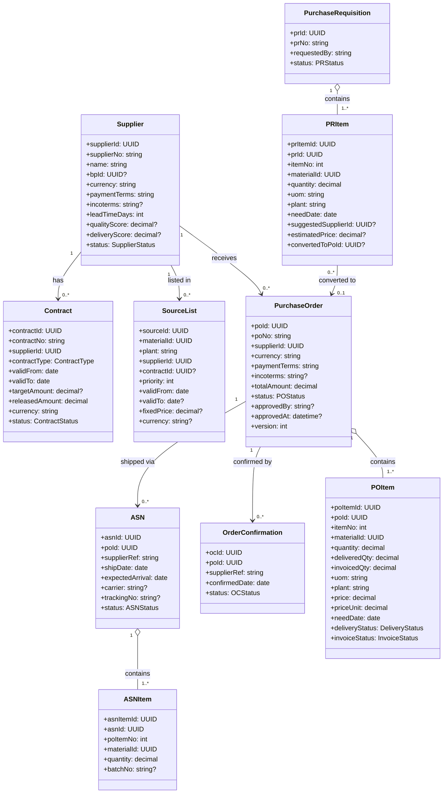
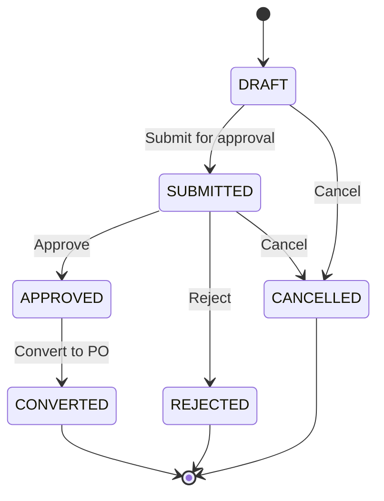
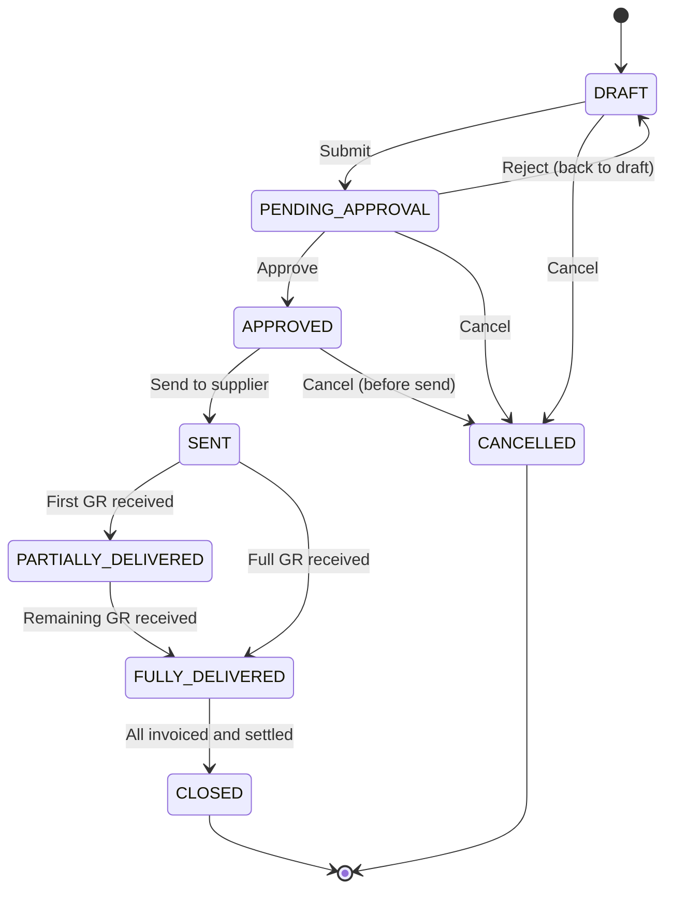
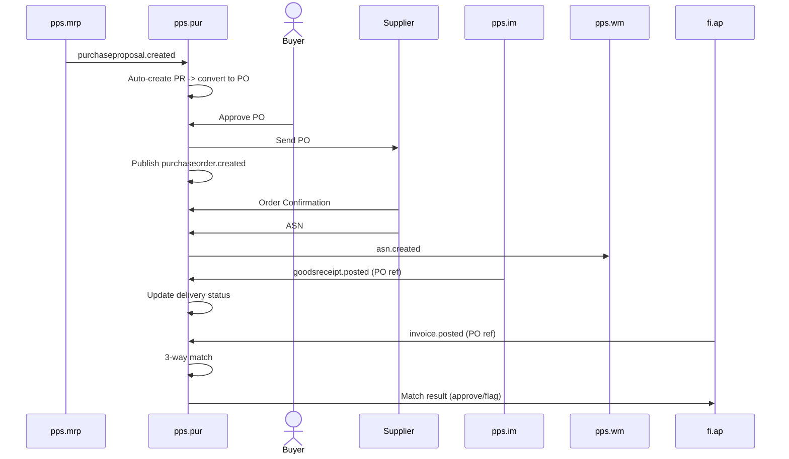

# Procurement (PUR) - Domain & Microservice Specification

> **Conceptual Stack Layer:** Domain / Service
> **Space:** Platform
> **Owner:** Domain Engineering Team
> **Schema alignment:** `service-layer.schema.json`
> **Companion files:** `openapi.yaml`, `*.schema.json` (event contracts)
> **Referenced by:** Platform-Feature Spec SS5 (backend dependencies), BFF Contract
> **Belongs to:** Suite Spec `_pps_suite.md`

> **Meta Information**
> - **Version:** 2026-04-01
> - **Template:** `domain-service-spec.md` v1.0.0
> - **Template Compliance:** ~95%
> - **Author(s):** OpenLeap Architecture Team
> - **Status:** DRAFT
> - **Suite:** `pps`
> - **Domain:** `pur`
> - **Bounded Context Ref:** `bc:procurement`
> - **Service ID:** `pps-pur-svc`
> - **basePackage:** `io.openleap.pps.pur`
> - **API Base Path:** `/api/pps/pur/v1`
> - **OpenLeap Starter Version:** `v1.0.0`
> - **Port:** `TBD`
> - **Repository:** `TBD`
> - **Tags:** `pps`, `pur`, `procurement`, `purchasing`
> - **Team:**
>   - Name: `team-pps`
>   - Email: `pps-team@openleap.io`
>   - Slack: `#pps-team`

---

## Specification Guidelines Compliance

> **This specification MUST comply with the OpenLeap specification guidelines.**
>
> ### Non-Negotiables
> - Never invent facts. If required info is missing, add an **OPEN QUESTION** entry.
> - Preserve intent and decisions. Only change meaning when explicitly requested.
> - Do not remove normative constraints unless they are explicitly replaced.
> - Keep the spec **self-contained**: no "see chat", no implicit context.
>
> ### Style Guide
> - Prefer short sentences and lists.
> - Use MUST/SHOULD/MAY for normative statements.
> - Keep terminology consistent (Aggregate, Domain Service, Application Service, Command, Event).
---

## 0. Document Purpose & Scope

### 0.1 Purpose
This specification defines the Procurement domain, which manages the end-to-end purchasing lifecycle: from supplier master data and purchase requisitions through purchase orders, order confirmations, advance shipping notices, and the coordination of goods receipt and invoice verification (3-way match). PUR converts MRP purchase proposals into executable purchase orders and manages the supplier relationship from a procurement perspective.

### 0.2 Target Audience
- Product Owners & Business Stakeholders
- System Architects & Technical Leads
- Integration Engineers

### 0.3 Scope
**In Scope:**
- Supplier master data management
- Purchase Requisition (PR) lifecycle
- Purchase Order (PO) lifecycle (creation, approval, amendment, closure)
- PO item scheduling (delivery schedules, split deliveries)
- Order Confirmation (OC) from supplier
- Advance Shipping Notice (ASN) processing
- Goods Receipt (GR) status tracking (actual GR posted by IM)
- Invoice verification coordination (3-way match: PO vs. GR vs. Invoice)
- Supplier evaluation (delivery performance, quality score)
- Source list / preferred supplier management
- Contract and framework agreement management (blanket POs)
- Procurement analytics events

**Out of Scope:**
- Stock ledger and goods movement posting (IM — `pps.im`)
- Invoice accounting and payment (FI.AP — `fi.ap`)
- Warehouse putaway operations (WM — `pps.wm`)
- Material requirements planning (MRP — `pps.mrp`)
- Product master data (PD — `pps.pd`)
- Quality inspection of received goods (QM — `pps.qm`)

### 0.4 Related Documents
- `_pps_suite.md` - PPS Suite overview
- `pps_mrp-spec.md` - MRP (purchase proposal source)
- `pps_im-spec.md` - Inventory Management (GR event source)
- `fi_acc_core_spec_complete.md` - FI Accounting (invoice/payment)
- `BP_business_partner.md` - Business Partner (supplier as BP)
- `DOMAIN_SPEC_TEMPLATE.md` - Template reference

---

## 1. Business Context

### 1.1 Domain Purpose
PUR manages "what to buy, from whom, at what price, and when." It takes demand signals (MRP purchase proposals or manual requests), converts them into formal purchase orders, tracks supplier confirmations and shipment notifications, and coordinates with IM (for goods receipt) and FI.AP (for invoice verification) to close the procurement cycle.

### 1.2 Business Value
- **Cost Control:** Competitive sourcing, contract pricing, and spend visibility
- **Supply Security:** Reliable supplier management and delivery tracking
- **Compliance:** Formal approval workflows, audit trail, segregation of duties
- **Automation:** MRP-driven procurement reduces manual effort
- **Cash Flow:** 3-way match prevents overpayment; payment terms optimization
- **Supplier Quality:** Performance tracking drives supplier improvement

### 1.3 Key Stakeholders
| Role | Responsibility | Primary Use Cases |
|------|----------------|-------------------|
| Procurement Specialist | Create and manage POs | PR→PO conversion, PO amendments |
| Procurement Manager | Approve POs, manage suppliers | PO approval, supplier evaluation |
| MRP Planner | Generate purchase proposals | Review and convert MRP proposals |
| Warehouse Operator | Receive goods (via IM) | GR triggers PO status update |
| Accounts Payable | Verify invoices | 3-way match coordination |
| Supplier | Confirm orders, send ASN | OC and ASN processing |

### 1.4 Strategic Positioning

```mermaid
graph TB
    subgraph "Demand Sources"
        MRP[pps.mrp — Purchase Proposals]
        MANUAL[Manual Requisitions]
    end
    subgraph "Master Data"
        PD[pps.pd — Material Master]
        BP[BP — Supplier Master]
        REF[REF — Currencies, Incoterms]
    end
    subgraph "This Domain"
        PUR[pps.pur — Procurement]
    end
    subgraph "Downstream"
        IM[pps.im — Goods Receipt]
        WM[pps.wm — Putaway (via ASN)]
        FI_AP[fi.ap — Invoice/Payment]
        CO[pps.co — Commitment accounting]
    end
    MRP -->|purchaseproposal.created| PUR
    MANUAL -->|PR creation| PUR
    PD -.->|material validation| PUR
    BP -.->|supplier data| PUR
    REF -.->|currencies, terms| PUR
    PUR -->|purchaseorder.created| IM
    PUR -->|purchaseorder.created| CO
    PUR -->|asn.created| WM
    PUR -->|purchaseorder.created| FI_AP
```

---

### 1.5 Service Context

| Property | Value |
|----------|-------|
| **Suite** | `pps` |
| **Domain** | `pur` |
| **Bounded Context** | `bc:procurement` |
| **Service ID** | `pps-pur-svc` |
| **Base Package** | `io.openleap.pps.pur` |

---

## 2. Service Identity

| Field | Value |
|-------|-------|
| **Service ID** | `pps-pur-svc` |
| **Display Name** | Procurement Service |
| **Suite** | `pps` |
| **Domain** | `pur` |
| **Bounded Context Ref** | `bc:procurement` |
| **Version** | 2026-04-01 |
| **Status** | DRAFT |
| **API Base Path** | `/api/pps/pur/v1` |
| **Repository** | TBD |
| **Tags** | `pps`, `pur`, `procurement`, `purchasing` |
| **Team Name** | `team-pps` |
| **Team Email** | `pps-team@openleap.io` |
| **Team Slack** | `#pps-team` |

---

## 3. Domain Model

### 3.1 Core Concepts



**Enumerations:**
| Enum | Values |
|------|--------|
| SupplierStatus | `ACTIVE`, `BLOCKED`, `INACTIVE` |
| PRStatus | `DRAFT`, `SUBMITTED`, `APPROVED`, `CONVERTED`, `REJECTED`, `CANCELLED` |
| POStatus | `DRAFT`, `PENDING_APPROVAL`, `APPROVED`, `SENT`, `PARTIALLY_DELIVERED`, `FULLY_DELIVERED`, `CLOSED`, `CANCELLED` |
| DeliveryStatus | `OPEN`, `PARTIALLY_DELIVERED`, `FULLY_DELIVERED`, `OVER_DELIVERED` |
| InvoiceStatus | `OPEN`, `PARTIALLY_INVOICED`, `FULLY_INVOICED` |
| OCStatus | `RECEIVED`, `ACCEPTED`, `REJECTED` |
| ASNStatus | `RECEIVED`, `IN_TRANSIT`, `DELIVERED`, `CANCELLED` |
| ContractType | `BLANKET`, `FRAMEWORK`, `SCHEDULING_AGREEMENT` |
| ContractStatus | `DRAFT`, `ACTIVE`, `EXPIRED`, `CANCELLED` |

### 3.2 Aggregate Definitions

#### 3.2.1 Supplier
**Business Rules:**
1. **Unique Supplier Number:** `supplierNo` unique per tenant.
2. **Block Effect:** BLOCKED suppliers cannot receive new POs.
3. **BP Link:** If BP module is active, supplierId links to a Business Partner record.

#### 3.2.2 PurchaseRequisition
**Lifecycle:**

**Business Rules:**
1. **At Least One Item:** PR must have at least one item to submit.
2. **Material Validation:** materialId must exist and be Released in PD.

#### 3.2.3 PurchaseOrder
**Lifecycle:**

**Business Rules:**
1. **Supplier Must Be Active:** Cannot create PO for BLOCKED or INACTIVE supplier.
2. **Approval Threshold:** POs above configured amount require manager approval.
3. **Over-Delivery Tolerance:** GR quantity exceeding PO item quantity beyond tolerance % triggers warning or rejection (configurable).
4. **Price Validation:** Item price must be > 0; if contract exists, price validated against contract terms.
5. **Amendment Audit:** Changes to SENT POs create an amendment record with reason.
6. **3-Way Match:** PO item is fully matched when deliveredQty >= quantity AND invoicedQty >= quantity (within tolerance).

#### 3.2.4 ASN (Advance Shipping Notice)
**Business Rules:**
1. **PO Reference:** ASN must reference a valid SENT or PARTIALLY_DELIVERED PO.
2. **Quantity Validation:** ASN item quantity + previously shipped <= PO item quantity (with tolerance).
3. **WM Trigger:** ASN creation triggers putaway pre-planning in WM.

#### 3.2.5 Contract
**Business Rules:**
1. **Release Tracking:** `releasedAmount` tracks cumulative PO amount against `targetAmount`.
2. **Validity Enforcement:** POs can only reference active contracts within their validity period.

---

## 4. Business Rules & Constraints

### 4.1 Business Rules Catalog

| ID | Rule | Scope | Enforcement |
|----|------|-------|-------------|
| BR-PUR-001 | Unique Supplier Number | Supplier | On create |
| BR-PUR-002 | Blocked supplier -> no new POs | PO | On create |
| BR-PUR-003 | Approval threshold | PO | On submit |
| BR-PUR-004 | Over-delivery tolerance | POItem | On GR event |
| BR-PUR-005 | Price > 0 | POItem | On create/update |
| BR-PUR-006 | Contract validity for PO reference | PO | On create |
| BR-PUR-007 | 3-way match tolerance | POItem | On invoice event |
| BR-PUR-008 | ASN quantity <= remaining PO quantity | ASN | On create |
| BR-PUR-009 | PR needs >= 1 item to submit | PR | On submit |
| BR-PUR-010 | Material must be Released in PD | PRItem, POItem | On create |
| BR-PUR-011 | Amendment audit trail for sent POs | PO | On PATCH after SENT |
| BR-PUR-012 | Contract release amount tracking | Contract | On PO creation |

---

## 5. Use Cases

### 5.1 Business Logic Placement

| Layer | Responsibilities |
|-------|-----------------|
| Application Service | Command validation, aggregate loading, event publishing, approval orchestration |
| Domain Service | 3-way match logic, supplier evaluation scoring, source list resolution |
| Aggregate | State transitions, invariant enforcement, attribute validation |

### 5.2 Use Cases

#### UC-PUR-001: MRP-Driven Procurement

| Field | Value |
|-------|-------|
| **ID** | UC-PUR-001 |
| **Type** | WRITE |
| **Trigger** | Event (`pps.mrp.purchaseproposal.created`) |
| **Aggregate** | PurchaseRequisition / PurchaseOrder |
| **Domain Operation** | `PurchaseRequisition.createFromProposal()` or `PurchaseOrder.createFromProposal()` |
| **Inputs** | materialId, quantity, uom, plant, needDate, suggestedSupplierId |
| **Outputs** | PR in SUBMITTED state (or PO in DRAFT if auto-PO configured) |
| **Events** | `pps.pur.purchaseorder.created` (after approval and send) |
| **REST** | Event-driven; review via `GET /api/pps/pur/v1/requisitions` |
| **Idempotency** | Deduplicated by plannedOrderId from source event |
| **Errors** | 422 (material not released, supplier not found in source list) |

#### UC-PUR-002: Manual Requisition

| Field | Value |
|-------|-------|
| **ID** | UC-PUR-002 |
| **Type** | WRITE |
| **Trigger** | REST |
| **Aggregate** | PurchaseRequisition |
| **Domain Operation** | `PurchaseRequisition.create()` |
| **Inputs** | items[] (materialId, quantity, uom, plant, needDate, suggestedSupplierId?) |
| **Outputs** | PR in DRAFT state |
| **Events** | -- |
| **REST** | `POST /api/pps/pur/v1/requisitions` -> 201 Created |
| **Idempotency** | Idempotency-Key header |
| **Errors** | 400 (validation), 422 (BR-PUR-009 no items, BR-PUR-010 material not released) |

#### UC-PUR-003: Convert PR to PO

| Field | Value |
|-------|-------|
| **ID** | UC-PUR-003 |
| **Type** | WRITE |
| **Trigger** | REST |
| **Aggregate** | PurchaseRequisition, PurchaseOrder |
| **Domain Operation** | `PurchaseRequisition.convert()` -> `PurchaseOrder.create()` |
| **Inputs** | prId, supplierId, currency, paymentTerms, incoterms?, contractId? |
| **Outputs** | PO in DRAFT state, PR in CONVERTED state |
| **Events** | -- |
| **REST** | `POST /api/pps/pur/v1/requisitions/{prId}/convert` -> 201 Created |
| **Idempotency** | Idempotent (re-convert of CONVERTED is no-op) |
| **Errors** | 404, 409 (PR not APPROVED), 422 (BR-PUR-002 supplier blocked) |

#### UC-PUR-004: Approve and Send PO

| Field | Value |
|-------|-------|
| **ID** | UC-PUR-004 |
| **Type** | WRITE |
| **Trigger** | REST |
| **Aggregate** | PurchaseOrder |
| **Domain Operation** | `PurchaseOrder.approve()`, `PurchaseOrder.send()` |
| **Inputs** | poId |
| **Outputs** | PO in APPROVED then SENT state |
| **Events** | `pps.pur.purchaseorder.created` |
| **REST** | `POST /api/pps/pur/v1/purchase-orders/{poId}/approve` -> 200, `POST .../send` -> 200 |
| **Idempotency** | Idempotent (re-approve/re-send is no-op) |
| **Errors** | 404, 409 (invalid state), 422 (BR-PUR-003 threshold not met) |

#### UC-PUR-005: Record Order Confirmation

| Field | Value |
|-------|-------|
| **ID** | UC-PUR-005 |
| **Type** | WRITE |
| **Trigger** | REST (Supplier portal / EDI) |
| **Aggregate** | OrderConfirmation |
| **Domain Operation** | `OrderConfirmation.create()` |
| **Inputs** | poId, supplierRef, confirmedDate |
| **Outputs** | OC in RECEIVED state |
| **Events** | -- |
| **REST** | `POST /api/pps/pur/v1/purchase-orders/{poId}/confirmations` -> 201 Created |
| **Idempotency** | Idempotency-Key header |
| **Errors** | 404 (PO not found), 409 (PO not SENT) |

#### UC-PUR-006: Record ASN

| Field | Value |
|-------|-------|
| **ID** | UC-PUR-006 |
| **Type** | WRITE |
| **Trigger** | REST (Supplier portal / EDI) |
| **Aggregate** | ASN |
| **Domain Operation** | `ASN.create()` |
| **Inputs** | poId, supplierRef, shipDate, expectedArrival, carrier?, trackingNo?, items[] |
| **Outputs** | ASN in RECEIVED state |
| **Events** | `pps.pur.asn.created` |
| **REST** | `POST /api/pps/pur/v1/purchase-orders/{poId}/asns` -> 201 Created |
| **Idempotency** | Idempotency-Key header |
| **Errors** | 404, 409 (PO not SENT/PARTIALLY_DELIVERED), 422 (BR-PUR-008 quantity exceeded) |

#### UC-PUR-007: Goods Receipt Processing

| Field | Value |
|-------|-------|
| **ID** | UC-PUR-007 |
| **Type** | WRITE |
| **Trigger** | Event (`pps.im.goodsreceipt.posted`) |
| **Aggregate** | PurchaseOrder |
| **Domain Operation** | `PurchaseOrder.recordGoodsReceipt()` |
| **Inputs** | poId, poItemNo, receivedQty |
| **Outputs** | Updated POItem.deliveredQty and deliveryStatus |
| **Events** | `pps.pur.purchaseorder.updated` |
| **REST** | Event-driven |
| **Idempotency** | Deduplicated by goodsReceiptId from source event |
| **Errors** | 422 (BR-PUR-004 over-delivery tolerance exceeded) |

#### UC-PUR-008: Invoice Verification (3-Way Match)

| Field | Value |
|-------|-------|
| **ID** | UC-PUR-008 |
| **Type** | WRITE |
| **Trigger** | Event (`fi.ap.invoice.posted`) |
| **Aggregate** | PurchaseOrder |
| **Domain Operation** | `PurchaseOrder.verifyInvoice()` |
| **Inputs** | poId, poItemNo, invoicedQty, invoicedAmount |
| **Outputs** | Updated POItem.invoiceStatus; match result |
| **Events** | `pps.pur.invoicemismatch.detected` (on mismatch) |
| **REST** | Event-driven |
| **Idempotency** | Deduplicated by invoiceId from source event |
| **Errors** | 422 (BR-PUR-007 3-way match tolerance exceeded) |

#### UC-PUR-009: Supplier Evaluation

| Field | Value |
|-------|-------|
| **ID** | UC-PUR-009 |
| **Type** | READ + WRITE (background) |
| **Trigger** | Event (GR posted, QM decision) / REST query |
| **Aggregate** | Supplier |
| **Domain Operation** | `Supplier.updateEvaluation()` |
| **Inputs** | Delivery performance data, quality rejection data |
| **Outputs** | Updated supplier qualityScore, deliveryScore |
| **Events** | `pps.pur.supplierquality.updated` |
| **REST** | `GET /api/pps/pur/v1/suppliers/{supplierId}/evaluation` -> 200 OK |
| **Idempotency** | Evaluation is cumulative and recalculated |
| **Errors** | 404 (supplier not found) |

### 5.3 Process Flow Diagrams



### 5.4 Cross-Domain Workflows

**Does this domain participate in multi-service workflows?** Yes

#### Workflow: MRP-to-Procurement (CHR-PUR-001)
**Orchestration Pattern:** Choreography (EDA)
**Pattern Rationale:** MRP publishes purchase proposals; PUR reacts independently. No distributed transaction needed.

#### Workflow: Procure-to-Pay (CHR-PUR-002)
**Orchestration Pattern:** Choreography (EDA)
**Pattern Rationale:** PO -> GR -> Invoice follows a sequential flow across PUR, IM, and FI.AP. Each step is independently processable with eventual consistency.

---

## 6. REST API

### 6.1 API Overview
**Base Path:** `/api/pps/pur/v1`
**Auth:** OAuth2/JWT — `pps.pur:read`, `pps.pur:write`, `pps.pur:approve`, `pps.pur:admin`

### 6.2 Resource Operations

#### Suppliers
```
POST   /api/pps/pur/v1/suppliers
GET    /api/pps/pur/v1/suppliers?q={text}&status={s}&page=0&size=50
GET    /api/pps/pur/v1/suppliers/{supplierId}
PATCH  /api/pps/pur/v1/suppliers/{supplierId}
POST   /api/pps/pur/v1/suppliers/{supplierId}/block
POST   /api/pps/pur/v1/suppliers/{supplierId}/unblock
GET    /api/pps/pur/v1/suppliers/{supplierId}/evaluation
```

#### Source Lists
```
POST   /api/pps/pur/v1/source-lists
GET    /api/pps/pur/v1/source-lists?materialId={id}&plant={code}
PATCH  /api/pps/pur/v1/source-lists/{sourceId}
DELETE /api/pps/pur/v1/source-lists/{sourceId}
```

#### Purchase Requisitions
```
POST   /api/pps/pur/v1/requisitions
GET    /api/pps/pur/v1/requisitions?status={s}&requestedBy={user}&page=0&size=50
GET    /api/pps/pur/v1/requisitions/{prId}
PATCH  /api/pps/pur/v1/requisitions/{prId}
POST   /api/pps/pur/v1/requisitions/{prId}/submit
POST   /api/pps/pur/v1/requisitions/{prId}/approve
POST   /api/pps/pur/v1/requisitions/{prId}/reject
POST   /api/pps/pur/v1/requisitions/{prId}/convert           — Convert to PO
POST   /api/pps/pur/v1/requisitions/{prId}/cancel
```

#### Purchase Orders
```
POST   /api/pps/pur/v1/purchase-orders
GET    /api/pps/pur/v1/purchase-orders?supplierId={id}&status={s}&materialId={id}&page=0&size=50
GET    /api/pps/pur/v1/purchase-orders/{poId}
PATCH  /api/pps/pur/v1/purchase-orders/{poId}                 — Amend (If-Match)
POST   /api/pps/pur/v1/purchase-orders/{poId}/submit           — Submit for approval
POST   /api/pps/pur/v1/purchase-orders/{poId}/approve
POST   /api/pps/pur/v1/purchase-orders/{poId}/send             — Mark as sent
POST   /api/pps/pur/v1/purchase-orders/{poId}/close
POST   /api/pps/pur/v1/purchase-orders/{poId}/cancel
GET    /api/pps/pur/v1/purchase-orders/{poId}/amendments       — Amendment history
```

**Create PO Request:**
```json
{
  "supplierId": "uuid",
  "currency": "EUR",
  "paymentTerms": "NET30",
  "incoterms": "DDP",
  "contractId": "uuid",
  "items": [
    {
      "itemNo": 10,
      "materialId": "uuid",
      "quantity": 500.000,
      "uom": "KG",
      "plant": "P100",
      "price": 12.50,
      "priceUnit": 1,
      "needDate": "2026-03-15"
    }
  ]
}
```

#### Order Confirmations
```
POST   /api/pps/pur/v1/purchase-orders/{poId}/confirmations
GET    /api/pps/pur/v1/purchase-orders/{poId}/confirmations
```

#### ASNs
```
POST   /api/pps/pur/v1/purchase-orders/{poId}/asns
GET    /api/pps/pur/v1/asns?poId={id}&status={s}&page=0&size=50
GET    /api/pps/pur/v1/asns/{asnId}
```

#### Contracts
```
POST   /api/pps/pur/v1/contracts
GET    /api/pps/pur/v1/contracts?supplierId={id}&status={s}&page=0&size=50
GET    /api/pps/pur/v1/contracts/{contractId}
PATCH  /api/pps/pur/v1/contracts/{contractId}
```

---

## 7. Events & Integration

### 7.1 Published Events
**Exchange:** `pps.pur.events` (topic, durable)

#### purchaseorder.created
**Key:** `pps.pur.purchaseorder.created`
```json
{
  "poId": "uuid", "poNo": "PO-4500012345",
  "supplierId": "uuid", "supplierNo": "SUP-001",
  "currency": "EUR", "totalAmount": 6250.00,
  "items": [
    { "itemNo": 10, "materialId": "uuid", "materialNo": "MAT-RAW-001",
      "quantity": 500.000, "uom": "KG", "plant": "P100",
      "price": 12.50, "needDate": "2026-03-15" }
  ]
}
```
**Consumers:** pps.im (expected receipt for ATP), pps.co (commitment), fi.ap (PO reference)

#### purchaseorder.updated
**Key:** `pps.pur.purchaseorder.updated`
**Consumers:** pps.im, fi.ap

#### asn.created
**Key:** `pps.pur.asn.created`
```json
{
  "asnId": "uuid", "poId": "uuid", "poNo": "PO-4500012345",
  "supplierRef": "SHP-2026-789",
  "expectedArrival": "2026-03-14",
  "items": [
    { "poItemNo": 10, "materialId": "uuid", "quantity": 500.000, "batchNo": "VB-2026-100" }
  ]
}
```
**Consumers:** pps.wm (putaway pre-planning), pps.im (expected receipt update)

#### invoicemismatch.detected
**Key:** `pps.pur.invoicemismatch.detected`
**Consumer:** fi.ap (block payment for review)

#### supplierquality.updated
**Key:** `pps.pur.supplierquality.updated`
**Consumer:** T4 BI

### 7.2 Consumed Events
| Event | Source | Queue | Logic |
|-------|--------|-------|-------|
| `pps.mrp.purchaseproposal.created` | pps.mrp | `pps.pur.in.pps.mrp.purchaseproposal` | Auto-create PR or PO |
| `pps.im.goodsreceipt.posted` | pps.im | `pps.pur.in.pps.im.goodsreceipt` | Update PO delivery status |
| `fi.ap.invoice.posted` | fi.ap | `pps.pur.in.fi.ap.invoice` | 3-way match, update invoice status |
| `pps.qm.qualitydecision.posted` | pps.qm | `pps.pur.in.pps.qm.qualitydecision` | Update supplier quality score |
| `pps.pd.product.released` | pps.pd | `pps.pur.in.pps.pd.product` | Cache material master |

---

## 8. Data Model

```mermaid
erDiagram
    SUPPLIER ||--o{ PURCHASE_ORDER : receives
    SUPPLIER ||--o{ SOURCE_LIST : "listed in"
    SUPPLIER ||--o{ CONTRACT : has
    PURCHASE_REQUISITION ||--o{ PR_ITEM : contains
    PURCHASE_ORDER ||--o{ PO_ITEM : contains
    PURCHASE_ORDER ||--o{ ORDER_CONFIRMATION : "confirmed by"
    PURCHASE_ORDER ||--o{ ASN : "shipped via"
    ASN ||--o{ ASN_ITEM : contains

    SUPPLIER { uuid id PK; string supplier_no UK; string name; uuid bp_id; string currency; string payment_terms; string status; decimal quality_score; decimal delivery_score; uuid tenant_id; int version }
    SOURCE_LIST { uuid id PK; uuid material_id; string plant; uuid supplier_id FK; uuid contract_id FK; int priority; date valid_from; date valid_to; uuid tenant_id }
    PURCHASE_REQUISITION { uuid id PK; string pr_no UK; string requested_by; string status; uuid tenant_id; int version }
    PR_ITEM { uuid id PK; uuid pr_id FK; int item_no; uuid material_id; decimal quantity; string uom; string plant; date need_date; uuid suggested_supplier_id; uuid converted_to_po_id; uuid tenant_id }
    PURCHASE_ORDER { uuid id PK; string po_no UK; uuid supplier_id FK; string currency; string payment_terms; decimal total_amount; string status; string approved_by; uuid tenant_id; int version }
    PO_ITEM { uuid id PK; uuid po_id FK; int item_no; uuid material_id; decimal quantity; decimal delivered_qty; decimal invoiced_qty; string uom; string plant; decimal price; date need_date; string delivery_status; string invoice_status; uuid tenant_id }
    ORDER_CONFIRMATION { uuid id PK; uuid po_id FK; string supplier_ref; date confirmed_date; string status; uuid tenant_id }
    ASN { uuid id PK; uuid po_id FK; string supplier_ref; date ship_date; date expected_arrival; string carrier; string tracking_no; string status; uuid tenant_id }
    ASN_ITEM { uuid id PK; uuid asn_id FK; int po_item_no; uuid material_id; decimal quantity; string batch_no; uuid tenant_id }
    CONTRACT { uuid id PK; string contract_no UK; uuid supplier_id FK; string contract_type; date valid_from; date valid_to; decimal target_amount; decimal released_amount; string currency; string status; uuid tenant_id; int version }
```

---

## 9. Security & Compliance

| Role | Read | Create PR | Create/Edit PO | Approve PO | Manage Suppliers | Admin |
|------|------|----------|----------------|-----------|-----------------|-------|
| PUR_VIEWER | ✓ | ✗ | ✗ | ✗ | ✗ | ✗ |
| PUR_REQUESTER | ✓ | ✓ | ✗ | ✗ | ✗ | ✗ |
| PUR_BUYER | ✓ | ✓ | ✓ | ✗ | ✗ | ✗ |
| PUR_MANAGER | ✓ | ✓ | ✓ | ✓ | ✓ | ✗ |
| PUR_ADMIN | ✓ | ✓ | ✓ | ✓ | ✓ | ✓ |

**Segregation of Duties:** Requester creates PR, Buyer converts to PO, Manager approves.
**Compliance:** SOX (approval trail), GDPR (supplier contact data erasure endpoint).

---

## 10. Quality Attributes
- PO creation: < 200ms; PO query: < 100ms
- 3-way match: < 500ms
- Availability: 99.9%

---

## 11. Feature Dependencies

### 11.1 Purpose
This section answers: "Which features depend on this service?" It is the inverse of Platform-Feature Spec SS5 and helps the domain team assess the blast radius of API changes.

### 11.2 Feature Dependency Register

> **OPEN QUESTION:** Feature dependencies will be populated when feature specs (Phase 3) are authored for the PPS suite. The following is a preliminary mapping based on expected feature compositions.

| Feature ID | Feature Name | Suite | Tier | Dependency Type | Status |
|------------|-------------|-------|------|-----------------|--------|
| F-PPS-TBD | MRP-Driven Procurement | pps | core | async_event | planned |
| F-PPS-TBD | Manual Requisition | pps | core | sync_api | planned |
| F-PPS-TBD | PO Approval Workflow | pps | core | sync_api | planned |
| F-PPS-TBD | ASN Processing | pps | supporting | sync_api + async_event | planned |
| F-PPS-TBD | Invoice Verification | pps | core | async_event | planned |
| F-PPS-TBD | Supplier Evaluation | pps | supporting | sync_api + async_event | planned |
| F-PPS-TBD | Contract Management | pps | supporting | sync_api | planned |

---

## 12. Extension Points

### 12.1 Purpose
Extension points follow the Open-Closed Principle: the service is open for extension via events and hooks but closed for direct modification.

### 12.2 Extension Events

| Event ID | Routing Key | Trigger | Payload | Purpose |
|----------|-------------|---------|---------|---------|
| EXT-PUR-001 | `pps.pur.purchaseorder.created` | PO sent to supplier | Full PO snapshot with items | External ERP/EDI systems can react to new purchase orders |
| EXT-PUR-002 | `pps.pur.asn.created` | ASN recorded | ASN details with items | Warehouse/logistics systems can pre-plan putaway |
| EXT-PUR-003 | `pps.pur.invoicemismatch.detected` | 3-way match failed | Mismatch details | External approval/workflow systems can handle exceptions |
| EXT-PUR-004 | `pps.pur.supplierquality.updated` | Supplier score recalculated | Supplier scores | External SRM systems can react to score changes |

### 12.3 Aggregate Hooks

| Hook ID | Aggregate | Lifecycle Point | Hook Type | Description |
|---------|-----------|-----------------|-----------|-------------|
| HOOK-PUR-001 | PurchaseOrder | Pre-Approve | validation | Custom approval rules per tenant (e.g., budget checks, category-based routing) |
| HOOK-PUR-002 | PurchaseOrder | Post-Send | notification | Custom notification channels to supplier (EDI, cXML, email, portal webhook) |
| HOOK-PUR-003 | PurchaseOrder | Pre-Create | enrichment | Custom enrichment (e.g., auto-populate payment terms from supplier master, apply contract pricing) |
| HOOK-PUR-004 | ASN | Post-Create | notification | Custom notification to warehouse for putaway pre-planning |

**Design Rules:**
- Hooks are fire-and-forget (notification) or bounded-timeout (validation: 2s, enrichment: 5s)
- Validation hooks fail-closed (block on timeout)
- Notification hooks fail-open (log and continue)
- Hooks do not modify aggregate state directly

### 12.4 Extension Points Summary

| ID | Type | Aggregate | Lifecycle Point | Fail Mode | Timeout |
|----|------|-----------|-----------------|-----------|---------|
| EXT-PUR-001 | event | PurchaseOrder | sent | n/a | n/a |
| EXT-PUR-002 | event | ASN | created | n/a | n/a |
| EXT-PUR-003 | event | PurchaseOrder | invoice-mismatch | n/a | n/a |
| EXT-PUR-004 | event | Supplier | quality-updated | n/a | n/a |
| HOOK-PUR-001 | validation | PurchaseOrder | pre-approve | fail-closed | 2s |
| HOOK-PUR-002 | notification | PurchaseOrder | post-send | fail-open | 5s |
| HOOK-PUR-003 | enrichment | PurchaseOrder | pre-create | fail-open | 5s |
| HOOK-PUR-004 | notification | ASN | post-create | fail-open | 5s |

---

## 13. Migration & Evolution

### 13.1 Data Migration

**Legacy Source:** Procurement data typically migrates from legacy ERP systems (SAP MM, Oracle Purchasing).

| Legacy Entity | Target Entity | Migration Strategy | Notes |
|---------------|---------------|--------------------|-------|
| Supplier master | Supplier | Bulk import via API | Map legacy vendor codes to supplierNo; link to BP if available |
| Source lists | SourceList | Bulk import via API | Map legacy info records to source list entries |
| Open PRs | PurchaseRequisition | Migrate active PRs only | Closed/cancelled PRs archived in legacy |
| Open POs | PurchaseOrder | Migrate SENT and PARTIALLY_DELIVERED POs | Fully delivered/closed POs archived in legacy |
| Contracts | Contract | Migrate active contracts | Expired contracts not migrated |

### 13.2 Deprecation & Sunset

| Deprecated Feature | Replacement | Removal Timeline | Communication Plan |
|-------------------|-------------|------------------|-------------------|
| -- | -- | -- | -- |

### 13.3 Future Extensions

- EDI integration for PO/OC/ASN (EDIFACT, cXML) -- Phase 2
- Supplier self-service portal (OC, ASN, invoice upload) -- Phase 2
- Automated sourcing (RFQ process, bid comparison)
- Catalog-based procurement (punch-out to supplier catalogs)
- Multi-currency handling with real-time exchange rate integration

---

## 14. Decisions & Open Questions

### 14.1 Open Questions

| ID | Question | Status |
|----|----------|--------|
| Q-001 | EDI integration for PO/OC/ASN (EDIFACT, cXML)? | Open — Phase 2 |
| Q-002 | Supplier portal (self-service OC/ASN/invoice)? | Open — Phase 2 |
| Q-003 | Automatic PO generation from MRP without PR step? | Decided — configurable per material |
| Q-004 | Multi-currency handling and exchange rate integration? | Open — Phase 1 |

### 14.2 Architectural Decision Records

### ADR-PUR-001: PR Optional for MRP-Driven Procurement
**Status:** Accepted. MRP proposals can auto-create POs directly (skipping PR) if configured. Manual procurement always uses PR → PO flow.

---

## 15. Appendix

### 15.1 Glossary
| Term | Definition | Aliases |
|------|------------|---------|
| PR | Purchase Requisition — internal request to buy | Bestellanforderung (BANF) |
| PO | Purchase Order — formal order to supplier | Bestellung |
| ASN | Advance Shipping Notice — supplier's shipment notification | Lieferavis |
| OC | Order Confirmation — supplier confirms PO | Auftragsbestätigung |
| 3-Way Match | PO vs. GR vs. Invoice verification | Dreifacher Abgleich |
| Source List | Preferred suppliers per material | Bezugsquellenliste |
| Blanket PO | Framework contract with release orders | Rahmenvertrag |

### 15.2 Change Log
| Date | Version | Author | Changes |
|------|---------|--------|---------|
| 2026-02-24 | 1.0 | OpenLeap Architecture Team | Initial version (replaces legacy PUR_procurement.md) |

---

## Document Review & Approval
**Status:** DRAFT
