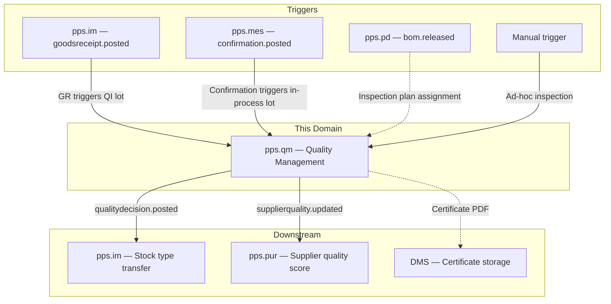
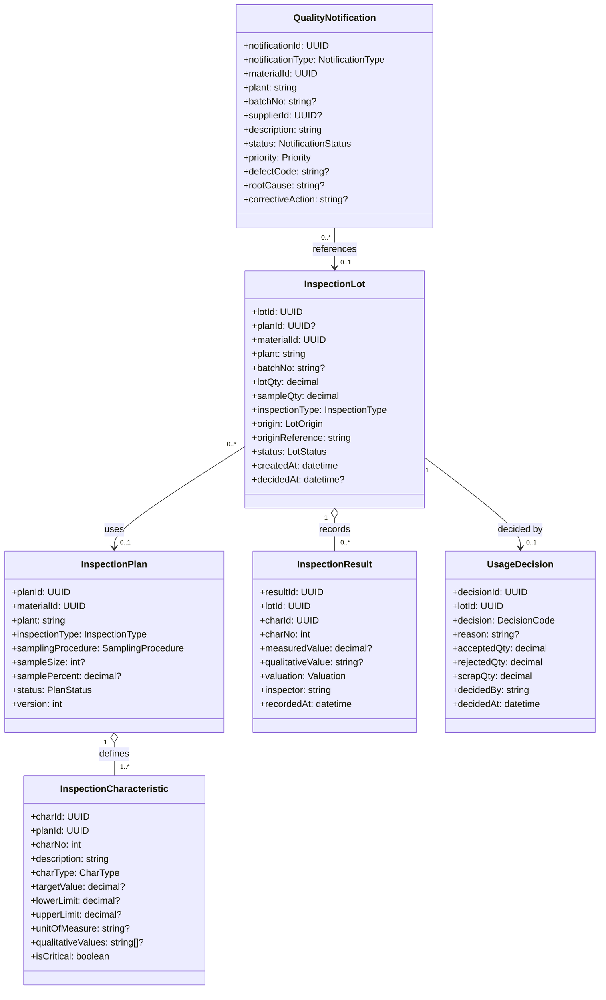
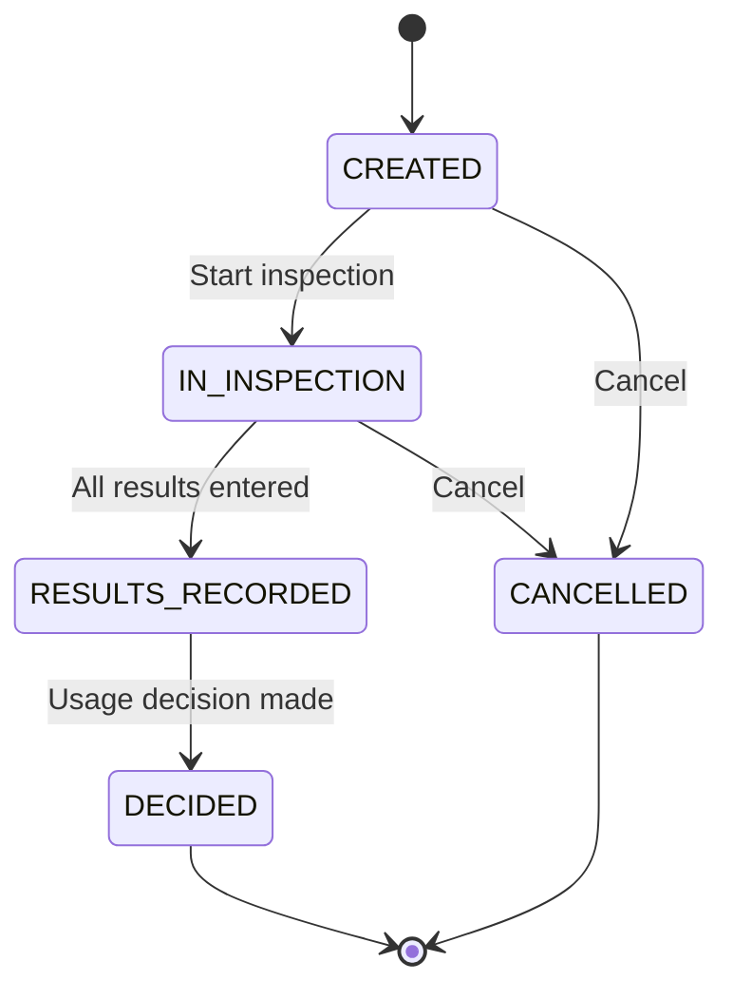
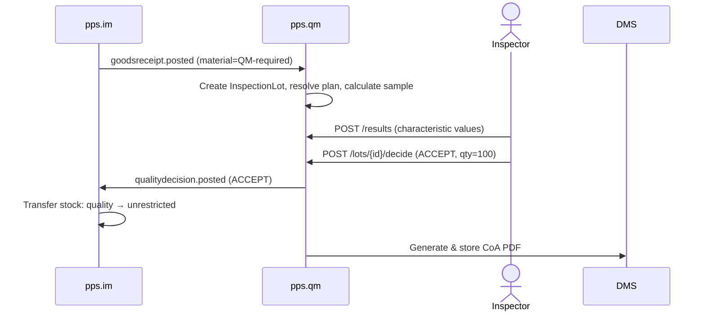
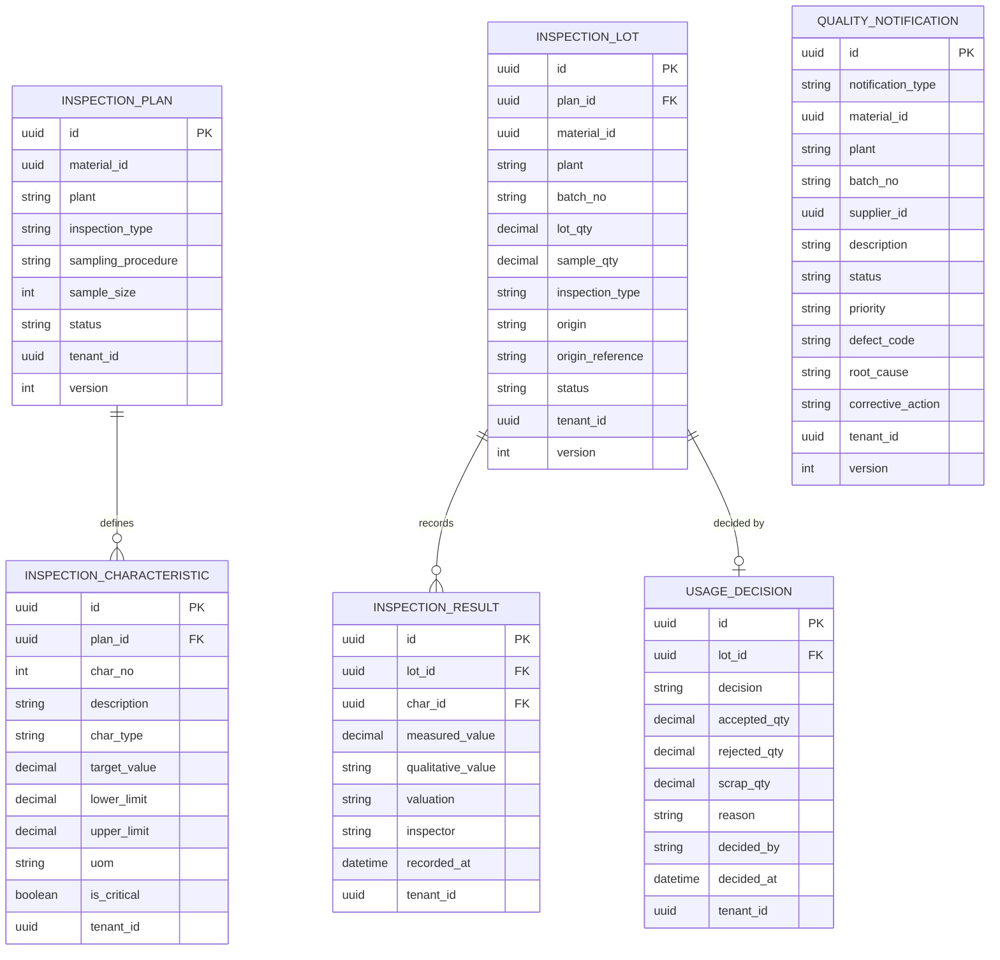

# Quality Management (QM) - Domain & Microservice Specification

> **Conceptual Stack Layer:** Domain / Service
> **Space:** Platform
> **Owner:** Domain Engineering Team
> **Schema alignment:** `service-layer.schema.json`
> **Companion files:** `openapi.yaml`, `*.schema.json` (event contracts)
> **Referenced by:** Platform-Feature Spec SS5 (backend dependencies), BFF Contract
> **Belongs to:** Suite Spec `_pps_suite.md`

> **Meta Information**
> - **Version:** 2026-04-03
> - **Template:** `domain-service-spec.md` v1.0.0
> - **Template Compliance:** ~95%
> - **Author(s):** OpenLeap Architecture Team
> - **Status:** DRAFT
> - **Suite:** `pps`
> - **Domain:** `qm`
> - **Bounded Context Ref:** `bc:quality`
> - **Service ID:** `pps-qm-svc`
> - **basePackage:** `io.openleap.pps.qm`
> - **API Base Path:** `/api/pps/qm/v1`
> - **OpenLeap Starter Version:** `v1.0.0`
> - **Port:** `TBD`
> - **Repository:** `TBD`
> - **Tags:** `pps`, `qm`, `manufacturing`, `quality`
> - **Team:**
>   - Name: `team-pps`
>   - Email: `pps-team@openleap.io`
>   - Slack: `#pps-team`

---

## Specification Guidelines Compliance

> **This specification MUST comply with the OpenLeap specification guidelines.**
>
> ### Non-Negotiables
> - Never invent facts. If required info is missing, add an **OPEN QUESTION** entry.
> - Preserve intent and decisions. Only change meaning when explicitly requested.
> - Do not remove normative constraints unless they are explicitly replaced.
> - Keep the spec **self-contained**: no "see chat", no implicit context.
>
> ### Style Guide
> - Prefer short sentences and lists.
> - Use MUST/SHOULD/MAY for normative statements.
> - Keep terminology consistent (Aggregate, Domain Service, Application Service, Command, Event).
---

## 0. Document Purpose & Scope

### 0.1 Purpose
This specification defines the Quality Management domain, which ensures product quality through inspection planning, inspection lot processing, results recording, usage decisions, and quality notifications. QM is triggered by business events (goods receipt, production confirmation) and feeds back into IM via stock-type decisions (accept, reject, conditional release).

### 0.2 Target Audience
- Product Owners & Business Stakeholders
- System Architects & Technical Leads
- Integration Engineers

### 0.3 Scope
**In Scope:**
- Inspection plan management (master data: what to inspect, sampling rules, characteristics)
- Inspection lot lifecycle (triggered by GR, MES confirmation, or manual)
- Results recording (quantitative and qualitative characteristics)
- Sampling procedures (fixed, percentage, skip-lot, AQL)
- Usage decision (accept, reject, conditional accept, scrap)
- Quality notifications (defect recording, complaint management, corrective actions)
- Quality certificates (CoA — Certificate of Analysis generation)
- Supplier quality scoring (quality history per supplier/material)
- Quality KPIs (defect rates, inspection pass rates)

**Out of Scope:**
- Stock ledger and goods movements (IM — pps.im)
- Product master data (PD — pps.pd)
- Procurement lifecycle (PUR — pps.pur)
- Manufacturing execution (MES — pps.mes)
- Document storage (DMS)
- Laboratory Information Management Systems (LIMS)

### 0.4 Related Documents
- `_pps_suite.md` - PPS Suite overview
- `pps_im-spec.md` - Inventory Management
- `PUR_procurement.md` - Procurement
- `MES_execution.md` - Manufacturing Execution
- `PD_product_definition.md` - Product Definition
- `DOMAIN_SPEC_TEMPLATE.md` - Template reference

---

## 1. Business Context

### 1.1 Domain Purpose
QM protects product quality by defining what must be inspected, triggering inspections at the right time, recording results, and making usage decisions that affect stock availability. It integrates with procurement (supplier quality), production (in-process quality), and inventory (stock release/block).

### 1.2 Business Value
- **Product Quality:** Systematic inspection prevents defective goods from reaching customers
- **Regulatory Compliance:** Documented inspection history for audits (ISO 9001, FDA, GxP)
- **Supplier Quality:** Tracks vendor performance; supports supplier rating decisions
- **Cost Reduction:** Early defect detection reduces rework and scrap costs
- **Traceability:** Full quality record per batch/lot for recalls

### 1.3 Key Stakeholders
| Role | Responsibility | Primary Use Cases |
|------|----------------|-------------------|
| Quality Engineer | Define inspection plans, review results | Maintain plans, analyze quality data |
| Quality Inspector | Execute inspections, record results | Results recording, usage decisions |
| Procurement Specialist | Review supplier quality scores | Supplier quality report |
| Production Supervisor | Review in-process quality | React to QM notifications |
| Regulatory Auditor | Audit inspection documentation | CoA generation, inspection history |

### 1.4 Strategic Positioning



### 1.5 Service Context

| Field | Value |
|-------|-------|
| Suite | `pps` (Production Planning & Scheduling) |
| Domain | `qm` (Quality Management) |
| Bounded Context | `bc:quality` |
| Service ID | `pps-qm-svc` |
| Base Package | `io.openleap.pps.qm` |
| Authoritative Sources | PPS Suite Spec (`_pps_suite.md`), SAP QM / ISO 9001 best practices |

---

## 2. Service Identity

| Field | Value |
|-------|-------|
| **Service ID** | `pps-qm-svc` |
| **Display Name** | Quality Management Service |
| **Suite** | `pps` |
| **Domain** | `qm` |
| **Bounded Context Ref** | `bc:quality` |
| **Version** | 2026-04-03 |
| **Status** | DRAFT |
| **API Base Path** | `/api/pps/qm/v1` |
| **Repository** | TBD |
| **Tags** | `pps`, `qm`, `manufacturing`, `quality` |
| **Team Name** | `team-pps` |
| **Team Email** | `pps-team@openleap.io` |
| **Team Slack** | `#pps-team` |

---

## 3. Domain Model

### 3.1 Core Concepts



**Enumerations:**

| Enum | Values |
|------|--------|
| InspectionType | `GOODS_RECEIPT`, `IN_PROCESS`, `FINAL_INSPECTION`, `AUDIT`, `AD_HOC` |
| PlanStatus | `DRAFT`, `ACTIVE`, `INACTIVE` |
| SamplingProcedure | `FIXED_SAMPLE`, `PERCENTAGE`, `SKIP_LOT`, `AQL`, `100_PERCENT` |
| CharType | `QUANTITATIVE` (measured value), `QUALITATIVE` (pass/fail, code list) |
| LotOrigin | `GOODS_RECEIPT`, `PRODUCTION`, `MANUAL` |
| LotStatus | `CREATED`, `IN_INSPECTION`, `RESULTS_RECORDED`, `DECIDED`, `CANCELLED` |
| Valuation | `PASS`, `FAIL`, `CONDITIONAL` |
| DecisionCode | `ACCEPT`, `REJECT`, `CONDITIONAL_ACCEPT`, `SCRAP`, `REWORK` |
| NotificationType | `DEFECT`, `COMPLAINT`, `CORRECTIVE_ACTION`, `IMPROVEMENT` |
| NotificationStatus | `OPEN`, `IN_PROGRESS`, `COMPLETED`, `CANCELLED` |
| Priority | `LOW`, `MEDIUM`, `HIGH`, `CRITICAL` |

### 3.2 Aggregate Definitions

#### 3.2.1 InspectionPlan
**Business Purpose:** Master data template defining what characteristics to inspect and how to sample.
**Business Rules:**
1. **One Active Plan per Material/Type:** Only one ACTIVE plan per (materialId, plant, inspectionType).
2. **At Least One Characteristic:** Active plan must have at least one characteristic.
3. **Limit Consistency:** For quantitative chars, lowerLimit <= targetValue <= upperLimit.

#### 3.2.2 InspectionLot
**Lifecycle States:**

**Business Rules:**
1. **Auto-Creation:** When IM publishes `goodsreceipt.posted` for a QM-required material, QM auto-creates an inspection lot.
2. **Sample Size Calculation:** Derived from sampling procedure and lot quantity.
3. **Critical Char Fail:** If any critical characteristic fails, overall lot valuation is FAIL regardless of other results.

#### 3.2.3 UsageDecision
**Business Rules:**
1. **All Results Required:** Decision can only be made after all characteristics have results.
2. **Quantity Balance:** acceptedQty + rejectedQty + scrapQty = lotQty.
3. **Triggers IM Event:** ACCEPT -> IM transfers stock quality -> unrestricted. REJECT -> quality -> blocked. SCRAP -> scrap posting.

---

## 4. Business Rules & Constraints

### 4.1 Business Rules Catalog

| ID | Rule Name | Description | Scope | Enforcement | Error Code |
|----|-----------|-------------|-------|-------------|------------|
| BR-QM-001 | Auto-Lot on GR | QM-flagged materials auto-create inspection lots on goods receipt | InspectionLot | On GR event | `QM-BIZ-001` |
| BR-QM-002 | Critical Char Fail | Any critical characteristic failure results in lot FAIL valuation | InspectionResult | On valuation | `QM-BIZ-002` |
| BR-QM-003 | Complete Before Decision | All characteristics must have results before usage decision | UsageDecision | On decision | `QM-BIZ-003` |
| BR-QM-004 | Quantity Balance | accepted + rejected + scrap = lot qty | UsageDecision | On decision | `QM-BIZ-004` |
| BR-QM-005 | One Active Plan | One active plan per material/plant/inspection type combination | InspectionPlan | On activate | `QM-BIZ-005` |
| BR-QM-006 | Limit Consistency | lower <= target <= upper for quantitative characteristics | InspectionCharacteristic | On save | `QM-VAL-006` |
| BR-QM-007 | Skip-Lot Progression | After N consecutive passes, reduce inspection frequency (skip-lot) | SamplingProcedure | On lot creation | `QM-BIZ-007` |

### 4.2 Data Validation Rules

| Field | Validation Rule | Error Code | Error Message |
|-------|----------------|------------|---------------|
| plan.materialId | Required, valid UUID | `QM-VAL-001` | `"Valid material ID is required"` |
| plan.inspectionType | Required, valid enum | `QM-VAL-002` | `"Valid inspection type is required"` |
| characteristic.lowerLimit | <= targetValue if set | `QM-VAL-006` | `"Lower limit must be <= target value"` |
| characteristic.upperLimit | >= targetValue if set | `QM-VAL-007` | `"Upper limit must be >= target value"` |
| decision.acceptedQty + rejectedQty + scrapQty | Must equal lotQty | `QM-BIZ-004` | `"Quantity balance: accepted + rejected + scrap must equal lot quantity"` |
| result.measuredValue | Required for QUANTITATIVE chars | `QM-VAL-008` | `"Measured value required for quantitative characteristics"` |
| result.qualitativeValue | Required for QUALITATIVE chars | `QM-VAL-009` | `"Qualitative value required for qualitative characteristics"` |

---

## 5. Use Cases

### 5.1 Business Logic Placement

| Layer | Responsibilities |
|-------|-----------------|
| Application Service | Command validation, aggregate loading, event publishing, orchestration (lot creation from events, CoA generation) |
| Domain Service | Sample size calculation, skip-lot evaluation, valuation logic (cross-aggregate) |
| Aggregate | State transitions, invariant enforcement, attribute validation |

### 5.2 Use Cases

#### UC-QM-001: Goods Receipt Inspection

| Field | Value |
|-------|-------|
| **ID** | UC-QM-001 |
| **Type** | WRITE |
| **Trigger** | Event (`pps.im.goodsreceipt.posted`) / REST (manual) |
| **Aggregate** | InspectionLot |
| **Domain Operation** | `InspectionLotService.createFromGoodsReceipt()` |
| **Inputs** | GR event payload (materialId, plant, batchNo, qty, PO reference) |
| **Outputs** | InspectionLot in CREATED state with resolved plan and calculated sample size |
| **Events** | `pps.qm.inspectionlot.created` |
| **REST** | `POST /api/pps/qm/v1/lots` -> 201 Created (manual) |
| **Idempotency** | Event deduplication via originReference (PO + GR line) |
| **Errors** | 422 (no active plan for material, BR-QM-005) |

**Detailed Flow:**
1. IM publishes `pps.im.goodsreceipt.posted` for QM-required material
2. QM auto-creates InspectionLot (origin=GOODS_RECEIPT, ref=PO, batch=batch from GR)
3. QM resolves InspectionPlan for material/plant/GOODS_RECEIPT type
4. QM calculates sample size
5. Inspector records results for each characteristic
6. Inspector makes usage decision
7. QM publishes `pps.qm.qualitydecision.posted`
8. IM reacts: transfers stock from QUALITY_INSPECTION -> UNRESTRICTED (accept) or BLOCKED (reject)

#### UC-QM-002: In-Process Inspection

| Field | Value |
|-------|-------|
| **ID** | UC-QM-002 |
| **Type** | WRITE |
| **Trigger** | Event (`pps.mes.confirmation.posted`) |
| **Aggregate** | InspectionLot |
| **Domain Operation** | `InspectionLotService.createFromProduction()` |
| **Inputs** | MES confirmation event payload (materialId, plant, MO reference) |
| **Outputs** | InspectionLot in CREATED state (origin=PRODUCTION) |
| **Events** | `pps.qm.inspectionlot.created` |
| **REST** | -- (event-triggered) |
| **Idempotency** | Event deduplication via originReference (MO + confirmation) |
| **Errors** | 422 (no active plan for material) |

**Detailed Flow:**
1. MES publishes `pps.mes.confirmation.posted`
2. QM creates InspectionLot (origin=PRODUCTION, ref=MO)
3. Inspector records results during or after production
4. Usage decision -> QM event -> IM stock type adjustment if needed

#### UC-QM-003: Record Inspection Results

| Field | Value |
|-------|-------|
| **ID** | UC-QM-003 |
| **Type** | WRITE |
| **Trigger** | REST |
| **Aggregate** | InspectionLot, InspectionResult |
| **Domain Operation** | `InspectionLot.recordResults()` |
| **Inputs** | lotId, results[] (charNo, measuredValue or qualitativeValue, inspector) |
| **Outputs** | InspectionResults with automatic valuation (PASS/FAIL/CONDITIONAL) |
| **Events** | -- (internal state change; event on decision) |
| **REST** | `POST /api/pps/qm/v1/lots/{lotId}/results` -> 201 Created |
| **Idempotency** | Client-generated `Idempotency-Key` header |
| **Errors** | 404 (lot not found), 409 (lot not in IN_INSPECTION), 400 (validation) |

#### UC-QM-004: Make Usage Decision

| Field | Value |
|-------|-------|
| **ID** | UC-QM-004 |
| **Type** | WRITE |
| **Trigger** | REST |
| **Aggregate** | UsageDecision, InspectionLot |
| **Domain Operation** | `InspectionLot.decide()` |
| **Inputs** | lotId, decision (ACCEPT/REJECT/CONDITIONAL_ACCEPT/SCRAP/REWORK), acceptedQty, rejectedQty, scrapQty, reason? |
| **Outputs** | UsageDecision record; InspectionLot in DECIDED state |
| **Events** | `pps.qm.qualitydecision.posted` |
| **REST** | `POST /api/pps/qm/v1/lots/{lotId}/decide` -> 200 OK |
| **Idempotency** | Idempotent (re-decide of DECIDED is no-op) |
| **Errors** | 404, 409 (not RESULTS_RECORDED), 422 (BR-QM-003 incomplete results, BR-QM-004 quantity imbalance) |

#### UC-QM-005: Quality Notification

| Field | Value |
|-------|-------|
| **ID** | UC-QM-005 |
| **Type** | WRITE |
| **Trigger** | REST |
| **Aggregate** | QualityNotification |
| **Domain Operation** | `QualityNotification.create()`, `.complete()` |
| **Inputs** | notificationType, materialId, plant, batchNo?, supplierId?, description, priority, defectCode? |
| **Outputs** | QualityNotification in OPEN state |
| **Events** | `pps.qm.notification.created` |
| **REST** | `POST /api/pps/qm/v1/notifications` -> 201 Created |
| **Idempotency** | Client-generated `Idempotency-Key` header |
| **Errors** | 400 (validation) |

**Detailed Flow:**
1. Create notification (defect, complaint, corrective action request)
2. Investigate root cause
3. Define corrective action
4. Track completion
5. Close notification

#### UC-QM-006: Certificate of Analysis (CoA)

| Field | Value |
|-------|-------|
| **ID** | UC-QM-006 |
| **Type** | WRITE |
| **Trigger** | REST |
| **Aggregate** | InspectionLot (read), ServiceReport (write) |
| **Domain Operation** | `CoAService.generate()` |
| **Inputs** | lotId |
| **Outputs** | PDF certificate stored in DMS; link returned |
| **Events** | -- |
| **REST** | `POST /api/pps/qm/v1/lots/{lotId}/certificate` -> 201 Created |
| **Idempotency** | Idempotent (re-generate returns existing certificate) |
| **Errors** | 404 (lot not found), 409 (lot not DECIDED), 502 (DMS/RPT unavailable) |

**Detailed Flow:**
1. Request CoA for a batch / inspection lot
2. QM assembles results data
3. Generates PDF via RPT service
4. Stores in DMS
5. Returns link

### 5.3 Process Flow Diagrams



---

## 6. REST API

### 6.1 API Overview
**Base Path:** `/api/pps/qm/v1`
**Authentication:** OAuth2/JWT
**Authorization:** `pps.qm:read`, `pps.qm:write`, `pps.qm:admin`

### 6.2 Resource Operations

#### Inspection Plans
```
POST   /api/pps/qm/v1/plans
GET    /api/pps/qm/v1/plans?materialId={id}&inspectionType={type}&status={s}
GET    /api/pps/qm/v1/plans/{planId}
PATCH  /api/pps/qm/v1/plans/{planId}
POST   /api/pps/qm/v1/plans/{planId}/activate
POST   /api/pps/qm/v1/plans/{planId}/deactivate
POST   /api/pps/qm/v1/plans/{planId}/characteristics        — Add characteristic
PATCH  /api/pps/qm/v1/characteristics/{charId}
DELETE /api/pps/qm/v1/characteristics/{charId}
```

#### Inspection Lots
```
POST   /api/pps/qm/v1/lots                                    — Create lot (manual)
GET    /api/pps/qm/v1/lots?materialId={id}&status={s}&origin={o}&page=0&size=50
GET    /api/pps/qm/v1/lots/{lotId}
POST   /api/pps/qm/v1/lots/{lotId}/start                      — Start inspection
POST   /api/pps/qm/v1/lots/{lotId}/cancel
```

#### Results
```
POST   /api/pps/qm/v1/lots/{lotId}/results                    — Record result(s)
GET    /api/pps/qm/v1/lots/{lotId}/results
PATCH  /api/pps/qm/v1/results/{resultId}                      — Correct result
```

**Record Results Request:**
```json
{
  "results": [
    { "charNo": 1, "measuredValue": 7.42, "inspector": "QI-001" },
    { "charNo": 2, "qualitativeValue": "PASS", "inspector": "QI-001" }
  ]
}
```

#### Usage Decisions
```
POST   /api/pps/qm/v1/lots/{lotId}/decide
```

**Decision Request:**
```json
{
  "decision": "ACCEPT",
  "acceptedQty": 100.000,
  "rejectedQty": 0.000,
  "scrapQty": 0.000,
  "reason": "All characteristics within spec"
}
```

#### Quality Notifications
```
POST   /api/pps/qm/v1/notifications
GET    /api/pps/qm/v1/notifications?status={s}&priority={p}&materialId={id}
GET    /api/pps/qm/v1/notifications/{id}
PATCH  /api/pps/qm/v1/notifications/{id}
POST   /api/pps/qm/v1/notifications/{id}/complete
```

#### Certificates
```
POST   /api/pps/qm/v1/lots/{lotId}/certificate                — Generate CoA PDF
```

---

## 7. Events & Integration

### 7.1 Published Events
**Exchange:** `pps.qm.events` (topic, durable)

#### qualitydecision.posted
**Routing Key:** `pps.qm.qualitydecision.posted`
```json
{
  "lotId": "uuid",
  "materialId": "uuid",
  "plant": "P100",
  "batchNo": "B2026-001",
  "decision": "ACCEPT",
  "acceptedQty": 100.000,
  "rejectedQty": 0.000,
  "scrapQty": 0.000,
  "originReference": "PO-4500012345",
  "decidedAt": "2026-02-23T16:00:00Z"
}
```
**Consumers:** pps.im (stock type transfer), pps.pur (supplier quality update)

#### inspectionlot.created
**Routing Key:** `pps.qm.inspectionlot.created`
**Consumer:** T4 BI

#### notification.created
**Routing Key:** `pps.qm.notification.created`
**Consumer:** T4 BI, notification service

### 7.2 Consumed Events

| Event | Source | Queue | Business Logic |
|-------|--------|-------|----------------|
| `pps.im.goodsreceipt.posted` | pps.im | `pps.qm.in.pps.im.goodsreceipt` | Auto-create inspection lot for QM-required materials |
| `pps.mes.confirmation.posted` | pps.mes | `pps.qm.in.pps.mes.confirmation` | Create in-process inspection lot |
| `pps.pd.bom.released` | pps.pd | `pps.qm.in.pps.pd.bom` | Review inspection plan assignment for new materials |

---

## 8. Data Model



---

## 9. Security & Compliance

| Role | Read | Record Results | Decide | Manage Plans | Admin |
|------|------|---------------|--------|-------------|-------|
| QM_VIEWER | Y | N | N | N | N |
| QM_INSPECTOR | Y | Y | Y | N | N |
| QM_ENGINEER | Y | Y | Y | Y | N |
| QM_ADMIN | Y | Y | Y | Y | Y |

**Compliance:** ISO 9001 (quality management systems), FDA 21 CFR Part 11 (electronic records), GxP (pharmaceutical), ISO 17025 (laboratory). Full audit trail on all results and decisions.

---

## 10. Quality Attributes
- Result recording: < 100ms
- Lot creation (auto): < 500ms
- Availability: 99.9%

---

## 11. Feature Dependencies

### 11.1 Purpose
This section answers: "Which features depend on this service?" It is the inverse of Platform-Feature Spec SS5 and helps the domain team assess the blast radius of API changes.

### 11.2 Feature Dependency Register

> **OPEN QUESTION:** Feature dependencies will be populated when feature specs (Phase 3) are authored for the PPS suite. The following is a preliminary mapping based on expected feature compositions.

| Feature ID | Feature Name | Suite | Tier | Dependency Type | Status |
|------------|-------------|-------|------|-----------------|--------|
| F-PPS-TBD | Goods Receipt Inspection | pps | core | async_event + sync_api | planned |
| F-PPS-TBD | In-Process Inspection | pps | core | async_event + sync_api | planned |
| F-PPS-TBD | Usage Decision | pps | core | sync_api + async_event | planned |
| F-PPS-TBD | Quality Notifications | pps | supporting | sync_api | planned |
| F-PPS-TBD | Certificate of Analysis | pps | supporting | sync_api | planned |
| F-PPS-TBD | Inspection Plan Management | pps | core | sync_api | planned |

---

## 12. Extension Points

### 12.1 Purpose
Extension points follow the Open-Closed Principle: the service is open for extension via events and hooks but closed for direct modification.

### 12.2 Extension Events

| Event ID | Routing Key | Trigger | Payload | Purpose |
|----------|-------------|---------|---------|---------|
| EXT-QM-001 | `pps.qm.qualitydecision.posted` | Usage decision made | Full decision with quantities | External systems can react to quality decisions (e.g., supplier portal, compliance dashboard) |
| EXT-QM-002 | `pps.qm.notification.created` | Quality notification created | Notification details | External complaint management, customer communication |
| EXT-QM-003 | `pps.qm.inspectionlot.created` | Inspection lot created | Lot summary | External lab systems, LIMS integration |

### 12.3 Aggregate Hooks

| Hook ID | Aggregate | Lifecycle Point | Hook Type | Description |
|---------|-----------|-----------------|-----------|-------------|
| HOOK-QM-001 | InspectionLot | Pre-Decide | validation | Custom decision validation rules per tenant (e.g., mandatory supervisor approval for REJECT decisions) |
| HOOK-QM-002 | InspectionResult | Post-Record | notification | Custom notification channels (email to quality engineer, lab system update) |
| HOOK-QM-003 | QualityNotification | Post-Create | notification | Custom alerting for quality notifications (SMS, webhook to supplier portal) |
| HOOK-QM-004 | InspectionPlan | Pre-Activate | validation | Custom plan validation (e.g., regulatory-specific characteristic requirements) |

**Design Rules:**
- Hooks are fire-and-forget (notification) or bounded-timeout (validation: 2s)
- Validation hooks fail-closed (block on timeout)
- Notification hooks fail-open (log and continue)
- Hooks do not modify aggregate state directly

### 12.4 Extension Points Summary

| ID | Type | Aggregate | Lifecycle Point | Fail Mode | Timeout |
|----|------|-----------|-----------------|-----------|---------|
| EXT-QM-001 | event | InspectionLot | decided | n/a | n/a |
| EXT-QM-002 | event | QualityNotification | created | n/a | n/a |
| EXT-QM-003 | event | InspectionLot | created | n/a | n/a |
| HOOK-QM-001 | validation | InspectionLot | pre-decide | fail-closed | 2s |
| HOOK-QM-002 | notification | InspectionResult | post-record | fail-open | 5s |
| HOOK-QM-003 | notification | QualityNotification | post-create | fail-open | 5s |
| HOOK-QM-004 | validation | InspectionPlan | pre-activate | fail-closed | 2s |

---

## 13. Migration & Evolution

### 13.1 Data Migration

**Legacy Source:** Legacy QM systems (SAP QM, standalone LIMS, paper-based inspection records).

| Migration Item | Source | Strategy | Complexity |
|---------------|--------|----------|------------|
| Inspection plans | Legacy QM master data | Review and recreate; import characteristics | Medium |
| Active inspection lots | Legacy open lots | Migrate only open/in-progress lots | Low |
| Historical inspection results | Not migrated | Start fresh; historical data stays in legacy for audit reference | N/A |
| Quality notifications | Legacy complaint system | Selective migration of open notifications | Low |
| Supplier quality scores | Legacy vendor evaluation | Recalculate from migrated history or import baseline scores | Medium |

### 13.2 Deprecation & Sunset

| Deprecated Feature | Replacement | Removal Timeline | Communication Plan |
|-------------------|-------------|------------------|-------------------|
| -- | -- | -- | -- |

### 13.3 Future Extensions

- LIMS (Laboratory Information Management System) integration
- Statistical Process Control (SPC) charts and trend analysis
- AI-based defect image classification
- Mobile inspection recording with offline support
- Automated supplier quality scoring with machine learning

---

## 14. Decisions & Open Questions

### 14.1 Open Questions

| ID | Question | Status |
|----|----------|--------|
| Q-001 | LIMS integration protocol? | Open — Phase 3 |
| Q-002 | Statistical Process Control (SPC) charts in QM or BI? | Open — Phase 2 |
| Q-003 | Calibration management in QM or EAM? | Decided — EAM |

---

## 15. Appendix

### 15.1 Glossary
| Term | Definition | Aliases |
|------|------------|---------|
| Inspection Lot | Instance of an inspection triggered by a business event | Prueflos |
| Usage Decision | Accept/reject/scrap decision for an inspected lot | Verwendungsentscheid |
| CoA | Certificate of Analysis | Analysezertifikat |
| AQL | Acceptable Quality Level — statistical sampling standard | - |
| Characteristic | A measurable or observable quality attribute | Merkmal |
| Skip-Lot | Reduced inspection after consistent quality history | - |

### 15.2 Change Log
| Date | Version | Author | Changes |
|------|---------|--------|---------|
| 2026-02-23 | 1.0 | OpenLeap Architecture Team | Initial version |
| 2026-04-03 | 1.1 | OpenLeap Architecture Team | Template compliance: add Service Identity, reorder sections, convert UC to table format, expand Feature Dependencies, Extension Points, Migration |

---

## Document Review & Approval
**Status:** DRAFT
