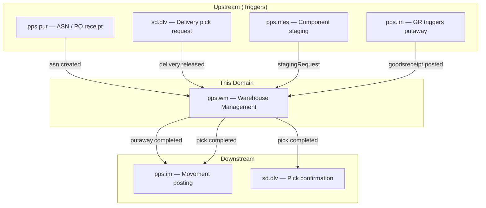
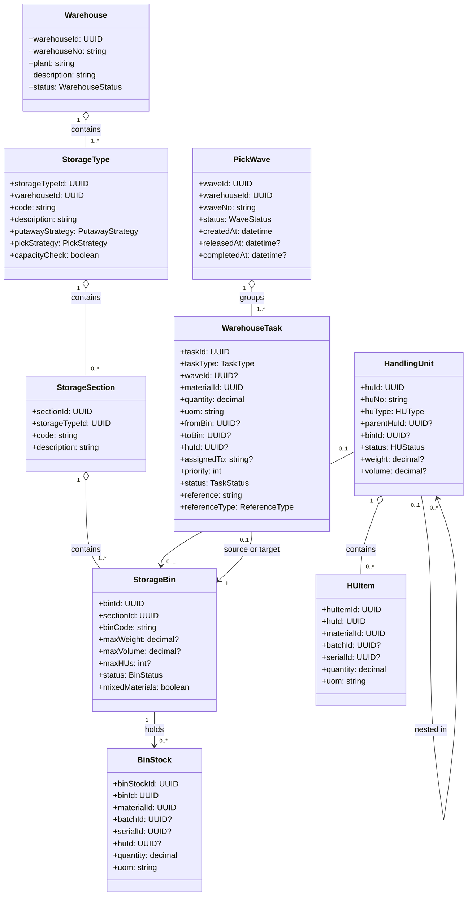
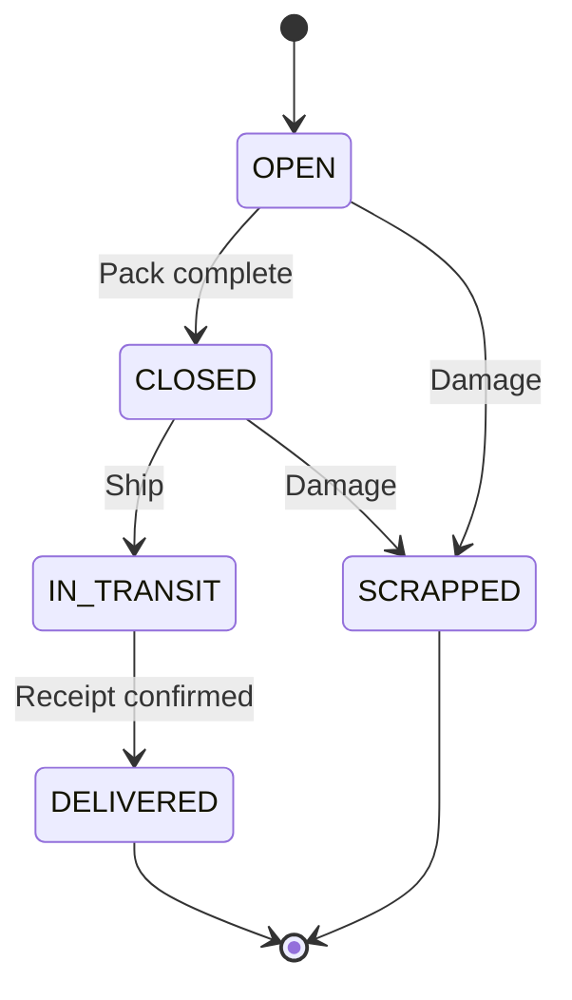
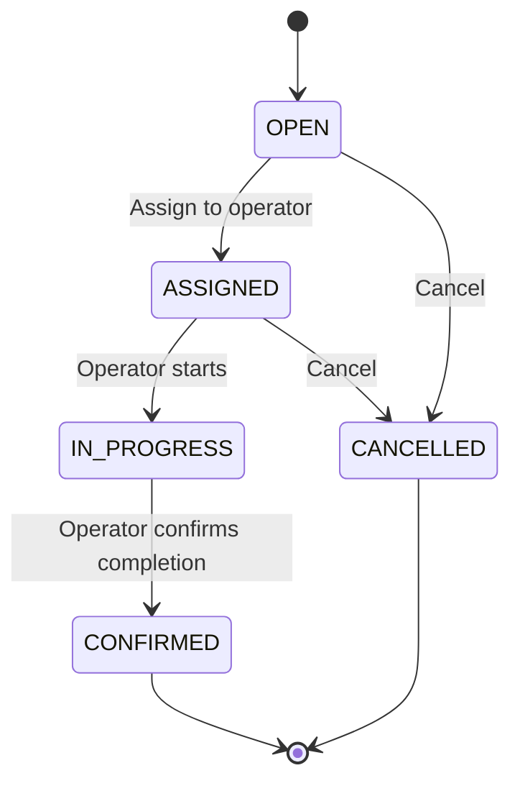
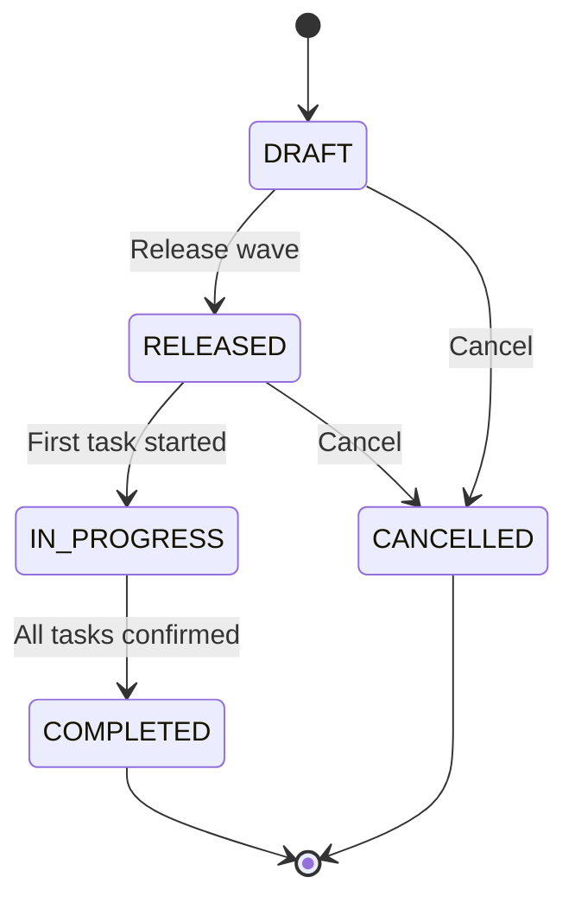
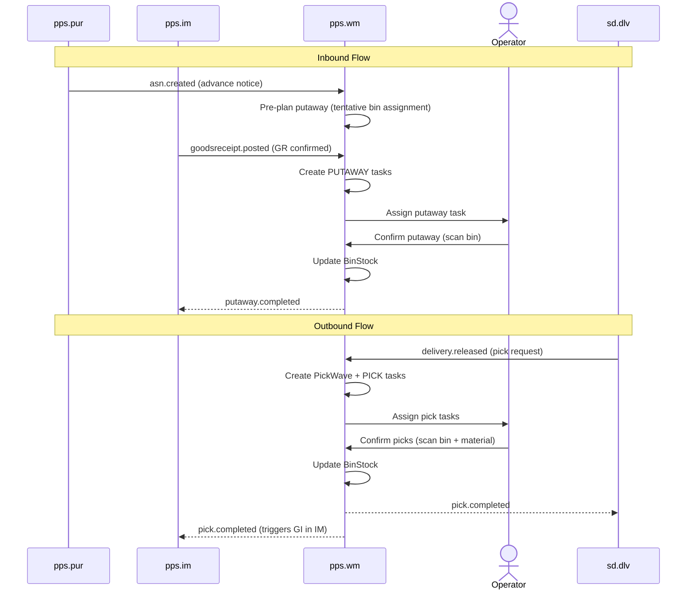
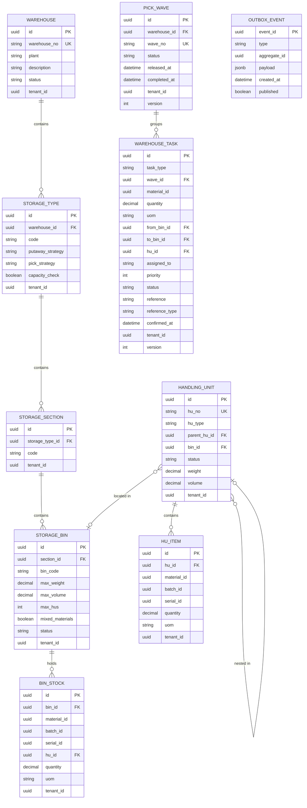

# Warehouse Management (WM) - Domain & Microservice Specification

> **Conceptual Stack Layer:** Domain / Service
> **Space:** Platform
> **Owner:** Domain Engineering Team
> **Schema alignment:** `service-layer.schema.json`
> **Companion files:** `openapi.yaml`, `*.schema.json` (event contracts)
> **Referenced by:** Platform-Feature Spec SS5 (backend dependencies), BFF Contract
> **Belongs to:** Suite Spec `_pps_suite.md`

> **Meta Information**
> - **Version:** 2026-04-03
> - **Template:** `domain-service-spec.md` v1.0.0
> - **Template Compliance:** ~95% — feature dependency register preliminary, extension hooks preliminary
> - **Author(s):** OpenLeap Architecture Team
> - **Status:** DRAFT
> - **Suite:** `pps`
> - **Domain:** `wm`
> - **Bounded Context Ref:** `bc:warehousing`
> - **Service ID:** `pps-wm-svc`
> - **basePackage:** `io.openleap.pps.wm`
> - **API Base Path:** `/api/pps/wm/v1`
> - **OpenLeap Starter Version:** `v1.0.0`
> - **Port:** `TBD`
> - **Repository:** `TBD`
> - **Tags:** `pps`, `wm`, `warehouse`, `logistics`
> - **Team:**
>   - Name: `team-pps`
>   - Email: `pps-team@openleap.io`
>   - Slack: `#pps-team`

---

## Specification Guidelines Compliance

> **This specification MUST comply with the OpenLeap specification guidelines.**
>
> ### Non-Negotiables
> - Never invent facts. If required info is missing, add an **OPEN QUESTION** entry.
> - Preserve intent and decisions. Only change meaning when explicitly requested.
> - Do not remove normative constraints unless they are explicitly replaced.
> - Keep the spec **self-contained**: no "see chat", no implicit context.
>
> ### Style Guide
> - Prefer short sentences and lists.
> - Use MUST/SHOULD/MAY for normative statements.
> - Keep terminology consistent (Aggregate, Domain Service, Application Service, Command, Event).
---

## 0. Document Purpose & Scope

### 0.1 Purpose
This specification defines the Warehouse Management domain, which manages physical warehouse operations at the storage bin level. WM handles putaway strategies, picking waves, packing, handling units, and warehouse-internal movements. While IM answers "how much stock do we have?", WM answers "where exactly is it, and how do I move it efficiently?"

### 0.2 Target Audience
- Product Owners & Business Stakeholders
- System Architects & Technical Leads
- Integration Engineers

### 0.3 Scope
**In Scope:**
- Warehouse master data (warehouses, storage types, storage sections, storage bins)
- Inbound processing (putaway planning, putaway task execution)
- Outbound processing (pick wave creation, pick task execution, packing)
- Handling Unit (HU) management (pallets, boxes, mixed HUs)
- Warehouse-internal movements (replenishment, bin-to-bin transfer, bin optimization)
- Putaway strategies (fixed bin, open storage, nearest empty, zone-based)
- Picking strategies (FIFO, FEFO, pick-by-zone, pick-by-wave)
- Warehouse task management (task assignment, confirmation, RF/mobile support)
- Yard management (dock door assignment, staging areas)

**Out of Scope:**
- Logical stock ledger and stock quantities (IM — `pps.im`)
- Goods movement posting to stock ledger (IM — `pps.im`)
- Purchase order lifecycle (PUR — `pps.pur`)
- Sales order and delivery management (SD — `sd.dlv`)
- Transportation and carrier management (SD — `sd.shp`)
- Manufacturing execution (MES — `pps.mes`)
- Product master data (PD — `pps.pd`)

### 0.4 Related Documents
- `_pps_suite.md` - PPS Suite overview
- `pps_im-spec.md` - Inventory Management spec
- `PUR_procurement.md` - Procurement spec
- `sd_dlv-spec.md` - SD Delivery spec
- `SYSTEM_OVERVIEW.md` - Platform architecture overview
- `DOMAIN_SPEC_TEMPLATE.md` - Template reference

---

## 1. Business Context

### 1.1 Domain Purpose
Warehouse Management optimizes the physical movement and storage of goods within a warehouse. It knows the precise bin location of every item, directs workers (or automation) to the right place for putaway and picking, and ensures efficient use of warehouse space. WM sits between the business triggers (PO receipt, sales delivery, production staging) and the stock ledger (IM), orchestrating the physical "how" while IM manages the logical "how much".

### 1.2 Business Value
- **Space Optimization:** Intelligent putaway strategies maximize warehouse capacity utilization
- **Picking Efficiency:** Wave-based picking with optimized routes reduces labor cost per order line
- **Accuracy:** Bin-level tracking eliminates search time and reduces picking errors
- **Throughput:** Parallel task execution and wave grouping increase warehouse throughput
- **Handling Unit Visibility:** Pallet/box-level tracking supports carrier handoff and customer receipt

### 1.3 Key Stakeholders
| Role | Responsibility | Primary Use Cases |
|------|----------------|-------------------|
| Warehouse Manager | Configure warehouse structure, monitor KPIs | Define storage types, set strategies, review throughput |
| Warehouse Operator | Execute putaway and pick tasks | Confirm putaway, pick, pack using RF/mobile |
| Inbound Coordinator | Manage goods receipt flow | Plan putaway for incoming deliveries / ASNs |
| Outbound Coordinator | Manage shipping flow | Create pick waves, monitor packing, stage for shipment |
| Production Planner | Request component staging | Trigger staging picks for manufacturing orders |

### 1.4 Strategic Positioning



---

### 1.5 Service Context

| Property | Value |
|----------|-------|
| **Suite** | `pps` |
| **Domain** | `wm` |
| **Bounded Context** | `bc:warehousing` |
| **Service ID** | `pps-wm-svc` |
| **Base Package** | `io.openleap.pps.wm` |

---

## 2. Service Identity

| Field | Value |
|-------|-------|
| **Service ID** | `pps-wm-svc` |
| **Display Name** | Warehouse Management Service |
| **Suite** | `pps` |
| **Domain** | `wm` |
| **Bounded Context Ref** | `bc:warehousing` |
| **Version** | 2026-04-03 |
| **Status** | DRAFT |
| **API Base Path** | `/api/pps/wm/v1` |
| **Repository** | OPEN QUESTION |
| **Tags** | `pps`, `wm`, `warehouse`, `logistics` |
| **Team Name** | `team-pps` |
| **Team Email** | `pps-team@openleap.io` |
| **Team Slack** | `#pps-team` |

---

## 3. Domain Model

### 3.1 Conceptual Overview
WM models the physical warehouse as a hierarchy: **Warehouse -> StorageType -> StorageSection -> StorageBin**. Goods are tracked at the bin level via **BinStock** records. Work is organized as **WarehouseTasks** (putaway or pick), grouped into **PickWaves** for outbound. Physical packaging is represented by **HandlingUnits**. Inbound and outbound flows are managed through **InboundDelivery** and **OutboundRequest** aggregates.

### 3.2 Core Concepts



**Enumerations:**

| Enum | Values |
|------|--------|
| WarehouseStatus | `ACTIVE`, `INACTIVE`, `BLOCKED` |
| BinStatus | `EMPTY`, `PARTIALLY_FILLED`, `FULL`, `BLOCKED` |
| HUType | `PALLET`, `BOX`, `CONTAINER`, `MIXED` |
| HUStatus | `OPEN`, `CLOSED`, `IN_TRANSIT`, `DELIVERED`, `SCRAPPED` |
| TaskType | `PUTAWAY`, `PICK`, `REPLENISHMENT`, `INTERNAL_TRANSFER`, `STAGING` |
| TaskStatus | `OPEN`, `ASSIGNED`, `IN_PROGRESS`, `CONFIRMED`, `CANCELLED` |
| WaveStatus | `DRAFT`, `RELEASED`, `IN_PROGRESS`, `COMPLETED`, `CANCELLED` |
| PutawayStrategy | `FIXED_BIN`, `OPEN_STORAGE`, `NEAREST_EMPTY`, `ZONE_BASED`, `ADD_TO_EXISTING` |
| PickStrategy | `FIFO`, `FEFO`, `CLOSEST_BIN`, `LARGEST_QTY_FIRST` |
| ReferenceType | `ASN`, `PURCHASE_ORDER`, `DELIVERY`, `MANUFACTURING_ORDER`, `REPLENISHMENT`, `MANUAL` |

### 3.3 Aggregate Definitions

#### 3.3.1 Warehouse (+ StorageType, StorageSection, StorageBin)

**Business Purpose:**
Represents the physical warehouse structure. Configuration is relatively static (master data). Defines capacity, strategies, and rules for how goods are stored.

**Key Attributes (StorageBin):**
| Attribute | Type | Description | Constraints |
|-----------|------|-------------|-------------|
| binId | UUID | Unique identifier | PK, immutable |
| binCode | string | Human-readable bin address (e.g., A-01-03-02) | Unique per warehouse |
| maxWeight | decimal | Maximum weight capacity (kg) | Optional, >= 0 |
| maxVolume | decimal | Maximum volume capacity (m3) | Optional, >= 0 |
| maxHUs | int | Maximum handling units in bin | Optional, >= 1 |
| mixedMaterials | boolean | Whether bin may hold multiple materials | Default false |

**Business Rules & Invariants:**
1. **Bin Address Unique:** `binCode` is unique within a warehouse per tenant.
2. **Capacity Enforcement:** If `capacityCheck` is enabled on the StorageType, putaway tasks must verify weight/volume/HU count before confirming.
3. **Mixed Material Policy:** If `mixedMaterials` is false, only one material may occupy the bin at any time.
4. **Hierarchy Integrity:** A bin belongs to exactly one section, which belongs to exactly one storage type, which belongs to exactly one warehouse.

#### 3.3.2 BinStock

**Business Purpose:**
Tracks what material (and how much) is in a specific bin. This is WM's view of stock — granular to the bin level. IM's StockItem may aggregate across bins at the sloc level. BinStock and IM StockItem are eventually consistent via events.

**Business Rules & Invariants:**
1. **No Negative Bin Quantity:** BinStock quantity must be >= 0.
2. **Consistency with IM:** Sum of all BinStock quantities for a material/plant should equal IM's StockItem quantity. Periodic reconciliation job detects and alerts on discrepancies.

#### 3.3.3 HandlingUnit (HU)

**Business Purpose:**
Represents a physical packaging unit (pallet, box, container). HUs can be nested (boxes on a pallet). Each HU has a known bin location and contains one or more HUItems.

**Lifecycle States:**


**Business Rules & Invariants:**
1. **HU Number Unique:** `huNo` is unique per tenant (globally).
2. **Nesting Limit:** Maximum nesting depth is 3 (e.g., item -> box -> pallet).
3. **Location Consistency:** All child HUs must be in the same bin as the parent HU (or in transit).

#### 3.3.4 WarehouseTask

**Business Purpose:**
A single unit of work directing a warehouse operator to move material from one bin to another (or from a staging area to a bin, or from a bin to a shipping area).

**Lifecycle States:**


**Business Rules & Invariants:**
1. **Source Bin Required:** For PICK and INTERNAL_TRANSFER tasks, source bin must be specified and have sufficient BinStock.
2. **Target Bin Required:** For PUTAWAY and REPLENISHMENT tasks, target bin must be determined (by strategy or manually).
3. **Confirmation Updates BinStock:** On CONFIRMED, system decreases source BinStock and increases target BinStock, then publishes event to IM.

#### 3.3.5 PickWave

**Business Purpose:**
Groups multiple pick tasks for efficient execution. A wave typically corresponds to a shipping cutoff, a carrier pickup time, or a production staging deadline. Wave-based picking allows route optimization across tasks.

**Lifecycle States:**


**Business Rules & Invariants:**
1. **Minimum Tasks:** A wave must contain at least one task to be released.
2. **Warehouse Scope:** All tasks in a wave must belong to the same warehouse.
3. **Wave Completion:** A wave transitions to COMPLETED only when all tasks are CONFIRMED or CANCELLED.

---

## 4. Business Rules & Constraints

### 4.1 Business Rules Catalog

| ID | Rule Name | Description | Scope | Enforcement |
|----|-----------|-------------|-------|-------------|
| BR-WM-001 | Bin Capacity | Putaway must not exceed bin weight, volume, or HU count limits | PUTAWAY task | On task creation and confirmation |
| BR-WM-002 | Mixed Material Policy | If bin disallows mixing, only one materialId per bin | StorageBin | On putaway |
| BR-WM-003 | Sufficient BinStock | Pick task quantity must not exceed available BinStock in source bin | PICK task | On task creation |
| BR-WM-004 | Wave Integrity | All tasks in a wave must be in the same warehouse | PickWave | On task assignment to wave |
| BR-WM-005 | FEFO Pick Order | If pick strategy is FEFO, tasks are created in expiry-date order | PICK task | On wave generation |
| BR-WM-006 | HU Nesting Limit | Maximum HU nesting depth is 3 | HandlingUnit | On HU nesting |
| BR-WM-007 | Bin Address Unique | Bin code must be unique within its warehouse | StorageBin | On create/update |
| BR-WM-008 | Replenishment Threshold | Forward-pick bins below minimum trigger automatic replenishment | BinStock | On pick confirmation |
| BR-WM-009 | Task Sequence | Putaway tasks must be confirmed before picked stock is usable | WarehouseTask | On task state machine |
| BR-WM-010 | Blocked Bin | No tasks may target or source a BLOCKED bin | WarehouseTask | On create |

### 4.2 Data Validation Rules

**Field-Level Validations:**
| Field | Validation Rule | Error Message |
|-------|----------------|---------------|
| warehouseNo | Required, max 10 chars, unique per tenant | "Warehouse number already exists" |
| binCode | Required, max 30 chars, unique per warehouse+tenant | "Bin code already exists in this warehouse" |
| quantity (task) | Required, > 0 | "Task quantity must be positive" |
| huNo | Required, max 30 chars, unique per tenant | "HU number already exists" |

---

## 5. Use Cases

### 5.1 Business Logic Placement

| Layer | Responsibilities |
|-------|-----------------|
| Application Service | Command validation, aggregate loading, event publishing, orchestration (wave generation) |
| Domain Service | Putaway strategy resolution, pick strategy resolution, capacity validation (cross-aggregate) |
| Aggregate | State transitions, invariant enforcement, attribute validation |

### 5.2 Use Cases

#### UC-WM-001: Inbound Putaway

| Field | Value |
|-------|-------|
| **ID** | UC-WM-001 |
| **Type** | WRITE |
| **Trigger** | Event (`pps.im.goodsreceipt.posted`) or Event (`pps.pur.asn.created`) |
| **Aggregate** | WarehouseTask |
| **Domain Operation** | `WarehouseTask.createPutaway(material, qty, strategy)` |
| **Inputs** | materialId, quantity, uom, warehouseId, reference, referenceType, batchNo?, huNo? |
| **Outputs** | PUTAWAY WarehouseTask with target bin assigned |
| **Events** | `pps.wm.putaway.completed` (on task confirmation) |
| **REST** | `POST /api/pps/wm/v1/tasks` -> 201 Created; `POST /api/pps/wm/v1/tasks/{taskId}/confirm` -> 200 OK |
| **Idempotency** | Idempotency-Key header on task creation; confirm is idempotent (re-confirm of CONFIRMED is no-op) |
| **Errors** | 400 (validation), 409 (bin BLOCKED — BR-WM-010), 422 (BR-WM-001 capacity exceeded, BR-WM-002 mixed material violation) |

#### UC-WM-002: Outbound Pick Wave

| Field | Value |
|-------|-------|
| **ID** | UC-WM-002 |
| **Type** | WRITE |
| **Trigger** | Event (`sd.dlv.delivery.released`) or REST |
| **Aggregate** | PickWave, WarehouseTask |
| **Domain Operation** | `PickWave.create(deliveryIds, strategy)` -> generates PICK tasks |
| **Inputs** | warehouseId, deliveryIds[], pickStrategy, priority? |
| **Outputs** | PickWave in DRAFT with generated PICK tasks |
| **Events** | `pps.wm.pick.completed` (per task), `pps.wm.pickwave.completed` (wave level) |
| **REST** | `POST /api/pps/wm/v1/waves` -> 201 Created; `POST /api/pps/wm/v1/waves/{waveId}/release` -> 200 OK |
| **Idempotency** | Idempotency-Key header on wave creation |
| **Errors** | 400 (validation), 409 (BR-WM-004 cross-warehouse tasks), 422 (BR-WM-003 insufficient BinStock, BR-WM-005 FEFO violation) |

#### UC-WM-003: Packing

| Field | Value |
|-------|-------|
| **ID** | UC-WM-003 |
| **Type** | WRITE |
| **Trigger** | REST |
| **Aggregate** | HandlingUnit |
| **Domain Operation** | `HandlingUnit.create()`, `HandlingUnit.addItem()`, `HandlingUnit.close()` |
| **Inputs** | huType, items[] (materialId, quantity, uom, batchId?), binId? |
| **Outputs** | HandlingUnit in CLOSED state with HUItems |
| **Events** | `pps.wm.hu.packed` (on HU close) |
| **REST** | `POST /api/pps/wm/v1/handling-units` -> 201; `POST .../handling-units/{huId}/items` -> 201; `POST .../handling-units/{huId}/close` -> 200 |
| **Idempotency** | Idempotency-Key header on HU creation |
| **Errors** | 400 (validation), 409 (HU already CLOSED), 422 (BR-WM-006 nesting limit exceeded) |

#### UC-WM-004: Replenishment

| Field | Value |
|-------|-------|
| **ID** | UC-WM-004 |
| **Type** | WRITE |
| **Trigger** | System (automatic on pick confirmation) or REST (manual) |
| **Aggregate** | WarehouseTask |
| **Domain Operation** | `WarehouseTask.createReplenishment(fromBin, toBin, material, qty)` |
| **Inputs** | materialId, quantity, uom, fromBinId (bulk), toBinId (forward-pick) |
| **Outputs** | REPLENISHMENT WarehouseTask |
| **Events** | `pps.wm.replenishment.completed` (on task confirmation) |
| **REST** | `POST /api/pps/wm/v1/tasks` -> 201 Created |
| **Idempotency** | Idempotency-Key header |
| **Errors** | 400 (validation), 409 (BR-WM-010 blocked bin), 422 (BR-WM-003 insufficient BinStock in source) |

#### UC-WM-005: Warehouse Internal Transfer

| Field | Value |
|-------|-------|
| **ID** | UC-WM-005 |
| **Type** | WRITE |
| **Trigger** | REST |
| **Aggregate** | WarehouseTask |
| **Domain Operation** | `WarehouseTask.createTransfer(fromBin, toBin, material, qty)` |
| **Inputs** | materialId, quantity, uom, fromBinId, toBinId, reason? |
| **Outputs** | INTERNAL_TRANSFER WarehouseTask |
| **Events** | `pps.wm.transfer.completed` (on task confirmation) |
| **REST** | `POST /api/pps/wm/v1/tasks` -> 201 Created; `POST /api/pps/wm/v1/tasks/{taskId}/confirm` -> 200 OK |
| **Idempotency** | Idempotency-Key header on creation; confirm idempotent |
| **Errors** | 400 (validation), 409 (BR-WM-010 blocked bin), 422 (BR-WM-003 insufficient BinStock, BR-WM-002 mixed material) |

#### UC-WM-006: Yard Management / Dock Door Assignment

| Field | Value |
|-------|-------|
| **ID** | UC-WM-006 |
| **Type** | WRITE |
| **Trigger** | REST |
| **Aggregate** | StorageBin (dock type) |
| **Domain Operation** | `StorageBin.assignDock(truckRef)`, `StorageBin.releaseDock()` |
| **Inputs** | binId (dock door), truckReference, direction (INBOUND/OUTBOUND) |
| **Outputs** | Dock door assignment record |
| **Events** | `pps.wm.dock.assigned`, `pps.wm.dock.released` |
| **REST** | `POST /api/pps/wm/v1/bins/{binId}/assign-dock` -> 200 OK; `POST /api/pps/wm/v1/bins/{binId}/release-dock` -> 200 OK |
| **Idempotency** | Idempotent (re-assign same truck is no-op) |
| **Errors** | 400 (validation), 409 (dock already assigned), 404 (bin not found or not dock type) |

#### UC-WM-007: Query Bin Stock (READ)

| Field | Value |
|-------|-------|
| **ID** | UC-WM-007 |
| **Type** | READ |
| **Trigger** | REST |
| **Aggregate** | BinStock |
| **Domain Operation** | Query projection |
| **Inputs** | warehouseId?, materialId?, binId?, batchId?, page, size |
| **Outputs** | Paginated bin stock list |
| **Events** | -- |
| **REST** | `GET /api/pps/wm/v1/bin-stock?...` -> 200 OK |
| **Idempotency** | Inherently idempotent (GET) |
| **Errors** | 400 (invalid filter params) |

### 5.3 Process Flow Diagrams



### 5.4 Cross-Domain Workflows

**Does this domain participate in multi-service workflows?** [x] YES

#### Workflow: ASN-to-Putaway

**Orchestration Pattern:** [x] Choreography (EDA)
**Pattern Rationale:** PUR publishes ASN, WM reacts independently to plan putaway. IM publishes GR, WM reacts by creating confirmed putaway tasks.

#### Workflow: Delivery-to-Ship

**Orchestration Pattern:** [x] Choreography (EDA)
**Pattern Rationale:** SD.DLV publishes delivery release, WM reacts by creating pick wave. WM publishes pick completion, SD.DLV and IM react independently.

---

## 6. REST API

### 6.1 API Overview

**Base Path:** `/api/pps/wm/v1`

**Authentication:** OAuth2/JWT (Bearer token)

**Authorization:**
- Read: `pps.wm:read`
- Write: `pps.wm:write`
- Admin (warehouse structure, strategy config): `pps.wm:admin`

### 6.2 Resource Operations

#### 6.2.1 Warehouse Structure

```http
POST   /api/pps/wm/v1/warehouses                            — Create warehouse
GET    /api/pps/wm/v1/warehouses                             — List warehouses
GET    /api/pps/wm/v1/warehouses/{warehouseId}               — Get warehouse with types/sections
PATCH  /api/pps/wm/v1/warehouses/{warehouseId}               — Update warehouse
POST   /api/pps/wm/v1/warehouses/{warehouseId}/storage-types — Add storage type
PATCH  /api/pps/wm/v1/storage-types/{storageTypeId}          — Update storage type (strategy, capacity check)
POST   /api/pps/wm/v1/storage-types/{storageTypeId}/sections — Add section
POST   /api/pps/wm/v1/sections/{sectionId}/bins              — Add bins (bulk creation supported)
PATCH  /api/pps/wm/v1/bins/{binId}                           — Update bin (capacity, status, mixed policy)
GET    /api/pps/wm/v1/bins?warehouseId={id}&status={s}&materialId={id}&page=0&size=50 — Search bins
```

#### 6.2.2 Bin Stock

```http
GET /api/pps/wm/v1/bin-stock?warehouseId={id}&materialId={id}&binId={id}&page=0&size=50
```

**Success Response:** `200 OK`
```json
{
  "content": [
    {
      "binStockId": "uuid",
      "binId": "uuid",
      "binCode": "A-01-03-02",
      "warehouseNo": "WH01",
      "materialId": "uuid",
      "materialNo": "MAT-001",
      "batchNo": "B2026-001",
      "huNo": "PAL-00123",
      "quantity": 200.000,
      "uom": "KG"
    }
  ],
  "page": { "size": 50, "totalElements": 42, "totalPages": 1, "number": 0 }
}
```

#### 6.2.3 Warehouse Tasks

```http
POST   /api/pps/wm/v1/tasks                    — Create task (manual)
GET    /api/pps/wm/v1/tasks?warehouseId={id}&taskType={type}&status={s}&assignedTo={user}&page=0&size=50
GET    /api/pps/wm/v1/tasks/{taskId}
POST   /api/pps/wm/v1/tasks/{taskId}/assign     — Assign to operator
POST   /api/pps/wm/v1/tasks/{taskId}/start       — Mark in progress
POST   /api/pps/wm/v1/tasks/{taskId}/confirm     — Confirm completion
POST   /api/pps/wm/v1/tasks/{taskId}/cancel      — Cancel task
```

**Confirm Request Body:**
```json
{
  "actualBin": "A-01-03-02",
  "actualQuantity": 200.000,
  "huNo": "PAL-00123",
  "confirmedAt": "2026-02-23T10:15:00Z"
}
```

#### 6.2.4 Pick Waves

```http
POST   /api/pps/wm/v1/waves                         — Create wave (auto-generate tasks from delivery lines)
GET    /api/pps/wm/v1/waves?warehouseId={id}&status={s}&page=0&size=50
GET    /api/pps/wm/v1/waves/{waveId}                  — Get wave with tasks
POST   /api/pps/wm/v1/waves/{waveId}/release           — Release wave for picking
POST   /api/pps/wm/v1/waves/{waveId}/cancel             — Cancel wave
```

**Create Wave Request Body:**
```json
{
  "warehouseId": "uuid",
  "deliveryIds": ["uuid-1", "uuid-2"],
  "pickStrategy": "FEFO",
  "priority": 10
}
```

#### 6.2.5 Handling Units

```http
POST   /api/pps/wm/v1/handling-units                    — Create HU
GET    /api/pps/wm/v1/handling-units?huNo={no}&binId={id}&status={s}&page=0&size=50
GET    /api/pps/wm/v1/handling-units/{huId}              — Get HU with items
POST   /api/pps/wm/v1/handling-units/{huId}/items        — Add item to HU (pack)
DELETE /api/pps/wm/v1/handling-units/{huId}/items/{itemId} — Remove item (unpack)
POST   /api/pps/wm/v1/handling-units/{huId}/close         — Close HU
POST   /api/pps/wm/v1/handling-units/{huId}/nest/{parentHuId} — Nest HU into parent
```

### 6.3 OpenAPI Specification

**Location:** `contracts/http/pps/wm/openapi.yaml`
**Version:** OpenAPI 3.1

---

## 7. Events & Integration

### 7.1 Event-Driven Architecture Pattern

**Pattern Used:** [x] Choreography (EDA)

### 7.2 Published Events

**Exchange:** `pps.wm.events` (topic, durable)

#### Event: putaway.completed

**Routing Key:** `pps.wm.putaway.completed`

**Payload Structure:**
```json
{
  "taskId": "uuid",
  "warehouseNo": "WH01",
  "materialId": "uuid",
  "materialNo": "MAT-001",
  "quantity": 200.000,
  "uom": "KG",
  "targetBin": "A-01-03-02",
  "batchNo": "B2026-001",
  "huNo": "PAL-00123",
  "reference": "PO-4500012345",
  "referenceType": "PURCHASE_ORDER",
  "confirmedAt": "2026-02-23T10:15:00Z"
}
```

**Known Consumers:**
| Consumer Service | Purpose | Processing Type |
|-----------------|---------|-----------------|
| pps.im | Sync bin-level stock info | Async/Immediate |
| T4 BI | Warehouse throughput analytics | Async/Batch |

#### Event: pick.completed

**Routing Key:** `pps.wm.pick.completed`

**Payload Structure:**
```json
{
  "taskId": "uuid",
  "waveId": "uuid",
  "warehouseNo": "WH01",
  "materialId": "uuid",
  "materialNo": "MAT-001",
  "quantity": 50.000,
  "uom": "KG",
  "sourceBin": "B-05-01-04",
  "batchNo": "B2026-001",
  "reference": "DLV-0001234",
  "referenceType": "DELIVERY",
  "confirmedAt": "2026-02-23T14:30:00Z"
}
```

**Known Consumers:**
| Consumer Service | Purpose | Processing Type |
|-----------------|---------|-----------------|
| pps.im | Post goods issue | Async/Immediate |
| sd.dlv | Confirm delivery line picked | Async/Immediate |
| T4 BI | Pick performance analytics | Async/Batch |

#### Event: pickwave.completed

**Routing Key:** `pps.wm.pickwave.completed`

**Known Consumers:**
| Consumer Service | Purpose | Processing Type |
|-----------------|---------|-----------------|
| sd.dlv | All picks done -> proceed to ship | Async/Immediate |

#### Event: hu.packed

**Routing Key:** `pps.wm.hu.packed`

**Known Consumers:**
| Consumer Service | Purpose | Processing Type |
|-----------------|---------|-----------------|
| sd.shp | HU ready for carrier handoff | Async/Immediate |

#### Event: replenishment.completed

**Routing Key:** `pps.wm.replenishment.completed`

**Known Consumers:**
| Consumer Service | Purpose | Processing Type |
|-----------------|---------|-----------------|
| pps.im | Sync bin transfer in stock ledger | Async/Immediate |

### 7.3 Consumed Events

#### Event: pps.pur.asn.created
**Queue:** `pps.wm.in.pps.pur.asn`
**Business Logic:** Pre-plan putaway for expected inbound delivery. Create tentative putaway tasks.

#### Event: pps.im.goodsreceipt.posted
**Queue:** `pps.wm.in.pps.im.goodsreceipt`
**Business Logic:** Finalize putaway task creation. If pre-planned from ASN, confirm tentative tasks. Otherwise create new putaway tasks.

#### Event: sd.dlv.delivery.released
**Queue:** `pps.wm.in.sd.dlv.delivery`
**Business Logic:** Generate pick tasks for delivery lines. Optionally auto-create pick wave.

#### Event: pps.mes.stagingrequest.created
**Queue:** `pps.wm.in.pps.mes.stagingrequest`
**Business Logic:** Generate pick tasks for MES component staging to production area.

### 7.4 Integration Points Summary

**Upstream Dependencies (Synchronous):**
| Service | Purpose | Fallback |
|---------|---------|----------|
| pps.pd | Material master (weight, volume, batch/serial profile) | Cached |
| ref | Plant, sloc codes | Cached |
| si | Unit conversion | Local table |

**Downstream Consumers (Event):**
| Service | Purpose | SLA |
|---------|---------|-----|
| pps.im | Movement posting from WM operations | < 5 seconds |
| sd.dlv | Pick confirmation for delivery | < 5 seconds |
| sd.shp | HU ready for shipping | < 10 seconds |

---

## 8. Data Model

### 8.1 Conceptual Data Model



### 8.2 Key Indexes

- **STORAGE_BIN:** `(tenant_id, section_id, bin_code)` unique; `(tenant_id, status)` for empty bin queries
- **BIN_STOCK:** `(tenant_id, bin_id, material_id, batch_id)`; `(tenant_id, material_id)` for material location lookup
- **WAREHOUSE_TASK:** `(tenant_id, status, assigned_to)` for operator task queue; `(tenant_id, wave_id)` for wave drill-down
- **HANDLING_UNIT:** `(tenant_id, hu_no)` unique; `(tenant_id, bin_id)` for bin contents

---

## 9. Security & Compliance

### 9.1 Access Control

| Role | Read | Task Execution | Wave Management | Warehouse Config | Admin |
|------|------|---------------|-----------------|------------------|-------|
| WM_VIEWER | Y | -- | -- | -- | -- |
| WM_OPERATOR | Y | Y | -- | -- | -- |
| WM_COORDINATOR | Y | Y | Y | -- | -- |
| WM_MANAGER | Y | Y | Y | Y | -- |
| WM_ADMIN | Y | Y | Y | Y | Y |
| SYSTEM_APP | Y | Y | Y | -- | -- |

**Data Isolation:** RLS via `tenant_id`. Optional warehouse-level authorization.

---

## 10. Quality Attributes

### 10.1 Performance Requirements

**Response Time (95th percentile):**
- Bin stock query: < 100ms
- Task confirmation: < 200ms
- Wave generation (50 tasks): < 2 seconds
- Putaway strategy calculation: < 500ms

**Throughput:**
- Task confirmations: 200/sec peak
- Bin stock queries: 1,000/sec peak

### 10.2 Availability & Reliability

**Availability Target:** 99.9%

**Failure Scenarios:**
| Scenario | Impact | Mitigation |
|----------|--------|------------|
| WM service down | No new tasks; operators cannot confirm | Cached task lists on RF devices; process offline |
| IM service down | BinStock updates succeed locally; IM sync delayed | Outbox events retry when IM available |
| RabbitMQ outage | Events queued in outbox | Retry on reconnect |

---

## 11. Feature Dependencies

### 11.1 Purpose
This section answers: "Which features depend on this service?" It is the inverse of Platform-Feature Spec SS5 and helps the domain team assess the blast radius of API changes.

### 11.2 Feature Dependency Register

> **OPEN QUESTION:** Feature dependencies will be populated when feature specs (Phase 3) are authored for the PPS suite. The following is a preliminary mapping based on expected feature compositions.

| Feature ID | Feature Name | Suite | Tier | Dependency Type | Status |
|------------|-------------|-------|------|-----------------|--------|
| F-PPS-TBD | Inbound Putaway | pps | core | async_event | planned |
| F-PPS-TBD | Outbound Picking | pps | core | sync_api + async_event | planned |
| F-PPS-TBD | Packing & HU Management | pps | supporting | sync_api | planned |
| F-PPS-TBD | Warehouse Structure Setup | pps | supporting | sync_api | planned |
| F-PPS-TBD | Replenishment | pps | supporting | async_event | planned |
| F-SD-TBD | Delivery Fulfillment | sd | core | async_event (pick.completed) | planned |

---

## 12. Extension Points

### 12.1 Purpose
Extension points follow the Open-Closed Principle: the service is open for extension via events and hooks but closed for direct modification.

### 12.2 Extension Events

| Event ID | Routing Key | Trigger | Payload | Purpose |
|----------|-------------|---------|---------|---------|
| EXT-WM-001 | `pps.wm.putaway.completed` | Putaway confirmed | Full task snapshot | External systems can react to putaway (e.g., ASN status update, supplier portal) |
| EXT-WM-002 | `pps.wm.pick.completed` | Pick confirmed | Full task snapshot | External systems can react to picks (e.g., customer shipment tracking) |
| EXT-WM-003 | `pps.wm.hu.packed` | HU closed | HU details | External systems can react to packing (e.g., carrier label generation) |

### 12.3 Aggregate Hooks

| Hook ID | Aggregate | Lifecycle Point | Hook Type | Description |
|---------|-----------|-----------------|-----------|-------------|
| HOOK-WM-001 | WarehouseTask | Pre-Confirm | validation | Custom validation rules per tenant (e.g., mandatory scan, weight check) |
| HOOK-WM-002 | WarehouseTask | Post-Confirm | notification | Custom notification channels (dashboard update, RF device alert) |
| HOOK-WM-003 | PickWave | Pre-Release | enrichment | Custom task sorting or priority adjustment per tenant |
| HOOK-WM-004 | HandlingUnit | Post-Close | notification | Custom label printing or carrier notification |

**Design Rules:**
- Hooks are fire-and-forget (notification) or bounded-timeout (validation: 2s, enrichment: 5s)
- Validation hooks fail-closed (block on timeout)
- Notification hooks fail-open (log and continue)
- Hooks do not modify aggregate state directly

### 12.4 Extension Points Summary

| ID | Type | Aggregate | Lifecycle Point | Fail Mode | Timeout |
|----|------|-----------|-----------------|-----------|---------|
| EXT-WM-001 | event | WarehouseTask | putaway confirmed | n/a | n/a |
| EXT-WM-002 | event | WarehouseTask | pick confirmed | n/a | n/a |
| EXT-WM-003 | event | HandlingUnit | packed | n/a | n/a |
| HOOK-WM-001 | validation | WarehouseTask | pre-confirm | fail-closed | 2s |
| HOOK-WM-002 | notification | WarehouseTask | post-confirm | fail-open | 5s |
| HOOK-WM-003 | enrichment | PickWave | pre-release | fail-open | 5s |
| HOOK-WM-004 | notification | HandlingUnit | post-close | fail-open | 5s |

---

## 13. Migration & Evolution

### 13.1 Data Migration

**Legacy Source:** No direct legacy migration planned. New greenfield service.

For organizations migrating from legacy WMS systems, a data migration adapter can import:
- Warehouse structure (warehouses, storage types, bins) via bulk API
- Current bin stock positions via reconciliation import
- Open warehouse tasks via task creation API

### 13.2 Deprecation & Sunset

| Deprecated Feature | Replacement | Removal Timeline | Communication Plan |
|-------------------|-------------|------------------|-------------------|
| -- | -- | -- | -- |

### 13.3 Future Extensions

- Automated storage and retrieval system (AS/RS) integration
- Voice picking and light-directed picking
- Cross-docking support (inbound directly to outbound staging)
- Multi-warehouse transfer orders
- Cycle counting and physical inventory integration
- RF/mobile offline mode with sync-on-reconnect

---

## 14. Decisions & Open Questions

### 14.1 Open Questions

| ID | Question | Impact | Decision Needed By |
|----|----------|--------|---------------------|
| Q-001 | Should WM own the GI posting for picks or delegate to IM? | Event flow | Phase 1 |
| Q-002 | Voice picking and light-directed picking integration? | Hardware | Phase 3 |
| Q-003 | Automated storage/retrieval system (AS/RS) integration? | Interface | Phase 3 |
| Q-004 | Cross-docking support (inbound directly to outbound staging)? | Task model | Phase 2 |

### 14.2 Architectural Decision Records

#### ADR-WM-001: BinStock as WM-Local Projection

**Status:** Accepted

**Context:** Should WM maintain its own BinStock or always query IM for bin-level stock?

**Decision:** WM maintains its own BinStock projection. WM is the authority for bin-level positions; IM is the authority for aggregated sloc-level positions. Eventual consistency between the two via events.

**Consequences:**
- Positive: WM operates independently, fast bin queries
- Negative: Potential temporary inconsistency between WM BinStock and IM StockItem
- Mitigation: Periodic reconciliation job, alert on discrepancy

---

## 15. Appendix

### 15.1 Glossary

| Term | Definition | Aliases |
|------|------------|---------|
| Putaway | Process of placing received goods into a storage bin | Einlagerung |
| Pick Wave | Grouped set of pick tasks for efficient execution | Kommissionierwelle |
| HU | Handling Unit — physical packaging (pallet, box) | Ladeeinheit |
| FEFO | First Expiry, First Out — batch pick strategy | - |
| Replenishment | Moving stock from bulk storage to forward-pick bins | Nachschub |
| RF | Radio Frequency — handheld device for warehouse operations | Mobile Scanner |
| Staging Area | Temporary holding area for goods awaiting next process step | Bereitstellflaeche |

### 15.2 Change Log

| Date | Version | Author | Changes |
|------|---------|--------|---------|
| 2026-04-03 | 2.0 | Architecture Team | Template compliance restructure — added SS2 Service Identity, canonical UC format, SS11 Feature Dependencies, SS12 Extension Points, SS13 Migration, fixed section order |
| 2026-02-23 | 1.0 | OpenLeap Architecture Team | Initial version |

---

## Document Review & Approval

**Status:** DRAFT

**Reviewers:**
- Product Owner: {Name} - {Date} - [ ] Approved
- System Architect: {Name} - {Date} - [ ] Approved
- Technical Lead (PPS): {Name} - {Date} - [ ] Approved

**Approval:**
- Product Owner: {Name} - {Date} - [ ] Approved
- CTO/VP Engineering: {Name} - {Date} - [ ] Approved
