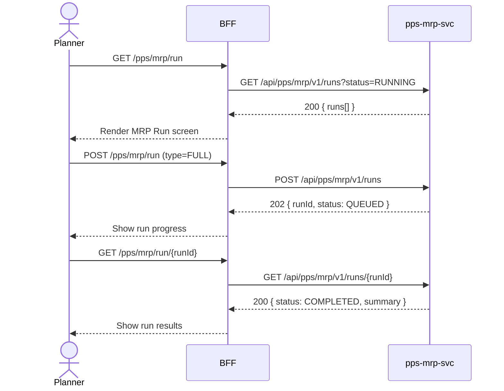

# F-PPS-001-01 — MRP Run

> **Conceptual Stack Layer:** Domain-Feature
> **Space:** Domain
> **Owner:** PPS Engineering Team
> **Companion files:** `F-PPS-001-01.uvl`, `F-PPS-001-01.aui.yaml`
> **Referenced by:** Suite Feature Catalog SS6
> **References:** `pps_mrp-spec.md` (backend)

> **Meta Information**
> - **Version:** 2026-04-04
> - **Template:** `feature-spec.md` v1.0.0
> - **Template Compliance:** 100%
> - **Status:** DRAFT
> - **Feature ID:** `F-PPS-001-01`
> - **Suite:** `pps`
> - **Node type:** LEAF
> - **Parent:** `F-PPS-001` — Production Planning Core
> - **Companion UVL:** `F-PPS-001-01.uvl`
> - **Companion AUI:** `F-PPS-001-01.aui.yaml`

---

## ═══════════════════════════════════════════════
## PROBLEM SPACE
## ═══════════════════════════════════════════════

## 0. Feature Identity & Orientation

### 0.1 One-Line Summary
This feature lets a **production planner** execute an MRP run to recalculate planned production orders based on current demand.

### 0.2 Non-Goals
- Does not browse or manage production orders — that is F-PPS-001-02.
- Does not display capacity profiles — that is F-PPS-001-03.
- Does not post actual goods movements — that is F-PPS-003-02.

### 0.3 Entry & Exit Points

**Entry points:**
- Production Planning menu → "MRP Run"
- Direct URL: `/pps/mrp/run`

**Exit points:**
- Run completes → navigate to F-PPS-001-02 (Production Order Browse) for results
- Back to Production Planning dashboard

### 0.4 Variability Points

| Variability Point | Model | Values | Default | Binding Time |
|---|---|---|---|---|
| Full regeneration mode | UVL attribute | true/false | false | runtime |
| Max planning horizon (days) | UVL attribute | 1–365 | 90 | runtime |

---

## 1. User Goal & Scenarios

### 1.1 User Goal
Trigger an MRP run to regenerate or net-change planned production orders and purchase requisitions based on current demand, inventory levels, and bills of material.

### 1.2 Scenarios

| # | Scenario | Precondition | Action | Expected Outcome |
|---|----------|-------------|--------|-----------------|
| S1 | Full MRP run | Planner is authenticated; no run in progress | Select "Full Regenerative Run" and start | MRP run executes; all planned orders recalculated |
| S2 | Regenerative run | Full run selected | Confirm run parameters and submit | Background job started; run log displays progress |
| S3 | Net change run | Previous full run exists | Select "Net Change Run" and start | Only demand-changed items recalculated |
| S4 | View run results | Run has completed | Open completed run record | Run summary: orders created, deleted, rescheduled |
| S5 | Cancel running MRP | Run is in progress | Click "Cancel Run" | Run stopped; partial results discarded; log updated |

---

## 2. User Journey & Screen Layout

### 2.1 Sequence Diagram



### 2.2 Screen Layout

```
┌─────────────────────────────────────────────────────┐
│ [← Planning]   MRP Run                              │
├─────────────────────────────────────────────────────┤
│ Run Type: [● Full Regenerative  ○ Net Change]       │
│ Planning Horizon: [90] days                         │
├─────────────────────────────────────────────────────┤
│  Run ID       Type     Started       Status         │
│  MRP-20260404 FULL     2026-04-04    COMPLETED  →   │
│  MRP-20260401 NET_CHG  2026-04-01    COMPLETED  →   │
├─────────────────────────────────────────────────────┤
│ [EXT: extension zone]                               │
├─────────────────────────────────────────────────────┤
│                         [Cancel]  [Start MRP Run ▶] │
└─────────────────────────────────────────────────────┘
```

---

## 3. Interaction Requirements

### 3.1 Fields Table

| Field | Type | Required | Editable | Validation | i18n Key |
|---|---|---|---|---|---|
| Run Type | radio | Yes | Yes | FULL or NET_CHANGE | `F-PPS-001-01.field.runType` |
| Planning Horizon | integer input | Yes | Yes | 1–365 days | `F-PPS-001-01.field.horizon` |

### 3.2 Actions Table

| Action | Trigger | Precondition | Effect |
|---|---|---|---|
| Start MRP Run | Button click | No run already in progress; form valid | POST run to pps-mrp-svc; show progress |
| Cancel Run | Button click | Run is in RUNNING state | DELETE run; log updated |
| View Run Results | Row click | Run status is COMPLETED | Navigate to run detail |

### 3.3 Validation Messages

| Field | Condition | Message |
|---|---|---|
| Planning Horizon | < 1 or > 365 | "Horizon must be between 1 and 365 days." |
| Run Type | Not selected | "Select a run type before starting." |
| Start | Run already in progress | "An MRP run is already in progress. Wait for it to complete or cancel it." |

---

## 4. Edge Cases & Screen States

### 4.1 Component States

| State | When | Behaviour |
|---|---|---|
| **Loading** | Awaiting API response | Form skeleton; controls disabled |
| **Run in progress** | Run status is RUNNING | Progress bar shown; Start button replaced by Cancel |
| **Empty** | No previous runs | Empty state: "No MRP runs found. Start your first run." |
| **Error** | pps-mrp-svc unavailable | Inline error: "MRP service unavailable. Retry." + retry button |
| **Populated** | Data ready | Render run history list normally |

### 4.2 Specific Edge Cases

| Case | Behaviour | Affected users |
|---|---|---|
| Concurrent run attempt | Server returns 409; display "Run already in progress" | Planner |
| Run exceeds timeout | Run status set to FAILED; error details in log | Planner |

### 4.3 Attribute-Driven Behaviour Changes

| Attribute | Non-default value | Observable change |
|---|---|---|
| `full_regeneration` | true | Full regenerative run pre-selected on screen load |
| `max_planning_horizon_days` | 180 | Horizon input capped at 180 days |

### 4.4 Connectivity
This feature requires a live connection.
On network loss: top-of-page banner — "MRP service is unavailable offline."

---

## ═══════════════════════════════════════════════
## SOLUTION SPACE
## ═══════════════════════════════════════════════

## 5. Backend Dependencies & BFF Contract

### 5.1 Service Calls

| # | Service | Endpoint | Tier | isMutation | Failure Mode |
|---|---------|----------|------|------------|-------------|
| 1 | pps-mrp-svc | `GET /api/pps/mrp/v1/runs` | T3 | No | Show error + retry |
| 2 | pps-mrp-svc | `POST /api/pps/mrp/v1/runs` | T3 | Yes | Show error + retry |
| 3 | pps-mrp-svc | `GET /api/pps/mrp/v1/runs/{id}` | T3 | No | Show error + retry |

### 5.2 BFF View-Model Shape

```jsonc
{
  "currentRun": null,             // or { runId, status, startedAt, progress }
  "runs": [
    {
      "runId": "MRP-20260404",
      "type": "FULL",
      "startedAt": "2026-04-04T06:00:00Z",
      "completedAt": "2026-04-04T06:04:33Z",
      "status": "COMPLETED",
      "summary": {
        "ordersCreated": 142,
        "ordersDeleted": 18,
        "ordersRescheduled": 34
      }
    }
  ]
}
```

### 5.3 Feature-Gating Rules

| Mode | Behaviour |
|---|---|
| Full | Start and Cancel available to PLANNER and PLANT_MANAGER |
| Read-only | Run history visible; Start and Cancel hidden |
| Excluded | Menu item hidden; direct URL returns 404 |

### 5.4 Failure Modes

| Failure | User Experience |
|---------|----------------|
| pps-mrp-svc down | Error state with retry button |
| Run timeout | Run status FAILED with error detail |

### 5.5 Caching Hints
BFF MUST NOT cache run status responses. Run history list MAY be cached for 30 seconds.

### 5.6 i18n Keys

| Key | Default (en) |
|-----|-------------|
| `F-PPS-001-01.title` | `MRP Run` |
| `F-PPS-001-01.field.runType` | `Run Type` |
| `F-PPS-001-01.field.horizon` | `Planning Horizon (days)` |
| `F-PPS-001-01.action.start` | `Start MRP Run` |
| `F-PPS-001-01.action.cancel` | `Cancel Run` |
| `F-PPS-001-01.empty` | `No MRP runs found.` |
| `F-PPS-001-01.error.unavailable` | `MRP service unavailable.` |
| `F-PPS-001-01.error.inProgress` | `An MRP run is already in progress.` |

---

## 6. AUI Screen Contract

See companion file `F-PPS-001-01.aui.yaml`.

---

## ═══════════════════════════════════════════════
## BRIDGE ARTIFACTS
## ═══════════════════════════════════════════════

## 7. Permissions & Accessibility

### 7.1 Permission Matrix

| Action | PLANT_MANAGER | PLANNER | SUPERVISOR | OPERATOR |
|---|---|---|---|---|
| View run history | ✓ | ✓ | ✓ | — |
| Start MRP run | ✓ | ✓ | — | — |
| Cancel MRP run | ✓ | ✓ | — | — |

### 7.2 Accessibility
- Run type radio group MUST have ARIA `role="radiogroup"` with legend.
- Progress bar MUST have `aria-valuenow`, `aria-valuemin`, `aria-valuemax`.
- Keyboard: Tab through fields; Enter to start run.

---

## 8. Acceptance Criteria

| AC | Scenario | Given | When | Then |
|----|----------|-------|------|------|
| AC-01 | S1 | Planner opens MRP Run | Page loads | Run history displayed; form ready |
| AC-02 | S2 | Full run selected | Planner clicks Start | Run submitted; progress indicator shown |
| AC-03 | S3 | Net change selected | Planner clicks Start | Net change run started; only changed items recalculated |
| AC-04 | S4 | Run completed | Planner clicks run row | Run summary displayed with created/deleted/rescheduled counts |
| AC-05 | S5 | Run in progress | Planner clicks Cancel | Run cancelled; status updated to CANCELLED |
| AC-06 | Error | Run already in progress | Planner clicks Start | Error message "An MRP run is already in progress" displayed |

---

## 9. Variability & Extension

### 9.1 Feature Dependencies
Requires IAM authentication (cross-suite). Produces `pps.mrp.mrp-run.completed` event consumed by pps-mes-svc.

### 9.2 Attributes
See SS0.4 variability points. Binding times: `runtime`.

### 9.3 Extension Points
| Extension Zone | Interface | Default Behaviour |
|---|---|---|
| `ext.mrpRunActions` | Additional action buttons in header | Hidden (no extension) |

### 9.4 Companion UVL
See `uvl/leaves/F-PPS-001-01.uvl`.

---

**END OF SPECIFICATION**
