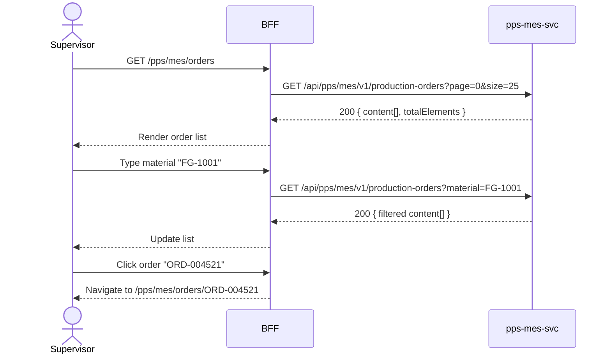

# F-PPS-001-02 — Production Order Browse

> **Conceptual Stack Layer:** Domain-Feature
> **Space:** Domain
> **Owner:** PPS Engineering Team
> **Companion files:** `F-PPS-001-02.uvl`, `F-PPS-001-02.aui.yaml`
> **Referenced by:** Suite Feature Catalog SS6
> **References:** `pps_mes-spec.md` (backend)

> **Meta Information**
> - **Version:** 2026-04-04
> - **Template:** `feature-spec.md` v1.0.0
> - **Template Compliance:** 100%
> - **Status:** DRAFT
> - **Feature ID:** `F-PPS-001-02`
> - **Suite:** `pps`
> - **Node type:** LEAF
> - **Parent:** `F-PPS-001` — Production Planning Core
> - **Companion UVL:** `F-PPS-001-02.uvl`
> - **Companion AUI:** `F-PPS-001-02.aui.yaml`

---

## ═══════════════════════════════════════════════
## PROBLEM SPACE
## ═══════════════════════════════════════════════

## 0. Feature Identity & Orientation

### 0.1 One-Line Summary
This feature lets a **production supervisor** browse and search production orders by status, material, and plant.

### 0.2 Non-Goals
- Does not execute MRP runs — that is F-PPS-001-01.
- Does not confirm or complete work orders — that is F-PPS-002-01.
- Does not display capacity profiles — that is F-PPS-001-03.

### 0.3 Entry & Exit Points

**Entry points:**
- Shop Floor menu → "Production Orders"
- Direct URL: `/pps/mes/orders`

**Exit points:**
- Select an order → navigate to production order detail
- Export list → download CSV/XLSX
- Back to Shop Floor dashboard

### 0.4 Variability Points

| Variability Point | Model | Values | Default | Binding Time |
|---|---|---|---|---|
| Show closed orders | UVL attribute | true/false | false | runtime |
| Page size | UVL attribute | 10, 25, 50, 100 | 25 | runtime |

---

## 1. User Goal & Scenarios

### 1.1 User Goal
Find specific production orders or review the full order list to understand production status across materials and plants, then navigate to the relevant order for detailed action.

### 1.2 Scenarios

| # | Scenario | Precondition | Action | Expected Outcome |
|---|----------|-------------|--------|-----------------|
| S1 | Browse all orders | Supervisor is authenticated | Open production order list | Paginated list with order number, material, plant, quantity, status |
| S2 | Filter by status | Order list displayed | Select status = IN_PROGRESS | Only in-progress orders shown |
| S3 | Search by material | Order list displayed | Type material number in search | List filters to orders for that material |
| S4 | Navigate to order detail | Order list displayed | Click order row | Navigate to production order detail view |
| S5 | Export list | Order list displayed | Click "Export" | CSV/XLSX download of current filtered list |

---

## 2. User Journey & Screen Layout

### 2.1 Sequence Diagram



### 2.2 Screen Layout

```
┌─────────────────────────────────────────────────────┐
│ [← Shop Floor]   Production Orders                  │
├─────────────────────────────────────────────────────┤
│ [Search: material/order no.]  [Status: All ▾]  [Plant: All ▾] │
├───────────┬──────────┬───────┬──────┬───────────────┤
│ Order No. │ Material │ Plant │ Qty  │ Status        │
├───────────┼──────────┼───────┼──────┼───────────────┤
│ ORD-004521│ FG-1001  │ P001  │ 500  │ IN_PROGRESS → │
│ ORD-004520│ FG-1002  │ P001  │ 200  │ PLANNED    →  │
│ ORD-004519│ FG-1003  │ P002  │  50  │ COMPLETED  →  │
├───────────┴──────────┴───────┴──────┴───────────────┤
│ [EXT: extension zone]                               │
├─────────────────────────────────────────────────────┤
│ Showing 1-25 of 312  [← Prev] [1] [2] … [Next →]   │
│                                          [Export ↓] │
└─────────────────────────────────────────────────────┘
```

---

## 3. Interaction Requirements

### 3.1 Fields Table

| Field | Type | Required | Editable | Validation | i18n Key |
|---|---|---|---|---|---|
| Search | text input | No | Yes | min 2 chars to trigger | `F-PPS-001-02.search.placeholder` |
| Status filter | select | No | Yes | PLANNED, IN_PROGRESS, COMPLETED, CLOSED, All | `F-PPS-001-02.filter.status` |
| Plant filter | select | No | Yes | plant list from ref-svc | `F-PPS-001-02.filter.plant` |

### 3.2 Actions Table

| Action | Trigger | Precondition | Effect |
|---|---|---|---|
| Search | Keystroke (debounced 300ms) | ≥ 2 chars | Filter order list |
| Filter by status | Select change | — | Filter order list |
| Filter by plant | Select change | — | Filter order list |
| Select order | Row click | — | Navigate to order detail |
| Export | Button click | List has results | Download filtered list |
| Page change | Pagination click | — | Load requested page |

### 3.3 Validation Messages

| Field | Condition | Message |
|---|---|---|
| Search | < 2 chars | (no action — debounced) |

---

## 4. Edge Cases & Screen States

### 4.1 Component States

| State | When | Behaviour |
|---|---|---|
| **Loading** | Awaiting API response | Table skeleton with shimmer rows; controls disabled |
| **Empty** | No orders match filter/search | "No production orders found. Adjust your filters." |
| **Error** | pps-mes-svc unavailable | Inline error: "Production order service unavailable. Retry." + retry button |
| **Populated** | Data ready | Render table normally |

### 4.2 Specific Edge Cases

| Case | Behaviour | Affected users |
|---|---|---|
| Closed orders hidden | Default — toggle `showClosedOrders` attribute to show | All users |
| > 10,000 orders | Server-side pagination; no client-side loading | Large plants |

### 4.3 Attribute-Driven Behaviour Changes

| Attribute | Non-default value | Observable change |
|---|---|---|
| `show_closed_orders` | true | CLOSED status orders appear in list |
| `page_size` | 50 | Longer table; fewer pages in pagination bar |

### 4.4 Connectivity
This feature requires a live connection.
On network loss: top-of-page banner — "Production orders are unavailable offline."

---

## ═══════════════════════════════════════════════
## SOLUTION SPACE
## ═══════════════════════════════════════════════

## 5. Backend Dependencies & BFF Contract

### 5.1 Service Calls

| # | Service | Endpoint | Tier | isMutation | Failure Mode |
|---|---------|----------|------|------------|-------------|
| 1 | pps-mes-svc | `GET /api/pps/mes/v1/production-orders` | T3 | No | Show error + retry |

### 5.2 BFF View-Model Shape

```jsonc
{
  "orders": [
    {
      "orderId": "ORD-004521",
      "material": "FG-1001",
      "plant": "P001",
      "quantity": 500,
      "unit": "PC",
      "status": "IN_PROGRESS",
      "scheduledStart": "2026-04-04",
      "scheduledEnd": "2026-04-06"
    }
  ],
  "pagination": {
    "page": 0,
    "size": 25,
    "totalElements": 312,
    "totalPages": 13
  }
}
```

### 5.3 Feature-Gating Rules

| Mode | Behaviour |
|---|---|
| Full | All interactions available |
| Read-only | Same as full (this is a read-only feature) |
| Excluded | Menu item hidden; direct URL returns 404 |

### 5.4 Failure Modes

| Failure | User Experience |
|---------|----------------|
| pps-mes-svc down | Error state with retry button |

### 5.5 Caching Hints
BFF MAY cache production order list for 60 seconds. Cache MUST be invalidated on `pps.mes.production-order.created`, `pps.mes.production-order.updated`, or `pps.mes.production-order.completed` events.

### 5.6 i18n Keys

| Key | Default (en) |
|-----|-------------|
| `F-PPS-001-02.title` | `Production Orders` |
| `F-PPS-001-02.search.placeholder` | `Search by material or order no…` |
| `F-PPS-001-02.filter.status` | `Status` |
| `F-PPS-001-02.filter.plant` | `Plant` |
| `F-PPS-001-02.empty` | `No production orders found.` |
| `F-PPS-001-02.error.unavailable` | `Production order service unavailable.` |
| `F-PPS-001-02.action.export` | `Export` |

---

## 6. AUI Screen Contract

See companion file `F-PPS-001-02.aui.yaml`.

---

## ═══════════════════════════════════════════════
## BRIDGE ARTIFACTS
## ═══════════════════════════════════════════════

## 7. Permissions & Accessibility

### 7.1 Permission Matrix

| Action | PLANT_MANAGER | PLANNER | SUPERVISOR | OPERATOR |
|---|---|---|---|---|
| View order list | ✓ | ✓ | ✓ | — |
| Export list | ✓ | ✓ | ✓ | — |
| Navigate to detail | ✓ | ✓ | ✓ | — |

### 7.2 Accessibility
- Table MUST have ARIA role `grid` with sortable column headers.
- Search field MUST have `aria-label`.
- Keyboard: Tab through filters, Enter to select row.

---

## 8. Acceptance Criteria

| AC | Scenario | Given | When | Then |
|----|----------|-------|------|------|
| AC-01 | S1 | Supervisor opens order list | Page loads | Paginated list displayed with order no., material, plant, qty, status |
| AC-02 | S2 | Order list displayed | Supervisor selects status = IN_PROGRESS | Only in-progress orders shown |
| AC-03 | S3 | Order list displayed | Supervisor types material number | List filters to matching orders within 500ms |
| AC-04 | S4 | Order list displayed | Supervisor clicks order row | Navigates to production order detail |
| AC-05 | S5 | Order list displayed | Supervisor clicks Export | CSV/XLSX download initiated |
| AC-06 | Error | pps-mes-svc unavailable | Supervisor opens list | Error message with retry button displayed |

---

## 9. Variability & Extension

### 9.1 Feature Dependencies
Requires IAM authentication (cross-suite). Required by F-PPS-001-03 and F-PPS-002-01.

### 9.2 Attributes
See SS0.4 variability points. Binding times: `runtime`.

### 9.3 Extension Points
| Extension Zone | Interface | Default Behaviour |
|---|---|---|
| `ext.orderListActions` | Additional action buttons in header | Hidden (no extension) |

### 9.4 Companion UVL
See `uvl/leaves/F-PPS-001-02.uvl`.

---

**END OF SPECIFICATION**
