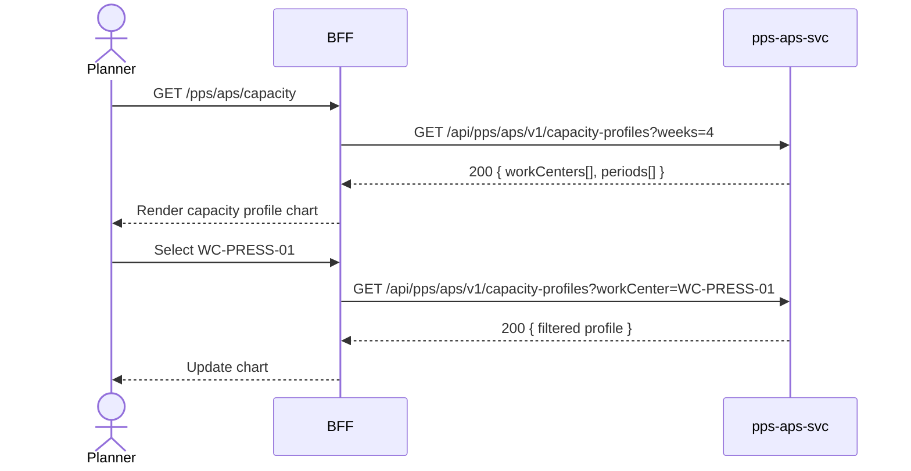

# F-PPS-001-03 — Capacity Planning

> **Conceptual Stack Layer:** Domain-Feature
> **Space:** Domain
> **Owner:** PPS Engineering Team
> **Companion files:** `F-PPS-001-03.uvl`, `F-PPS-001-03.aui.yaml`
> **Referenced by:** Suite Feature Catalog SS6
> **References:** `pps_aps-spec.md` (backend)

> **Meta Information**
> - **Version:** 2026-04-04
> - **Template:** `feature-spec.md` v1.0.0
> - **Template Compliance:** 100%
> - **Status:** DRAFT
> - **Feature ID:** `F-PPS-001-03`
> - **Suite:** `pps`
> - **Node type:** LEAF
> - **Parent:** `F-PPS-001` — Production Planning Core
> - **Companion UVL:** `F-PPS-001-03.uvl`
> - **Companion AUI:** `F-PPS-001-03.aui.yaml`

---

## ═══════════════════════════════════════════════
## PROBLEM SPACE
## ═══════════════════════════════════════════════

## 0. Feature Identity & Orientation

### 0.1 One-Line Summary
This feature lets a **production planner** view work center load profiles to identify bottlenecks and adjust planned orders.

### 0.2 Non-Goals
- Does not execute MRP runs — that is F-PPS-001-01.
- Does not manage production orders directly — that is F-PPS-001-02.
- Does not confirm shop floor operations — that is F-PPS-002-01.

### 0.3 Entry & Exit Points

**Entry points:**
- Production Planning menu → "Capacity Planning"
- Direct URL: `/pps/aps/capacity`

**Exit points:**
- Select overloaded order → navigate to F-PPS-001-02 for order adjustment
- Back to Production Planning dashboard

### 0.4 Variability Points

| Variability Point | Model | Values | Default | Binding Time |
|---|---|---|---|---|
| Display period (weeks) | UVL attribute | 1–52 | 4 | runtime |
| Overload threshold (%) | UVL attribute | 50–150 | 100 | deploy |

---

## 1. User Goal & Scenarios

### 1.1 User Goal
Understand work center utilisation across the planning horizon, identify overloaded or underloaded periods, and adjust planned orders to level the load and prevent shop floor bottlenecks.

### 1.2 Scenarios

| # | Scenario | Precondition | Action | Expected Outcome |
|---|----------|-------------|--------|-----------------|
| S1 | View capacity profile | Planner is authenticated; MRP run completed | Open Capacity Planning | Bar chart of utilisation per work center per period |
| S2 | Filter by work center | Profile displayed | Select work center "WC-PRESS-01" | Chart shows only that work center's load |
| S3 | Resolve overload | Overloaded period identified | Click overloaded bar → select order → reschedule | Order rescheduled; profile recalculates |
| S4 | Level load | Profile displayed with slack in later periods | Drag order to later period | Order start date updated; load redistributed |

---

## 2. User Journey & Screen Layout

### 2.1 Sequence Diagram



### 2.2 Screen Layout

```
┌─────────────────────────────────────────────────────┐
│ [← Planning]   Capacity Planning                    │
├─────────────────────────────────────────────────────┤
│ [Work Center: All ▾]  [Period: 4 weeks ▾]           │
├─────────────────────────────────────────────────────┤
│  Work Center  │ Wk 14  │ Wk 15  │ Wk 16  │ Wk 17   │
│  WC-PRESS-01  │ ▓▓▓ 75%│ ▓▓▓▓▓▓120%!│ ▓▓ 50%│ ▓▓ 60%│
│  WC-WELD-02   │ ▓▓▓ 80%│ ▓▓▓ 70%│ ▓▓▓ 85%│ ▓▓▓ 90%│
├─────────────────────────────────────────────────────┤
│ [EXT: extension zone]                               │
├─────────────────────────────────────────────────────┤
│                              [Export]  [Level Load] │
└─────────────────────────────────────────────────────┘
```

---

## 3. Interaction Requirements

### 3.1 Fields Table

| Field | Type | Required | Editable | Validation | i18n Key |
|---|---|---|---|---|---|
| Work Center filter | select | No | Yes | work center list from pps-aps-svc | `F-PPS-001-03.filter.workCenter` |
| Period | select | No | Yes | 1–52 weeks | `F-PPS-001-03.filter.period` |

### 3.2 Actions Table

| Action | Trigger | Precondition | Effect |
|---|---|---|---|
| Filter by work center | Select change | — | Reload profile for selected work center |
| Change period | Select change | — | Reload profile for selected horizon |
| Drill into overload | Click overloaded bar | Overload ≥ threshold | Show order list contributing to overload |
| Level Load | Button click | Profile displayed | Auto-reschedule overloaded orders |

### 3.3 Validation Messages

| Field | Condition | Message |
|---|---|---|
| Period | < 1 or > 52 | "Period must be between 1 and 52 weeks." |

---

## 4. Edge Cases & Screen States

### 4.1 Component States

| State | When | Behaviour |
|---|---|---|
| **Loading** | Awaiting API response | Chart skeleton; controls disabled |
| **No overloads** | All work centers within threshold | Green indicators; "No bottlenecks detected" hint |
| **Empty** | No work centers / no planned orders | Empty state: "No capacity data. Run MRP first." |
| **Error** | pps-aps-svc unavailable | Inline error: "Capacity planning service unavailable. Retry." + retry button |

### 4.2 Specific Edge Cases

| Case | Behaviour | Affected users |
|---|---|---|
| No completed MRP run | Empty state with link to F-PPS-001-01 | Planner |
| Level Load produces conflicts | Error with list of unresolvable orders | Planner |

### 4.3 Attribute-Driven Behaviour Changes

| Attribute | Non-default value | Observable change |
|---|---|---|
| `display_period_weeks` | 8 | Chart shows 8-week horizon by default |
| `overload_threshold_pct` | 90 | Bars ≥ 90% highlighted as overloaded |

### 4.4 Connectivity
This feature requires a live connection.
On network loss: top-of-page banner — "Capacity planning is unavailable offline."

---

## ═══════════════════════════════════════════════
## SOLUTION SPACE
## ═══════════════════════════════════════════════

## 5. Backend Dependencies & BFF Contract

### 5.1 Service Calls

| # | Service | Endpoint | Tier | isMutation | Failure Mode |
|---|---------|----------|------|------------|-------------|
| 1 | pps-aps-svc | `GET /api/pps/aps/v1/capacity-profiles` | T3 | No | Show error + retry |

### 5.2 BFF View-Model Shape

```jsonc
{
  "workCenters": [
    {
      "workCenterId": "WC-PRESS-01",
      "periods": [
        { "week": 14, "loadPct": 75, "overloaded": false },
        { "week": 15, "loadPct": 120, "overloaded": true }
      ]
    }
  ]
}
```

### 5.3 Feature-Gating Rules

| Mode | Behaviour |
|---|---|
| Full | All interactions available to PLANNER and PLANT_MANAGER |
| Read-only | Chart visible; Level Load hidden |
| Excluded | Menu item hidden; direct URL returns 404 |

### 5.4 Failure Modes

| Failure | User Experience |
|---------|----------------|
| pps-aps-svc down | Error state with retry button |

### 5.5 Caching Hints
BFF MAY cache capacity profiles for 2 minutes. Cache MUST be invalidated on `pps.aps.capacity-schedule.optimized` event.

### 5.6 i18n Keys

| Key | Default (en) |
|-----|-------------|
| `F-PPS-001-03.title` | `Capacity Planning` |
| `F-PPS-001-03.filter.workCenter` | `Work Center` |
| `F-PPS-001-03.filter.period` | `Planning Period` |
| `F-PPS-001-03.empty` | `No capacity data. Run MRP first.` |
| `F-PPS-001-03.error.unavailable` | `Capacity planning service unavailable.` |
| `F-PPS-001-03.action.levelLoad` | `Level Load` |

---

## 6. AUI Screen Contract

See companion file `F-PPS-001-03.aui.yaml`.

---

## ═══════════════════════════════════════════════
## BRIDGE ARTIFACTS
## ═══════════════════════════════════════════════

## 7. Permissions & Accessibility

### 7.1 Permission Matrix

| Action | PLANT_MANAGER | PLANNER | SUPERVISOR | OPERATOR |
|---|---|---|---|---|
| View capacity profiles | ✓ | ✓ | — | — |
| Level load | ✓ | ✓ | — | — |
| Export | ✓ | ✓ | — | — |

### 7.2 Accessibility
- Chart MUST provide tabular data alternative for screen readers.
- Overloaded cells MUST use ARIA `role="alert"` pattern.
- Keyboard: Tab through work center rows; Enter to drill into overload.

---

## 8. Acceptance Criteria

| AC | Scenario | Given | When | Then |
|----|----------|-------|------|------|
| AC-01 | S1 | Planner opens Capacity Planning | Page loads | Utilisation chart displayed per work center per week |
| AC-02 | S2 | Profile displayed | Planner selects WC-PRESS-01 | Chart filtered to that work center only |
| AC-03 | S3 | Overloaded bar visible | Planner clicks overloaded bar | Order list contributing to overload shown |
| AC-04 | S4 | Profile with slack periods | Planner clicks Level Load | Overloaded orders rescheduled; profile recalculates |
| AC-05 | Error | pps-aps-svc unavailable | Planner opens page | Error message with retry button |

---

## 9. Variability & Extension

### 9.1 Feature Dependencies
Requires IAM authentication (cross-suite). Requires F-PPS-001-02 (Production Order Browse).

### 9.2 Attributes
See SS0.4 variability points. Binding times: `deploy`, `runtime`.

### 9.3 Extension Points
| Extension Zone | Interface | Default Behaviour |
|---|---|---|
| `ext.capacityChartOverlay` | Custom chart overlay components | Hidden (no extension) |

### 9.4 Companion UVL
See `uvl/leaves/F-PPS-001-03.uvl`.

---

**END OF SPECIFICATION**
