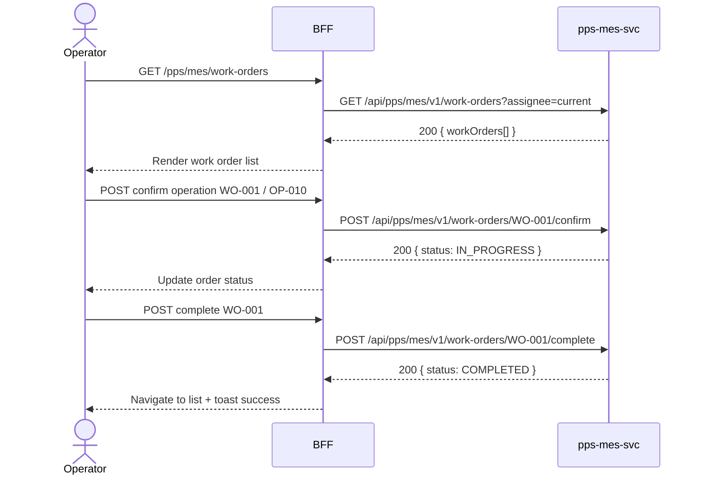

# F-PPS-002-01 — Work Order Management

> **Conceptual Stack Layer:** Domain-Feature
> **Space:** Domain
> **Owner:** PPS Engineering Team
> **Companion files:** `F-PPS-002-01.uvl`, `F-PPS-002-01.aui.yaml`
> **Referenced by:** Suite Feature Catalog SS6
> **References:** `pps_mes-spec.md` (backend)

> **Meta Information**
> - **Version:** 2026-04-04
> - **Template:** `feature-spec.md` v1.0.0
> - **Template Compliance:** 100%
> - **Status:** DRAFT
> - **Feature ID:** `F-PPS-002-01`
> - **Suite:** `pps`
> - **Node type:** LEAF
> - **Parent:** `F-PPS-002` — Shop Floor Execution
> - **Companion UVL:** `F-PPS-002-01.uvl`
> - **Companion AUI:** `F-PPS-002-01.aui.yaml`

---

## ═══════════════════════════════════════════════
## PROBLEM SPACE
## ═══════════════════════════════════════════════

## 0. Feature Identity & Orientation

### 0.1 One-Line Summary
This feature lets a **shop floor operator** manage work orders: confirm operations, record goods movements, and complete orders.

### 0.2 Non-Goals
- Does not record detailed MES quantities — that is F-PPS-002-02.
- Does not record quality inspection results — that is F-PPS-002-03.
- Does not browse production orders — that is F-PPS-001-02.

### 0.3 Entry & Exit Points

**Entry points:**
- Shop Floor menu → "Work Orders"
- Direct URL: `/pps/mes/work-orders`

**Exit points:**
- Select work order → navigate to work order detail / F-PPS-002-02 (MES Recording)
- Complete order → return to work order list
- Back to Shop Floor dashboard

### 0.4 Variability Points

| Variability Point | Model | Values | Default | Binding Time |
|---|---|---|---|---|
| Show completed orders | UVL attribute | true/false | false | runtime |
| Auto-post goods issue on confirm | UVL attribute | true/false | false | deploy |

---

## 1. User Goal & Scenarios

### 1.1 User Goal
View and act on assigned work orders: confirm that operations are starting, record time and goods, report scrap quantities, and complete orders to trigger downstream goods receipts.

### 1.2 Scenarios

| # | Scenario | Precondition | Action | Expected Outcome |
|---|----------|-------------|--------|-----------------|
| S1 | View assigned work orders | Operator is authenticated | Open work order list | List of assigned work orders with status and operation |
| S2 | Confirm operation | Work order is in READY status | Click "Confirm" on operation | Operation status changes to IN_PROGRESS; time recording starts |
| S3 | Record time | Operation is IN_PROGRESS | Enter actual hours on operation | Hours saved against work order |
| S4 | Report scrap | Operation is IN_PROGRESS | Enter scrap quantity | Scrap recorded; yield quantity updated |
| S5 | Complete order | All operations confirmed | Click "Complete Order" | Work order set to COMPLETED; goods receipt triggered |

---

## 2. User Journey & Screen Layout

### 2.1 Sequence Diagram



### 2.2 Screen Layout

```
┌─────────────────────────────────────────────────────┐
│ [← Shop Floor]   Work Orders                        │
├─────────────────────────────────────────────────────┤
│ [Search: order no.]  [Status: Open ▾]  [WC: All ▾]  │
├────────┬────────────┬───────────┬───────────────────┤
│ WO No. │ Operation  │ Work Ctr  │ Status            │
├────────┼────────────┼───────────┼───────────────────┤
│ WO-001 │ OP-010     │ WC-PRESS  │ READY      [✓]  → │
│ WO-002 │ OP-020     │ WC-WELD   │ IN_PROGRESS    → │
├────────┴────────────┴───────────┴───────────────────┤
│ [EXT: extension zone]                               │
├─────────────────────────────────────────────────────┤
│                               [Complete Order]       │
└─────────────────────────────────────────────────────┘
```

---

## 3. Interaction Requirements

### 3.1 Fields Table

| Field | Type | Required | Editable | Validation | i18n Key |
|---|---|---|---|---|---|
| Search | text input | No | Yes | min 2 chars | `F-PPS-002-01.search.placeholder` |
| Status filter | select | No | Yes | READY, IN_PROGRESS, COMPLETED, All | `F-PPS-002-01.filter.status` |
| Work Center filter | select | No | Yes | work center list | `F-PPS-002-01.filter.workCenter` |
| Scrap quantity | number | No | Yes | ≥ 0, ≤ order quantity | `F-PPS-002-01.field.scrap` |
| Actual hours | decimal | No | Yes | > 0 | `F-PPS-002-01.field.hours` |

### 3.2 Actions Table

| Action | Trigger | Precondition | Effect |
|---|---|---|---|
| Confirm operation | Button click | Operation in READY | POST confirm; status → IN_PROGRESS |
| Record time | Form submit | Operation IN_PROGRESS | PATCH work order with actual hours |
| Report scrap | Form submit | Operation IN_PROGRESS | PATCH work order with scrap qty |
| Complete order | Button click | All operations confirmed | POST complete; status → COMPLETED |

### 3.3 Validation Messages

| Field | Condition | Message |
|---|---|---|
| Scrap quantity | > order quantity | "Scrap cannot exceed order quantity." |
| Actual hours | ≤ 0 | "Hours must be greater than zero." |
| Complete | Uncompleted operations remain | "All operations must be confirmed before completing the order." |

---

## 4. Edge Cases & Screen States

### 4.1 Component States

| State | When | Behaviour |
|---|---|---|
| **Loading** | Awaiting API response | Table skeleton; controls disabled |
| **Empty** | No work orders assigned | "No work orders assigned. Contact your supervisor." |
| **Error** | pps-mes-svc unavailable | Inline error: "Work order service unavailable. Retry." + retry button |
| **Populated** | Data ready | Render table normally |

### 4.2 Specific Edge Cases

| Case | Behaviour | Affected users |
|---|---|---|
| Concurrent confirmation | Server returns 409; display "Operation already confirmed" | Operator |
| Goods issue failure | Complete order blocked; error with material details | Operator |

### 4.3 Attribute-Driven Behaviour Changes

| Attribute | Non-default value | Observable change |
|---|---|---|
| `show_completed_orders` | true | COMPLETED orders visible in list |
| `auto_post_goods_issue` | true | Goods issue posted automatically on operation confirm |

### 4.4 Connectivity
This feature requires a live connection.
On network loss: top-of-page banner — "Work order service is unavailable offline."

---

## ═══════════════════════════════════════════════
## SOLUTION SPACE
## ═══════════════════════════════════════════════

## 5. Backend Dependencies & BFF Contract

### 5.1 Service Calls

| # | Service | Endpoint | Tier | isMutation | Failure Mode |
|---|---------|----------|------|------------|-------------|
| 1 | pps-mes-svc | `GET /api/pps/mes/v1/work-orders` | T3 | No | Show error + retry |
| 2 | pps-mes-svc | `POST /api/pps/mes/v1/work-orders/{id}/confirm` | T3 | Yes | Show error + retry |
| 3 | pps-mes-svc | `POST /api/pps/mes/v1/work-orders/{id}/complete` | T3 | Yes | Show error + retry |

### 5.2 BFF View-Model Shape

```jsonc
{
  "workOrders": [
    {
      "workOrderId": "WO-001",
      "productionOrderId": "ORD-004521",
      "operation": "OP-010",
      "workCenter": "WC-PRESS-01",
      "quantity": 500,
      "scrapQty": 0,
      "actualHours": null,
      "status": "READY"
    }
  ]
}
```

### 5.3 Feature-Gating Rules

| Mode | Behaviour |
|---|---|
| Full | All interactions available to OPERATOR and SUPERVISOR |
| Read-only | List visible; Confirm and Complete hidden |
| Excluded | Menu item hidden; direct URL returns 404 |

### 5.4 Failure Modes

| Failure | User Experience |
|---------|----------------|
| pps-mes-svc down | Error state with retry button |
| Goods issue fails on complete | Block completion; show material-level error |

### 5.5 Caching Hints
BFF MUST NOT cache mutation responses. Work order list MAY be cached for 30 seconds per operator.

### 5.6 i18n Keys

| Key | Default (en) |
|-----|-------------|
| `F-PPS-002-01.title` | `Work Orders` |
| `F-PPS-002-01.search.placeholder` | `Search by work order no…` |
| `F-PPS-002-01.filter.status` | `Status` |
| `F-PPS-002-01.filter.workCenter` | `Work Center` |
| `F-PPS-002-01.action.confirm` | `Confirm` |
| `F-PPS-002-01.action.complete` | `Complete Order` |
| `F-PPS-002-01.empty` | `No work orders assigned.` |
| `F-PPS-002-01.error.unavailable` | `Work order service unavailable.` |

---

## 6. AUI Screen Contract

See companion file `F-PPS-002-01.aui.yaml`.

---

## ═══════════════════════════════════════════════
## BRIDGE ARTIFACTS
## ═══════════════════════════════════════════════

## 7. Permissions & Accessibility

### 7.1 Permission Matrix

| Action | PLANT_MANAGER | PLANNER | SUPERVISOR | OPERATOR |
|---|---|---|---|---|
| View work orders | ✓ | — | ✓ | ✓ |
| Confirm operation | ✓ | — | ✓ | ✓ |
| Record time / scrap | ✓ | — | ✓ | ✓ |
| Complete order | ✓ | — | ✓ | ✓ |

### 7.2 Accessibility
- Table MUST have ARIA role `grid`.
- Confirm and Complete buttons MUST have `aria-label` including order number.
- Keyboard: Tab through rows; Enter to confirm selected operation.

---

## 8. Acceptance Criteria

| AC | Scenario | Given | When | Then |
|----|----------|-------|------|------|
| AC-01 | S1 | Operator opens Work Orders | Page loads | Assigned work orders listed with status and operation |
| AC-02 | S2 | Work order in READY status | Operator clicks Confirm | Status changes to IN_PROGRESS |
| AC-03 | S3 | Operation IN_PROGRESS | Operator enters actual hours | Hours saved against work order |
| AC-04 | S4 | Operation IN_PROGRESS | Operator enters scrap qty | Scrap recorded; yield updated |
| AC-05 | S5 | All operations confirmed | Operator clicks Complete Order | Work order COMPLETED; goods receipt triggered |
| AC-06 | Error | Uncompleted operations remain | Operator clicks Complete | Validation error displayed |

---

## 9. Variability & Extension

### 9.1 Feature Dependencies
Requires IAM authentication (cross-suite). Requires F-PPS-001-02. Required by F-PPS-002-02 and F-PPS-002-03.

### 9.2 Attributes
See SS0.4 variability points. Binding times: `deploy`, `runtime`.

### 9.3 Extension Points
| Extension Zone | Interface | Default Behaviour |
|---|---|---|
| `ext.workOrderActions` | Additional action buttons per row | Hidden (no extension) |

### 9.4 Companion UVL
See `uvl/leaves/F-PPS-002-01.uvl`.

---

**END OF SPECIFICATION**
