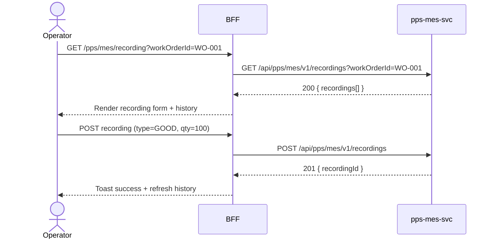

# F-PPS-002-02 — MES Recording

> **Conceptual Stack Layer:** Domain-Feature
> **Space:** Domain
> **Owner:** PPS Engineering Team
> **Companion files:** `F-PPS-002-02.uvl`, `F-PPS-002-02.aui.yaml`
> **Referenced by:** Suite Feature Catalog SS6
> **References:** `pps_mes-spec.md` (backend)

> **Meta Information**
> - **Version:** 2026-04-04
> - **Template:** `feature-spec.md` v1.0.0
> - **Template Compliance:** 100%
> - **Status:** DRAFT
> - **Feature ID:** `F-PPS-002-02`
> - **Suite:** `pps`
> - **Node type:** LEAF
> - **Parent:** `F-PPS-002` — Shop Floor Execution
> - **Companion UVL:** `F-PPS-002-02.uvl`
> - **Companion AUI:** `F-PPS-002-02.aui.yaml`

---

## ═══════════════════════════════════════════════
## PROBLEM SPACE
## ═══════════════════════════════════════════════

## 0. Feature Identity & Orientation

### 0.1 One-Line Summary
This feature lets an **operator** record manufacturing execution data: quantities produced, scrap, downtime.

### 0.2 Non-Goals
- Does not confirm or complete work orders — that is F-PPS-002-01.
- Does not record quality inspection results — that is F-PPS-002-03.
- Does not post formal goods movements — that is F-PPS-003-02.

### 0.3 Entry & Exit Points

**Entry points:**
- Work Order detail → MES Recording tab
- Direct URL: `/pps/mes/recording`

**Exit points:**
- Submit recording → return to work order detail
- View recording history → stay on recording list
- Back to work order detail

### 0.4 Variability Points

| Variability Point | Model | Values | Default | Binding Time |
|---|---|---|---|---|
| Require downtime reason | UVL attribute | true/false | false | deploy |
| Allow split recording | UVL attribute | true/false | false | deploy |

---

## 1. User Goal & Scenarios

### 1.1 User Goal
Record the actual production output against a work order operation: good quantities, scrap, and any downtime events, so that the production order's progress is accurately tracked.

### 1.2 Scenarios

| # | Scenario | Precondition | Action | Expected Outcome |
|---|----------|-------------|--------|-----------------|
| S1 | Record good qty | Work order operation is IN_PROGRESS | Enter good quantity and submit | Recording saved; order progress updated |
| S2 | Record scrap | Operation is IN_PROGRESS | Enter scrap quantity with reason | Scrap recording saved; scrap total updated |
| S3 | Record downtime event | Machine stopped | Enter downtime duration and reason code | Downtime event saved against work order |
| S4 | View recording history | Recordings exist | Open recording history tab | List of all recordings for this work order |

---

## 2. User Journey & Screen Layout

### 2.1 Sequence Diagram



### 2.2 Screen Layout

```
┌─────────────────────────────────────────────────────┐
│ [← WO-001]   MES Recording — OP-010                 │
├─────────────────────────────────────────────────────┤
│ Type: [● Good Qty  ○ Scrap  ○ Downtime]             │
│ Quantity: [_____]  Unit: PC                         │
│ Reason Code: [— select —] (shown for Scrap/Downtime)│
├─────────────────────────────────────────────────────┤
│ Recording History                                   │
│  Time        Type      Qty   Reason                 │
│  06:15       GOOD      250   —                      │
│  07:30       SCRAP      12   MATERIAL_DEFECT        │
├─────────────────────────────────────────────────────┤
│ [EXT: extension zone]                               │
├─────────────────────────────────────────────────────┤
│                          [Cancel]  [Save Recording] │
└─────────────────────────────────────────────────────┘
```

---

## 3. Interaction Requirements

### 3.1 Fields Table

| Field | Type | Required | Editable | Validation | i18n Key |
|---|---|---|---|---|---|
| Recording type | radio | Yes | Yes | GOOD, SCRAP, DOWNTIME | `F-PPS-002-02.field.type` |
| Quantity | number | Yes | Yes | > 0; ≤ remaining order qty | `F-PPS-002-02.field.quantity` |
| Reason code | select | Conditional | Yes | Required for SCRAP and DOWNTIME | `F-PPS-002-02.field.reasonCode` |

### 3.2 Actions Table

| Action | Trigger | Precondition | Effect |
|---|---|---|---|
| Save Recording | Button click | Form valid | POST recording to pps-mes-svc |
| Cancel | Button click | — | Discard form; return to work order detail |

### 3.3 Validation Messages

| Field | Condition | Message |
|---|---|---|
| Quantity | ≤ 0 | "Quantity must be greater than zero." |
| Quantity | > remaining qty | "Quantity exceeds remaining order quantity." |
| Reason code | SCRAP or DOWNTIME and empty | "A reason code is required for scrap and downtime recordings." |

---

## 4. Edge Cases & Screen States

### 4.1 Component States

| State | When | Behaviour |
|---|---|---|
| **Loading** | Awaiting API response | Form skeleton; controls disabled |
| **No history** | No recordings yet | Empty history section: "No recordings yet for this operation." |
| **Error** | pps-mes-svc unavailable | Inline error: "Recording service unavailable. Retry." + retry button |
| **Populated** | Recordings exist | Render history list |

### 4.2 Specific Edge Cases

| Case | Behaviour | Affected users |
|---|---|---|
| Work order not IN_PROGRESS | Recording form disabled with hint "Confirm operation first" | Operator |
| Total recorded qty matches order qty | Form disabled with hint "Order fully recorded" | Operator |

### 4.3 Attribute-Driven Behaviour Changes

| Attribute | Non-default value | Observable change |
|---|---|---|
| `require_downtime_reason` | true | Reason code mandatory for DOWNTIME type |
| `allow_split_recording` | true | Operator can record partial quantities across multiple submissions |

### 4.4 Connectivity
This feature requires a live connection.
On network loss: top-of-page banner — "Recording service is unavailable offline."

---

## ═══════════════════════════════════════════════
## SOLUTION SPACE
## ═══════════════════════════════════════════════

## 5. Backend Dependencies & BFF Contract

### 5.1 Service Calls

| # | Service | Endpoint | Tier | isMutation | Failure Mode |
|---|---------|----------|------|------------|-------------|
| 1 | pps-mes-svc | `GET /api/pps/mes/v1/recordings` | T3 | No | Show error + retry |
| 2 | pps-mes-svc | `POST /api/pps/mes/v1/recordings` | T3 | Yes | Show error + retry |

### 5.2 BFF View-Model Shape

```jsonc
{
  "workOrderId": "WO-001",
  "operationId": "OP-010",
  "remainingQty": 238,
  "recordings": [
    {
      "recordingId": "REC-001",
      "type": "GOOD",
      "quantity": 250,
      "reasonCode": null,
      "recordedAt": "2026-04-04T06:15:00Z",
      "recordedBy": "operator-01"
    }
  ]
}
```

### 5.3 Feature-Gating Rules

| Mode | Behaviour |
|---|---|
| Full | All interactions available to OPERATOR |
| Read-only | History visible; Save Recording hidden |
| Excluded | Tab hidden in work order detail |

### 5.4 Failure Modes

| Failure | User Experience |
|---------|----------------|
| pps-mes-svc down | Error state with retry button |

### 5.5 Caching Hints
BFF MUST NOT cache recording submissions. Recording history MAY be cached for 30 seconds per work order.

### 5.6 i18n Keys

| Key | Default (en) |
|-----|-------------|
| `F-PPS-002-02.title` | `MES Recording` |
| `F-PPS-002-02.field.type` | `Recording Type` |
| `F-PPS-002-02.field.quantity` | `Quantity` |
| `F-PPS-002-02.field.reasonCode` | `Reason Code` |
| `F-PPS-002-02.action.save` | `Save Recording` |
| `F-PPS-002-02.empty` | `No recordings yet for this operation.` |
| `F-PPS-002-02.error.unavailable` | `Recording service unavailable.` |

---

## 6. AUI Screen Contract

See companion file `F-PPS-002-02.aui.yaml`.

---

## ═══════════════════════════════════════════════
## BRIDGE ARTIFACTS
## ═══════════════════════════════════════════════

## 7. Permissions & Accessibility

### 7.1 Permission Matrix

| Action | PLANT_MANAGER | SUPERVISOR | OPERATOR |
|---|---|---|---|
| View recording history | ✓ | ✓ | ✓ |
| Save recording | ✓ | ✓ | ✓ |

### 7.2 Accessibility
- Radio group MUST have ARIA `role="radiogroup"` with legend.
- Quantity field MUST have `aria-label` including unit.
- Keyboard: Tab through form fields; Enter to submit.

---

## 8. Acceptance Criteria

| AC | Scenario | Given | When | Then |
|----|----------|-------|------|------|
| AC-01 | S1 | Work order IN_PROGRESS | Operator enters good qty and saves | Recording saved; remaining qty decremented |
| AC-02 | S2 | Work order IN_PROGRESS | Operator enters scrap qty | Scrap recording saved; scrap total updated |
| AC-03 | S3 | Machine stopped | Operator enters downtime duration and reason | Downtime event saved |
| AC-04 | S4 | Recordings exist | Operator opens history tab | All recordings listed with type, qty, reason, time |
| AC-05 | Error | Qty > remaining | Operator submits | Validation error "Quantity exceeds remaining order quantity" |

---

## 9. Variability & Extension

### 9.1 Feature Dependencies
Requires IAM authentication (cross-suite). Requires F-PPS-002-01 (Work Order Management).

### 9.2 Attributes
See SS0.4 variability points. Binding times: `deploy`.

### 9.3 Extension Points
| Extension Zone | Interface | Default Behaviour |
|---|---|---|
| `ext.recordingFields` | Custom recording fields | Hidden (no extension) |

### 9.4 Companion UVL
See `uvl/leaves/F-PPS-002-02.uvl`.

---

**END OF SPECIFICATION**
