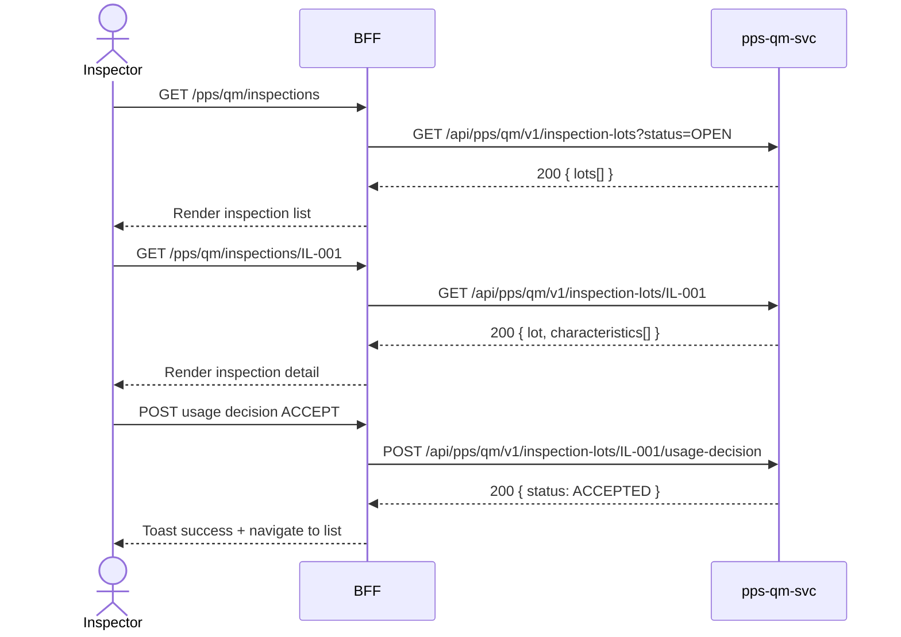

# F-PPS-002-03 — Quality Inspection

> **Conceptual Stack Layer:** Domain-Feature
> **Space:** Domain
> **Owner:** PPS Engineering Team
> **Companion files:** `F-PPS-002-03.uvl`, `F-PPS-002-03.aui.yaml`
> **Referenced by:** Suite Feature Catalog SS6
> **References:** `pps_qm-spec.md` (backend)

> **Meta Information**
> - **Version:** 2026-04-04
> - **Template:** `feature-spec.md` v1.0.0
> - **Template Compliance:** 100%
> - **Status:** DRAFT
> - **Feature ID:** `F-PPS-002-03`
> - **Suite:** `pps`
> - **Node type:** LEAF
> - **Parent:** `F-PPS-002` — Shop Floor Execution
> - **Companion UVL:** `F-PPS-002-03.uvl`
> - **Companion AUI:** `F-PPS-002-03.aui.yaml`

---

## ═══════════════════════════════════════════════
## PROBLEM SPACE
## ═══════════════════════════════════════════════

## 0. Feature Identity & Orientation

### 0.1 One-Line Summary
This feature lets a **quality inspector** record inspection results and usage decisions for production lots.

### 0.2 Non-Goals
- Does not manage work order operations — that is F-PPS-002-01.
- Does not record production quantities — that is F-PPS-002-02.
- Does not manage quality master data (inspection plans, characteristics) — that is a separate QM admin feature.

### 0.3 Entry & Exit Points

**Entry points:**
- Quality Management menu → "Inspections"
- Direct URL: `/pps/qm/inspections`

**Exit points:**
- Usage decision submitted → return to inspection list
- View defect history → stay on defect view
- Back to Quality Management dashboard

### 0.4 Variability Points

| Variability Point | Model | Values | Default | Binding Time |
|---|---|---|---|---|
| Allow partial usage decision | UVL attribute | true/false | false | deploy |
| Require defect code on rejection | UVL attribute | true/false | true | deploy |

---

## 1. User Goal & Scenarios

### 1.1 User Goal
Open an inspection lot for a production batch, record results for each quality characteristic, make a usage decision (accept, reject, or conditional), and close the lot so production can proceed or the batch is quarantined.

### 1.2 Scenarios

| # | Scenario | Precondition | Action | Expected Outcome |
|---|----------|-------------|--------|-----------------|
| S1 | Open inspection | Inspection lot created by MES | Open inspection lot list | List of open inspection lots with material, batch, work order |
| S2 | Record characteristic results | Inspection lot opened | Enter measured values per characteristic | Results saved against inspection lot |
| S3 | Usage decision | All characteristics recorded | Select ACCEPT / REJECT / CONDITIONAL and submit | Lot status updated; if ACCEPT goods available; if REJECT batch quarantined |
| S4 | View defect history | Usage decision submitted | Open defect history | List of recorded defects for the lot |

---

## 2. User Journey & Screen Layout

### 2.1 Sequence Diagram



### 2.2 Screen Layout

```
┌─────────────────────────────────────────────────────┐
│ [← QM]   Inspection Lot — IL-001                    │
│ Material: FG-1001  Batch: 2026-04-04-001  WO: WO-001│
├─────────────────────────────────────────────────────┤
│ Characteristic        Spec Min  Spec Max  Actual     │
│ Tensile Strength      450 MPa   600 MPa   [___]      │
│ Surface Roughness     —         Ra 0.8    [___]      │
├─────────────────────────────────────────────────────┤
│ Usage Decision: [○ ACCEPT  ○ REJECT  ○ CONDITIONAL] │
│ Defect Code: [— select —]  (required on REJECT)     │
├─────────────────────────────────────────────────────┤
│ [EXT: extension zone]                               │
├─────────────────────────────────────────────────────┤
│                   [Cancel]  [Submit Usage Decision] │
└─────────────────────────────────────────────────────┘
```

---

## 3. Interaction Requirements

### 3.1 Fields Table

| Field | Type | Required | Editable | Validation | i18n Key |
|---|---|---|---|---|---|
| Characteristic result | number/text | Yes | Yes | Within spec range or flagged | `F-PPS-002-03.field.result` |
| Usage decision | radio | Yes | Yes | ACCEPT, REJECT, CONDITIONAL | `F-PPS-002-03.field.usageDecision` |
| Defect code | select | Conditional | Yes | Required on REJECT | `F-PPS-002-03.field.defectCode` |

### 3.2 Actions Table

| Action | Trigger | Precondition | Effect |
|---|---|---|---|
| Save characteristic | Input blur/change | Value entered | PATCH inspection lot characteristics |
| Submit usage decision | Button click | All characteristics recorded; decision selected | POST usage-decision; lot status updated |
| Cancel | Button click | — | Discard changes; return to inspection list |

### 3.3 Validation Messages

| Field | Condition | Message |
|---|---|---|
| Defect code | REJECT selected and empty | "A defect code is required for rejection." |
| Usage decision | Not selected | "Select a usage decision before submitting." |
| Characteristic | Out of spec | Visual indicator + "Value outside specification range." |

---

## 4. Edge Cases & Screen States

### 4.1 Component States

| State | When | Behaviour |
|---|---|---|
| **Loading** | Awaiting API response | Form skeleton; controls disabled |
| **Empty** | No open inspection lots | "No open inspections. All lots have usage decisions." |
| **Error** | pps-qm-svc unavailable | Inline error: "Quality inspection service unavailable. Retry." + retry button |
| **Populated** | Data ready | Render inspection detail |

### 4.2 Specific Edge Cases

| Case | Behaviour | Affected users |
|---|---|---|
| Lot already decided | Form read-only with decision banner | Inspector |
| Partial characteristics | Submit blocked until all characteristics recorded | Inspector |

### 4.3 Attribute-Driven Behaviour Changes

| Attribute | Non-default value | Observable change |
|---|---|---|
| `allow_partial_usage_decision` | true | Usage decision allowed even with incomplete characteristics |
| `require_defect_code_on_rejection` | false | Defect code optional on REJECT |

### 4.4 Connectivity
This feature requires a live connection.
On network loss: top-of-page banner — "Quality inspection service is unavailable offline."

---

## ═══════════════════════════════════════════════
## SOLUTION SPACE
## ═══════════════════════════════════════════════

## 5. Backend Dependencies & BFF Contract

### 5.1 Service Calls

| # | Service | Endpoint | Tier | isMutation | Failure Mode |
|---|---------|----------|------|------------|-------------|
| 1 | pps-qm-svc | `GET /api/pps/qm/v1/inspection-lots` | T3 | No | Show error + retry |
| 2 | pps-qm-svc | `GET /api/pps/qm/v1/inspection-lots/{id}` | T3 | No | Show error + retry |
| 3 | pps-qm-svc | `POST /api/pps/qm/v1/inspection-lots/{id}/usage-decision` | T3 | Yes | Show error + retry |

### 5.2 BFF View-Model Shape

```jsonc
{
  "inspectionLot": {
    "lotId": "IL-001",
    "material": "FG-1001",
    "batch": "2026-04-04-001",
    "workOrderId": "WO-001",
    "status": "OPEN",
    "characteristics": [
      {
        "characteristicId": "CHAR-001",
        "name": "Tensile Strength",
        "specMin": 450,
        "specMax": 600,
        "unit": "MPa",
        "actualValue": null
      }
    ]
  }
}
```

### 5.3 Feature-Gating Rules

| Mode | Behaviour |
|---|---|
| Full | All interactions available to QUALITY_INSPECTOR and QM_MANAGER |
| Read-only | Inspection list visible; usage decision hidden |
| Excluded | Menu item hidden; direct URL returns 404 |

### 5.4 Failure Modes

| Failure | User Experience |
|---------|----------------|
| pps-qm-svc down | Error state with retry button |

### 5.5 Caching Hints
BFF MUST NOT cache usage decision submissions. Inspection lot list MAY be cached for 30 seconds.

### 5.6 i18n Keys

| Key | Default (en) |
|-----|-------------|
| `F-PPS-002-03.title` | `Quality Inspections` |
| `F-PPS-002-03.field.result` | `Actual Value` |
| `F-PPS-002-03.field.usageDecision` | `Usage Decision` |
| `F-PPS-002-03.field.defectCode` | `Defect Code` |
| `F-PPS-002-03.action.submit` | `Submit Usage Decision` |
| `F-PPS-002-03.empty` | `No open inspections.` |
| `F-PPS-002-03.error.unavailable` | `Quality inspection service unavailable.` |

---

## 6. AUI Screen Contract

See companion file `F-PPS-002-03.aui.yaml`.

---

## ═══════════════════════════════════════════════
## BRIDGE ARTIFACTS
## ═══════════════════════════════════════════════

## 7. Permissions & Accessibility

### 7.1 Permission Matrix

| Action | QM_MANAGER | QUALITY_INSPECTOR | SUPERVISOR |
|---|---|---|---|
| View inspection lots | ✓ | ✓ | ✓ |
| Record characteristic results | ✓ | ✓ | — |
| Submit usage decision | ✓ | ✓ | — |
| View defect history | ✓ | ✓ | ✓ |

### 7.2 Accessibility
- Characteristic table MUST have ARIA role `grid`.
- Usage decision radio group MUST have `role="radiogroup"` with legend.
- Out-of-spec fields MUST use `aria-invalid="true"`.

---

## 8. Acceptance Criteria

| AC | Scenario | Given | When | Then |
|----|----------|-------|------|------|
| AC-01 | S1 | Inspector opens Inspections | Page loads | Open inspection lots listed with material, batch, work order |
| AC-02 | S2 | Inspection lot open | Inspector enters characteristic results | Results saved against lot |
| AC-03 | S3 (ACCEPT) | All characteristics recorded | Inspector selects ACCEPT and submits | Lot ACCEPTED; batch available for use |
| AC-04 | S3 (REJECT) | All characteristics recorded | Inspector selects REJECT with defect code | Lot REJECTED; batch quarantined |
| AC-05 | S4 | Usage decision submitted | Inspector opens defect history | Defects listed |
| AC-06 | Error | Defect code missing on REJECT | Inspector submits | Validation error "A defect code is required for rejection" |

---

## 9. Variability & Extension

### 9.1 Feature Dependencies
Requires IAM authentication (cross-suite). Requires F-PPS-002-01 (Work Order Management). Publishes `pps.qm.inspection-lot.usage-decision` event.

### 9.2 Attributes
See SS0.4 variability points. Binding times: `deploy`.

### 9.3 Extension Points
| Extension Zone | Interface | Default Behaviour |
|---|---|---|
| `ext.inspectionCharacteristics` | Custom characteristic entry widgets | Hidden (no extension) |

### 9.4 Companion UVL
See `uvl/leaves/F-PPS-002-03.uvl`.

---

**END OF SPECIFICATION**
