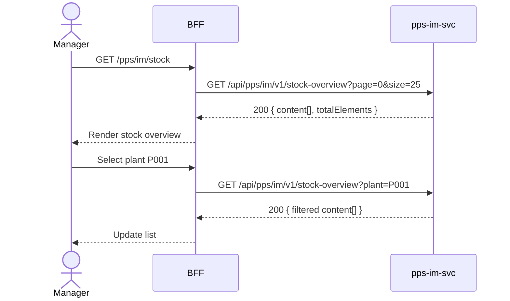

# F-PPS-003-01 — Stock Overview

> **Conceptual Stack Layer:** Domain-Feature
> **Space:** Domain
> **Owner:** PPS Engineering Team
> **Companion files:** `F-PPS-003-01.uvl`, `F-PPS-003-01.aui.yaml`
> **Referenced by:** Suite Feature Catalog SS6
> **References:** `pps_im-spec.md` (backend)

> **Meta Information**
> - **Version:** 2026-04-04
> - **Template:** `feature-spec.md` v1.0.0
> - **Template Compliance:** 100%
> - **Status:** DRAFT
> - **Feature ID:** `F-PPS-003-01`
> - **Suite:** `pps`
> - **Node type:** LEAF
> - **Parent:** `F-PPS-003` — Inventory & Warehouse
> - **Companion UVL:** `F-PPS-003-01.uvl`
> - **Companion AUI:** `F-PPS-003-01.aui.yaml`

---

## ═══════════════════════════════════════════════
## PROBLEM SPACE
## ═══════════════════════════════════════════════

## 0. Feature Identity & Orientation

### 0.1 One-Line Summary
This feature lets a **warehouse manager** view current stock levels by material, plant, and storage location.

### 0.2 Non-Goals
- Does not post goods movements — that is F-PPS-003-02.
- Does not manage physical inventory counts — that is F-PPS-003-03.
- Does not manage warehouse master data (storage locations, bins) — that is a separate WM admin feature.

### 0.3 Entry & Exit Points

**Entry points:**
- Inventory menu → "Stock Overview"
- Direct URL: `/pps/im/stock`

**Exit points:**
- Click material row → navigate to goods movement history for that material
- Export → download CSV/XLSX
- Back to Inventory dashboard

### 0.4 Variability Points

| Variability Point | Model | Values | Default | Binding Time |
|---|---|---|---|---|
| Show zero-stock materials | UVL attribute | true/false | false | runtime |
| Page size | UVL attribute | 10, 25, 50, 100 | 25 | runtime |

---

## 1. User Goal & Scenarios

### 1.1 User Goal
Get an accurate, real-time view of available stock per material across plants and storage locations to support production planning, procurement decisions, and inventory management.

### 1.2 Scenarios

| # | Scenario | Precondition | Action | Expected Outcome |
|---|----------|-------------|--------|-----------------|
| S1 | View total stock | Manager is authenticated | Open Stock Overview | Paginated list with material, plant, storage location, unrestricted qty, unit |
| S2 | Filter by plant | Stock list displayed | Select plant = P001 | Only stock records for plant P001 shown |
| S3 | Filter by storage location | Stock list displayed | Select storage location = SL-01 | Only records for that storage location shown |
| S4 | Drill to movements | Stock list displayed | Click material row | Navigate to goods movement history for that material/plant |
| S5 | Export | Stock list displayed | Click "Export" | CSV/XLSX download of current filtered stock |

---

## 2. User Journey & Screen Layout

### 2.1 Sequence Diagram



### 2.2 Screen Layout

```
┌─────────────────────────────────────────────────────┐
│ [← Inventory]   Stock Overview                      │
├─────────────────────────────────────────────────────┤
│ [Search: material]  [Plant: All ▾]  [Loc: All ▾]    │
├──────────┬──────────┬──────────┬──────────┬─────────┤
│ Material │ Plant    │ Stor.Loc │ Qty Unr. │ Unit    │
├──────────┼──────────┼──────────┼──────────┼─────────┤
│ FG-1001  │ P001     │ SL-01    │   1,250  │ PC    → │
│ RM-2001  │ P001     │ SL-02    │  15,000  │ KG    → │
├──────────┴──────────┴──────────┴──────────┴─────────┤
│ [EXT: extension zone]                               │
├─────────────────────────────────────────────────────┤
│ Showing 1-25 of 184   [← Prev] [1] [2] … [Next →]  │
│                                          [Export ↓] │
└─────────────────────────────────────────────────────┘
```

---

## 3. Interaction Requirements

### 3.1 Fields Table

| Field | Type | Required | Editable | Validation | i18n Key |
|---|---|---|---|---|---|
| Search | text input | No | Yes | min 2 chars to trigger | `F-PPS-003-01.search.placeholder` |
| Plant filter | select | No | Yes | plant list from ref-svc | `F-PPS-003-01.filter.plant` |
| Storage location filter | select | No | Yes | location list from ref-svc | `F-PPS-003-01.filter.storageLocation` |

### 3.2 Actions Table

| Action | Trigger | Precondition | Effect |
|---|---|---|---|
| Search | Keystroke (debounced 300ms) | ≥ 2 chars | Filter stock list |
| Filter by plant | Select change | — | Filter stock list |
| Filter by storage location | Select change | — | Filter stock list |
| Drill to movements | Row click | — | Navigate to goods movement history |
| Export | Button click | List has results | Download filtered stock list |
| Page change | Pagination click | — | Load requested page |

### 3.3 Validation Messages

| Field | Condition | Message |
|---|---|---|
| Search | < 2 chars | (no action — debounced) |

---

## 4. Edge Cases & Screen States

### 4.1 Component States

| State | When | Behaviour |
|---|---|---|
| **Loading** | Awaiting API response | Table skeleton with shimmer rows; controls disabled |
| **Empty** | No stock matches filter | "No stock found. Adjust your filters." |
| **Error** | pps-im-svc unavailable | Inline error: "Inventory service unavailable. Retry." + retry button |
| **Populated** | Data ready | Render table normally |

### 4.2 Specific Edge Cases

| Case | Behaviour | Affected users |
|---|---|---|
| Zero-stock materials | Hidden by default; toggle `show_zero_stock` attribute | Manager |
| > 50,000 stock records | Server-side pagination; client-side export limited to 10,000 rows | Large warehouses |

### 4.3 Attribute-Driven Behaviour Changes

| Attribute | Non-default value | Observable change |
|---|---|---|
| `show_zero_stock` | true | Materials with zero unrestricted stock visible |
| `page_size` | 50 | Longer table; fewer pagination pages |

### 4.4 Connectivity
This feature requires a live connection.
On network loss: top-of-page banner — "Inventory data is unavailable offline."

---

## ═══════════════════════════════════════════════
## SOLUTION SPACE
## ═══════════════════════════════════════════════

## 5. Backend Dependencies & BFF Contract

### 5.1 Service Calls

| # | Service | Endpoint | Tier | isMutation | Failure Mode |
|---|---------|----------|------|------------|-------------|
| 1 | pps-im-svc | `GET /api/pps/im/v1/stock-overview` | T3 | No | Show error + retry |

### 5.2 BFF View-Model Shape

```jsonc
{
  "stocks": [
    {
      "material": "FG-1001",
      "plant": "P001",
      "storageLocation": "SL-01",
      "unrestrictedQty": 1250,
      "unit": "PC",
      "lastMovement": "2026-04-03T14:22:00Z"
    }
  ],
  "pagination": {
    "page": 0,
    "size": 25,
    "totalElements": 184,
    "totalPages": 8
  }
}
```

### 5.3 Feature-Gating Rules

| Mode | Behaviour |
|---|---|
| Full | All interactions available |
| Read-only | Same as full (this is a read-only feature) |
| Excluded | Menu item hidden; direct URL returns 404 |

### 5.4 Failure Modes

| Failure | User Experience |
|---------|----------------|
| pps-im-svc down | Error state with retry button |

### 5.5 Caching Hints
BFF MAY cache stock overview for 60 seconds. Cache MUST be invalidated on `pps.im.stock-movement.posted` event.

### 5.6 i18n Keys

| Key | Default (en) |
|-----|-------------|
| `F-PPS-003-01.title` | `Stock Overview` |
| `F-PPS-003-01.search.placeholder` | `Search by material…` |
| `F-PPS-003-01.filter.plant` | `Plant` |
| `F-PPS-003-01.filter.storageLocation` | `Storage Location` |
| `F-PPS-003-01.empty` | `No stock found.` |
| `F-PPS-003-01.error.unavailable` | `Inventory service unavailable.` |
| `F-PPS-003-01.action.export` | `Export` |

---

## 6. AUI Screen Contract

See companion file `F-PPS-003-01.aui.yaml`.

---

## ═══════════════════════════════════════════════
## BRIDGE ARTIFACTS
## ═══════════════════════════════════════════════

## 7. Permissions & Accessibility

### 7.1 Permission Matrix

| Action | PLANT_MANAGER | WAREHOUSE_MANAGER | PLANNER | WAREHOUSE_OPERATOR |
|---|---|---|---|---|
| View stock list | ✓ | ✓ | ✓ | — |
| Export stock | ✓ | ✓ | ✓ | — |
| Drill to movements | ✓ | ✓ | ✓ | — |

### 7.2 Accessibility
- Table MUST have ARIA role `grid` with sortable column headers.
- Search field MUST have `aria-label`.
- Keyboard: Tab through filters, Enter to select row.

---

## 8. Acceptance Criteria

| AC | Scenario | Given | When | Then |
|----|----------|-------|------|------|
| AC-01 | S1 | Manager opens Stock Overview | Page loads | Paginated list displayed with material, plant, location, qty, unit |
| AC-02 | S2 | Stock list displayed | Manager selects plant P001 | Only P001 stock records shown |
| AC-03 | S3 | Stock list displayed | Manager selects storage location SL-01 | Only SL-01 records shown |
| AC-04 | S4 | Stock list displayed | Manager clicks material row | Navigates to goods movement history |
| AC-05 | S5 | Stock list displayed | Manager clicks Export | CSV/XLSX download initiated |
| AC-06 | Error | pps-im-svc unavailable | Manager opens page | Error message with retry button |

---

## 9. Variability & Extension

### 9.1 Feature Dependencies
Requires IAM authentication (cross-suite). Required by F-PPS-003-03 (Physical Inventory).

### 9.2 Attributes
See SS0.4 variability points. Binding times: `runtime`.

### 9.3 Extension Points
| Extension Zone | Interface | Default Behaviour |
|---|---|---|
| `ext.stockOverviewColumns` | Additional custom columns | Hidden (no extension) |

### 9.4 Companion UVL
See `uvl/leaves/F-PPS-003-01.uvl`.

---

**END OF SPECIFICATION**
