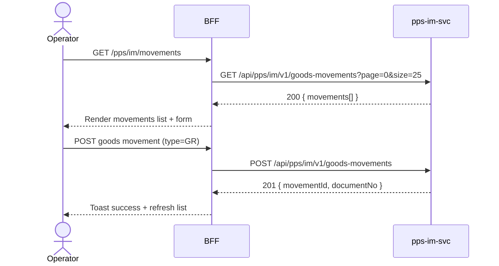

# F-PPS-003-02 — Goods Movement

> **Conceptual Stack Layer:** Domain-Feature
> **Space:** Domain
> **Owner:** PPS Engineering Team
> **Companion files:** `F-PPS-003-02.uvl`, `F-PPS-003-02.aui.yaml`
> **Referenced by:** Suite Feature Catalog SS6
> **References:** `pps_im-spec.md` (backend)

> **Meta Information**
> - **Version:** 2026-04-04
> - **Template:** `feature-spec.md` v1.0.0
> - **Template Compliance:** 100%
> - **Status:** DRAFT
> - **Feature ID:** `F-PPS-003-02`
> - **Suite:** `pps`
> - **Node type:** LEAF
> - **Parent:** `F-PPS-003` — Inventory & Warehouse
> - **Companion UVL:** `F-PPS-003-02.uvl`
> - **Companion AUI:** `F-PPS-003-02.aui.yaml`

---

## ═══════════════════════════════════════════════
## PROBLEM SPACE
## ═══════════════════════════════════════════════

## 0. Feature Identity & Orientation

### 0.1 One-Line Summary
This feature lets a **warehouse operator** post goods receipts, goods issues, and stock transfers.

### 0.2 Non-Goals
- Does not display current stock levels — that is F-PPS-003-01.
- Does not manage physical inventory counts — that is F-PPS-003-03.
- Does not confirm work order operations — that is F-PPS-002-01.

### 0.3 Entry & Exit Points

**Entry points:**
- Inventory menu → "Post Goods Movement"
- Direct URL: `/pps/im/movements`

**Exit points:**
- Movement posted → return to goods movement list with confirmation
- Reverse movement → updated movement record
- Back to Inventory dashboard

### 0.4 Variability Points

| Variability Point | Model | Values | Default | Binding Time |
|---|---|---|---|---|
| Require reference document | UVL attribute | true/false | false | deploy |
| Allow backdated posting | UVL attribute | true/false | false | deploy |

---

## 1. User Goal & Scenarios

### 1.1 User Goal
Post accurate goods movements to keep stock balances current: receive materials from suppliers, issue materials to production work orders, and transfer stock between storage locations.

### 1.2 Scenarios

| # | Scenario | Precondition | Action | Expected Outcome |
|---|----------|-------------|--------|-----------------|
| S1 | Post goods receipt | Purchase order exists | Select movement type GR, enter material/qty/plant | GR posted; stock increased; GR document created |
| S2 | Post goods issue to production | Work order exists | Select movement type GI, enter work order reference | GI posted; stock decreased; work order consumption updated |
| S3 | Transfer posting | Stock exists in source location | Select movement type TRANSFER, enter source/destination | Transfer posted; stock moved between locations |
| S4 | Reverse movement | Previous movement exists | Select movement and click Reverse | Reversal document posted; stock quantities restored |

---

## 2. User Journey & Screen Layout

### 2.1 Sequence Diagram



### 2.2 Screen Layout

```
┌─────────────────────────────────────────────────────┐
│ [← Inventory]   Post Goods Movement                 │
├─────────────────────────────────────────────────────┤
│ Movement Type: [GR ▾]   Posting Date: [2026-04-04]  │
│ Material: [___________]  Qty: [_____]  Unit: [PC ▾] │
│ Plant: [P001 ▾]  Storage Location: [SL-01 ▾]        │
│ Reference: [purchase order / work order]            │
├─────────────────────────────────────────────────────┤
│ Recent Movements                                    │
│  Doc No.    Type  Material  Qty   Date              │
│  5000001234 GR    FG-1001   500   2026-04-04        │
├─────────────────────────────────────────────────────┤
│ [EXT: extension zone]                               │
├─────────────────────────────────────────────────────┤
│                         [Cancel]  [Post Movement ✓] │
└─────────────────────────────────────────────────────┘
```

---

## 3. Interaction Requirements

### 3.1 Fields Table

| Field | Type | Required | Editable | Validation | i18n Key |
|---|---|---|---|---|---|
| Movement type | select | Yes | Yes | GR, GI, TRANSFER | `F-PPS-003-02.field.movementType` |
| Posting date | date | Yes | Yes | Not future (unless backdating allowed) | `F-PPS-003-02.field.postingDate` |
| Material | text/search | Yes | Yes | Valid material number | `F-PPS-003-02.field.material` |
| Quantity | number | Yes | Yes | > 0 | `F-PPS-003-02.field.quantity` |
| Plant | select | Yes | Yes | Active plant | `F-PPS-003-02.field.plant` |
| Storage location | select | Yes | Yes | Active location in plant | `F-PPS-003-02.field.storageLocation` |
| Reference document | text | Conditional | Yes | Required if `require_reference_document` = true | `F-PPS-003-02.field.reference` |

### 3.2 Actions Table

| Action | Trigger | Precondition | Effect |
|---|---|---|---|
| Post Movement | Button click | Form valid | POST movement to pps-im-svc; stock updated |
| Reverse | Button click on history row | Movement posted | POST reversal; stock quantities restored |
| Cancel | Button click | — | Discard form; return to movements list |

### 3.3 Validation Messages

| Field | Condition | Message |
|---|---|---|
| Quantity | ≤ 0 | "Quantity must be greater than zero." |
| Quantity (GI) | > available stock | "Insufficient stock for goods issue." |
| Posting date | Future date (backdating disabled) | "Posting date cannot be in the future." |
| Reference | Empty and required | "A reference document is required for this movement type." |

---

## 4. Edge Cases & Screen States

### 4.1 Component States

| State | When | Behaviour |
|---|---|---|
| **Loading** | Awaiting API response | Form skeleton; controls disabled |
| **No history** | No movements posted | Empty history: "No goods movements posted yet." |
| **Error** | pps-im-svc unavailable | Inline error: "Inventory service unavailable. Retry." + retry button |
| **Populated** | Data ready | Render form and history list |

### 4.2 Specific Edge Cases

| Case | Behaviour | Affected users |
|---|---|---|
| Negative stock result | Server returns 422; display "Insufficient stock" | Operator |
| Already reversed movement | Reverse button disabled with tooltip "Already reversed" | Operator |

### 4.3 Attribute-Driven Behaviour Changes

| Attribute | Non-default value | Observable change |
|---|---|---|
| `require_reference_document` | true | Reference field mandatory for all movement types |
| `allow_backdated_posting` | true | Posting date allows past dates up to period open date |

### 4.4 Connectivity
This feature requires a live connection.
On network loss: top-of-page banner — "Goods movement posting is unavailable offline."

---

## ═══════════════════════════════════════════════
## SOLUTION SPACE
## ═══════════════════════════════════════════════

## 5. Backend Dependencies & BFF Contract

### 5.1 Service Calls

| # | Service | Endpoint | Tier | isMutation | Failure Mode |
|---|---------|----------|------|------------|-------------|
| 1 | pps-im-svc | `GET /api/pps/im/v1/goods-movements` | T3 | No | Show error + retry |
| 2 | pps-im-svc | `POST /api/pps/im/v1/goods-movements` | T3 | Yes | Show error + retry |

### 5.2 BFF View-Model Shape

```jsonc
{
  "movements": [
    {
      "movementId": "5000001234",
      "type": "GR",
      "material": "FG-1001",
      "quantity": 500,
      "unit": "PC",
      "plant": "P001",
      "storageLocation": "SL-01",
      "postingDate": "2026-04-04",
      "reference": "PO-4500001001",
      "reversed": false
    }
  ]
}
```

### 5.3 Feature-Gating Rules

| Mode | Behaviour |
|---|---|
| Full | All interactions available to WAREHOUSE_OPERATOR and WAREHOUSE_MANAGER |
| Read-only | Movement history visible; Post and Reverse hidden |
| Excluded | Menu item hidden; direct URL returns 404 |

### 5.4 Failure Modes

| Failure | User Experience |
|---------|----------------|
| pps-im-svc down | Error state with retry button |
| Insufficient stock | Inline 422 error with stock balance detail |

### 5.5 Caching Hints
BFF MUST NOT cache movement submissions. Movement history MAY be cached for 30 seconds.

### 5.6 i18n Keys

| Key | Default (en) |
|-----|-------------|
| `F-PPS-003-02.title` | `Post Goods Movement` |
| `F-PPS-003-02.field.movementType` | `Movement Type` |
| `F-PPS-003-02.field.postingDate` | `Posting Date` |
| `F-PPS-003-02.field.material` | `Material` |
| `F-PPS-003-02.field.quantity` | `Quantity` |
| `F-PPS-003-02.field.plant` | `Plant` |
| `F-PPS-003-02.field.storageLocation` | `Storage Location` |
| `F-PPS-003-02.field.reference` | `Reference Document` |
| `F-PPS-003-02.action.post` | `Post Movement` |
| `F-PPS-003-02.action.reverse` | `Reverse` |
| `F-PPS-003-02.error.unavailable` | `Inventory service unavailable.` |
| `F-PPS-003-02.error.insufficientStock` | `Insufficient stock for goods issue.` |

---

## 6. AUI Screen Contract

See companion file `F-PPS-003-02.aui.yaml`.

---

## ═══════════════════════════════════════════════
## BRIDGE ARTIFACTS
## ═══════════════════════════════════════════════

## 7. Permissions & Accessibility

### 7.1 Permission Matrix

| Action | PLANT_MANAGER | WAREHOUSE_MANAGER | WAREHOUSE_OPERATOR |
|---|---|---|---|
| View movement history | ✓ | ✓ | ✓ |
| Post goods movement | ✓ | ✓ | ✓ |
| Reverse movement | ✓ | ✓ | — |

### 7.2 Accessibility
- Movement type select MUST have `aria-label`.
- Form fields MUST have associated `<label>` elements.
- Error messages MUST use `role="alert"`.

---

## 8. Acceptance Criteria

| AC | Scenario | Given | When | Then |
|----|----------|-------|------|------|
| AC-01 | S1 | Operator opens Post Goods Movement | Page loads | Form displayed; recent movements listed |
| AC-02 | S2 | GR type selected | Operator enters material/qty/plant and posts | GR document created; stock increased |
| AC-03 | S3 | GI type selected | Operator enters work order reference and posts | GI posted; stock decreased; WO consumption updated |
| AC-04 | S4 | TRANSFER type selected | Operator enters source/destination and posts | Transfer posted; stock relocated |
| AC-05 | S5 | GI attempted | Qty > available stock | Error "Insufficient stock for goods issue" |
| AC-06 | Error | Reversal requested | Operator clicks Reverse | Reversal document posted; stock quantities restored |

---

## 9. Variability & Extension

### 9.1 Feature Dependencies
Requires IAM authentication (cross-suite). Publishes `pps.im.stock-movement.posted` event.

### 9.2 Attributes
See SS0.4 variability points. Binding times: `deploy`.

### 9.3 Extension Points
| Extension Zone | Interface | Default Behaviour |
|---|---|---|
| `ext.goodsMovementFields` | Custom movement fields | Hidden (no extension) |

### 9.4 Companion UVL
See `uvl/leaves/F-PPS-003-02.uvl`.

---

**END OF SPECIFICATION**
