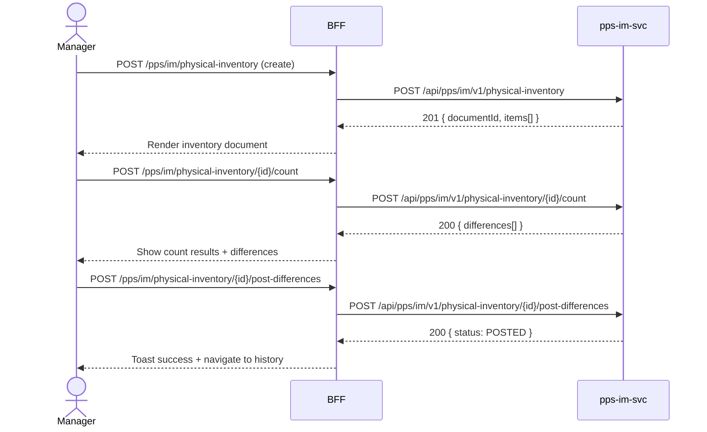

# F-PPS-003-03 — Physical Inventory

> **Conceptual Stack Layer:** Domain-Feature
> **Space:** Domain
> **Owner:** PPS Engineering Team
> **Companion files:** `F-PPS-003-03.uvl`, `F-PPS-003-03.aui.yaml`
> **Referenced by:** Suite Feature Catalog SS6
> **References:** `pps_im-spec.md` (backend)

> **Meta Information**
> - **Version:** 2026-04-04
> - **Template:** `feature-spec.md` v1.0.0
> - **Template Compliance:** 100%
> - **Status:** DRAFT
> - **Feature ID:** `F-PPS-003-03`
> - **Suite:** `pps`
> - **Node type:** LEAF
> - **Parent:** `F-PPS-003` — Inventory & Warehouse
> - **Companion UVL:** `F-PPS-003-03.uvl`
> - **Companion AUI:** `F-PPS-003-03.aui.yaml`

---

## ═══════════════════════════════════════════════
## PROBLEM SPACE
## ═══════════════════════════════════════════════

## 0. Feature Identity & Orientation

### 0.1 One-Line Summary
This feature lets a **warehouse manager** manage physical inventory counts and post count differences.

### 0.2 Non-Goals
- Does not display ongoing stock levels — that is F-PPS-003-01.
- Does not post ad-hoc goods movements — that is F-PPS-003-02.
- Does not manage inventory cycle rules or scheduling — that is a separate WM admin feature.

### 0.3 Entry & Exit Points

**Entry points:**
- Inventory menu → "Physical Inventory"
- Direct URL: `/pps/im/physical-inventory`

**Exit points:**
- Count differences posted → updated stock values visible in F-PPS-003-01
- Back to Inventory dashboard

### 0.4 Variability Points

| Variability Point | Model | Values | Default | Binding Time |
|---|---|---|---|---|
| Require recount on large difference | UVL attribute | true/false | false | deploy |
| Difference threshold (%) | UVL attribute | 0–100 | 5 | deploy |

---

## 1. User Goal & Scenarios

### 1.1 User Goal
Create a physical inventory document for a storage location, enter the physical count results, and post any differences so that book inventory matches the actual warehouse stock.

### 1.2 Scenarios

| # | Scenario | Precondition | Action | Expected Outcome |
|---|----------|-------------|--------|-----------------|
| S1 | Create inventory document | Manager is authenticated | Select plant/storage location and create | Inventory document created with items; book quantities frozen |
| S2 | Enter count | Inventory document created | Enter physical count quantities per item | Count quantities saved; differences calculated |
| S3 | Post difference | Count entered | Review differences and post | Stock adjusted to match count; difference document created |
| S4 | View history | Posted inventory documents exist | Open history | List of past inventory documents with status and differences |

---

## 2. User Journey & Screen Layout

### 2.1 Sequence Diagram



### 2.2 Screen Layout

```
┌─────────────────────────────────────────────────────┐
│ [← Inventory]   Physical Inventory                  │
├─────────────────────────────────────────────────────┤
│ Plant: [P001 ▾]  Storage Location: [SL-01 ▾]        │
│                            [Create Inventory Doc]   │
├──────────┬──────────┬──────────┬──────────┬─────────┤
│ Material │ Book Qty │ Count Qt │ Diff     │ Unit    │
├──────────┼──────────┼──────────┼──────────┼─────────┤
│ FG-1001  │   1,250  │ [_____]  │  —       │ PC      │
│ RM-2001  │  15,000  │ [_____]  │  —       │ KG      │
├──────────┴──────────┴──────────┴──────────┴─────────┤
│ [EXT: extension zone]                               │
├─────────────────────────────────────────────────────┤
│         [Cancel]  [Save Count]  [Post Differences]  │
└─────────────────────────────────────────────────────┘
```

---

## 3. Interaction Requirements

### 3.1 Fields Table

| Field | Type | Required | Editable | Validation | i18n Key |
|---|---|---|---|---|---|
| Plant | select | Yes | Yes | Active plant | `F-PPS-003-03.field.plant` |
| Storage location | select | Yes | Yes | Active location in plant | `F-PPS-003-03.field.storageLocation` |
| Count quantity | number | Yes | Yes | ≥ 0 per item | `F-PPS-003-03.field.countQty` |

### 3.2 Actions Table

| Action | Trigger | Precondition | Effect |
|---|---|---|---|
| Create Inventory Doc | Button click | Plant and location selected | POST new inventory document; book quantities frozen |
| Save Count | Button click | Count quantities entered | POST count; differences calculated |
| Post Differences | Button click | Count saved; differences reviewed | POST post-differences; stock adjusted |
| Cancel | Button click | — | Discard and return to history |

### 3.3 Validation Messages

| Field | Condition | Message |
|---|---|---|
| Count quantity | < 0 | "Count quantity cannot be negative." |
| Post differences | Large difference and recount required | "Difference exceeds threshold. A recount is required before posting." |
| Storage location | Not selected on create | "Select a storage location to create an inventory document." |

---

## 4. Edge Cases & Screen States

### 4.1 Component States

| State | When | Behaviour |
|---|---|---|
| **Loading** | Awaiting API response | Form skeleton; controls disabled |
| **No items** | Empty storage location | "No materials found in this storage location." |
| **Error** | pps-im-svc unavailable | Inline error: "Physical inventory service unavailable. Retry." + retry button |
| **Posted** | Document already posted | Read-only view with posted differences |

### 4.2 Specific Edge Cases

| Case | Behaviour | Affected users |
|---|---|---|
| Document already in progress | Create blocked; link to open document shown | Manager |
| All counts match book qty | "Post Differences" disabled with hint "No differences to post" | Manager |

### 4.3 Attribute-Driven Behaviour Changes

| Attribute | Non-default value | Observable change |
|---|---|---|
| `require_recount_on_large_difference` | true | Post blocked if any item difference > threshold |
| `difference_threshold_pct` | 10 | Threshold applied for recount requirement |

### 4.4 Connectivity
This feature requires a live connection.
On network loss: top-of-page banner — "Physical inventory service is unavailable offline."

---

## ═══════════════════════════════════════════════
## SOLUTION SPACE
## ═══════════════════════════════════════════════

## 5. Backend Dependencies & BFF Contract

### 5.1 Service Calls

| # | Service | Endpoint | Tier | isMutation | Failure Mode |
|---|---------|----------|------|------------|-------------|
| 1 | pps-im-svc | `POST /api/pps/im/v1/physical-inventory` | T3 | Yes | Show error + retry |
| 2 | pps-im-svc | `POST /api/pps/im/v1/physical-inventory/{id}/count` | T3 | Yes | Show error + retry |
| 3 | pps-im-svc | `POST /api/pps/im/v1/physical-inventory/{id}/post-differences` | T3 | Yes | Show error + retry |

### 5.2 BFF View-Model Shape

```jsonc
{
  "documentId": "PI-20260404-001",
  "plant": "P001",
  "storageLocation": "SL-01",
  "status": "COUNT_ENTERED",
  "items": [
    {
      "material": "FG-1001",
      "bookQty": 1250,
      "countQty": 1230,
      "difference": -20,
      "unit": "PC",
      "differenceExceedsThreshold": false
    }
  ]
}
```

### 5.3 Feature-Gating Rules

| Mode | Behaviour |
|---|---|
| Full | All interactions available to WAREHOUSE_MANAGER |
| Read-only | History visible; Create, Save Count, Post Differences hidden |
| Excluded | Menu item hidden; direct URL returns 404 |

### 5.4 Failure Modes

| Failure | User Experience |
|---------|----------------|
| pps-im-svc down | Error state with retry button |
| Recount required | Post blocked with per-item detail |

### 5.5 Caching Hints
BFF MUST NOT cache physical inventory mutations. Document history MAY be cached for 60 seconds.

### 5.6 i18n Keys

| Key | Default (en) |
|-----|-------------|
| `F-PPS-003-03.title` | `Physical Inventory` |
| `F-PPS-003-03.field.plant` | `Plant` |
| `F-PPS-003-03.field.storageLocation` | `Storage Location` |
| `F-PPS-003-03.field.countQty` | `Count Quantity` |
| `F-PPS-003-03.action.create` | `Create Inventory Doc` |
| `F-PPS-003-03.action.saveCount` | `Save Count` |
| `F-PPS-003-03.action.postDifferences` | `Post Differences` |
| `F-PPS-003-03.error.unavailable` | `Physical inventory service unavailable.` |
| `F-PPS-003-03.error.recountRequired` | `Difference exceeds threshold. A recount is required.` |

---

## 6. AUI Screen Contract

See companion file `F-PPS-003-03.aui.yaml`.

---

## ═══════════════════════════════════════════════
## BRIDGE ARTIFACTS
## ═══════════════════════════════════════════════

## 7. Permissions & Accessibility

### 7.1 Permission Matrix

| Action | PLANT_MANAGER | WAREHOUSE_MANAGER | WAREHOUSE_OPERATOR |
|---|---|---|---|
| View history | ✓ | ✓ | — |
| Create inventory doc | ✓ | ✓ | — |
| Enter count | ✓ | ✓ | — |
| Post differences | ✓ | ✓ | — |

### 7.2 Accessibility
- Count quantity inputs MUST have `aria-label` including material number.
- Difference cells exceeding threshold MUST use `aria-invalid="true"`.
- Keyboard: Tab through count inputs; Enter to save count.

---

## 8. Acceptance Criteria

| AC | Scenario | Given | When | Then |
|----|----------|-------|------|------|
| AC-01 | S1 | Manager selects plant/location | Manager clicks Create | Inventory document created; book quantities frozen |
| AC-02 | S2 | Document created | Manager enters count quantities | Differences calculated and displayed |
| AC-03 | S3 | Count entered | Manager clicks Post Differences | Stock adjusted to match count; difference document created |
| AC-04 | S4 | Posted documents exist | Manager opens history | Past documents listed with status and total difference |
| AC-05 | Error | Large difference with recount required | Manager clicks Post | Error "Difference exceeds threshold. A recount is required." |
| AC-06 | Edge | No differences | All counts match | Post Differences button disabled with tooltip |

---

## 9. Variability & Extension

### 9.1 Feature Dependencies
Requires IAM authentication (cross-suite). Requires F-PPS-003-01 (Stock Overview). Publishes `pps.im.stock-movement.posted` event on post-differences.

### 9.2 Attributes
See SS0.4 variability points. Binding times: `deploy`.

### 9.3 Extension Points
| Extension Zone | Interface | Default Behaviour |
|---|---|---|
| `ext.inventoryDocumentActions` | Additional document-level actions | Hidden (no extension) |

### 9.4 Companion UVL
See `uvl/leaves/F-PPS-003-03.uvl`.

---

**END OF SPECIFICATION**
