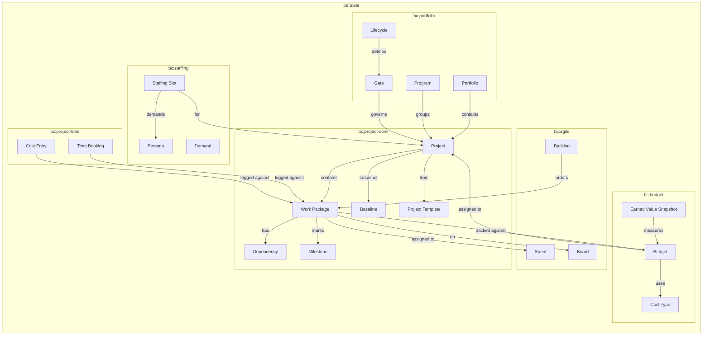
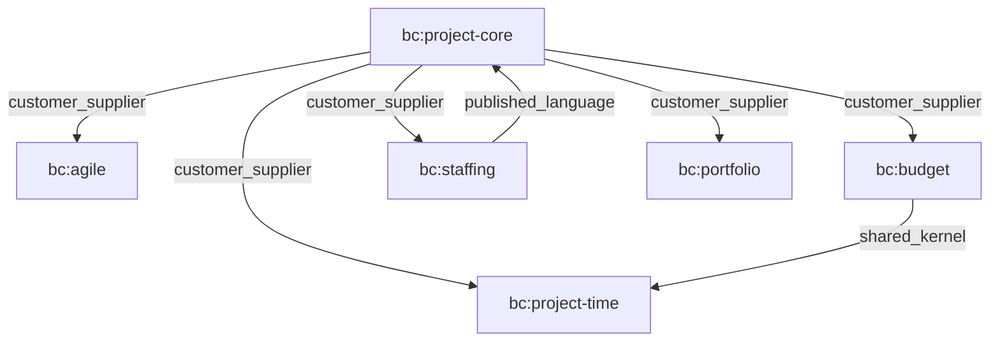
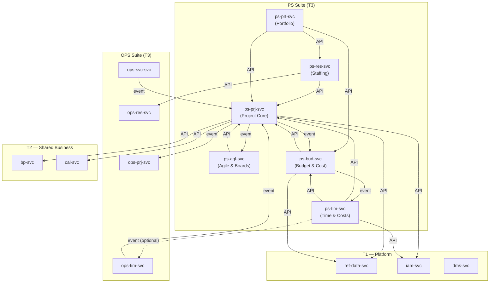
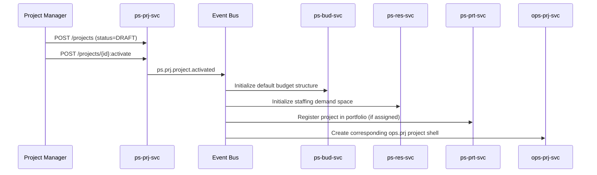
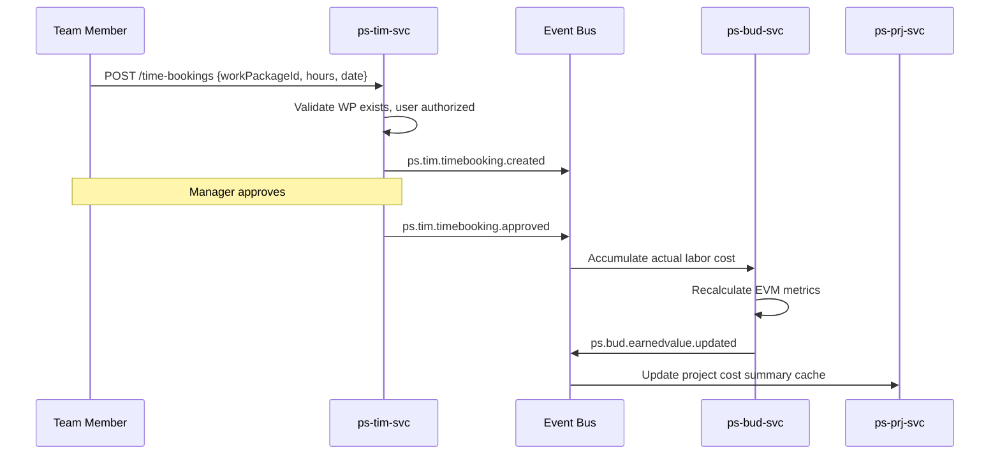
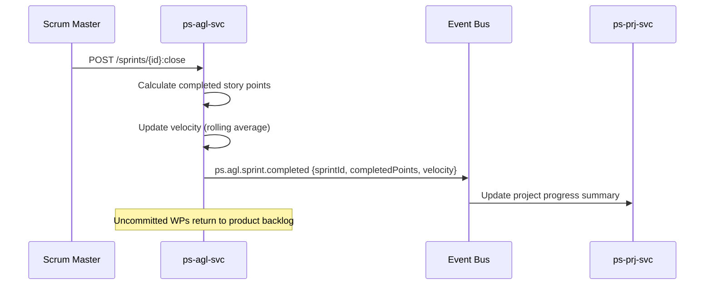
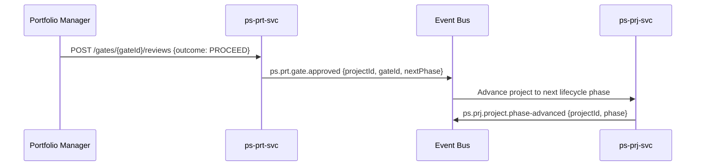
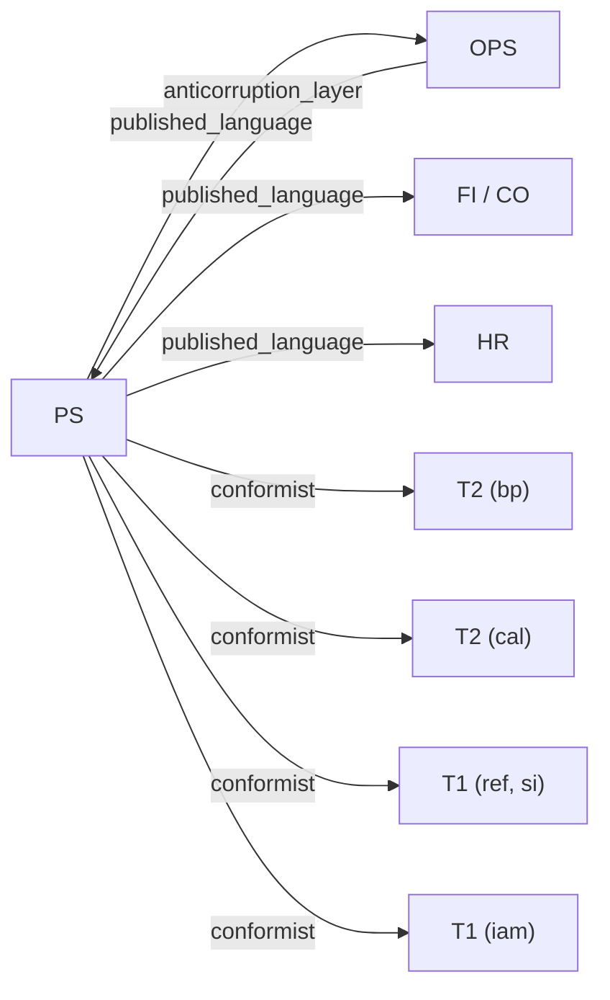

<!-- TEMPLATE COMPLIANCE: ~95%
Template: suite-spec.md v1.0.0
Present sections: §0 (Suite Identity & Purpose), §1 (Ubiquitous Language), §2 (Domain Model), §3 (Service Landscape), §4 (Integration Patterns), §5 (Event Conventions), §6 (Feature Catalog), §7 (Cross-Cutting Concerns), §8 (External Interfaces), §9 (Architecture Decisions), §10 (Roadmap), §11 (Appendix)
Missing sections: None
Notes: All 12 sections present with substantive content. Minor gap: meta governance fields were missing (Template + Template Compliance lines).
Priority: LOW
-->

# Project Management (PS) Suite Specification

> **Conceptual Stack Layer:** Suite
> **Space:** Platform
> **Owner:** Domain Engineering Team
> **Schema alignment:** `suite-layer.schema.json`
> **Companion files:** `ps.catalog.uvl` (referenced in SS6)
> **Contains:** Domain/Service Specs, Platform-Feature Specs, Feature Catalog

> **Meta Information**
> - **Version:** 2026-04-03
> - **Template:** `suite-spec.md` v1.0.0
> - **Template Compliance:** ~95% — fully compliant (all §0–§11 present)
> - **Author(s):** OpenLeap Architecture Team
> - **Status:** DRAFT
> - **Suite ID:** `ps`
> - **Suite Name:** Project Management
> - **Description:** Enterprise project management suite covering project planning (WBS, Gantt, agile), budgeting, staffing, time capture, and portfolio governance.
> - **Semantic Version:** `1.0.0`
> - **Team:**
>   - Name: `team-ps`
>   - Email: `ps-team@openleap.io`
>   - Slack: `#ps-team`
> - **Bounded Contexts:** `bc:project-core`, `bc:agile`, `bc:budget`, `bc:project-time`, `bc:staffing`, `bc:portfolio`

---

## Specification Guidelines

> **This specification MUST comply with the OpenLeap specification guidelines.**
>
> ### Non-Negotiables
> - Never invent facts. If required info is missing, add an **OPEN QUESTION** entry.
> - Preserve intent and decisions. Only change meaning when explicitly requested.
> - Keep the spec **self-contained**: no "see chat", no implicit context.
>
> ### Style Guide
> - Prefer short sentences and lists.
> - Use MUST/SHOULD/MAY for normative statements.
> - Keep terminology consistent with the Ubiquitous Language defined in SS1.
> - Avoid ambiguous words ("often", "maybe") unless explicitly noting uncertainty.

---

<!-- ═══════════════════════════════════════════════════════════════════
     SS0  SUITE IDENTITY & PURPOSE
     Schema alignment: metadata + purpose
     ═══════════════════════════════════════════════════════════════════ -->

## 0. Suite Identity & Purpose

### 0.1 Suite Identity

| Field | Value |
|-------|-------|
| id | `ps` |
| name | Project Management |
| description | Plans, structures, budgets, staffs, and governs projects and portfolios. Provides the planning and control perspective; execution and actuals capture is delegated to OPS. |
| version | `1.0.0` |
| status | `draft` |
| owner.team | `team-ps` |
| owner.email | `ps-team@openleap.io` |
| owner.slack | `#ps-team` |
| boundedContexts | `bc:project-core`, `bc:agile`, `bc:budget`, `bc:project-time`, `bc:staffing`, `bc:portfolio` |

### 0.2 Business Purpose

The Project Management Suite enables organizations to **plan, structure, budget, staff, and govern** projects and project portfolios. It provides the **planning and control perspective** on work — defining what should be done, by whom (as personas or roles), when, and at what cost. PS bridges the gap between strategic decisions ("invest in initiative X") and operational execution ("deliver work order Y"). It supports classic (waterfall/WBS), agile (Scrum/Kanban), and hybrid project methodologies. PS does NOT execute work or capture actuals — that responsibility belongs to OPS. PS consumes actuals from OPS to measure progress, earned value, and forecast completion.

### 0.3 In Scope

- Project lifecycle management: creation, planning, execution tracking, closure, archival
- Work Breakdown Structure (WBS): phases, work packages, activities, milestones, hierarchies
- Scheduling: Gantt charts, dependency networks, critical path, auto/manual scheduling, baselines
- Agile project management: sprints, backlogs, Kanban boards, story points, velocity, burndown
- Project budgeting: cost plans (labor + unit costs), cost types, planned vs. actual cost tracking
- Earned Value Management (EVM): planned value, earned value, actual cost, schedule/cost variance
- Project timesheets: planned effort against WBS elements, time/cost reporting, approval workflows
- Project staffing: demand planning with personas/roles, staffing assignments, capacity forecasting
- Portfolio & program management: portfolio governance, program grouping, project prioritization, lifecycle gates
- Project templates: reusable project structures with predefined WBS, milestones, and roles
- Baseline management: snapshot and compare project plans over time
- Cross-project views: multi-project dashboards, resource demand aggregation

### 0.4 Out of Scope

- Operational work order execution and service delivery capture (→ OPS suite, `ops.svc`)
- Actual time recording for billing and payroll purposes (→ OPS suite, `ops.tim`)
- Resource master data management (employees, equipment, facilities) (→ OPS suite, `ops.res`)
- Working calendars and capacity calendar infrastructure (→ T2, `cal`)
- Business partner master data (customers, sponsors) (→ T2, `bp`)
- Financial invoicing and accounts receivable (→ FI suite)
- Project accounting and cost center postings (→ FI suite / CO suite)
- Document storage and rendition (→ T1, `dms`)
- Meeting management and collaboration (→ collaboration tooling, outside platform scope)
- Wiki / knowledge base (→ `dms` or separate collaboration)
- Git/SVN repository integration (→ DevOps tooling, outside platform scope)
- Strategic analytics and BI dashboards (→ T4 Analytics)

### 0.5 Target Users

| Role | Interest |
|------|----------|
| Project Manager | Creates and manages projects, WBS, schedules, budgets; monitors progress and earned value |
| Scrum Master | Manages sprints, backlogs, burndown; facilitates agile ceremonies |
| Product Owner | Prioritizes backlog items, defines acceptance criteria, manages roadmap |
| Portfolio Manager | Governs project portfolio, prioritizes investments, monitors lifecycle gates |
| Program Manager | Coordinates related projects within a program, manages cross-project dependencies |
| Resource Manager | Reviews staffing demands, assigns people to project roles, balances capacity |
| Team Member | Views assigned work packages, logs project time, updates task status |
| Controller / PMO | Reviews project budgets, earned value reports, cost forecasts |
| Executive Sponsor | Reviews portfolio dashboards, approves gate decisions |

### 0.6 Business Value

- Unified project planning across classic, agile, and hybrid methodologies
- Full cost transparency from planning through execution via integration with OPS and FI
- Portfolio-level governance with lifecycle gates for investment decision support
- Resource demand visibility across the portfolio to prevent over-allocation
- Earned value management for objective progress measurement and forecasting
- Baseline comparison for schedule and scope change tracking
- Reusable project templates for faster project setup and organizational consistency

---

<!-- ═══════════════════════════════════════════════════════════════════
     SS1  UBIQUITOUS LANGUAGE
     Schema alignment: ubiquitous_language[]
     This is THE central chapter of the suite specification.
     ═══════════════════════════════════════════════════════════════════ -->

## 1. Ubiquitous Language

### 1.1 Glossary

| ID | Term | Aliases | Definition |
|----|------|---------|------------|
| ps:glossary:project | Project | Projekt, Initiative | A time-bounded endeavor with defined scope, budget, and deliverables. The top-level container in PS that groups all planning artifacts (WBS, budget, staffing, schedule). |
| ps:glossary:work-package | Work Package | WP, Arbeitspaket | The universal work item in PS. Represents any plannable unit of work: a phase, task, feature, bug, user story, or milestone. Work packages form hierarchies (parent-child) and can have dependencies. |
| ps:glossary:wbs | Work Breakdown Structure | WBS, Projektstrukturplan | The hierarchical decomposition of a project into phases, work packages, and activities. Defines the complete scope of work. |
| ps:glossary:activity | Activity | Vorgang, Task | A leaf-level work package that represents actual work to be performed. Activities have duration, effort estimates, and can be scheduled. |
| ps:glossary:milestone | Milestone | Meilenstein | A zero-duration work package marking a significant point in the project timeline — a deliverable, decision point, or phase gate. |
| ps:glossary:phase | Phase | Projektphase | A high-level grouping of work packages within a project representing a major stage (e.g., Initiation, Planning, Execution, Closure). |
| ps:glossary:dependency | Dependency | Relation, Abhängigkeit, Predecessor/Successor | A logical relationship between two work packages that constrains scheduling. Types: finish-to-start (FS), start-to-start (SS), finish-to-finish (FF), start-to-finish (SF). |
| ps:glossary:baseline | Baseline | Planstand, Snapshot | A frozen snapshot of the project schedule and scope at a specific point in time. Used for comparison against the current plan to measure drift. |
| ps:glossary:gantt-chart | Gantt Chart | Gantt-Diagramm, Timeline | A bar-chart visualization of work packages plotted on a calendar timeline showing dependencies, progress, and critical path. |
| ps:glossary:critical-path | Critical Path | Kritischer Pfad | The longest sequence of dependent activities that determines the minimum project duration. Any delay on the critical path delays the project. |
| ps:glossary:sprint | Sprint | Iteration | A fixed-length time box (typically 1–4 weeks) during which a set of backlog items is planned, executed, and reviewed. Owned by `ps.agl`. |
| ps:glossary:backlog | Backlog | Product Backlog, Sprint Backlog | An ordered list of work packages representing planned work. Product backlog = all known work; sprint backlog = work committed for a sprint. |
| ps:glossary:board | Board | Kanban Board, Agile Board | A columnar visualization of work packages organized by status, assignee, version, or custom criteria. Supports drag-and-drop workflow. |
| ps:glossary:story-point | Story Point | SP, Aufwandspunkt | A relative unit of estimation used in agile to express the effort/complexity of a work package. Not tied to hours. |
| ps:glossary:velocity | Velocity | Geschwindigkeit | The average number of story points a team completes per sprint. Used for sprint capacity planning and release forecasting. |
| ps:glossary:burndown | Burndown Chart | Burndown | A chart showing remaining work (story points or count) over time within a sprint or release. Indicates whether the team is on track. |
| ps:glossary:budget | Budget | Projektbudget | A financial plan for a project defining planned labor costs and planned unit (material) costs. Work packages are assigned to budgets to track spending. |
| ps:glossary:cost-type | Cost Type | Kostenart | A classification of costs (e.g., development, consulting, travel, hardware). Each cost type has a unit and a rate schedule. |
| ps:glossary:earned-value | Earned Value | EV, Fertigstellungswert | The budgeted cost of work actually performed. Part of EVM: compares Planned Value (PV), Earned Value (EV), and Actual Cost (AC) to assess project health. |
| ps:glossary:planned-effort | Planned Effort | Planaufwand | The estimated hours or story points assigned to a work package or WBS element. Used for staffing and cost planning. |
| ps:glossary:time-booking | Time Booking | Zeitbuchung, Project Time Entry | A record of planned or estimated effort against a work package. Distinct from ops.tim time entries which record actual billable/payroll hours. |
| ps:glossary:persona | Persona | Role Demand, Rollenbedarf | An abstract resource demand in project staffing — e.g., "Senior Java Developer" or "UX Designer." Not a real person; a skill/role profile with capacity need. |
| ps:glossary:staffing-slot | Staffing Slot | Besetzungsposition | A concrete demand for a persona on a project for a time period and FTE percentage. Can be filled by assigning a named resource or left as demand. |
| ps:glossary:demand | Demand | Ressourcenbedarf | The aggregate resource need across a project or portfolio, expressed in personas × FTE × time. Used for capacity planning. |
| ps:glossary:portfolio | Portfolio | Projektportfolio | A collection of projects and programs governed as a group. Enables cross-project prioritization, resource balancing, and strategic alignment. |
| ps:glossary:program | Program | Programm | A group of related projects managed in a coordinated way to achieve benefits not available from managing them individually. |
| ps:glossary:gate | Gate | Phasentor, Stage Gate | A decision point in the project lifecycle where stakeholders review progress and decide to proceed, hold, or cancel. |
| ps:glossary:lifecycle | Lifecycle | Projektlebenszyklus | The sequence of phases and gates a project passes through from initiation to closure. Configurable per project type. |
| ps:glossary:project-template | Project Template | Projektvorlage | A reusable project definition including predefined WBS, milestones, roles, and board configurations. Used to standardize project setup. |
| ps:glossary:progress | Progress | Fortschritt | The degree of completion of a work package or project, expressed as percentage, earned value, or status. |

#### ps:glossary:work-package — Work Package

**Examples:**
- Phase "Design" containing child WPs "Wireframes" and "Prototype"
- User Story "As a buyer, I can filter products by category" with 5 story points
- Bug "Login fails on mobile Safari" assigned to Sprint 12
- Milestone "Feature Freeze" with planned date 2026-06-01

**Related terms:** `ps:glossary:wbs`, `ps:glossary:activity`, `ps:glossary:milestone`, `ps:glossary:dependency`
**Used by services:** `ps-prj-svc`, `ps-agl-svc`, `ps-bud-svc`, `ps-tim-svc`
**Not to confuse with:** "Work Order in OPS — an executable operational instruction derived from a sales order. A PS Work Package is a planning artifact; an OPS Work Order is an execution artifact."

#### ps:glossary:persona — Persona

**Examples:**
- "Senior Backend Developer, Java, 0.5 FTE, Q3 2026"
- "UX Designer, 1.0 FTE, 3 months"
- "External Consultant, SAP Integration, 100 hours"

**Related terms:** `ps:glossary:staffing-slot`, `ps:glossary:demand`
**Used by services:** `ps-res-svc`
**Not to confuse with:** "Resource in OPS — a concrete person or equipment linked to a BP record. A PS Persona is an abstract demand; an OPS Resource is a real, schedulable entity."

### 1.2 UBL Boundary Test

**PS vs. OPS:**
In PS, "Work Package" means a planning artifact representing scope, estimated effort, and schedule position within a WBS. In OPS, the equivalent business concept is a "Work Order" — an executable operational instruction tied to a sales order with real resource assignments and billable deliveries. PS plans what should happen; OPS records what did happen. A PS work package may eventually result in one or more OPS work orders, but the concepts live in different bounded contexts with different lifecycles. This confirms PS and OPS are separate suites.

**PS vs. OPS (Resource):**
In PS, "Persona" means an abstract resource demand defined by skill profile and capacity need — "2 Senior Java Developers for 3 months." In OPS, "Resource" means a concrete person or piece of equipment with a BP identity, real availability schedule, and billable hours. PS staffs with roles; OPS schedules real people. This confirms the staffing boundary.

**PS vs. FI:**
In PS, "Budget" means a project-level cost plan with estimated labor and material costs used for earned value calculation. In FI, "Budget" (if used) refers to an accounting-level allocation within cost centers or profit centers governed by fiscal rules. PS budgets are planning instruments; FI budgets are accounting instruments. This confirms PS and FI are separate suites.

---

<!-- ═══════════════════════════════════════════════════════════════════
     SS2  DOMAIN MODEL
     Schema alignment: domain_model
     ═══════════════════════════════════════════════════════════════════ -->

## 2. Domain Model

### 2.1 Conceptual Overview



### 2.2 Core Concepts

| Concept | Owner (Service) | Description | Glossary Ref |
|---------|----------------|-------------|-------------|
| Project | `ps-prj-svc` | Top-level container for all planning artifacts; has lifecycle, schedule, scope | `ps:glossary:project` |
| Work Package | `ps-prj-svc` | Universal work item forming WBS hierarchies with dependencies | `ps:glossary:work-package` |
| Milestone | `ps-prj-svc` | Zero-duration marker for deliverables or decision points | `ps:glossary:milestone` |
| Dependency | `ps-prj-svc` | Scheduling constraint between two work packages (FS, SS, FF, SF) | `ps:glossary:dependency` |
| Baseline | `ps-prj-svc` | Frozen snapshot of project schedule and scope for comparison | `ps:glossary:baseline` |
| Project Template | `ps-prj-svc` | Reusable project structure with predefined WBS and configuration | `ps:glossary:project-template` |
| Sprint | `ps-agl-svc` | Time-boxed iteration for agile planning and delivery | `ps:glossary:sprint` |
| Backlog | `ps-agl-svc` | Ordered list of work packages (product or sprint level) | `ps:glossary:backlog` |
| Board | `ps-agl-svc` | Columnar visualization of work packages by configurable criteria | `ps:glossary:board` |
| Budget | `ps-bud-svc` | Financial plan for a project with planned labor and unit costs | `ps:glossary:budget` |
| Cost Type | `ps-bud-svc` | Classification of costs with unit and rate schedule | `ps:glossary:cost-type` |
| Earned Value Snapshot | `ps-bud-svc` | Point-in-time EVM calculation (PV, EV, AC, SPI, CPI) | `ps:glossary:earned-value` |
| Time Booking | `ps-tim-svc` | Planned or estimated effort recorded against a work package | `ps:glossary:time-booking` |
| Cost Entry | `ps-tim-svc` | Unit cost recorded against a work package (materials, travel, etc.) | `ps:glossary:cost-type` |
| Persona | `ps-res-svc` | Abstract resource demand defined by skill/role profile | `ps:glossary:persona` |
| Staffing Slot | `ps-res-svc` | Concrete demand tying a persona to a project for a time period | `ps:glossary:staffing-slot` |
| Portfolio | `ps-prt-svc` | Governed collection of projects for strategic alignment | `ps:glossary:portfolio` |
| Program | `ps-prt-svc` | Coordinated group of related projects | `ps:glossary:program` |
| Gate | `ps-prt-svc` | Decision point in a project lifecycle | `ps:glossary:gate` |
| Lifecycle | `ps-prt-svc` | Configurable sequence of phases and gates | `ps:glossary:lifecycle` |

### 2.3 Shared Kernel

| Concept | Owner | Shared With | Mechanism |
|---------|-------|-------------|-----------|
| Work Package (ID + summary) | `ps-prj-svc` | `ps-agl-svc`, `ps-bud-svc`, `ps-tim-svc`, `ps-res-svc` | `api` + `event` |
| Project (ID + status + lifecycle) | `ps-prj-svc` | `ps-bud-svc`, `ps-res-svc`, `ps-prt-svc`, `ps-tim-svc`, `ps-agl-svc` | `api` + `event` |
| Cost Type (ID + unit + rates) | `ps-bud-svc` | `ps-tim-svc` | `api` |
| Persona (ID + skill profile) | `ps-res-svc` | `ps-prj-svc` (for assignment display) | `api` |

#### Shared Type: WorkPackageRef

| Attribute | Type | Format | Required | Description | Constraints |
|-----------|------|--------|----------|-------------|-------------|
| workPackageId | string | uuid | Yes | Reference to the work package in ps-prj-svc | Must exist in ps-prj-svc |
| projectId | string | uuid | Yes | Owning project ID | Must match the work package's project |
| code | string | — | Yes | Human-readable short code (e.g., "WP-0042") | — |
| subject | string | — | Yes | Title of the work package | min 1 char |

**Validation rules:**
- All services referencing a work package MUST use this shared type structure
- `workPackageId` MUST resolve via `GET /api/ps/prj/v1/work-packages/{id}`

#### Shared Type: ProjectRef

| Attribute | Type | Format | Required | Description | Constraints |
|-----------|------|--------|----------|-------------|-------------|
| projectId | string | uuid | Yes | Reference to the project in ps-prj-svc | Must exist |
| code | string | — | Yes | Human-readable project code | Unique per tenant |
| name | string | — | Yes | Project name | min 1 char |
| status | string | enum | Yes | Current project status | One of defined lifecycle statuses |

### 2.4 Bounded Context Map (Intra-Suite)

| Upstream | Downstream | Pattern | Description |
|----------|-----------|---------|-------------|
| `bc:project-core` | `bc:agile` | `customer_supplier` | Agile consumes work packages from project core; sprints and boards operate on WPs owned by prj |
| `bc:project-core` | `bc:budget` | `customer_supplier` | Budget service tracks costs against WPs and projects defined in prj |
| `bc:project-core` | `bc:project-time` | `customer_supplier` | Time bookings reference WPs owned by prj |
| `bc:project-core` | `bc:staffing` | `customer_supplier` | Staffing demands are raised against projects owned by prj |
| `bc:project-core` | `bc:portfolio` | `customer_supplier` | Portfolios and programs group projects owned by prj |
| `bc:budget` | `bc:project-time` | `shared_kernel` | Time bookings use cost types defined in budget; budget consumes time bookings for actual cost calculation |
| `bc:staffing` | `bc:project-core` | `published_language` | Staffing publishes persona assignments that prj displays on work packages |



---

<!-- ═══════════════════════════════════════════════════════════════════
     SS3  SERVICE LANDSCAPE
     Schema alignment: service_landscape
     ═══════════════════════════════════════════════════════════════════ -->

## 3. Service Landscape

### 3.1 Service Catalog

| Service ID | Name | Bounded Context | Status | Responsibility | Spec |
|-----------|------|----------------|--------|----------------|------|
| `ps-prj-svc` | Project Core | `bc:project-core` | `planned` | Project lifecycle, WBS, work packages, scheduling, dependencies, milestones, baselines, templates | `ps_prj-spec.md` |
| `ps-agl-svc` | Agile & Boards | `bc:agile` | `planned` | Sprints, backlogs, Kanban boards, story points, velocity, burndown | `ps_agl-spec.md` |
| `ps-bud-svc` | Budget & Cost Control | `bc:budget` | `planned` | Project budgets, cost types, planned vs. actual costs, earned value management | `ps_bud-spec.md` |
| `ps-tim-svc` | Project Time & Costs | `bc:project-time` | `planned` | Time bookings against WBS, cost entries, time/cost reporting, approval | `ps_tim-spec.md` |
| `ps-res-svc` | Project Staffing | `bc:staffing` | `planned` | Personas, staffing slots, demand planning, capacity forecasting | `ps_res-spec.md` |
| `ps-prt-svc` | Portfolio & Program | `bc:portfolio` | `planned` | Portfolios, programs, project lifecycle definitions, gates, prioritization | `ps_prt-spec.md` |

### 3.2 Domain Summaries

#### 3.2.1 ps.prj — Project Core

**Business Purpose:**
Manages the full project lifecycle and all structural planning artifacts. Owns the Work Breakdown Structure (WBS), scheduling (Gantt), dependency management, milestone tracking, baseline creation, and project templates. This is the central domain of the PS suite — all other domains reference projects and work packages owned here.

**Core Entities:**
- **Project:** Top-level container with lifecycle, schedule, scope, and configuration
- **Work Package:** Universal work item forming hierarchies (phase → WP → activity)
- **Milestone:** Zero-duration marker for deliverables or decisions
- **Dependency:** Scheduling relation between work packages (FS, SS, FF, SF)
- **Baseline:** Frozen snapshot for plan-vs-actual comparison
- **Project Template:** Reusable project structure

**Key Workflows:**
1. Create Project: From scratch or from template; define scope, dates, team
2. Build WBS: Decompose scope into phases, work packages, activities, milestones
3. Schedule: Set durations, define dependencies, auto-schedule (forward/backward pass), identify critical path
4. Baseline: Freeze current plan as baseline for later comparison
5. Track Progress: Update work package status and completion; compare against baseline
6. Close Project: Mark all WPs complete, archive, generate closure report

**Integration Points:**
- **Downstream (intra-suite):** Publishes `ps.prj.project.*` and `ps.prj.workpackage.*` events consumed by all other PS domains
- **Downstream (cross-suite):** Publishes events consumed by OPS (for work order creation), FI (for project accounting)
- **Upstream (cross-suite):** Consumes `ops.svc.delivery.approved` and `ops.tim.timeentry.approved` for progress actuals
- **Synchronous:** Queries `bp` for customer/sponsor data, `cal` for working days, `ref` for codes

**Reference to Full Spec:** `ps_prj-spec.md`

**Status:** Planned

#### 3.2.2 ps.agl — Agile & Boards

**Business Purpose:**
Provides agile project management capabilities on top of the work packages defined in `ps.prj`. Manages sprints (time-boxed iterations), product and sprint backlogs, Kanban boards, and agile metrics (story points, velocity, burndown). Supports Scrum, Kanban, and hybrid workflows. This domain is optional — organizations not using agile methodologies do not need to enable it.

**Core Entities:**
- **Sprint:** Time-boxed iteration with start/end date and committed work packages
- **Backlog:** Ordered list of work packages (product-level or sprint-level)
- **Board:** Configurable columnar view (by status, assignee, version, or custom field)
- **Board Column:** A single column on a board with filter criteria and WIP limit

**Key Workflows:**
1. Groom Backlog: Order and estimate (story points) work packages in the product backlog
2. Plan Sprint: Move items from product backlog to sprint backlog; check capacity vs. velocity
3. Execute Sprint: Team works on sprint items; board reflects status changes
4. Review Sprint: Compare completed vs. committed story points; update velocity
5. Retrospect: Capture improvement actions (linked as work packages)

**Integration Points:**
- **Upstream (intra-suite):** Consumes work packages from `ps-prj-svc` via API and events
- **Downstream (intra-suite):** Publishes `ps.agl.sprint.started|completed`, `ps.agl.backlog.reordered`
- **Synchronous:** Reads work package details from `ps-prj-svc`

**Reference to Full Spec:** `ps_agl-spec.md`

**Status:** Planned

#### 3.2.3 ps.bud — Budget & Cost Control

**Business Purpose:**
Manages project-level financial planning and cost control. Enables creation of budgets with planned labor and unit costs, tracks actual spending against budgets, and provides Earned Value Management (EVM) for objective progress measurement. Cost types are defined here and shared with `ps.tim` for consistent cost recording.

**Core Entities:**
- **Budget:** Financial plan tied to a project, containing planned labor and unit cost lines
- **Planned Labor Cost:** Estimated hours × hourly rate for a persona or named resource
- **Planned Unit Cost:** Estimated quantity × unit rate for a cost type (materials, travel, etc.)
- **Cost Type:** Classification with unit name and rate schedule (effective-dated)
- **Earned Value Snapshot:** Point-in-time calculation of PV, EV, AC, SV, CV, SPI, CPI

**Key Workflows:**
1. Define Budget: Create budget for project with planned labor and unit costs
2. Assign Work Packages: Link work packages to budget for cost tracking
3. Track Actuals: Accumulate actual costs from time bookings and cost entries
4. Calculate EVM: Compute earned value metrics at budget and project level
5. Forecast: Project estimate-at-completion (EAC) and estimate-to-complete (ETC)

**Integration Points:**
- **Upstream (intra-suite):** Consumes `ps.tim.timebooking.approved` and `ps.tim.costentry.created` for actual costs
- **Upstream (intra-suite):** Reads work package progress from `ps-prj-svc`
- **Downstream (cross-suite):** Publishes `ps.bud.budget.overspent` for alerting; publishes cost summaries consumed by FI/CO
- **Synchronous:** Provides cost type catalog API consumed by `ps-tim-svc`

**Reference to Full Spec:** `ps_bud-spec.md`

**Status:** Planned

#### 3.2.4 ps.tim — Project Time & Costs

**Business Purpose:**
Captures time bookings and cost entries against work packages for project cost tracking and progress measurement. Distinct from `ops.tim` which captures actual working hours for billing and payroll. PS time bookings feed into `ps.bud` for earned value calculation and budget tracking. Supports approval workflows for time and cost entries.

**Core Entities:**
- **Time Booking:** Effort (hours) logged against a work package by a user, with date and optional activity type
- **Cost Entry:** Unit cost logged against a work package (e.g., 500 km travel, 3 licenses)
- **Approval:** Workflow for manager review of time bookings and cost entries

**Key Workflows:**
1. Log Time: User records hours worked on a work package
2. Log Costs: User records unit costs (choosing cost type from `ps.bud`)
3. Approve: Manager reviews and approves/rejects entries
4. Report: Generate time and cost reports with filters (by project, user, period, budget, cost type)
5. Sync to OPS: Optionally forward approved project time to `ops.tim` to avoid double entry

**Integration Points:**
- **Upstream (intra-suite):** Reads work packages from `ps-prj-svc`, cost types from `ps-bud-svc`
- **Downstream (intra-suite):** Publishes `ps.tim.timebooking.approved` and `ps.tim.costentry.created` consumed by `ps-bud-svc`
- **Downstream (cross-suite):** MAY publish to `ops.tim` for payroll/billing synchronization
- **Downstream (cross-suite):** Publishes to HR for leave/absence integration

**Reference to Full Spec:** `ps_tim-spec.md`

**Status:** Planned

#### 3.2.5 ps.res — Project Staffing

**Business Purpose:**
Manages project resource demands at the planning level using personas (abstract roles) rather than concrete people. Enables demand planning, staffing slot management, and capacity forecasting across projects and portfolios. The key distinction from `ops.res`: PS staffing works with skill profiles and FTE demands; OPS resources are concrete BP-linked entities with real availability.

**Core Entities:**
- **Persona:** Skill/role profile defining a type of resource demand (e.g., "Senior Java Developer")
- **Staffing Slot:** A demand for a persona on a project for a period and FTE percentage
- **Staffing Assignment:** Resolution of a slot — either left as demand, or filled by a named resource (reference to `ops.res` or `bp`)
- **Demand Aggregation:** Roll-up view of all open demand across projects/portfolio

**Key Workflows:**
1. Define Personas: Create skill/role profiles reusable across projects
2. Raise Demand: Create staffing slots on a project for specific personas and periods
3. Fill Slots: Assign named resources (from `ops.res`) to staffing slots, or leave as open demand
4. Capacity View: Aggregate demand across portfolio; identify over/under-allocation
5. Scenario Planning: Model "what-if" staffing scenarios before committing

**Integration Points:**
- **Upstream (intra-suite):** Reads projects from `ps-prj-svc`
- **Upstream (cross-suite):** Reads resource master data and availability from `ops.res` (for slot filling)
- **Downstream (intra-suite):** Publishes `ps.res.slot.filled` events consumed by `ps-prj-svc` (to display on WPs)
- **Downstream (cross-suite):** Publishes demand events consumed by OPS for capacity planning visibility

**Reference to Full Spec:** `ps_res-spec.md`

**Status:** Planned

#### 3.2.6 ps.prt — Portfolio & Program

**Business Purpose:**
Provides portfolio-level governance over projects and programs. Manages project lifecycle definitions (configurable phases and gates), portfolio prioritization and scoring, and cross-project dashboards. Supports strategic alignment by linking projects to business objectives and enabling investment decisions at gate reviews.

**Core Entities:**
- **Portfolio:** A governed collection of projects and programs
- **Program:** A grouping of related projects managed together for combined benefits
- **Lifecycle:** A configurable sequence of phases and gates (e.g., Idea → Feasibility → Build → Launch)
- **Gate:** A decision point requiring review and approval before proceeding
- **Gate Review:** The actual review event at a gate with outcome (proceed, hold, cancel)
- **Scoring Model:** Configurable criteria for project prioritization (e.g., RICE, weighted scoring)

**Key Workflows:**
1. Define Lifecycle: Create phase/gate sequences for different project types
2. Create Portfolio: Group projects under a portfolio with strategic objectives
3. Prioritize: Score and rank projects using configurable scoring models
4. Gate Review: At each gate, review project health and decide outcome
5. Portfolio Dashboard: Cross-project view of status, budget health, resource demand, risk

**Integration Points:**
- **Upstream (intra-suite):** Reads project status and progress from `ps-prj-svc`, budget health from `ps-bud-svc`, demand from `ps-res-svc`
- **Downstream (intra-suite):** Publishes `ps.prt.gate.approved|rejected|held`, `ps.prt.lifecycle.assigned`
- **Synchronous:** Provides portfolio/program lookup APIs

**Reference to Full Spec:** `ps_prt-spec.md`

**Status:** Planned

### 3.3 Responsibility Matrix

| Responsibility | Service |
|---------------|---------|
| Project lifecycle and WBS structure | `ps-prj-svc` |
| Work package CRUD and hierarchy management | `ps-prj-svc` |
| Dependency management and scheduling (Gantt) | `ps-prj-svc` |
| Baseline creation and comparison | `ps-prj-svc` |
| Project template management | `ps-prj-svc` |
| Sprint management and agile ceremonies | `ps-agl-svc` |
| Backlog ordering and estimation | `ps-agl-svc` |
| Board configuration and visualization | `ps-agl-svc` |
| Velocity and burndown calculation | `ps-agl-svc` |
| Budget planning (labor + unit costs) | `ps-bud-svc` |
| Cost type catalog management | `ps-bud-svc` |
| Earned value calculation and forecasting | `ps-bud-svc` |
| Time booking against work packages | `ps-tim-svc` |
| Cost entry recording | `ps-tim-svc` |
| Time/cost reporting and approval | `ps-tim-svc` |
| Persona and skill profile management | `ps-res-svc` |
| Staffing slot management | `ps-res-svc` |
| Demand aggregation and capacity view | `ps-res-svc` |
| Portfolio and program governance | `ps-prt-svc` |
| Lifecycle and gate management | `ps-prt-svc` |
| Project scoring and prioritization | `ps-prt-svc` |

### 3.4 Service Dependency Diagram



---

<!-- ═══════════════════════════════════════════════════════════════════
     SS4  INTEGRATION PATTERNS
     Schema alignment: integration_patterns
     ═══════════════════════════════════════════════════════════════════ -->

## 4. Integration Patterns

### 4.1 Pattern Decision

| Field | Value |
|-------|-------|
| **Pattern** | `hybrid` |

**Rationale:**
- **Event-driven** for cross-domain state propagation: project lifecycle changes, work package updates, sprint completion, budget alerts, and actuals accumulation are naturally asynchronous. PS domains can tolerate eventual consistency (a budget doesn't need to reflect a time booking in the same millisecond).
- **Synchronous API** for user-facing queries: when a user opens a Gantt chart, the UI needs work packages + dependencies + baselines in real time. When logging time, the form needs the work package list and cost type catalog immediately. These are read-heavy, latency-sensitive interactions.
- **Hybrid** is the right fit because PS has both planning workflows (event-driven, long-running) and interactive UI scenarios (sync queries).

### 4.2 Key Event Flows

#### Flow 1: Project Created → Downstream Initialization

**Trigger:** Project manager creates and activates a new project



#### Flow 2: Time Booking → Budget Actuals → Earned Value

**Trigger:** Team member logs time against a work package



#### Flow 3: Sprint Completion → Velocity Update

**Trigger:** Scrum master closes a sprint



#### Flow 4: OPS Actuals → PS Progress Update

**Trigger:** Operational delivery is approved in OPS

```mermaid
sequenceDiagram
    participant OPS_SVC as ops-svc-svc
    participant E as Event Bus
    participant PRJ as ps-prj-svc
    participant BUD as ps-bud-svc

    OPS_SVC->>E: ops.svc.delivery.approved {workOrderId, projectRef, hours, amount}
    E->>PRJ: Match to PS work package via projectRef; update progress
    E->>BUD: Accumulate actual cost from OPS delivery
```

#### Flow 5: Gate Review → Project Lifecycle Progression

**Trigger:** Portfolio manager conducts a gate review



### 4.3 Sync vs. Async Decisions

| Integration | Type | Reason |
|------------|------|--------|
| UI loads work package list for Gantt/board | `sync` | Real-time interactive rendering; user expects immediate response |
| UI loads cost type catalog for time entry form | `sync` | Form lookup; must be available before user submits |
| UI queries resource availability from OPS | `sync` | Staffing slot filling needs current data |
| Time booking approved → budget update | `async` | Eventual consistency acceptable; budget recalculation can lag seconds |
| Project activated → OPS project shell created | `async` | Decoupled; OPS can process independently |
| Sprint completed → velocity updated | `async` | Internal calculation; no real-time UI dependency |
| Delivery approved in OPS → PS progress update | `async` | Cross-suite; eventual consistency by design |
| Gate review outcome → project phase advance | `async` | Workflow step; seconds of lag acceptable |

### 4.4 Error Handling

| Scenario | Handling |
|----------|---------|
| Event consumer fails to process | Dead-letter queue; automatic retry with exponential backoff (3 attempts); manual intervention after DLQ threshold |
| Sync API call to `ps-prj-svc` times out | Circuit breaker (Resilience4j); 3 retries with 500ms backoff; degrade gracefully (show cached data or error state) |
| Cross-suite event from OPS cannot be matched to PS project | Log warning; route to unmatched-events queue for manual mapping; do NOT discard |
| Budget recalculation fails after time booking | Retry; if persistent, mark budget as "stale" and alert PMO |
| Baseline creation fails (large project) | Async baseline job with progress tracking; retry once; manual trigger available |

---

<!-- ═══════════════════════════════════════════════════════════════════
     SS5  EVENT CONVENTIONS
     Schema alignment: event_conventions
     ═══════════════════════════════════════════════════════════════════ -->

## 5. Event Conventions

### 5.1 Routing Key Pattern

**Pattern:** `ps.{domain}.{aggregate}.{action}`

| Segment | Description | Examples |
|---------|-------------|---------|
| `ps` | Always `ps` | `ps` |
| `{domain}` | Domain short code | `prj`, `agl`, `bud`, `tim`, `res`, `prt` |
| `{aggregate}` | Aggregate root name (lowercase) | `project`, `workpackage`, `sprint`, `budget`, `timebooking`, `persona`, `portfolio`, `gate` |
| `{action}` | Past-tense verb | `created`, `updated`, `activated`, `completed`, `approved`, `rejected`, `closed`, `archived` |

**Examples:**
- `ps.prj.project.activated`
- `ps.prj.workpackage.created`
- `ps.agl.sprint.completed`
- `ps.bud.budget.overspent`
- `ps.tim.timebooking.approved`
- `ps.res.slot.filled`
- `ps.prt.gate.approved`

### 5.2 Payload Envelope

```json
{
  "eventId": "uuid",
  "eventType": "ps.{domain}.{aggregate}.{action}",
  "timestamp": "ISO-8601",
  "tenantId": "string",
  "correlationId": "uuid",
  "causationId": "uuid",
  "producer": "ps-{domain}-svc",
  "schemaVersion": "{major}.{minor}.{patch}",
  "payload": { }
}
```

### 5.3 Versioning Strategy

| Field | Value |
|-------|-------|
| **Strategy** | Schema evolution with backward compatibility |
| **Description** | New optional fields are additive and do not break existing consumers. Removing or renaming fields requires a new major schema version with parallel publishing during a migration window (minimum 2 sprints). Consumers MUST tolerate unknown fields. |

### 5.4 Event Catalog

| Routing Key | Producer | Consumer(s) | Description |
|------------|----------|-------------|-------------|
| `ps.prj.project.created` | `ps-prj-svc` | `ps-prt-svc` | New project created (draft) |
| `ps.prj.project.activated` | `ps-prj-svc` | `ps-bud-svc`, `ps-res-svc`, `ps-prt-svc`, `ops-prj-svc` | Project moved to active; downstream initialization |
| `ps.prj.project.completed` | `ps-prj-svc` | `ps-bud-svc`, `ps-prt-svc`, `ops-prj-svc` | Project closed; final cost snapshot |
| `ps.prj.project.cancelled` | `ps-prj-svc` | `ps-bud-svc`, `ps-res-svc`, `ps-prt-svc`, `ops-prj-svc` | Project cancelled; release resources |
| `ps.prj.project.phase-advanced` | `ps-prj-svc` | `ps-prt-svc` | Project moved to next lifecycle phase |
| `ps.prj.workpackage.created` | `ps-prj-svc` | `ps-agl-svc`, `ps-bud-svc` | New work package added to WBS |
| `ps.prj.workpackage.updated` | `ps-prj-svc` | `ps-agl-svc`, `ps-bud-svc`, `ps-tim-svc` | WP attributes changed (status, dates, effort) |
| `ps.prj.workpackage.completed` | `ps-prj-svc` | `ps-agl-svc`, `ps-bud-svc` | WP marked 100% complete |
| `ps.prj.workpackage.deleted` | `ps-prj-svc` | `ps-agl-svc`, `ps-bud-svc`, `ps-tim-svc` | WP removed from WBS |
| `ps.prj.milestone.achieved` | `ps-prj-svc` | `ps-prt-svc`, `ps-bud-svc` | Milestone reached |
| `ps.prj.baseline.created` | `ps-prj-svc` | `ps-bud-svc` | New baseline snapshot stored |
| `ps.agl.sprint.started` | `ps-agl-svc` | `ps-prj-svc` | Sprint time box begins |
| `ps.agl.sprint.completed` | `ps-agl-svc` | `ps-prj-svc` | Sprint closed; velocity updated |
| `ps.agl.backlog.reordered` | `ps-agl-svc` | — | Backlog priority changed (informational) |
| `ps.bud.budget.created` | `ps-bud-svc` | — | New budget defined for project |
| `ps.bud.budget.overspent` | `ps-bud-svc` | `ps-prt-svc`, notifications | Actual cost exceeds planned budget |
| `ps.bud.earnedvalue.updated` | `ps-bud-svc` | `ps-prj-svc`, `ps-prt-svc` | EVM metrics recalculated |
| `ps.tim.timebooking.created` | `ps-tim-svc` | — | Time entry recorded (pending approval) |
| `ps.tim.timebooking.approved` | `ps-tim-svc` | `ps-bud-svc` | Time entry approved; triggers budget actuals |
| `ps.tim.timebooking.rejected` | `ps-tim-svc` | — | Time entry rejected by manager |
| `ps.tim.costentry.created` | `ps-tim-svc` | `ps-bud-svc` | Unit cost booked against WP |
| `ps.res.persona.created` | `ps-res-svc` | — | New persona/role profile defined |
| `ps.res.slot.created` | `ps-res-svc` | `ps-prj-svc` | Staffing demand raised for project |
| `ps.res.slot.filled` | `ps-res-svc` | `ps-prj-svc` | Staffing slot assigned to named resource |
| `ps.res.slot.released` | `ps-res-svc` | `ps-prj-svc`, `ops-res-svc` | Resource released from project |
| `ps.prt.portfolio.created` | `ps-prt-svc` | — | New portfolio defined |
| `ps.prt.gate.approved` | `ps-prt-svc` | `ps-prj-svc` | Gate review passed; project may advance |
| `ps.prt.gate.rejected` | `ps-prt-svc` | `ps-prj-svc` | Gate review failed; project held or cancelled |
| `ps.prt.lifecycle.assigned` | `ps-prt-svc` | `ps-prj-svc` | Lifecycle template assigned to project |

---

<!-- ═══════════════════════════════════════════════════════════════════
     SS6  FEATURE CATALOG
     Schema alignment: (references companion ps.catalog.uvl)
     ═══════════════════════════════════════════════════════════════════ -->

## 6. Feature Catalog

### 6.1 Feature Tree

```
PS Suite
├── F-PS-001  Project Management                     [COMPOSITION] [mandatory]
│   ├── F-PS-001-01  Project List & Dashboard         [LEAF]        [mandatory]
│   ├── F-PS-001-02  Project Create/Edit              [LEAF]        [mandatory]
│   ├── F-PS-001-03  WBS Editor                       [LEAF]        [mandatory]
│   ├── F-PS-001-04  Gantt Chart & Scheduling         [LEAF]        [mandatory]
│   ├── F-PS-001-05  Work Package Detail View         [LEAF]        [mandatory]
│   ├── F-PS-001-06  Dependency Management            [LEAF]        [mandatory]
│   ├── F-PS-001-07  Milestone Tracking               [LEAF]        [mandatory]
│   ├── F-PS-001-08  Baseline Management              [LEAF]        [optional]
│   ├── F-PS-001-09  Project Templates                [LEAF]        [optional]
│   └── F-PS-001-10  Work Package Relations View      [LEAF]        [optional]
├── F-PS-002  Agile & Boards                          [COMPOSITION] [optional]
│   ├── F-PS-002-01  Product Backlog                  [LEAF]        [mandatory]
│   ├── F-PS-002-02  Sprint Planning & Management     [LEAF]        [mandatory]
│   ├── F-PS-002-03  Kanban Board                     [LEAF]        [mandatory]
│   ├── F-PS-002-04  Burndown Chart                   [LEAF]        [optional]
│   ├── F-PS-002-05  Velocity Tracking                [LEAF]        [optional]
│   └── F-PS-002-06  Custom Boards (Assignee/Version) [LEAF]        [optional]
├── F-PS-003  Budget & Cost Control                   [COMPOSITION] [mandatory]
│   ├── F-PS-003-01  Budget Planning                  [LEAF]        [mandatory]
│   ├── F-PS-003-02  Cost Type Management             [LEAF]        [mandatory]
│   ├── F-PS-003-03  Budget vs. Actuals Dashboard     [LEAF]        [mandatory]
│   ├── F-PS-003-04  Earned Value Management          [LEAF]        [optional]
│   └── F-PS-003-05  Cost Forecasting (EAC/ETC)       [LEAF]        [optional]
├── F-PS-004  Project Time & Costs                    [COMPOSITION] [mandatory]
│   ├── F-PS-004-01  Time Booking Entry               [LEAF]        [mandatory]
│   ├── F-PS-004-02  Cost Entry                       [LEAF]        [mandatory]
│   ├── F-PS-004-03  Time/Cost Approval Workflow      [LEAF]        [mandatory]
│   ├── F-PS-004-04  Time & Cost Reports              [LEAF]        [mandatory]
│   └── F-PS-004-05  My Time (Personal Dashboard)     [LEAF]        [optional]
├── F-PS-005  Project Staffing                        [COMPOSITION] [optional]
│   ├── F-PS-005-01  Persona Management               [LEAF]        [mandatory]
│   ├── F-PS-005-02  Staffing Slot Management         [LEAF]        [mandatory]
│   ├── F-PS-005-03  Team Planner View                [LEAF]        [mandatory]
│   ├── F-PS-005-04  Demand Aggregation Dashboard     [LEAF]        [optional]
│   └── F-PS-005-05  Scenario Planning                [LEAF]        [optional]
└── F-PS-006  Portfolio & Program                     [COMPOSITION] [optional]
    ├── F-PS-006-01  Portfolio Dashboard              [LEAF]        [mandatory]
    ├── F-PS-006-02  Program Management               [LEAF]        [mandatory]
    ├── F-PS-006-03  Lifecycle & Gate Management       [LEAF]        [mandatory]
    ├── F-PS-006-04  Gate Review Workflow              [LEAF]        [mandatory]
    ├── F-PS-006-05  Project Scoring & Prioritization  [LEAF]        [optional]
    └── F-PS-006-06  Multi-Project Roadmap             [LEAF]        [optional]
```

### 6.2 Mandatory Features

| Feature ID | Name | Rationale |
|-----------|------|-----------|
| `F-PS-001` | Project Management | Core capability; without project structure, no other PS domain functions |
| `F-PS-003` | Budget & Cost Control | Cost tracking is essential for any project management deployment |
| `F-PS-004` | Project Time & Costs | Time recording is the primary input for cost tracking and progress |

### 6.3 Cross-Suite Feature Dependencies

| This Suite Feature | Requires | From Suite | Reason |
|-------------------|----------|-----------|--------|
| `F-PS-001` (Project Management) | Business Partner lookup | `bp` (T2) | Projects reference customers and sponsors from BP |
| `F-PS-001` (Project Management) | Working calendar | `cal` (T2) | Scheduling needs working days/holidays |
| `F-PS-001` (Project Management) | Reference data | `ref` (T1) | Codes, classifications, currencies |
| `F-PS-004` (Time & Costs) | IAM user context | `iam` (T1) | Time bookings require authenticated user identity |
| `F-PS-005` (Staffing) | Resource master data | `ops.res` | Filling staffing slots needs real resource data from OPS |
| `F-PS-003` (Budget) | Currency & UoM | `ref` (T1), `si` (T1) | Budget amounts need currency; cost types need units |

### 6.4 Feature Register

| Feature ID | Name | Status | Spec Reference |
|-----------|------|--------|---------------|
| `F-PS-001-01` | Project List & Dashboard | `draft` | `features/F-PS-001-01/feature-spec.md` |
| `F-PS-001-02` | Project Create/Edit | `draft` | `features/F-PS-001-02/feature-spec.md` |
| `F-PS-001-03` | WBS Editor | `draft` | `features/F-PS-001-03/feature-spec.md` |
| `F-PS-001-04` | Gantt Chart & Scheduling | `draft` | `features/F-PS-001-04/feature-spec.md` |
| `F-PS-001-05` | Work Package Detail View | `draft` | `features/F-PS-001-05/feature-spec.md` |
| `F-PS-001-06` | Dependency Management | `draft` | `features/F-PS-001-06/feature-spec.md` |
| `F-PS-001-07` | Milestone Tracking | `draft` | `features/F-PS-001-07/feature-spec.md` |
| `F-PS-001-08` | Baseline Management | `draft` | `features/F-PS-001-08/feature-spec.md` |
| `F-PS-001-09` | Project Templates | `draft` | `features/F-PS-001-09/feature-spec.md` |
| `F-PS-001-10` | Work Package Relations View | `draft` | `features/F-PS-001-10/feature-spec.md` |
| `F-PS-002-01` | Product Backlog | `draft` | `features/F-PS-002-01/feature-spec.md` |
| `F-PS-002-02` | Sprint Planning & Management | `draft` | `features/F-PS-002-02/feature-spec.md` |
| `F-PS-002-03` | Kanban Board | `draft` | `features/F-PS-002-03/feature-spec.md` |
| `F-PS-002-04` | Burndown Chart | `draft` | `features/F-PS-002-04/feature-spec.md` |
| `F-PS-002-05` | Velocity Tracking | `draft` | `features/F-PS-002-05/feature-spec.md` |
| `F-PS-002-06` | Custom Boards | `draft` | `features/F-PS-002-06/feature-spec.md` |
| `F-PS-003-01` | Budget Planning | `draft` | `features/F-PS-003-01/feature-spec.md` |
| `F-PS-003-02` | Cost Type Management | `draft` | `features/F-PS-003-02/feature-spec.md` |
| `F-PS-003-03` | Budget vs. Actuals Dashboard | `draft` | `features/F-PS-003-03/feature-spec.md` |
| `F-PS-003-04` | Earned Value Management | `draft` | `features/F-PS-003-04/feature-spec.md` |
| `F-PS-003-05` | Cost Forecasting | `draft` | `features/F-PS-003-05/feature-spec.md` |
| `F-PS-004-01` | Time Booking Entry | `draft` | `features/F-PS-004-01/feature-spec.md` |
| `F-PS-004-02` | Cost Entry | `draft` | `features/F-PS-004-02/feature-spec.md` |
| `F-PS-004-03` | Time/Cost Approval Workflow | `draft` | `features/F-PS-004-03/feature-spec.md` |
| `F-PS-004-04` | Time & Cost Reports | `draft` | `features/F-PS-004-04/feature-spec.md` |
| `F-PS-004-05` | My Time | `draft` | `features/F-PS-004-05/feature-spec.md` |
| `F-PS-005-01` | Persona Management | `draft` | `features/F-PS-005-01/feature-spec.md` |
| `F-PS-005-02` | Staffing Slot Management | `draft` | `features/F-PS-005-02/feature-spec.md` |
| `F-PS-005-03` | Team Planner View | `draft` | `features/F-PS-005-03/feature-spec.md` |
| `F-PS-005-04` | Demand Aggregation Dashboard | `draft` | `features/F-PS-005-04/feature-spec.md` |
| `F-PS-005-05` | Scenario Planning | `draft` | `features/F-PS-005-05/feature-spec.md` |
| `F-PS-006-01` | Portfolio Dashboard | `draft` | `features/F-PS-006-01/feature-spec.md` |
| `F-PS-006-02` | Program Management | `draft` | `features/F-PS-006-02/feature-spec.md` |
| `F-PS-006-03` | Lifecycle & Gate Management | `draft` | `features/F-PS-006-03/feature-spec.md` |
| `F-PS-006-04` | Gate Review Workflow | `draft` | `features/F-PS-006-04/feature-spec.md` |
| `F-PS-006-05` | Project Scoring & Prioritization | `draft` | `features/F-PS-006-05/feature-spec.md` |
| `F-PS-006-06` | Multi-Project Roadmap | `draft` | `features/F-PS-006-06/feature-spec.md` |

### 6.5 Variability Summary

| Metric | Value |
|--------|-------|
| Total composition nodes | 6 |
| Total leaf features | 37 |
| Mandatory features | 24 (14 from 3 mandatory compositions + 10 mandatory-within-optional compositions) |
| Optional features | 13 |
| Cross-suite `requires` | 6 |
| Attributes (total across leaves) | TBD — to be detailed in individual feature specs |
| Binding times used | `compile` (suite inclusion), `deploy` (feature toggles), `runtime` (board configuration, lifecycle templates) |

---

<!-- ═══════════════════════════════════════════════════════════════════
     SS7  CROSS-CUTTING CONCERNS
     Schema alignment: cross_cutting_concerns
     ═══════════════════════════════════════════════════════════════════ -->

## 7. Cross-Cutting Concerns

### 7.1 Compliance

| Regulation | Requirement | Implementation |
|-----------|-------------|----------------|
| GDPR | Personal data in time bookings and staffing assignments must be protectable | Anonymization/deletion of user references on request; audit log retained with pseudonymized IDs |
| ISO 21500 (Project Management) | Project management processes should follow recognized methodology | PS supports classic (WBS/Gantt), agile (Scrum/Kanban), and hybrid; lifecycle gates align with stage-gate methodology |
| PMBOK / PRINCE2 | Earned value management and stage-gate governance | EVM built into `ps.bud`; gate reviews built into `ps.prt` |
| SOX (if applicable) | Financial controls on project cost reporting | Budget changes audited; approval workflows enforce segregation of duties |
| ISO 27001 | Information security for project data | Role-based access; data classification per project; encrypted at rest and in transit |

### 7.2 Security

| Aspect | Approach |
|--------|---------|
| **Authentication** | OAuth2 / OIDC via T1 `iam-svc` (Keycloak) |
| **Authorization** | RBAC via T1 `iam-svc`. Roles defined per service (see domain specs). Project-level role scoping: a user may be PM on project A but only Team Member on project B |
| **Data Classification** | Internal by default. Projects MAY be marked as confidential, restricting visibility to assigned members only |

### 7.3 Multi-Tenancy

| Aspect | Value |
|--------|-------|
| **Model** | `shared_schema` |
| **Isolation** | Row-Level Security (RLS) via `tenant_id` on all tables |
| **Tenant ID Propagation** | JWT claim `tenant_id` → propagated in event envelope and `X-Tenant-ID` header |

**Rules:**
- All queries MUST include `tenant_id` filter (enforced by RLS policies)
- Cross-tenant data access is forbidden at the API level
- Project templates MAY be shared across tenants if marked as `global` (platform-provided templates)

### 7.4 Audit

**Audit Requirements:**
- All state changes on aggregate roots (Project, Work Package, Sprint, Budget, Staffing Slot, Portfolio, Gate) MUST be audit-logged
- Audit log entries MUST include: who (user ID), when (timestamp), what (entity + field), old value, new value
- Time booking approvals and gate review outcomes MUST be audit-logged with reviewer identity
- Budget changes above a configurable threshold MUST trigger a notification to the PMO role

**Retention Policies:**

| Entity / Data Class | Retention Period | Legal Basis | Action After Expiry |
|--------------------|-----------------|-------------|---------------------|
| Project (active + completed) | 10 years after closure | Business records retention; SOX (if applicable) | `archive` |
| Time Bookings | 10 years | Labor law / tax audit requirements | `archive` |
| Cost Entries | 10 years | Financial records retention | `archive` |
| Audit Log | 7 years | Internal policy / ISO 27001 | `delete` |
| Staffing Assignments (with user PII) | 3 years after project closure | GDPR Art. 17 | `anonymize` |
| Sprint / Board data | Retained with project | — | Follows project lifecycle |

---

<!-- ═══════════════════════════════════════════════════════════════════
     SS8  EXTERNAL INTERFACES
     Schema alignment: external_interfaces
     ═══════════════════════════════════════════════════════════════════ -->

## 8. External Interfaces

### 8.1 Outbound Interfaces (PS → Other Suites)

| Target Suite | Interface Type | Interface Name | Description |
|-------------|---------------|----------------|-------------|
| OPS | `event` | `ps.prj.project.activated` | OPS creates a corresponding operational project shell (`ops.prj`) |
| OPS | `event` | `ps.prj.project.completed` | OPS closes corresponding project |
| OPS | `event` | `ps.res.slot.filled` | OPS may use staffing info for operational resource planning |
| OPS | `event` | `ps.res.slot.released` | OPS releases resource allocation |
| FI / CO | `event` | `ps.bud.earnedvalue.updated` | FI/CO receives project cost summaries for project accounting |
| FI / CO | `api` | `GET /api/ps/bud/v1/projects/{id}/cost-summary` | FI/CO queries project cost data for reporting |
| HR | `event` | `ps.tim.timebooking.approved` | HR receives approved project time for leave/capacity tracking |

### 8.2 Inbound Interfaces (Other Suites → PS)

| Source Suite | Interface Type | Interface Name | Description |
|-------------|---------------|----------------|-------------|
| OPS | `event` | `ops.svc.delivery.approved` | PS updates project progress based on actual delivery |
| OPS | `event` | `ops.tim.timeentry.approved` | PS accumulates actual hours for EVM calculation |
| OPS | `api` | `GET /api/ops/res/v1/resources` | PS queries resource master data for staffing slot filling |
| OPS | `api` | `GET /api/ops/res/v1/resources/{id}/availability` | PS checks resource availability for staffing |
| T2 bp | `api` | `GET /api/shared/bp/v1/parties/{id}` | Customer and sponsor lookup for projects |
| T2 cal | `api` | `GET /api/shared/cal/v1/calendars/{id}` | Working calendar for scheduling (holidays, working days) |
| T1 ref | `api` | `GET /api/ref/ref/v1/catalogs/{catalog}` | Reference data: currencies, codes, classifications |
| T1 si | `api` | `GET /api/t1/si/v1/units/{code}` | Units of measure for cost types |
| T1 iam | `api` | IAM token validation + user/role lookup | Authentication and authorization |

### 8.3 External Context Mapping

| Upstream | Downstream | Pattern | Description |
|----------|-----------|---------|-------------|
| `ps` | `ops` | `published_language` | PS publishes project and staffing events using shared schema; OPS subscribes and translates to operational concepts |
| `ops` | `ps` | `anticorruption_layer` | PS translates OPS delivery/time events into its own progress model; OPS delivery ≠ PS work package completion |
| `ps` | `fi` | `published_language` | PS publishes cost summaries and EVM data; FI consumes for project accounting |
| `bp` | `ps` | `conformist` | PS conforms to BP party model for customer/sponsor references |
| `cal` | `ps` | `conformist` | PS conforms to CAL calendar model for scheduling |
| `ref` | `ps` | `conformist` | PS conforms to reference data catalogs for codes and classifications |
| `iam` | `ps` | `conformist` | PS conforms to IAM for authentication and RBAC |



---

<!-- ═══════════════════════════════════════════════════════════════════
     SS9  ARCHITECTURE DECISIONS
     Schema alignment: adrs[]
     ═══════════════════════════════════════════════════════════════════ -->

## 9. Architecture Decisions

### ADR-PS-001: PS as Separate Suite from OPS

| Field | Value |
|-------|-------|
| **ID** | `ADR-PS-001` |
| **Status** | `accepted` |
| **Scope** | All PS and OPS services |

**Context:**
The existing `ops.prj` domain provides lightweight project grouping within OPS. The question is whether to extend `ops.prj` with full PM capabilities or create a separate PS suite.

**Decision:**
Create PS as an independent Tier 3 suite. PS owns the planning and control perspective; OPS owns the execution and actuals perspective. `ops.prj` becomes a thin downstream consumer of PS events.

**Rationale:**
- Different ubiquitous language: PS uses "work package" (planning); OPS uses "work order" (execution)
- Different lifecycle: PS work packages can be rescheduled freely; OPS work orders are immutable once delivered
- Different user personas: Project Managers vs. Service Providers
- Different data models: PS needs WBS hierarchies, dependencies, baselines, EVM; OPS needs delivery records, billing

**Consequences:**

| Positive | Negative |
|----------|----------|
| Clean bounded context separation | Additional integration effort between PS and OPS |
| PS can evolve independently (agile, portfolio) | Two places to "look for project info" — needs clear UX guidance |
| Optional deployment — organizations without PM can skip PS | `ops.prj` needs migration path (deprecation or thin adapter) |

**Affected Services:** All `ps-*-svc`, `ops-prj-svc`

### ADR-PS-002: Work Package as Universal Work Item

| Field | Value |
|-------|-------|
| **ID** | `ADR-PS-002` |
| **Status** | `accepted` |
| **Scope** | `ps-prj-svc`, `ps-agl-svc` |

**Context:**
Should PS model separate entities for tasks, features, bugs, user stories, milestones, and phases — or use a single polymorphic entity?

**Decision:**
Use a single "Work Package" entity with a configurable `type` field. Types (Task, Feature, Bug, User Story, Phase, Milestone, Epic, etc.) are tenant-configurable and define which fields are visible and required.

**Rationale:**
- Follows OpenProject's proven model — a single entity simplifies hierarchy and dependency management
- Avoids combinatorial explosion of entity types and relationships
- Enables custom types per tenant without schema changes
- Milestones are work packages with `duration = 0` and a specific type

**Consequences:**

| Positive | Negative |
|----------|----------|
| Simple data model; one table for all work items | Type-specific validation logic must be handled at application level |
| Easy to add new types (runtime configuration) | UI must adapt dynamically to type-specific field visibility |
| Hierarchies and dependencies work uniformly | Risk of "god entity" if not carefully bounded |

**Affected Services:** `ps-prj-svc`, `ps-agl-svc`

### ADR-PS-003: Agile as Separate Bounded Context

| Field | Value |
|-------|-------|
| **ID** | `ADR-PS-003` |
| **Status** | `accepted` |
| **Scope** | `ps-agl-svc` |

**Context:**
Should agile capabilities (sprints, backlogs, boards, velocity) be part of `ps.prj` or a separate domain?

**Decision:**
Separate bounded context (`bc:agile`) with its own service (`ps-agl-svc`). Agile operates on work packages owned by `ps-prj-svc` but introduces its own aggregates (Sprint, Backlog, Board) with distinct invariants.

**Rationale:**
- Not all organizations use agile — separate domain makes it optional
- Sprints have their own lifecycle (planned → active → closed) independent of WP lifecycle
- Velocity and burndown are agile-specific calculations with no meaning in classic PM
- Boards are a cross-cutting visualization that could serve non-agile uses too

**Consequences:**

| Positive | Negative |
|----------|----------|
| Clean optional deployment | Additional inter-service communication for WP ↔ Sprint assignment |
| Independent scaling (boards are read-heavy) | Sprint ↔ WP consistency requires careful event handling |
| Clear team ownership boundary | Minor conceptual overhead for organizations using both classic and agile |

**Affected Services:** `ps-agl-svc`, `ps-prj-svc`

### ADR-PS-004: Personas for Staffing (Not Real Resources)

| Field | Value |
|-------|-------|
| **ID** | `ADR-PS-004` |
| **Status** | `accepted` |
| **Scope** | `ps-res-svc` |

**Context:**
Should PS staffing work with real people (BP-linked resources from OPS) or abstract role demands?

**Decision:**
PS staffing uses Personas (abstract role/skill profiles) as the primary planning unit. Staffing slots can optionally be filled with named resources (references to `ops.res`), but this is not required. Demand can exist purely as persona-level capacity needs.

**Rationale:**
- Early project planning often happens before specific people are assigned
- Portfolio-level demand aggregation is more meaningful with roles than with individuals
- Scenario planning ("what if we add 2 more developers?") requires abstract modeling
- Privacy: project planners may not need to see individual employee data

**Consequences:**

| Positive | Negative |
|----------|----------|
| Enables early-stage planning without concrete people | One extra step to "fill" slots with real people |
| Portfolio demand aggregation by skill profile | Named resource lookup requires cross-suite API call to OPS |
| Supports what-if scenarios | Capacity view needs to combine PS demand with OPS availability |

**Affected Services:** `ps-res-svc`, `ops-res-svc`

---

<!-- ═══════════════════════════════════════════════════════════════════
     SS10  ROADMAP
     Schema alignment: roadmap[]
     ═══════════════════════════════════════════════════════════════════ -->

## 10. Roadmap

| Phase | Timeframe | Items |
|-------|-----------|-------|
| **Phase 1: Foundation** | Q3 2026 | `ps-prj-svc` (Project Core: projects, WBS, work packages, dependencies, Gantt, milestones), `ps-tim-svc` (Time & Cost: time bookings, cost entries, approval), `ps-bud-svc` (Budget: budget planning, cost types, planned vs. actual) |
| **Phase 2: Agile & Governance** | Q4 2026 | `ps-agl-svc` (Agile: sprints, backlogs, boards, velocity, burndown), `ps-prt-svc` (Portfolio: portfolios, programs, lifecycle, gates, scoring) |
| **Phase 3: Staffing & Advanced** | Q1 2027 | `ps-res-svc` (Staffing: personas, slots, demand aggregation, scenario planning), Baseline comparison UI, Advanced EVM forecasting (EAC/ETC), Project templates library |
| **Phase 4: Optimization** | Q2 2027 | AI-assisted scheduling optimization, Cross-project dependency visualization, Mobile project time entry, Integration with external PM tools (import/export), Customer self-service project portal |

---

<!-- ═══════════════════════════════════════════════════════════════════
     SS11  APPENDIX
     ═══════════════════════════════════════════════════════════════════ -->

## 11. Appendix

### 11.1 Change Log

| Date | Version | Author | Changes |
|------|---------|--------|---------|
| 2026-04-03 | 1.0.0 | OpenLeap Architecture Team | Initial PS suite specification |

### 11.2 Review & Approval

**Status:** DRAFT

**Reviewers:**

| Role | Name | Date | Status |
|------|------|------|--------|
| Suite Architect | {Name} | YYYY-MM-DD | [ ] Reviewed |
| Domain Lead (prj) | {Name} | YYYY-MM-DD | [ ] Reviewed |
| Domain Lead (agl) | {Name} | YYYY-MM-DD | [ ] Reviewed |
| Domain Lead (bud) | {Name} | YYYY-MM-DD | [ ] Reviewed |
| Domain Lead (tim) | {Name} | YYYY-MM-DD | [ ] Reviewed |
| Domain Lead (res) | {Name} | YYYY-MM-DD | [ ] Reviewed |
| Domain Lead (prt) | {Name} | YYYY-MM-DD | [ ] Reviewed |
| Product Owner | {Name} | YYYY-MM-DD | [ ] Reviewed |

**Approval:**

| Role | Name | Date | Approved |
|------|------|------|----------|
| Suite Architect | {Name} | YYYY-MM-DD | [ ] |
| Engineering Manager | {Name} | YYYY-MM-DD | [ ] |

---

## Authoring Checklist

> Before moving to REVIEW status, verify:

- [x] Suite ID follows pattern `^[a-z]{2,4}$` (SS0) → `ps`
- [x] Business purpose is at least 50 characters (SS0)
- [x] In-scope and out-of-scope are concrete and mutually exclusive (SS0)
- [x] UBL glossary has entries for every core concept (SS1) → 27 entries
- [x] Every glossary definition is at least 20 characters (SS1)
- [x] UBL boundary test demonstrates vocabulary distinction from at least one related suite (SS1) → PS vs OPS, PS vs FI
- [x] Every core concept in SS2 has a glossary_ref back to SS1 (SS2)
- [x] Shared kernel types define authoritative attributes (SS2) → WorkPackageRef, ProjectRef
- [x] Bounded context map uses valid DDD patterns (SS2)
- [x] Service catalog lists all services with status and spec reference (SS3) → 6 services
- [x] Integration pattern decision has rationale (SS4) → hybrid
- [x] Event flows cover all major intra-suite workflows (SS4) → 5 flows
- [x] Routing key pattern is documented with segments and examples (SS5)
- [x] Payload envelope matches platform standard (SS5)
- [x] Event catalog lists every published event (SS5) → 28 events
- [x] Feature tree is complete with mandatory/optional annotations (SS6) → 6 compositions, 37 leaves
- [x] Cross-suite feature dependencies are listed (SS6) → 6 dependencies
- [x] Companion `ps.catalog.uvl` is created and matches SS6 tree (SS6) → **DONE**
- [x] Compliance requirements list all applicable regulations (SS7)
- [x] Multi-tenancy model is specified (SS7) → shared_schema with RLS
- [x] Retention policies have legal basis (SS7)
- [x] External interfaces document all cross-suite communication (SS8) → 7 outbound, 9 inbound
- [x] External context mapping uses valid DDD patterns (SS8)
- [x] All ADRs have ID pattern `ADR-PS-NNN` (SS9) → 4 ADRs
- [x] Roadmap covers at least the next two phases (SS10) → 4 phases
