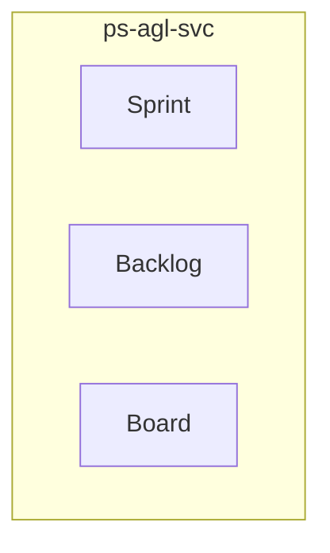

<!-- TEMPLATE COMPLIANCE: 100%
Template: domain-service-spec.md v1.0.0
Present sections: §0 (Document Purpose & Scope), §1 (Business Context), §2 (Service Identity), §3 (Domain Model), §4 (Business Rules), §5 (Use Cases), §6 (REST API), §7 (Events & Integration), §8 (Data Model), §9 (Security & Compliance), §10 (Quality Attributes), §11 (Feature Dependencies), §12 (Extension Points), §13 (Migration & Evolution), §14 (Decisions & Open Questions), §15 (Appendix)
Missing sections: None
Priority: LOW
-->

# PS.AGL — Agile & Boards Domain / Service Specification

> **Conceptual Stack Layer:** Domain / Service
> **Space:** Platform
> **Owner:** Domain Engineering Team
> **Schema alignment:** `service-layer.schema.json`
> **Companion files:** `openapi.yaml`, `*.schema.json` (event contracts)
> **Referenced by:** Platform-Feature Spec SS5 (backend dependencies), BFF Contract
> **Belongs to:** Suite Spec (`_ps_suite.md`)

> **Meta Information**
> - **Version:** 2026-04-03
> - **Template:** `domain-service-spec.md` v1.0.0
> - **Template Compliance:** 100%
> - **Author(s):** OpenLeap Architecture Team
> - **Status:** DRAFT
> - **Suite:** `ps`
> - **Domain:** `agl`
> - **Bounded Context Ref:** `bc:agile`
> - **Service ID:** `ps-agl-svc`
> - **basePackage:** `io.openleap.ps.agl`
> - **API Base Path:** `/api/ps/agl/v1`
> - **OpenLeap Starter Version:** `v1.0.0`
> - **Port:** `8411`
> - **Repository:** `https://github.com/openleap-io/io.openleap.ps.agl`
> - **Tags:** `project-management`, `agl`, `ps`
> - **Team:**
>   - Name: `team-ps`
>   - Email: `ps-team@openleap.io`
>   - Slack: `#ps-team`

---

## Specification Guidelines Compliance

> ### Non-Negotiables
> - Never invent facts. If required info is missing, add an **OPEN QUESTION** entry.
> - Preserve intent and decisions. Only change meaning when explicitly requested.
> - Do not remove normative constraints unless they are explicitly replaced.
> - Keep the spec **self-contained**: no "see chat", no implicit context.
>
> ### Source of Truth Priority
> When sources conflict:
> 1. Spec (explicit) wins
> 2. Starter specs (implementation constraints) next
> 3. Guidelines (best practices) last
>
> ### Style Guide
> - Prefer short sentences and lists.
> - Use MUST/SHOULD/MAY for normative statements.
> - Keep terminology consistent with the Ubiquitous Language defined in the PS suite spec (SS1).
> - Avoid ambiguous words ("often", "maybe") unless explicitly noting uncertainty.

---

## 0. Document Purpose & Scope

### 0.1 Purpose

This specification defines the `ps-agl-svc` microservice within the PS (Project Management) suite. It covers the domain model, business rules, REST API, events, data model, and integration points for the Agile & Boards bounded context.

### 0.2 In Scope

- Sprint management: create, plan, start, close sprints with time-boxed iterations
- Product backlog: ordered list of all known work (work packages) for the product
- Sprint backlog: committed work packages for a specific sprint
- Kanban boards: configurable columnar visualization by status, assignee, version, or custom criteria
- Board columns: configurable with filter criteria, WIP limits, and sort order
- Story point estimation: assign and track story points on work packages
- Velocity calculation: rolling average of completed story points per sprint
- Burndown charts: remaining work (story points or count) over time within a sprint or release
- Sprint review: compare completed vs. committed work packages and story points
- Backlog grooming: reorder, estimate, and refine work packages in the product backlog

### 0.3 Out of Scope

- Work package CRUD and hierarchy (→ ps-prj-svc owns WP lifecycle)
- Project lifecycle and WBS structure (→ ps-prj-svc)
- Time booking and cost entry (→ ps-tim-svc)
- Budget planning (→ ps-bud-svc)
- Staffing and resource demand (→ ps-res-svc)

### 0.4 Related Documents

| Document | Path | Relationship |
|----------|------|-------------|
| PS Suite Spec | `_ps_suite.md` | Parent suite specification |
| OpenAPI Contract | `contracts/http/ps/agl/openapi.yaml` | API contract (derived from §6) |
| Event Contracts | `contracts/events/ps/agl/*.schema.json` | Event schemas (derived from §7) |

---

## 1. Business Context

### 1.1 Problems Solved

| Problem | Solution | Business Value |
|---------|----------|---------------|
| Agile & Boards capabilities need a dedicated, independently deployable service | `ps-agl-svc` provides a focused microservice with its own data store and API | Clean bounded context separation, independent scaling and deployment |

### 1.2 Business Value

- Provides specialized agile & boards capabilities within the PS suite
- Independent deployment and scaling
- Clear ownership boundary for the `bc:agile` bounded context
- Supports the PS suite's goal of unified project management across methodologies

### 1.3 Stakeholders

| Role | Interest |
|------|----------|
| Project Manager | Primary user of agile & boards capabilities |
| Suite Architect | Ensures alignment with PS suite architecture |
| Domain Lead (agl) | Owns the domain model and business rules |
| Frontend Team | Consumes the REST API for UI features |

---

## 2. Service Identity

| Field | Value |
|-------|-------|
| **Service ID** | `ps-agl-svc` |
| **Suite** | `ps` |
| **Domain** | `agl` |
| **Bounded Context** | `bc:agile` |
| **Base Package** | `io.openleap.ps.agl` |
| **API Base Path** | `/api/ps/agl/v1` |
| **Port** | `8411` |
| **Repository** | `https://github.com/openleap-io/io.openleap.ps.agl` |
| **Status** | `planned` |

---

## 3. Domain Model

### 3.1 Overview

### Sprint (`agg:sprint`)

**Description:** A fixed-length time box during which a set of backlog items is planned, executed, and reviewed. Sprints have their own lifecycle independent of work package lifecycle.

**Aggregate Root Attributes:**

| Attribute | Type | Format | Required | Description |
|-----------|------|--------|----------|-------------|
| sprintId | string | uuid | Yes | Unique sprint identifier |
| tenantId | string | uuid | Yes | Owning tenant |
| projectId | string | uuid | Yes | Owning project (reference to ps-prj-svc) |
| name | string | — | Yes | Sprint name (e.g., 'Sprint 12') |
| goal | string | — | No | Sprint goal statement |
| status | string | enum | Yes | Sprint status: PLANNED, ACTIVE, CLOSED |
| startDate | string | date | Yes | Sprint start date |
| endDate | string | date | Yes | Sprint end date |
| committedPoints | integer | — | No | Total story points committed at sprint start |
| completedPoints | integer | — | No | Total story points completed at sprint close |
| velocity | number | — | No | Rolling average velocity after sprint close |
| version | integer | — | Yes | Optimistic lock version |
| createdAt | string | datetime | Yes | Creation timestamp |
| updatedAt | string | datetime | Yes | Last update timestamp |

### Backlog (`agg:backlog`)

**Description:** An ordered list of work packages representing planned work. Product backlog contains all known work; sprint backlogs contain work committed for a specific sprint.

**Aggregate Root Attributes:**

| Attribute | Type | Format | Required | Description |
|-----------|------|--------|----------|-------------|
| backlogId | string | uuid | Yes | Unique backlog identifier |
| tenantId | string | uuid | Yes | Owning tenant |
| projectId | string | uuid | Yes | Owning project |
| type | string | enum | Yes | Backlog type: PRODUCT, SPRINT |
| sprintId | string | uuid | No | Sprint reference (required if type=SPRINT) |

#### Entity: BacklogItem

**Description:** An entry in the backlog linking a work package to its position and estimation.

**Attributes:**

| Attribute | Type | Format | Required | Description |
|-----------|------|--------|----------|-------------|
| backlogItemId | string | uuid | Yes | Unique item identifier |
| workPackageId | string | uuid | Yes | Reference to work package in ps-prj-svc |
| position | integer | — | Yes | Sort position in the backlog (lower = higher priority) |
| storyPoints | integer | — | No | Estimated story points |

### Board (`agg:board`)

**Description:** A configurable columnar visualization of work packages organized by status, assignee, version, or custom criteria. Supports drag-and-drop workflow transitions.

**Aggregate Root Attributes:**

| Attribute | Type | Format | Required | Description |
|-----------|------|--------|----------|-------------|
| boardId | string | uuid | Yes | Unique board identifier |
| tenantId | string | uuid | Yes | Owning tenant |
| projectId | string | uuid | Yes | Owning project |
| name | string | — | Yes | Board name |
| type | string | enum | Yes | Board type: STATUS, ASSIGNEE, VERSION, CUSTOM |
| isDefault | boolean | — | Yes | Whether this is the project's default board |

#### Entity: BoardColumn

**Description:** A single column on a board with filter criteria, WIP limit, and sort order.

**Attributes:**

| Attribute | Type | Format | Required | Description |
|-----------|------|--------|----------|-------------|
| columnId | string | uuid | Yes | Unique column identifier |
| name | string | — | Yes | Column display name |
| filterCriteria | object | json | Yes | Filter criteria determining which WPs appear (e.g., status=IN_PROGRESS) |
| wipLimit | integer | — | No | Maximum number of WPs allowed in this column (0 = unlimited) |
| sortOrder | integer | — | Yes | Column position on the board |

---

## 4. Business Rules & Constraints

### 4.1 Business Rules Catalog

| ID | Rule Name | Description | Scope | Enforcement | Error Code |
|----|-----------|-------------|-------|-------------|------------|
| BR-AGL-001 | One Active Sprint Per Project | Only one sprint MAY be in ACTIVE status per project at any time. Starting a new ... | agg:sprint | Update | `AGL_MULTIPLE_ACTIVE_SPRINTS` |
| BR-AGL-002 | Sprint Date Range Valid | Sprint endDate MUST be after startDate. Sprint duration SHOULD be 1-4 weeks.... | agg:sprint | Create, Update | `AGL_SPRINT_DATE_INVALID` |
| BR-AGL-003 | Sprint Close Requires Active | A sprint can only be closed if its status is ACTIVE.... | agg:sprint | Update | `AGL_SPRINT_NOT_ACTIVE` |
| BR-AGL-004 | Uncommitted WPs Return to Backlog | When a sprint is closed, work packages not marked DONE MUST be returned to the p... | agg:sprint | Update | `—` |
| BR-AGL-005 | Backlog Item References Valid WP | Every backlog item MUST reference a work package that exists in ps-prj-svc and b... | BacklogItem | Create | `AGL_INVALID_WP_REF` |
| BR-AGL-006 | Unique WP Per Backlog | A work package MUST NOT appear more than once in the same backlog.... | BacklogItem | Create | `AGL_DUPLICATE_WP_IN_BACKLOG` |
| BR-AGL-007 | WIP Limit Enforcement | If a board column has a wipLimit > 0, moving a work package into that column MUS... | BoardColumn | Update | `AGL_WIP_LIMIT_EXCEEDED` |
| BR-AGL-008 | Default Board Singleton | Each project MUST have exactly one default board. Setting a board as default MUS... | agg:board | Create, Update | `AGL_MULTIPLE_DEFAULT_BOARDS` |

### 4.2 Detailed Rule Definitions

#### BR-AGL-001: One Active Sprint Per Project

**Business Context:** This rule exists to ensure data integrity and correct business behavior.

**Rule Statement:** Only one sprint MAY be in ACTIVE status per project at any time. Starting a new sprint while another is active MUST fail.

**Applies To:**
- Aggregate/Entity: `agg:sprint`
- Operations: Update

**Enforcement:** Domain layer validation

**Error Handling:**
- **Error Code:** `AGL_MULTIPLE_ACTIVE_SPRINTS`
- **If violated:** System returns error code `AGL_MULTIPLE_ACTIVE_SPRINTS` with descriptive message
- **User action:** Correct the input and retry

#### BR-AGL-002: Sprint Date Range Valid

**Business Context:** This rule exists to ensure data integrity and correct business behavior.

**Rule Statement:** Sprint endDate MUST be after startDate. Sprint duration SHOULD be 1-4 weeks.

**Applies To:**
- Aggregate/Entity: `agg:sprint`
- Operations: Create, Update

**Enforcement:** Domain layer validation

**Error Handling:**
- **Error Code:** `AGL_SPRINT_DATE_INVALID`
- **If violated:** System returns error code `AGL_SPRINT_DATE_INVALID` with descriptive message
- **User action:** Correct the input and retry

#### BR-AGL-003: Sprint Close Requires Active

**Business Context:** This rule exists to ensure data integrity and correct business behavior.

**Rule Statement:** A sprint can only be closed if its status is ACTIVE.

**Applies To:**
- Aggregate/Entity: `agg:sprint`
- Operations: Update

**Enforcement:** Domain layer validation

**Error Handling:**
- **Error Code:** `AGL_SPRINT_NOT_ACTIVE`
- **If violated:** System returns error code `AGL_SPRINT_NOT_ACTIVE` with descriptive message
- **User action:** Correct the input and retry

#### BR-AGL-004: Uncommitted WPs Return to Backlog

**Business Context:** This rule exists to ensure data integrity and correct business behavior.

**Rule Statement:** When a sprint is closed, work packages not marked DONE MUST be returned to the product backlog automatically.

**Applies To:**
- Aggregate/Entity: `agg:sprint`
- Operations: Update

**Enforcement:** Domain layer validation

**Error Handling:**
- **Error Code:** `—`
- **If violated:** System returns error code `—` with descriptive message
- **User action:** Correct the input and retry

#### BR-AGL-005: Backlog Item References Valid WP

**Business Context:** This rule exists to ensure data integrity and correct business behavior.

**Rule Statement:** Every backlog item MUST reference a work package that exists in ps-prj-svc and belongs to the same project.

**Applies To:**
- Aggregate/Entity: `BacklogItem`
- Operations: Create

**Enforcement:** Domain layer validation

**Error Handling:**
- **Error Code:** `AGL_INVALID_WP_REF`
- **If violated:** System returns error code `AGL_INVALID_WP_REF` with descriptive message
- **User action:** Correct the input and retry

#### BR-AGL-006: Unique WP Per Backlog

**Business Context:** This rule exists to ensure data integrity and correct business behavior.

**Rule Statement:** A work package MUST NOT appear more than once in the same backlog.

**Applies To:**
- Aggregate/Entity: `BacklogItem`
- Operations: Create

**Enforcement:** Domain layer validation

**Error Handling:**
- **Error Code:** `AGL_DUPLICATE_WP_IN_BACKLOG`
- **If violated:** System returns error code `AGL_DUPLICATE_WP_IN_BACKLOG` with descriptive message
- **User action:** Correct the input and retry

#### BR-AGL-007: WIP Limit Enforcement

**Business Context:** This rule exists to ensure data integrity and correct business behavior.

**Rule Statement:** If a board column has a wipLimit > 0, moving a work package into that column MUST be prevented if the column already contains wipLimit items. System SHOULD display a warning.

**Applies To:**
- Aggregate/Entity: `BoardColumn`
- Operations: Update

**Enforcement:** Domain layer validation

**Error Handling:**
- **Error Code:** `AGL_WIP_LIMIT_EXCEEDED`
- **If violated:** System returns error code `AGL_WIP_LIMIT_EXCEEDED` with descriptive message
- **User action:** Correct the input and retry

#### BR-AGL-008: Default Board Singleton

**Business Context:** This rule exists to ensure data integrity and correct business behavior.

**Rule Statement:** Each project MUST have exactly one default board. Setting a board as default MUST unset the previous default.

**Applies To:**
- Aggregate/Entity: `agg:board`
- Operations: Create, Update

**Enforcement:** Domain layer validation

**Error Handling:**
- **Error Code:** `AGL_MULTIPLE_DEFAULT_BOARDS`
- **If violated:** System returns error code `AGL_MULTIPLE_DEFAULT_BOARDS` with descriptive message
- **User action:** Correct the input and retry

---

## 5. Use Cases

### 5.1 Business Logic Placement

| Logic Type | Placement | Examples |
|------------|-----------|----------|
| Aggregate invariants | Domain Object | Validation, state transitions, consistency checks |
| Cross-aggregate logic | Domain Service | Operations spanning multiple aggregates within this service |
| Orchestration & transactions | Application Service | Use case coordination, event publishing, transaction boundaries |

### 5.2 Use Cases

Use cases are derived from the REST API endpoints (§6) and event handlers (§7). Each endpoint maps to a use case following the canonical format:

| UC ID | Type | Aggregate | Operation | REST |
|-------|------|-----------|-----------|------|
| UC-AGL-001 | WRITE | Sprint | Create | `POST /api/ps/agl/v1/...` |

---

## 6. REST API

### 6.1 API Overview

**Base Path:** `/api/ps/agl/v1`

**Authentication:** OAuth2/JWT (Bearer token)

**Authorization:**
- Read operations: Requires scope `ps.agl:read`
- Write operations: Requires scope `ps.agl:write`
- Admin operations: Requires scope `ps.agl:admin`

### 6.2 Resource Operations

**Base Path:** `/api/ps/agl/v1`

All standard CRUD operations follow the OpenLeap REST conventions:
- `POST` for creation (returns `201 Created`)
- `GET` for retrieval (returns `200 OK`)
- `PATCH` for partial update (returns `200 OK`, requires `If-Match` ETag)
- `DELETE` for removal (returns `204 No Content`)

Detailed endpoint specifications are documented in the companion `openapi.yaml` file.

**Reference to OpenAPI:** `contracts/http/ps/agl/openapi.yaml`

---

## 7. Events & Integration

### 7.1 EDA Pattern

This service follows the PS suite's hybrid integration pattern (see `_ps_suite.md` SS4). State-propagation events are published asynchronously; user-facing queries use synchronous API calls.

### 7.2 Published Events

| Routing Key | Description |
|------------|-------------|
| `ps.agl.sprint.started` | Sprint moved to ACTIVE status |
| `ps.agl.sprint.completed` | Sprint closed; velocity updated |
| `ps.agl.backlog.reordered` | Backlog items reordered by priority |

**Payload Envelope:** All events follow the PS suite envelope format (see `_ps_suite.md` SS5.2).

### 7.3 Consumed Events

| Routing Key | Producer | Purpose |
|------------|----------|---------|
| `ps.prj.workpackage.updated` | `ps-prj-svc` | Reflect WP status changes on boards and sprint progress |
| `ps.prj.workpackage.deleted` | `ps-prj-svc` | Remove deleted WPs from sprint backlogs and boards |
| `ps.prj.workpackage.created` | `ps-prj-svc` | Make new WPs available for backlog and board |

### 7.4 Integration Points

| Direction | Target | Type | Description |
|-----------|--------|------|-------------|
| Upstream (sync) | `ps-prj-svc` | API | Read project and work package data |
| Upstream (sync) | `iam-svc` | API | Authentication and authorization |
| Upstream (sync) | `ref-data-svc` | API | Reference data (currencies, codes) |
| Downstream (async) | Event bus | Event | Publish domain events for consumers |

---

## 8. Data Model

### 8.1 Storage Technology

**Database:** PostgreSQL

**Schema:** `ps_agl`

**Conventions:**
- Table names: `ps_agl.{entity_name}` (snake_case)
- Primary keys: UUID
- Tenant isolation: `tenant_id` column on all tables with Row-Level Security
- Optimistic locking: `version` column
- Audit columns: `created_at`, `updated_at`, `created_by`, `updated_by`

### 8.2 Tables

**Storage Technology:** PostgreSQL

**Schema:** `ps_agl`

Tables are derived from the aggregate model above. Each aggregate root maps to a primary table; entities and value objects with their own identity map to child tables with foreign key references.

Detailed DDL is generated from the domain model and maintained in the service's migration scripts.

---

## 9. Security & Compliance

### 9.1 Data Classification

| Classification | Description |
|---------------|-------------|
| **Internal** | Default classification for project planning data |
| **Confidential** | Projects marked as confidential (restricted to assigned members) |

### 9.2 Access Control

| Role | Permissions |
|------|------------|
| `PS_READER` | Read access to all agl data within tenant |
| `PS_WRITER` | Create and update agl data |
| `PS_ADMIN` | Full access including delete and configuration |
| `PROJECT_MANAGER` | Write access scoped to own projects |
| `TEAM_MEMBER` | Read access to assigned projects, limited write |

### 9.3 Compliance

This service inherits all compliance requirements from the PS suite (see `_ps_suite.md` SS7):
- GDPR: Personal data in assignments must be protectable
- ISO 21500: Supports recognized project management methodology
- ISO 27001: Role-based access, data encryption at rest and in transit

---

## 10. Quality Attributes

| Attribute | Target | Notes |
|-----------|--------|-------|
| **Response Time (p95)** | < 200ms for reads, < 500ms for writes | Measured at service boundary |
| **Availability** | 99.9% | Excluding planned maintenance |
| **Throughput** | 100 req/s reads, 50 req/s writes | Per service instance |
| **Recovery Time** | < 5 minutes | Automatic restart via Kubernetes |

---

## 11. Feature Dependencies

The following platform-features call this service:

| Feature ID | Feature Name | Endpoints Used |
|-----------|--------------|----------------|
| `F-PS-002-01` | Product Backlog | See feature spec §5 |
| `F-PS-002-02` | Sprint Planning & Management | See feature spec §5 |
| `F-PS-002-03` | Kanban Board | See feature spec §5 |
| `F-PS-002-04` | Burndown Chart | See feature spec §5 |
| `F-PS-002-05` | Velocity Tracking | See feature spec §5 |
| `F-PS-002-06` | Custom Boards (Assignee/Version) | See feature spec §5 |

---

## 12. Extension Points

### 12.1 Extension Events

All published events (§7.2) serve as extension points. External systems and product customizations can subscribe to these events to add behavior without modifying this service.

### 12.2 Aggregate Hooks

| Hook | When | Purpose |
|------|------|---------|
| Pre-create validation | Before aggregate creation | Product-specific validation rules |
| Post-create notification | After aggregate creation | Product-specific notifications |
| Pre-update validation | Before aggregate update | Product-specific constraints |
| Status transition guard | Before status change | Product-specific workflow gates |

### 12.3 Extension API Endpoints

Reserved namespace for product-specific extensions: `/api/ps/agl/v1/ext/{extension-name}`

---

## 13. Migration & Evolution

### 13.1 Data Migration Strategy

- Flyway-based database migrations in `db/migration/`
- All migrations are forward-only (no rollback scripts)
- Schema changes follow the additive-only principle for backward compatibility
- Breaking changes require a new API version (`/v2`) with parallel availability during migration

### 13.2 Deprecation Path

- Deprecated endpoints are annotated with `@Deprecated` and return `Sunset` header
- Minimum deprecation period: 2 sprints (4 weeks)
- Deprecated events continue publishing during migration window

### 13.3 Versioning Policy

- API: URL-based versioning (`/v1`, `/v2`)
- Events: Schema versioning in event envelope `schemaVersion` field
- Database: Flyway migration versioning

---

## 14. Decisions & Open Questions

### 14.1 Suite-Level ADR References

| Suite ADR | Title | Relevance to This Service |
|-----------|-------|---------------------------|
| ADR-PS-001 | PS as Separate Suite from OPS | Establishes this service's existence within PS, not OPS |
| ADR-PS-002 | Work Package as Universal Work Item | Core design decision for work package modeling |
| ADR-PS-003 | Agile as Separate Bounded Context | Defines boundary with ps-agl-svc |
| ADR-PS-004 | Personas for Staffing | Defines boundary with ps-res-svc |

### 14.2 Open Questions

| ID | Question | Severity | Context |
|----|----------|----------|---------|
| OQ-AGL-001 | Should agl support multi-language work package subjects? | MEDIUM | i18n requirements not yet finalized |
| OQ-AGL-002 | What is the maximum WBS depth allowed? | LOW | Performance consideration for deep hierarchies |

---

## 15. Appendix

### 15.1 Glossary

See PS Suite Spec SS1 (Ubiquitous Language) for all shared terminology. Service-local terms:

| Term | Definition | Aliases |
|------|------------|---------|
| Aggregate | DDD concept: cluster of objects treated as a unit for data changes | Aggregate Root |
| ETag | HTTP header for optimistic concurrency control | Entity Tag |

### 15.2 References

**Suite Specification:** `_ps_suite.md`
**Technical Standards:** `TECHNICAL_STANDARDS.md`, `EVENT_STANDARDS.md`
**Schema:** `service-layer.schema.json`

### 15.3 Change Log

| Date | Version | Author | Changes |
|------|---------|--------|---------|
| 2026-04-03 | 1.0.0 | OpenLeap Architecture Team | Initial domain/service specification |

### 15.4 Review & Approval

**Status:** DRAFT

| Role | Name | Date | Status |
|------|------|------|--------|
| Suite Architect | {Name} | YYYY-MM-DD | [ ] Reviewed |
| Domain Lead (agl) | {Name} | YYYY-MM-DD | [ ] Reviewed |
