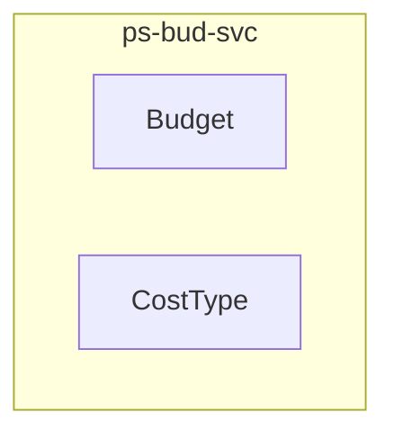

<!-- TEMPLATE COMPLIANCE: 100%
Template: domain-service-spec.md v1.0.0
Present sections: §0 (Document Purpose & Scope), §1 (Business Context), §2 (Service Identity), §3 (Domain Model), §4 (Business Rules), §5 (Use Cases), §6 (REST API), §7 (Events & Integration), §8 (Data Model), §9 (Security & Compliance), §10 (Quality Attributes), §11 (Feature Dependencies), §12 (Extension Points), §13 (Migration & Evolution), §14 (Decisions & Open Questions), §15 (Appendix)
Missing sections: None
Priority: LOW
-->

# PS.BUD — Budget & Cost Control Domain / Service Specification

> **Conceptual Stack Layer:** Domain / Service
> **Space:** Platform
> **Owner:** Domain Engineering Team
> **Schema alignment:** `service-layer.schema.json`
> **Companion files:** `openapi.yaml`, `*.schema.json` (event contracts)
> **Referenced by:** Platform-Feature Spec SS5 (backend dependencies), BFF Contract
> **Belongs to:** Suite Spec (`_ps_suite.md`)

> **Meta Information**
> - **Version:** 2026-04-03
> - **Template:** `domain-service-spec.md` v1.0.0
> - **Template Compliance:** 100%
> - **Author(s):** OpenLeap Architecture Team
> - **Status:** DRAFT
> - **Suite:** `ps`
> - **Domain:** `bud`
> - **Bounded Context Ref:** `bc:budget`
> - **Service ID:** `ps-bud-svc`
> - **basePackage:** `io.openleap.ps.bud`
> - **API Base Path:** `/api/ps/bud/v1`
> - **OpenLeap Starter Version:** `v1.0.0`
> - **Port:** `8412`
> - **Repository:** `https://github.com/openleap-io/io.openleap.ps.bud`
> - **Tags:** `project-management`, `bud`, `ps`
> - **Team:**
>   - Name: `team-ps`
>   - Email: `ps-team@openleap.io`
>   - Slack: `#ps-team`

---

## Specification Guidelines Compliance

> ### Non-Negotiables
> - Never invent facts. If required info is missing, add an **OPEN QUESTION** entry.
> - Preserve intent and decisions. Only change meaning when explicitly requested.
> - Do not remove normative constraints unless they are explicitly replaced.
> - Keep the spec **self-contained**: no "see chat", no implicit context.
>
> ### Source of Truth Priority
> When sources conflict:
> 1. Spec (explicit) wins
> 2. Starter specs (implementation constraints) next
> 3. Guidelines (best practices) last
>
> ### Style Guide
> - Prefer short sentences and lists.
> - Use MUST/SHOULD/MAY for normative statements.
> - Keep terminology consistent with the Ubiquitous Language defined in the PS suite spec (SS1).
> - Avoid ambiguous words ("often", "maybe") unless explicitly noting uncertainty.

---

## 0. Document Purpose & Scope

### 0.1 Purpose

This specification defines the `ps-bud-svc` microservice within the PS (Project Management) suite. It covers the domain model, business rules, REST API, events, data model, and integration points for the Budget & Cost Control bounded context.

### 0.2 In Scope

- Budget creation and management: define financial plans per project with planned amounts
- Planned labor costs: estimated hours × hourly rate for personas or named resources
- Planned unit costs: estimated quantity × unit rate for cost types (materials, travel, etc.)
- Cost type catalog: define and manage cost classifications with units and rate schedules
- Actual cost accumulation: receive and aggregate actual costs from time bookings and cost entries
- Budget vs. actuals comparison: planned vs. actual cost dashboards per budget, WP, and project
- Earned Value Management (EVM): calculate PV, EV, AC, SV, CV, SPI, CPI at budget and project level
- EVM snapshots: point-in-time EVM calculations stored for trend analysis
- Cost forecasting: estimate-at-completion (EAC) and estimate-to-complete (ETC) projections
- Budget alerts: publish events when budgets approach or exceed thresholds

### 0.3 Out of Scope

- Time booking entry (→ ps-tim-svc records the hours)
- Cost entry recording (→ ps-tim-svc records the unit costs)
- Project accounting and cost center postings (→ FI/CO suite)
- Invoice generation (→ FI suite)
- Currency conversion logic (→ ref-data-svc provides exchange rates)

### 0.4 Related Documents

| Document | Path | Relationship |
|----------|------|-------------|
| PS Suite Spec | `_ps_suite.md` | Parent suite specification |
| OpenAPI Contract | `contracts/http/ps/bud/openapi.yaml` | API contract (derived from §6) |
| Event Contracts | `contracts/events/ps/bud/*.schema.json` | Event schemas (derived from §7) |

---

## 1. Business Context

### 1.1 Problems Solved

| Problem | Solution | Business Value |
|---------|----------|---------------|
| Budget & Cost Control capabilities need a dedicated, independently deployable service | `ps-bud-svc` provides a focused microservice with its own data store and API | Clean bounded context separation, independent scaling and deployment |

### 1.2 Business Value

- Provides specialized budget & cost control capabilities within the PS suite
- Independent deployment and scaling
- Clear ownership boundary for the `bc:budget` bounded context
- Supports the PS suite's goal of unified project management across methodologies

### 1.3 Stakeholders

| Role | Interest |
|------|----------|
| Project Manager | Primary user of budget & cost control capabilities |
| Suite Architect | Ensures alignment with PS suite architecture |
| Domain Lead (bud) | Owns the domain model and business rules |
| Frontend Team | Consumes the REST API for UI features |

---

## 2. Service Identity

| Field | Value |
|-------|-------|
| **Service ID** | `ps-bud-svc` |
| **Suite** | `ps` |
| **Domain** | `bud` |
| **Bounded Context** | `bc:budget` |
| **Base Package** | `io.openleap.ps.bud` |
| **API Base Path** | `/api/ps/bud/v1` |
| **Port** | `8412` |
| **Repository** | `https://github.com/openleap-io/io.openleap.ps.bud` |
| **Status** | `planned` |

---

## 3. Domain Model

### 3.1 Overview

### Budget (`agg:budget`)

**Description:** A financial plan tied to a project, containing planned labor and unit cost lines. Tracks actual costs accumulated from time bookings and cost entries.

**Aggregate Root Attributes:**

| Attribute | Type | Format | Required | Description |
|-----------|------|--------|----------|-------------|
| budgetId | string | uuid | Yes | Unique budget identifier |
| tenantId | string | uuid | Yes | Owning tenant |
| projectId | string | uuid | Yes | Owning project (reference to ps-prj-svc) |
| name | string | — | Yes | Budget name |
| currency | string | iso-4217 | Yes | Budget currency (e.g., EUR, USD) |
| totalPlanned | number | — | Yes | Total planned amount (sum of all planned lines) |
| totalActual | number | — | No | Total actual amount (sum of all actual costs) |
| status | string | enum | Yes | Budget status: DRAFT, ACTIVE, CLOSED, OVERSPENT |
| overspendThreshold | number | — | No | Percentage threshold for overspend alert (default 90%) |
| version | integer | — | Yes | Optimistic lock version |
| createdAt | string | datetime | Yes | Creation timestamp |
| updatedAt | string | datetime | Yes | Last update timestamp |

#### Entity: PlannedLaborCost

**Description:** An estimated labor cost line: hours × rate for a persona or role.

**Attributes:**

| Attribute | Type | Format | Required | Description |
|-----------|------|--------|----------|-------------|
| lineId | string | uuid | Yes | Unique line identifier |
| workPackageId | string | uuid | No | Optional WP assignment |
| personaId | string | uuid | No | Reference to persona in ps-res-svc |
| role | string | — | Yes | Role description (e.g., 'Senior Developer') |
| plannedHours | number | — | Yes | Planned hours |
| hourlyRate | number | — | Yes | Hourly rate in budget currency |
| plannedAmount | number | — | Yes | Calculated: plannedHours × hourlyRate |
| actualHours | number | — | No | Actual hours accumulated |
| actualAmount | number | — | No | Actual cost accumulated |

#### Entity: PlannedUnitCost

**Description:** An estimated unit cost line: quantity × rate for a cost type.

**Attributes:**

| Attribute | Type | Format | Required | Description |
|-----------|------|--------|----------|-------------|
| lineId | string | uuid | Yes | Unique line identifier |
| workPackageId | string | uuid | No | Optional WP assignment |
| costTypeId | string | uuid | Yes | Reference to CostType |
| plannedQuantity | number | — | Yes | Planned quantity |
| unitRate | number | — | Yes | Rate per unit in budget currency |
| plannedAmount | number | — | Yes | Calculated: plannedQuantity × unitRate |
| actualQuantity | number | — | No | Actual quantity accumulated |
| actualAmount | number | — | No | Actual cost accumulated |

#### Entity: EarnedValueSnapshot

**Description:** A point-in-time EVM calculation storing PV, EV, AC, and derived metrics.

**Attributes:**

| Attribute | Type | Format | Required | Description |
|-----------|------|--------|----------|-------------|
| snapshotId | string | uuid | Yes | Unique snapshot identifier |
| snapshotDate | string | date | Yes | Date of the snapshot |
| plannedValue | number | — | Yes | PV: budgeted cost of work scheduled |
| earnedValue | number | — | Yes | EV: budgeted cost of work performed |
| actualCost | number | — | Yes | AC: actual cost of work performed |
| scheduleVariance | number | — | Yes | SV = EV - PV |
| costVariance | number | — | Yes | CV = EV - AC |
| schedulePerformanceIndex | number | — | Yes | SPI = EV / PV |
| costPerformanceIndex | number | — | Yes | CPI = EV / AC |
| estimateAtCompletion | number | — | No | EAC forecast |
| estimateToComplete | number | — | No | ETC forecast |

### CostType (`agg:cost-type`)

**Description:** A classification of costs with a unit name and effective-dated rate schedule. Shared with ps-tim-svc for consistent cost recording.

**Aggregate Root Attributes:**

| Attribute | Type | Format | Required | Description |
|-----------|------|--------|----------|-------------|
| costTypeId | string | uuid | Yes | Unique cost type identifier |
| tenantId | string | uuid | Yes | Owning tenant |
| code | string | — | Yes | Short code (e.g., 'TRAVEL', 'HW', 'CONSULT') |
| name | string | — | Yes | Display name |
| description | string | — | No | Description |
| unit | string | — | Yes | Unit of measure (e.g., 'km', 'piece', 'hour', 'license') |
| isActive | boolean | — | Yes | Whether this cost type is currently usable |

#### Entity: RateScheduleEntry

**Description:** An effective-dated rate for this cost type.

**Attributes:**

| Attribute | Type | Format | Required | Description |
|-----------|------|--------|----------|-------------|
| entryId | string | uuid | Yes | Unique entry identifier |
| effectiveFrom | string | date | Yes | Rate effective from this date |
| effectiveTo | string | date | No | Rate effective until this date (null = open-ended) |
| rate | number | — | Yes | Rate per unit in the reference currency |
| currency | string | iso-4217 | Yes | Currency of the rate |

---

## 4. Business Rules & Constraints

### 4.1 Business Rules Catalog

| ID | Rule Name | Description | Scope | Enforcement | Error Code |
|----|-----------|-------------|-------|-------------|------------|
| BR-BUD-001 | Budget Requires Active Project | A budget can only be created for a project in ACTIVE status.... | agg:budget | Create | `BUD_PROJECT_NOT_ACTIVE` |
| BR-BUD-002 | One Active Budget Per Project | Only one budget MAY be in ACTIVE status per project. Creating a new active budge... | agg:budget | Create, Update | `BUD_MULTIPLE_ACTIVE` |
| BR-BUD-003 | Planned Amount Consistency | totalPlanned MUST equal the sum of all PlannedLaborCost.plannedAmount and Planne... | agg:budget | Update | `BUD_TOTAL_MISMATCH` |
| BR-BUD-004 | Overspend Alert Threshold | When totalActual exceeds overspendThreshold percent of totalPlanned, a ps.bud.bu... | agg:budget | — | `—` |
| BR-BUD-005 | EVM Requires Baseline | Earned Value calculation MUST reference a project baseline from ps-prj-svc. With... | EarnedValueSnapshot | Create | `BUD_NO_BASELINE_FOR_EVM` |
| BR-BUD-006 | Unique Cost Type Code Per Tenant | Cost type code MUST be unique within a tenant.... | agg:cost-type | Create, Update | `BUD_COSTTYPE_DUPLICATE` |
| BR-BUD-007 | No Overlapping Rate Periods | Rate schedule entries for the same cost type MUST NOT have overlapping effective... | RateScheduleEntry | Create, Update | `BUD_RATE_OVERLAP` |

### 4.2 Detailed Rule Definitions

#### BR-BUD-001: Budget Requires Active Project

**Business Context:** This rule exists to ensure data integrity and correct business behavior.

**Rule Statement:** A budget can only be created for a project in ACTIVE status.

**Applies To:**
- Aggregate/Entity: `agg:budget`
- Operations: Create

**Enforcement:** Domain layer validation

**Error Handling:**
- **Error Code:** `BUD_PROJECT_NOT_ACTIVE`
- **If violated:** System returns error code `BUD_PROJECT_NOT_ACTIVE` with descriptive message
- **User action:** Correct the input and retry

#### BR-BUD-002: One Active Budget Per Project

**Business Context:** This rule exists to ensure data integrity and correct business behavior.

**Rule Statement:** Only one budget MAY be in ACTIVE status per project. Creating a new active budget requires closing the previous one.

**Applies To:**
- Aggregate/Entity: `agg:budget`
- Operations: Create, Update

**Enforcement:** Domain layer validation

**Error Handling:**
- **Error Code:** `BUD_MULTIPLE_ACTIVE`
- **If violated:** System returns error code `BUD_MULTIPLE_ACTIVE` with descriptive message
- **User action:** Correct the input and retry

#### BR-BUD-003: Planned Amount Consistency

**Business Context:** This rule exists to ensure data integrity and correct business behavior.

**Rule Statement:** totalPlanned MUST equal the sum of all PlannedLaborCost.plannedAmount and PlannedUnitCost.plannedAmount.

**Applies To:**
- Aggregate/Entity: `agg:budget`
- Operations: Update

**Enforcement:** Domain layer validation

**Error Handling:**
- **Error Code:** `BUD_TOTAL_MISMATCH`
- **If violated:** System returns error code `BUD_TOTAL_MISMATCH` with descriptive message
- **User action:** Correct the input and retry

#### BR-BUD-004: Overspend Alert Threshold

**Business Context:** This rule exists to ensure data integrity and correct business behavior.

**Rule Statement:** When totalActual exceeds overspendThreshold percent of totalPlanned, a ps.bud.budget.overspent event MUST be published.

**Applies To:**
- Aggregate/Entity: `agg:budget`
- Operations: —

**Enforcement:** Domain layer validation

**Error Handling:**
- **Error Code:** `—`
- **If violated:** System returns error code `—` with descriptive message
- **User action:** Correct the input and retry

#### BR-BUD-005: EVM Requires Baseline

**Business Context:** This rule exists to ensure data integrity and correct business behavior.

**Rule Statement:** Earned Value calculation MUST reference a project baseline from ps-prj-svc. Without a baseline, PV cannot be computed.

**Applies To:**
- Aggregate/Entity: `EarnedValueSnapshot`
- Operations: Create

**Enforcement:** Domain layer validation

**Error Handling:**
- **Error Code:** `BUD_NO_BASELINE_FOR_EVM`
- **If violated:** System returns error code `BUD_NO_BASELINE_FOR_EVM` with descriptive message
- **User action:** Correct the input and retry

#### BR-BUD-006: Unique Cost Type Code Per Tenant

**Business Context:** This rule exists to ensure data integrity and correct business behavior.

**Rule Statement:** Cost type code MUST be unique within a tenant.

**Applies To:**
- Aggregate/Entity: `agg:cost-type`
- Operations: Create, Update

**Enforcement:** Domain layer validation

**Error Handling:**
- **Error Code:** `BUD_COSTTYPE_DUPLICATE`
- **If violated:** System returns error code `BUD_COSTTYPE_DUPLICATE` with descriptive message
- **User action:** Correct the input and retry

#### BR-BUD-007: No Overlapping Rate Periods

**Business Context:** This rule exists to ensure data integrity and correct business behavior.

**Rule Statement:** Rate schedule entries for the same cost type MUST NOT have overlapping effective date ranges.

**Applies To:**
- Aggregate/Entity: `RateScheduleEntry`
- Operations: Create, Update

**Enforcement:** Domain layer validation

**Error Handling:**
- **Error Code:** `BUD_RATE_OVERLAP`
- **If violated:** System returns error code `BUD_RATE_OVERLAP` with descriptive message
- **User action:** Correct the input and retry

---

## 5. Use Cases

### 5.1 Business Logic Placement

| Logic Type | Placement | Examples |
|------------|-----------|----------|
| Aggregate invariants | Domain Object | Validation, state transitions, consistency checks |
| Cross-aggregate logic | Domain Service | Operations spanning multiple aggregates within this service |
| Orchestration & transactions | Application Service | Use case coordination, event publishing, transaction boundaries |

### 5.2 Use Cases

Use cases are derived from the REST API endpoints (§6) and event handlers (§7). Each endpoint maps to a use case following the canonical format:

| UC ID | Type | Aggregate | Operation | REST |
|-------|------|-----------|-----------|------|
| UC-BUD-001 | WRITE | Budget | Create | `POST /api/ps/bud/v1/...` |

---

## 6. REST API

### 6.1 API Overview

**Base Path:** `/api/ps/bud/v1`

**Authentication:** OAuth2/JWT (Bearer token)

**Authorization:**
- Read operations: Requires scope `ps.bud:read`
- Write operations: Requires scope `ps.bud:write`
- Admin operations: Requires scope `ps.bud:admin`

### 6.2 Resource Operations

**Base Path:** `/api/ps/bud/v1`

All standard CRUD operations follow the OpenLeap REST conventions:
- `POST` for creation (returns `201 Created`)
- `GET` for retrieval (returns `200 OK`)
- `PATCH` for partial update (returns `200 OK`, requires `If-Match` ETag)
- `DELETE` for removal (returns `204 No Content`)

Detailed endpoint specifications are documented in the companion `openapi.yaml` file.

**Reference to OpenAPI:** `contracts/http/ps/bud/openapi.yaml`

---

## 7. Events & Integration

### 7.1 EDA Pattern

This service follows the PS suite's hybrid integration pattern (see `_ps_suite.md` SS4). State-propagation events are published asynchronously; user-facing queries use synchronous API calls.

### 7.2 Published Events

| Routing Key | Description |
|------------|-------------|
| `ps.bud.budget.created` | New budget created |
| `ps.bud.budget.updated` | Budget plan modified |
| `ps.bud.budget.overspent` | Budget exceeded overspend threshold |
| `ps.bud.earnedvalue.updated` | New EVM snapshot calculated |
| `ps.bud.costtype.created` | New cost type defined |
| `ps.bud.costtype.updated` | Cost type modified |

**Payload Envelope:** All events follow the PS suite envelope format (see `_ps_suite.md` SS5.2).

### 7.3 Consumed Events

| Routing Key | Producer | Purpose |
|------------|----------|---------|
| `ps.tim.timebooking.approved` | `ps-tim-svc` | Accumulate actual labor cost from approved time bookings |
| `ps.tim.costentry.created` | `ps-tim-svc` | Accumulate actual unit cost from cost entries |
| `ps.prj.project.activated` | `ps-prj-svc` | Initialize default budget structure for activated project |
| `ps.prj.workpackage.updated` | `ps-prj-svc` | Update EVM progress data when WP completion changes |
| `ps.prj.baseline.created` | `ps-prj-svc` | Use baseline for PV calculation in EVM |

### 7.4 Integration Points

| Direction | Target | Type | Description |
|-----------|--------|------|-------------|
| Upstream (sync) | `ps-prj-svc` | API | Read project and work package data |
| Upstream (sync) | `iam-svc` | API | Authentication and authorization |
| Upstream (sync) | `ref-data-svc` | API | Reference data (currencies, codes) |
| Downstream (async) | Event bus | Event | Publish domain events for consumers |

---

## 8. Data Model

### 8.1 Storage Technology

**Database:** PostgreSQL

**Schema:** `ps_bud`

**Conventions:**
- Table names: `ps_bud.{entity_name}` (snake_case)
- Primary keys: UUID
- Tenant isolation: `tenant_id` column on all tables with Row-Level Security
- Optimistic locking: `version` column
- Audit columns: `created_at`, `updated_at`, `created_by`, `updated_by`

### 8.2 Tables

**Storage Technology:** PostgreSQL

**Schema:** `ps_bud`

Tables are derived from the aggregate model above. Each aggregate root maps to a primary table; entities and value objects with their own identity map to child tables with foreign key references.

Detailed DDL is generated from the domain model and maintained in the service's migration scripts.

---

## 9. Security & Compliance

### 9.1 Data Classification

| Classification | Description |
|---------------|-------------|
| **Internal** | Default classification for project planning data |
| **Confidential** | Projects marked as confidential (restricted to assigned members) |

### 9.2 Access Control

| Role | Permissions |
|------|------------|
| `PS_READER` | Read access to all bud data within tenant |
| `PS_WRITER` | Create and update bud data |
| `PS_ADMIN` | Full access including delete and configuration |
| `PROJECT_MANAGER` | Write access scoped to own projects |
| `TEAM_MEMBER` | Read access to assigned projects, limited write |

### 9.3 Compliance

This service inherits all compliance requirements from the PS suite (see `_ps_suite.md` SS7):
- GDPR: Personal data in assignments must be protectable
- ISO 21500: Supports recognized project management methodology
- ISO 27001: Role-based access, data encryption at rest and in transit

---

## 10. Quality Attributes

| Attribute | Target | Notes |
|-----------|--------|-------|
| **Response Time (p95)** | < 200ms for reads, < 500ms for writes | Measured at service boundary |
| **Availability** | 99.9% | Excluding planned maintenance |
| **Throughput** | 100 req/s reads, 50 req/s writes | Per service instance |
| **Recovery Time** | < 5 minutes | Automatic restart via Kubernetes |

---

## 11. Feature Dependencies

The following platform-features call this service:

| Feature ID | Feature Name | Endpoints Used |
|-----------|--------------|----------------|
| `F-PS-003-01` | Budget Planning | See feature spec §5 |
| `F-PS-003-02` | Cost Type Management | See feature spec §5 |
| `F-PS-003-03` | Budget vs. Actuals Dashboard | See feature spec §5 |
| `F-PS-003-04` | Earned Value Management | See feature spec §5 |
| `F-PS-003-05` | Cost Forecasting (EAC/ETC) | See feature spec §5 |

---

## 12. Extension Points

### 12.1 Extension Events

All published events (§7.2) serve as extension points. External systems and product customizations can subscribe to these events to add behavior without modifying this service.

### 12.2 Aggregate Hooks

| Hook | When | Purpose |
|------|------|---------|
| Pre-create validation | Before aggregate creation | Product-specific validation rules |
| Post-create notification | After aggregate creation | Product-specific notifications |
| Pre-update validation | Before aggregate update | Product-specific constraints |
| Status transition guard | Before status change | Product-specific workflow gates |

### 12.3 Extension API Endpoints

Reserved namespace for product-specific extensions: `/api/ps/bud/v1/ext/{extension-name}`

---

## 13. Migration & Evolution

### 13.1 Data Migration Strategy

- Flyway-based database migrations in `db/migration/`
- All migrations are forward-only (no rollback scripts)
- Schema changes follow the additive-only principle for backward compatibility
- Breaking changes require a new API version (`/v2`) with parallel availability during migration

### 13.2 Deprecation Path

- Deprecated endpoints are annotated with `@Deprecated` and return `Sunset` header
- Minimum deprecation period: 2 sprints (4 weeks)
- Deprecated events continue publishing during migration window

### 13.3 Versioning Policy

- API: URL-based versioning (`/v1`, `/v2`)
- Events: Schema versioning in event envelope `schemaVersion` field
- Database: Flyway migration versioning

---

## 14. Decisions & Open Questions

### 14.1 Suite-Level ADR References

| Suite ADR | Title | Relevance to This Service |
|-----------|-------|---------------------------|
| ADR-PS-001 | PS as Separate Suite from OPS | Establishes this service's existence within PS, not OPS |
| ADR-PS-002 | Work Package as Universal Work Item | Core design decision for work package modeling |
| ADR-PS-003 | Agile as Separate Bounded Context | Defines boundary with ps-agl-svc |
| ADR-PS-004 | Personas for Staffing | Defines boundary with ps-res-svc |

### 14.2 Open Questions

| ID | Question | Severity | Context |
|----|----------|----------|---------|
| OQ-BUD-001 | Should bud support multi-language work package subjects? | MEDIUM | i18n requirements not yet finalized |
| OQ-BUD-002 | What is the maximum WBS depth allowed? | LOW | Performance consideration for deep hierarchies |

---

## 15. Appendix

### 15.1 Glossary

See PS Suite Spec SS1 (Ubiquitous Language) for all shared terminology. Service-local terms:

| Term | Definition | Aliases |
|------|------------|---------|
| Aggregate | DDD concept: cluster of objects treated as a unit for data changes | Aggregate Root |
| ETag | HTTP header for optimistic concurrency control | Entity Tag |

### 15.2 References

**Suite Specification:** `_ps_suite.md`
**Technical Standards:** `TECHNICAL_STANDARDS.md`, `EVENT_STANDARDS.md`
**Schema:** `service-layer.schema.json`

### 15.3 Change Log

| Date | Version | Author | Changes |
|------|---------|--------|---------|
| 2026-04-03 | 1.0.0 | OpenLeap Architecture Team | Initial domain/service specification |

### 15.4 Review & Approval

**Status:** DRAFT

| Role | Name | Date | Status |
|------|------|------|--------|
| Suite Architect | {Name} | YYYY-MM-DD | [ ] Reviewed |
| Domain Lead (bud) | {Name} | YYYY-MM-DD | [ ] Reviewed |
