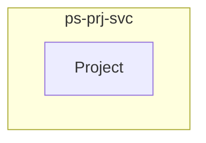

<!-- TEMPLATE COMPLIANCE: 100%
Template: domain-service-spec.md v1.0.0
Present sections: §0 (Document Purpose & Scope), §1 (Business Context), §2 (Service Identity), §3 (Domain Model), §4 (Business Rules), §5 (Use Cases), §6 (REST API), §7 (Events & Integration), §8 (Data Model), §9 (Security & Compliance), §10 (Quality Attributes), §11 (Feature Dependencies), §12 (Extension Points), §13 (Migration & Evolution), §14 (Decisions & Open Questions), §15 (Appendix)
Missing sections: None
Priority: LOW
-->

# PS.PRJ — Project Core Domain / Service Specification

> **Conceptual Stack Layer:** Domain / Service
> **Space:** Platform
> **Owner:** Domain Engineering Team
> **Schema alignment:** `service-layer.schema.json`
> **Companion files:** `openapi.yaml`, `*.schema.json` (event contracts)
> **Referenced by:** Platform-Feature Spec SS5 (backend dependencies), BFF Contract
> **Belongs to:** Suite Spec (`_ps_suite.md`)

> **Meta Information**
> - **Version:** 2026-04-03
> - **Template:** `domain-service-spec.md` v1.0.0
> - **Template Compliance:** 100%
> - **Author(s):** OpenLeap Architecture Team
> - **Status:** DRAFT
> - **Suite:** `ps`
> - **Domain:** `prj`
> - **Bounded Context Ref:** `bc:project-core`
> - **Service ID:** `ps-prj-svc`
> - **basePackage:** `io.openleap.ps.prj`
> - **API Base Path:** `/api/ps/prj/v1`
> - **OpenLeap Starter Version:** `v1.0.0`
> - **Port:** `8410`
> - **Repository:** `https://github.com/openleap-io/io.openleap.ps.prj`
> - **Tags:** `project-management`, `prj`, `ps`
> - **Team:**
>   - Name: `team-ps`
>   - Email: `ps-team@openleap.io`
>   - Slack: `#ps-team`

---

## Specification Guidelines Compliance

> ### Non-Negotiables
> - Never invent facts. If required info is missing, add an **OPEN QUESTION** entry.
> - Preserve intent and decisions. Only change meaning when explicitly requested.
> - Do not remove normative constraints unless they are explicitly replaced.
> - Keep the spec **self-contained**: no "see chat", no implicit context.
>
> ### Source of Truth Priority
> When sources conflict:
> 1. Spec (explicit) wins
> 2. Starter specs (implementation constraints) next
> 3. Guidelines (best practices) last
>
> ### Style Guide
> - Prefer short sentences and lists.
> - Use MUST/SHOULD/MAY for normative statements.
> - Keep terminology consistent with the Ubiquitous Language defined in the PS suite spec (SS1).
> - Avoid ambiguous words ("often", "maybe") unless explicitly noting uncertainty.

---

## 0. Document Purpose & Scope

### 0.1 Purpose

This specification defines the `ps-prj-svc` microservice within the PS (Project Management) suite. It covers the domain model, business rules, REST API, events, data model, and integration points for the Project Core bounded context.

### 0.2 In Scope

- Project lifecycle management: creation, planning, execution tracking, closure, archival
- Work Breakdown Structure (WBS): hierarchical decomposition into phases, work packages, activities
- Work Package CRUD: create, read, update, delete, move, copy work packages in hierarchies
- Scheduling: Gantt chart generation, forward/backward pass scheduling, critical path calculation
- Dependency management: finish-to-start, start-to-start, finish-to-finish, start-to-finish relations
- Milestone tracking: zero-duration markers with planned and actual dates
- Baseline management: snapshot project plan at a point in time for later comparison
- Project templates: reusable project structures with predefined WBS, milestones, and configuration
- Auto-scheduling: recalculate dates when dependencies or durations change
- Progress tracking: work package status updates, percentage complete, earned value input

### 0.3 Out of Scope

- Agile ceremonies, sprints, backlogs, boards (→ ps-agl-svc)
- Budget planning and cost tracking (→ ps-bud-svc)
- Time booking and cost entry (→ ps-tim-svc)
- Staffing and resource demand (→ ps-res-svc)
- Portfolio governance and gate reviews (→ ps-prt-svc)
- Operational work order execution (→ ops-svc-svc)
- Resource master data (→ ops-res-svc)

### 0.4 Related Documents

| Document | Path | Relationship |
|----------|------|-------------|
| PS Suite Spec | `_ps_suite.md` | Parent suite specification |
| OpenAPI Contract | `contracts/http/ps/prj/openapi.yaml` | API contract (derived from §6) |
| Event Contracts | `contracts/events/ps/prj/*.schema.json` | Event schemas (derived from §7) |

---

## 1. Business Context

### 1.1 Problems Solved

| Problem | Solution | Business Value |
|---------|----------|---------------|
| Project Core capabilities need a dedicated, independently deployable service | `ps-prj-svc` provides a focused microservice with its own data store and API | Clean bounded context separation, independent scaling and deployment |

### 1.2 Business Value

- Provides specialized project core capabilities within the PS suite
- Independent deployment and scaling
- Clear ownership boundary for the `bc:project-core` bounded context
- Supports the PS suite's goal of unified project management across methodologies

### 1.3 Stakeholders

| Role | Interest |
|------|----------|
| Project Manager | Primary user of project core capabilities |
| Suite Architect | Ensures alignment with PS suite architecture |
| Domain Lead (prj) | Owns the domain model and business rules |
| Frontend Team | Consumes the REST API for UI features |

---

## 2. Service Identity

| Field | Value |
|-------|-------|
| **Service ID** | `ps-prj-svc` |
| **Suite** | `ps` |
| **Domain** | `prj` |
| **Bounded Context** | `bc:project-core` |
| **Base Package** | `io.openleap.ps.prj` |
| **API Base Path** | `/api/ps/prj/v1` |
| **Port** | `8410` |
| **Repository** | `https://github.com/openleap-io/io.openleap.ps.prj` |
| **Status** | `planned` |

---

## 3. Domain Model

### 3.1 Overview

### Project (`agg:project`)

**Description:** Top-level container for all planning artifacts. Manages project lifecycle, metadata, configuration, and serves as the entry point for WBS, schedule, and baseline operations.

**Aggregate Root Attributes:**

| Attribute | Type | Format | Required | Description |
|-----------|------|--------|----------|-------------|
| projectId | string | uuid | Yes | Unique project identifier |
| tenantId | string | uuid | Yes | Owning tenant |
| code | string | — | Yes | Human-readable project code, unique per tenant |
| name | string | — | Yes | Project name, min 1 char, max 255 chars |
| description | string | — | No | Project description, max 4000 chars |
| status | string | enum | Yes | Project lifecycle status |
| projectType | string | — | No | Classification (e.g., internal, customer, R&D) |
| priority | string | enum | No | Priority: LOW, MEDIUM, HIGH, CRITICAL |
| customerId | string | uuid | No | Reference to BP party (customer/sponsor) |
| managerId | string | uuid | No | IAM user ID of the project manager |
| plannedStart | string | date | No | Planned start date |
| plannedEnd | string | date | No | Planned end date |
| actualStart | string | date | No | Actual start date |
| actualEnd | string | date | No | Actual end date |
| calendarId | string | uuid | No | Working calendar reference (from cal-svc) |
| lifecycleId | string | uuid | No | Lifecycle template reference (from ps-prt-svc) |
| templateId | string | uuid | No | Source template if created from template |
| version | integer | — | Yes | Optimistic lock version |
| createdAt | string | datetime | Yes | Creation timestamp |
| updatedAt | string | datetime | Yes | Last update timestamp |
| createdBy | string | uuid | Yes | IAM user ID of creator |
| updatedBy | string | uuid | Yes | IAM user ID of last updater |

#### Entity: WorkPackage

**Description:** Universal work item forming hierarchies. Represents phases, tasks, features, bugs, user stories, milestones, or any plannable unit of work.

**Attributes:**

| Attribute | Type | Format | Required | Description |
|-----------|------|--------|----------|-------------|
| workPackageId | string | uuid | Yes | Unique work package identifier |
| projectId | string | uuid | Yes | Owning project |
| parentId | string | uuid | No | Parent work package ID (null for root) |
| code | string | — | Yes | Human-readable short code (e.g., WP-0042) |
| subject | string | — | Yes | Title, min 1 char, max 500 chars |
| description | string | — | No | Detailed description, max 10000 chars |
| type | string | enum | Yes | Work package type: PHASE, TASK, FEATURE, BUG, USER_STORY, MILESTONE, EPIC |
| status | string | enum | Yes | Status: NEW, IN_PROGRESS, ON_HOLD, DONE, CANCELLED |
| priority | string | enum | No | Priority: LOW, MEDIUM, HIGH, URGENT |
| assigneeId | string | uuid | No | Assigned IAM user ID |
| plannedStart | string | date | No | Planned start date |
| plannedEnd | string | date | No | Planned end date |
| actualStart | string | date | No | Actual start date |
| actualEnd | string | date | No | Actual end date |
| duration | integer | — | No | Planned duration in working days |
| plannedEffort | number | — | No | Planned effort in hours |
| percentComplete | integer | — | No | Completion percentage 0-100 |
| storyPoints | integer | — | No | Story points (agile estimation) |
| sortOrder | integer | — | Yes | Sort order within parent |
| version | integer | — | Yes | Optimistic lock version |

#### Value Object: Dependency

**Description:** A logical scheduling relationship between two work packages constraining their temporal ordering.

**Attributes:**

| Attribute | Type | Format | Required | Description |
|-----------|------|--------|----------|-------------|
| dependencyId | string | uuid | Yes | Unique dependency identifier |
| predecessorId | string | uuid | Yes | Source work package (predecessor) |
| successorId | string | uuid | Yes | Target work package (successor) |
| type | string | enum | Yes | Relation type: FS, SS, FF, SF |
| lag | integer | — | No | Lag in working days (positive = delay, negative = lead) |

#### Value Object: Baseline

**Description:** A frozen snapshot of the project schedule at a specific point in time for comparison against the current plan.

**Attributes:**

| Attribute | Type | Format | Required | Description |
|-----------|------|--------|----------|-------------|
| baselineId | string | uuid | Yes | Unique baseline identifier |
| projectId | string | uuid | Yes | Owning project |
| name | string | — | Yes | Baseline name (e.g., 'Initial Plan', 'Post-Change Request #5') |
| description | string | — | No | Description of why the baseline was taken |
| createdAt | string | datetime | Yes | When the baseline was captured |
| createdBy | string | uuid | Yes | Who captured the baseline |
| snapshotData | object | json | Yes | Serialized snapshot of all WPs with dates and effort at time of capture |

#### Value Object: Milestone

**Description:** A zero-duration work package marking a significant point in the project timeline. Implemented as a WorkPackage with type=MILESTONE and duration=0.

**Attributes:**

| Attribute | Type | Format | Required | Description |
|-----------|------|--------|----------|-------------|
| workPackageId | string | uuid | Yes | References a WorkPackage with type=MILESTONE |
| plannedDate | string | date | Yes | Target milestone date |
| actualDate | string | date | No | Actual achievement date |
| isCritical | boolean | — | No | Whether this milestone is on the critical path |

#### Value Object: ProjectTemplate

**Description:** A reusable project definition including predefined WBS, milestones, roles, and configuration. Templates are instantiated to create new projects.

**Attributes:**

| Attribute | Type | Format | Required | Description |
|-----------|------|--------|----------|-------------|
| templateId | string | uuid | Yes | Unique template identifier |
| name | string | — | Yes | Template name |
| description | string | — | No | Template description |
| isGlobal | boolean | — | Yes | Whether this template is shared across tenants |
| templateData | object | json | Yes | Serialized template structure (WBS, milestones, roles, configuration) |
| version | integer | — | Yes | Template version |

---

## 4. Business Rules & Constraints

### 4.1 Business Rules Catalog

| ID | Rule Name | Description | Scope | Enforcement | Error Code |
|----|-----------|-------------|-------|-------------|------------|
| BR-PRJ-001 | Unique Project Code Per Tenant | Project code MUST be unique within a tenant. Enforced on create and update.... | agg:project | Create, Update | `PRJ_CODE_DUPLICATE` |
| BR-PRJ-002 | Valid Lifecycle Status Transition | Project status transitions MUST follow the defined lifecycle state machine: DRAF... | agg:project | Update | `PRJ_INVALID_STATUS_TRANSITION` |
| BR-PRJ-003 | Planned End After Planned Start | If both planned start and planned end are set, planned end MUST be on or after p... | agg:project | Create, Update | `PRJ_DATE_RANGE_INVALID` |
| BR-PRJ-004 | WP Parent Must Be Same Project | A work package's parent MUST belong to the same project. Cross-project parent-ch... | WorkPackage | Create, Update | `WP_CROSS_PROJECT_PARENT` |
| BR-PRJ-005 | No Circular Dependencies | Dependencies MUST NOT form cycles. The dependency graph MUST be a DAG (Directed ... | Dependency | Create, Update | `DEP_CIRCULAR_DETECTED` |
| BR-PRJ-006 | Milestone Duration Zero | A work package with type=MILESTONE MUST have duration=0. Milestones mark a point... | WorkPackage | Create, Update | `WP_MILESTONE_NONZERO_DURATION` |
| BR-PRJ-007 | Baseline Immutability | Once created, a Baseline MUST NOT be modified. Baselines are frozen snapshots. T... | Baseline | Update, Delete | `BL_IMMUTABLE` |
| BR-PRJ-008 | Template Instantiation | When a project is created from a template, all WBS elements, milestones, and def... | ProjectTemplate | Create | `TPL_INSTANTIATION_FAILED` |
| BR-PRJ-009 | Percent Complete Range | Work package percentComplete MUST be between 0 and 100 inclusive.... | WorkPackage | Update | `WP_PERCENT_OUT_OF_RANGE` |
| BR-PRJ-010 | Delete Cascade Prevention | A project MUST NOT be deleted if it has active time bookings, approved budget en... | agg:project | Delete | `PRJ_DELETE_BLOCKED` |

### 4.2 Detailed Rule Definitions

#### BR-PRJ-001: Unique Project Code Per Tenant

**Business Context:** This rule exists to ensure data integrity and correct business behavior.

**Rule Statement:** Project code MUST be unique within a tenant. Enforced on create and update.

**Applies To:**
- Aggregate/Entity: `agg:project`
- Operations: Create, Update

**Enforcement:** Domain layer validation

**Error Handling:**
- **Error Code:** `PRJ_CODE_DUPLICATE`
- **If violated:** System returns error code `PRJ_CODE_DUPLICATE` with descriptive message
- **User action:** Correct the input and retry

#### BR-PRJ-002: Valid Lifecycle Status Transition

**Business Context:** This rule exists to ensure data integrity and correct business behavior.

**Rule Statement:** Project status transitions MUST follow the defined lifecycle state machine: DRAFT → ACTIVE → ON_HOLD → COMPLETED | CANCELLED. CANCELLED is a terminal state. COMPLETED can only be reached if all work packages are DONE or CANCELLED.

**Applies To:**
- Aggregate/Entity: `agg:project`
- Operations: Update

**Enforcement:** Domain layer validation

**Error Handling:**
- **Error Code:** `PRJ_INVALID_STATUS_TRANSITION`
- **If violated:** System returns error code `PRJ_INVALID_STATUS_TRANSITION` with descriptive message
- **User action:** Correct the input and retry

#### BR-PRJ-003: Planned End After Planned Start

**Business Context:** This rule exists to ensure data integrity and correct business behavior.

**Rule Statement:** If both planned start and planned end are set, planned end MUST be on or after planned start.

**Applies To:**
- Aggregate/Entity: `agg:project`
- Operations: Create, Update

**Enforcement:** Domain layer validation

**Error Handling:**
- **Error Code:** `PRJ_DATE_RANGE_INVALID`
- **If violated:** System returns error code `PRJ_DATE_RANGE_INVALID` with descriptive message
- **User action:** Correct the input and retry

#### BR-PRJ-004: WP Parent Must Be Same Project

**Business Context:** This rule exists to ensure data integrity and correct business behavior.

**Rule Statement:** A work package's parent MUST belong to the same project. Cross-project parent-child relations are forbidden.

**Applies To:**
- Aggregate/Entity: `WorkPackage`
- Operations: Create, Update

**Enforcement:** Domain layer validation

**Error Handling:**
- **Error Code:** `WP_CROSS_PROJECT_PARENT`
- **If violated:** System returns error code `WP_CROSS_PROJECT_PARENT` with descriptive message
- **User action:** Correct the input and retry

#### BR-PRJ-005: No Circular Dependencies

**Business Context:** This rule exists to ensure data integrity and correct business behavior.

**Rule Statement:** Dependencies MUST NOT form cycles. The dependency graph MUST be a DAG (Directed Acyclic Graph). Enforced on dependency creation and update.

**Applies To:**
- Aggregate/Entity: `Dependency`
- Operations: Create, Update

**Enforcement:** Domain layer validation

**Error Handling:**
- **Error Code:** `DEP_CIRCULAR_DETECTED`
- **If violated:** System returns error code `DEP_CIRCULAR_DETECTED` with descriptive message
- **User action:** Correct the input and retry

#### BR-PRJ-006: Milestone Duration Zero

**Business Context:** This rule exists to ensure data integrity and correct business behavior.

**Rule Statement:** A work package with type=MILESTONE MUST have duration=0. Milestones mark a point in time, not a span.

**Applies To:**
- Aggregate/Entity: `WorkPackage`
- Operations: Create, Update

**Enforcement:** Domain layer validation

**Error Handling:**
- **Error Code:** `WP_MILESTONE_NONZERO_DURATION`
- **If violated:** System returns error code `WP_MILESTONE_NONZERO_DURATION` with descriptive message
- **User action:** Correct the input and retry

#### BR-PRJ-007: Baseline Immutability

**Business Context:** This rule exists to ensure data integrity and correct business behavior.

**Rule Statement:** Once created, a Baseline MUST NOT be modified. Baselines are frozen snapshots. To correct a baseline, create a new one.

**Applies To:**
- Aggregate/Entity: `Baseline`
- Operations: Update, Delete

**Enforcement:** Domain layer validation

**Error Handling:**
- **Error Code:** `BL_IMMUTABLE`
- **If violated:** System returns error code `BL_IMMUTABLE` with descriptive message
- **User action:** Correct the input and retry

#### BR-PRJ-008: Template Instantiation

**Business Context:** This rule exists to ensure data integrity and correct business behavior.

**Rule Statement:** When a project is created from a template, all WBS elements, milestones, and default configuration from the template MUST be copied. The project is independent after creation — changes to the template do not propagate.

**Applies To:**
- Aggregate/Entity: `ProjectTemplate`
- Operations: Create

**Enforcement:** Domain layer validation

**Error Handling:**
- **Error Code:** `TPL_INSTANTIATION_FAILED`
- **If violated:** System returns error code `TPL_INSTANTIATION_FAILED` with descriptive message
- **User action:** Correct the input and retry

#### BR-PRJ-009: Percent Complete Range

**Business Context:** This rule exists to ensure data integrity and correct business behavior.

**Rule Statement:** Work package percentComplete MUST be between 0 and 100 inclusive.

**Applies To:**
- Aggregate/Entity: `WorkPackage`
- Operations: Update

**Enforcement:** Domain layer validation

**Error Handling:**
- **Error Code:** `WP_PERCENT_OUT_OF_RANGE`
- **If violated:** System returns error code `WP_PERCENT_OUT_OF_RANGE` with descriptive message
- **User action:** Correct the input and retry

#### BR-PRJ-010: Delete Cascade Prevention

**Business Context:** This rule exists to ensure data integrity and correct business behavior.

**Rule Statement:** A project MUST NOT be deleted if it has active time bookings, approved budget entries, or active staffing slots in other PS services. It MAY be archived (status=ARCHIVED) instead.

**Applies To:**
- Aggregate/Entity: `agg:project`
- Operations: Delete

**Enforcement:** Domain layer validation

**Error Handling:**
- **Error Code:** `PRJ_DELETE_BLOCKED`
- **If violated:** System returns error code `PRJ_DELETE_BLOCKED` with descriptive message
- **User action:** Correct the input and retry

---

## 5. Use Cases

### 5.1 Business Logic Placement

| Logic Type | Placement | Examples |
|------------|-----------|----------|
| Aggregate invariants | Domain Object | Validation, state transitions, consistency checks |
| Cross-aggregate logic | Domain Service | Operations spanning multiple aggregates within this service |
| Orchestration & transactions | Application Service | Use case coordination, event publishing, transaction boundaries |

### 5.2 Use Cases

Use cases are derived from the REST API endpoints (§6) and event handlers (§7). Each endpoint maps to a use case following the canonical format:

| UC ID | Type | Aggregate | Operation | REST |
|-------|------|-----------|-----------|------|
| UC-PRJ-001 | WRITE | Project | POST | `POST /api/ps/prj/v1/projects` |
| UC-PRJ-002 | WRITE | Project | GET | `GET /api/ps/prj/v1/projects` |
| UC-PRJ-003 | WRITE | Project | GET | `GET /api/ps/prj/v1/projects/{id}` |
| UC-PRJ-004 | WRITE | Project | PATCH | `PATCH /api/ps/prj/v1/projects/{id}` |
| UC-PRJ-005 | WRITE | Project | POST | `POST /api/ps/prj/v1/projects/{id}:activate` |
| UC-PRJ-006 | WRITE | Project | POST | `POST /api/ps/prj/v1/projects/{id}:complete` |
| UC-PRJ-007 | WRITE | Project | POST | `POST /api/ps/prj/v1/projects/{id}:cancel` |
| UC-PRJ-008 | WRITE | Project | DELETE | `DELETE /api/ps/prj/v1/projects/{id}` |
| UC-PRJ-009 | WRITE | Project | POST | `POST /api/ps/prj/v1/projects/{id}/work-packages` |
| UC-PRJ-010 | WRITE | Project | GET | `GET /api/ps/prj/v1/projects/{id}/work-packages` |

---

## 6. REST API

### 6.1 API Overview

**Base Path:** `/api/ps/prj/v1`

**Authentication:** OAuth2/JWT (Bearer token)

**Authorization:**
- Read operations: Requires scope `ps.prj:read`
- Write operations: Requires scope `ps.prj:write`
- Admin operations: Requires scope `ps.prj:admin`

### 6.2 Resource Operations

#### `POST /api/ps/prj/v1/projects`

**Summary:** Create a new project

**Authorization:** Requires scope `ps.prj:write`

**Request:** `POST /api/ps/prj/v1/projects`

**Success Response:** `200 OK` (GET/PATCH), `201 Created` (POST), `204 No Content` (DELETE)

**Error Responses:**
- `400 Bad Request` — Validation error (business rule violation)
- `401 Unauthorized` — Missing or invalid token
- `403 Forbidden` — Insufficient scope
- `404 Not Found` — Resource not found
- `409 Conflict` — Optimistic lock conflict (ETag mismatch)

---

#### `GET /api/ps/prj/v1/projects`

**Summary:** List projects with filters (status, manager, customer, date range)

**Authorization:** Requires scope `ps.prj:read`

**Request:** `GET /api/ps/prj/v1/projects`

**Success Response:** `200 OK` (GET/PATCH), `201 Created` (POST), `204 No Content` (DELETE)

**Error Responses:**
- `400 Bad Request` — Validation error (business rule violation)
- `401 Unauthorized` — Missing or invalid token
- `403 Forbidden` — Insufficient scope
- `404 Not Found` — Resource not found
- `409 Conflict` — Optimistic lock conflict (ETag mismatch)

---

#### `GET /api/ps/prj/v1/projects/{id}`

**Summary:** Get project details

**Authorization:** Requires scope `ps.prj:read`

**Request:** `GET /api/ps/prj/v1/projects/{id}`

**Success Response:** `200 OK` (GET/PATCH), `201 Created` (POST), `204 No Content` (DELETE)

**Error Responses:**
- `400 Bad Request` — Validation error (business rule violation)
- `401 Unauthorized` — Missing or invalid token
- `403 Forbidden` — Insufficient scope
- `404 Not Found` — Resource not found
- `409 Conflict` — Optimistic lock conflict (ETag mismatch)

---

#### `PATCH /api/ps/prj/v1/projects/{id}`

**Summary:** Update project attributes

**Authorization:** Requires scope `ps.prj:write`

**Request:** `PATCH /api/ps/prj/v1/projects/{id}`

**Success Response:** `200 OK` (GET/PATCH), `201 Created` (POST), `204 No Content` (DELETE)

**Error Responses:**
- `400 Bad Request` — Validation error (business rule violation)
- `401 Unauthorized` — Missing or invalid token
- `403 Forbidden` — Insufficient scope
- `404 Not Found` — Resource not found
- `409 Conflict` — Optimistic lock conflict (ETag mismatch)

---

#### `POST /api/ps/prj/v1/projects/{id}:activate`

**Summary:** Activate a draft project

**Authorization:** Requires scope `ps.prj:write`

**Request:** `POST /api/ps/prj/v1/projects/{id}:activate`

**Success Response:** `200 OK` (GET/PATCH), `201 Created` (POST), `204 No Content` (DELETE)

**Error Responses:**
- `400 Bad Request` — Validation error (business rule violation)
- `401 Unauthorized` — Missing or invalid token
- `403 Forbidden` — Insufficient scope
- `404 Not Found` — Resource not found
- `409 Conflict` — Optimistic lock conflict (ETag mismatch)

---

#### `POST /api/ps/prj/v1/projects/{id}:complete`

**Summary:** Mark project as completed

**Authorization:** Requires scope `ps.prj:write`

**Request:** `POST /api/ps/prj/v1/projects/{id}:complete`

**Success Response:** `200 OK` (GET/PATCH), `201 Created` (POST), `204 No Content` (DELETE)

**Error Responses:**
- `400 Bad Request` — Validation error (business rule violation)
- `401 Unauthorized` — Missing or invalid token
- `403 Forbidden` — Insufficient scope
- `404 Not Found` — Resource not found
- `409 Conflict` — Optimistic lock conflict (ETag mismatch)

---

#### `POST /api/ps/prj/v1/projects/{id}:cancel`

**Summary:** Cancel a project

**Authorization:** Requires scope `ps.prj:write`

**Request:** `POST /api/ps/prj/v1/projects/{id}:cancel`

**Success Response:** `200 OK` (GET/PATCH), `201 Created` (POST), `204 No Content` (DELETE)

**Error Responses:**
- `400 Bad Request` — Validation error (business rule violation)
- `401 Unauthorized` — Missing or invalid token
- `403 Forbidden` — Insufficient scope
- `404 Not Found` — Resource not found
- `409 Conflict` — Optimistic lock conflict (ETag mismatch)

---

#### `DELETE /api/ps/prj/v1/projects/{id}`

**Summary:** Delete a project (if allowed by BR-PRJ-010)

**Authorization:** Requires scope `ps.prj:admin`

**Request:** `DELETE /api/ps/prj/v1/projects/{id}`

**Success Response:** `200 OK` (GET/PATCH), `201 Created` (POST), `204 No Content` (DELETE)

**Error Responses:**
- `400 Bad Request` — Validation error (business rule violation)
- `401 Unauthorized` — Missing or invalid token
- `403 Forbidden` — Insufficient scope
- `404 Not Found` — Resource not found
- `409 Conflict` — Optimistic lock conflict (ETag mismatch)

---

#### `POST /api/ps/prj/v1/projects/{id}/work-packages`

**Summary:** Create a work package in a project

**Authorization:** Requires scope `ps.prj:write`

**Request:** `POST /api/ps/prj/v1/projects/{id}/work-packages`

**Success Response:** `200 OK` (GET/PATCH), `201 Created` (POST), `204 No Content` (DELETE)

**Error Responses:**
- `400 Bad Request` — Validation error (business rule violation)
- `401 Unauthorized` — Missing or invalid token
- `403 Forbidden` — Insufficient scope
- `404 Not Found` — Resource not found
- `409 Conflict` — Optimistic lock conflict (ETag mismatch)

---

#### `GET /api/ps/prj/v1/projects/{id}/work-packages`

**Summary:** List work packages (flat or tree) with filters

**Authorization:** Requires scope `ps.prj:read`

**Request:** `GET /api/ps/prj/v1/projects/{id}/work-packages`

**Success Response:** `200 OK` (GET/PATCH), `201 Created` (POST), `204 No Content` (DELETE)

**Error Responses:**
- `400 Bad Request` — Validation error (business rule violation)
- `401 Unauthorized` — Missing or invalid token
- `403 Forbidden` — Insufficient scope
- `404 Not Found` — Resource not found
- `409 Conflict` — Optimistic lock conflict (ETag mismatch)

---

#### `GET /api/ps/prj/v1/work-packages/{id}`

**Summary:** Get work package details

**Authorization:** Requires scope `ps.prj:read`

**Request:** `GET /api/ps/prj/v1/work-packages/{id}`

**Success Response:** `200 OK` (GET/PATCH), `201 Created` (POST), `204 No Content` (DELETE)

**Error Responses:**
- `400 Bad Request` — Validation error (business rule violation)
- `401 Unauthorized` — Missing or invalid token
- `403 Forbidden` — Insufficient scope
- `404 Not Found` — Resource not found
- `409 Conflict` — Optimistic lock conflict (ETag mismatch)

---

#### `PATCH /api/ps/prj/v1/work-packages/{id}`

**Summary:** Update work package attributes

**Authorization:** Requires scope `ps.prj:write`

**Request:** `PATCH /api/ps/prj/v1/work-packages/{id}`

**Success Response:** `200 OK` (GET/PATCH), `201 Created` (POST), `204 No Content` (DELETE)

**Error Responses:**
- `400 Bad Request` — Validation error (business rule violation)
- `401 Unauthorized` — Missing or invalid token
- `403 Forbidden` — Insufficient scope
- `404 Not Found` — Resource not found
- `409 Conflict` — Optimistic lock conflict (ETag mismatch)

---

#### `POST /api/ps/prj/v1/work-packages/{id}:move`

**Summary:** Move WP to a different parent or position

**Authorization:** Requires scope `ps.prj:write`

**Request:** `POST /api/ps/prj/v1/work-packages/{id}:move`

**Success Response:** `200 OK` (GET/PATCH), `201 Created` (POST), `204 No Content` (DELETE)

**Error Responses:**
- `400 Bad Request` — Validation error (business rule violation)
- `401 Unauthorized` — Missing or invalid token
- `403 Forbidden` — Insufficient scope
- `404 Not Found` — Resource not found
- `409 Conflict` — Optimistic lock conflict (ETag mismatch)

---

#### `DELETE /api/ps/prj/v1/work-packages/{id}`

**Summary:** Delete a work package and its children

**Authorization:** Requires scope `ps.prj:write`

**Request:** `DELETE /api/ps/prj/v1/work-packages/{id}`

**Success Response:** `200 OK` (GET/PATCH), `201 Created` (POST), `204 No Content` (DELETE)

**Error Responses:**
- `400 Bad Request` — Validation error (business rule violation)
- `401 Unauthorized` — Missing or invalid token
- `403 Forbidden` — Insufficient scope
- `404 Not Found` — Resource not found
- `409 Conflict` — Optimistic lock conflict (ETag mismatch)

---

#### `POST /api/ps/prj/v1/projects/{id}/dependencies`

**Summary:** Create a dependency between two WPs

**Authorization:** Requires scope `ps.prj:write`

**Request:** `POST /api/ps/prj/v1/projects/{id}/dependencies`

**Success Response:** `200 OK` (GET/PATCH), `201 Created` (POST), `204 No Content` (DELETE)

**Error Responses:**
- `400 Bad Request` — Validation error (business rule violation)
- `401 Unauthorized` — Missing or invalid token
- `403 Forbidden` — Insufficient scope
- `404 Not Found` — Resource not found
- `409 Conflict` — Optimistic lock conflict (ETag mismatch)

---

#### `GET /api/ps/prj/v1/projects/{id}/dependencies`

**Summary:** List all dependencies in a project

**Authorization:** Requires scope `ps.prj:read`

**Request:** `GET /api/ps/prj/v1/projects/{id}/dependencies`

**Success Response:** `200 OK` (GET/PATCH), `201 Created` (POST), `204 No Content` (DELETE)

**Error Responses:**
- `400 Bad Request` — Validation error (business rule violation)
- `401 Unauthorized` — Missing or invalid token
- `403 Forbidden` — Insufficient scope
- `404 Not Found` — Resource not found
- `409 Conflict` — Optimistic lock conflict (ETag mismatch)

---

#### `DELETE /api/ps/prj/v1/dependencies/{id}`

**Summary:** Remove a dependency

**Authorization:** Requires scope `ps.prj:write`

**Request:** `DELETE /api/ps/prj/v1/dependencies/{id}`

**Success Response:** `200 OK` (GET/PATCH), `201 Created` (POST), `204 No Content` (DELETE)

**Error Responses:**
- `400 Bad Request` — Validation error (business rule violation)
- `401 Unauthorized` — Missing or invalid token
- `403 Forbidden` — Insufficient scope
- `404 Not Found` — Resource not found
- `409 Conflict` — Optimistic lock conflict (ETag mismatch)

---

#### `POST /api/ps/prj/v1/projects/{id}/baselines`

**Summary:** Create a baseline snapshot

**Authorization:** Requires scope `ps.prj:write`

**Request:** `POST /api/ps/prj/v1/projects/{id}/baselines`

**Success Response:** `200 OK` (GET/PATCH), `201 Created` (POST), `204 No Content` (DELETE)

**Error Responses:**
- `400 Bad Request` — Validation error (business rule violation)
- `401 Unauthorized` — Missing or invalid token
- `403 Forbidden` — Insufficient scope
- `404 Not Found` — Resource not found
- `409 Conflict` — Optimistic lock conflict (ETag mismatch)

---

#### `GET /api/ps/prj/v1/projects/{id}/baselines`

**Summary:** List baselines for a project

**Authorization:** Requires scope `ps.prj:read`

**Request:** `GET /api/ps/prj/v1/projects/{id}/baselines`

**Success Response:** `200 OK` (GET/PATCH), `201 Created` (POST), `204 No Content` (DELETE)

**Error Responses:**
- `400 Bad Request` — Validation error (business rule violation)
- `401 Unauthorized` — Missing or invalid token
- `403 Forbidden` — Insufficient scope
- `404 Not Found` — Resource not found
- `409 Conflict` — Optimistic lock conflict (ETag mismatch)

---

#### `GET /api/ps/prj/v1/baselines/{id}`

**Summary:** Get baseline details with snapshot data

**Authorization:** Requires scope `ps.prj:read`

**Request:** `GET /api/ps/prj/v1/baselines/{id}`

**Success Response:** `200 OK` (GET/PATCH), `201 Created` (POST), `204 No Content` (DELETE)

**Error Responses:**
- `400 Bad Request` — Validation error (business rule violation)
- `401 Unauthorized` — Missing or invalid token
- `403 Forbidden` — Insufficient scope
- `404 Not Found` — Resource not found
- `409 Conflict` — Optimistic lock conflict (ETag mismatch)

---

#### `POST /api/ps/prj/v1/projects/{id}:schedule`

**Summary:** Trigger auto-scheduling (forward/backward pass)

**Authorization:** Requires scope `ps.prj:write`

**Request:** `POST /api/ps/prj/v1/projects/{id}:schedule`

**Success Response:** `200 OK` (GET/PATCH), `201 Created` (POST), `204 No Content` (DELETE)

**Error Responses:**
- `400 Bad Request` — Validation error (business rule violation)
- `401 Unauthorized` — Missing or invalid token
- `403 Forbidden` — Insufficient scope
- `404 Not Found` — Resource not found
- `409 Conflict` — Optimistic lock conflict (ETag mismatch)

---

#### `GET /api/ps/prj/v1/projects/{id}/critical-path`

**Summary:** Get critical path work packages

**Authorization:** Requires scope `ps.prj:read`

**Request:** `GET /api/ps/prj/v1/projects/{id}/critical-path`

**Success Response:** `200 OK` (GET/PATCH), `201 Created` (POST), `204 No Content` (DELETE)

**Error Responses:**
- `400 Bad Request` — Validation error (business rule violation)
- `401 Unauthorized` — Missing or invalid token
- `403 Forbidden` — Insufficient scope
- `404 Not Found` — Resource not found
- `409 Conflict` — Optimistic lock conflict (ETag mismatch)

---

#### `GET /api/ps/prj/v1/projects/{id}/gantt`

**Summary:** Get Gantt chart data (WPs + dependencies + baselines)

**Authorization:** Requires scope `ps.prj:read`

**Request:** `GET /api/ps/prj/v1/projects/{id}/gantt`

**Success Response:** `200 OK` (GET/PATCH), `201 Created` (POST), `204 No Content` (DELETE)

**Error Responses:**
- `400 Bad Request` — Validation error (business rule violation)
- `401 Unauthorized` — Missing or invalid token
- `403 Forbidden` — Insufficient scope
- `404 Not Found` — Resource not found
- `409 Conflict` — Optimistic lock conflict (ETag mismatch)

---

#### `POST /api/ps/prj/v1/templates`

**Summary:** Create a project template

**Authorization:** Requires scope `ps.prj:admin`

**Request:** `POST /api/ps/prj/v1/templates`

**Success Response:** `200 OK` (GET/PATCH), `201 Created` (POST), `204 No Content` (DELETE)

**Error Responses:**
- `400 Bad Request` — Validation error (business rule violation)
- `401 Unauthorized` — Missing or invalid token
- `403 Forbidden` — Insufficient scope
- `404 Not Found` — Resource not found
- `409 Conflict` — Optimistic lock conflict (ETag mismatch)

---

#### `GET /api/ps/prj/v1/templates`

**Summary:** List project templates

**Authorization:** Requires scope `ps.prj:read`

**Request:** `GET /api/ps/prj/v1/templates`

**Success Response:** `200 OK` (GET/PATCH), `201 Created` (POST), `204 No Content` (DELETE)

**Error Responses:**
- `400 Bad Request` — Validation error (business rule violation)
- `401 Unauthorized` — Missing or invalid token
- `403 Forbidden` — Insufficient scope
- `404 Not Found` — Resource not found
- `409 Conflict` — Optimistic lock conflict (ETag mismatch)

---

#### `POST /api/ps/prj/v1/templates/{id}:instantiate`

**Summary:** Create a project from a template

**Authorization:** Requires scope `ps.prj:write`

**Request:** `POST /api/ps/prj/v1/templates/{id}:instantiate`

**Success Response:** `200 OK` (GET/PATCH), `201 Created` (POST), `204 No Content` (DELETE)

**Error Responses:**
- `400 Bad Request` — Validation error (business rule violation)
- `401 Unauthorized` — Missing or invalid token
- `403 Forbidden` — Insufficient scope
- `404 Not Found` — Resource not found
- `409 Conflict` — Optimistic lock conflict (ETag mismatch)

---

---

## 7. Events & Integration

### 7.1 EDA Pattern

This service follows the PS suite's hybrid integration pattern (see `_ps_suite.md` SS4). State-propagation events are published asynchronously; user-facing queries use synchronous API calls.

### 7.2 Published Events

| Routing Key | Description |
|------------|-------------|
| `ps.prj.project.created` | New project created in DRAFT status |
| `ps.prj.project.activated` | Project moved from DRAFT to ACTIVE |
| `ps.prj.project.completed` | Project marked as COMPLETED |
| `ps.prj.project.cancelled` | Project CANCELLED |
| `ps.prj.project.phase-advanced` | Project moved to next lifecycle phase |
| `ps.prj.workpackage.created` | New work package added to WBS |
| `ps.prj.workpackage.updated` | WP attributes changed (status, dates, effort) |
| `ps.prj.workpackage.completed` | WP marked 100% complete (status=DONE) |
| `ps.prj.workpackage.deleted` | WP removed from WBS |
| `ps.prj.milestone.achieved` | Milestone reached (actual date set) |
| `ps.prj.baseline.created` | New baseline snapshot stored |

**Payload Envelope:** All events follow the PS suite envelope format (see `_ps_suite.md` SS5.2).

### 7.3 Consumed Events

| Routing Key | Producer | Purpose |
|------------|----------|---------|
| `ops.svc.delivery.approved` | `ops-svc-svc` | Update WP progress based on operational delivery |
| `ops.tim.timeentry.approved` | `ops-tim-svc` | Accumulate actual hours for progress calculation |
| `ps.prt.gate.approved` | `ps-prt-svc` | Advance project to next lifecycle phase |
| `ps.prt.lifecycle.assigned` | `ps-prt-svc` | Apply lifecycle template to project |
| `ps.res.slot.filled` | `ps-res-svc` | Display staffing assignment on work packages |
| `ps.agl.sprint.completed` | `ps-agl-svc` | Update project progress summary from sprint data |

### 7.4 Integration Points

| Direction | Target | Type | Description |
|-----------|--------|------|-------------|
| Upstream (sync) | `ps-prj-svc` | API | Read project and work package data |
| Upstream (sync) | `iam-svc` | API | Authentication and authorization |
| Upstream (sync) | `ref-data-svc` | API | Reference data (currencies, codes) |
| Downstream (async) | Event bus | Event | Publish domain events for consumers |

---

## 8. Data Model

### 8.1 Storage Technology

**Database:** PostgreSQL

**Schema:** `ps_prj`

**Conventions:**
- Table names: `ps_prj.{entity_name}` (snake_case)
- Primary keys: UUID
- Tenant isolation: `tenant_id` column on all tables with Row-Level Security
- Optimistic locking: `version` column
- Audit columns: `created_at`, `updated_at`, `created_by`, `updated_by`

### 8.2 Tables

#### Table: `ps_prj.project`

**Description:** Projects

**Columns:**
  - `project_id UUID PRIMARY KEY`
  - `tenant_id UUID NOT NULL`
  - `code VARCHAR(50) NOT NULL`
  - `name VARCHAR(255) NOT NULL`
  - `description TEXT`
  - `status VARCHAR(20) NOT NULL DEFAULT 'DRAFT'`
  - `project_type VARCHAR(50)`
  - `priority VARCHAR(20)`
  - `customer_id UUID`
  - `manager_id UUID`
  - `planned_start DATE`
  - `planned_end DATE`
  - `actual_start DATE`
  - `actual_end DATE`
  - `calendar_id UUID`
  - `lifecycle_id UUID`
  - `template_id UUID`
  - `version INTEGER NOT NULL DEFAULT 1`
  - `created_at TIMESTAMPTZ NOT NULL`
  - `updated_at TIMESTAMPTZ NOT NULL`
  - `created_by UUID NOT NULL`
  - `updated_by UUID NOT NULL`

**Indexes:**
  - `UNIQUE(tenant_id, code)`
  - `INDEX idx_project_status (tenant_id, status)`
  - `INDEX idx_project_manager (tenant_id, manager_id)`

#### Table: `ps_prj.work_package`

**Description:** Work Packages

**Columns:**
  - `work_package_id UUID PRIMARY KEY`
  - `tenant_id UUID NOT NULL`
  - `project_id UUID NOT NULL REFERENCES ps_prj.project(project_id)`
  - `parent_id UUID REFERENCES ps_prj.work_package(work_package_id)`
  - `code VARCHAR(50) NOT NULL`
  - `subject VARCHAR(500) NOT NULL`
  - `description TEXT`
  - `type VARCHAR(30) NOT NULL`
  - `status VARCHAR(20) NOT NULL DEFAULT 'NEW'`
  - `priority VARCHAR(20)`
  - `assignee_id UUID`
  - `planned_start DATE`
  - `planned_end DATE`
  - `actual_start DATE`
  - `actual_end DATE`
  - `duration INTEGER`
  - `planned_effort NUMERIC(10,2)`
  - `percent_complete INTEGER DEFAULT 0`
  - `story_points INTEGER`
  - `sort_order INTEGER NOT NULL DEFAULT 0`
  - `version INTEGER NOT NULL DEFAULT 1`
  - `created_at TIMESTAMPTZ NOT NULL`
  - `updated_at TIMESTAMPTZ NOT NULL`

**Indexes:**
  - `UNIQUE(tenant_id, project_id, code)`
  - `INDEX idx_wp_project (tenant_id, project_id)`
  - `INDEX idx_wp_parent (tenant_id, parent_id)`
  - `INDEX idx_wp_assignee (tenant_id, assignee_id)`

#### Table: `ps_prj.dependency`

**Description:** Dependencies between work packages

**Columns:**
  - `dependency_id UUID PRIMARY KEY`
  - `tenant_id UUID NOT NULL`
  - `project_id UUID NOT NULL REFERENCES ps_prj.project(project_id)`
  - `predecessor_id UUID NOT NULL REFERENCES ps_prj.work_package(work_package_id)`
  - `successor_id UUID NOT NULL REFERENCES ps_prj.work_package(work_package_id)`
  - `type VARCHAR(5) NOT NULL DEFAULT 'FS'`
  - `lag INTEGER DEFAULT 0`

**Indexes:**
  - `UNIQUE(predecessor_id, successor_id)`
  - `INDEX idx_dep_project (tenant_id, project_id)`

#### Table: `ps_prj.baseline`

**Description:** Project baselines (frozen snapshots)

**Columns:**
  - `baseline_id UUID PRIMARY KEY`
  - `tenant_id UUID NOT NULL`
  - `project_id UUID NOT NULL REFERENCES ps_prj.project(project_id)`
  - `name VARCHAR(255) NOT NULL`
  - `description TEXT`
  - `snapshot_data JSONB NOT NULL`
  - `created_at TIMESTAMPTZ NOT NULL`
  - `created_by UUID NOT NULL`

**Indexes:**
  - `INDEX idx_baseline_project (tenant_id, project_id)`

#### Table: `ps_prj.project_template`

**Description:** Reusable project templates

**Columns:**
  - `template_id UUID PRIMARY KEY`
  - `tenant_id UUID`
  - `name VARCHAR(255) NOT NULL`
  - `description TEXT`
  - `is_global BOOLEAN NOT NULL DEFAULT FALSE`
  - `template_data JSONB NOT NULL`
  - `version INTEGER NOT NULL DEFAULT 1`
  - `created_at TIMESTAMPTZ NOT NULL`
  - `updated_at TIMESTAMPTZ NOT NULL`

**Indexes:**
  - `INDEX idx_tpl_tenant (tenant_id)`

---

## 9. Security & Compliance

### 9.1 Data Classification

| Classification | Description |
|---------------|-------------|
| **Internal** | Default classification for project planning data |
| **Confidential** | Projects marked as confidential (restricted to assigned members) |

### 9.2 Access Control

| Role | Permissions |
|------|------------|
| `PS_READER` | Read access to all prj data within tenant |
| `PS_WRITER` | Create and update prj data |
| `PS_ADMIN` | Full access including delete and configuration |
| `PROJECT_MANAGER` | Write access scoped to own projects |
| `TEAM_MEMBER` | Read access to assigned projects, limited write |

### 9.3 Compliance

This service inherits all compliance requirements from the PS suite (see `_ps_suite.md` SS7):
- GDPR: Personal data in assignments must be protectable
- ISO 21500: Supports recognized project management methodology
- ISO 27001: Role-based access, data encryption at rest and in transit

---

## 10. Quality Attributes

| Attribute | Target | Notes |
|-----------|--------|-------|
| **Response Time (p95)** | < 200ms for reads, < 500ms for writes | Measured at service boundary |
| **Availability** | 99.9% | Excluding planned maintenance |
| **Throughput** | 100 req/s reads, 50 req/s writes | Per service instance |
| **Recovery Time** | < 5 minutes | Automatic restart via Kubernetes |

---

## 11. Feature Dependencies

The following platform-features call this service:

| Feature ID | Feature Name | Endpoints Used |
|-----------|--------------|----------------|
| `F-PS-001-01` | Project List & Dashboard | See feature spec §5 |
| `F-PS-001-02` | Project Create/Edit | See feature spec §5 |
| `F-PS-001-03` | WBS Editor | See feature spec §5 |
| `F-PS-001-04` | Gantt Chart & Scheduling | See feature spec §5 |
| `F-PS-001-05` | Work Package Detail View | See feature spec §5 |
| `F-PS-001-06` | Dependency Management | See feature spec §5 |
| `F-PS-001-07` | Milestone Tracking | See feature spec §5 |
| `F-PS-001-08` | Baseline Management | See feature spec §5 |
| `F-PS-001-09` | Project Templates | See feature spec §5 |
| `F-PS-001-10` | Work Package Relations View | See feature spec §5 |

---

## 12. Extension Points

### 12.1 Extension Events

All published events (§7.2) serve as extension points. External systems and product customizations can subscribe to these events to add behavior without modifying this service.

### 12.2 Aggregate Hooks

| Hook | When | Purpose |
|------|------|---------|
| Pre-create validation | Before aggregate creation | Product-specific validation rules |
| Post-create notification | After aggregate creation | Product-specific notifications |
| Pre-update validation | Before aggregate update | Product-specific constraints |
| Status transition guard | Before status change | Product-specific workflow gates |

### 12.3 Extension API Endpoints

Reserved namespace for product-specific extensions: `/api/ps/prj/v1/ext/{extension-name}`

---

## 13. Migration & Evolution

### 13.1 Data Migration Strategy

- Flyway-based database migrations in `db/migration/`
- All migrations are forward-only (no rollback scripts)
- Schema changes follow the additive-only principle for backward compatibility
- Breaking changes require a new API version (`/v2`) with parallel availability during migration

### 13.2 Deprecation Path

- Deprecated endpoints are annotated with `@Deprecated` and return `Sunset` header
- Minimum deprecation period: 2 sprints (4 weeks)
- Deprecated events continue publishing during migration window

### 13.3 Versioning Policy

- API: URL-based versioning (`/v1`, `/v2`)
- Events: Schema versioning in event envelope `schemaVersion` field
- Database: Flyway migration versioning

---

## 14. Decisions & Open Questions

### 14.1 Suite-Level ADR References

| Suite ADR | Title | Relevance to This Service |
|-----------|-------|---------------------------|
| ADR-PS-001 | PS as Separate Suite from OPS | Establishes this service's existence within PS, not OPS |
| ADR-PS-002 | Work Package as Universal Work Item | Core design decision for work package modeling |
| ADR-PS-003 | Agile as Separate Bounded Context | Defines boundary with ps-agl-svc |
| ADR-PS-004 | Personas for Staffing | Defines boundary with ps-res-svc |

### 14.2 Open Questions

| ID | Question | Severity | Context |
|----|----------|----------|---------|
| OQ-PRJ-001 | Should prj support multi-language work package subjects? | MEDIUM | i18n requirements not yet finalized |
| OQ-PRJ-002 | What is the maximum WBS depth allowed? | LOW | Performance consideration for deep hierarchies |

---

## 15. Appendix

### 15.1 Glossary

See PS Suite Spec SS1 (Ubiquitous Language) for all shared terminology. Service-local terms:

| Term | Definition | Aliases |
|------|------------|---------|
| Aggregate | DDD concept: cluster of objects treated as a unit for data changes | Aggregate Root |
| ETag | HTTP header for optimistic concurrency control | Entity Tag |

### 15.2 References

**Suite Specification:** `_ps_suite.md`
**Technical Standards:** `TECHNICAL_STANDARDS.md`, `EVENT_STANDARDS.md`
**Schema:** `service-layer.schema.json`

### 15.3 Change Log

| Date | Version | Author | Changes |
|------|---------|--------|---------|
| 2026-04-03 | 1.0.0 | OpenLeap Architecture Team | Initial domain/service specification |

### 15.4 Review & Approval

**Status:** DRAFT

| Role | Name | Date | Status |
|------|------|------|--------|
| Suite Architect | {Name} | YYYY-MM-DD | [ ] Reviewed |
| Domain Lead (prj) | {Name} | YYYY-MM-DD | [ ] Reviewed |
