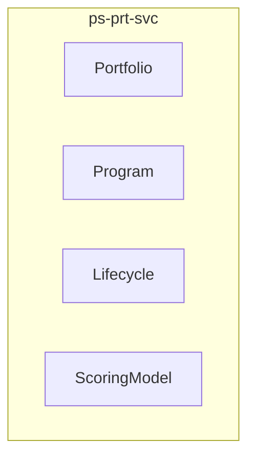

<!-- TEMPLATE COMPLIANCE: 100%
Template: domain-service-spec.md v1.0.0
Present sections: §0 (Document Purpose & Scope), §1 (Business Context), §2 (Service Identity), §3 (Domain Model), §4 (Business Rules), §5 (Use Cases), §6 (REST API), §7 (Events & Integration), §8 (Data Model), §9 (Security & Compliance), §10 (Quality Attributes), §11 (Feature Dependencies), §12 (Extension Points), §13 (Migration & Evolution), §14 (Decisions & Open Questions), §15 (Appendix)
Missing sections: None
Priority: LOW
-->

# PS.PRT — Portfolio & Program Domain / Service Specification

> **Conceptual Stack Layer:** Domain / Service
> **Space:** Platform
> **Owner:** Domain Engineering Team
> **Schema alignment:** `service-layer.schema.json`
> **Companion files:** `openapi.yaml`, `*.schema.json` (event contracts)
> **Referenced by:** Platform-Feature Spec SS5 (backend dependencies), BFF Contract
> **Belongs to:** Suite Spec (`_ps_suite.md`)

> **Meta Information**
> - **Version:** 2026-04-03
> - **Template:** `domain-service-spec.md` v1.0.0
> - **Template Compliance:** 100%
> - **Author(s):** OpenLeap Architecture Team
> - **Status:** DRAFT
> - **Suite:** `ps`
> - **Domain:** `prt`
> - **Bounded Context Ref:** `bc:portfolio`
> - **Service ID:** `ps-prt-svc`
> - **basePackage:** `io.openleap.ps.prt`
> - **API Base Path:** `/api/ps/prt/v1`
> - **OpenLeap Starter Version:** `v1.0.0`
> - **Port:** `8415`
> - **Repository:** `https://github.com/openleap-io/io.openleap.ps.prt`
> - **Tags:** `project-management`, `prt`, `ps`
> - **Team:**
>   - Name: `team-ps`
>   - Email: `ps-team@openleap.io`
>   - Slack: `#ps-team`

---

## Specification Guidelines Compliance

> ### Non-Negotiables
> - Never invent facts. If required info is missing, add an **OPEN QUESTION** entry.
> - Preserve intent and decisions. Only change meaning when explicitly requested.
> - Do not remove normative constraints unless they are explicitly replaced.
> - Keep the spec **self-contained**: no "see chat", no implicit context.
>
> ### Source of Truth Priority
> When sources conflict:
> 1. Spec (explicit) wins
> 2. Starter specs (implementation constraints) next
> 3. Guidelines (best practices) last
>
> ### Style Guide
> - Prefer short sentences and lists.
> - Use MUST/SHOULD/MAY for normative statements.
> - Keep terminology consistent with the Ubiquitous Language defined in the PS suite spec (SS1).
> - Avoid ambiguous words ("often", "maybe") unless explicitly noting uncertainty.

---

## 0. Document Purpose & Scope

### 0.1 Purpose

This specification defines the `ps-prt-svc` microservice within the PS (Project Management) suite. It covers the domain model, business rules, REST API, events, data model, and integration points for the Portfolio & Program bounded context.

### 0.2 In Scope

- Portfolio management: create and govern collections of projects and programs
- Program management: group related projects for coordinated management
- Lifecycle definition: configurable sequences of phases and gates per project type
- Gate management: define decision points with required deliverables and review criteria
- Gate review workflow: conduct reviews with proceed/hold/cancel outcomes
- Project scoring: configurable scoring models for project prioritization (RICE, weighted)
- Portfolio dashboard: cross-project status, budget health, resource demand, risk overview
- Strategic alignment: link projects to business objectives and track contribution

### 0.3 Out of Scope

- Project CRUD and WBS management (→ ps-prj-svc)
- Budget details (→ ps-bud-svc provides cost summaries)
- Staffing details (→ ps-res-svc provides demand aggregation)
- Agile metrics (→ ps-agl-svc)
- Strategic planning and OKR management (→ outside platform scope)

### 0.4 Related Documents

| Document | Path | Relationship |
|----------|------|-------------|
| PS Suite Spec | `_ps_suite.md` | Parent suite specification |
| OpenAPI Contract | `contracts/http/ps/prt/openapi.yaml` | API contract (derived from §6) |
| Event Contracts | `contracts/events/ps/prt/*.schema.json` | Event schemas (derived from §7) |

---

## 1. Business Context

### 1.1 Problems Solved

| Problem | Solution | Business Value |
|---------|----------|---------------|
| Portfolio & Program capabilities need a dedicated, independently deployable service | `ps-prt-svc` provides a focused microservice with its own data store and API | Clean bounded context separation, independent scaling and deployment |

### 1.2 Business Value

- Provides specialized portfolio & program capabilities within the PS suite
- Independent deployment and scaling
- Clear ownership boundary for the `bc:portfolio` bounded context
- Supports the PS suite's goal of unified project management across methodologies

### 1.3 Stakeholders

| Role | Interest |
|------|----------|
| Project Manager | Primary user of portfolio & program capabilities |
| Suite Architect | Ensures alignment with PS suite architecture |
| Domain Lead (prt) | Owns the domain model and business rules |
| Frontend Team | Consumes the REST API for UI features |

---

## 2. Service Identity

| Field | Value |
|-------|-------|
| **Service ID** | `ps-prt-svc` |
| **Suite** | `ps` |
| **Domain** | `prt` |
| **Bounded Context** | `bc:portfolio` |
| **Base Package** | `io.openleap.ps.prt` |
| **API Base Path** | `/api/ps/prt/v1` |
| **Port** | `8415` |
| **Repository** | `https://github.com/openleap-io/io.openleap.ps.prt` |
| **Status** | `planned` |

---

## 3. Domain Model

### 3.1 Overview

### Portfolio (`agg:portfolio`)

**Description:** A governed collection of projects and programs managed as a group for strategic alignment, resource balancing, and investment decisions.

**Aggregate Root Attributes:**

| Attribute | Type | Format | Required | Description |
|-----------|------|--------|----------|-------------|
| portfolioId | string | uuid | Yes | Unique portfolio identifier |
| tenantId | string | uuid | Yes | Owning tenant |
| name | string | — | Yes | Portfolio name |
| description | string | — | No | Portfolio description and strategic purpose |
| ownerId | string | uuid | Yes | IAM user ID of portfolio owner/manager |
| status | string | enum | Yes | Status: ACTIVE, ARCHIVED |
| projectIds | array | uuid[] | No | Projects in this portfolio |
| programIds | array | uuid[] | No | Programs in this portfolio |
| version | integer | — | Yes | Optimistic lock version |
| createdAt | string | datetime | Yes | Creation timestamp |
| updatedAt | string | datetime | Yes | Last update timestamp |

### Program (`agg:program`)

**Description:** A grouping of related projects managed in a coordinated way to achieve benefits not available from managing them individually.

**Aggregate Root Attributes:**

| Attribute | Type | Format | Required | Description |
|-----------|------|--------|----------|-------------|
| programId | string | uuid | Yes | Unique program identifier |
| tenantId | string | uuid | Yes | Owning tenant |
| name | string | — | Yes | Program name |
| description | string | — | No | Program description |
| managerId | string | uuid | Yes | IAM user ID of program manager |
| status | string | enum | Yes | Status: ACTIVE, COMPLETED, CANCELLED |
| projectIds | array | uuid[] | No | Projects in this program |
| version | integer | — | Yes | Optimistic lock version |
| createdAt | string | datetime | Yes | Creation timestamp |
| updatedAt | string | datetime | Yes | Last update timestamp |

### Lifecycle (`agg:lifecycle`)

**Description:** A configurable sequence of phases and gates that a project passes through from initiation to closure. Different project types can use different lifecycles.

**Aggregate Root Attributes:**

| Attribute | Type | Format | Required | Description |
|-----------|------|--------|----------|-------------|
| lifecycleId | string | uuid | Yes | Unique lifecycle identifier |
| tenantId | string | uuid | Yes | Owning tenant |
| name | string | — | Yes | Lifecycle name (e.g., 'Standard Waterfall', 'Agile Delivery') |
| description | string | — | No | Description |
| isDefault | boolean | — | Yes | Whether this is the tenant's default lifecycle |
| version | integer | — | Yes | Optimistic lock version |

#### Entity: LifecyclePhase

**Description:** A phase within the lifecycle with entry and exit gates.

**Attributes:**

| Attribute | Type | Format | Required | Description |
|-----------|------|--------|----------|-------------|
| phaseId | string | uuid | Yes | Unique phase identifier |
| name | string | — | Yes | Phase name (e.g., 'Initiation', 'Planning', 'Execution') |
| sortOrder | integer | — | Yes | Phase order in the lifecycle |
| entryGateId | string | uuid | No | Gate required to enter this phase |
| exitGateId | string | uuid | No | Gate required to exit this phase |

#### Entity: Gate

**Description:** A decision point in the lifecycle where stakeholders review progress and decide to proceed, hold, or cancel.

**Attributes:**

| Attribute | Type | Format | Required | Description |
|-----------|------|--------|----------|-------------|
| gateId | string | uuid | Yes | Unique gate identifier |
| name | string | — | Yes | Gate name (e.g., 'Feasibility Gate', 'Launch Gate') |
| description | string | — | No | What is reviewed at this gate |
| requiredDeliverables | array | string[] | No | List of deliverables required for gate review |
| reviewCriteria | array | string[] | No | Criteria for pass/fail/hold decision |

#### Entity: GateReview

**Description:** The actual review event at a gate for a specific project.

**Attributes:**

| Attribute | Type | Format | Required | Description |
|-----------|------|--------|----------|-------------|
| reviewId | string | uuid | Yes | Unique review identifier |
| gateId | string | uuid | Yes | Gate being reviewed |
| projectId | string | uuid | Yes | Project under review |
| reviewDate | string | date | Yes | Date of the review |
| reviewerId | string | uuid | Yes | IAM user who conducted the review |
| outcome | string | enum | Yes | Review outcome: PROCEED, HOLD, CANCEL |
| comments | string | — | No | Review notes and rationale |

### ScoringModel (`agg:scoring-model`)

**Description:** A configurable model for scoring and ranking projects in a portfolio. Supports weighted criteria like strategic alignment, ROI, risk, and resource availability.

**Aggregate Root Attributes:**

| Attribute | Type | Format | Required | Description |
|-----------|------|--------|----------|-------------|
| scoringModelId | string | uuid | Yes | Unique scoring model identifier |
| tenantId | string | uuid | Yes | Owning tenant |
| name | string | — | Yes | Model name (e.g., 'RICE Scoring', 'Weighted Strategic') |
| description | string | — | No | Description of the scoring methodology |

#### Entity: ScoringCriterion

**Description:** A single criterion in the scoring model with a weight.

**Attributes:**

| Attribute | Type | Format | Required | Description |
|-----------|------|--------|----------|-------------|
| criterionId | string | uuid | Yes | Unique criterion identifier |
| name | string | — | Yes | Criterion name (e.g., 'Strategic Alignment', 'ROI') |
| weight | number | — | Yes | Weight 0.0-1.0 (all weights in a model MUST sum to 1.0) |
| scale | string | — | Yes | Scale description (e.g., '1-5', '1-10', 'Low/Medium/High') |

---

## 4. Business Rules & Constraints

### 4.1 Business Rules Catalog

| ID | Rule Name | Description | Scope | Enforcement | Error Code |
|----|-----------|-------------|-------|-------------|------------|
| BR-PRT-001 | Unique Portfolio Name Per Tenant | Portfolio name MUST be unique within a tenant.... | agg:portfolio | Create, Update | `PRT_NAME_DUPLICATE` |
| BR-PRT-002 | Project Single Portfolio | A project SHOULD belong to at most one portfolio. If a project is added to a new... | agg:portfolio | Update | `PRT_PROJECT_MULTI_PORTFOLIO` |
| BR-PRT-003 | Program Projects Same Tenant | All projects in a program MUST belong to the same tenant.... | agg:program | Update | `PRT_CROSS_TENANT_PROGRAM` |
| BR-PRT-004 | Default Lifecycle Singleton | Each tenant MUST have exactly one default lifecycle. Setting a new default MUST ... | agg:lifecycle | Create, Update | `PRT_MULTIPLE_DEFAULT_LC` |
| BR-PRT-005 | Gate Review Requires Active Project | A gate review can only be conducted for a project in ACTIVE status.... | GateReview | Create | `PRT_GATE_PROJECT_NOT_ACTIVE` |
| BR-PRT-006 | Gate Sequential Order | A project MUST pass gates in the order defined by the lifecycle. Skipping gates ... | GateReview | Create | `PRT_GATE_OUT_OF_ORDER` |
| BR-PRT-007 | Scoring Weights Sum To One | All criterion weights in a scoring model MUST sum to 1.0 (±0.01 tolerance).... | ScoringCriterion | Create, Update | `PRT_WEIGHTS_INVALID` |

### 4.2 Detailed Rule Definitions

#### BR-PRT-001: Unique Portfolio Name Per Tenant

**Business Context:** This rule exists to ensure data integrity and correct business behavior.

**Rule Statement:** Portfolio name MUST be unique within a tenant.

**Applies To:**
- Aggregate/Entity: `agg:portfolio`
- Operations: Create, Update

**Enforcement:** Domain layer validation

**Error Handling:**
- **Error Code:** `PRT_NAME_DUPLICATE`
- **If violated:** System returns error code `PRT_NAME_DUPLICATE` with descriptive message
- **User action:** Correct the input and retry

#### BR-PRT-002: Project Single Portfolio

**Business Context:** This rule exists to ensure data integrity and correct business behavior.

**Rule Statement:** A project SHOULD belong to at most one portfolio. If a project is added to a new portfolio, it MUST be removed from the previous one.

**Applies To:**
- Aggregate/Entity: `agg:portfolio`
- Operations: Update

**Enforcement:** Domain layer validation

**Error Handling:**
- **Error Code:** `PRT_PROJECT_MULTI_PORTFOLIO`
- **If violated:** System returns error code `PRT_PROJECT_MULTI_PORTFOLIO` with descriptive message
- **User action:** Correct the input and retry

#### BR-PRT-003: Program Projects Same Tenant

**Business Context:** This rule exists to ensure data integrity and correct business behavior.

**Rule Statement:** All projects in a program MUST belong to the same tenant.

**Applies To:**
- Aggregate/Entity: `agg:program`
- Operations: Update

**Enforcement:** Domain layer validation

**Error Handling:**
- **Error Code:** `PRT_CROSS_TENANT_PROGRAM`
- **If violated:** System returns error code `PRT_CROSS_TENANT_PROGRAM` with descriptive message
- **User action:** Correct the input and retry

#### BR-PRT-004: Default Lifecycle Singleton

**Business Context:** This rule exists to ensure data integrity and correct business behavior.

**Rule Statement:** Each tenant MUST have exactly one default lifecycle. Setting a new default MUST unset the previous one.

**Applies To:**
- Aggregate/Entity: `agg:lifecycle`
- Operations: Create, Update

**Enforcement:** Domain layer validation

**Error Handling:**
- **Error Code:** `PRT_MULTIPLE_DEFAULT_LC`
- **If violated:** System returns error code `PRT_MULTIPLE_DEFAULT_LC` with descriptive message
- **User action:** Correct the input and retry

#### BR-PRT-005: Gate Review Requires Active Project

**Business Context:** This rule exists to ensure data integrity and correct business behavior.

**Rule Statement:** A gate review can only be conducted for a project in ACTIVE status.

**Applies To:**
- Aggregate/Entity: `GateReview`
- Operations: Create

**Enforcement:** Domain layer validation

**Error Handling:**
- **Error Code:** `PRT_GATE_PROJECT_NOT_ACTIVE`
- **If violated:** System returns error code `PRT_GATE_PROJECT_NOT_ACTIVE` with descriptive message
- **User action:** Correct the input and retry

#### BR-PRT-006: Gate Sequential Order

**Business Context:** This rule exists to ensure data integrity and correct business behavior.

**Rule Statement:** A project MUST pass gates in the order defined by the lifecycle. Skipping gates is not allowed unless explicitly overridden by an admin.

**Applies To:**
- Aggregate/Entity: `GateReview`
- Operations: Create

**Enforcement:** Domain layer validation

**Error Handling:**
- **Error Code:** `PRT_GATE_OUT_OF_ORDER`
- **If violated:** System returns error code `PRT_GATE_OUT_OF_ORDER` with descriptive message
- **User action:** Correct the input and retry

#### BR-PRT-007: Scoring Weights Sum To One

**Business Context:** This rule exists to ensure data integrity and correct business behavior.

**Rule Statement:** All criterion weights in a scoring model MUST sum to 1.0 (±0.01 tolerance).

**Applies To:**
- Aggregate/Entity: `ScoringCriterion`
- Operations: Create, Update

**Enforcement:** Domain layer validation

**Error Handling:**
- **Error Code:** `PRT_WEIGHTS_INVALID`
- **If violated:** System returns error code `PRT_WEIGHTS_INVALID` with descriptive message
- **User action:** Correct the input and retry

---

## 5. Use Cases

### 5.1 Business Logic Placement

| Logic Type | Placement | Examples |
|------------|-----------|----------|
| Aggregate invariants | Domain Object | Validation, state transitions, consistency checks |
| Cross-aggregate logic | Domain Service | Operations spanning multiple aggregates within this service |
| Orchestration & transactions | Application Service | Use case coordination, event publishing, transaction boundaries |

### 5.2 Use Cases

Use cases are derived from the REST API endpoints (§6) and event handlers (§7). Each endpoint maps to a use case following the canonical format:

| UC ID | Type | Aggregate | Operation | REST |
|-------|------|-----------|-----------|------|
| UC-PRT-001 | WRITE | Portfolio | Create | `POST /api/ps/prt/v1/...` |

---

## 6. REST API

### 6.1 API Overview

**Base Path:** `/api/ps/prt/v1`

**Authentication:** OAuth2/JWT (Bearer token)

**Authorization:**
- Read operations: Requires scope `ps.prt:read`
- Write operations: Requires scope `ps.prt:write`
- Admin operations: Requires scope `ps.prt:admin`

### 6.2 Resource Operations

**Base Path:** `/api/ps/prt/v1`

All standard CRUD operations follow the OpenLeap REST conventions:
- `POST` for creation (returns `201 Created`)
- `GET` for retrieval (returns `200 OK`)
- `PATCH` for partial update (returns `200 OK`, requires `If-Match` ETag)
- `DELETE` for removal (returns `204 No Content`)

Detailed endpoint specifications are documented in the companion `openapi.yaml` file.

**Reference to OpenAPI:** `contracts/http/ps/prt/openapi.yaml`

---

## 7. Events & Integration

### 7.1 EDA Pattern

This service follows the PS suite's hybrid integration pattern (see `_ps_suite.md` SS4). State-propagation events are published asynchronously; user-facing queries use synchronous API calls.

### 7.2 Published Events

| Routing Key | Description |
|------------|-------------|
| `ps.prt.portfolio.created` | New portfolio defined |
| `ps.prt.portfolio.updated` | Portfolio membership changed |
| `ps.prt.program.created` | New program defined |
| `ps.prt.program.updated` | Program membership changed |
| `ps.prt.gate.approved` | Gate review passed; project may advance to next phase |
| `ps.prt.gate.rejected` | Gate review failed; project held or cancelled |
| `ps.prt.lifecycle.assigned` | Lifecycle template assigned to project |

**Payload Envelope:** All events follow the PS suite envelope format (see `_ps_suite.md` SS5.2).

### 7.3 Consumed Events

| Routing Key | Producer | Purpose |
|------------|----------|---------|
| `ps.prj.project.created` | `ps-prj-svc` | Register new project as candidate for portfolio assignment |
| `ps.prj.project.completed` | `ps-prj-svc` | Update portfolio status when project completes |
| `ps.prj.project.cancelled` | `ps-prj-svc` | Update portfolio status when project is cancelled |
| `ps.prj.project.activated` | `ps-prj-svc` | Register project in portfolio if assigned |

### 7.4 Integration Points

| Direction | Target | Type | Description |
|-----------|--------|------|-------------|
| Upstream (sync) | `ps-prj-svc` | API | Read project and work package data |
| Upstream (sync) | `iam-svc` | API | Authentication and authorization |
| Upstream (sync) | `ref-data-svc` | API | Reference data (currencies, codes) |
| Downstream (async) | Event bus | Event | Publish domain events for consumers |

---

## 8. Data Model

### 8.1 Storage Technology

**Database:** PostgreSQL

**Schema:** `ps_prt`

**Conventions:**
- Table names: `ps_prt.{entity_name}` (snake_case)
- Primary keys: UUID
- Tenant isolation: `tenant_id` column on all tables with Row-Level Security
- Optimistic locking: `version` column
- Audit columns: `created_at`, `updated_at`, `created_by`, `updated_by`

### 8.2 Tables

**Storage Technology:** PostgreSQL

**Schema:** `ps_prt`

Tables are derived from the aggregate model above. Each aggregate root maps to a primary table; entities and value objects with their own identity map to child tables with foreign key references.

Detailed DDL is generated from the domain model and maintained in the service's migration scripts.

---

## 9. Security & Compliance

### 9.1 Data Classification

| Classification | Description |
|---------------|-------------|
| **Internal** | Default classification for project planning data |
| **Confidential** | Projects marked as confidential (restricted to assigned members) |

### 9.2 Access Control

| Role | Permissions |
|------|------------|
| `PS_READER` | Read access to all prt data within tenant |
| `PS_WRITER` | Create and update prt data |
| `PS_ADMIN` | Full access including delete and configuration |
| `PROJECT_MANAGER` | Write access scoped to own projects |
| `TEAM_MEMBER` | Read access to assigned projects, limited write |

### 9.3 Compliance

This service inherits all compliance requirements from the PS suite (see `_ps_suite.md` SS7):
- GDPR: Personal data in assignments must be protectable
- ISO 21500: Supports recognized project management methodology
- ISO 27001: Role-based access, data encryption at rest and in transit

---

## 10. Quality Attributes

| Attribute | Target | Notes |
|-----------|--------|-------|
| **Response Time (p95)** | < 200ms for reads, < 500ms for writes | Measured at service boundary |
| **Availability** | 99.9% | Excluding planned maintenance |
| **Throughput** | 100 req/s reads, 50 req/s writes | Per service instance |
| **Recovery Time** | < 5 minutes | Automatic restart via Kubernetes |

---

## 11. Feature Dependencies

The following platform-features call this service:

| Feature ID | Feature Name | Endpoints Used |
|-----------|--------------|----------------|
| `F-PS-006-01` | Portfolio Dashboard | See feature spec §5 |
| `F-PS-006-02` | Program Management | See feature spec §5 |
| `F-PS-006-03` | Lifecycle & Gate Management | See feature spec §5 |
| `F-PS-006-04` | Gate Review Workflow | See feature spec §5 |
| `F-PS-006-05` | Project Scoring & Prioritization | See feature spec §5 |
| `F-PS-006-06` | Multi-Project Roadmap | See feature spec §5 |

---

## 12. Extension Points

### 12.1 Extension Events

All published events (§7.2) serve as extension points. External systems and product customizations can subscribe to these events to add behavior without modifying this service.

### 12.2 Aggregate Hooks

| Hook | When | Purpose |
|------|------|---------|
| Pre-create validation | Before aggregate creation | Product-specific validation rules |
| Post-create notification | After aggregate creation | Product-specific notifications |
| Pre-update validation | Before aggregate update | Product-specific constraints |
| Status transition guard | Before status change | Product-specific workflow gates |

### 12.3 Extension API Endpoints

Reserved namespace for product-specific extensions: `/api/ps/prt/v1/ext/{extension-name}`

---

## 13. Migration & Evolution

### 13.1 Data Migration Strategy

- Flyway-based database migrations in `db/migration/`
- All migrations are forward-only (no rollback scripts)
- Schema changes follow the additive-only principle for backward compatibility
- Breaking changes require a new API version (`/v2`) with parallel availability during migration

### 13.2 Deprecation Path

- Deprecated endpoints are annotated with `@Deprecated` and return `Sunset` header
- Minimum deprecation period: 2 sprints (4 weeks)
- Deprecated events continue publishing during migration window

### 13.3 Versioning Policy

- API: URL-based versioning (`/v1`, `/v2`)
- Events: Schema versioning in event envelope `schemaVersion` field
- Database: Flyway migration versioning

---

## 14. Decisions & Open Questions

### 14.1 Suite-Level ADR References

| Suite ADR | Title | Relevance to This Service |
|-----------|-------|---------------------------|
| ADR-PS-001 | PS as Separate Suite from OPS | Establishes this service's existence within PS, not OPS |
| ADR-PS-002 | Work Package as Universal Work Item | Core design decision for work package modeling |
| ADR-PS-003 | Agile as Separate Bounded Context | Defines boundary with ps-agl-svc |
| ADR-PS-004 | Personas for Staffing | Defines boundary with ps-res-svc |

### 14.2 Open Questions

| ID | Question | Severity | Context |
|----|----------|----------|---------|
| OQ-PRT-001 | Should prt support multi-language work package subjects? | MEDIUM | i18n requirements not yet finalized |
| OQ-PRT-002 | What is the maximum WBS depth allowed? | LOW | Performance consideration for deep hierarchies |

---

## 15. Appendix

### 15.1 Glossary

See PS Suite Spec SS1 (Ubiquitous Language) for all shared terminology. Service-local terms:

| Term | Definition | Aliases |
|------|------------|---------|
| Aggregate | DDD concept: cluster of objects treated as a unit for data changes | Aggregate Root |
| ETag | HTTP header for optimistic concurrency control | Entity Tag |

### 15.2 References

**Suite Specification:** `_ps_suite.md`
**Technical Standards:** `TECHNICAL_STANDARDS.md`, `EVENT_STANDARDS.md`
**Schema:** `service-layer.schema.json`

### 15.3 Change Log

| Date | Version | Author | Changes |
|------|---------|--------|---------|
| 2026-04-03 | 1.0.0 | OpenLeap Architecture Team | Initial domain/service specification |

### 15.4 Review & Approval

**Status:** DRAFT

| Role | Name | Date | Status |
|------|------|------|--------|
| Suite Architect | {Name} | YYYY-MM-DD | [ ] Reviewed |
| Domain Lead (prt) | {Name} | YYYY-MM-DD | [ ] Reviewed |
