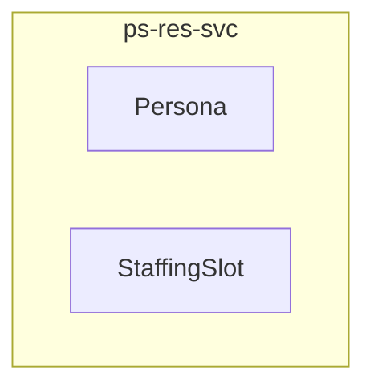

<!-- TEMPLATE COMPLIANCE: 100%
Template: domain-service-spec.md v1.0.0
Present sections: §0 (Document Purpose & Scope), §1 (Business Context), §2 (Service Identity), §3 (Domain Model), §4 (Business Rules), §5 (Use Cases), §6 (REST API), §7 (Events & Integration), §8 (Data Model), §9 (Security & Compliance), §10 (Quality Attributes), §11 (Feature Dependencies), §12 (Extension Points), §13 (Migration & Evolution), §14 (Decisions & Open Questions), §15 (Appendix)
Missing sections: None
Priority: LOW
-->

# PS.RES — Project Staffing Domain / Service Specification

> **Conceptual Stack Layer:** Domain / Service
> **Space:** Platform
> **Owner:** Domain Engineering Team
> **Schema alignment:** `service-layer.schema.json`
> **Companion files:** `openapi.yaml`, `*.schema.json` (event contracts)
> **Referenced by:** Platform-Feature Spec SS5 (backend dependencies), BFF Contract
> **Belongs to:** Suite Spec (`_ps_suite.md`)

> **Meta Information**
> - **Version:** 2026-04-03
> - **Template:** `domain-service-spec.md` v1.0.0
> - **Template Compliance:** 100%
> - **Author(s):** OpenLeap Architecture Team
> - **Status:** DRAFT
> - **Suite:** `ps`
> - **Domain:** `res`
> - **Bounded Context Ref:** `bc:staffing`
> - **Service ID:** `ps-res-svc`
> - **basePackage:** `io.openleap.ps.res`
> - **API Base Path:** `/api/ps/res/v1`
> - **OpenLeap Starter Version:** `v1.0.0`
> - **Port:** `8414`
> - **Repository:** `https://github.com/openleap-io/io.openleap.ps.res`
> - **Tags:** `project-management`, `res`, `ps`
> - **Team:**
>   - Name: `team-ps`
>   - Email: `ps-team@openleap.io`
>   - Slack: `#ps-team`

---

## Specification Guidelines Compliance

> ### Non-Negotiables
> - Never invent facts. If required info is missing, add an **OPEN QUESTION** entry.
> - Preserve intent and decisions. Only change meaning when explicitly requested.
> - Do not remove normative constraints unless they are explicitly replaced.
> - Keep the spec **self-contained**: no "see chat", no implicit context.
>
> ### Source of Truth Priority
> When sources conflict:
> 1. Spec (explicit) wins
> 2. Starter specs (implementation constraints) next
> 3. Guidelines (best practices) last
>
> ### Style Guide
> - Prefer short sentences and lists.
> - Use MUST/SHOULD/MAY for normative statements.
> - Keep terminology consistent with the Ubiquitous Language defined in the PS suite spec (SS1).
> - Avoid ambiguous words ("often", "maybe") unless explicitly noting uncertainty.

---

## 0. Document Purpose & Scope

### 0.1 Purpose

This specification defines the `ps-res-svc` microservice within the PS (Project Management) suite. It covers the domain model, business rules, REST API, events, data model, and integration points for the Project Staffing bounded context.

### 0.2 In Scope

- Persona management: create and maintain skill/role profiles reusable across projects
- Staffing slot management: create demand entries tying a persona to a project for a time period and FTE percentage
- Staffing assignment: optionally fill slots with named resources (references to ops.res or bp)
- Demand aggregation: roll-up view of all open demand across projects or portfolio
- Capacity forecasting: compare demand against available capacity from OPS resources
- Scenario planning: model what-if staffing scenarios before committing

### 0.3 Out of Scope

- Resource master data management (→ ops-res-svc)
- Real availability schedules (→ ops-res-svc + cal-svc)
- Billing rates for named resources (→ ops-res-svc)
- Work package assignment (→ ps-prj-svc owns WP assignee field)

### 0.4 Related Documents

| Document | Path | Relationship |
|----------|------|-------------|
| PS Suite Spec | `_ps_suite.md` | Parent suite specification |
| OpenAPI Contract | `contracts/http/ps/res/openapi.yaml` | API contract (derived from §6) |
| Event Contracts | `contracts/events/ps/res/*.schema.json` | Event schemas (derived from §7) |

---

## 1. Business Context

### 1.1 Problems Solved

| Problem | Solution | Business Value |
|---------|----------|---------------|
| Project Staffing capabilities need a dedicated, independently deployable service | `ps-res-svc` provides a focused microservice with its own data store and API | Clean bounded context separation, independent scaling and deployment |

### 1.2 Business Value

- Provides specialized project staffing capabilities within the PS suite
- Independent deployment and scaling
- Clear ownership boundary for the `bc:staffing` bounded context
- Supports the PS suite's goal of unified project management across methodologies

### 1.3 Stakeholders

| Role | Interest |
|------|----------|
| Project Manager | Primary user of project staffing capabilities |
| Suite Architect | Ensures alignment with PS suite architecture |
| Domain Lead (res) | Owns the domain model and business rules |
| Frontend Team | Consumes the REST API for UI features |

---

## 2. Service Identity

| Field | Value |
|-------|-------|
| **Service ID** | `ps-res-svc` |
| **Suite** | `ps` |
| **Domain** | `res` |
| **Bounded Context** | `bc:staffing` |
| **Base Package** | `io.openleap.ps.res` |
| **API Base Path** | `/api/ps/res/v1` |
| **Port** | `8414` |
| **Repository** | `https://github.com/openleap-io/io.openleap.ps.res` |
| **Status** | `planned` |

---

## 3. Domain Model

### 3.1 Overview

### Persona (`agg:persona`)

**Description:** An abstract resource demand profile defining a type of resource needed. Not a real person — a skill/role profile with attributes like seniority, technology, and domain expertise.

**Aggregate Root Attributes:**

| Attribute | Type | Format | Required | Description |
|-----------|------|--------|----------|-------------|
| personaId | string | uuid | Yes | Unique persona identifier |
| tenantId | string | uuid | Yes | Owning tenant |
| name | string | — | Yes | Persona name (e.g., 'Senior Java Developer') |
| description | string | — | No | Detailed description of skills and responsibilities |
| skills | array | string[] | No | Required skills (e.g., ['Java', 'Spring Boot', 'PostgreSQL']) |
| seniorityLevel | string | enum | No | Seniority: JUNIOR, MID, SENIOR, LEAD, PRINCIPAL |
| defaultHourlyRate | number | — | No | Default planning rate for budget estimation |
| isActive | boolean | — | Yes | Whether this persona is currently usable |
| version | integer | — | Yes | Optimistic lock version |
| createdAt | string | datetime | Yes | Creation timestamp |
| updatedAt | string | datetime | Yes | Last update timestamp |

### StaffingSlot (`agg:staffing-slot`)

**Description:** A concrete demand for a persona on a project for a time period and FTE percentage. Can be left as open demand or filled by assigning a named resource.

**Aggregate Root Attributes:**

| Attribute | Type | Format | Required | Description |
|-----------|------|--------|----------|-------------|
| slotId | string | uuid | Yes | Unique slot identifier |
| tenantId | string | uuid | Yes | Owning tenant |
| projectId | string | uuid | Yes | Project reference |
| personaId | string | uuid | Yes | Required persona profile |
| startDate | string | date | Yes | Demand start date |
| endDate | string | date | Yes | Demand end date |
| ftePercentage | number | — | Yes | FTE allocation percentage (e.g., 0.5 = 50%, 1.0 = 100%) |
| status | string | enum | Yes | Slot status: OPEN, FILLED, RELEASED |
| assignedResourceId | string | uuid | No | Named resource from ops-res-svc (null if unfilled) |
| assignedResourceName | string | — | No | Display name of assigned resource |
| comment | string | — | No | Notes about this staffing demand |
| version | integer | — | Yes | Optimistic lock version |
| createdAt | string | datetime | Yes | Creation timestamp |
| updatedAt | string | datetime | Yes | Last update timestamp |

---

## 4. Business Rules & Constraints

### 4.1 Business Rules Catalog

| ID | Rule Name | Description | Scope | Enforcement | Error Code |
|----|-----------|-------------|-------|-------------|------------|
| BR-RES-001 | Unique Persona Name Per Tenant | Persona name MUST be unique within a tenant.... | agg:persona | Create, Update | `RES_PERSONA_DUPLICATE` |
| BR-RES-002 | FTE Range | ftePercentage MUST be > 0 and <= 2.0 (200% for overtime scenarios).... | agg:staffing-slot | Create, Update | `RES_FTE_OUT_OF_RANGE` |
| BR-RES-003 | Slot Date Range Valid | endDate MUST be on or after startDate.... | agg:staffing-slot | Create, Update | `RES_SLOT_DATE_INVALID` |
| BR-RES-004 | Fill Requires Named Resource | Transitioning a slot to FILLED status MUST include a valid assignedResourceId.... | agg:staffing-slot | Update | `RES_FILL_NO_RESOURCE` |
| BR-RES-005 | Release Clears Assignment | Transitioning a slot to RELEASED status MUST clear assignedResourceId and assign... | agg:staffing-slot | Update | `—` |

### 4.2 Detailed Rule Definitions

#### BR-RES-001: Unique Persona Name Per Tenant

**Business Context:** This rule exists to ensure data integrity and correct business behavior.

**Rule Statement:** Persona name MUST be unique within a tenant.

**Applies To:**
- Aggregate/Entity: `agg:persona`
- Operations: Create, Update

**Enforcement:** Domain layer validation

**Error Handling:**
- **Error Code:** `RES_PERSONA_DUPLICATE`
- **If violated:** System returns error code `RES_PERSONA_DUPLICATE` with descriptive message
- **User action:** Correct the input and retry

#### BR-RES-002: FTE Range

**Business Context:** This rule exists to ensure data integrity and correct business behavior.

**Rule Statement:** ftePercentage MUST be > 0 and <= 2.0 (200% for overtime scenarios).

**Applies To:**
- Aggregate/Entity: `agg:staffing-slot`
- Operations: Create, Update

**Enforcement:** Domain layer validation

**Error Handling:**
- **Error Code:** `RES_FTE_OUT_OF_RANGE`
- **If violated:** System returns error code `RES_FTE_OUT_OF_RANGE` with descriptive message
- **User action:** Correct the input and retry

#### BR-RES-003: Slot Date Range Valid

**Business Context:** This rule exists to ensure data integrity and correct business behavior.

**Rule Statement:** endDate MUST be on or after startDate.

**Applies To:**
- Aggregate/Entity: `agg:staffing-slot`
- Operations: Create, Update

**Enforcement:** Domain layer validation

**Error Handling:**
- **Error Code:** `RES_SLOT_DATE_INVALID`
- **If violated:** System returns error code `RES_SLOT_DATE_INVALID` with descriptive message
- **User action:** Correct the input and retry

#### BR-RES-004: Fill Requires Named Resource

**Business Context:** This rule exists to ensure data integrity and correct business behavior.

**Rule Statement:** Transitioning a slot to FILLED status MUST include a valid assignedResourceId.

**Applies To:**
- Aggregate/Entity: `agg:staffing-slot`
- Operations: Update

**Enforcement:** Domain layer validation

**Error Handling:**
- **Error Code:** `RES_FILL_NO_RESOURCE`
- **If violated:** System returns error code `RES_FILL_NO_RESOURCE` with descriptive message
- **User action:** Correct the input and retry

#### BR-RES-005: Release Clears Assignment

**Business Context:** This rule exists to ensure data integrity and correct business behavior.

**Rule Statement:** Transitioning a slot to RELEASED status MUST clear assignedResourceId and assignedResourceName.

**Applies To:**
- Aggregate/Entity: `agg:staffing-slot`
- Operations: Update

**Enforcement:** Domain layer validation

**Error Handling:**
- **Error Code:** `—`
- **If violated:** System returns error code `—` with descriptive message
- **User action:** Correct the input and retry

---

## 5. Use Cases

### 5.1 Business Logic Placement

| Logic Type | Placement | Examples |
|------------|-----------|----------|
| Aggregate invariants | Domain Object | Validation, state transitions, consistency checks |
| Cross-aggregate logic | Domain Service | Operations spanning multiple aggregates within this service |
| Orchestration & transactions | Application Service | Use case coordination, event publishing, transaction boundaries |

### 5.2 Use Cases

Use cases are derived from the REST API endpoints (§6) and event handlers (§7). Each endpoint maps to a use case following the canonical format:

| UC ID | Type | Aggregate | Operation | REST |
|-------|------|-----------|-----------|------|
| UC-RES-001 | WRITE | Persona | Create | `POST /api/ps/res/v1/...` |

---

## 6. REST API

### 6.1 API Overview

**Base Path:** `/api/ps/res/v1`

**Authentication:** OAuth2/JWT (Bearer token)

**Authorization:**
- Read operations: Requires scope `ps.res:read`
- Write operations: Requires scope `ps.res:write`
- Admin operations: Requires scope `ps.res:admin`

### 6.2 Resource Operations

**Base Path:** `/api/ps/res/v1`

All standard CRUD operations follow the OpenLeap REST conventions:
- `POST` for creation (returns `201 Created`)
- `GET` for retrieval (returns `200 OK`)
- `PATCH` for partial update (returns `200 OK`, requires `If-Match` ETag)
- `DELETE` for removal (returns `204 No Content`)

Detailed endpoint specifications are documented in the companion `openapi.yaml` file.

**Reference to OpenAPI:** `contracts/http/ps/res/openapi.yaml`

---

## 7. Events & Integration

### 7.1 EDA Pattern

This service follows the PS suite's hybrid integration pattern (see `_ps_suite.md` SS4). State-propagation events are published asynchronously; user-facing queries use synchronous API calls.

### 7.2 Published Events

| Routing Key | Description |
|------------|-------------|
| `ps.res.persona.created` | New persona/role profile defined |
| `ps.res.persona.updated` | Persona attributes modified |
| `ps.res.slot.created` | New staffing demand raised for project |
| `ps.res.slot.filled` | Staffing slot assigned to named resource |
| `ps.res.slot.released` | Resource released from project staffing slot |

**Payload Envelope:** All events follow the PS suite envelope format (see `_ps_suite.md` SS5.2).

### 7.3 Consumed Events

| Routing Key | Producer | Purpose |
|------------|----------|---------|
| `ps.prj.project.activated` | `ps-prj-svc` | Initialize staffing demand space for activated project |
| `ps.prj.project.cancelled` | `ps-prj-svc` | Release all staffing slots for cancelled project |

### 7.4 Integration Points

| Direction | Target | Type | Description |
|-----------|--------|------|-------------|
| Upstream (sync) | `ps-prj-svc` | API | Read project and work package data |
| Upstream (sync) | `iam-svc` | API | Authentication and authorization |
| Upstream (sync) | `ref-data-svc` | API | Reference data (currencies, codes) |
| Downstream (async) | Event bus | Event | Publish domain events for consumers |

---

## 8. Data Model

### 8.1 Storage Technology

**Database:** PostgreSQL

**Schema:** `ps_res`

**Conventions:**
- Table names: `ps_res.{entity_name}` (snake_case)
- Primary keys: UUID
- Tenant isolation: `tenant_id` column on all tables with Row-Level Security
- Optimistic locking: `version` column
- Audit columns: `created_at`, `updated_at`, `created_by`, `updated_by`

### 8.2 Tables

**Storage Technology:** PostgreSQL

**Schema:** `ps_res`

Tables are derived from the aggregate model above. Each aggregate root maps to a primary table; entities and value objects with their own identity map to child tables with foreign key references.

Detailed DDL is generated from the domain model and maintained in the service's migration scripts.

---

## 9. Security & Compliance

### 9.1 Data Classification

| Classification | Description |
|---------------|-------------|
| **Internal** | Default classification for project planning data |
| **Confidential** | Projects marked as confidential (restricted to assigned members) |

### 9.2 Access Control

| Role | Permissions |
|------|------------|
| `PS_READER` | Read access to all res data within tenant |
| `PS_WRITER` | Create and update res data |
| `PS_ADMIN` | Full access including delete and configuration |
| `PROJECT_MANAGER` | Write access scoped to own projects |
| `TEAM_MEMBER` | Read access to assigned projects, limited write |

### 9.3 Compliance

This service inherits all compliance requirements from the PS suite (see `_ps_suite.md` SS7):
- GDPR: Personal data in assignments must be protectable
- ISO 21500: Supports recognized project management methodology
- ISO 27001: Role-based access, data encryption at rest and in transit

---

## 10. Quality Attributes

| Attribute | Target | Notes |
|-----------|--------|-------|
| **Response Time (p95)** | < 200ms for reads, < 500ms for writes | Measured at service boundary |
| **Availability** | 99.9% | Excluding planned maintenance |
| **Throughput** | 100 req/s reads, 50 req/s writes | Per service instance |
| **Recovery Time** | < 5 minutes | Automatic restart via Kubernetes |

---

## 11. Feature Dependencies

The following platform-features call this service:

| Feature ID | Feature Name | Endpoints Used |
|-----------|--------------|----------------|
| `F-PS-005-01` | Persona Management | See feature spec §5 |
| `F-PS-005-02` | Staffing Slot Management | See feature spec §5 |
| `F-PS-005-03` | Team Planner View | See feature spec §5 |
| `F-PS-005-04` | Demand Aggregation Dashboard | See feature spec §5 |
| `F-PS-005-05` | Scenario Planning | See feature spec §5 |

---

## 12. Extension Points

### 12.1 Extension Events

All published events (§7.2) serve as extension points. External systems and product customizations can subscribe to these events to add behavior without modifying this service.

### 12.2 Aggregate Hooks

| Hook | When | Purpose |
|------|------|---------|
| Pre-create validation | Before aggregate creation | Product-specific validation rules |
| Post-create notification | After aggregate creation | Product-specific notifications |
| Pre-update validation | Before aggregate update | Product-specific constraints |
| Status transition guard | Before status change | Product-specific workflow gates |

### 12.3 Extension API Endpoints

Reserved namespace for product-specific extensions: `/api/ps/res/v1/ext/{extension-name}`

---

## 13. Migration & Evolution

### 13.1 Data Migration Strategy

- Flyway-based database migrations in `db/migration/`
- All migrations are forward-only (no rollback scripts)
- Schema changes follow the additive-only principle for backward compatibility
- Breaking changes require a new API version (`/v2`) with parallel availability during migration

### 13.2 Deprecation Path

- Deprecated endpoints are annotated with `@Deprecated` and return `Sunset` header
- Minimum deprecation period: 2 sprints (4 weeks)
- Deprecated events continue publishing during migration window

### 13.3 Versioning Policy

- API: URL-based versioning (`/v1`, `/v2`)
- Events: Schema versioning in event envelope `schemaVersion` field
- Database: Flyway migration versioning

---

## 14. Decisions & Open Questions

### 14.1 Suite-Level ADR References

| Suite ADR | Title | Relevance to This Service |
|-----------|-------|---------------------------|
| ADR-PS-001 | PS as Separate Suite from OPS | Establishes this service's existence within PS, not OPS |
| ADR-PS-002 | Work Package as Universal Work Item | Core design decision for work package modeling |
| ADR-PS-003 | Agile as Separate Bounded Context | Defines boundary with ps-agl-svc |
| ADR-PS-004 | Personas for Staffing | Defines boundary with ps-res-svc |

### 14.2 Open Questions

| ID | Question | Severity | Context |
|----|----------|----------|---------|
| OQ-RES-001 | Should res support multi-language work package subjects? | MEDIUM | i18n requirements not yet finalized |
| OQ-RES-002 | What is the maximum WBS depth allowed? | LOW | Performance consideration for deep hierarchies |

---

## 15. Appendix

### 15.1 Glossary

See PS Suite Spec SS1 (Ubiquitous Language) for all shared terminology. Service-local terms:

| Term | Definition | Aliases |
|------|------------|---------|
| Aggregate | DDD concept: cluster of objects treated as a unit for data changes | Aggregate Root |
| ETag | HTTP header for optimistic concurrency control | Entity Tag |

### 15.2 References

**Suite Specification:** `_ps_suite.md`
**Technical Standards:** `TECHNICAL_STANDARDS.md`, `EVENT_STANDARDS.md`
**Schema:** `service-layer.schema.json`

### 15.3 Change Log

| Date | Version | Author | Changes |
|------|---------|--------|---------|
| 2026-04-03 | 1.0.0 | OpenLeap Architecture Team | Initial domain/service specification |

### 15.4 Review & Approval

**Status:** DRAFT

| Role | Name | Date | Status |
|------|------|------|--------|
| Suite Architect | {Name} | YYYY-MM-DD | [ ] Reviewed |
| Domain Lead (res) | {Name} | YYYY-MM-DD | [ ] Reviewed |
